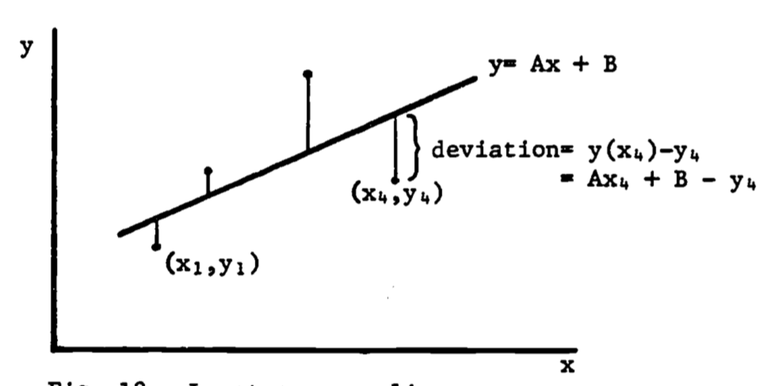

---
output:
  pdf_document: default
  html_document: default
---
# Calculus-Integration. {#calcint}

author: Hertzberg, R. H.

## PREFACE
Frequently in the application of calculus to ecological problems, relationships between measured quantities involve rates of change of the quantities of interest, rather than the quantities themselves. Stated in mathematical terms, it is possible to determine derivatives of functions instead of the functions themselves. It is then necessary to use an inverse operation on the derivative to determine the desired function. This operation is called integration. Each function's behavior used in this module is comparable to characteristics of the ecosystem it represents. Topics are introduced and extended in the problem sets and computer exercises.

## INTRODUCTION

Most applications of calculus to ecological problems involve the determination of specific relationships between measured quantities. Frequently, the obvious relations involve rates of change of the quantities of interest, and not the quantities themselves. In mathematical terms, we often can determine equations involving the derivatives of functions instead of the functions themselves. We then need to use an inverse operation on the derivative to determine the desired function. This operation is called **integration** and its field of mathematical study is called integral calculus.

For example, we may wish to know the blood level of a toxic material that is absorbed through the skin during a certain time period. However, the mathematical model may be based on the rate of absorption through the skin and rate of excretion via the urine. Thus we wish to know the magnitude of a quantity (body level of pollutant) when we know only the rate of change of that quantity (rate of increase by absorption and rate of decrease by excretion).


## FUNDAMENTALS

The inverse operation to differentiation is called **antidifferentiation** or, more commonly, **integration**. In models of exponential growth we assume that the growth **rate** is proportional to the population size.

\begin{equation}
\frac{dN}{dt} = kN
(\#eq:calcint-calcint-1)
\end{equation}

where $N$ is the population size, $t$ is time and $k$ is a proportionality constant. We could solve for $N$ as a function of time by integrating the derivative. However, we know that the exponential function is the only function which equals its derivative. 

$$\frac{d(e^t)}{dt} = e^t$$

Thus, we can modify the function to give the solution 

$$N = N_0 e^{kt}$$

since differentiating $N_0 e^{kt}$ gives eqn. \@ref{eq:calcint-calcint-1}. 

$$\frac{dN}{dt} = \frac{d(N_0 e^{kt})}{dt} = kN_0 e^{kt} = kN $$

If we write eqn. \@ref(eq:calcint-calcint-1) as

\begin{equation}
\frac{dN}{dt} = kN_0 e^{kt}
(\#eq:calcint-2)
\end{equation}

then the "antidifferentiation" becomes more obvious: find $N$ so that its derivative equals $kN_0 e^{kt}$. If we define 

$$g(t) = kN_0 e^{kt}, \;\;\;\;\;f(t) = N_0 e^{kt} $$

then eqn. \@ref(eq:calcint-2) becomes 

$$g(t) = df/dt$$

Thus $g(t)$ is the derivative of $f(t)$ and, conversely, $f(t)$ is an **antiderivative** of $g(t)$. But there is a slight problem. The antiderivative is not unique. If we define  

$$x(t) = N_0 e^{kt} + 10, \;\;\;\;y(t) = N_ e^{kt} +354  $$

then $x(t)$ and $y(t)$ are also antiderivatives of $g(t)$, as can be checked by differentiating: $dx/dt = g(t), dy/dt = g(t)$. One interpretation of this is that the graphs of $x(t)$ and $y(t)$ have the same slope (derivative) for any given value of $t$. Since the functions differ by only a constant, we can write the general form of the antiderivative as $f(t) + C$ where $C$ can be any constant. We usually write the antiderivative as the **indefinite integral**

\begin{equation}
\int g(t)dt = f(t) + C
(\#eq:calcint-3)
\end{equation}

and call $C$ the **integration constant**. Recall that the term "$dt$" identifies the variable of integration just as it does the variable of differentiation in the derivative $df/dt$.

***

## THE DEFINITE INTEGRAL

The integration constant does not appear if the integral is a **definite integral**, written as

$$A = \int^b_a g(x)dx$$
where $a$, $g$ are called the **limits** of the integral. In this case, the integral is determined by evaluating the antiderivative of $g(x)$ at the values $x = b$, $x = a$ and subtracting. Thus, as with eqn. \@ref(eq:calcint-3), if

$$\frac{df}{dx} = g(x)$$

then

\begin{eqnarray}
\int^b_a g(x)dx &=& [f(x)]^b_a \\
&=& f(b) - f(a)
\end{eqnarray}

Note that the integration constant is not written since it is eliminated through subtraction. If $g(x) = 2x^2$, then $\int g(x)dx = f(x) + C = 2x^3/3 + C$ and

\begin{eqnarray}
\int^b_ag(x)dx = \int^b_a 2x^2dx &=& (2b^3 / 3 + C ) - (2a^3/3 + C) \\ 
&=& 2b^3/3 - 2a^3/3 + C - C \\
&=& f(b) - f(a) \\
\end{eqnarray}

### Area Under the Curve

Whereas the derivative can be used to represent the slope of a curve, the definite integral can represent the area under the curve (specifically, the area between the curve and the horizontal axis). For a curve given by $y = g(x)$, the area ($A$) under the curve from $x = a$ to $x = b$ is written (see fig. \@ref(fig:fig-calcint-1)).

$$ A = \int^b_a g(x) dx$$

```{r fig-calcint-1, echo=FALSE, fig.height=4, out.width = "75%", fig.cap='Area under the curve g(x).'}

```

This use of the definite integral has strong intuitive appeal. Consider the case where $g(x) = 1$ as in figure \@ref(fig:fig-calcint-2).

```{r fig-calcint-2, echo=FALSE, fig.height=4, out.width = "75%", fig.cap='Area of Rectangle.'}

```

The area under $g(x)$ is then 

$$A = \int^b_a g(x)dx = \int^b_a 2 dx = 2 \int^b_a dx = 2(b-a)$$

Thus $\int^b_a dx$ represents the width and $g(x)$ is the height. Thus the definite a integral as area has intuitive meaning: area = height $\times$ width. In general, the same visual identification applies:

```{r fig-calcint-p5, echo=FALSE, fig.height=4, out.width = "25%"}

```

**Example 1**

Diffusion of a gas across a membrane is often described by Fick's Law which states that the rate of transport is proportional to the product of the surface area of the membrane and the concentration gradient. Thus knowledge of the surface area is important. Certain leaves have nearly parabolic edges (fig. \@ref(fig:fig-calcint-3)). The area of the top surface available for transport of water is then found by integrating the parabola function. If the dimensions of the leaf are length = 2a, width = 2b, then the parabola describing one edge is written

$$y(x) = -bx^2/a^2 + b$$

```{r fig-calcint-3, echo=FALSE, fig.height=4, out.width = "75%", fig.cap='Leaf with parabolic edge contours.'}

```

The area of half the leaf is 

$$ \frac{A}{2} = \int^a_{-a} (-bx^2/a^2 + b)dx $$

i.e., the area between the x-axis and the upper curve. Thus we calculate

\begin{eqnarray}
A &=& 2 \int^a_{-a} (-bx^2/a^2 + b)dx \\
  &=& 2[-(b/a^2)x^3/3+bx]^a_{-a} \\
  &=& 2[(-ab/3 + ab ) - (ab/3 - ab)] \\
  &=& 8ab/3 \\
\end{eqnarray}

### Improper Integrals

Occasionally we are interested in long term behavior of a measured quantity. For example, when raw sewage and other chemical pollutants are continually dumped into a lake, one effect is the rapid increase in the number of microorganisms. The resultant high level of organic oxidation from metabolism of the sewage can lead to extreme oxygen depletion of the lake, with obvious detrimental effects on other aquatic life (Dugan 1972). If we know something about the rate of oxygen consumption by the microorganisms, then we obtain the amount of oxygen consumed during a time period $T$ by integrating the rate over that time period, i.e., using, a definite integral with limits 0, $T$. We then estimate the maximum oxygen depletion by integrating over an infinite time interval. Such a definite integral with at least one infinite limit is called an **improper integral**.

**Example 2**

Assume that self-inhibition by the microorganism population causes the oxygen depletion to taper off as time becomes large. One model might be

\begin{equation}
\frac{dC}{dt} = te^{-t^2} + e^{-t}
(\#eq:calcint-4)
\end{equation}

where $C$ represents the quantity of oxygen consumed. A graph of $dC/dt$ looks like figure \@ref(fig:fig-calcint-4).

```{r fig-calcint-4, echo=FALSE, fig.height=4, out.width = "75%", fig.cap='Rate of oxygen consumption.'}
knitr::include_graphics('figures/fig-calcint-4.png')
```

The total amount of oxygen consumed by time $T$ is then found by integrating eqn. \@ref(eq:calcint-4). 

$$C(T) = \int^T_0 (te^{-t^2} + e^{-t}) dt $$

The maximum depletion is then found by letting $T$ increase to $\infty$. 

$$C(\infty) = \lim_{T \rightarrow \infty} \int^T_0 (te^{-t^2} + e^{-t}) dt $$
With most nicely behaved models, we can evaluate $C(\infty)$ directly. The above integral is then written

\begin{equation}
C(\infty) = \int^\infty_0 (te^{-t^2} + e^{-t}) dt
(\#eq:calcint-5)
\end{equation}

and is evaluated as with previous definite integrals.

Some functions are not "nicely behaved" and certain integrals cannot be evaluated directly. If we desired to evaluate the circumference $C$ of a tube with circular cross-section by using.an integral (instead of the well-known formula $C = 2 \pi r$) we can encounter difficulties. For one-quarter of the circle (fig. \@ref(fig:fig-calcint-5)) the arc-length is given by (Schwartz 1974, p. 634)

$$ L = \int^r_0 \frac{r}{\sqrt{r^2-x^2}} dx$$

where $r$ is the radius. The integrand is infinite at $x=r$ (fig. \@ref(fig:fig-calcint-6)). However, we can evaluate the integral by taking the limit of another integral:

\begin{eqnarray}
L &=& \lim_{a \rightarrow r} \int^q_0 \frac{r}{\sqrt{r^2-x^2}} dx \\
&=& \lim_{a \rightarrow r} [r \sin^{-1} (x/r) ]^a_0 \\
&=& \lim_{a \rightarrow r} [r \sin^{-1} (a/r) ] = r\pi/2 \\
\end{eqnarray}

```{r fig-calcint-5, echo=FALSE, fig.height=4, out.width = "75%", fig.cap='The quarter-circle, $y=\\sqrt{r^2 -x^2}$'}

#x=seq(0,10,0.1)
#r=5
#plot(x, sqrt(r^2-x^2), type="l")

```

```{r fig-calcint-6, echo=FALSE, fig.height=4, out.width = "75%", fig.cap='Integrand of arc-length formula, $y=r/ \\sqrt{(r^2 -x^2)}$'}

```

***

## METHODS OF INTEGRATION

Since there are no foolproof formulae that can be used for all integrals (as there are for derivatives), the following integration methods all attempt to change a difficult integral into a simpler one. All examples use definite integrals.

### Substitution

This method substitutes each part of a definite integral with a counterpart so that the result is kept the same. With the substitution $u = h(x)$, the integral 

$$\int^b_a f(x)dx$$

becomes transformed into 

$$\int^{h(b)}_{h(a)}g(u)du$$
where $g(u)du = f(x)dx$. Thus the integrand, $dx$, and the limits have been transformed into equivalent counterparts. We obtain $g(u)$ by finding the inverse function $h^{-1} (u)$ so that

\begin{eqnarray}
x &=& h^{-1}(u) \\
dx &=& \frac{d[h^{-1}(u)]}{du} du \\
g(u)du &=& [f(x)][dx] \\
g(u) &=& [f(h^{-1}(u))][\frac{dh^{-1}(u)}{du}] \\
\end{eqnarray}

Often, $h(x)$ appears explicitly in the integrand so that $u$ is substituted directly.

**Example 3**

The problem presented above on the oxygen depletion due to sewage dumping can now be solved. The integral in eqn. \@ref(eq:calcint-5) is first separated.

\begin{equation}
\int^{\infty}_0(te^{-t^2} +e^{-t}) dt = \int^{\infty}_0 te^{-t^2}dt + \int^{\infty}_0|e^{-t}dt
(\#eq:calcint-6)
\end{equation}

The antiderivative of $te^{-t^2}$ is not obvious, so we substitute a new function into the integral. Let $u = t^2$. Then the differential $du$ is 

$$du = (du/dt)dt = 2tdt$$
so that 
$$\frac{du}{2} = tdt$$
The limits remain, since $u = 0$ when $t = 0$ and $u = \infty$ when $t = \infty$. Direct substitution then gives

\begin{eqnarray}
\int^{\infty}_0 te^{-t^2}dt &=& \int^{\infty}_0e^{-t^2}(tdt) \\
&=& \int^{\infty}_0 e^{-u} (\frac{du}{2}) = \frac{1}{2} \int^{\infty}_0 e^{-u}du \\
&=& \frac{1}{2} [-e^{-u}]^{\infty}_0 = \frac{1}{2}[0-(-1)] \\
&=& \frac{1}{2} \\
\end{eqnarray}

Since the second term in eqn. \@ref(eq:calcint-6) is now obvious $\int^{\infty}_0 e^{-u}du = \int^{\infty}_0 e^{-t}dt=1$, we obtain the solution to eqn. \@ref(eq:calcint-5) of
$$C(\infty) = 1/2 + 1 = 3/2$$

### Integration by Parts

This method utilizes a relation from differential calculus concerning the total differential. Recall that the differential of a product of two functions $u(x)$, $v(x)$ can be written 
$$d(uv) = udv + vdu$$ 
If we evaluate antiderivatives, we obtain

\begin{equation}
uv = \int udv + \int vdu
(\#eq:calcint-7)
\end{equation}

Rearrangement of eqn. \@ref(eq:calcint-7) gives the integration by parts formula
$$\int udv = uv - \int vdu$$
With definite integrals, we usually write this formula as

\begin{equation}
\int^b_a [u(x)\frac{dv}{dx}]dx = [uv]^b_a - \int^b_a [v(x)\frac{du}{dx}]dx
(\#eq:calcint-8)
\end{equation}


Again, the goal is to change a difficult integral, the left side of eqn. \@ref(eq:calcint-8), into a simpler one, the right side of eqn. \@ref(eq:calcint-8). An example is presented later.

### Partial Fractions

When the integrand is a ratio of two polynomials, it often can be decomposed into a sum of simpler terms. Only the case of non-repeated linear terms in the denominator is treated here. For more complicated cases in an ecological setting, see Clow and Urquhart (1974) p. 559.

The integrand is assumed to be of the form $F(x)/G(x)$ where $F(x)$ and $G(x)$ are polynomial functions and where $G(x)$ is the product of linear factors. For example,
$$G(x) = (1 + 2x)(2 + 2x)(1+x)$$
is a polynomial composed of factors linear in $x$. The partial fraction technique replaces the single rational expression by a sum of terms where each denomination is one of the linear factors of $G(x)$. If we have two linear factors,
$$G(x) = A(x)B(x)$$
then a partial fractions decomposition gives
$$\frac{F(x)}{G(x)} = \frac{F(x)}{A(x)B(x)} = \frac{C_1}{A(x)} + \frac{C_2}{B(x)}$$
where $C_1$ and $C_2$ are constants. Multiplication by $A(x)B(x)$ gives

\begin{equation}
F(x) = C_1B(x) + C_2A(x)
(\#eq:calcint-9)
\end{equation}


Let $r_1, r_2$ be zeros of $A(x), B(x)$, respectively, i.e. $A(r_1 ) = B(r_2 ) = 0$. Then, with $x = r_1$, eqn. \@ref(eq:calcint-9) is 
$$F(r_1) = C_1 B(r_1)$$ 

and with $x = r_2$, eqn. \@ref(eq:calcint-9) becomes 
$$F(r_2) = C_2 A(r_2)$$
so that $C_1,C_2$ can be easily determined.

**Example 4**

The logistic growth model for animal populations is represented as a  differential equation 
$$\frac{dN}{dt} = rN(1 - N/K), \;\;\;\text{where }\; r,K = \mbox{constant}$$

Separating variables (see the section, Differential Equations) gives, using the differentials $dN$ and $dt$, 
$$\frac{dN}{N(1 - N/K)} = rdt$$
which is integrated to yield the equation

\begin{equation}
\int \frac{dN}{N(1 - N/K)} = \int rdt
(\#eq:calcint-10)
\end{equation}


The right side of eqn. \@ref(eq:calcint-10) is easily integrated. The left side, however, must be reworked. First rewrite the integral as 
$$\frac{1}{N(1 - N/K)} = \frac{K}{N(K-N)}$$

Now expand in partial fractions as 
$$\frac{K}{N(K-N)} = \frac{a_1}{N} + \frac{a_2}{K-N}$$ 
Multiplying both sides by $N(K - N)$ gives

\begin{equation}
K = a_1(K - N) + a_2N
(\#eq:calcint-11)
\end{equation}


Since \@ref(eq:calcint-11) must hold for all values of $N$ (Clow and Urquhart 1974, p. 562), then setting $N = 0$ gives 
$$a_1 = 1$$
and $N = K$ gives 

$$a_2 = 1$$
so that  
$$\frac{K}{N(K-N)} = \frac{1}{N} + \frac{1}{K-N}$$
Then eqn. \@ref(eq:calcint-10) is
$$\int \frac{dN}{N} + \int \frac{dN}{K-N} = \int rdt$$
which integrates to

$$ln N - ln (K-N) = rt + C$$

***

## APPLICATIONS OF DEFINITE INTEGRALS

Direct applications of integrals generally fall into discrete categories in contrast to applications of derivatives which usually are based on slopes. The first group discussed below uses the integral as the accumulation of changes in the function. The second category uses the integral as an area or generalized volume. The last application is more mathematical, although it actually relies on the accumulation concept, and uses the integral to estimate the error in a given approximation.

### Accumulation of Changes in the Function

The integral as a total accumulation has been presented before in example 2 on oxygen depletion. This use of the integral is actually fairly intuitive. Let us call our quantity of interest $F(x)$. Then $F'(x) = dF/dx$ is certainly the rate of change of $F(x)$ and $F(x)$ is certainly the antiderivative of $F'(x)$. Then integrating the **rate** of change of $F$ gives the **total** change in $F$.

$$\int^b_a F'(x)dx = F(x)]^b_a =  F(b) - F(a)$$
Thus the definite integral

$$\int^b_a F'(x)dx$$
is the total change in $F(x)$ as $x$ changes from $a$ to $b$.

### Average Change

The average change in $F(x)$ is then found by dividing by the change in $x$, since the average is the change in $F$ **per unit change** in $x$. Note that this formula can be shown graphically as the average height of the function. For a given curve, the area under the curve equals the average height multiplied by the width. Thus the average height $\overline y$ of a curve $y = f(x)$ is the area $A$ divided by the width.
$$A = \int^b_a f(x)dx = (b-a)\overline y$$
$$\overline y = \frac{A}{b-a} = \frac{1}{b-a} \int^b_a f(x)dx$$

**Example 5**

An interesting example is a study (Fisher 1963 in Warren 1971, pp. 161-163) of the effects of dissolved oxygen content and food ration on the growth rate of Coho salmon. The data appear in figure \@ref(fig:fig-calcint-7). The upper curve is well approximated by

\begin{equation}
y = 7.3 (x + 3.5) e^{-0.05x}
(\#eq:calcint-12)
\end{equation}

The lower curve is the straight line 
$$y = 28$$
here $y$ = growth rate, $x$ = dissolved oxygen. A simple comparison of the effect of diet (restricted vs. unrestricted ration) on growth rate is to compare the average growth rates ($\overline y$) for the two diets. Since the lower curve has a constant growth rate, we must have $\overline y = 28$.

```{r fig-calcint-7, echo=FALSE, fig.height=4, out.width = "75%", fig.cap='Relationships between dissolved oxygen concentration and growth rate of juvenile coho salmon when food was unlimited and when it was limited. Arrows indicate growth of fish when held at oxygen concentrations fluctuating diurnally between levels specified. Data of Fisher (1963), in Warren, 1971, p. 162.'}

```

\begin{eqnarray}
\overline y = \frac{1}{27} \int^{30}_3 28dx &=& \frac{1}{27}[28x]^{30}_3 = \frac{1}{27}[(28)(30)-(28(3))] \\
&=& \frac{1}{27}(28)(27)=28 \\
\end{eqnarray}

For the upper curve,
\begin{eqnarray}
\overline y &=& \frac{1}{27} \int^{30}_3 7.3(x + 3.5)e^{-0.5x}dx \\
&=& \frac{7.3}{27} \int^{30}_3 3.5e^{-0.5x}dx + {\frac{7.3}{27}}\int^{30}_3 xe^{-0.05x}dx \\
&=& 0.95 \int^{30}_3 e^{-0.5x}dx + 0.27\int^{30}_3 xe^{-0.05x}dx \\
\end{eqnarray}

The first integral is the same form as in previous examples.
$$0.95 \int^{30}_3 3.5e^{-0.5x}dx = 0.95[-\frac{1}{0.05} e^{-.05x}]^{30}_3$$
$$= 19(-e^{-0.05(30)}+e^{-0.05(3)}) =12.07$$

Rather than finding the second integral in tables, we will evaluate it using **integration by parts**.

With $dv(x)$ representing the differential of $v(x)$, the second integral can be written
$$\int^{30}_3 xe^{-0.05x}dx = \int^{30}_3 u(x)dv(x)$$
where $u(x) = x, dv(x) = e^{-0.05x}dx$.

Recall that integration by parts uses the formula
$$\int udv = uv - \int vdu$$
Since $du = dx$, and $v = \int dv = -e^{-0.05x}/0.05$, we get

\begin{eqnarray}
\int^{30}_3 xe^{-0.05x}dx &=& [{\frac{-xe^{-0.05x}}{0.05}}]^{30}_3 - \int^{30}_3 \frac{-e^{-0.05x}}{0.05}dx \\
&=& \frac{1}{0.05} \bigg([-30e^{-1.5}+3e^{-0.15}]-[{\frac {e^{-0.05x}}{0.05}}^{30}_3]\bigg) \\
&=& 20[-30e^{-1.5}+3e^{-0.15} + \frac{e^{-0.15}}{0.05} - \frac{e^{-1.5}}{0.05} = 173.04 \\
\end{eqnarray}

Thus,
$$\overline y =  12.07 + 0.27(173.04) = 58.8$$
In summary, we have the averages:


|**ration**|**average growth rate**|
|---|---|
|restricted|29.3|
|unrestricted|58.8|


It is somewhat surprising that the average unrestricted ration rate is over twice that of the rate for the restricted ration. The data is deceptive visually due to the close values near $x = 3 mg/l$ and the distorted logarithmic scale. 

### Distance

Velocity is defined as the rate of change of position. Since the distance covered is the total change in position, it must equal the integral of the velocity. 

For a free-falling object, the velocity is given by $v(t) = g \cdot t$ where $g$ is the acceleration due to gravity and $t$ is time elapsed. The distance $S$ covered after $T$ seconds is given by $S = \frac{1}{2} gT^2$ which is merely the integral of velocity.

\begin{eqnarray}
S &=& \int^T_0 v(t)dt = \int^T_0 (gt)dt \\
&=& g \int^T_0 t \, dt = g[t^2/2]^T_0 \\
&=& \frac{1}{2}gT^2 \\
\end{eqnarray}

### Volumes

Volumes and areas of complicated regions are also evaluated using the definite integral. Previously, the area under a curve was bounded by three straight perpendicular lines. When the bottom is not the base axis, the integration is still simple. For a region shown in figure \@ref(fig:fig-calcint-8) the area is the difference between the area under curve $f$ and the area under curve $g$. Thus

\begin{eqnarray}
A &=& \int^b_a f(x)dx - \int^b_a g(x)dx \\
&=& \int^a_b [f(x)-g(x)]dx \\
\end{eqnarray}

Note that $[f(x)-g(x)]$ is merely the height of the region at the point $x$, so the height times width interpretation is still applicable.

```{r fig-calcint-8, echo=FALSE, fig.height=4, out.width = "75%", fig.cap='Area between two curves.'}

```

### Surface Area of Revolution

When the region is not planar, the evaluation of its area must take into account the changes in the third dimension. If the surface is obtained by revolving a curve around a straight line, the evaluation needs only a single integral. The following example illustrates the method.

**Example 6**

One study of temperature regulation in mammals requires knowledge of the surface area exposed to the sun. The model views the torso of the animal as symmetric with respect to a longitudinal axis. Each vertical cross-section is then a circle. The simplest such approximation is a cylinder:
```{r fig-calcint-8a, echo=FALSE, fig.height=4, out.width = "50%"}

```

The cylinder can be described by revolving a straight line around the axis, as in figure \@ref(fig:fig-calcint-9).

```{r fig-calcint-9, echo=FALSE, fig.height=4, out.width = "75%", fig.cap='Surface area of revolution: a cylinder.'}

```

Unrolling the surface gives a rectangle whose width equals the circumference of the circular end face of the cylinder. This **surface area of revolution** equals the line length multiplied by the width, thus $A=2\pi r\:l$ (fig. \@ref(fig:fig-calcint-10))

```{r fig-calcint-10, echo=FALSE, fig.height=4, out.width = "25%", fig.cap='Surface of unrolled cylinder.'}
knitr::include_graphics('figures/fig-calcint-10.png')
```

As with the area under a curve, the general formula for a surface area of revolution must be intuitive, i.e., must visually appear as length times circumference. Let the torso have a profile of varying radius:

```{r fig-calcint-10a, echo=FALSE, fig.height=4, out.width = "50%"}

```

Assume the line to be revolved is graphed as follows,

```{r fig-calcint-10b, echo=FALSE, fig.height=4, out.width = "50%"}

```

and is represented by $r = a - bx^2$, $a$ and $b$ positive constants. The radius then changes with $x$, and the integral must be used:
```{r fig-calcint-10c, echo=FALSE, fig.height=4, out.width = "25%"}

```

In this example, let $x_0 = 0.5m$, $a = 0.28$, $b = 0.24$. The total surface area is 

\begin{eqnarray}
A &=& \int^{0.5}_{-0.5} 2 \pi(0.28-0.24x^2)dx \\
&=& 2 \pi [0.28x - \frac{0.24}{3} x^3]^{0.5}_{-0.5} \\
&=& 1.63 m^2 \\
\end{eqnarray}

Note that any function will work in the formula, as long as the area desired is a surface area of revolution. The only problem might be in using a function which is difficult to integrate.

### Volume of Revolution

The volume of a solid generated by revolving a curve around an axis can be derived as an intuitive extension of the surface area of revolution. The area and volume formulae for the cylinder and the general revolved solid (figure \@ref(fig:fig-calcint-11)) are seen to be analogous.

| |Cylinder|Revolved solid|
|---|---|---|
|Surface area| $2\pi r^2 l$|$\int^l_0 2\pi f(y)dy$|
|Volume| $\pi r^2 l$| $\int^l_0 \pi[f(y)]^2 dy$|

```{r fig-calcint-11, echo=FALSE, fig.height=4, out.width = "75%", fig.cap='Solids of revolution.'}

```

Now we develop the general volume formula by expressing the integral as a limit of sums of pieces of the solid. Consider a curve $z = f(y)$ and the region $R$ under the curve (figure \@ref(fig:fig-calcint-12)). We revolve the region $R$ around the y-axis (figure \@ref(fig:fig-calcint-13)) to obtain the solid.

```{r fig-calcint-12, echo=FALSE, fig.height=4, out.width = "50%", fig.cap='The function f(y).'}

```

```{r fig-calcint-13, echo=FALSE, fig.height=4, out.width = "50%", fig.cap='The solid obtained by revolving f(y).'}

```

Suppose we divide the interval $[a,b]$ into many subintervals, each of width $dy$. Then, if $dy$ is sufficiently small, the area of the subregion $R_i$ is well approximated by a rectangle of width $dy$ and height $f(y_i)$, as figure \@ref(fig:fig-calcint-14) indicates. By revolving $R_i$ about the y-axis, we sweep out a circular slab with radius $f(y_i)$ and thickness $dy$ (figure \@ref(fig:fig-calcint-15)).

```{r fig-calcint-14, echo=FALSE, fig.height=4, out.width = "50%", fig.cap='The area increment dy.'}

```

```{r fig-calcint-15, echo=FALSE, fig.height=4, out.width = "50%", fig.cap='The volume element obtained by revolving dy.'}

```

The volume of each slab is $\pi (radius)^2(length) = \pi f(y_i)^2dy$. Thus we have volume $V$ of the solid as

\begin{eqnarray}
V &=& \lim_{dy \rightarrow 0} \sum^N_{i=1} \pi f(y_i)^2dy, \;\;\;\;\;\; N= (b-a)/dy \\
&=& \int^b_a \pi f(y)^2 dy \\
\end{eqnarray}

### General Surface Areas

When the surface is more irregular and is not axially symmetric, its area can still be found. The surface must now, however, be described by a three dimensional function which gives the height as a function of the length and width coordinate: $z = f(x,y)$. 

```{r fig-calcint-15a, echo=FALSE, fig.height=4, out.width = "50%"}
knitr::include_graphics('figures/fig-calcint-15a.png')
```

The dependence on two variables requires two integrals, and the method used is called **double integration**.

Given a function of two variables, say $z = f(x,y)$, we can write a **double integral** of $z$ over a region $R$ as:
$$F = \int_R \int f(x,y)dA $$
with $A$ representing the area coordinates from the region $R$. This integral is more often evaluated by writing it as an **iterated double integral**:

$$F = \int^b_a \int^{h(x)}_{g(x)} f(x,y) dy dx = \int^b_a \bigg[ \int^{h(x)}_{g(x)} f(x,y)dy \bigg] dx$$


Evaluation of the "inner" integral yields a function of $x$, which becomes the integrand of the "outer" integral. ^[Note that the order of integration can be reversed when $f(x,y)$ is continuous in $x$ and $y$.]

When the surface is described by $z = f(x,y)$, its area is found using an iterated integral. The limits of integration are found by projecting the boundary of the surface onto the x,y plane. The formula for the surface area is ^[see Ayres (1964), p.319.]
$$A = \int^b_a \int^{h(x)}_{g(x)} [1 + (\frac{\partial z}{\partial x})^2 +(\frac{\partial z}{\partial y})^2]^{\frac{1}{2}} dy dx $$

and is best illustrated by example.

**Example 7**

If the animal is again considered to look like a cylinder, one improvement would be to account for the neck rising at an angle from the shoulder. To keep the calculations simple, we assume the neck rises vertically, and is also cylindrical (figure \@ref(fig:fig-calcint-16)).

```{r fig-calcint-16, echo=FALSE, fig.height=4, out.width = "75%", fig.cap='Half of the upper surface.'}

```

We determine the area of the torso by subtracting the "back" area inside the vertical cylinder, $A$, from the area of the horizontal cylinder, which we found was $0.25 \pi$. The equation for the "back" surface is $x^2 + z^2 = (0.25)^2$. The vertical cylinder is defined by $x^2 + y^2 = (0.10)^2$. The projection is then half a circle of radius 0.10 (figure \@ref(fig:fig-calcint-17)), and is given by $y = \sqrt {0.10^x - x^2}$.

```{r fig-calcint-17, echo=FALSE, fig.height=4, out.width = "50%", fig.cap='Projection of the "neck" region.'}

```

For a given $x$, $y$ varies from 0 up to $\sqrt {0.10^x - x^2}$ . The limits on $x$ are -0.10 to 0.10. The equation for the surface of the back yields the required partial derivatives:
$$ \frac{\partial z}{\partial x} = - \frac{x}{\sqrt{0.25^2 - x^2}},\;\;\; \frac{\partial z}{\partial y} = 0  $$
$$A = \int^{0.10}_{-0.10} \int^{\sqrt{0.10^2-x^2}}_0 [1 + \frac{x^2}{0.25^2 - x^2} + 0] dy \, dx$$
This strange formula still has visual intuitive appeal since the limits on $y$ are obtained from the **width** in the $y$ direction (for a given $x$) and the limits on $x$ are from the **length** in the $x$ direction. The quantity in brackets accounts for the changing height of the surface. The remaining parts of the problem are left as an exercise.

### Error Estimation

The integral can be used to develop approximate solutions to certain equations or approximate models of given data. The integral provides a qualitative error estimate for the approximation. The most well known application is the least squares fit of a line through a set of data points. One of the most recent applications is the residual norm as an error indicator for approximate solutions to partial differential equations. In each example discussed below, a function is integrated over a domain of interest. If this function represents the difference between the approximate and true solution, then the value of the integral decreases as the approximation improves. The integral is then minimized to provide the "best" approximation.

#### Least Squares

Many experiments produce data as pairs of numbers
$$(x_1,y_1),(x_2,y_2), \ldots, (x_n,y_n)$$
The underlying relationship is often assumed to be linear, that is, the model is assumed to be
$$y = Ax + B, \text{ where }A,B = \text{constants}$$
The points ($x_i,y_i$) are usually not collinear (see figure \@ref(fig:fig-calcint-18)) due to experimental error, inaccuracies in the model, round-off error during measurement, etc. Thus the problem is to choose the constants $A,B$ so the line matches the data points as closely as possible. The method of least squares uses the sum of squared deviations for the error function, $E^2$ (see figure \@ref(fig:fig-calcint-18)):

\begin{equation}
E^2 = \sum^n_{i=1} [y(x_i)-y_i]^2
(\#eq:calcint-13)
\end{equation}

where $y(x_i) = Ax_i + B$. The goal is then to choose $A$, $B$ so that $E^2$ is minimal. By writing $E^2$ as a function of the parameters $A$, $B$, we minimize $E^2$ by setting the partial derivatives equal to zero:
$$\frac{\partial E^2}{\partial A} = 0,\;\; \frac{\partial E^2}{\partial B} = 0$$

```{r fig-calcint-18, echo=FALSE, fig.height=4, out.width = "75%", fig.cap='Least-squares line.'}

```

We then obtain two linear equations in $A$, $B$ which are easily solved (see problem 5) and can be shown to give the line with the least sum of squared deviations (see problem 6).

#### Norms

The squared deviation used in the least squares method is an example of a **norm**. A norm of a function $f(x)$, denoted $\|f(x)\|$, is a function (Pearson 1974, p. 946) such that, for any scalar $\alpha$, and any functions $f(x), g(x)$,
$$\|f(x)\| \ge 0$$
$$\|f(x)\| = 0$$ 
if and only if $f(x) = 0$
$$\| f (x) \| = |\alpha| \cdot \| f (x) \|$$
$$\| f (x) + g(x) \| \le \| f (x) \| + \|g(x) \| $$

When a curve $y = f(x)$ is approximated by a least-squares straight line $y = Ax + B$ over the interval $[a,b]$, we choose $A$, $B$ to minimize the error norm $E$ defined by

\begin{equation}
 E^2 = \int^b_a [Ax + B - f(x)]^2 dx
(\#eq:calcint-14)
\end{equation}

Note that equation \@ref(eq:calcint-13) is a discrete analog of equation \@ref(eq:calcint-14).

The norm can be used for evaluating the closeness of fit of one curve to another, or for obtaining a qualitative estimate of the accuracy of an approximate solution to an equation. The $L_p$ norm of a function $f(x)$ is defined as
$$L_p (f(x)) = \| f(x)\|_\rho = \bigg[\int^b_a |f(x)|^P dx\bigg]^{1/p}   $$

The least squares norm $E$ is in fact $L_2 (f(x))$, since
$$\| f(x) \|_2 = \bigg[ \int^b_a |f(x)|^2 dx\bigg]^{1/2}$$
and thus
$$E^2 = [\|f(x)\|_2]^2 = [L_2(f(x))]^2$$

**Example 8**

An interesting comparison is between the line fitted to the data points of example 5 and the line fitted to the smooth exponential curve of eqn. \@ref(eq:calcint-12), rewritten as follows.

\begin{equation}
y_1 = 7.3 (x + 3.5) e^{-0.05x}
(\#eq:calcint-15)
\end{equation}

We can approximate this function with a linear function, 

\begin{equation}
y_2 = Ax + B
(\#eq:calcint-16)
\end{equation}

by choosing $A$ and $B$ to minimize the $L_2$ (least squares) norm of the difference between them, $y_1 - y_2$. Denote the norm by
$$E = \|y_1 - y_2\|_2 = [\int^{30}_3 (y_1-y_2) dx]^{1/2}$$
Substituting eqns. \@ref(eq:calcint-15) and \@ref(eq:calcint-16) yields

\begin{equation}
E = [\int^{30}_{3} (7.3[x+3.5]e^{-0.05x} - Ax - B)^2dx]^{1/2}
(\#eq:calcint-17)
\end{equation}

We now minimize $E$ by taking partial derivatives with respect to $A$ and $B$ (see Hertzberg 1977 for a review of differentiation). One first derivative will now be calculated, with the remainder of the minimization left as computer exercise 2.

First, note that the minimum of $E$ occurs at the same values of $A$ and $B$ which minimize $E_2$, since $E$ is positive. The derivative of $E_2$ with respect to $A$ is now attempted. First, we write
$$\frac{\partial(E^2)}{\partial A} = \frac{\partial}{\partial A} \bigg[ \int^{30}_3 f(A,B,x)dx\bigg] $$
where
$$ f(A,B,x) = (7.3[x+3.5]e^{-0.05x}-Ax - B)^2$$
Then the derivative is calculated after the integration is completed, which is not a simple task. It may be easier to differentiate under the integral sign first, and then integrate the result.

**Theorem** (Pearson 1974, p. 100).

Let $f(x,y)$ be an integrable function of $x$ for each $y$, and let $\partial f / \partial y$ be continuous over $a \le x \le b, c \le y \le d$. Then
$$\frac{d}{dy} \int^b_a f(x,y)dx = \int^b_a (\partial f / \partial y)dx$$

Thus we evaluate:

\begin{equation}
\frac{\partial (E^2)}{\partial A} = \int^{30}_3 \frac{\partial f}{\partial A} dx \\ 
 = \int^{30}_3 2(7.3[x+3.5]e^{-0.05x}-Ax-B)(-x)dx
(\#eq:calcint-18)
\end{equation}

which can now be integrated (computer exercise 2).

No justification has yet been given for the constants in eqn. \@ref(eq:calcint-15). These, too, may be determined by a least squares norm. See computer exercise 1 for details.

The norm can also be used to estimate qualitatively the relative accuracies of approximate solutions to a differential equation. The limits are determined as above by the interval in which the accuracy is to be judged. An example is presented in the next section.

***

## DIFFERENTIAL EQUATIONS

As was previously mentioned, the integral is also used to solve a differential equation. In the simplest form, if an equation is written as
$$\frac{dx}{dt} = f(t)$$
then the solution (general solution) is
$$x(t) = \int f(t)dt$$
If we know the value of $x$ at $t = 0$, the **initial condition**, then the differential equation has a unique solution given by
$$x(t) = \int^t_0 f(\tau)d \tau + x(0)$$

### Separation of Variables

When the differential equation also involves $x$ on the right-hand side, the solution is not so easily represented. Other techniques must then be employed to represent the problem by a set of integrals whose integrands are functions of only the variable of integration. One such technique is separation of variables.

**Example 9**

Let us return to example 4. The equation is

\begin{equation}
\frac{dN}{dt} = rN(1 - N/K)
(\#eq:calcint-19)
\end{equation}

The simple representation given above fails here:
$$N(t) = \int rN(1 - N/K)dt$$
To integrate, we need to know $N$ as an explicit function of $t$, which of course we do not know. However, by multiplying both sides of eqn. \@ref(eq:calcint-19) by the differential $dt$, we obtain
$$dN = rN(1 - N/K)dt$$

and by dividing by $N(1 - N/K)$ we successfully separate the variables $N$, $t$ on either side of the equality:
$$\frac{dN}{N(1- N/K)} = rdt$$

Integration is now possible since each integrand is a function of just the variable of integration.
$$\int \frac{1}{N(1- N/K)} dN = \int rdt$$

How are initial conditions incorporated now? Since the indefinite integral produces an integration constant, the constant is determined by the initial condition, making the general solution unique.

**Example 10**

A recent study on water purification (Dickson, et al, 1977) included the mortality of fish due to intermittent chlorination. The following data were obtained (Table A) where frequency is the number of doses per 24 hours.

> Table A. Fish Mortality Due to Intermittent Chlorination

| Mortality | Frequency | Duration (hr) |
|:---------:|:---------:|:-------------:|
|     0.01    |     1     |      1.5      |
|           |     2     |      0.7      |
|           |     4     |      0.3      |
|    0.10    |     1     |      3.2      |
|           |     2     |      1.4      |
|           |     4     |      0.7      |
|    0.20    |     1     |      4.3      |
|           |     2     |      2.0      |
|           |     4     |      0.9      |
|    0.50    |     1     |      7.5      |
|           |     2     |      3.4      |
|           |     4     |      1.6      |


A mathematical model has been devised which shows the effect of duration ($T$) and frequency ($F$) on mortality ($M$) using two differential equations: 

\begin{equation}
\partial M / \partial T = a_1T^{1.5}
(\#eq:calcint-20)
\end{equation}


\begin{equation}
\partial M / \partial F = a_2 F^{1.8}
(\#eq:calcint-21)
\end{equation}

where $a_1$ is a function of $F$ and $a_2$ is a function of $T$. Another model was derived by curve fitting, using Table A and is quite different. For a given $M$,

\begin{equation}
ln(T)=b_1 - b_2 \ln F
(\#eq:calcint-22)
\end{equation}


where it is now assumed that $b_1$ is a function of $M$:
$$b_1 = 2.16 + 0.40 \ln M$$

Can both of these models hold? Are they consistent? We can answer this by integrating the first model to derive a single expression for $M$ as a function of $F, T$. Each equation \@ref(eq:calcint-20), \@ref(eq:calcint-21) involves a single partial derivative, so that one of the variables can be assumed constant. By holding $F$ constant, we integrate eqn. \@ref(eq:calcint-20) to obtain
$$M = (a_1/1.5)T^{2.5} + C_1$$
which is more precisely written, with $a_1$ as a function of $F$, as

\begin{equation}
M = \frac{a_1(F)}{1.5}T^{2.5}+C_1
(\#eq:calcint-23)
\end{equation}

Similarly, we integrate eqn. \@ref(eq:calcint-21) with respect to $F$, holding $T$ constant.

\begin{eqnarray}
M &=& \int a_2 F^{1.8} dF = (a_2 / 1.8) F^{2.8} + C_2 \\
&=& \frac{a_2(T)}{1.8} F^{2.8} +C_2 \\
\end{eqnarray}

Thus
$$\frac{a_1(F)}{1.5} T^{2.5} +C_1 = \frac{a_2(T)}{1.8}F^{2.8} +C_2$$ 
 
We assume no observable mortality if no chlorination occurs, so that, if $F = 0$ or $T = 0$, then $M = 0$. Thus $C_1= C_2 =0$.
$$\frac{a_1(F)}{1.5} T^{2.5} = \frac{a_2(T)}{1.8} F^{2.8}$$
Therefore, we must conclude that
$$a_1(F) = 1.5C F^{2.8}$$
$$a_2(T) = 1.8C T^{2.5}$$
where $C$ is some proportionality constant. From eqn. \@ref(eq:calcint-23) we have

\begin{equation}
M = C F^{2.8} T^{2.5}
(\#eq:calcint-24)
\end{equation}

It is now straightforward to manipulate eqn. \@ref(eq:calcint-22) to look like eqn: \@ref(eq:calcint-24).
$$\ln T = (2.16 + 0.40 \ln M) - b_2 \ln F$$
$$\frac{\ln T + b_2 \ln F - 2.16}{0.40} = \ln M$$
$$\frac{\ln T + ln(F^{b_2}) - \ln(e^{2.16})}{0.40} = \ln M$$
$$2.5 \ln (TF^{b_2}/8.7) = lnM$$
$$\ln[(TF^{b_2} /8.7)^{2.5} ] = \ln M$$
$$T^{2.5} F^{2.5b_2} /(8.7^{2.5} ) = M$$
Thus, $b_2 = 2.8/2.5 = 1.1, \;\;C = 1/(8.7)^{2.5} = 0.0045$ and the models agree.

### Residual Norm

Often a differential equation cannot be solved by any standard methods and an approximate solution is developed. In some cases, bounds on the error in the approximation can be derived. Too often, however, calculating the error bounds is as complicated as determining the solution itself. A recent idea is to use the least-squares norm (or occasionally some other norm) as a gauge of the accuracy of the approximation. With only the differential equation at hand, a new type of norm, the residual norm, is used.

Consider a differential equation written as
$$\frac{dx}{dt} = f(x,t)$$

with initial condition $x(0) = x_0$. If the equation is rewritten as
$$dx/dt - f(x,t) = 0$$

then we obtain an expression which vanishes when the exact solution is used. In operator notation the equation is
$$L(x,t) = 0$$
where $L$ is the differential operator defined by
$$L(x,t) = dx/dt - f(x,t)$$
If $L$ operates on an approximate solution, $\overset\sim x (t)$, then $L(\overset\sim x) \neq 0$, and its value is the **residual**. Yet we would expect $L(\overset\sim x)$ to be small if $x$ is a good approximation. The final step is to decide on some interval over which the approximation's accuracy is to be judged, say $[a,b]$. Then the least-squares residual norm for the approximate solution $\overset\sim x (t)$ is
$$\| R(\overset\sim x) \|_2 = [\int^b_a (L(\overset\sim x,t))^2 dt]^{1/2} $$

Note that $\| R(\overset\sim x) \|_2 =  0$ if the exact solution is used, since $L$ is then 0. This limiting behavior suggests the residual norm as a **qualitative** indicator of the accuracy of an approximate solution. No theory exists, however, for estimating the **actual** error from the value of the residual norm.

**Example 11**

A deer population is threatened by severe storms as well as reduced grazing area due to a small fire. Consequently, a moratorium on deer hunting is imposed until the deer population returns to 60% of the carrying capacity for the area. How long should the moratorium be imposed?

Assumptions are now presented which allow us to model the population dynamics of the deer and estimate the duration of the moratorium. Let the logistic growth model be used:
$$\frac{dn}{dt} = Rn(1-n/K)$$

Assume that the current population size is 400, the carrying capacity ($K$) is 2000, the intrinsic growth rate ($R$) is 1.0 and that the approximate solutions should be fairly accurate for the first three years. Assume also that the moratorium is not obeyed immediately, so that hunting pressure gradually tapers off. Let the growth model with the "harvesting" (i.e. hunting) term be

\begin{equation}
\frac{dn}{dt} = Rn(1-n/K) - e^{-t}n
(\#eq:calcint-25)
\end{equation}


with initial condition $n(0)-n_0$.

Assume also that you do not have access to either a programmable calculator or a computer. This equation cannot be solved by separation of variables (try it), so some approximation must be made. From previous studies, you learn that the following two models have been used fairly successfully to model short term population growth. 

\begin{equation}
n_1(t) = (K-n_0)(1-e^{-Rt/5} ) + n_0
(\#eq:calcint-26)
\end{equation}

\begin{equation}
n_2(t) = n_0 e^{Rt/3}
(\#eq:calcint-27)
\end{equation}

Note that $n_1(t)$ tapers off at the carrying capacity, but $n_2(t)$ is exponential growth for $n_2 \approx 0$; both are properties the exact solution must possess. Which approximation is better? We compare $n_1$ and $n_2$ by evaluating their least-squares residual norms. Rewrite eqn.\@ref(eq:calcint-25) as $L(n) = 0$, where $L(n)$ represents the differential operator acting on $n$:
$$L(n) = dn/dt - Rn(1-n/K) + e^{-t}n = 0 $$

We expect a good approximate solution, $n_a$, to give
$$L(n_a) \approx 0$$
and thus its residual norm should also be small:
$$ \| R(n_a) \|_2 \equiv [\int^T_0 (L(n_a))^2 dt]^{1/2} \approx 0$$
Intuitively, the smaller $\| R \|_2$ is, the better the approximation should be. For this example, assume the following values:
$$K = 2000, \; R=1, \; n_0=400, \; T=3$$

The integrands in $\| R(n_1) \|_2$ and $\| R(n_2) \|_2$ are now calculated. From eqn. \@ref(eq:calcint-26) we obtain, after a few steps,

\begin{equation}
[L(n_1)]^2 = (2000 e^{-t}- 1600 e^{-1.2t} + 1280 e^{-0.4t} -2800 e^{-0.2t} +1600)^2
(\#eq:calcint-28)
\end{equation}

From eqn. \@ref(eq:calcint-27) we obtain

\begin{equation}
[L(n_2)]^2=[ (400/3) e^{t/3} - (1-400 e^{t/3}/2000 -e^{-t}) 400 e^{t/3}]2
(\#eq:calcint-29)
\end{equation}

After multiplying out the square in each equation and collecting terms, we can write both \@ref(eq:calcint-28) and \@ref(eq:calcint-29) as sums of exponential functions, and thus both can be integrated by hand easily (but tediously). The results are, upon integrating over the interval $[0,3]$:
$$\| R(n_1) \|_2 = 661.8$$
$$\| R(n_2) \|_2 = 172.3$$
Figure \@ref(fig:fig-calcint-19) shows the accuracy of the two approximate solutions as compared to a numerical solution to the original differential equation \@ref(eq:calcint-25). It appears that, for the chosen values of $R$, $K$ and $n_0$, the approximation $n_2(t)$ is better, and the residual norm for $n_2$ supports this evaluation. The 60% of carrying capacity, i.e. 1200, is reached in 3.30 years using $n_2(t)$, and in 3.08 years according to the numerical solution $n(t)$. It is interesting that, without the term for hunting (curve $n_0(t)$ in fig. \@ref(fig:fig-calcint-19)), the population reaches the 60% level in only 1.79 years.

```{r fig-calcint-19, echo=FALSE, fig.height=4, out.width = "75%", fig.cap= "Approximate growth functions"}

#MAKE PLOT
```

***

## REFERENCES AND RECOMMENDED TEXTS

**Calculus**

Allen, R. C.,Jr. and Wing, G. M. 1973. Problems for a computer-oriented course. Prentice-Hall, Englewood Cliffs, N. J., 206 pp.

Ayres, F., Jr. 1964. Theory and problems of differential and integralsecond ed., Schaum's Outline Series, McGraw-Hill, New York

Baxter, W. E. and Sloyer, C. W. 1973. Calculus with probability for the life management sciences, Addison-Wesley, Reading, Ma. 648 pp.

Bittinger, M. L. 1976. Calculus: A modeling approach, Addison-Wesley,Reading, Ma.

Clow, D. J. and Urquhart, N. S. 1974. Mathematics in biology, Norton, NewYork, 727 pp.

Coughlin, R. F. 1976. Applied, calculus, Allyn and Bacon, Boston, Ma.

Hertzberg, R. C. 1979. Calculus-differentiation. An instructional module: Physical processes in terrestrial and aquatic ecosystems. Ctr. Quantitative Sci., Univ. Washington, Seattle, 64 pp.

Keisler, H. J. 1971. Elementary calculus: An approach using infinitesimals, Prindle, Weber and Schmidt, Boston, Ma.

Schwartz, A. 1974. Calculus and analytical geometry. Third ed., Holt, Rinehart and Winston, New York, 1140 pp.

Sternberg, W., Walker, R. J. et al. 1968. Calculus, a computer oriented presentation, The Center for Research in College Instruction in Science and Mathematics (CRICISAM), Florida State University, Tallahassee.

**General**

Dickson, K., Cairns, J., Jr., et al. 1977. Effects of intermittent chlorination on aquatic organisms and communities. J. Water Poll. Control Fed., 49, 35-44.

Dugan, P. R. 1972. Biochemical ecology of water pollution. Plenum Press, New York, 159 pp.

Gales, L. 1979. User's guide for subroutine PRNT3D. An instructional module: Physical processes in terrestrial and aquatic ecosystems. Ctr. Quantitative Sci., Univ. Washington, Seattle, 27 pp.

Gold, H. 1977. Mathematicalmodelingof biological systems. Wiley-Interscience,New York, 357 pp.

Handbook of applied mathematics. 1974. C. Pearson, ed. Van NostrandReinhold, New York, 1265 pp.

Warren, C. E. 1971. Biology and water pollution control. W. B. Saunders, Philadelphia, 434 pp.

**Tables**

Handbook of Mathematical Functions, 1964. Abramowitz, M. and Stegun, I., eds., National Bureau of Standards, Applied Mathematics Series, 55, Washington, D.C.

Handbook of Mathematical Tables, 1964. Weast, R. C., Selby, M. and Hodgman, C. D., eds., The Chemical Rubber Co., Cleveland.

***

## PROBLEM SET

**General**

1. An application of both the definite integral and exponential growth is modelling demand for natural resources. Assume $P(t)$ represents the rate of use of a resource at time $t\geq0$, and $P(t)$ represents the rate of consumption at time $t = 0$. The exponential model then gives $P(t) = P_0 e^{kt}$. The constant $k$ can be defined as the rate of increase in the use of this resource. Let $A(T)$ represent the amount of resource used during the interval $[0,T]$, $T\geq0$. 

a. Write the definite integral representing $A(T)$ in terms of a general function $P(t)$. 
b. Evaluate the integral for general $T\geq0$ by substituting the above exponential function for $P(t)$.
c. In 1973 (say $t = 0$), the world use of copper was estimated to be 6.99 x 10^9^ kg, and the demand was increasing at an exponential rate of 8% per year. How many tons of copper will then be used from 1973 to 1983? (Hint: First find $P_0$, $k$, $T$ and then use your answer to b.)
d. If the rate of growth in demand for copper remains at 8% and no new reserves are discovered, when will the world supply of copper be exhausted? Assume the reserves in 1973 are 336 x 10^9^ kg, and no recycling occurs.

2. Five thousand trout, each weighing 80 grams, are planted in a lake. The population size, $N(t)$, declines exponentially according to the equation $N(t) = 5000e^{-0.5t}$ where $t$ is measured in months. Each fish grows according to the formula $W(t) = 10000 (1 - 0.8e^{-0.05t})^3$ where $W$ is the weight in grams. 

a. Check that both $N(t)$ and $W(t)$ satisfy the given initial conditions. 
b. Write the formula for the biomass (total weight of all the planted trout) in the lake as a function of $t$, and calculate the biomass at 12 months. 
c. What is the average biomass for the first 12 months? What was the  initial biomass? Sketch how you think the graph of biomass versus time would appear. Mark on the vertical axis the initial, final and average biomass values. 

3. Assume that a radioactive element disintegrates so that the number ($N$) of atoms present at a given time ($t$) decreases at a rate proportional to $N$ itself. Let $k$ be the constant of proportionality and $N_0$ be the number of atoms present at $t = 0$ (thus $N(0) = N_0$). 
a. With the derivative representing the rate of change of $N$, use the above defined parameters and variables to write an equation for the rate of decrease in the number of radioactive atoms with passing time. 
b. Solve this differential equation for $N(t)$ so that the solution satisfies the initial condition, $N(0) = N_0$. (Hint: first separate variables. Do not forge the integration constant!) 
c. Determine the "half-life" : the time ($t_1$) such that $N(t_1) = 0.5 N_0$. At $t =t_1$, half of the original number of radioactive atoms have disintegrated (decayed). 
d. We now make certain assumptions which will allow us to estimate the age of a piece of wood by radiocarbon dating: 
i) living organic material contains the carbon isotopes $C^{12}$ and in a fixed proportion independent of time, 
ii) the $C^{12}$ atoms do not disintegrate, 
iii) the $C^{14}$ atoms disintegrate radioactively with a half-life of 5568 years, and 
iv) the $C^{12}$ and $C^{14}$ atoms are not replaced once the organism dies, even though the $C^{14}$ atoms are being lost through disintegration. 
A sample of wood in an American Indian cliff dwelling is measured to have 87% of the $C^{14}$ isotope expected in living wood. Estimate the age of the sample.

4. The survival and health of intertidal organisms often depend on the amount of time they are exposed, i.e. not covered by sea water. A given position on the beach can be identified by its tidal height: the height of the tide when the water's edge just touches that spot. A model of tidal height as a function of time can then be used to approximate the length of time between successive high and low tides (or vice versa) during which a position on the beach is exposed. 

The following data were taken from tide tables for Port Townsend, Washington for the day of maximum tide difference for daylight low tides. 

```{r table2, echo=FALSE, results='asis'}
cat('| Time  | Height (m) | 
|-------|------------|
| 4:35  | 2.47       |
| 11:49 | -0.82      |
| 19:40 | 2.77       |')
```

For each of the two times intervals 4:35-11:49, 11:49-19:40, the model uses the following cosine function fitted to the tide data: 
$$H = a \cos (b(T-T_h)) + H_a,\: H_a=\frac{high\:tide + low\:tide}{2}$$ 

a. Sketch by hand a graph of the cosine function with the maximum at the high tide level and a minimum at the low tide level for the first time interval to aid in interpreting the equation. Consider the general form of a cosine function: $y=a \cos(bx+c)+d$, where the amplitude is $|a|$; the period is $2\pi/b$; the phase shift in $-c/b$; and the vertical shift in $d$.  Use this information to determine what the constants a, b, $T_h$ represent in the provides tidal cosine function? Calculate these constants and $H_a$ for each of the two time intervals. 

b. The constant $H_a$ seems to be the average tide height. Verify this for the first time interval by evaluating the appropriate definite integral. Prove that the average height $\overline H$ for the two intervals combined can be written as the weighted average of the average heights $\overline H_1$, $\overline H_2$ for both subintervals. That is, show that (using decimal hours) 

$$\overline H= \frac{1}{15.09} \int^{19.67}_{4.58} H(t)dt= \frac{7.24}{15.09} \overline {H_1} + \frac{7.85}{15.09} \overline H_2$$

c. For a point on the beach at the 0.0 meter tide level, how long is it exposed between these successive high tides? (Hint: find the inverse function T=g(H), but be careful with the second interval.)

**Least Squares**

5. Write equation (13) using $y(x_i) = Ax_i + B$. Evaluate the two first partial derivatives and, by setting both equal to zero, obtain two linear equations in A and B.

6. a. For the following data, derive the "least squares" line and prove that for your choices for A and B, the sum of squares is at a true minimum: 
$$f(x,y) \text{ is at a minimum at } x_o, y_o \text{ if, for } x=x_0, y=y_0 $$
i) $\frac{\partial f}{\partial x}=\frac{\partial f}{\partial y}=0$, 
ii) $\frac{\partial^2 f}{\partial x^2}-\frac{\partial^2 f}{\partial y^2}>0$, and 
iii) $\frac{\partial^2 f}{\partial^2 x}>0$.

Data from figure \@ref(fig:fig-calcint-8) in text
```{r}
x=c(3,5.3,9.6,18,30)
y=c(39,55,57.5,60,57)
```

b. Now determine a "best" exponential fit to the above data. First transform the desired function $y = Axe^{Bx}$ into a linear function (with respect to $x$): $h(x,y) = f(A,B) + g(A,B)x$. A neater format is $h= f + gx$. Make a table of values for $x$ and $h$. Determine the least squares line through this new data set and, in the process, calculate $f$, $g$, and thus $A$, $B$.

### ANSWERS TO THE PROBLEM SET
**General**

1. $A(T)$ represents the total change in the resource. Thus the rate of change, $P(t)$, is integrated:
$$A(T)=\int^T_0 P(t)dt $$
b. With $P(t) = P_0 e^{kt}$,
$$A(T)=\int^T_0 P_0 e^{kt} dt= (P_0/k)(e^{kT}-1) $$
c. The initial use rate in $P_0$, the rate of increase is $k$, and the time interval ends at 1983-1973 = 10 years. Thus
```{r}
P0= 6.99 * 10^9 #kg
k=0.08
T=10.0 #years


#Estimate A(T) in kg
(P0/k)*(exp(k*T)-1)
```
d. We solve for $T$. The total change equals the current reserves (at $t=0$); thus, the parameters are
```{r}
require("stats")
library(stats)

P0= 6.99 * 10^9 #kg
k=0.08
A_T= 336 * 10^9 #kg

#Using A(T)= (P0/k)*(exp(k*T)-1)
#Solve T in years
Tsolve= function(T) (P0/k)*(exp(k*T)-1) - A_T
uniroot(Tsolve, interval=c(0, 100))$root
```

2a. Check the initial conditions: N(0)=5000, W(0)=80.
```{r}
N_t= function(time) 5000*exp(-0.5*time)
N_t(0)

W_t= function(time) 10000*(1-0.8*exp(-0.05*time))^3
W_t(0)
```
b. 
```{r}
#Biomass B(t)=N(t)*W(t)
#Calculate biomass at 12 months
B_t= function(time) 5000*exp(-0.5*time) * 10000*(1-0.8*exp(-0.05*time))^3
B_t(12)
```
c. Average biomass (g) for the first 12 months, $\overline B(12)$ uses the definite integral.
$$\overline B(12)= (1/12) \int^{12}_0 B(t)dt $$
Substitution for $B(T)$ gives
$$\overline B(12)= (1/12) \int^{12}_0 5.0*10^7 e^{-0.5t} (1-0.8e^{-0.05t})^3 dt $$
$$\overline B(12)= 4.17 \times 10^6 \int^{12}_0 e^{-0.5t}(1-0.8e^{-0.05t})^3 dt$$
Integrate by parts where $u=(1-0.8e^{-0.05t})^3$ and $dv= e^{-0.5t} dt$
$$\int^{12}_0 e^{-0.5t}(1-0.8e^{-0.05t})^3 dt$$

$$= \frac{e^{-0.5t}}{-0.5}(1-0.8e^{-0.05t})^3 \Biggr|^{12}_0 - \int^{12}_0 \frac{e^{-0.5t}}{-0.5}(3)(1-0.8e^{-0.05t})^2(0.04)e^{-0.05t}dt $$
$$=(-0.00496)(0.177)+0.016+0.24 \int^{12}_0 e^{-0.55t}(1-0.8e^{-0.05t})^2 dt$$
Integrate by parts again with $u=(1-0.8e^{-0.05t})^2$ and $dv= e^{-0.55t} dt$
An intermediate stage is (two steps skipped), with the left side included,
$$\int^{12}_0 e^{-0.5t}(1-0.8e^{-0.05t})^3 dt= 0.0324 +0.0349 \int^{12}_0 e^{-0.60t}(1-0.8e^{-0.05t}) dt$$
$$= 0.0324 +0.0349 \int^{12}_0 e^{-0.60t}-0.8e^{-0.65t} dt = 0.0324 + 0.0349(0.4353)=0.0476$$

```{r}
#Biomass B(t)=N(t)*W(t)

#Calculate average biomass (g) for the first 12 months
(4.17*10^6)*(0.0476)


B_t= function(time) 5000*exp(-0.5*time) * 10000*(1-0.8*exp(-0.05*time))^3

#Initial biomass in g
B_t(0)

#Plot the graph of biomass over time. 
plot(0:12, B_t(0:12)/10^3, ylab="Production (kg)", xlab= "Time (months)", type='l')

```

3a. The rate of change of $N$ is a decrease (i.e. negative) and proportional to $N$. For $k > 0$, we have $\frac{dN}{dt}=-kN$.

b. Separate variables
$$\frac{dN}{N}=-kdt$$
$$\int \frac{dN}{N}= \int -kdt$$
$\ln N= -kt+C$, $C$ = integration constant
$$N= e^{-kt}e^{C}$$
But $N(0)=N_0$. Thus $N(0)=N_0=e^0 e^C=e^C$
and the solution is $N(t)= N_0e^{-kt}$.

c. Substitute into the solution equation.
\begin{eqnarray}
N(t_1)=N_0e^{-kt_1} \\
0.5 N_0= N_0e^{-kt_1}  \\
\ln(0.5)=-kt_1 \\
t_1= -(\ln(0.5))/k \\
= (\ln 2)/k
\end{eqnarray}

d. Let N(t) be the number of $C^{14}$ atoms in the wood. Then $N(t)/N_0 = 0.87$. The half life of 5568 gives $(\ln2)/k=5568$, $k= (\ln 2)/5568=.0001245$.
The equation for N(t) then gives
\begin{eqnarray}
N(t)/N_0=e^{-kt} \\
0.87 = exp(-0.0001245t)\\
\ln(0.87) = -0.0001245t\\
t=1119 years
\end{eqnarray}

4.  a is the amplitude (half the total change in tidal height); b is $2\pi/p$ where p=period=$2|T_{high}-T_{low}|$; and $T_h$ is the phase shift or lag. The simple cosine function begins at $t=0$ so the lag is the time of high tide. $H_a$ is the vertical shift.


```{r}

#first interval
h_h= 2.47
h_l= -0.82
time_h= 4+35/60
time_l= 11+40/60

#second interval
h_h= 2.77
h_l= -0.82
time_h= 19+40/60
time_l= 11+40/60
  
a= (h_h-h_l)/2
p= 2*abs(time_h-time_l)
b=2*pi/p
time_h= time_h #phase lag, time of high tide
Ha= (h_h+h_l)/2

a; p; b; time_h; Ha

H=function(a,b,time, time_h, Ha) a*cos(b*(time-time_h))+Ha
plot(1:24, H(a=a,b=b,time=1:24, time_h=time_h, Ha=Ha), type='l', xlab="Tide height (m)", ylab="Time (hours)")

```
b. $\overline H$= average height, first interval = 7.24 hours.
\begin{eqnarray}
\overline H= \frac{1}{7.24} \int^{11.82}_{4.58}a \cos(bT-bT_h)+H_a dt \\
= \frac{1}{7.24} (-a/b)(\sin(11.82b-4.58b)-sin(4.58b-4.58b)) + \frac{1}{7.24} (H_a)(11.82-4.58)\\
=-\frac{a}{7.24b}(\sin(7.24(2\pi/2(7.24)))-0)+H_a\\
=H_a \text{, since } \sin \pi=0.
\end{eqnarray}

For the two intervals combined, we must weight the average height in each interval by the length of the time interval.
\begin{eqnarray}
\overline H= \frac{1}{15.09} \int^{19.67}_{4.58}H(t)dt=\frac{1}{15.09}\int^{11.82}_{4.58}H(t)dt +\frac{1}{15.09}\int^{19.67}_{11.82}H(t)dt\\
=\frac{7.24}{15.09}\frac{1}{7.24}\int^{11.82}_{4.58}H(t)dt +\frac{7.85}{15.09}\frac{1}{7.85}\int^{19.67}_{11.82}H(t)dt\\
=\frac{7.24}{15.09} \overline H_1 +\frac{7.85}{15.09} \overline H_2\\
\end{eqnarray}

c. We need the times of day when the 0.0 tide level is reached. The easiest way is to invert the function $H(t)$ for each subinterval.
\begin{eqnarray}
H= a \cos(b(T-T_h))+H_a\\
(H-H_a)/a= \cos(b(T-T_h))\\
\cos^{-1}((H-H_a)/a)=b(T-T_h)\\
(1/b) \cos^{-1}((H-H_a)/a)+T_h=T\\
\end{eqnarray}
Now substitute the appropriate constants and 0 for $H$.
```{r}
#first interval
h_h= 2.47
h_l= -0.82
time_h= 4+35/60
time_l= 11+40/60

#second interval
h_h= 2.77
h_l= -0.82
time_h= 19+40/60
time_l= 11+40/60
  
a= (h_h-h_l)/2
p= 2*abs(time_h-time_l)
b=2*pi/p
time_h= time_h #phase lag, time of high tide
Ha= (h_h+h_l)/2

H=0

#Estimate T
(1/b)*acos((H-Ha)/a)+time_h

```
This answer is obviously wrong since the 0.0 height must be attained sometime between low tide (11.82 hours) and the next high tide (19.67 hours). The fallacy is in treating the "arcos x" as an inverse function. It is one-to-one only when the domain of "cos x" is restricted to $[0,\pi]$; i.e., arcos x always has $[0,\pi]$ as its range. Thus the first term is
$$\frac{1}{0.400}\cos^{-1}(-0.975/1.795)$$
correctly tells how far the maximum ($T_h$) is from the desired time $T$, but now whether $T$ lies above or below $T_h$. With the second subinterval, $T$ is obviously below $T_h$ and hence we subtract from $T_h$:
```{r}
19.67-1/0.400*acos(-0.975/1.795)
```

5.
$$\frac{\partial E}{\partial B} =\sum^n_{i=1}2[Ax_i+B-y_i]$$

\begin{eqnarray}
E= \sum^n_{i=1}[Ax_i+B-y_i]^2\\
\frac{\partial E}{\partial A} = \sum^n_{i=1}[Ax_i+B-y_i]x_i\\
\end{eqnarray}
Set equal to zero:
\begin{eqnarray}
\sum^n_{i=1}2[Ax_i+B-y_i]x_i=0\\
\sum^n_{i=1}[Ax_i+B-y_i]x_i=0\\
\frac{\partial E}{\partial B} =\sum^n_{i=1}2[Ax_i+B-y_i]
(\#eq:calcint-a)
\end{eqnarray}

Equate to 0 and divide by 2:
\begin{equation}
\sum^n_{i=1}[Ax_i+B-y_i]=0
(\#eq:calcint-b)
\end{equation}
Thus we have two equations which are linear in A and B. This is more easily seen if we rework them. From (\@ref(eq:calcint-a))

\begin{equation}
A(\sum^n_{i=1}x_i^2)+B(\sum^n_{i=1}x_i)-(\sum^n_{i=1}x_iy_i)=0
(\#eq:calcint-a*)
\end{equation}

And (\@ref(eq:calcint-b)) becomes
\begin{equation}
A(\sum^n_{i=1}x_i^2)+nB-(\sum^n_{i=1}y_i)=0
(\#eq:calcint-b*)
\end{equation}

6. 

a. Eq. \@ref(eq:calcint-a*) is:
$$A(1353.25) + B(65.90) - (3750.50) = 0$$
Eq. \@ref(eq:calcint-b*) is:
$$A(65.90) + 5B - (268.50) = 0$$

We solve for A and B.

\begin{eqnarray}
B &=& (268.50 - 65.90A)/5 \\
A &=& (3750.50 - 65.90B)/(1353.25) \\
&=& 2.771 - 2.615 + 0.642A = 0.156 + 0.642A \\
\end{eqnarray}

Thus

\begin{eqnarray}
A &=& 0.156/(1 - 0.642) = 0.436 \\
B &=& (268.50 - 65.90(0.436))/5 = 47.95 \\
\end{eqnarray}

To prove that these values for $A$, $B$ do give a minimum sum of
squares, we must show that, for $A$ = 0.44, $B$ = 47.95,

i) $\partial f/\partial A=\partial f/\partial B = 0$
ii) $(\partial^2f/\partial A^2)(\partial^2f/\partial B^2)-(\partial^2f/\partial A\partial B)^2 > 0$
iii) $\partial^2f/\partial A^2 > 0$,

where $f$ is the sum of squares
$$f=\sum_i(y_i-Ax_i-B)^2$$
We have
\begin{eqnarray}
\partial f/\partial A &=& -2\sum_i(y_i-Ax_i-B)x_i \\
\partial f/\partial B &=& -2\sum_i(y_i-Ax_i-B) \\
\end{eqnarray}

Since $A$, $B$ were calculated by setting these derivatives to zero, we do not need to check (i).
\begin{eqnarray}
\partial^2f/\partial A^2 &=& 2\sum_ix^2_i,\;\;\partial^2f/\partial B^2 = 2n \\
\partial^2f/\partial A\partial B &=& 2 \sum_ix_i \\
\end{eqnarray}

Substituting into (ii) gives
$$(2\sum_ix^2_i)(2n)-4(\sum_ix_i)^2=20\sum_ix^2_i-4(\sum_ix_i)^2$$
$$ = 20(1353.25) - 4(65.90)^2$$
$$=9693.76 > 0$$
Note that (iii) is obviously satisfied so we have a minimum for $f$.

b. Begin with
$$y = Axe^{Bx}$$
Divide by $x$ to isolate the exponential function.
$$y/x=Ae^{Bx}$$
Now take logarithms of both sides.
$$ln(y/x)=lnA+Bx$$
Thus, in the form $h=f+gx$, we have
\begin{eqnarray}
h &=& ln(y/x) \\
f &=& ln A \\
g &=& B \\
\end{eqnarray}

The transformed table is below.

|  $x$ |  $h$  |
|:----:|:-----:|
|  3.0 | 2.565 |
|  5.3 | 2.340 |
|  9.6 | 1.790 |
| 18.0 | 1.204 |
| 30.0 | 0.642 |

The least squares calculations give the transformed equation 

$$h = 2.642 - 0.071x$$

and thus

$$y = 14.041x e^{-0.071x}$$

c. The following graph (fig. 4A) compares the least squares line and exponential curve of parts (a) and (b) with the data and the exponential curve in the text (eqn. \@ref(eq:calcint-12)). The fit of eqn. (\@ref(eq:calcint-12)) seems superior to that of the curve from (b).
However, the fit of

$$h = 2.642 - 0.071x$$

to the transformed data is quite good, as shown by fig. 5A. Thus we conclude that a good least squares fit to transformed data does not necessarily imply a good curve fit to the original data.

```{r fig-calcint-p72, echo=FALSE, fig.height=4, out.width = "75%"}
knitr::include_graphics('figures/fig-calcint-p72.png')
```

```{r fig-calcint-p69, echo=FALSE, fig.height=4, out.width = "75%"}
knitr::include_graphics('figures/fig-calcint-p69.png')
```

## ADDITIONAL EXERCISES
1. One way to use least-squares is to approximate one function by another. Here we approximate the curve
$$y = 6.1(x+5.0)e^{-0.045x}$$
by a straight line
$$ y = Ax + B$$

Evaluate both $\partial (E^2)/\partial A$ and $\partial (E^2)/\partial B$, then set both equal to zero to obtain two equations in A and B. The goal is to minimize:
$$E^2 = \int^{30}_3[6.1(x+5.0)e^{-0.045x}-Ax-B]^2dx$$
(Hint: when evaluating $\partial E^2/\partial A$ and $\partial E^2/\partial B$, differentiate under the integral sign.)

Solve your equations for A and B and the least squares integral.

2. The stomates in leaves are small pores which permit the exchange of gases and water vapor. The stomates change shape from a near circle to a slit in order to adjust this exchange in response to varying environmental conditions. Each stomate is roughly elliptical in shape with constant perimeter throughout the shape change. The area of the opening is then given by
$$A= \frac{2b}{a}\int^a_{-a}(a^2-x^2)^{1/2}dx$$
where $2a$, $2b$ are the lengths of the major and minor axes, respectively, of the ellipse.

a. First evaluate this integral using either of two trigonometric substitutions: let $x = a cos \theta$ or let $x = a sin \theta$. Be sure to check the limits on $\theta$ and the sign of each trig function in the transformed integrand. Your result must be non-negative since the area is non-negative. For a fixed perimeter, say $35 \mu$, the area should be maximal when the hole is a circle, i.e. $a=b$. Demonstrate this by evaluating the area when $a=b=5.57$, and when $a=5$, $b=6.09$. (The perimeter formula is $P = 2\pi\sqrt{(a^2+b^2)/2}$.)

b. Use your area formula (the answer to part a) to investigate the dilution of the sun's energy flux due to the angle at which the rays strike the earth's surface. The dilution is caused by a fixed amount of solar energy being spread over a larger area (as the rays become more horizontal) and thus the energy per unit area decreases as compared to the energy density of vertical rays. The situation is pictured below, giving a top and side view for two inclination angles. The sunlight passes through a circular hole in an opaque sheet and strikes the earth at an angle $R$ from the perpendicular.

> figures

The illuminated area changes from a circle ($R=0$) to an elongated ellipse (as $R$ increases). For a given diameter $B$, write the illuminated area $A$ as a function of the angle of inclination $R$. Check your result by choosing values for $B$ and $R$ and calculating the dilution $D$, which equals the circle's area divided by the ellipse's area. Does $D = 0.6$ mean more dilution (less energy density) than $D = 0.3$ or vice versa? The inclination angle in Minnesota changes from about 20 in summer to 65 in winter. What is the resulting change in energy density, measured by $D$?

## SOLUTION TO THE ADDITIONAL EXERCISES
1.
First partial derivatives:
\begin{eqnarray}
\frac{\partial E^2}{\partial A} &=& \int^{30}_3\frac{\partial}{\partial A}(6.1(x+5.0)e^{-0.045x}-Ax-B)^2dx \\
&=& 2 \int^{30}_3(6.1(x+5.0)e^{-0.045x}-Ax-B)(-x)dx
\end{eqnarray}
Equating to zero and dividing by 2 gives
$$0 = -\int^{30}_36.1(x-2+5x)e^{-0.045x}dx +\int^{30}_3Ax^2+Bxdx$$
Successive integration by parts (for the first integral) and direct integration (for the second integral) yield the first equation:
$$0 = 8991.0A + 445.5B - 25984.9$$
\begin{eqnarray}
\frac{\partial E^2}{\partial B} &=& \int^{30}_3\frac{\partial}{\partial B}(6.1(x+5.0)e^{-0.045x}-Ax-B)^2dx \\
&=& -2 \int^{30}_3(6.1(x+5.0)e^{-0.045x}-Ax-B)dx
\end{eqnarray}

Equating to zero, dividing by 2 and solving yields the second equation:
$$0 = 445.5A + 27.0B - 1568.8$$

The solutions are $A= 0.061$, $B = 57.1$. The least squares integral using the approximation $Y = 0.061x + 57.1$
is 546.452.

2.
a. Let $x=a\:sin\theta$. The limits of integration are then changed as follows
$$-a \le x \le a$$
$$ -a \le asin\theta \le a$$
$$ -1 \le sin\theta \le 1$$

There are many options for the range of $\theta$. We first change the integrand to see which range is suitable. We know the integrand is non-negative since $x^2 \le a^2$. Substitution gives
$$x = asin\theta$$
$$dx = acos\theta\:d\theta$$
$$\sqrt{a^2-x^2}dx = \sqrt{a^2 - a^2sin^2\theta}\cdot acos\theta \:d\theta$$
The integrand is then non-negative when the positive square root is used and when $cos \theta$ is non-negative. Thus, we choose the limits of integration to be $-\frac{\pi}{2}$, $\frac{\pi}{2}$ since $sin(-\frac{\pi}{2}) = 1, sin(\frac{\pi}{2}=1)$ and $cos\theta \le0$ if $-\frac{\pi}{2} \le \theta \le \frac{\pi}{2}$.  
The integral is then
$$\int^{\pi/2}_{-\pi/2}\sqrt{a^2-a^2sin^2\theta}acos\theta \:d\theta = a^2\int^{\pi/2}_{-\pi/2}\sqrt{1-sin^2\theta}cos\theta\:d\theta$$
\begin{eqnarray}
&=& a^2\int^{\pi/2}_{-\pi/2}cos^2\theta\:d\theta=a^2[\frac{\theta}{2}+\frac{sin2\theta}{4}]^{\pi/2}_{-\pi/2} \\
&=& a^2[\pi/4+(1/4)(0)-(-\pi/4)-(1/4)(0)] =\pi a^2/2
\end{eqnarray}
Thus
$$A=\frac{2b}{a}\int^a_{-a}\sqrt{a^2-x^2}dx = \pi ab$$
When $a = b = 5.57$, $A = 97.47$.  
When $a = 5$, $b = 6.09$, $A = 95.66$.

b.

>Figures

From the right-hand diagram, we have
$$cosR = B/x$$
and thus
$$x=B/cosR$$
The minor axis is then the circle's diameter, $B$. In the answer to part "a", we replace $2a$ by $B/cos R$ and $2b$ by $B$.

\begin{eqnarray}
A &=& \pi ab = \pi(B/2cosR)(B/2) \\
&=& \pi B^2 / (4 cosR)
\end{eqnarray}

Since the area of the circle is $\pi B^2/4$,the dilution coefficient is
$$D = \frac{\pi B^2/4}{\pi B^2/4cosR} = cosR$$
Thus $D=0.6$ means less dilution than $D=0.3$, and $D=1.0$ means no dilution at all. For Minnesota, the coefficients are  
$D=0.94$ for $R=20$  
$D=0.42$ for $R=65$

