# Calculus-Differentiation. {#calcdiff}

author: Hertzberg, R. H.

## PREFACE
This module is used to introduce the biology student to differential calculus, a branch of mathematics that is often used in ecological and physiological models. Since biological systems are dynamic, their mathematical models must describe rates of change of relevant variables,a process which requires calculus. The module introduces modeling in biology by reviewing differential calculus and using only examples from life sciences. A problem set reviews information in the text proper and presents additional information not included in the text. The module uses computer programming to graphically check the user's own calculations and to demonstrate the validity of general solutions.


## INTRODUCTION

Differential calculus is being used more often in recent ecological and physiological models as data become more precise and the processes become better understood. Since most biological systems are dynamic, their mathematical models must describe rates of change, not just current values, of the relevant variables. Although most models consider changes over time, the techniques of calculus depend only on the mathematical function involved and thus any independent variable may be used, such as spatial dimensions, organism weight, temperature, etc. As a result, the implications from a model of one process may be applied to the model of a different process as long as the mathematical functions involved are the same.


## FUNCTIONS OF ONE VARIABLE

### Rates of Change

The simplest graph of a dynamic relationship is a straight line. The equation for a straight line is

\begin{equation}
y = mx+ b
(\#eq:calcdiff-1)
\end{equation}

where $y$ and $x$ are variables, $m$ and $b$ are constants. An example of this relation is the oxygen uptake by the lobster. The oxygen consumption $(y)$ depends on the oxygen concentration $(x)$ in the surrounding environment, so that $y$ is a function of $x$. A typical graph of this function shown in Figure \@ref(fig:fig-calcdiff-1).

```{r fig-calcdiff-1, echo=FALSE, fig.height=4, out.width = "75%", fig.cap='Oxygen consumption.'}
x= seq(0,3,0.2)
plot(x, 0.004*x+0.016, type="l", ylab = "y(x)")
```

The equation for this function is
$$y(x)=0.004x+0.016$$
The number 0.004 represents the slope of the line; that is, the ratio of the change in $y$ to the change in $x$. When $x$ changes by 1 unit, $y$ changes by 0.004 units. In this particular application, when the water O~2~ concentration increases by one ml/l, the lobster O~2~ consumption increases by 0.004 ml per hour-gm body weight. The slope ($m$ in Equation \@ref(eq:calcdiff-1)) then represents the rate of change of $y$ with $x$.

When the graph is not a straight line, the function it represents is more complex than above and the rate of change cannot be expressed so easily. Note that for each unit change in $x$ in Fig. \@ref(fig:fig-calcdiff-1), $y$ changes by 0.004, regardless of the value of $x$. The rate of change is then constant. In the graph of Fig. \@ref(fig:fig-calcdiff-2), the rate of change is not constant. To see this, approximate Fig. \@ref(fig:fig-calcdiff-2) by two connected tangent lines (Fig. \@ref(fig:fig-calcdiff-3)a) and note that the slope differs with each line. As the approximation improves (Fig. \@ref(fig:fig-calcdiff-3)b), it uses more lines and thus presents more slopes. Using an infinite number of lines, we would duplicate the curve (in Fig. \@ref(fig:fig-calcdiff-2)) and have a slope that changes with each value of $x$. The slope then depends on $x$ and clearly is not constant. In fact, one definition of the slope of a curve at a point is the slope of the tangent line at that point.

Note that the slope is ambiguous at the points where two straight lines meet (Figure \@ref(fig:fig-calcdiff-3)a). We say the slope is "undefined" at such "corner" points.

```{r fig-calcdiff-2, echo=FALSE, fig.height=4, out.width = "50%", fig.cap='Example of a function with a changing slope.'}
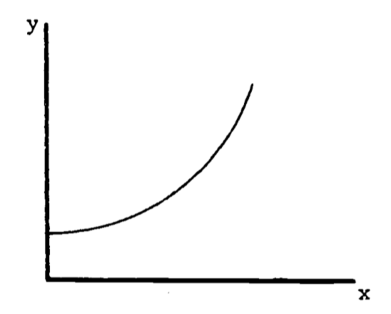
```

```{r fig-calcdiff-3, echo=FALSE, fig.height=4, out.width = "75%", fig.cap='Approximations to the curve in Figure 2.'}
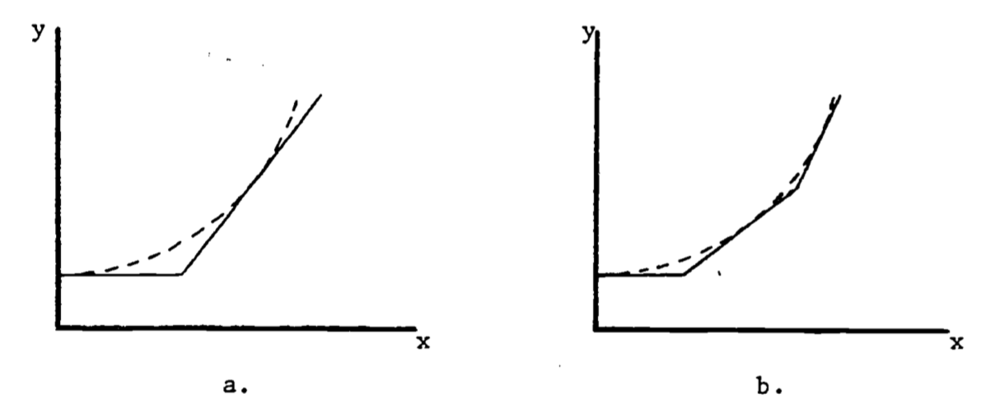
```

In general, the rate of change of a function is also a function of $x$ and possesses its own equation. The rate of change is denoted to $\frac{dy}{dx}$ reflect the ratio of the change in $y$ to the change in $x$. When the graph is a straight line, the equation for $y$ is
$$y(x) = mx + b$$
and the rate of change is
$$\frac{dy}{dx}=m$$
The rate of change is called the **derivative**. Its functional form depends on the equation for $y$. For example, an empirical relation between oxygen consumption $(Q)$ and body weight $(W)$ is
$$Q=3W^2$$
The derivative of this function is
$$\frac{dQ}{dW}=(3)(2W)=6W$$
The graph of $Q = 3W^2$ is given in Fig. \@ref(fig:fig-calcdiff-4)a. The derivative at $W = 1$ represents the slope of the line tangent to the curve at the point where $W = 1$, as shown in Figure 4b. At $W = 1$, the slope is calculated to be
$$\frac{dQ}{dW}=6(1)=6$$

```{r fig-calcdiff-4, echo=FALSE, fig.height=4, out.width = "75%", fig.cap='Derivative as the slope of the tangent line.'}
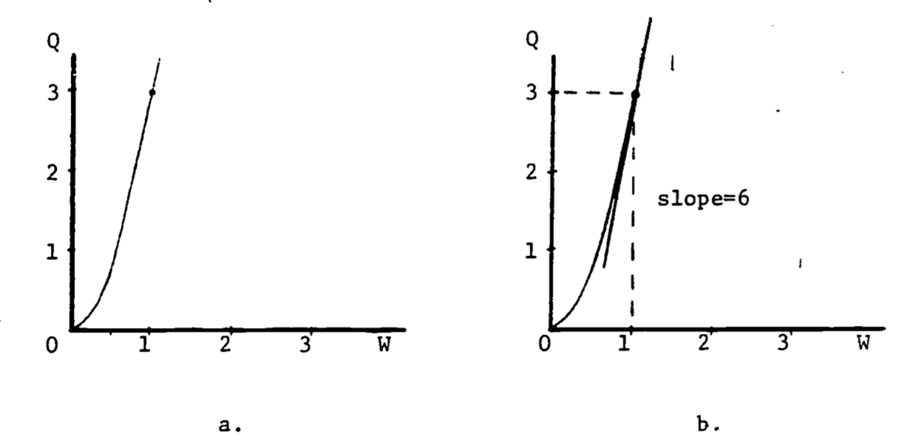
```

The number "$3$" in the formula $Q = 3W^2$, as well as the "$2$" in the exponent, are empirically determined and differ with body size and species. The general formula is
\begin{equation}
Q=aW^b
(\#eq:calcdiff-2)
\end{equation}
The derivative of this power function is
$$\frac{dQ}{dW}=a\cdot b\cdot W^{b-1}$$
Table 1 gives the more common functions and their derivatives.

> Table 1. Derivatives of Elementary Functions

|  $y(x)$ |   $dy/dx$  |
|:-------:|:----------:|
|  $x^n$  | $nx^{n-1}$ |
|  $e^x$  |    $e^x$   |
| $ln\:x$ |    $1/x$   |
|  sin $x$  |    cos $x$   |
|  cos $x$  |   -sin $x$   |

For a more complete table, see any calculus text, or any math handbook (see Bibliography).

### Composite Functions

When a function is composed of several simple functions its derivative can be evaluated in stages. In the simple cases where $y$ equals the sum or product of two functions, $f(x)$, $g(x)$, the rules for differentiation (finding the derivative) are:
$$y(x)=f(x)+g(x),\;\;\;\;\frac{dy}{dx}=\frac{df}{dx}+\frac{dg}{dx}$$
$$y(x)=f(x)g(x),\;\;\;\;\frac{dy}{dx}=f(x)\frac{dg}{dx}+g(x)\frac{df}{dx}$$
For example, if $y(x)=x^2(x-1)+2x$, then
\begin{eqnarray}
\frac{dy}{dx}&=&x^2\frac{d(x-1)}{dx}+(x-1)\frac{d(x^2)}{dx}+2 \\
&=& x^2(1)+(x-1)(2x)+2 \\
\end{eqnarray}
When $y$ is a function of a function, the **chain rule** provides the differentiation method:
$$\frac{dy}{dx}=\frac{dy}{du}\frac{du}{dx}$$
For the composite exponential function $y=e^{2x}$, we have
$$u(x)=2x,\;\;\;\;y(u)=e^u$$
$$\frac{dy}{du}=e^u, \;\;\;\;\frac{du}{dx}=2$$
Therefore
$$\frac{dy}{dx}=2e^u=2e^{2x}$$
The Gompertz growth curve is used occasionally to describe the population size $(N)$ of some species as a function of time $(t)$, and is given by the equation
$$N(t)=ae^{-be^{-kt}}$$
where $a$, $b$, $k$ are constants. The derivative $dN/dt$ then represents the rate of growth of the population. Here the chain rule is applied twice:
$$N(t)=ae^{u(t)},\;\;\;\;u(t)=-be^{-kt}$$
$$\frac{dN}{du}=ae^u$$
Write $u(t)$ as $u=-be^{v(t)}$ where $v=-kt$. Then
$$\frac{dv}{dt}=-k,\;\;\;\;\frac{du}{dt}=\frac{du}{dv}\frac{dv}{dt}=-be^v(-k)$$
$$\frac{dN}{dt}=\frac{dN}{du}\frac{du}{dv}\frac{dv}{dt}=ae^u(-be^v)(-k)=abke^{-be^{-kt}}\cdot e^{-kt}$$

### Higher Derivatives
The derivative $dy/dx$ of a function $y(x)$ is called the **first derivative** of $y(x)$. If we write
$$\frac{dy}{dx}=g(x)$$
then differentiating $g(x)$ produces
$$\frac{dg}{dx}=h(x)$$
which is called the **second derivative** of $y(x)$, and is written $\frac{d^2y}{dx^2}$.

Other notation used for the first derivative includes $y'$ and $\dot{y}$, for the second derivative, $y''$ and $\ddot{y}$. Since the second derivative is also a function, it too can be differentiated to give the third derivative, and so on. The $n^{th}$ derivative is written (there is no general dot notation)
$$\frac{d^ny}{dx^n},\;\;\;\; y^{[n]}$$

### Critical Points
The first and second derivatives can be used to determine three special points on the graph of the function, namely, the relative maxima, relative minima and the inflection points. The relative maximum is easily visualized: the curve rises, reaches a peak, and then falls. The peak is the relative maximum. It is **relative** because the curve may rise even higher in a different place on the graph. Similarly, the relative minimum constitutes a low point on the curve. An inflection point is best illustrated by an example.

The logistic growth function describing population size is
$$N=N_0\frac{1+b}{a+be^{-kt}}=N_0(1+b)(1+be^{-kt})^{-1}$$
where $k$ is a growth coefficient, $N_o$ is the population size at $t=0$ and $N_0(1+b)$ represents the carrying capacity of the environment. The growth **rate** is then
\begin{eqnarray}
\frac{dN}{dt}&=&N_0(1+b)(-1)(1+be^{-kt})^{-2}(be^{-kt})(-k) \\
&=&N_0(1+b)bke^{-kt}(1+be^{-kt})^{-2} \\
\end{eqnarray}
The coefficient $k$ is always positive. In this example, we restrict $b$ to be greater than 1.

At a relative maximum, the tangent line is horizontal so the slope is zero. Then the maximum growth rate occurs when the derivative of the growth rate equals zero.
$$\frac{d(dN/dt)}{dt}=0$$
or equivalently,
$$\frac{d^2N}{dt^2}=0$$

```{r fig-calcdiff-5, echo=FALSE, fig.height=4, out.width = "75%", fig.cap='Maximum growth rate at the inflection point.'}
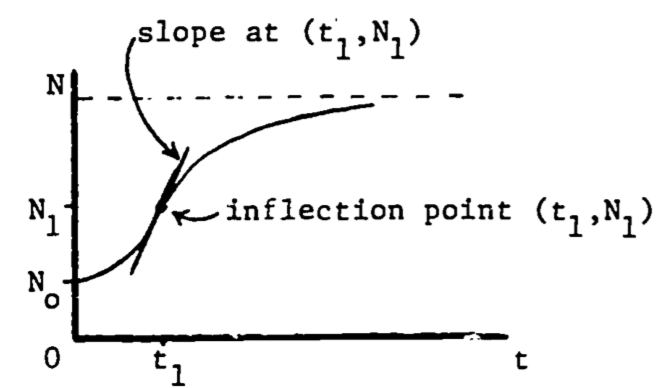
```

The second derivative of a function equals zero at the point of inflection, where the curvature changes from curving upward to curving downward, or vice versa. Then the maximum growth rate occurs when the population function $N(t)$ is at its inflection point (see Fig. \@ref(fig:fig-calcdiff-5)). Since the slope is decreasing (leveling off) **following** the inflection point, and increasing **before** the inflection point, it is certainly maximal (steepest) **at** that point. This point can also be viewed as the relative maximum on the graph of the growth rate, $dN/dt$ (see Fig. \@ref(fig:fig-calcdiff-6)).

```{r fig-calcdiff-6, echo=FALSE, fig.height=4, out.width = "75%", fig.cap='Growth rate as a function of time.'}
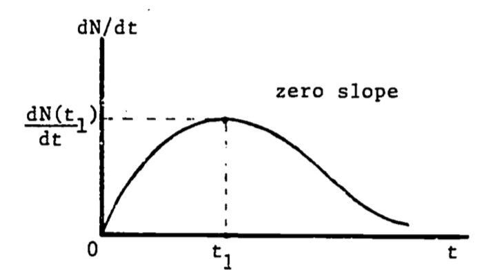
```

We now locate this point of maximum growth:
$$0=\frac{d^2N}{dt^2}\;\;\;\;\;\mbox{at } (t_1, N_1)$$
$$0=\frac{d}{dt}[N_0(1+b)bke^{-kt}(1+be^{-kt})^{-2}]\;\;\;\;\mbox{at }(t_1, N_1)$$
$$0=N_0(1+b)bk^2e^{-kt_1}(be^{-kt_1}-1)(1+be^{-kt_1})^{-3}$$
Since all factors are positive except $(be^{-kt_1}-1)$, then
$$0=be^{-kt_1}-1$$
Solving for $t_1$ gives
$$t_1=(\frac{1}{k})ln\:b$$
and then substituting into the original expression for $N$,
$$N_1=N_0(1+b)(1+be^{-k(\frac{1}{k}ln\,b)})^{-1}=N_0(1+b)/2$$
this says that the growth rate is highest when the population is one-half of the carrying capacity.

## FUNCTIONS OF SEVERAL VARIABLES

### Partial Derivatives

The models treated thus far involve functions of one variable. Oxygen uptake is given as a function of just the surrounding oxygen concentration. The population size depends only on time. A more complicated model, however, may involve many variables. Growth certainly depends on available food supply in addition to time. Oxygen consumption also depends on more factors than ambient oxygen concentration. One such model is discussed by Bayne, Thompson and Widdows (1973).

The model begins with the equation
\begin{equation}
\frac{dC}{dt}=aW^b
(\#eq:calcdiff-3)
\end{equation}

where $C$ is the amount of oxygen consumed up to time $t$, and $a$, $b$ and $W$ are constants. The notation $dC/dt$ demands that we may be able to consider $C$ **only** as a function of $t$. This is not always the case. Bayne, et al., studied mussels (*Mytilus*) with regard to the effects of food and temperature on oxygen consumption. One of their data sets gives values for the coefficients $a$ and $b$ for winter vs. summer at two activity levels:

>Table 2. Oxygen consumption for Mytilus edulis

| | |**Activity**| 
:-----:|:-----:|:-----:|:-----:
Parameter|Season|standard|routine
a|Winter|1.76|2.66
| |Summer|1.87|2.64
b|Winter|0.724|0.774
| |Summer|0.67|0.702

Standard activity represents the resting state. Routine refers to the post-feeding time period where some filtration (i.e. muscle activity) is occurring. From table 2, we recognize significant dependence of "$a$" on the level of activity and dependence of "$b$" on both activity and season. Let season and activity be denoted $s$ and $m$, respectively. Then, in place of "$a$" and "$b$" we write $a(m)$ and $b(s,m)$ to show the dependence on the variables $m$ and $s$. Now
$C$, $a$ and $b$ are dependent variables and $W$, $s$, $m$ and $t$ are the independent variables. We must now write \@ref(eq:calcdiff-3) as
\begin{equation}
\frac{\partial C}{\partial t}=a(m)W^{b(s,m)}
(\#eq:calcdiff-4)
\end{equation}

The derivative notation is different from that in \@ref(eq:calcdiff-3) to indicate more than one independent variable. This derivative is called a **partial derivative** and represents the rate of change of $C$ with time while all other variables are held constant. Note that by holding all of the independent variables (except $t$) constant, we also hold $a$ and $b$ constant. So this partial derivative is obtained by differentiating the function $C$ with respect to $t$ and treating all of the remaining independent variables as constants.

As a simple example, consider the function
\begin{equation}
y=xt^2
(\#eq:calcdiff-5)
\end{equation}
Then
$$\frac{\partial y}{\partial x}=t^2\;\;\;\mbox{(t held constant)}$$
and
$$\frac{\partial y}{\partial t}=x\cdot 2t\;\;\;\mbox{(x held constant)}$$

```{r fig-calcdiff-7, echo=FALSE, fig.height=4, out.width = "75%", fig.cap='The function $y=xt^2$.'}
x= seq(0,3,0.2)
t= seq(0,3,0.2)
surf=function(x,t) x*t^2
y <- outer(x, t, surf)

persp(x, t, y)
```

A partial derivative is by nature merely one simple relation (of many) extracted from a complicated function. In \@ref(eq:calcdiff-5), when both $x$ and $t$ vary, the graph of $y$ vs. $x$ vs. $t$ is a three-dimensional surface (figure \@ref(fig:fig-calcdiff-7)). When $t$ is held constant, the graph ($y$ vs. $x$) is a straight line (with slope $t^2$ ); when $x$ is held constant, the graph ($y$ vs. $t$) is a parabola, as shown in Figures \@ref(fig:fig-calcdiff-8) and \@ref(fig:fig-calcdiff-9). These latter two graphs are much simpler than the surface of figure \@ref(fig:fig-calcdiff-7). Note that the straight line ($y$ vs. $x$) is the far edge of figure \@ref(fig:fig-calcdiff-7)a, and the parabola ($y$ vs. $t$) is the near edge of figure \@ref(fig:fig-calcdiff-7)c.

```{r fig-calcdiff-8, echo=FALSE, fig.height=4, out.width = "50%", fig.cap='$dy/dx=t^2$.'}
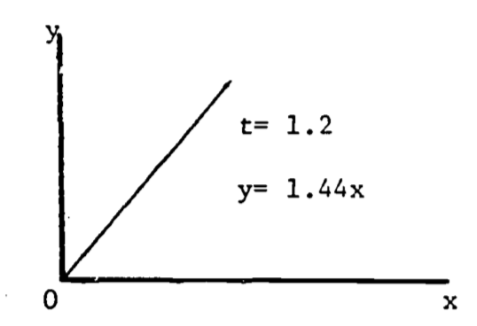
```

```{r fig-calcdiff-9, echo=FALSE, fig.height=4, out.width = "50%", fig.cap='$dy/dt=2xt$.'}
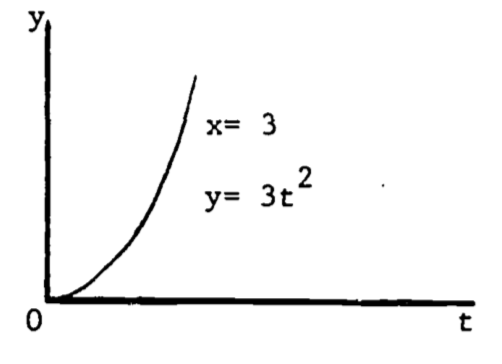
```

A more complicated example is the complete expression for \@ref(eq:calcdiff-4) . The level of activity is based on the fraction of the maximal filtration rate. Then $m=0$ represents the "standard" state, $m=1$ gives the "active" state, and $m=0.4$ is the "routine" state . Consider oxygen consumption during summer.  
Then
$$a(m)=1.87(m+1)$$
and \@ref(eq:calcdiff-3) becomes
\begin{equation}
\frac{\partial C}{\partial t}=1.87(m+1)W^{(0.7)}
(\#eq:calcdiff-6)
\end{equation}
Changes in "$b$" are not significant so that an average value, 0.7, can be used. Since \@ref(eq:calcdiff-6) involves four variables, and thus cannot be plotted, we revert to the notation of \@ref(eq:calcdiff-2), i.e., $Q=\frac{\partial C}{\partial t}$. Then
\begin{equation}
Q=1.87(m+1)W^{(0.7)}
(\#eq:calcdiff-7)
\end{equation}
This last expression is similar in form to \@ref(eq:calcdiff-5) and its graph has a similar shape. Problem 3 discusses \@ref(eq:calcdiff-7) in more detail.

### Critical Points in Three Dimensions

The extension of a critical point to functions of two variables is quite natural. A point $P=(x_0,\;y_0,\;z_0)$ is a critical point for the function
$$z=f(x,y)$$
if
$$\frac{\partial f}{\partial x}=\frac{\partial f}{\partial y}=0$$
at the point $P$. The classification of the critical point is, however, more complicated. Since there are **three** second derivatives, many cases could be considered:
$$\frac{\partial^2 f}{\partial x^2}=\frac{\partial(\partial f/\partial x)}{\partial x}\;\;\;\;\;\frac{\partial^2f}{\partial y^2}=\frac{\partial(\partial f/\partial y)}{\partial y}$$
$$\frac{\partial^2f}{\partial x\partial y}\equiv\frac{\partial(\partial f/\partial y)}{\partial x}=\frac{\partial(\partial f/\partial x)}{\partial y}\equiv\frac{\partial^2f}{\partial y\partial x}$$
This last "mixed" second derivative can be evaluated in either order **only if** the function $f(x,y)$ is continuous in $x$ and $y$. The functions used in the examples which follow are continuous so that the order of differentiation is arbitrary. Rather than considering all combinations of sign (+, 0, -) in the second derivatives, we treat only three, which classify a relative maximum, relative minimum, and a saddle point. Define
$$L=f_{xx}(x_0,y_0)\cdot f_{yy}(x_0,y_0)-f_{xy}^2(x_0,y_0)$$
where
$$f_{xx}=\frac{\partial^2 f}{\partial x^2},\;\;\;\;\mbox{etc.}$$
P is a relative maximum if $L > 0$ and $f_{xx}(x_0,y_0)<0$.  
P is a relative minimum if $L > 0$ and $f_{xx}(x_0,y_0)>0$.  
P is a saddle point if $L<0$.  
When $L = 0$, the situation is "undetermined" since its resolution is beyond the scope of this module.

An interesting example is the function
$$z=x^3+y^3-3xy+15$$
which seems to describe some of the properties of water falling across a rock face (Clow and Urquhart, 1974). Some of these properties are well known. The water will often dig potholes in the rock, especially if it falls onto a ledge. The corners and edges of the ledge eventually become rounded. We would then use a function which drops rapidly, levels off then drops steeply again. Figure \@ref(fig:fig-calcdiff-10) shows a three-dimensional computer plot of this function, looking across the origin into the positive octant ($x>0$, $y>0$, $z>0$). The required shape is evident, with the pothole just beginning to form. In fact, the function does possess a relative minimum at the point $(x, y, z) = (1, 1, 14)$. This model is discussed further in problem 6.

The saddle point in the waterfall model is located at the point $(0, 0, 15)$. The region around the saddle point represents the front part of the ledge. It is displayed in the computer-drawn graph of figure \@ref(fig:fig-calcdiff-11), expanded vertically to highlight the saddle shape. Some basic features of derivatives are shown here:  
    a) The slope changes from point to point.  
    b) The slope depends on the orientation of the tangent line. Thus, at a given point, the slope found by $\partial z/\partial x$ may be different from the slope found using $\partial z/\partial y$.  
    c) The slope at a relative maximum or relative minimum is zero, i.e. horizontal.
    
```{r fig-calcdiff-10, echo=FALSE, fig.height=4, out.width = "40%", fig.cap='Waterfall function.'}
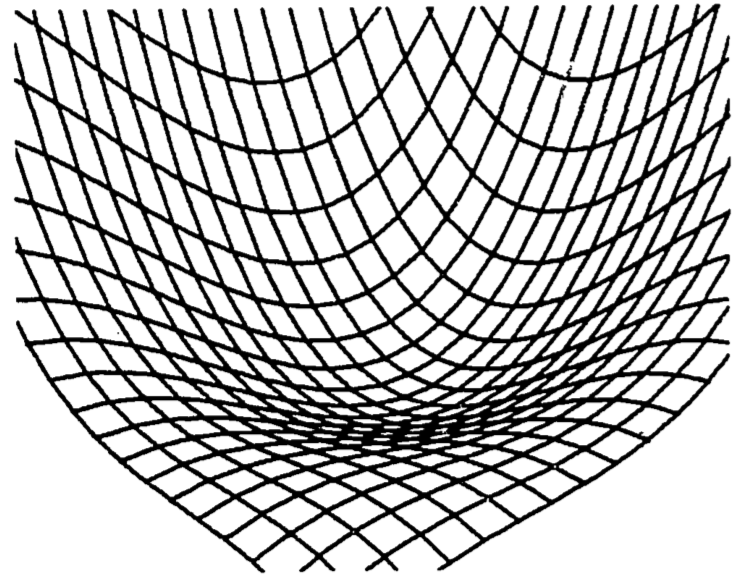
```

```{r fig-calcdiff-11, echo=FALSE, fig.height=4, out.width = "40%", fig.cap='Saddle point of a waterfall function.'}
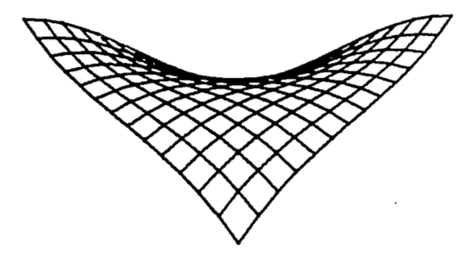
```

## BIBLIOGRAPHY

**CALCULUS**

Ayres, F., Jr., 1964. Theory and Problems of Differential and Integral Calculus, second ed., Schaum's Outline Series, McGraw-Hill, New York.

Clow, D. J. and Urquhart, N. S., 1974. Mathematics in Biology, Norton, New York.

Keisler, H. J., 1971. Elementar Calculus: An A roach Usin: Infinitesimals, Prindle, Weber and Schmidt, Boston.

Sternberg, W., Walker, R. J. et al., 1968. Calculus, A Computer Oriented Presentation, The Center for Research in College Instruction in Science and Mathematics (CRICISAM), Florida State University, Tallahassee.

Thomas, G. B., Jr., 1968. Calculus and Analytic Geometry, fourth ed., Addison-Wesley, Reading, Massachusetts.

**TABLES**

Handbook of Mathematical Functions, 1964. Abramowitz, M. and I. Stegun, eds., National Bureau of Standards, Applied Mathematics Series, 55, Washington, D.C.

Handbook of Mathematical Tables, 1964. Weast, R. C., Selby, S. M. and C. D. Hodgman, eds., The Chemical Rubber Co., Cleveland. GENERAL

Alexander, R. M., 1968. Animal Mechanics, University of Washington Press, Seattle.

Bayne, B. L., Thompson, R. J. and J. Widdows, 1973. "Some Effects of Temperature and Food on the Rate of Oxygen Consumption by Mytilus edulis L.," in Effects of Temperature on Ectothermic Organisms, Wieser, E., ed., Springer-Verlag, New York.

Caughley, G., 1970a. Ecology 51:53.

Caughley, G., 1970b. N.Z. J. Sci. 13:209.

de Vries, D. A., 1975. "Heat Transfer in Soils," in Heat and Mass Transfer in the Biosphere, Part I, de Vries, D. A. and N. H. Afgan, eds., John Wiley and Sons, New York.

Goldberg, S., 1958. Difference Equations, Wiley, New York. 

Long, C., 1976. MAA Monthly, 83:370.

Nay, R., 1978. "Mathematical Aspects of the Dynamics of Animal Populations," in Studies in Mathematical Biology, Part II, S. Levin, ed., Math. Assn. of America.

Sladen,13. 1969. "The Ecology of Animal Communities," in Biology of Populations, Sladen, B. and F. Bang, eds., Elsevier, New York.

## PROBLEM SET
1. a. The logistic population growth function satisfies the differential equation
$$\frac{dx}{dt}=Ax(N-x)$$
where $x=x(t)$ is the population size and $N$ is the carrying capacity of the environment. Use this equation to show that the maximum growth rate (max $dx/dt$) occurs at the inflection point $x=N/2$. Assume $A$ is positive. (HINT: write the equation with $v = dx/dt$, and set $dv/dx = 0$).

&nbsp;&nbsp;b. The "relative growth rate" is defined by
$$R=\frac{1}{x}(\frac{dx}{dt})$$
where $dx/dt$ is as given in part (a). Let $x$ be given in "numbers of animals" and evaluate the units of $R$. The logistic curve is often used to describe "crowding effects" including intraspecies competition. Use the equation of part (a) to determine the value of $x$ which maximizes $R$, and explain this result in terms of crowding.

2. Leaves usually have small openings called stomata to allow passage of gases between their interior and exterior. Through them carbon dioxide passes in for capture by photosynthesis and the resulting oxygen passes out. Water vapor also escapes through the stomata, sometimes leading to dehydration. Thus plants have guard cells around the stomata to regulate their size. Action of the guard cells varies the shape of stomatal openings from a long narrow slit to nearly a circle. Throughout most of this variation the opening has approximately the shape of an ellipse with a constant length perimeter, typically about 35 $\mu$.  
A good approximation to the perimeter of an ellipse is
$$P=2\pi\sqrt{(a^2+b^2)/2}$$
The area is given by
$$A=\pi ab$$
Set $P=35$ and evaluate the area, $A$, in terms of just the width, $b$. Show that the area reaches a maximum when a=b, i.e., when the stomatal opening is a circle.

```{r fig-calcdiff-p20, echo=FALSE, fig.height=4, out.width = "75%", fig.cap='Constant-perimeter ellipses.'}
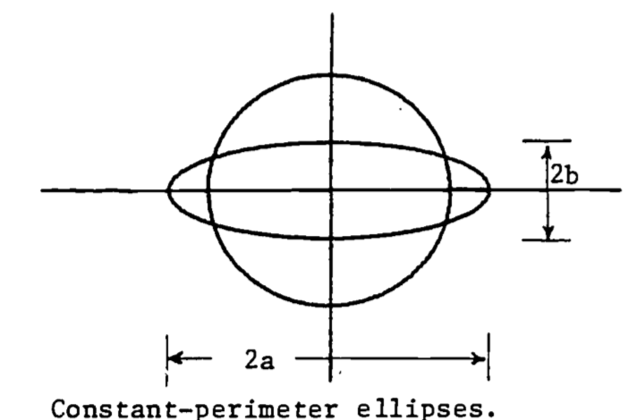
```

3. In the O~2~ consumption model represented by equation \@ref(eq:calcdiff-7), the variable $Q$ has units of $\mu$l/hr. Write $Q$ in ml/hr and find $\frac{\partial Q}{\partial m}$ for $W$ = 1000 mg. What are the units of $\frac{\partial Q}{\partial m}$? What might this derivative represent biologically? That is, why would a biologist be interested in this derivative?

4. A study of shape changes in nemerteans and flatworms (Alexander, 1968) theorizes that a basement membrane encloses the body and contains fibers which run in helices around the body. From Figure b, if the length $D$ of the fiber is fixed, then $l = Dcos\theta$ and when the shape is cylindrical, the circumference and volume are $2\pi r=Dsin\theta$, $v=\pi r^2l$.

```{r fig-calcdiff-p21, echo=FALSE, fig.height=4, out.width = "75%", fig.cap=''}
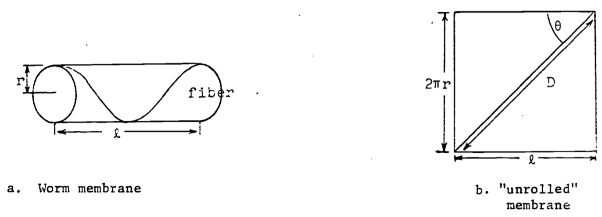
```

&nbsp;&nbsp;a. Express $v$ as a function of $\theta$ (with $D$ a parameter) and show $v=0$ when $\theta=0$ or $\theta=\pi/2$ radians. What do these two cases mean physically?

&nbsp;&nbsp;b. Find $\theta$ which gives a maximum for $v$. Prove it is a relative maximum and not a relative minimum. Note that laboratory dissections show that in the relaxed worm the fibers run at about 55° to the axis of the body. Why would the relaxed worm have the maximum volume?

5. Studies of insect flight (Alexander, 1968) use the theory of "forced vibrations" to explain the muscle action responding to nervous stimuli. If the "forcing function" is assumed to be
$$Fsin(2\pi nt),\;\;\;\;t=\mbox{time},\;\;\;\;F=\mbox{constant},$$
then the steady amplitude $A$ (magnitude of the vibrations) is given by
$$A=F[(s-4\pi^4n^2m)^2+(2\pi nK)^2]^{-1/2}$$
where
&nbsp;&nbsp;&nbsp;&nbsp;$K$ = viscous damping coefficient  
&nbsp;&nbsp;&nbsp;&nbsp;$m$ = wing mass  
&nbsp;&nbsp;&nbsp;&nbsp;$n$ = frequency  
&nbsp;&nbsp;&nbsp;&nbsp;$s$ = stiffness of the vibrating medium  
Find the frequency $(n)$, called the **resonant** frequency, which gives the maximum amplitude.

6. This exercise verifies the location of the relative minimum in the example of "water falling across a rock face". The function is
$$z=x^3+y^3-3xy+15$$
Find all the critical points and determine which one is the relative minimum.

7. Heat transfer in soils depends on many factors; among them is the variation in the soil itself (de Vries, 1975).

Since most of the variation is in the vertical direction, a simple mathematical model is the one dimensional diffusion equation,
$$C\frac{\partial T}{\partial t}=\frac{\partial}{\partial z}(\lambda\frac{\partial T}{\partial z})$$
where we define  
&nbsp;&nbsp;&nbsp;&nbsp;$T$ = temperature  
&nbsp;&nbsp;&nbsp;&nbsp;$t$ = time  
&nbsp;&nbsp;&nbsp;&nbsp;$z$ = vertical space coordinate  
&nbsp;&nbsp;&nbsp;&nbsp;$C$ = volumetric heat capacity  
&nbsp;&nbsp;&nbsp;&nbsp;$\lambda$ = thermal conductivity  
When $C$ and $\lambda$ are uniform in depth and constant in time, we have the simple diffusion equation:
$$\frac{\partial T}{\partial t}=a\frac{\partial^2 T}{\partial z^2}$$
where $a = \lambda/C$ is called the thermal diffusivity of the soil. The temperature As at the surface gives boundary conditions for the model. For sinusoidal variation of surface temperature, we can write the boundary conditions as
$$T(t,0)=T_a+\theta_0cos\omega t$$
$$T(t,\infty)=T_a=\mbox{constant}$$
Show that the solution to this model is given by the following function:
$$T(t,z)=T_a+\theta_0e^{-z/d}cos(\omega t-z/d)$$
with
$$d=(2a/\omega)^{1/2}$$
Be sure to verify that this function satisfies the diffusion equation **and** the boundary conditions.

## ANSWERS TO THE PROBLEM SET

1. a. Find the $x$ which gives max$(dx/dt)$. Differentiate $dx/dt$ **with respect to $x$**, equate to zero and solve for $x$:
$$\frac{d}{dx}(\frac{dx}{dt})=A(N-2x)$$
$$0=A(N-2x)$$
$$x=N/2$$
Since the second derivative is negative, i.e.
$$\frac{d^2}{dx^2}(dx/dt)=-2A<0$$
then at $x=N/2$, $dx/dt$ is maximal.
&nbsp;&nbsp;b. Find $dR/dx$, set equal to zero, solve for $x$:
$$R=\frac{1}{x}[Ax(N-x)]=A(N-x)$$

$$\frac{dR}{dx}=-A<0$$
So no relative max exists, and the maximum must be at the lower end of the domain of $x$: since $0\le x\le N$, then max $(R)$ occurs at $x=0$. This model then implies that crowding effects are present whenever **any** animals exist.

2.
$$35=2\pi\sqrt{(a^2+b^2)/2}$$
$$(\frac{35}{2\pi})^2=\frac{a^2+b^2}{2}$$
$$a=(\frac{35^2}{2\pi^2}-b^2)^{1/2}$$
The area $A$ in terms of $b$ is then
$$A=\pi(\frac{35^2}{2\pi^2}-b^2)^{1/2}b=\pi(\frac{35^2b^2}{2\pi^2}-b^4)^{1/2}$$
Maximize $A(b)$:
\begin{eqnarray}
\frac{dA}{db}&=&\frac{\pi}{2}(\frac{35^2b^2}{2\pi^2}-b^4)^{-1/2}(\frac{35^2b}{\pi^2}-4b^3) \\
0&=&\frac{35^2b}{\pi^2}-4b^3,\;\;\;\;\mbox{assume }b\not=0 \\
&=&\frac{35^2}{\pi^2}-4b^2 \\
b&=&\frac{35}{2\pi},\;\;\;\;\mbox{since }b>0 \\
a&=&(\frac{35^2}{2\pi^2}-\frac{35^2}{4\pi^2})^{1/2}=\frac{35}{2\pi},\;\;\;\;\mbox{since }a>0
\end{eqnarray}
Thus the maximum area occurs when $a=b$, i.e. a circle.

3. To convert \@ref(eq:calcdiff-7) so $Q$ is in ml/hr, we divide by 1000:
$$Q=1.87\times10^{-3}(m+1)W^{0.7}$$
\begin{eqnarray}
\frac{\partial Q}{\partial m}&=&1.87\times10^{-3}W^{0.7} \\
&=&0.234\;\;\;\;\mbox{for } W = 1000
\end{eqnarray}
The units are then ml O~2~ per hour per unit of activity.

4.a. First solve for $r(\theta)$:

$\begin{aligned}
&r=\frac{D}{2\pi}sin\theta \\
&v=(\frac{D}{2\pi}sin\theta)^2(Dcos\theta) \\
&v(\theta)=\frac{D^3}{4\pi}sin^2\theta cos\theta \\
&v(0) = 0\;\;\mbox{since}\;\;sin(0)=0 \\
&v(90°)= 0\;\;\mbox{since}\;\;cos(90°)=0
\end{aligned}$

&nbsp;&nbsp;b.

$\begin{aligned}
&\frac{dv}{d\theta}=\frac{D^3}{4\pi}\{2sin\theta cos^2\theta-sin^3\theta\} \\
&0=2sin\theta cos^2\theta-sin^3\theta\;\;\;\;\mbox{Assume }\;\theta > 0 \\
&0=2cos^2\theta - sin^2\theta \\
&sin^2\theta=2cos^2\theta \\
&tan\theta=\sqrt{2} \\
&\theta = 54.74°
\end{aligned}$

5. Maximize $A$ by minimizing the denominator:
$$0=\frac{d}{dn}[(s-4\pi^2n^2m)^2+(2\pi nK)^2]=2(s-4\pi^2n^2m)(-8\pi^2mn)+8\pi^2K^2n$$
$$0=-2(ms-4\pi^2m^2n^2)+K^2$$
$$2ms-K^2=8\pi^2m^2n^2$$
$$n=\frac{2ms-K^2}{8\pi^2m^2}$$
6. First calculate the required partial derivatives:
$$\frac{\partial z}{\partial x}=3x^2-3y,\;\;\;\;\frac{\partial z}{\partial y}=3y^2-3x$$
$$\frac{\partial^2 z}{\partial x^2}=6x,\;\;\;\;\frac{\partial^2 z}{\partial x\partial y}=-3,\;\;\;\;\frac{\partial^2z}{\partial y^2}=6y$$
Now find the critical point(s) by simultaneously solving
$$\frac{\partial z}{\partial x}=0\;\;\;\mbox{and}\;\;\;\frac{\partial z}{\partial y}=0$$

Thus
$$3x^2-3y=0\;\;\;\;3y^2-3x=0$$
From the first equation we obtain:
$$y=x^2$$
Substitute into the second equation and solve for $x$:
$$3(x^2)^2-3x=0$$
$$3x(x^3-1)=0$$
Thus $x=0,\;1$. The minimum is said to be at $(1,1)$.  
With $x=1$ we evaluate $y$:
$$y=(1)^2=1$$
To classify this critical point, we evaluate
$$(\frac{\partial^2 z}{\partial x^2})(\frac{\partial^2z}{\partial y^2})-(\frac{\partial^2z}{\partial x\partial y})^2\;\;\;\mbox{at}\;\;\;(x,y)=(1,1)$$
$$(6\cdot1)(6\cdot1)-(-3)^2=36-9>0$$
Since
$$\frac{\partial^2 z}{\partial x^2}=6>0\;\;\;\mbox{at}\;\;\;(x,y)=(1,1)$$
then $(1,1)$ is indeed a relative minimum.

7. First show the boundary conditions to be satisfied:
\begin{eqnarray}
T(t,0)&=&T_a+\theta_0e^{-0/d}cos(\omega t-0/d) \\
&=&T_a+\theta_0cos\omega t \\
T(t,\infty)&=&T_a+\theta_0e^{-\infty/d}cos(\omega t-\infty/d) \\
&=&T_a+0 \\
&=&T_a
\end{eqnarray}
Now show that the diffusion equation is satisfied:

\begin{eqnarray}
\frac{\partial T}{\partial t}&=&-\theta_0e^{-z/d}\omega sin(\omega t-z/d) \\
\frac{\partial T}{\partial z}&=&-\frac{1}{d}\theta_0e^{-z/d}cos(\omega t-z/d)-\theta_0e^{-z/d}(-\frac{1}{d})sin(\omega t-z/d) \\
&=&\frac{\theta_0e^{-z/d}}{d}[sin(\omega t-z/d)-cos(\omega t-z/d)] \\
\frac{\partial^2 T}{\partial z^2}&=&(-\frac{1}{d})\frac{\theta_0}{d}e^{-z/d}[sin(\omega t-z/d)-cos(\omega t-z/d)] \\
&&-(\frac{1}{d})\frac{\theta_0}{d}e^{-z/d}[cos(\omega t-z/d)+sin(\omega t-z/d)] \\
&=&-\frac{2\theta_0}{d^2}e^{-z/d}sin(\omega t-z/d)
\end{eqnarray}
Substituting into the diffusion equation:
$$-\theta_0e^{-z/d}\omega sin(\omega t-z/d)=-a\frac{2\theta_0}{d^2}e^{-z/d}sin({\omega t-z/d})$$
The equation is certainly true when $sin(\omega t-z/d)=0$. Now assume that $sin(\omega t-z/d)\not=0$ and divide both sides by $-\theta_0e^{-z/d}sin(\omega t-z/d$:
$$\omega = 2a/d^2$$
Substituting for $d$, we obtain
$$\omega = 2a/[(2a/\omega)^{1/2}]^2=\omega$$
Thus the equation is indeed satisfied.

## ADDITIONAL PROBLEMS

1. In the example in the text treating oxygen consumption(see also problem 3 above), the oxygen consumption $(Q)$ depended on both the activity level $(m)$ and the dry weight $(W)$:
$$Q=0.00187(m+1)W^{0.7}$$
where the units of $Q$ are mlO~2~/hr. For this exercise, we use the correspondence
$$Q \rightarrow z,\;m \rightarrow x,\;W\rightarrow y$$
so that the equation is
$$z=0.00187(x+1)y^{0.7}$$
a. Evaluate the first partial derivative $\partial z/\partial x$. If you plot $\partial z/\partial x$ with increasing $x$, is it supposed to be a straight line, concave upward, concave downward?

b. Now reverse the roles of $x$, $y$: evaluate $\partial z/\partial y$.If you were to plot $\partial z/\partial y$ against $x$, is the shape supposed to be a straight line, circle, parabola ... ?

2. This exercise illustrates how different parameter values can affect the properties of a function and its critical points. Function 2 is used in this exercise and is a simple polynomial in two independent variables:
$$z=(P1)x^2+(P2)y^2$$
Calculate all the partial derivatives needed to locate and classify a critical point. Set values for $P1$, $P2$ and evaluate the critical point.

3. When a beam of rectangular cross-section is cut lengthwise from a log, its strength can sometimes be well described by the following function:
$$S=kWD^2$$
where  
&nbsp;&nbsp;&nbsp;&nbsp;&nbsp;&nbsp;$S$ = strength of beam  
&nbsp;&nbsp;&nbsp;&nbsp;&nbsp;&nbsp;$W$ = width of beam  
&nbsp;&nbsp;&nbsp;&nbsp;&nbsp;&nbsp;$D$ = depth of beam
as shown in Figure \@ref(fig:fig-calcdiff-A), and where $k$ is a constant which depends on the type of tree used. Assume that the log is circular in cross-section and that the beam is cut so each corner reaches the outside of the log, as shown. Assume $k$ = 0.1. Find the width and depth of the beam which give the maximum strength. Assume the radius of the log is $r$.  

```{r fig-calcdiff-A, echo=FALSE, fig.height=4, out.width = "75%", fig.cap='Rectangular beam cut from a log.'}
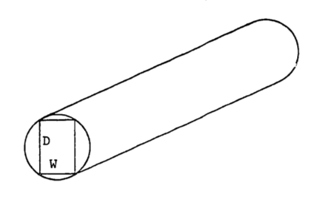
```

4. Animal populations newly introduced into a region have been observed to increase rapidly in number and soon thereafter to fall drastically (Caughley 1970a, b) as indicated in Figure \@ref(fig:fig-calcdiff-B). One theory is that the population at first "senses" an infinite food supply and then reproduces rapidly to the point of overgrazing the area. The birth rate remains the same but the death rate (perhaps of young) dramatically increases until the population is low enough to match the food supply. The population then increases more slowly and seems to stabilize. Migration is also involved but is poorly understood. The second population rise to a "steady-state" suggests some adaptation or social "learning" by the population concerning their new environment.

```{r fig-calcdiff-B, echo=FALSE, fig.height=4, out.width = "75%", fig.cap='Population dynamics of introduced species.'}
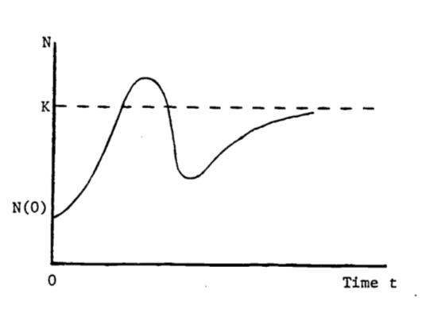
```

a. Consider the logistic equation written as follows:
$$N(t)=K(1+be^{-rt})^{-1}$$
where $K$, $b$, $r$ are positive constants, and $N(0) < K$. In an attempt to describe the behavior in Figure B, one could modify the above logistic function by allowing $r$ to vary over time, i.e. $r = r(t)$. Can the population ever exceed $K$? If not, then this modified logistic function is not a good model. Answer this for a general $r(t)$ in any fashion: by examining the function $N(t)$ itself, by evaluating the maximum of $N(t)$, etc.

b. An alternate model is developed if the discreteness of the population is taken into account. The logistic function in part (a) assumes that the population size, $N(t)$, will change **continuously** as time changes. In certain species, populations do not change size smoothly (see Sladen and Bang 1969). The breeding time is a short period, once a year so that many off-spring are born at the same time. The population size then increases in large jumps. This discrete change is not modeled well by differential equations. A closely related field is the study of "difference equations" (see Goldberg 1958) where discrete changes are allowed. The derivative of the logistic function satisfies the differential equation
$$\frac{dN(t)}{dt}=rN(t)\Big(\frac{K-N(t)}{K}\Big)$$
From this formulation, we see that the logistic model assumes that the population is always aware of how far from the carrying capacity is the current population size and so continuously adjusts for this difference. (Note that the derivative depends on this difference, $K-N(t)$). Actually, plentiful food one season may cause too many births the following season, with a definite time lag between abundant food and severe overpopulation and with few adjustments in between.

The computer is used here to illustrate this inadequacy of differential calculus. The derivative above is replaced by a difference:
$$\frac{N(t+1)-N(t)}{(t+1)-t}=rN(t)\Big(\frac{K-N(t)}{K}\Big)$$
This model assumes the population changes only once per time period (e.g. annually) and is unable to adjust in between. Is this more or less realistic than the original logistic model? How would you include social or genetic "learning" into the model? That is, once the population size rises and then falls, what parameters might change in the model so that the next rise would be more gradual?

5. The reaction $(Y)$ of the body to a dose $(X)$ of drug can be represented by the function:
\begin{eqnarray}
Y(X)&=&X^2(P1/2-P2\cdot X/3) \\
&=&\frac{P1}{2}X^2-\frac{P2}{3}X^3 \\
\end{eqnarray}

where $P1$ and $P2$ depend on certain body characteristics and on the maximum dosage which can be administered. $Y$ indicates the strength of the reaction, measured in millimeters of mercury if blood pressure is being tested, or perhaps degrees Celsius if change in body temperature is being measured.

Find the dose that has "maximum sensitivity," i.e. where the **rate of increase** of $Y$ is greatest. Is this "critical point" a maximum or minimum for $Y$"? What is this point called on the graph for $Y$?  

## ANSWERS TO THE ADDITIONAL PROBLEMS

1. $\partial z/\partial x=(0.00187y^{0.7})=$constant for given $y$.  
Exposed profile should be a straight line.  
$\partial z/\partial y=(0.00187)(x+1)(0.7)y^{-0.3}$  
Exposed profile curves upward with decreasing slope.

2. $\partial z/\partial x=2(P1)x$, $\partial z/\partial y=2(P2)y$  
$\partial^2 z/\partial x^2=2(P1)$, $\partial^2z/\partial x\partial y=0$, $\partial^2z/\partial y^2=2(P2)$  
$\partial z/\partial x=0$ if $x=0$  
$\partial z/\partial y=0$ if $y=0$  
Thus $(x,y)=(0,0)$ is the only critical point.  
To classify the critical point, evaluate:
$$\frac{\partial^2z}{\partial x^2}\frac{\partial^2z}{\partial y^2}-\Big(\frac{\partial^2 z}{\partial x\partial y}\Big)^2=4(P1)(P2)$$
Pick $P1=.6$, $P2=1.0$  
Then $4(P1)(P2)>0$, $\frac{\partial^2z}{\partial x^2}=2(P1)>0$ and the point is a relative minimum.

3. We use the Pythagorean theorem to obtain

$$(2r)^2=W^2+D^2$$
Thus
\begin{eqnarray}
D^2&=&4r^2-W^2 \\
S&=&(0.1)4r^2W-(0.1)W^3 \\
\frac{dS}{dW}&=&(0.4)r^2-(0.3)W^2 \\
0&=&(0.4)r^2-(0.3)W^2
\end{eqnarray}

The critical point is then at $W=\sqrt{4r^2/3}=2r/\sqrt{3}$
We have
$$\frac{d^2S}{dW^2}=-0.6W<0$$
so that when $W=2r/\sqrt{3}$, $S$ is indeed at a maximum.  
The depth is then
\begin{eqnarray}
D&=&\sqrt{4r^2-W^2} \\
&=&\sqrt{4r^2-4r^2/3} \\
&=&2\sqrt{2/3}r
\end{eqnarray}

4.a. Even assuming $r = r(t)$, N cannot exceed $K$ if $N(0) < K$. We see this by writing $N$ as a fraction.
$$N(t)=\frac{K}{1+be^{-r(t)t}}$$
b. Treat $r(t)$ in the difference equation model, with
\begin{eqnarray}
r(0)&=&r_0 \\
r(1)&=&r_0/2 \\
r(2)&=&r_0/3 \\
r(3)&=&r(2)
\end{eqnarray}
or some such scheme to decrease r as time increases.

5. Evaluate the derivative.
$$Y'=(P1)X-(P2)X^2$$
The "rate of increase" of $Y$ is greatest when $Y'$ is maximal. Find, the max($Y'$) by differentiating $Y'$ and setting $Y'' = 0$.
\begin{eqnarray}
Y''&=&\frac{d(Y')}{dx}=(P1)-(2)(P2)X \\
0&=&(P1)-(2)(P2)X \\
X&=&(P1)/(2(P2))
\end{eqnarray}
The value for $Y$ is then
$$Y=\Big[\frac{P1}{2(P2)}\Big]^2\Big[\frac{P1}{2}-\frac{(P1)(P2)}{6(P2)}\Big]=\frac{(P1)^3}{12(P2)^2}$$
This point is an inflection point on the graph $Y$ versus $X$.