# Foundations of Physical Theory {#physics}

author: Pearson, Nolan E.

## Preface {#physics-preface}

This module is one of two units on the foundations of physical theory and the application of physics to the biosciences. It is intended that the modules will provide sufficient background in physics so that other more advanced modules in the series can be understood without difficulty. It is presumed that the student has had a previous course in physics and has some facility with calculus. This module deals with atomic theory, basic force laws, and energy. Problems and examples used to illustrate principles of physics are directly related to the biosciences.

## The Atomic Theory {#physics-atomictheory}

Perhaps the most important hypothesis in all of biology is that "there is nothing that living things do that cannot be understood from the point of view that they are made of atoms acting according to the laws of physics" (Feynman 1963). The atoms of which all things are made are moving about in a state of perpetual motion (even at a temperature of absolute zero), exerting forces on each other (attractive when far apart, repulsive when very close), joining into or dissolving partnerships with each other (i.e., forming molecules) when conditions are right and ultimately organizing into such relatively simple collections of molecules as a grain of sand or a lump of coal, or into very complicated collections of molecules capable of writing "Hamlet" or of composing the "Jupiter" Symphony.

It is the job of physics (or let us say, of the biophysicist) to figure out how atoms interact with one another, why certain atoms have the preferences they do for certain other atoms (and the preferences in combining with them in certain particular angles), and what eventually makes these preferences important to sustaining life in its almost infinite variety of forms. To begin this job, we will have to know something about the forces acting on and between these atoms. We will also study the closely allied concept of the energy associated with these forces, which turns out to be a much more powerful method for understanding atomic (or life) processes than if we were to study only the forces. 

Before discussing the fundamental forces and associated energies in detail, it will be useful to demonstrate the power of the atomic hypothesis by examining the structure of the water molecule (Fig. \@ref(fig:fig-physics-1)), and the implications of this structure for biology.

```{r fig-physics-1, echo=FALSE, fig.height=4, out.width = "50%", fig.cap='Water vapor (steam) (from Feynman 1963).'}
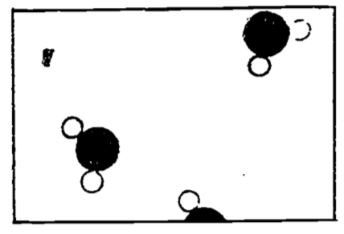
```

If we imagine that Fig. \@ref(fig:fig-physics-1) is an enlarged photograph of a portion of a vessel containing water molecules only, we would infer that the water was in the vapor state, or steam, since we see so few water molecules.

```{r fig-physics-2, echo=FALSE, fig.height=4, out.width = "50%", fig.cap='Water (liquid) (from Feynman 1963).'}
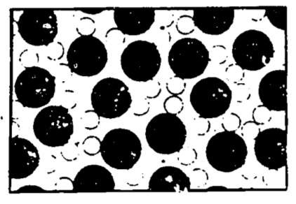
```

Figure \@ref(fig:fig-physics-2) shows the molecules as they might appear when in the liquid state. Here the molecules are relatively closely packed, but still in a jumble. This state might have been arrived at from the previously illustrated vapor state by several means. We might have just added more steam molecules to force the molecules to be closer to each other (by increasing the density). (We would be required to do this at a higher pressure than existed already in the vessel, else more molecules would leave the vessel than enter it when we were trying to add some molecules.) We might only have decreased the volume of the vessel by forcing a piston into it---this gets the molecules closer together by increasing the density and hence the pressure without adding more molecules. Or we might simply have lowered the temperature of the vessel; this slows down the molecules sufficiently that the attractive forces between them are not overwhelmed by the energy of their motion, and permits groups of molecules to affiliate (or condense out of the vapor) whereupon these groups will respond to the earth's gravity and join other such groups at the bottom of the vessel in a puddle of water.

If we wait long enough at some appropriate conditions of pressure, temperature, and volume, a so-called equilibrium of the liquid and its vapor will come to pass (if the vessel is isolated). This doesn't mean everything has stopped. On the contrary, the molecules in both the liquid and vapor states are moving and jiggling violently about. Those molecules in the vapor state experience little force from other molecules, though occasionally they bang into each other or return to the surface of the liquid. Those molecules in the liquid state are held in the liquid by fairly strong attractive forces from their neighbors, but occasionally they gather enough velocity to escape the liquid into the vapor. Equilibrium is said to occur when the average number escaping the liquid per unit time equals the average number returning to the liquid per unit time. If the vessel is open to the atmosphere, those water molecules which have escaped from the liquid will not be likely to return, and eventually all the liquid will evaporate.

The average velocity of the molecules determines the *temperature* of the substance, the higher the velocity the higher the temperature. When a "hot" object is placed against a "cold" object, some of the faster (or more highly energetic) molecules of the hot object will collide with the less energetic molecules of the cold object, the net effect being that the "hot" molecules slow down and the "cold" molecules speed up. In this event we will say that *heat* energy has been transferred from the hot to the cold object. Notice from the preceding paragraph, that when the liquid is evaporating, it is the molecules with the higher energies that escape the liquid, leaving relatively lower energy molecules behind. Thus if the vessel is open, so that these high energy molecules are unlikely to return, the liquid will cool. This cooling of the liquid can be sped up by immediately removing newly escaped "hot" molecules in order to prevent their return, such as by blowing them away. "Hence, blow on soup to cool it!" (Feynman 1963).

Figure \@ref(fig:fig-physics-3) shows a two-dimensional (and hence wrong, except qualitatively) representation of a three-dimensional crystal of ice. An important feature of this diagram is that each molecule has its ordered position in a periodically repeating array. Do not be led by this to believe that the molecules are held so tightly in place as not to be moving. 

```{r fig-physics-3, echo=FALSE, fig.height=4, out.width = "50%", fig.cap='Ice (from Feynman 1963).'}
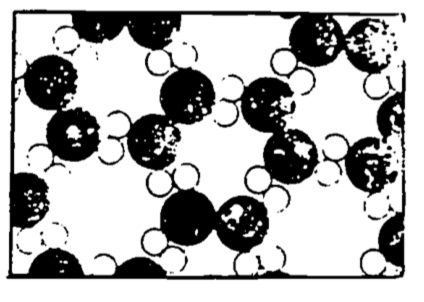
```

They surely are not free to slide and move among each other, but they are vibrating in place, so that an occasional molecule can by chance receive sufficient energy from its neighbors to escape the surface of the ice. Notice also the "openness" of this crystal structure, which is partly a consequence of the 105° angles between the hydrogen atoms of the water molecule. When the temperature of the ice is raised to the point where the vibrational energy of the individual molecules breaks the hydrogen bonds (i.e., when the ice melts), the molecules are free to slip into the more closely packed (albeit less structured) liquid arrangement. Water is more dense than ice---hence, ice floats! This is a peculiar property of water (since the solid for most substances is denser than the liquid state) and is of great biological significance.

As the surface water of a lake cools ice forms and floats to the surface. The ice thus formed serves as an insulator against continued, otherwise rapid, freezing of the water below it. In other words, heat transfer from the water to the cold winter environment must take place through an increasingly thicker layer of ice, which greatly slows the freezing of the lake, contrary to what would happen if the ice sank, leaving the surface of the lake constantly exposed to the cold. Thus life in the lake is preserved under the ice layer. Additionally, if ice sank to the bottom, then in spring and summer thawing the heat transfer would have to take place through an increasingly larger insulating layer of water. In fact, many lakes in north temperate climes would likely never thaw, especially after several years of this process permitted the bottom ice layers to build up.

We now have an inkling of the power of the atomic hypothesis. We begin next a discussion of the basic force laws of physics, and will continue to invoke the atomic hypothesis in the ensuing discussions.

## Basic Force Laws {#physics-forcelaws}

The "stage" on which inorganic or organic processes take place was thought before 1905 to be the ordinary three-dimensional space of Euclidean geometry, with change occurring in a medium called "time." Einstein, in his theory of relativity, demonstrated the need for us to reshape our notions of space and time, since in different frames of reference (moving at different velocities with respect to each other), lengths and times will differ. Events which seem to occur simultaneously in one frame will not appear to be simultaneous to an observer in another frame. Relativity is of course a rather heady subject, and one which we won't discuss further, but it points up the difficulties which arise in defining precisely and appreciating the most basic quantities in physics.

A notion of what "time" is, for example, is so ingrained in our everyday experience, that we hardly think it necessary to define it. (PROBLEM: Try to define time!) The best the dictionary seems able to do is to define time as the "*period* during which an action, process, etc., continues; measured or measurable *duration*." (Emphasis added.) Thus "time" is a "period," or a "duration." What, pray, is a "period" or a "duration?" We may invent some more synonyms, but eventually we find ourselves caught in a circular definition...time is time (and then you wave your hand and say "You know what I mean!"). We are just going to have to content ourselves with this, provided we can give a fairly precise means of measuring that which we call "time." One way is to divide the period of rotation of the earth into 86,400 equal parts and call it the "second." This has been found to be insufficiently accurate for many reasons (one is that the earth is **not** that constant a clock). In 1960, the "second" was defined in an international agreement to be a certain fraction of the particular year beginning on the vernal equinox of 1900, ending on the vernal equinox of 1901. This being a rather difficult standard to move about from laboratory to laboratory (you can't even go to Paris for it!), a recent definition has been provisionally accepted based on the number of oscillations of the cesium atom.

Without attempting to give a verbal definition of length ("You know what I mean!"), we give you the standard length of one meter, which was formerly defined to be the distance between two scratches on a platinum-iridium bar kept in Paris and measured under standard conditions of temperature and pressure. This standard was based on an old measure of the earth's circumference, thought to have been 40,000 kilometers on a great circle passing through Greenwich, but the standard is now based on the wavelength of a particular line in the emission spectrum of krypton 86. This new primary standard is a more reproducible standard than the Pt-Ir bar (How wide is the scratch on the Pt-Ir bar? How closely can standard temperature and pressure be held?), and a more convenient measure since it can be maintained in one's own laboratory for about the cost of three or four round trip fares to Paris.

The "actors" on our "stage" of three-dimensional space plus time are particles---atoms, molecules, protons, neutrons, electrons, etc. The particles are characterized by several fundamental properties, which when fully understood should, in theory at least, allow us to comprehend the most complicated of life processes. These properties (expressed as the *forces* which particles exert on each other) are surprisingly few in number; there are four basic force laws, (1) gravitational, (2) electromagnetic, (3,4) weak and strong nuclear, which are used in conjunction with the law of "inertial force" and which embrace all of what the physicist understands of the universe today. (There may be more force laws forthcoming, e.g., a law describing the force holding the constituent parts of a proton together, but it's not likely that any newly discovered force laws will have a strong bearing on life processes.)

The atomic theory in conjunction with a knowledge of the force laws will allow us to view a gas as a collection of moving particles, whose pressure is the result of collisions of these particles with the walls of its containing vessel, or perhaps with your eardrums. We will be able to calculate pressure in terms of the "inertial force" (i.e., the change in momentum of the molecules as they bang into the wall and reverse their direction). The drift of the particles, if they're all moving in one direction, will be called *wind*. If the motion of the particles is *random*, we shall call it *heat*. Ii the motion is in waves of excess density occurring at a regular frequency, we will know it as *sound*, whose pitch we'll discover depends on the frequency.

The understanding of these things based on so few underlying principles, is a remarkable achievement. We shall proceed by discussing the notions of mass and force, and then by describing the force laws.

### Inertia {#physics-inertia}

In just the same way that "time" and "length" were so difficult, in fact impossible, to provide true definitions for (in the mathematical sense of definition), we shall find that "mass" and "force" must also be defined with some hand-waving. The student should not despair---this is not the fault of physics, nor of this presentation---it's just the way life is. Even the mathematician must face up to a fundamental imperfection in his otherwise perfect discipline. For mathematics must eventually trace all of its definitions back to some primitive concept, the universally accepted primitive concept being that of the "set." What is a "set" of objects? Well, it's a "collection" of them. What's a collection? It's a "group." Et cetera. Eventually we use up all our synonyms for "set," and return to..."set." The definition is circular. Thus mathematicians rely on grasping intuitively, without precise definition, the notion of set. Once that is accepted, of course, mathematics is on sound footing.

Thus we shall simultaneously introduce the ideas of force and mass (and hence, inertia) by presenting Newton's first and second laws:

Newton's first law (law of inertia): Every body will remain in a state of uniform motion unless acted on by external force. 

Newton's second law: The acceleration of a particle is directly proportional to the resultant external force acting on the particle, is inversely proportional to the mass of the particle, and has the same direction as the resultant force. 

The second law is usually written:
\begin{equation}
F=ma
(\#eq:physics-1)
\end{equation}
where  
&nbsp;&nbsp;&nbsp;&nbsp;&nbsp;&nbsp;$a$ = acceleration (change in velocity per unit time)  
&nbsp;&nbsp;&nbsp;&nbsp;&nbsp;&nbsp;$m$ = mass  
&nbsp;&nbsp;&nbsp;&nbsp;&nbsp;&nbsp;$F$ = force

If we know the meaning of position and time, then velocity (time rate of change of position, meters/sec) and hence acceleration (time rate of change of velocity, meters /sec^2^) give us no problem. Let us say for the moment that we have some intuitive sense of what "mass" is. In fact, let us "define" one kilogram of mass to be the "quantity of matter" in a certain cylinder of platinum-iridium alloy preserved at the International Bureau of Weights and Measures in Paris, and let us measure unknown masses by balancing them opposite this standard (both masses presumably being acted on by the same "force" due to gravity).

We then might be inclined to "define" force in such a way that Newton's second law holds. That is, if we observe that a body is either at rest or moving in a straight line at constant velocity (what's a straight line?), we will say that no net force is acting on the body. Or contrariwise, that if the body is accelerating, then a net force must be acting on the body. This has the effect of rendering Newton's second law as a mere definition with no physical content, and hence not an experimentally verifiable law of physics. However, the real content of Newton's laws is supposed to be this: "that the force is supposed to have some *independent properties*, in addition to the law $F = ma$; but the specific independent properties that the force has were not completely described by Newton or by anybody else, and therefore the physical law $F = ma$ is an incomplete law. It implies that if we study the mass times the acceleration and call the product the force, i.e., if we study the characteristics of force as a program of interest, then we shall find that forces have some simplicity; the law is a good program for analyzing nature, it is a suggestion that the forces will be simple" (Feynman 1963, Ch. 12). Furthermore, there is the implication that forces are of material origin, that if a body is observed to accelerate, we will find some physical body nearby which is the source of that force. Thus we must consider simultaneously with Newton's second law, the force laws associated with the nearby presence of matter.

This we'll do, upon noting that if Newton's second law holds, we may assign the units to force of the right-hand side of the expression, kg m/s^2^, and since this is a clumsy unit, we shall call it the "newton":

1 newton (nt) $\equiv$ 1 kg m/s^2^

## Gravitational Force {#physics-gravity}

The story of gravitation begins with the ancients observing the motions of the planets among the stars, and eventually concluding that they went around the sun, a fact much later picked up by Copernicus. Tycho Brahe had the revolutionary idea (at least by comparison to the ancients) that one could measure the movements of the planets and establish their paths in space, which then might resolve the arguments as to whether they indeed moved around the sun. Tycho made extensive measurements, which Kepler then used to establish his three famous laws: (1) planets move in ellipses, with the sun at one focus, (2) the radius vector from sun to planet sweeps out equal areas in equal times, and (3) the period of revolution about the sun is proportional to the 3/2 power of the semimajor axis of its orbit.

Galileo also studied the laws of motion, coming up with the principle of inertia (that undisturbed bodies coast forever in a straight line), which Newton extended by introducing the notion of force, which it was necessary to apply in order to either speed up or slow down the body, or perhaps to cause it to deviate from a straight line path. 

In the process of his theoretical studies on the motion of planets, Newton invented the calculus, from which he was able to show that Kepler's second law on equal areas being swept out in equal times followed from the assumption that the forces on the planets were directed exactly toward the sun. Furthermore, Kepler's third law was found to require that the force diminish with distance from the sun, in fact that the force had to be inversely proportional to the square of the distance from the sun. Finally, Newton proposed that the phenomenon of gravitation was universal, that everything attracts everything else, and used this with his inverse square law to demonstrate that the planets must move in accordance with Kepler's first law, in ellipses about the sun, as must any smaller body (such as a moon) about its parent body (say a planet). 

Newton's law of universal gravitation is:
\begin{equation}
F=G\frac{m_1m_2}{r^2}
(\#eq:physics-2)
\end{equation}

where  
&nbsp;&nbsp;&nbsp;&nbsp;$F$ = force of one body on the other (newtons)  
&nbsp;&nbsp;&nbsp;&nbsp;$m_1,m_2$ = masses of the two bodies (kilograms)  
&nbsp;&nbsp;&nbsp;&nbsp;$r$ = distance between the two bodies (meters)  
&nbsp;&nbsp;&nbsp;&nbsp;$G$ = gravitational constant = 6.670 $\times$ 10^-11^ nt m^2^/kg^2^

This force is the weakest of the four known basic force laws. We tend only to notice its existence when at least one of the masses is very large, such as the earth is, and often don't realize that all masses attract each other gravitationally (which, of course, is why it's known as a "universal" law). At the molecular level, gravity plays an insignificant role in life processes (where electrical forces, which are about 10^40^ times as powerful as gravity, are the most important). However, on a macroscopic scale, gravity plays an important role in determining structure and function of organisms, and ultimately limits the size of large animals (with the result that the largest of earth's creatures are aquatic, where the buoyant force of water opposes the force of gravity; and which dictates, in general, that aquatic creatures have lower energy requirements than terrestrial forms).

The weakness of gravity makes the determination of $G$ tricky. Cavendish was the first to successfully measure $G$ in the laboratory, which he did with an apparatus called a torsion balance. It consists of a horizontal arm suspended by a thin torsion fiber. Lead balls on each end of the arm are gravitationally attracted to a pair of large stationary lead balls, which applies a twist to the fiber in proportion to the force.

### Electromagnetic Force {#physics-electromagnetic}

The classical theory of electromagnetism as it was ultimately developed in the 19th century, and which culminated in Maxwell's synthesis of the laws of electricity and magnetism with those laws of the behavior of light, is one of great beauty and also of great complexity. It is too complicated to present here in entirely correct detail, but though the formulas we give are approximations, they will suffice for our purposes of understanding something of life systems.

As students of cellophane laundry bags have observed in dry weather, there seems to be an entirely different sort of force from gravity, one which is strongly attractive between the bag and the hairs of one's forearm. More diligent students have experimented with hard rubber rods and cat's fur, glass rods and silk, and have discovered that there must be two different kinds of matter, which we call "positive" and "negative," such that two "positives" or two "negatives" repel each other, while "positive" and "negative" matter will attract one another. We say hard rubber becomes negatively *charged* when rubbed with cat's fur, and glass becomes positively charged when rubbed with silk. We now know that *electrical charge* is a property of the constituents of the atom, positive electricity defined to be associated with the nuclear proton, and negative electricity associated with the orbital electron. Furthermore, the charge on the rubber and glass rod gets there by transferring electrons from the cat's to the rubber, and from the glass rod to the silk.

In 1785, Coulomb discovered with the use of a torsion balance that, like gravity, the force between charged bodies varies inversely as the square of the distance between them. Nowadays, Coulomb's electrostatic force law is written:
\begin{equation}
F=\frac{1}{4\pi\varepsilon_o}\frac{q_1q_2}{r^2}
(\#eq:physics-3)
\end{equation}
where  
&nbsp;&nbsp;&nbsp;&nbsp;$F$ = force (newtons)  
&nbsp;&nbsp;&nbsp;&nbsp;$r$ = distance between charges (meters)    
&nbsp;&nbsp;&nbsp;&nbsp;$q_1,q_2$ = charge on bodies 1 and 2 (coulombs)  
&nbsp;&nbsp;&nbsp;&nbsp;$\frac{1}{4\pi \varepsilon_o}$ = 8.987 $\times$ 10^9^ $\frac{nt\cdot m^2}{coul^2}$ 

The unit of charge, the coulomb, is formally defined today in terms of the amount of silver deposited on an electrical terminal under a certain electrical current, but for the purposes of this module it will be easier to define the coulomb in such a way that the magnitude of the charge $(e)$ on an electron (which is *exactly* the same in magnitude as the charge on a proton) is given by:

$$e=1.6019\times10^{-19}coul$$
The coulomb is one of the five fundamental units (length, time, mass, electrical charge, and temperature) in terms of which *all* physical units may be expressed. The constant of proportionality ($\frac{1}{4\pi\varepsilon_o}$) is arbitrarily assigned this strange form by physicists so that certain other of their expressions derived from Coulomb's law are more aesthetic in appearance than they otherwise would be.


As the above problems illustrate, the magnitude of the electrostatic force is enormous. Yet in our everyday experience the balance between negatively and positively charged matter (electrons and protons) is so nearly perfect in most objects that we fail to notice it. In fact, if you were standing at arm's length from someone, and each of you had one percent more electrons than protons, the repulsive force between you would be sufficient to lift a weight equal to that of the earth (Feynman 1963).

Despite the near-perfect macroscopic balance of electrons and protons, if a small volume of matter is viewed at the atomic scale, electrons and protons are not present in equal numbers and do not balance out over the volume. Thus there are strong residual electrical forces which give the neutral atom its integrity and which account for the rigidity and strength of most solid materials.

Under the strong attractive force between them, electrons and protons try to get as close to each other as they can, up to a certain limit. To understand why they don't get closer to each other than they do (~10^-8^ cm) requires a knowledge of quantum mechanics beyond the scope of this set of modules. Suffice it to say that if the electron were confined in a region too close to the nuclear protons, Heisenberg's uncertainty principle would require the electron to possess a large momentum which would effectively keep it out of the nucleus (most of the time!).

But what holds the protons together in such close proximity in the nucleus? The repulsive electrostatic force between two or more protons is just huge at sub-nuclear distances (~10^-13^cm). The answer is that there is another basic force which keeps the nucleus together, and which must be attractive and more powerful than the electrostatic force. This is called the *strong nuclear force*, which along with another weaker-than-electrostatic force called the *weak nuclear force*, comprises the third and fourth basic force laws and completes the description of all the basic force laws known to physicists today. We shall not discuss these last two laws further, other than to say that they are not "inverse square" laws, but rather act only over very short distances. The strong nuclear force is not appreciable in magnitude beyond distances roughly equal to the diameter of a uranium nucleus. In fact, the uranium nucleus with its 92 protons and its approximately 145 neutrons, is on the verge of flying apart under electrostatic repulsion. A small nudge, as might be given it by smacking into a low energy neutron, will cause it to fly apart (fission) and release the electrical energy (commonly, but erroneously, called "nuclear energy") stored in the close proton-to-proton affiliation.

We have described the law of interaction between charges at rest. To complete our description of electrical forces in this module, we must set down the law by which forces act between charges in motion. This is the phenomenon of magnetism, which when coupled with the law for electrostatics (and in fact we know now from the special theory of relativity that they are inseparable) forms the basis for what we term electromagnetic phenomena. The description of the magnetic force is difficult without introducing the intermediary concept of a magnetic field (it's difficult enough even this way!). It goes like this: (1) a moving charge sets up what we call a *magnetic field*; (2) another charge in motion experiences a force as it moves through this magnetic field.

The Biot-Savart law (sometimes called Ampere's law) describes the magnetic field set up at a distance $r$ from moving charges (current) in a wire (see Fig. \@ref(fig:fig-physics-4)):
\begin{equation}
dB=\frac{\mu_o\;i\;dl\;\sin\theta}{4\pi r^4}
(\#eq:physics-4)
\end{equation}
where  
&nbsp;&nbsp;&nbsp;&nbsp;$dB$ = incremental magnetic field (weber/m^2^)  
&nbsp;&nbsp;&nbsp;&nbsp;$i$ = electric current (coul/s $\equiv$ ampere)  
&nbsp;&nbsp;&nbsp;&nbsp;$dl$ = incremental length of current carrying wire (m)  
&nbsp;&nbsp;&nbsp;&nbsp;$r$ = distance from $dl$ to point where $dB$ is measured (m)  
&nbsp;&nbsp;&nbsp;&nbsp;$\theta$ = angle between $dl$ and $r$  
&nbsp;&nbsp;&nbsp;&nbsp;$\frac{\mu_o}{4\pi}$ = 10^-7^ weber/amp-m

The units for magnetic field $(B)$ will be seen from Equation \@ref(eq:physics-5) (next page) to be nt-sec per coul-m, which is conventionally called weber/m^2^ instead.

```{r fig-physics-4, echo=FALSE, fig.height=4, out.width = "75%", fig.cap='Magnetic field produced by current-carrying wire (Biot-Savart)'}
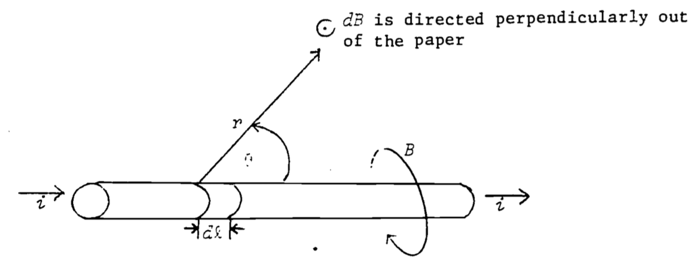
```

If the thumb of your right hand is pointed in the direction of the current, the magnetic field circles about the wire in the direction of the fingers of your right hand.

The force on a charge $(q)$ moving through a magnetic field $(B)$ is given by:

\begin{equation}
F=qvB\sin\Psi
(\#eq:physics-5)
\end{equation}

where  
&nbsp;&nbsp;&nbsp;&nbsp;$F$ = force (nt)  
&nbsp;&nbsp;&nbsp;&nbsp;$q$ = charge (coul)  
&nbsp;&nbsp;&nbsp;&nbsp;$v$ = velocity of charge (m/s)  
&nbsp;&nbsp;&nbsp;&nbsp;$B$ = magnetic field (weber/m^2^)  
&nbsp;&nbsp;&nbsp;&nbsp;$\Psi$ = angle between velocity vector and $B$ (as $v$ rotates into $B$).  
The direction of the force is as shown in Fig. \@ref(fig:fig-physics-5).

```{r fig-physics-5, echo=FALSE, fig.height=4, out.width = "75%", fig.cap='Force on charge moving through constant magnetic field.'}
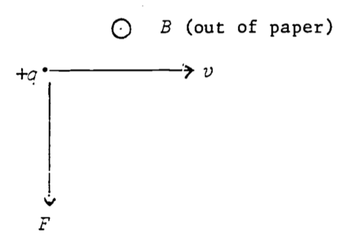
```

In other words, if the fingers of the right hand follow $v$ as it rotates into $B$, the thumb points in the direction of the force (true for positive charge--negative charge changes the sign of the force vector).

It is worth noting that all of what is now known as classical electromagnetic theory was summarized by Maxwell into four compactly written vector differential equations (beyond the scope of these modules!), cleverly called Maxwell's equations, which when solved by Maxwell led him to the following conclusion:

If two charges are initially held a distance $r$ from each other, and at time 0 one of the charges is made to jiggle up and down with a frequency $f$, the second charge will eventually experience a force on it which changes at the same frequency $f$ with which the distance between the two charges is varying. But it will *not* experience this changing force immediately at time 0! The news that the first charge has started to jiggle does not arrive until $\frac{r}{v}$ seconds after the jiggling has begun, where $v$ is the velocity at which the news travels, and which was predicted by Maxwell's equations to be:

$$v=\frac{1}{\sqrt{\mu_o\varepsilon_o}}=\sqrt{8.987\times10^9\times10^7}=2.998\times10^8m/s$$
$$=c=\;\mbox{velocity of light}$$
Note that $\varepsilon_0$ and $\mu_0$ were measured in the laboratory under static conditions as the proportionality constants in Coulomb's and Biot-Savart's laws, respectively. This seemingly remarkable coincidence, that electromagnetic radiation travels at the same speed at which light had been previously found to travel, led Maxwell to the inevitable conclusion that light was an electromagnetic phenomenon, which of course has been borne out. We now know that the light which we see is caused by the frantic jiggling of electrons, the color we see depending on the frequency of the jiggling. The electromagnetic spectrum extends far beyond the ability of our eyes to see however, ranging (in practical terms) from the very low frequency waves used in long-distance radio communication, through the higher frequency television and radar waves, through the infra-red (heat), visible, and ultraviolet, to X-ray and $\gamma$-ray frequencies. The study of the interaction of electromagnetic radiation of different frequencies with matter, its absorption, transmission, and reflection as dependent on the chemical make-up of the matter and the frequency of the radiation, has long occupied the physicist and is of central importance to the proper design of a living organism, plant or animal, enabling it not only to cope with its thermal environment but to sense the presence of its food or its enemies. Other modules also discuss this interaction and its importance in greater detail.

In conclusion, the electromagnetic forces are by far the most important of any of the basic force laws in understanding the living organism. Atomic processes, whether they be the "physical" processes involved in changes of state...solid, gas, or liquid...or the "chemical" processes involved in exchanges of partners between atoms, are basically manifestations of the electromagnetic force laws (sometimes necessarily being modified by the rules of quantum physics). Certain other processes, such as elastic collisions between molecules or between large objects, hence friction, are really the result of an electrostatic repulsion between molecules at close range. In short, most of biophysics and biochemistry could ultimately be explainable (in theory, at least!) by an elaborate application of Maxwell's classical laws and those of modern quantum electrodynamics.

### Other Force "Laws" {#physics-others}

**Friction, Intermolecular Forces, Hooke's Law**

There are other so-called force laws which are usually treated in elementary presentations, which, though apparently having a reality of their own, are seen on closer inspection to be consequences of the basic laws of electromagnetism. For example, the frictional "drag" force on a body moving through a fluid (liquid or gaseous) is observed to be proportional to the velocity of the body relative to the fluid if the velocity is slow enough that no turbulence is present. At higher velocities, the force opposing the motion may be more nearly proportional to the square of the velocity. This is the case when an airplane flies through the atmosphere at subsonic speed. The frictional force "law" is actually a consequence of the molecules of the fluid bombarding the object, changing their momentum during the act of collision, which is in turn a consequence of the strong repulsive electrostatic force between two molecules as they approach too closely. The sum of the basic electromagnetic interactions between a myriad of molecules results in the measured drag forces in a manner so complicated that the frictional effects have never been calculated from first principles.

The force between two molecules requires a knowledge of quantum mechanics for a full understanding; nonetheless a good qualitative understanding of such forces can be couched in classical terms. It is necessary to consider cases, since many molecules have fundamental asymmetries, such that the mean positions of their negative and positive charges do not coincide. The water molecule serves as an example, where the negative charge tends to reside more on the oxygen, creating what we call a *dipole*. Thus there are strong attractive forces between water molecules in a *dipole-dipole interaction*.

Even in molecules where the mean positive and negative charges coincide (*non-polar* molecules), such as is true in oxygen gas, the positive and negative charges do have some limited freedom to rearrange themselves, and this will happen in the presence of a nearby molecule. Since like charges repel and unlike charges attract, the charges rearrange themselves in such a way that the respective distances between like charges are slightly greater than the distances between unlike charges. The net repulsive force is therefore less (the like charges are farther apart) than the net attractive force (unlikes are closer together) and the molecules attract one another. Such a rearrangement is illustrated in Fig. \@ref(fig:fig-physics-6). It is known from the principles of quantum mechanics that non-polar molecules are attracted at long distances by a force which is inversely proportional to the seventh power of the distance, that is, $F = \frac{k}{r^7}$. However, when the molecules get too close they repel one another with great force. These results are summarized in Fig. \@ref(fig:fig-physics-7).

```{r fig-physics-6, echo=FALSE, fig.height=4, out.width = "75%", fig.cap='Induced dipole-dipole interaction in otherwise non-polar molecules.'}
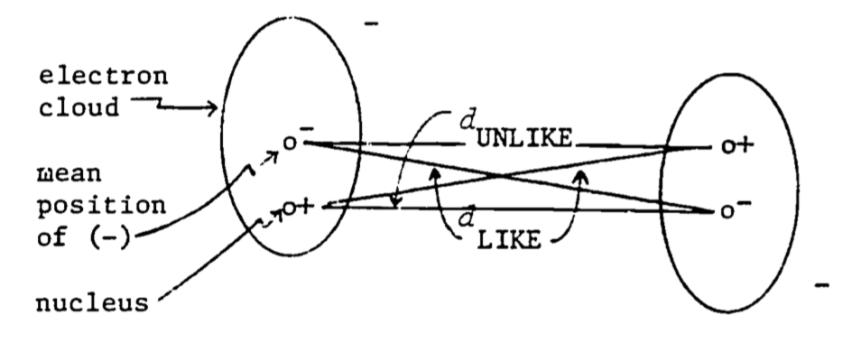
```

```{r fig-physics-7, echo=FALSE, fig.height=4, out.width = "75%", fig.cap='Force between two non-polar molecules as a function of the distance between then. A negative force implies attraction (redrawn from Feynman 1963)'}
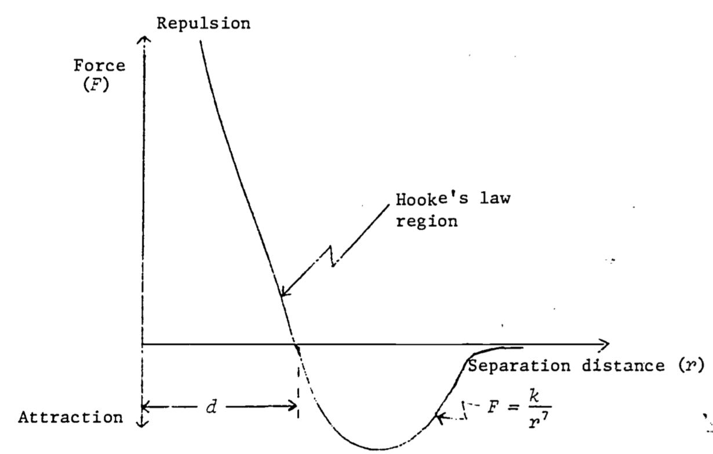
```

As seen in Fig. \@ref(fig:fig-physics-7), there is a distance $d$ at which there is neither attraction nor repulsion. This is where the molecules would remain in the absence of external forces. An attempt to push them closer together (to compress the substance) meets strong resistance. An attempt to separate them (to place the substance in tension) also meets resistance for a while, unless enough force is applied to break the bond (which fractures the substance). In a region around $d$, the force of attraction or repulsion (due respectively to tension or compression) is very nearly linear, a law which holds true for many materials, and which is known as *Hooke's Zara*:

\begin{equation}
F=kx
(\#eq:physics-6)
\end{equation}

where
&nbsp;&nbsp;&nbsp;&nbsp;$F$ = force (nt)  
&nbsp;&nbsp;&nbsp;&nbsp;$x$ = distance from equilibrium (m)  
&nbsp;&nbsp;&nbsp;&nbsp;$k$ = proportionality constant (nt/m)  

The various chemical interactions or exchanges of atoms between molecules are largely consequences of these and more complicated force laws (for more complex molecules) derivable from the basic laws of electromagnetism. The force laws by themselves however are not always so easy to work with. A much more elegant and deeper understanding of the interactions between molecules, and hence the life process, requires an understanding of the concept of energy, which we deal with next.

## Energy {#physics-energy}

### Work and Potential Energy {#physics-work}
Suppose we carry a bucket of water up ten flights of stairs. We would probably all agree that some work had been done. If we had had a course in physics, we would be inclined to say that we had done some work on the bucket of water (as well as on our own selves) in carrying it up ten stories. From our everyday use of the word "energy" we might also note that we expended considerable energy in getting the bucket of water to that great height, and we might intuitively believe that in some way we have imparted some of that energy to the bucket of water, though of course it doesn't look any different to us from ten stories up as it did at ground level. We will be calling this energy which we endowed to the bucket of water, the "potential energy," and justify this terminology by noting that if we were to open the window and pour out the water with careful aim onto the blades of a turbine at ground level, the energy of motion (i.e., the "kinetic energy") which the water builds up as it hurtles turbineward at an acceleration of 9.81 m/sec^2^, will set the blades of the turbine in motion, which in turn will generate several milliwatt-hours of electrical energy. On our return to the ground floor we will no doubt be confronted by the chief physicist of the project who will deprecatingly inform us that though, while we were ten stories up we had a good deal of potential energy ourselves, in walking back down we had lost it all and had effectively performed no net work beyond that which we performed on the bucket of water (or on just the water if we brought the bucket back with us). The water itself, while no longer possessing potential energy, *did* indeed convert that energy into some useful work in turning the blades of the turbine to produce electricity, but we did no useful work ourselves in descending the ten stories with the empty bucket.

Do physicists and physiologists have different ideas as to what work and energy are? Though it was a lot easier coming back downstairs with the empty bucket than it was going up with the full one, we know that it took some energy expenditure in getting back down the ten flights. And besides, if we had done no net work on ourselves, why do we need the food energy from a bologna sandwich before we can repeat the trip? To understand, we must become precise in our definitions, which we will do on the physicist's own terms (and which the physiologist will eventually find perfectly acceptable), and then we must bring these into accord with what we know must be true about our own bodily energy expenditure during the round trip.

If we slowly move an object a certain distance in a straight line, and if we must apply a force in the direction we move it (not counting the force necessary to overcome inertia---that's why we're moving slowly, so inertial "force" is negligible), the work done on the object by us is defined to be the force we applied, times the distance we moved, thus:
\begin{equation}
W=F_xx
(\#eq:physics-7)
\end{equation}
where  
&nbsp;&nbsp;&nbsp;&nbsp;$W$ = work (joules $\equiv$ nt-m)  
&nbsp;&nbsp;&nbsp;&nbsp;$F_x$ = force in x-direction (nt)  
&nbsp;&nbsp;&nbsp;&nbsp;$x$ = distance (m)

When the distance traveled is great enough that the force is changing as we move the object (such as might be true if we took an object several thousand miles up, so that the force of gravity is diminishing appreciably as we move, or if the object were attached to a spring, where the force is proportional to the distance from equilibrium) we must modify the above definition by summing the infinitesimal amounts of work done in moving the object a series of infinitesimal distances (over each of which the force is essentially constant), which of course is equivalent to finding the integral:

\begin{equation}
W_{12}=\int_{x_1}^{x_2}F_xdx
(\#eq:physics-8)
\end{equation}

where $x = x_1$ at the start of our travail, and $x = x_2$ at the finish. Note that work is done only by that component of the force acting in the direction of motion. Any component for force perpendicular to the motion does no work under this definition.

If the path of motion is not straight, we must give the most general definition of work, which takes the form of a line integral (see Fig. \@ref(fig:fig-physics-8)):
\begin{equation}
W_{AB}=\int_A^BF\cos\theta ds
(\#eq:physics-9)
\end{equation}

where $ds$ = incremental distance in direction of the path of travel  
&nbsp;&nbsp;&nbsp;&nbsp;$\theta$ = angle between F and direction of path.

Note that $F \cos \theta$ is the component of force in the actual direction of motion. Also note that the work done is computed from the force we must apply to the object, not from the force that is opposing our motion. (Otherwise it would have the opposite sign.)

```{r fig-physics-8, echo=FALSE, fig.height=4, out.width = "75%", fig.cap='Relations between F, $\\theta$, and $d_s$ used in computing work in moving an object from A to B.'}
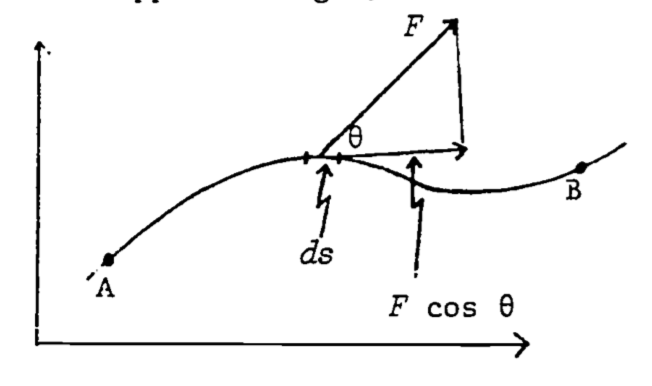
```

The actual calculation of a line integral is beyond the scope of this module, but this general definition of work is included for completeness.

Let's use the definition in order to compute the work done on the water in the bucket as we carry it up ten stories to a height $h$ above the ground. The force due to gravity, which is acting downward on the water (of mass $m$), is equal to $mg$. If we were to carry the water straight up (such as by climbing a vertical ladder) we would be applying an upward force mg, in the direction of motion. Thus the work we do on the water is force times distance, or:
\begin{equation}
W=mgh
(\#eq:physics-10)
\end{equation}

What if, instead of climbing a vertical ladder, we had carried the water up a plane inclined at the angle $(\phi)$ (Fig. \@ref(fig:fig-physics-9))?

```{r fig-physics-9, echo=FALSE, fig.height=4, out.width = "75%", fig.cap='Relations between quantiles needed to calculate work against gravity on an object being taken up an inclined plane.'}
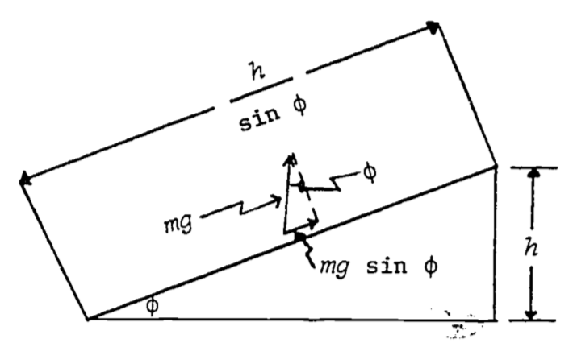
```

The vertical force we apply to the water is $mg$, while the component of force acting in the direction of motion is $mg \sin\phi$. The distance the water moves under this constant force is $\frac{h}{\sin\phi}$. Consequently the work is:
$$W=mg\sin\phi\frac{h}{\sin\phi}=mgh$$
The same as before! This is no accident. In fact, it is not difficult to see that the amount of work done on an object in raising it a height $h$, *by any path*, will always be $mgh$. (Imagine an arbitrary path from the ground to height $h$ to be approximated by an interconnected collection of infinitesimally short straight line segments, the $i^{th}$ one of which is tilted at an angle ($\phi_i$ and rising an amount $\Delta h_i$ over its length. The total work is thus $\sum mg\Delta h_i = mgh$.) When a force law has the property that the work done on an object in moving it from position A to position B is the same no matter which path we take in getting from A to B, we call, the force *conservative*. A corollary of this is that under a conservative force, a round trip from A to B and back to A again results in no net work being done. For if there were net work done in the round trip ABA, then all paths from A to B would not result in the same amount of work (since ABAB and AB are both legitimate paths from A to B, with the former clearly requiring more or less work when the round trip is thrown in).

When the force is conservative (as we have just shown to be true for a force which is constant in both magnitude and direction), then for an object of mass $m$ each point in space will possess a unique value for the work required to move the object to that point from some constant reference point. This value of work is unique in the sense that no matter which path were chosen to get from the reference point to the position in question, we would do the same amount of work on the object. Of course if we shift the reference point, we may change the value of work in getting to the position in question. So when we pick a reference point, let's not change it. We may now regard an object of mass m at some position in space as possessing the property that a certain amount of work has been (or could have been) done on it in getting it from the reference point to where it is now. However, we don't usually call this property "work" (since "work" is an action). Instead, we refer to this property as the *potential energy* of the object with respect to the reference point. Thus the potential energy of an object is the amount of work that would have to be done in taking the object from the reference point to its present location. To put it another way, the potential energy is the amount of work that the object could perform on something else in making its own way back to the reference point. Energy obviously has the same units as work (joules)---the two words are distinguished by our perception that "potential energy" is a *property* possessed by a body (as a consequence of its position in space) which would enable it to perform *an act* called "work."

The importance of our peculiar definitions of work and energy lies in the profound fact, which we will demonstrate subsequently, that under conservative force laws, the total energy of an isolated system remains constant. There may be exchanges of energy between certain parts of the system or there may be changes in form of the different energies (e.g., potential energy may be changed into the energy of motion), but the sum of all the component energies of the isolated system must remain forever constant.

Energy is recognized in several different forms, each associated with a different force law, and each expressed by a different formula. The different forms of energy we recognize are gravitational, kinetic, heat, elastic, electrical, chemical, radiant, nuclear, and mass-energy. Since there are only four basic force laws (taken in conjunction with Newton's second law), there is obviously some redundancy in this list. For example, what we call "heat energy" is in fact a manifestation of the "kinetic energy" (energy of motion) of the molecules of a substance.

Since the law of conservation of energy depends on the forces being conservative, it is well to ask whether the four basic force laws are conservative. They are indeed. There are no non-conservative forces! There are, however, some apparent non-conservative forces, such as friction. For example, if we slide an anvil from Dubuque to Peoria, the amount of work we do depends on which highways we slide it on. And surely if we make a round trip, we will do significantly more than zero work in getting back to Dubuque. Thus certainly our energy is not conserved. However, if we look at things more closely, we will discover that that work we did on the anvil, though not resulting in any potential energy gain by it, *did* result in setting a number of molecules in both anvil and highway in much more rapid motion. Our work went into heating the highway and the anvil, that is, increasing the kinetic energy of their respective molecules and hence, increasing the temperature of both road and anvil-- it didn't result in what we think of as useful work, but neither did it result in a loss of energy to the universe.

If you are wondering whether this work against friction can be recovered to perform work on something else, that is, if we could use the enhanced kinetic energy of the Molecules of the anvil and the highway to do work, the answer is we could use some of it, but not all. A good deal of this energy will be forever unavailable to do work, which we will see later is a consequence of the second law of thermodynamics and which we shall have to elaborate upon in terms of what we call the "entropy" and "free energy."

We can now begin to understand some of the differences between "physical work" (as defined by Equation \@ref(eq:physics-9) and "physiological work," such as we do when we run downstairs, or hold a heavy weight in a stationary position. In running downstairs, or at a constant level, though we're doing negative, or at best zero work against gravity, it seems apparent that we're doing considerable work against friction. Some of this results in a direct heating up of the environment---the air molecules we bump into are sped up, the molecules of the earth under our feet are given a jolt with each stride---but more significantly, there is a good deal of friction within our bodies as we run, many parts sliding and rubbing each other as our muscles contract and extend. We might think that since this energy remains within the body, in the form of kinetic energy, that it's not lost to us---we should still be able to get some useful work out of it. Again, the second law of thermodynamics denies this possibility for the most part, saying that we cannot get useful work solely by extracting energy from the kinetic energy of a randomly moving, i.e. disordered, array of molecules. Thus, since the body cannot make good use of this energy, it must release most of it, or else this kinetic energy will result in a disastrous rise in body temperature. Consequently, water is made to appear on the surface of our skin through the pores (i.e., we sweat) and as we learned previously, the more highly energetic of these water molecules will depart, leaving behind the slower ones. And the body cools.

But there's more to the explanation of physiological work than just external and internal friction. For imagine that we're not running, but instead are standing as still as we can, while holding an anvil at  chest height. There is no physical work being done, but there certainly is some physical exertion! If we were to set the anvil on a table, we know that neither physical work nor physical exertion would be required of the table. Why must we work so hard to do no physical work? The answer lies in the way our *striated* or *skeletal* muscles function.

Muscles consist of interdigitating protein filaments that slide past each other (Figs. \@ref(fig:fig-physics-10) and \@ref(fig:fig-physics-11)).

```{r fig-physics-10, echo=FALSE, fig.height=4, out.width = "75%", fig.cap='Muscle at rest.'}
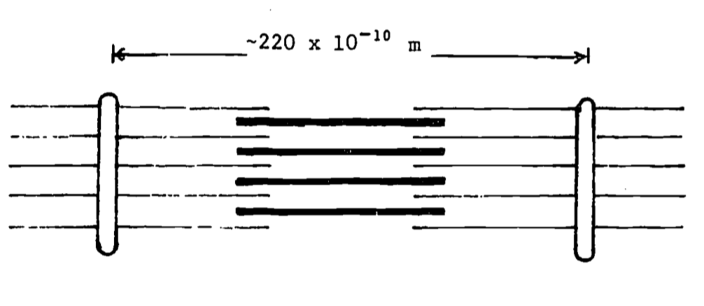
```

```{r fig-physics-11, echo=FALSE, fig.height=4, out.width = "75%", fig.cap='Muscle contracted.'}
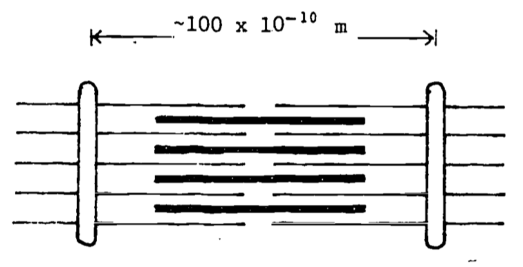
```

The energy which makes muscles contract comes mostly from the chemical energy stored in the molecular bond of a class of compounds called *phosphagens*, the most noteworthy of which is adenosine triphosphate (ATP). The ATP will release its energy in the presence of calcium ions, which are stored away from the ATP in a system of tubules (the *sarcoplasmic reticulum*) in the muscle cell. When an electrical signal from the nerve is delivered to a muscle fiber, the calcium ions in the sarcoplasmic reticulum are released into the fluid surrounding the muscle filaments. The ATP molecules present on these filaments release their chemical energy (by which we really mean electrical potential energy) and the muscle contracts, or at least attempts to. The calcium ions are immediately pumped back into the sarcoplasmic reticulum, and in fresh muscle, new ATP is created from another phosphagen present in muscle cells, which ultimately must get *its* energy from the oxidation energy available from food combustion. These processes all happen in a matter of hundredths of a second, after which the muscle cell relaxes. So what we actually see upon the electrical signal from the nerve, is a twitch in the muscle fiber! For us to lift and hold a constant load, say the weight of an anvil, there must be many twitches per second---the nerves are constantly firing, and ATP is constantly discharging its energy and re-energizing. It can do so only as long as the blood can resupply the energy to the muscle from that energy available from food consumption. Under heavy exertion the energy from food consumption cannot be delivered fast enough to the muscle, and the load must be dropped or the running stopped for want of ATP. (As you might guess, there's more going on than just this, but these are the essential features.)

It seems strange that nature should have evolved such an inefficient scheme for muscle action, but apparently this is what we must give up in order to have "fast" muscle. Nature seems to have been unable to have evolved muscle which can act rapidly and also sustain large static loads. The smooth muscle (such as that surrounding the intestines) is built quite differently, and acts much more like the table in holding a constant load, where the molecules essentially lock into position to sustain that load. The abductor muscle of the clam represents a good example of smooth (hence "slow") muscle which can effortlessly sustain a load over long periods. 

### Kinetic Energy {#physics-kinetic}

We must now formally obtain a formula for kinetic energy, which is defined to be the amount of work we do in overcoming the inertial force of a body of mass $m$, in getting it from zero velocity to a velocity $v$. The inertial force is given by Newton's second law, which we manipulate a bit using the chain rule for derivatives and recalling that the rate of change of velocity is acceleration:
$$F=ma=m\frac{dv}{dt}=m\frac{dv}{dx}\frac{dx}{dt}=mv\frac{dv}{dx}$$
We may insert this into the definition of work (Equation \@ref(eq:physics-8)) to get:
\begin{equation}
\mbox{Kinetic Energy}\equiv T=\int mv\frac{dv}{dx}dx=\int_0^vmvdv=\frac{1}{2}mv^2
(\#eq:physics-11)
\end{equation}
We are now ready to establish the law of conservation of energy, which we do forthwith.

### Conservation of Energy {#physics-conservation}

It's interesting to note that this cornerstone physics, the principle of conservation of energy, was first demonstrated by the German physician, Dr. Julius Robert Mayer, based on his observation that the venous blood of a patient in the tropics is redder than the venous blood of a patient in the temperate zone. This difference, he concluded, resulted from the body's lower oxidation rate required to maintain body temperature in the tropics: Mayer viewed the organism not as an independent entity, but as a part of the environment and responsive to its external surroundings, which led him eventually to an understanding of the mechanical equivalent of heat, and ultimately to a statement of the law of conservation of energy, which he published in 1842 in Liebig's *Annalen* on "The Forces of Inorganic Nature." Thus did biology make a signal contribution to physical theory.

The principle of conservation of energy is simply stated:

*In an isolated system, the total energy never changes.*

This is to say that if we are careful not to let anything bump into our system (such as air molecules), and if we keep it hidden from sources of radiant energy (such as the sun), then whenever we measure the kinetic and potential energies of the system's component parts, and add them up, we will always come up with the same answer.

For a single body acting under a conservative force, we may write one statement of the principle of energy conservation:
$$T + V = \mbox{constant}$$

where $T$ and $V$ are the respective kinetic and potential energies. A falling body, e.g., would every second be "losing" potential and "gaining" kinetic energies, but the total at any time is constant. 

Let's see if this relationship holds in the case of a body of mass $m$ falling freely in a gravitational field (neglecting frictional losses due to collision with air molecules). In such a case we would have:

\begin{equation}
\frac{1}{2}mv^2+mgh=\mbox{constant}
(\#eq:physics-13)
\end{equation}

If equation \@ref(eq:physics-13) is true then the time derivative of the left hand side must be zero. Taking this derivative:
\begin{align*}
\frac{d}{dt}(\frac{1}{2}mv^2+mgh)=\frac{1}{2}m\frac{d}{dt}(v^2)+mg\frac{dh}{dt}&=\frac{1}{\rlap{---}2}m\rlap{---}2v\frac{dv}{dt}+mg\frac{dh}{dt} \\
&=mv(-g)+mgv=0
\end{align*}

where we have chosen the positive direction for $h$ to be upward, $\frac{dh}{dt} = v$ (both $\frac{dh}{dt}$ and $v$ are negative), and the acceleration due to gravity $(\frac{dv}{dt} = -g)$ is a negative quantity since it is directed downward. Thus, the derivatives of both sides of \@ref(eq:physics-13) are zero and \@ref(eq:physics-13) is satisfied. We also interpret this to mean that the principle of conservation of energy is satisfied.

To show that conservation of energy holds in general is best done using the tools of vector analysis, which is beyond the scope of this module. It is easy to show without vector analysis that it must be true for an object moving in a straight line. Then if you're satisfied to think of an arbitrary curved path as being made up of infinitesimal straight line segments, you will be satisfied with the following:

All that need be done is to return to the development of the formula \@ref(eq:physics-11) for the kinetic energy, which was defined as the work necessary to get a body from zero velocity to a velocity $v$. If we wish to find the work done *on* the body in getting from a velocity $v_1$ (at point 1 in space) to a velocity $v_2$ (at point 2 in space), the steps are the same as in obtaining equation \@ref(eq:physics-11) except the final integral has limits $v_1$ and $v_2$:

\begin{align}
\mbox{Work in getting from 1 to 2} \equiv W_{12}&=\int_{v_1}^{v_2}mvdv \notag \\
&=\frac{1}{2}m(v_2^2-v_1^2) \notag \\
&=T_2-T_1
(\#eq:physics-14)
\end{align}

Equivalently, if the force acting on the body is conservative (work done is independent of path from 1 to 2), then we may figure out a potential energy (relative to an arbitrary point) of the body at each point, say and the work we must do $V_1$ and $V_2$, on the body in getting it from 1 to 2 is $V_2 - V_1$. If we release the body at point 2, the force associated with the p(potential (let's say it's gravity) will do en amount of work $W_{21} = V_2 - V_1$ on the body in getting it from point 2 to point 1. We may write:

\begin{equation}
W_{12}=-W_{21}=V_1-V_2
(\#eq:physics-15)
\end{equation}

Comparing this to equation \@ref(eq:physics-14) gives us the statement of conservation of energy:
$$V_1-V_2=T_2-T_1$$
or
\begin{equation}
T_1+V_1=T_2+V_2=\mbox{constant}
(\#eq:physics-16)
\end{equation}

since points 1 and 2 were arbitrary.

The principal assumption in this development is that the forces acting on the body are conservative, which we reiterate is true for all four known *basic* force laws, but which is not necessarily true for other so called forces such as friction. Thus, when we employ the conservation principle, we must be sure that the system we have in mind is isolated, or else we must account for exchanges of energy between the system and its surroundings. Conservation of energy is a universal principle, but it works only if we have accounted for all possible exchanges of all possible forms of energy. We will discover that the laws of thermodynamics provide a most convenient tool for dealing with these exchanges.

In passing, we point out one more assumption made in the development of the law, which though not of professional interest to biologists, should be of some philosophical interest. In the development of the expression for the kinetic energy, the mass of the object was assumed constant. In everyday circumstances this is true, but as you're no doubt aware, at velocities near the speed of light it is not true. When Einstein used his formula for mass as a function of velocity in the development of an expression for kinetic energy, he discovered that in order for the formulation to be consistent with conservation of energy, a net change in mass in an isolated system would be associated with a net opposite change in energy of magnitude $E = mc^2$, where $m$ is the change in mass and $c$ is the velocity of light. This is the form of energy previously referred to as mass-energy, and is of utmost importance to the under standing of nuclear reactions, though it won't concern us further here.

### Gravitational and Electrostatic Potential Energy {#physics-potential}

We can now establish formulas for gravitational and electrostatic potential energy. For reasons that will become apparent in the development, we usually choose $r = \infty$ to be the reference point for the potential energy; that is, we shall define $V_{\infty} = 0$. Thus if we take equation \@ref(eq:physics-15) and \@ref(eq:physics-8) in combination to define potential energy, then substitution of equation \@ref(eq:physics-2), Newton's law of universal gravitation, into the defining potential energy relations gives:
\begin{align*}
V_r-V_{\infty}&=-\int_r^{\infty}g\frac{Mm}{r^2}dr \\
V_r&=-G\frac{Mm}{r}
(\#eq:physics-17)
\end{align*}

where  
&nbsp;&nbsp;&nbsp;&nbsp;$M$ = mass of earth  
&nbsp;&nbsp;&nbsp;&nbsp;$m$ = mass of object whose energy we're computing  
&nbsp;&nbsp;&nbsp;&nbsp;$r$ = distance from center of earth

The negative sign is taken since the force is opposite to the positive $r$ direction. Since we expect that an object loses gravitational potential energy as it falls closer to the center of the earth, and since we defined $V_{\infty} = 0$, then we should expect $V_r$ to be able to take on only negative values, and to be getting more negative as $r$ becomes smaller. You may object that Newton's law of gravitation applies only to point masses (or infinitesimal masses) and that an accurate expression for the potential energy of an object at a distance $r$ from the center of the earth could only be obtained from an integral over all the infinitesimal volume elements of the earth. Gauss, however, in a beautiful theorem, demonstrated that one could treat a spherical object as though all its mass were concentrated at the center, and get the exact answer that one would get by performing the complicated integration!

We have derived two different expressions for the potential energy in a gravitational field, which may have led to confusion. In the first case, we made the assumption that we were raising an object to relatively low heights (say no more than a few miles) over which distance the force of gravity could be considered constant. It was most convenient to consider the earth's surface as the zero reference point for computing the potential energy. In the second case we used the more accurate expression for the gravitational force, the form of which led to infinity as the most convenient reference point for computing potential energy. Since in any practical situation we will only be interested in change in potential energy, the choice of reference potential energy is immaterial, because no matter what reference point is chosen, the calculated *change* in potential energy between two points will always be the same. We must not, however, change reference points in the middle of a calculation!

To demonstrate the power of the principle of conservation of energy, let's compute the "escape velocity" from the earth's gravitational field. Escape velocity will be defined as the velocity at which we must propel an object so that at a large distance the object is just barely moving. Thus at a great distance both the potential energy and kinetic energy will be zero. At the earth's surface, the total energy must therefore also be zero, allowing us to write:
$$\frac{1}{2}mv^2-G\frac{Mm}{R}=0$$
where $R$ = radius of earth.

Thus the escape velocity is $v = \sqrt{\frac{2GM}{R}}$.

Of greater biological importance is the potential energy associated with the electrostatic force. Since, like gravity, it is an inverse square law, there is no need to derive it again, but rather just write:

\begin{equation}
V=\frac{1}{4\pi \varepsilon_o}\frac{q_1q_2}{r}
(\#eq:physics-18)
\end{equation}

where once again infinity is chosen as the reference point. The sign is positive since, unlike gravity, the force between like charges is repulsive. (Of course, if the charges are unlike, we would come up with the negative energy associated with attractive forces.)

With the background that we've now gathered, we are ready to begin a discussion of the application of the principles we've developed to the study of thermodynamics, which we will find to result in a most elegant set of tools for the handling of some otherwise vexing, but nonetheless important, biological problems.

## Problem Set {#physics-problems}

PROBLEM 1:  
Cavendish claimed to be "weighing the earth" by his experiment. Using Newton's second law in combination with his law of universal gravitation, and using the facts that the acceleration due to gravity at the surface of the earth is g = 9.81 m/s^2^, and the radius of the earth is 6368 km, compute the mass of the earth. (In solving this problem, assume the mass is all at a point in the center of the body. It is a remarkable truth, as proved by Gauss, that as long as the bodies possess spherical symmetry, this gives the correct answer.)

PROBLEM 2:  
Determine the repulsive force between two electrons placed at a distance of 1 mm from each other.

PROBLEM 3:  
Determine the attractive force due to gravitation between the above two electrons (mass of electron $- 9.107 \times 10^{-31}$kg). Hence demonstrate that for electron the electrical force is about 10^42^ times as strong as the gravitational force.

PROBLEM 4:  
Compute the total magnetic field at the point in Fig.\@ref(fig:fig-physics-4) by summing (integrating) the contribution from all elements $dl$, in a very long wire carrying current $i$. (Assume the point is a perpendicular distance $R$ from the wire.)

PROBLEM 5:  
Determine the potential energy stored in a spring stretched from equilibrium a distance $x$. (Recall, Hooke's Law is $F = kx$.) Hooke's Law is, as you know, the same force law as that between two molecules at distances very near their equilibrium distance. This potential energy is a way of representing the vibrational energy of a diatomic molecule, which in the course of vibrating is rapidly exchanging potential energy (maximum at the maximum distance from equilibrium) for kinetic energy (maximum at the equilibrium distance).

PROBLEM 6:  
Show that $\frac{GM}{R^2}=g$, the acceleration due to gravity at the surface of the earth. Hence show that the escape velocity is approximately seven miles per second, knowing that $g$ = 9.81 m/s^2^ and $R$ = 6368 km

PROBLEM 7:  
A glaucous-winged gull weighing 2 kg carries a cockle weighing 0.25 kg to a height of 10 m where at a horizontal flight speed of 3 m/sec it releases the cockle whose shell will shatter on the rocks below, as soon thereafter as possible to be devoured by the gull. What is the minimum energy that the gull could have expended in rising to 10 m and achieving its level flight?

PROBLEM 8:  
At what speed will the cockle hit the ground?

PROBLEM 9:  
The lowest energy state for the electron in the hydrogen atom has been measured to be -217.3 $\times$ 10^-20^ joules. What is the radius of the hydrogen atom under this condition? (HINT: The centrifugal force of a mass moving in a circular orbit is $\frac{mv^2}{r}$. When this is equated to the electrostatic force holding the electron in orbit, a simple expression for the kinetic energy of the electron is obtained. Add this to the potential energy to get the total energy, which is -217.3 $\times$ 10^-20^ joules. Solve for $r$.)

## Answers to the Problem Set {#physics-answers}

1. 5.964 $\times$ 10^18^ kg  
2. 2.306 $\times$ 10^-22^ nt  
3. 5.532 $\times$ 10^-65^ nt  
4. $\frac{\mu_0i}{2\pi R}$  
5. $\frac{1}{2}kx^2$  
6. Using the relations $F = ma$ and $F = G\frac{mM}{R^2}$, we get $a=\frac{GM}{R^2}$ where we define $a = g$.
We substitute the relation $\frac{GM}{R}=gR$ into $v=\sqrt\frac{2GM}{R}$ to obtain $v=\sqrt{2gR}$. Substituting, we obtain $v=\sqrt{2*9.81*6368*10^3}$ m/s. We divide by 0.00062 to convert to miles/s. Obtaining v=6.93 miles/s.
7. 220.7 J  
8. $\frac{1}{2}gt^2 = 10$ so it took $\sqrt{\frac{20}{g}}$ seconds to reach the ground. By that much time the vertical speed reaches $v = g\cdot t^2 = 14$ m/s. Since the initial horizontal speed was 3 m/s and it is unchanged, the speed at the ground is $\sqrt{14^2 + 3^2} = 14.3$ m/s.
9. 0.530 $\times$ 10^-10^ m. Hence the diameter of a hydrogen atom is 1.06 $\times$ 10^-10^ m (or approximately 1 angstrom unit in an earlier terminology).


## Bibliography {#physics-bibliography}

Feynman, R.P., R. B. Leighton, and M. Sands. 1963. The Feynman Lectures on Physics. Addison-Wesley. Reading, Massachusetts.


