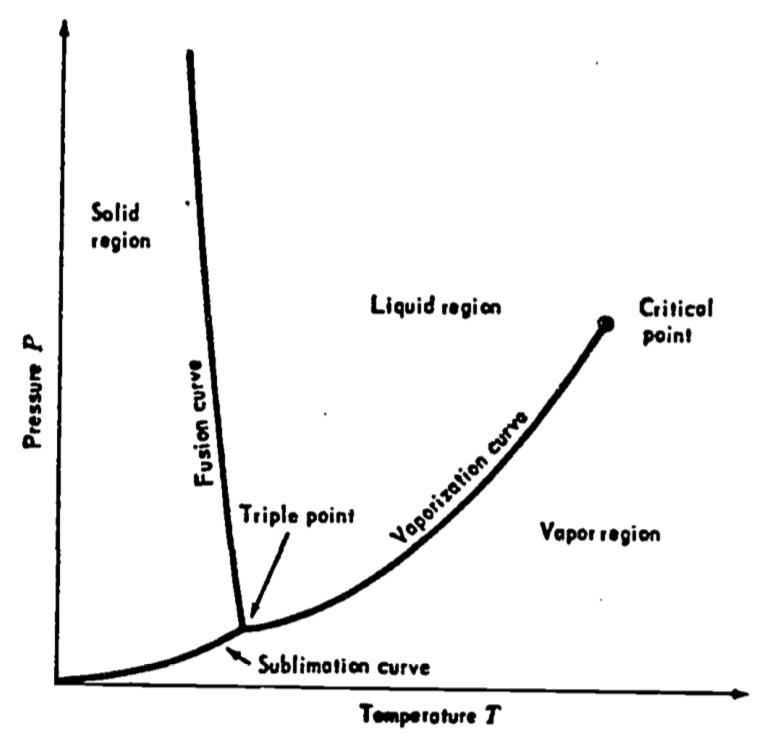
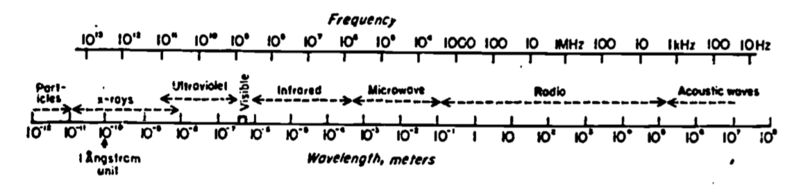
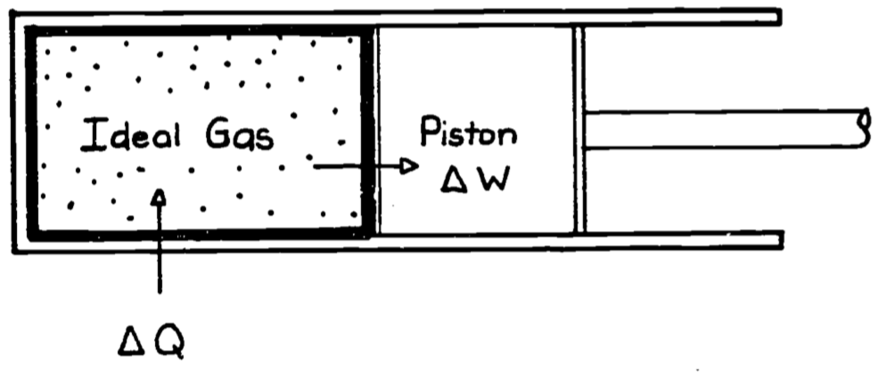
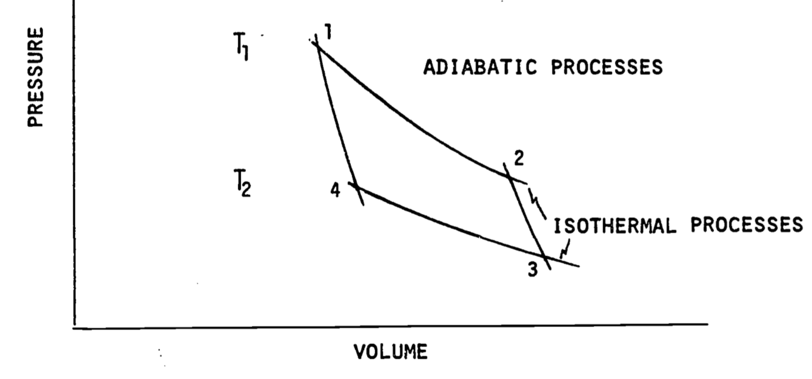

---
output:
  html_document: default
  pdf_document: default
---
# Thermodynamics Intro {#thermodynamicsintro}

The First Law of Thermodynamics for Ecosystems

author: Stevenson, R. D.

## PREFACE 
This module and the subsequent companion module address how elementary concepts of thermodynamics can be applied to ecological processes. The First Law of Thermodynamics states that during any biological, physical, or chemical process, energy can neither be created nor destroyed. The relationship between an organism and its environment can be studied by examining the exchange of energy in the form of the flow of heat and the transfer of mass. The primary focus in the module is on the microclimate and the exchange of heat between organisms and their environment. The law is also used to study the energetic cost of locomotion, rate of food assimilation, and energy flow in ecosystems. A basic knowledge of algebra is required in order to understand the text and complete the problem set.

The First Law of Thermodynamics is discussed in this module both in its difference and differential forms. An undergraduate student in the life sciences with a background in algebra should be able to understand all of the material herein. The problem set should be worked as it extends as well as reviews concepts developed in the text.

## ENERGY EXCHANGE OF ORGANISMS

This module develops elementary concepts of thermodynamics as they apply to ecological processes.	The First Law of Thermodynamics deals with the conservation of energy and is of fundamental importance.	It states that during any biological, physical, or chemical process energy can be neither created nor destroyed. This module and its companion "Application of the First Law to Ecological Systems" serve as a foundation for other modules in the thermodynamics series.

The relationship between an organism and its environment can be studied by examining the exchange of energy in the form of the flow of heat and the transport of mass. Temperature-dependent biological processes, such as the rate of photosynthesis and the production of metabolic heat, are universally recognized as important in ecology and have been the subjects of extensive research. The First Law of Thermodynamics is the basic tool needed to understand how the organism is coupled to the environment and to quantitatively describe the balance of energy inputs, outputs, and production that underlies the temperature dependence of physiological relationships. Thermal biology is broadly applicable but should be particularly relevant for physiologists, behaviorists, and ecologists.

It is well known that organisms have evolved special adaptations to survive in climatically extreme areas such as polar and desert regions. Less emphasis has been placed on the fact that all organisms continually exchange energy with the environment and must be adapted to heat and water vapor fluxes.	The climate and particularly the microclimate (climate in the immediate vicinity of the organism) influence these two exchanges.

It is often advantageous for an organism to reduce or increase the flow of heat energy by physiological or behavioral means; otherwise it may not be able to survive. The microclimate and thus heat balance may greatly affect distribution and activity time of plants and animals. The following four examples should clarify these ideas.

Moose are found in temperate forests throughout the northern hemisphere. During the summer this large herbivore selects three kinds of food to meet its nutritional requirements: small herbaceous plants, leaves, and aquatic plants. On Isle Royale in Lake Superior, Michigan, USA, individuals are commonly found eating in ponds or deciduous stands, or resting under conifers. Associated with each of these habitats is a microclimate that depends on the ground temperature, sunshine, wind speed, and humidity. Because of many factors including its large body size and small tolerance for changes on body temperature, the moose can quickly overheat if active during midday. Belovsky (1977) has made calculations indicating that during the summer moose carefully choose feeding times so as to minimize metabolic output with the constraint that the risk of overheating be small.

An example from the plant kingdom is cacti that have evolved special water storage structures to survive in the dry regions of North and South America. Local climate greatly affects the distribution of these plants because low temperatures will freeze the stored water, rupturing the cells and killing the plant. This fact is especially evident if we compare the large Sonoran Desert species with some South American cacti. In the desert around Tucson, Arizona, USA, the Saguaro cactus is limited to extremely low elevations where freezing weather never lasts longer than about 36 hours (MacArthur 1972). *Trichocereous terschenki*, a species of similar life form, is found at 2,700 meters in the Andes Mountains. Every night the temperature drops below freezing but because of the relatively constant day length the average daily temperature throughout the year is never below freezing. Therefore, even at this high elevation, the tropical latitude ensures that it is never cold enough long enough for the plant cells to freeze and rupture. Both plant species have the same form and thus similar growth and photosynthetic strategies and both can be killed if their cells are ruptured. Different microclimate patterns, however, seem to determine in part the distribution of Saguaro and *T. terschenkii* cacti.

Dayton (1971) studied an organism that is limited in its distribution by the physical environment. The anemone, *Anthopleura elegantissima*, is a common member of the rocky intertidal community of the northern Pacific Coast. To investigate the importance of microclimate, Dayton (1971) established aggregates in uncolonized areas during the autumn night tide. Large numbers survived through the winter but turned brown and died from desiccation during March and April when the tides shifted to the daylight hours. Presumably, the anemones received large amounts of radiation from the sun, which evaporated the water from the animals causing desiccation and which simultaneously raised their body temperatures contributing to their death. Thus, anemones that live above mean low water and therefore that are regularly exposed to a terrestrial environment are found underneath or in the cracks and crevices of rocks. These microhabitats receive much less sunshine (direct solar radiation) allowing the animal to survive out of water.

Clark and Lister's (1975a, b) investigation of the waxy covering of conifer needles provides the final example of the importance of heat balance for biological organisms. Electron microscopy revealed the cuticle of each needle was covered with tubular crystals of wax. Clark and Lister hypothesized that this material was part of the plant's stress avoidance system. They found (1) that the crystals were very effective in reflecting light in the shorter (blue) wavelengths of the visible spectrum, (2) that in all the species examined the amount of crystals increased with higher elevation (more radiation) and the sunnier habitats and (3) that a theoretical calculation using the diameter of particles shows that a large amount of ultraviolet light would also be reflected (Mies scattering). Two well-known observations agree with Clark and Lister's evidence: (1) conifers become bluer in color (from increasing wax covering) with elevation (this trend is exemplified by the Blue Spruce *Picea pungens* Engelm. var. *hoopsii*) and (2) foresters have found that conifer seedlings derived from low elevation stock will die if transplanted to higher elevations, while plants from higher elevations survive at lower elevations but grow slowly. Clark and Lister have suggested that larger amounts of wax found on the higher elevation plants reduce the uptake of CO~2~, slowing photosynthesis but allowing the conifers to avoid otherwise intolerable ultraviolet radiation and drought stress.

It should be noted that the patterns we observed in the above examples may not be completely explained by the relation between an organism and the physical environment. Other physical, historical, chemical, and biological factors are also very important. For instance, moose are critically limited by the amount of sodium available, whereas cacti may need specific kinds of soils and pollinators. The physical stress of waves and drift logs prevent anemones from colonizing and in certain climates conifers cannot compete with deciduous trees. The relation between an organism and the physical environment provides a useful baseline or null model for investigating the organism's ecology.

The above examples have been included to emphasize the importance of the microclimate for both plants and animals. All organisms exchange heat with the environment. In this module we will focus on the First Law of Thermodynamics, the physical principle needed to understand this heat balance. The First Law can also be useful for other kinds of ecological interests such as the energetic coat of locomotion, rate of food assimilation and energy flow in ecosystems. Some discussion of these topics is also included. More biological examples of the physical principles elaborated here can be found in the module titled "Applications of the First Law to Ecological Systems." The reader may wish to review the principles and definitions of this module, which may be difficult to absorb entirely without the examples of the second module.

## THERMODYNAMICS

Thermodynamics is the study of energy and its transformations. The First and Second Laws of Thermodynamics form the basis for this science. They can be stated simply as follows: First Law--energy is conserved; Second Law--all available energy cannot be converted to useful work. The First Law is intuitively easy to grasp, as biologists are aware of many kinds of conservation processes. The Second Law, on the other hand, is more difficult to apply but is fundamental to all organisms. Using the example of a living tree, we know from the Second Law that all the energy made available from photosynthesis cannot be converted into useful chemicals for maintenance and growth. There is a certain price paid for the use of energy represented by the structure of the tree. When the tree dies evidence of the Second Law is more obvious. The energy from the sun needed to maintain the tree in an ordered living state can no longer be utilized and the molecules of the tree become scattered in the environment. Schrodinger (1945) has called living things machines that pump out disorder. Further discussion of the Second Law will be found in other modules.

The usefulness of thermodynamics is in the wide range of applications of its concepts and in our ability to represent these ideas mathematically. Thermodynamics was developed to answer practical problems in engineering sciences. The traditional subject areas that are associated with thermodynamic theory are power generation and heating and ventilating (mechanical engineering), industrial chemical processes (chemical engineering), rates of reaction (chemistry), and statistical mechanics (physics). The universality of physical laws makes the use of thermodynamic processes in ecological systems a natural step. Scientists such as meteorologists, physiologists, climatologists, foresters, and agronomists use thermodynamics to study natural and/or biological systems.

### Scope of Thermodynamics

Thermodynamics is applied at the **microscopic** scale to understand the properties of individual particles. Kinetic theory or statistical mechanics, as this subject is known, describes the position and velocity of all the molecules in a system. Our interest here is the **macroscopic** scale. Although macroscopic theory can be derived from statistical mechanics, historically it was developed first from experimental results. Macroscopic theory describes properties of the system that are general across materials. Furthermore, the variables needed to describe the macroscopic view of the system are few, perceptually obvious (for the First Law), and usually measurable. For example, we may wish to calculate the heat loss of a deer. The surface temperature of the different appendages of the deer would refine our estimates, but the temperature distribution of the cells of the deer's ear is not necessary to understand the heat energy balance of the animal with its environment.

Included within the scope of thermodynamics are heat energy and mass flow, both of which are important in biology. Energy flow usually involves heat transfer such as a lizard using the sun to elevate its body temperature. The release of water vapor is an important example of mass flow. In order to photosynthesize a green plant must release water vapor to absorb carbon dioxide. This process is called transpiration. Transpiration also affects the heat balance so that the heat and mass flow are coupled processes. Another example of the importance of mass flow is the study of carbon dioxide cycle in the process of photosynthesis. For animals, mass flow in the form of water vapor is commonly used to reduce heat stress. Mechanisms include heat lost during evaporation of water by respiration, sweating, and/or directly through the skin.

### Systems Concepts

The focal object is called the **system** in thermodynamics. The boundaries of the system are arbitrary and need not represent real physical boundaries. The system might be a spider or ground squirrel, but it could be a group of huddling penguins. A plant, a leaf, and a canopy are other examples of systems. An ecologist might very well be interested in an inanimate part of the environment because of the organisms found in that system. Examples are a dead tree trunk, a pond, or the soil. Anything outside of the system that affects its behavior (thermodynamically) is called the **surroundings**. Identifying the system and its surroundings is usually straightforward. The terms are useful for describing a problem in general terms.

A system is said to be in **thermodynamic equilibrium** if it is the same temperature as its surroundings. A system is said to be in **steady state** if its temperature is not changing with time. It is important to consider the time scale here. For instance, the soil temperature one meter down varies only about 1% on a daily time scale but from season to season the variation may be substantially greater. In contrast, consider a leaf that has just become shaded because a cloud covered the sun. The leaf will not receive the radiation energy from direct sunlight and its temperature will quickly fall to a new steady state and thus a new temperature. The same kind of thermal behavior applies to other small objects that do not produce significant metabolic heat such as many insects.

Large objects, for example, a pond, a tree trunk, or a camel may often be in **non-steady (transient) state**. This is a result of two physical ideas. First, if the system is large it takes a long time for it to come to equilibrium. The temperature of a tree trunk, if suddenly shaded as in the leaf example, would not come to equilibrium for a much longer time. The temperature of the system will be changing but it is changing so slowly that it appears to be in steady state. Even a homeotherm such as a white-tailed deer may have either a net gain or loss of energy at any particular instant during a twenty-four-hour period but its body temperature will only show a variation of about $2^{\circ} C$. This non-steady state behavior is further complicated by the fact that radiation, air temperature, wind, and humidity (the effects of the environment or surroundings of the system) are also changing with time. Therefore, a system with a large mass may never reach equilibrium. Fortunately, it is possible to describe such systems accurately as we will see in a later module on heat transfer processes. 

All real systems and especially biological systems are **open**. That is, they exchange mass and energy with their surroundings. All organisms not only exchange heat energy with their environment but they must ingest food or absorb nutrients to sustain life processes. A **closed system** is one in which no mass is exchanged with the surroundings. In biology, environmental chambers are often constructed to approximate closed systems and are used by physiologists to study the metabolism and the water balance of organisms. These kinds of experiments are usually on a limited time scale and will not violate closed system assumptions. An open system may have temperature discontinuities at different points in the system whereas a closed system which by definition does not permit mass exchange will have a continuous temperature distribution. Finally, an **isolated system** exchanges neither mass nor energy across its boundary. In the special case where heat energy is not exchanged, we say an isolated system has an adiabatic wall which acts as a perfect insulator. Isolated systems have been used to study heterogeneities in the system variables of coupled chemical reactions. Here, people usually are interested in the internal processes of the system. 

A **reversible process** is an idealized thermodynamic process in which no energy is lost. Although no such process exists, the distinction will prove to be useful just as the distinction among open, closed, and isolated systems is useful. In any real energy exchange there is heat loss due to friction that is not recoverable. This fact is one manifestation of the Second Law.

### Temperature

Considering the definition of temperature is instructive when applying thermodynamics to biology. **Temperature** is a macroscopic measure of the molecular vibrations within a system (see discussion of internal energy below). If two systems A and B are in **thermal equilibrium** with a third body (a thermometer) then A and B are in thermal equilibrium. Formally this is the Zeroth Law of Thermodynamics and can be stated: "there exists a scalar quantity temperature, which is a property of all thermodynamic systems (in equilibrium states), such that temperature equality is a necessary and sufficient condition for thermal equilibrium."

The three most common temperature scales are Fahrenheit ($^{\circ}F$), Celsius ($^{\circ}C$), and Kelvin ($K$). These are based on a single fixed point, the unique triple point of water which by international agreement was set at $273.16 K$. In Figure \@ref(fig:fig-thermintro-1), pressure $P$ is plotted against temperature $T$ for some substance such as water. Solid, liquid, and vapor regions occur at different combinations of temperature and pressure; however, there is a single point at which the three phases occur simultaneously. This fact allows the definition of temperature scales with reference to a unique physical value.

> Table 5.1 summarized some of the common temperatures expressed in the different scales. Formulae are given to convert a measurement in one scale to that of another.

```{r tab1-2, echo=FALSE, message=FALSE, warnings=FALSE, results='asis'}
tabl <- "  
|                       | $^{\\circ}F$ | $^{\\circ}C$ | $K$     |
|-------                | ---:        | ---:        | ---:    |
|Absolute zero          | -459.67     | -273.15     | 0.00    |
|Ice point of water     | 32.00       | 0.00        | 273.15  |
|Triple point of water  | 32.018      | 0.01        | 273.16  |
|Boiling point of water | 212.00      | 100.00      | 373.15  |"
cat(tabl)
```

$$ ^{\circ} F = 1.8 ({^{\circ} C}) + 32.00 $$
$$ K = {^{\circ}C}+ 273.15 $$

```{r fig-thermintro-1, echo=FALSE, fig.height=5, out.width = "75%", fig.cap='A pressure-temperature diagram for a substance such as water. The triple point is the point of intersection of the sublimation, fusion and vaporization curves. From Zemansky, M.W. and H.C. Van Ness. 1966. P. 200.'}

```


Now that it is clear how temperature-sensing devices can be scaled, we can briefly describe some of these instruments. Constant-volume gas (hydrogen or helium) thermometers have long been used as the standard thermometric instruments. Liquid in a glass capillary is the most familiar instrument for measuring temperature. Today many temperature measurements are made with electric resistors, thermocouples, and thermistors. For a thermocouple, thermal emf (electromotive force or voltage difference) is measured between a reference junction and a test junction (thermocouple) made of two metals. Electric resistors (platinum for instance) and thermistors (semiconductors) use the principle of the change in electrical resistance of the sensor to determine temperature. 

The definitions included above should serve as a basis for thermodynamic language. We can now begin our discussion of a fundamental postulate, the First Law of Thermodynamics.

***

## FIRST LAW OF THERMODYNAMICS

The First Law of Thermodynamics applies the principle of energy conservation to the boundaries of a system of interest. The First Law says that the change in internal energy is equal to the heat added to the system minus the work done by the system to the surroundings. This is written
\begin{equation}
\Delta U = Q - W
(\#eq:thermintro-1)
\end{equation}
where 
<div class="nobullet">
* $\Delta U$ is the change in internal energy, 
* $Q$ is the heat added to the system, 
* and $W$ is the work done by the system to the surroundings.
</div>

Equation \@ref(eq:thermintro-1) can also be written in differential form as
\begin{equation}
dU = \delta Q - \delta W
(\#eq:thermintro-2)
\end{equation}

This formulation is important for describing infinitesimal changes and reversible processes. Thermodynamics texts often use $d$ and $\delta$ symbols to make the distinction between exact and inexact differentials, respectively. To clarify this consider the following example. If we were to call the internal energy of an ideal gas system $U_A$ at state A, then as we will discuss in more detail later, the state variables of the system are $P$ for pressure, $V$ for volume, and $T$ for temperature which together specify $U_A$. Now if the system changes to a new state B, where $U_B = f (P_B,V_B, T_B)$, we know that this change in state is described by equation \@ref(eq:thermintro-2). However, work and heat cannot be uniquely expressed in terms of the system variables $P$, $V$ and $T$. Thus, although we know the magnitude of the difference for the change of state, $dU$, we cannot resolve it into components of heat and work. The total change in $W$ and $Q$ depends upon the particular "path" through which the system goes from $U_A$ to $U_B$ (see Figure \@ref(fig:fig-thermintro-4) for a simplified representation which is described in detail later), i.e., the path of integration of $\delta W$ and $\delta Q$ between $U_A$ and $U_B$. The inexact differential, $\delta$, is used to remind the reader of this fact.

 
One will find other sign conventions for the First Law. Here, we defined $dU$ to be positive when the energy flows into the system. Therefore the heat $Q$ flows into the system adds to its internal energy while the work $W$ done by the system subtracts from the internal energy. It is important to realize that once a convention has been agreed upon one must be consistent to account properly for the changes in the internal energy of the system.

The units of equation \@ref(eq:thermintro-1) are energy units. A variety of different units are used in the engineering as well as the biological literature. The calorie is a common unit for biological measurements. It is defined as the energy necessary to raise one gram of water from $14.5^{\circ}C$ to $15.5^{\circ}C$ at atmospheric pressure. We will use the International System of Units (SI), consistent with most scientific research. Therefore, the joule will be used as the basic energy unit. Appendix I is included to help the reader with units. One may also wish to review the module devoted to units and dimensions. Furthermore, the student should also be aware that the First Law is often used with other dimensions such as (1) energy per unit area, (2) energy per unit time (power or flux), and (3) power per unit area (flux density).

### Internal Energy

The internal energy $U$ is often intended to mean the thermal energy of the system represented by its temperature. In general, the chemical energy, or the energy holding atoms together, of the system is included as part of the internal energy function. Many studies have measured the energy flows of ecological systems to learn about trophic levels, food webs, and ecological transfer efficiencies. Commonly, the mass of each standing crop and the flow are measured and then converted into total chemical energy by a laboratory procedure such as bomb calorimetry. The thermal internal energy is the vibrational energy of the molecules and is indicated by the temperature of the system. In most instances there will be no structural changes of the material within the range of temperatures normally found in the environment. The most common exception of thermobiological importance is the increase of internal energy of H~2~O during melting (ice to liquid), sublimation (ice to vapor) and evaporation (liquid to vapor) (See Figure \@ref(fig:fig-thermintro-1).)

### Heat and Heat Transfer Processes

The second term, $Q$, in the equation for the First Law of Thermodynamics is called heat. **Heat** is energy in transit. **Heat transfer** is a spontaneous process in which heat flows from warmer objects to colder objects. The study of heat transfer involves measuring the rate and magnitude of heat flow.

There are four kinds of heat transfer mechanisms relevant to this discussion: (1) conduction, (2) convection, (3) radiation, and (4) evaporation. **Conduction** describes the physical process of thermal energy transport in solids. Examples are heat flow in soils, between animals and the ground, and between animals that are in bodily contact. **Convection** is the transfer of heat between solids and fluids (i.e., gasses and liquids) or when fluids of different temperatures are in contact. The wind blowing over or around a leaf is one example. Conduction takes place with nearby particles but the additional factor of the circulation of the fluid distinguishes convection from conduction. If there is no motion in the fluid except that caused by the heat transfer the process is called **free convection**. If the fluid is moving relative to the other fluid or solid, the process is called **forced convection**. Convection is a complex process involving heat transfer and fluid dynamics.

The process by which energy can be transmitted without the presence of an intervening medium is called **radiation**. All objects, living and nonliving, radiate energy. The amount and kind (wavelength in the electromagnetic spectrum) of energy depends on the temperature and physical characteristics of the radiating body. Figure \@ref(fig:fig-thermintro-2) shows the electromagnetic spectrum, which is characterized by either of two scales, frequency $f$ or wavelength $\lambda$, (the scales are inversely proportional). Radiation is a field phenomenon having both particulate (photons) and wave characteristics. Acoustic waves, however, require an intervening medium. The physics of radiation is described in greater detail in other modules.

```{r fig-thermintro-2, echo=FALSE, fig.height=2, fig.show = "hold", out.width = "100%", fig.align = "default", fig.cap='Electromagnetic spectrum as a function of both frequency (f) (Hertz or cycles sec) and wavelength ($\\lambda$) (meters). From Byers, H.R. 1974. General Meteorology. P. 8.'}

```

The last heat transfer process important in the heat term of the First Law is evaporation. **Evaporation** is the process that transports water by changing it from a liquid to a gas. For animals, water vapor may be lost during respiration, through special sweat glands, or through any part of the skin. The physiology of the species must be known to estimate this heat and mass flow. Higher green plants lose water vapor to the atmosphere through stomata in a process called transpiration. The physics of this heat transfer process will also be presented in a later module.

Before considering work, the last term of eq. \@ref(eq:thermintro-2), we will define the heat capacity. It is
\begin{equation}
C_x = (\frac{\delta Q}{dT})_x
\end{equation}
where $x$ is some state variable such as pressure, volume or temperature for a gas system. By specifying $x$, one indicates the path of the process as well as its reversibility. For $P$, $V$, $T$ systems it is customary to define

\begin{equation}
C_V = (\frac{\delta Q}{dt})_V
(\#eq:thermintro-3)
\end{equation}

and
\begin{equation}
C_P = (\frac{\delta Q}{dT})_P
(\#eq:thermintro-4)
\end{equation}
In eq. \@ref(eq:thermintro-3) $V$ means that the process of adding heat to the system is carried out at constant volume. $C_V$ represents the proportionality constant for the change in temperature per unit amount of heat added. Similarly in eq. \@ref(eq:thermintro-4) $P$ stands for a constant pressure process.

### Work
To complete the introduction of the First Law of Thermodynamics we need to examine the concept of work. When considering work we usually think of mechanical work, which is a force times a distance operating in some system. In this module work is done by the system on the surroundings, thus decreasing the system's energy. Furthermore we consider only **external work** and are not concerned with processes that go on inside the system.

If our system is an organism then we would not be concerned with the work associated with internal chemical reactions. On the other hand if the system of interest is the heart then one would wish to know the work done by the heart on the rest of the body.

To illustrate work and the other terms in the First Law we use the classical thermodynamic example of the gas in a piston. This example is also of historical importance because one motivation for the development of thermodynamic theory was to describe and predict the behavior of steam engines, which used heated water vapor as a source of energy to derive mechanical work. Figure \@ref(fig:fig-thermintro-3) depicts the system of interest where the thick line represents the boundary enclosing the system, in this case a gas. Here the work done by the system is
\begin{equation}
\delta W = PdV
(\#eq:thermintro-5)
\end{equation}

where $P$ is the external pressure. For reversible processes the system pressure can be used. Figure \@ref(fig:fig-thermintro-4) shows a plot of $P$ versus $V$. To calculate the work done we need to know the area under the curve which can be obtained numerically or by integration if $P$ is given as a function of volume.

One such relationship is known as the Ideal Gas Law. Historically it can be arrived at from experimental evidence but it can also be derived using a statistical mechanics approach. It is called an equation of state because it describes the relation among the macroscopic variables of the system ($P$, $V$, $T$) at an equilibrium state. Thus these variables $P$, $V$, $T$ are called state variables.

```{r fig-thermintro-3, echo=FALSE, fig.height=3, fig.show = "hold", out.width = "100%", fig.align = "default", fig.cap='Ideal gas contained in a piston chamber. $\\Delta Q$ will be zero if the wall surrounding the system is perfectly insulated (adiabatic). $\\Delta W$ represents the change it work accomplished by moving the piston.'}

```

```{r fig-thermintro-4, echo=FALSE, fig.height=3, fig.show = "hold", out.width = "100%", fig.align = "default", fig.cap='Pressure-volume diagram. A cycle is composed of going from 1 to 2, 2 to 3 and so on back to 1. When the cycle is composed of isothermal and adiabatic processes it is called a Carnot Cycle. Other cycles can involve constant pressure or constant volume steps. Note that $T_1$ is greater than $T_2$.'}

```

The Ideal Gas Law is
\begin{equation}
PV = nRT
(\#eq:thermintro-6)
\end{equation}
where $R$ is the gas constant which depends on the particular gas being considered (8.314 joules mole^-1^ K^-1^ for the ideal gas), $n$ is the number of moles, and the other variables are as above.

To complete our discussion of the piston example we need to examine several specific cases of the First Law. If the system is perfectly insulated then $Q$ is zero and the First Law becomes
\begin{equation}
\Delta U = -W
(\#eq:thermintro-7)
\end{equation}

This is called an adiabatic process. Here since the internal energy is a function of state then the work done will also just depend on the end points and not the path.

If we wish to consider an ideal gas, the change in internal energy with respect to volume at constant temperature is zero so
\begin{equation}
dU = C_V d T
(\#eq:thermintro-8)
\end{equation}
Thus the First Law becomes
\begin{equation}
C_V d T = \delta Q - PdV
(\#eq:thermintro-9)
\end{equation}
If eq. \@ref(eq:thermintro-9) applies then it is possible to calculate $\Delta U$, $Q$ and $W$ for any path. $W$ can be evaluated numerically, $\Delta V$ can be calculated from the change in temperature (from the Ideal Gas Law) and $Q$ is gotten by subtraction.

These equations are not directly applicable to ecological systems but they help give an understanding of the First Law and provide a foundation for understanding heat engines and the Second Law of Thermodynamics.

In this introduction to thermodynamics we have tried to stimulate the reader's interest by illustrating with biological examples the importance of the heat energy and mass balance of organisms. The basic thermodynamic terminology and the First Law are presented as a basis for other modules in the thermodynamics series. Examples of how these concepts are applied are found in the next module titled "Applications of the First Law to Ecological Systems." The bibliography should help the reader to explore the importance of thermodynamics in ecology.

***

## PROBLEMS
1. (a) Definitions to review: temperature, system, radiation, equilibrium, convection, steady-state, reversible, evaporation, heat, work, conduction, thermodynamics, internal energy, The First Law 

(b) True or false  
i. The First Law says that energy is conserved within the system.

ii. The integral $\int PdV$ gives the work done for all processes.  

iii. To calculate the work done in a reversible process one must only know the initial and final states of the system. 

iv. Sometimes the First Law is written as $\Delta U = Q + W$. In this sign convention work is done by the system on the surroundings.

2. Calculations  
(a) Change to Fahrenheit and Kelvin readings: 46°C, 30°C, 15°C, 0°C, -10°C, -23°C.<br>

(b) Convert to Celsius scale: 50 K, 300 K, 350 K, 72°F.

(c) The range of naturally occurring air temperatures in the continental U.S. is approximately -66°F to 134°F. What is this on the Celsius scale?

(d) At what temperature would a Celsius and a Fahrenheit thermometer read the same?

3. In the text work was given as the integral of pressure times the change in volume. Show this is equivalent to the traditional definition where work is equal to a force times a distance.

4.(a) Sometimes the First Law is given as
$$\Delta E=\Delta E_k+\Delta E_p+\Delta U$$
where $\Delta E$ is the total energy of the system, $\Delta E_k$ is the kinetic energy of the system and $\Delta E_p$ is the potential energy of the system. Consider a 50 meter high waterfall. What is the potential energy of 2 kg of water at the top of the falls with respect to the bottom. What is its kinetic energy if its horizontal velocity is $2 m s^{-1}$?

(b) Assume that there is no energy exchanges with the surroundings. Write the First Law.

(c) Just before the water hits the pool at the bottom of the falls what is the change in potential energy. Where has the energy gone assuming-there is no heat exchange between the liquid and the surroundings.

(d) When the water hits the pool what happens if there is no motion in the pool. Calculate the change in temperature that takes place. (Assume that $4184 J kg^{-1}$ must be added to the system for a 1°C change.)

5. For an ideal gas assuming reversible processes how would one calculate $\Delta U$, $Q$ and $W$ for an adiabatic, a constant temperature, a constant pressure and a constant volume process.

6. Thought questions: <br>\newline
Acquaint yourself with the activity times of several different kinds of organisms. From this information, suggest how each organism has become adapted to its thermal environment. Are there specific physiological characteristics that allow it to survive? Are behavioral sequences important? All organisms require a source of energy. How have food and nutrition requirements influenced the thermal niche of each organism? Discuss activity, resting and dormancy on both a daily and seasonal basis.

7. In general if an organism is at a warmer temperature does it grow and reproduce more quickly? What implications might this have for ecology? How might thermodynamics be helpful?

## PROBLEM SOLUTIONS
1. (a) Definitions are in the text. 

(b) All false.  

2. 
```{r}
#a)
#temperatures in C, °F = 1.8°C + 32
temps.C= c(46, 30, 15, 0, -10, -23)
#Convert to F
1.8*temps.C+32
#Convert to K, °K = C + 273.15 
temps.C+273.15

#b)
temps.K=c(50, 300, 350)
#Convert to C
temps.K-273.15

temps.F= 72 
#Convert to C, °C = 5/9 ( F - 32)  
5/9*(temps.F-32)

#c) 
temps.F= c(-66,134)
#To C
5/9*(temps.F-32)

#d) 
#x=1.8*x+32
#-0.8x=32
32/-0.8

```

3. $W=\int PdV=\int \frac{F}{A}\cdot A\cdot dl=\int Fdl$
where $F$ is force, $A$ is area and $dl$ is the change in length.

4. 
(a)

\begin{align*}
E_p &= mgh = 2 kg \cdot 9.8 m s^{-2}\cdot 50 m = 980 kg m^2 s^{-2} = 980 J \\
E_k &= \frac{1}{2}mv^2 = \frac{1}{2} \cdot 2 kg (2 m s^{-1})^2 = 4 J \\
\end{align*}

(b) $\Delta E_p + \Delta E_k + \Delta U = 0$  

(c) All the potential energy is now kinetic energy which now totals 984 J.  

(d) Turbulent mixing occurs when the water hits. The temperature rise is
$$\frac{984}{2 kg\cdot 4184Jkg^{-1}°C^{-1}}=0.12°C$$
5

|                      | $\Delta U$ |           $W$           |      $Q$     |
|:--------------------:|:----------:|:-----------------------:|:------------:|
|       adiabatic      |    $-W$    |         $C_VdT$         |       0      |
| constant temperature |      0     | $RT\:ln\frac{P_1}{P_2}$ |      $W$     |
|    constant volume   |     $Q$    |            0            |    $C_VdT$   |
|   constant pressure  |   $C_VdT$  |       $P\Delta V$       | $W+\Delta U$ |


6. Class discussion

7. (a) This is an ongoing area of research. Hamilton (1973) used a general comparative approach and found the hotter is faster up to about 40°C for many terrestrial organisms. Eppley (1972) found a similar result for phytoplankton. Calloway (1975) has suggested this is due to the thermodynamic properties of liquid water, the medium in which life processes are carried out. [Many more recent examples are available.]

(b) Having a higher body temperature implies faster growth and response to environmental stimuli. The homeothermic animals must process a great deal more energy for the same amount of growth but being "hot-blooded" they are more independent from the physical environment.

(c) The First Law is the basis for describing energy relations from the molecular to the ecosystem level. Since life depends on degrading energy (Second Law) one would expect that thermodynamics might yield important insights into ecological relationships and the nature of life itself.

## LITERATURE CITED

Belovsky, G.E. 1977. Life history strategies of the moose. Dissertation, Harvard University.

Byers, H.R. 1974. General Meteorology. 461 pp.McGraw-Hill Book Co., New York.

Calloway, N.O. 1976. Body temperature: thermodynamics of homeothermism. J. Theor. Biol. 57:331-344.

Clark, J.B. and G.R. Lister. 1975a. Photosynthetic action spectra of trees I. Plant Physiol. 55:401-405.

Clark, J.B. and G.R. Lister. 1975b. Photosynthetic action spectra of trees II. Plant Physiol. 55:407-413.

Dayton, P.K. 1971. Competition disturbance and community organization: the provision and subsequent utilization of space in a rocky intertidal community. Ecol. Monogr. 41:351-389.

Eppley, R.W. 1972. Temperature and phytoplankton in the sea. Fish. Bull. 70:1063-1085.

Hamilton, W.J. 1973. Life's Color Code. Mc-Graw Hill Book Co., New York. 238 pp.

MacArthur, R.H. 1972. Geographical Ecology. Harper and Row, New York.

Resnick, R. and D. Halliday. 1966. Physics I and II. John Wiley and Sons, Inc., New York. 1214 pp.

SchrOdinger, E. 1945. What is Life? Cambridge University Press, Cambridge.

Zemansky, M.W. and H.C. Van Ness. 1966. Basic Engineering Thermodynamics. McGraw-Hill Book Co., New York. XI + 380 pp.

***

## BIBLIOGRAPHY

Gallucci, V.F. 1973. On the principles of thermodynamics in ecology. Annu. Rev. Ecol. and Syst. 4:329-357.

Gates, D.M. 1962. Energy Exchange in the Biosphere. Harper and Row, Inc. 151 pp.

Monteith, J.L. 1973. Principles of Environmental Physics. American Elsevier Publ. Co., Inc., New York. XIII + 241 pp.

Morowitz, H.J. 1968. Energy Flow in Biology. Academic Press, New York. 179 pp.

Morowitz, H.J. 1971. Entropy for Biologists: An Introduction to Thermo- dynamics. Academic Press, New York. 195 pp.

Peusher, L. 1974. Concepts in Bioenergetics. Prentice-Hall, Englewood Cliffs. XIV + 305 pp.

Weigert, R.G. (ed.). 1976. Ecological Energetics. Benchmark Papers in Ecology/4. Dowden, Hutchinson & Ross, Inc., Stroudsburg, Penn.

***