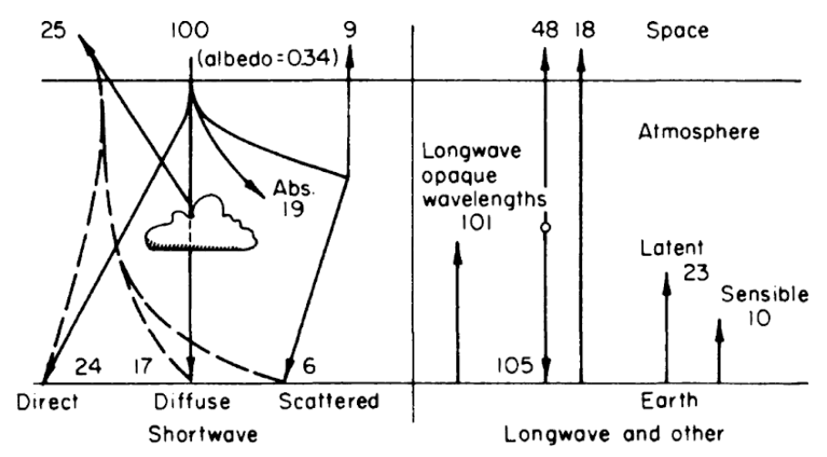
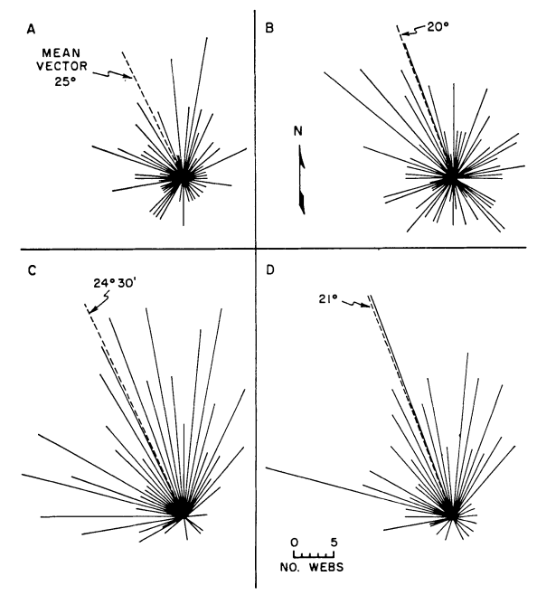
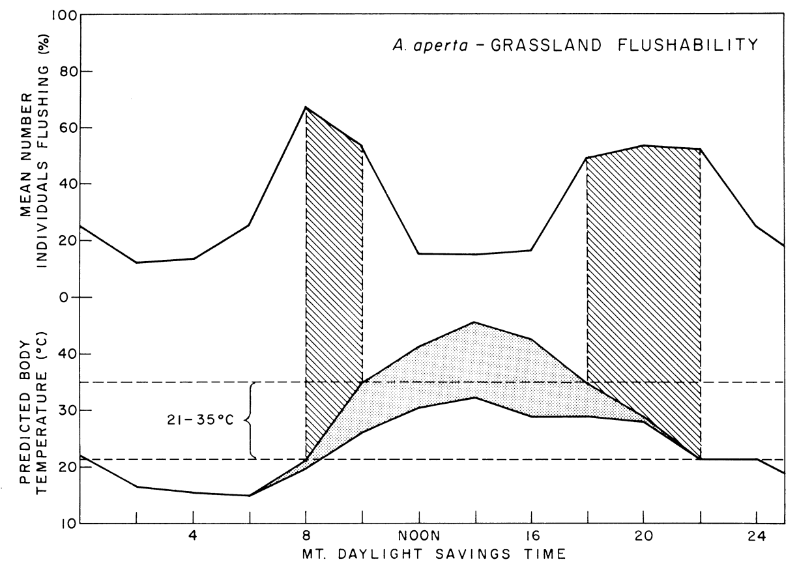
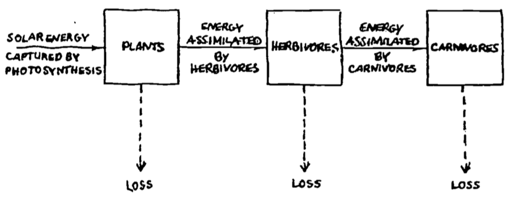
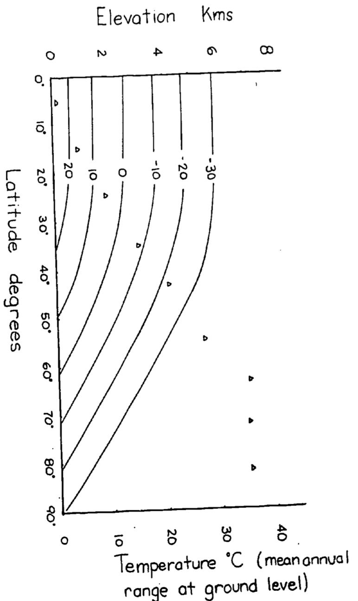
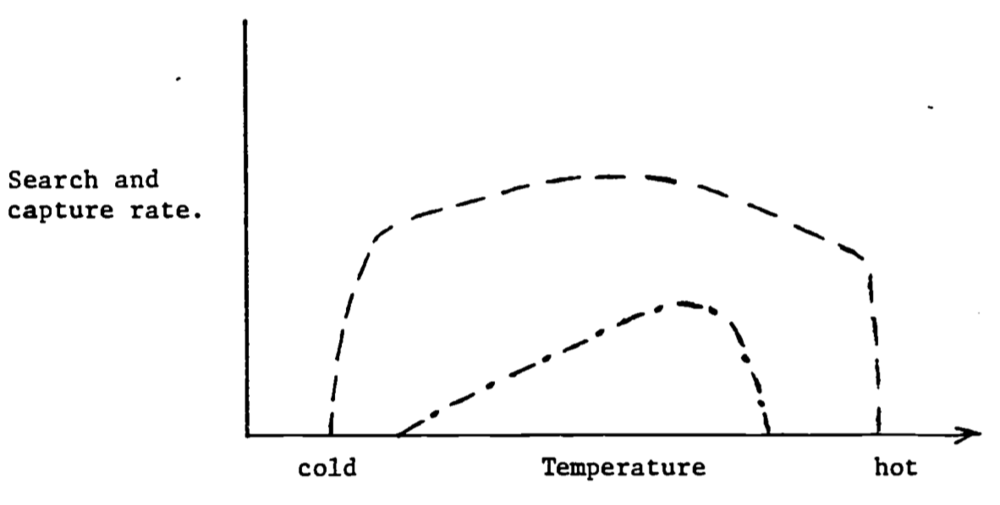
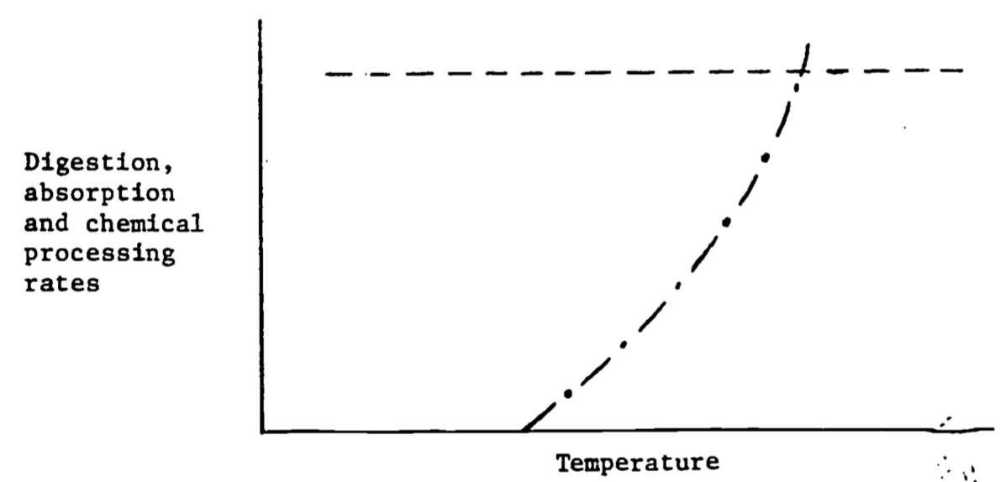

# Thermodynamic Applications {#thermodynamicsexamples}

***
Applications of the First Law to Ecological Systems
author: Stevenson, R. D.

## PREFACE
This module explores applications of concepts presented in another module called 'The First Law of Thermodynamics for Ecosystems.' It focuses on three important ideas: (1) The classical definitions and Laws of Thermodynamics can apply to all biological systems; (2) The First Law of Thermodynamics is a conservation of energy law that allows a researcher to describe mathematically the heat fluxes of any system of interest; and (3) The heat and mass energy balance of organisms have important ecological consequences that are particularly relevant to understanding responses to climate change. A problem set provides examples of the relative importance of work, heat energy exchange, and mass flow.

Students should find this module useful for obtaining an understanding of how thermodynamics can be used in environmental sciences. The focus of this exposition is on the concepts developed in the module "First Law of Thermodynamics for Ecosystems" (Stevenson 1979), although a brief introduction to mass flow and the First Law is given. The problem set presents a variety of examples to further the student's knowledge of relative importance of work and heat and mass flow. An extensive bibliography is included.

***

## INTRODUCTION

The purpose of this module is to illustrate several ways in which the First Law of Thermodynamics can be applied to biological systems. Recall that the First Law can be written 

\begin{equation}
\Delta U = Q - W
(\#eq:1)
\end{equation}

where 
<div class="nobullet">
* $\Delta U$ is the change in internal energy of the system, 
* $Q$ is the heat added to the system, 
* and $W$ is the work done by the system to the surroundings. 
</div>
The reader may find it helpful to consult the Appendix on Units, Symbols, and Dimensions and/or the module on that subject. In the examples we will make different kinds of assumptions about the terms of equation \@ref(eq:1) to illustrate different applications. First, we will consider an adiabatic process in which no heat is added to the system, so $Q = 0$. A second type of application, with $W = 0$, is often used to describe the heat energy balance of organisms. Much of the energy balance literature has also been devoted to steady state analysis for which $\Delta U = 0$. Finally,  we will extend the formulation of the First Law to nonclassical thermodynamics in which mass flows are also considered.

***

## APPLICATIONS OF THE FIRST LAW OF THERMODYNAMICS

When thinking of the ecological implications of work for an organism one might imagine an animal moving or a plant transporting fluid. In these cases chemical energy is used to do mechanical work. In accord with the Second Law of Thermodynamics, these are not 100 percent efficient processes and heat is thus liberated.

Heat is usually a negligible component of the energy balance of plants. Interesting exceptions to this general statement are several species of the Araceae family including skunk cabbage, *Lysichitum americanum*; the water lily, *Victoria*; and arum lilies, *Arum italicum* (Fisher 1960, Meeuse 1975).

### Work

In contrast, we know from our own experience that during physical exercise we can generate a large amount of heat because of our increased metabolic rate (necessary to do the mechanical work associated with the exercise). While jogging in place or skipping rope there may be no increase of potential energy (such as when climbing a hill) but work is performed by accelerating and decelerating the legs and arms. How the mechanical work is related to increased metabolic rate is currently a topic of interest for comparative physiologists studying locomotion (Bartholomew 1977, Taylor et al. 1970). For our purposes, the metabolic rate can be measured directly and included in the heat energy balance of organisms. To illustrate the case in which $Q = 0$ and work is non-zero, we present a meteorological example that is of interest to the ecologist.

The following example can be found in many introductory micrometeorology texts as well as in MacArthur (1972). It is a well-known fact that air cools as it rises. It is especially evident and ecologically important as one goes up the side of a mountain. Not only does the temperature fall but usually moisture is released. The reason for this phenomenon is that at higher elevations the atmosphere is less dense, so that as a unit of air (the system) rises, it pushes out, thus doing work and changing its internal energy. Therefore we define the system as a parcel of air, while surrounding it is the atmosphere enclosing the parcel.

What we would like is an expression to relate the change in height to the change in temperature. The physical law needed is the First Law of Thermodynamics with no heat flux ($Q = 0$, adiabatic process). We have then
\begin{equation}
dU = -W
(\#eq:2)
\end{equation}

In the module developing the theory of the First Law we also developed two other relationships in the piston example. One is that the change in internal energy $dU$ is equal to the heat capacity $C_V$ times the change in temperature $dT$ (for a reversible process revolving an ideal gas).
\begin{equation}
dU = C_V dT
(\#eq:3)
\end{equation}
Secondly we discovered that the work $W$ done by the system on the surroundings is equal to $P dV$ so
\begin{equation}
W = P dV
(\#eq:4)
\end{equation}
By substituting \@ref(eq:3) and \@ref(eq:4) into \@ref(eq:2) we express the First Law as
\begin{equation}
C_V dT = -P dV
(\#eq:5)
\end{equation}
Furthermore, we know that the state variables are related by the Ideal Gas Law $P V = R T$ which in total differential form is
\begin{equation}
V dP +P dV = R dT
(\#eq:6)
\end{equation}
Since our goal is to express the temperature change as a function of height or elevation we will eliminate $P dV$ from equation \@ref(eq:5) by substituting in \@ref(eq:6) which yields 
\begin{equation}
C_V dT = -R dT + V dP
(\#eq:7)
\end{equation}
The rationale for this step is based on the fact that we can define the change in pressure with the change in altitude. This relation is derived by considering a parcel of air.

If we assume a unit cross section, then the change of pressure is equal to the unit weight $w$ of air at height $h$ times the change in height
\begin{equation}
dP = -w\:dh
(\#eq:8)
\end{equation}
Furthermore
\begin{equation}
w = g \frac{m}{V}
(\#eq:9)
\end{equation}
where
<div class="nobullet">
* $g$ is the acceleration of gravity, 
* $m$ is molecular mass of air, 
* and $V$ is the volume of one mole.
</div>

Combining equations \@ref(eq:8) and \@ref(eq:9) and rearranging we have
\begin{equation}
V dP = -g m dh
(\#eq:10)
\end{equation}

Substituting \@ref(eq:10) into \@ref(eq:7) and rearranging we have $(c_V + R) dT = -g m d$ the desired result; a formula that tells us how temperature changes with height. (Also recall that for an ideal diatomic gas that the heat capacity at constant volume $C_V = 2.5 R.$)
$$ \frac{dT}{dh} = \frac{-g\,m}{C_V + R} = \frac{-9.8ms^{-2} \cdot  0.029 kg mole^{-1}}{8.314 J {^{\circ}C}^{-1} (2.5+1) J {^{\circ}C}^{-1} mole^{-1}} = 0.0098 \frac{^{\circ}C}{m} = -9.8 \frac{^{\circ}C}{km}$$

Thus the air temperature will be $10 ^{\circ}C$ lower for each kilometer increase in altitude. This is called the adiabatic lapse rate (no external source of heat). In many locations the rising air contains moisture, which condenses as the air rises thus adding the heat of condensation to the dry adiabatic lapse rate. Therefore the "moist adiabatic" lapse rate of about $6 \frac{^{\circ}C}{km}$ is less than the dry adiabatic lapse rate. Interestingly enough the reverse effect, air moving down a mountain, also occurs. These winds are known as foehn winds in the Alps and the Chinook winds in the Rocky Mountains. As the winds come down the leeward side of the mountain the atmospheric pressure increases causing as much as a 15-20 $^{\circ}C$ rise in temperature.

### Examples of Heat Energy Exchange

The next set of examples is used to illustrate the First Law for systems in which it can be assumed that the work term is zero. Therefore
\begin{equation}
\Delta U = Q
(\#eq:11)
\end{equation}

Any change in the internal energy of the system as measured by a change in temperature is due to heat flow. The general heat balance equation is
\begin{equation}
\Delta U = Q_a + M + P - Q_e - LE - G - C
(\#eq:12)
\end{equation}
where
<div class="nobullet">
* $\Delta U$ = change in internal energy ($W m^2$, watts per square meter),
* $Q_a$ = radiation absorbed by the system surface($W m^{-2}$),
* $P$ = photosynthesis ($W m^{-2}$),
* $M$ = basal metabolism($W m^{-2}$),
* $Q_e$ = radiation emitted by the system surface ($W m^{-2}$),
* $L$ = latent heat of evaporation ($J kg^{-1}$),
* $E$ = evaporation flux density ($kg m^2 s^{-1}$),
* $G$ = conduction ($W m^{-2}$),
* and $C$ = convection ($W m^{-2}$).
</div>

Equation \@ref(eq:12) is a general heat flow equation. In most cases except for water vapor flux $LE$, mass exchange can be neglected. Similarly, the system's internal sources of heat energy, photosynthesis and metabolism, are also very small components of the heat energy budget and can usually be ignored. We note, however, there are important exceptions of which the largest group includes endothermic vertebrates, birds and mammals. The other terms $Q_a$, $Q_e$, $LE$, $C$, $G$ of \@ref(eq:12) represent the basic heat transfer processes that were described in the first module entitled "The First Law of Thermodynamics for Ecosystems."

The first example we wish to consider is the heat energy budget of the earth. Since the average temperature of both the earth and the atmosphere is not changing with time we assume $\Delta U = 0$. Therefore the sum of the heat fluxes is zero, thus
\begin{equation}
0 = Q_a - Q_e -LE -C 
(\#eq:13)
\end{equation}
where
<div class="nobullet">
* $Q_a$ = radiation absorbed from the sun (left half of Fig. \@ref(fig:fig-thermex-2)),
* $Q_e$ = energy emitted by the atmosphere and earth,
* $LE$ = heat loss by evaporation or latent heat,
* and $C$ = convection or sensible heat.
</div>

Now consider figure \@ref(fig:fig-thermex-1) where the numbers represent the percentage of the total energy from the sun. If we define the earth and atmosphere as the system and space as the surroundings, the sum of the heat fluxes should be zero across the system's boundary. Checking the numbers, we receive 100 percent and lose 25, 9, 48 and 18 percent which adds to a net flux of zero. Likewise we can take the earth as the system. Also notice what happens to the direct solar radiation as it enters the atmosphere. Only 47 percent reaches the ground level. The atmosphere acts as a trap. It absorbs the short wave radiation and reradiates longwave radiation. Furthermore, about 23 percent of the available heat energy from the sun is used in evapotranspiration. This process reduces air temperature in wet climates and redistributes moisture.

```{r fig-thermex-1, echo=FALSE, fig.height=3, fig.fullwidth=FALSE, fig.cap='Relative net transfer of heat within the earth-atmosphere-space system. From Lowry, W.P. 1969. P. 27.'}

```

Our next example is that of a small stream taken from Brown (1969). Fish and game managers noted that clear cutting to the water's edge eliminated trout and salmon populations. Brown modeled the energy exchange to determine how manipulation of streamside vegetation could reduce large diurnal fluctuations and high water temperatures, a potential cause of mortality. Again the First Law is used to say that the change in internal energy is equal to the sum of the heat flows.
\begin{equation}
\Delta U = + Q_{NR} - LE - G - C
(\#eq:14)
\end{equation}
where
<div class="nobullet">
* $\Delta U$ = net change in internal energy of the stream ($W m^{-2}$),
* $Q_{NR}$= net thermal radiation flux ($Q_a - Q_e$)($W m^{-2}$),
* $LE$ = evaporative flux ($W m^{-2}$),
* $G$ = conductive flux ($W m^{-2}$),
* and $C$ = convective flux ($W m^{-2}$).
</div>

Brown measured the heat fluxes of three different systems: 1) a forested section, 2) a nonforested gravel bottom section, and 3) a nonforested rockbottom section. Changes in water temperature were computed hourly using the fact that $\Delta T = \Delta U$ divided by heat capacity where the heat capacity is equal to the surface area of the water divided by the flow rate times the specific heat of water. In Part a of Figs. \@ref(fig:fig-thermex-2) through \@ref(fig:fig-thermex-4) Brown used the energy fluxes to calculate $\Delta U$. From these values $\Delta T$ is calculated and added to the water temperature at the beginning of the stream section to get the predicted water temperatures shown in part b of each figure.

In Fig. \@ref(fig:fig-thermex-2)a the energy components of equation \@ref(eq:14) are plotted as a function of time of day for a section of the stream covered by the forest. The water temperature at the end of the reach can be predicted as described above. In Fig. \@ref(fig:fig-thermex-2)b the observed and predicted temperatures at the end of the section are compared. Since net radiation is small because the section is forested there is not much change in temperature throughout the day. 

In Figs. \@ref(fig:fig-thermex-3)a and \@ref(fig:fig-thermex-3)b similar graphs illustrate the results Brown got for a nonforested gravel bottom section. Net radiation is the largest term of the energy budget and causes a large increase in water temperature.

The values depicted in Figs. \@ref(fig:fig-thermex-4)a and \@ref(fig:fig-thermex-4)b are for a site which also was unforested. Unlike the previous example where the bed of the stream was gravel and conduction was small, this site had a solid rock bottom and here heat passed from the stream into the stream bed, indicating a substantial conduction component of the energy balance. 

Generally the results indicate that the model is very successful in predicting water temperature. The evaporation and convection fluxes are small at all sites. Net radiation is the major component of the heat balance of which the major factor is direct solar radiation. This is especially true for the nonforested sites (Figs. \@ref(fig:fig-thermex-3)a and \@ref(fig:fig-thermex-4)a). It is also interesting to note that conduction is an important component of the heat balance for the rocky-bottomed streambed (Fig. \@ref(fig-thermex-4)a) but not the gravel bottom (Fig. \@ref(fig:fig-thermex-3)a).

```{r fig-thermex-2, echo=FALSE, fig.height=4, fig.show = "hold", out.width = "50%", fig.align = "default", fig.cap='a) The daily pattern in net thermal radiation ($Q_{NR}$), evaporation ($Q_E$), and convection ($Q_H$) for the forested Deer Creek study section. From Brown, G. W. 1969: P. 71,72. b) Observed and predicted hourly temperature for the forested Deer Creek study section. From Brown, G. W. 1969. P. 71,72.'}
knitr::include_graphics(c("figures/fig-thermex-2a.png", "figures/fig-thermex-2b.png"))
```

```{r fig-thermex-3, echo=FALSE, fig.height=4,fig.show = "hold", out.width = "50%", fig.align = "default", fig.cap='a) The daily pattern in net thermal radiation ($Q_{NR}$), evaporation ($Q_E$), and convection ($Q_H$) for the nonforested gravel bottom Berry Creek study section. From Brown, G. W. 1969: P. 72. b) Observed and predicted hourly temperature for the nonforested gravel bottom Berry Creek study section. From Brown, G. W. 1969. P. 72.'}
knitr::include_graphics(c('figures/fig-thermex-3a.png', 'figures/fig-thermex-3b.png'))
```

```{r fig-thermex-4, echo=FALSE, fig.height=4, fig.show = "hold", out.width = "50%", fig.align = "default", fig.cap='a) The daily pattern in net thermal radiation ($Q_{NR}$), evaporation ($Q_E$), convection ($Q_H$), and conduction ($Q_C$) for the nonforested rock bottomed H. J. Andrews study section. From Brown, G. W. 1969. Pp. 73, 74. b) Observed and predicted hourly temperatures for the nonforested H.J. Andrews study section. From Brown, G. W. 1969, Pp. 73,74.'}
knitr::include_graphics(c('figures/fig-thermex-4a.png', 'figures/fig-thermex-4b.png'))
```

To illustrate how the First Law can be applied to plant systems we will examine the heat balance of a leaf. The discussion is taken from Gates (1968). This is a natural first step towards understanding the heat balance of a plant because the leaf has a distinct geometry and, is the unit of photosynthesis. The First Law is used in a steady state condition ($\Delta U$ = 0) which assumes that the heat capacity of the leaf is not an important component of the heat fluxes. The heat balance is written
\begin{equation}
0 = + Q_a - Q_e - C - LE
(\#eq:15)
\end{equation}
where
<div class="nobullet">
* where $Q_a$ = radiant energy absorbed by the leaves ($W m^{-2}$),
* $Q_e$ = radiation emitted by the leaves ($W m^{-2}$),
* $C$ = convection flux ($W m^{-2}$),
* and $LE$ = evaporative flux ($W m^{-2}$).
</div>

A positive sign indicates energy is being added to the system. Equation \@ref(eq:15) describes completely the heat balance of a leaf. This is very important since the heat energy balance determines leaf temperature which affects the photosynthetic activity and shape of the leaf. A more complete analysis of the leaf system and the biological implications will be given in another module (Gates). In this module, it is most important to realize that we can write down the heat energy budget of the leaf and that there are four basic components to the heat balance: $Q_a$, $Q_e$, $C$, and $LE$. 

To further illustrate the generality and wide application of the First Law, let us examine an animal as the system. Riechert and Tracy (1975)  considered the thermal characteristic of the funnel web-building spider, *Agelenopsis aperta*. They hypothesized that reproductive success would be influenced by the microhabitat of the spider because this animal reproduces during the warmest season which is probably physiologically costly. More specifically, if *A. aperta* could spend more time on the web catching food, more young could be produced. The energy balance equation for the spider was assumed to be
$$Q_a - Q_e - C = 0$$
where
<div class="nobullet">
* where $Q_a$ = radiant absorbed ($W m^{-2}$),
* $Q_e$ = radiation emitted ($W m^{-2}$),
* and $C$ = convection ($W m^{-2}$).
</div>

Of the three habitats considered the model predicts increasing thermal stress in the following order: mixed grassland depression, mixed grassland surface, and lava surface. Field observations have confirmed these predictions. Riechert and Tracy also found that the spiders did not randomly  orient the direction toward which their funnels faced. In fact the general tendency was to face northerly which would eliminate direct solar radiation.  Fig. \@ref(fig:fig-thermex-5) shows a plot of orientations and gives the mean direction. The tendency is strongest in \@ref(fig:fig-thermex-5)c which shows all webs from unprotected sites.

To find out whether or not the energy budget influences the activity time of the spiders Riechert and Tracy measured spider activity. The barred region of Fig. \@ref(fig:fig-thermex-6) indicates when more than 50 percent of the spiders were active. This corresponds to a time of day when the body temperature of  the spiders would be between 21 and $35 ^{\circ}C$. This study emphasizes the importance of the thermal environment for *A. aperta*.

```{r fig-thermex-5, echo=FALSE, fig.height=4, fig.fullwidth=FALSE, fig.cap='Funnel orientations for various habitats and sample groups in June 1971. (A) All webs in lava study area, (B) all webs in mixed-grassland study area, (C) all unprotected surface webs from all habitats, and (D) all webs from a rangeland plot lacking depressions and shrubs. Orientations represent compass directions to which the funnels face. From Riechert, S.E., and C. R. Tracy. 1975. P. 271.'}

```

### The First Law Generalized to Include Mass Flow 

The final example we wish to consider is Lindeman's (1942) work on the energy flow in Cedar Bog Lake. This is a classic paper describing the energy flow through an ecosystem. What we wish to point out is that a more general form of the First Law of Thermodynamics also encompasses the theory behind Lindeman's research.

Lindeman (1941, 1942) provided information about the standing crop of eight categories: nanoplankton, net plankton, benthic plants, zooplankton, browsers, plankton predators, benthic predators, and swimming predators. He simplified his description of the aquatic ecosystem into three trophic levels as represented in Fig. \@ref(fig:fig-thermex-7). Losses were of two general types: mass losses from predation and respiration losses due to the energy required for maintenance of body tissues.

A more general version of the First Law is written in differential form as
\begin{equation}
d U = d \phi - dW
(\#eq:17)
\end{equation}
where $d \phi$ includes both heat $dQ$ and mass changes $dM$. The change in any particular trophic level can then be viewed as a conservation of heat and mass energy. If we assume work changes are zero, the change in the internal energy of the $i^{th}$ trophic level (or organism is you wish) is equal to the sum of the j heat and/or mass fluxes
\begin{equation}
\sum_j d U_{ij} = \sum_j d M_{ij} + \sum_j d Q_{ij}
(\#eq:18)
\end{equation}
If we consider the carnivores in Lindeman's study as the $i^{th}$ trophic level, each prey item taken would be an increase in mass $M$. Heat exchange through the water is represented by a $Q$ term. Defecation products are usually the most important mass losses. Gallucci (1973) has reviewed the ecological literature and summarized this more general approach. Before passing on, it is important to realize that as equation \@ref(eq:18) is written heat and mass fluxes are independent. Since many biology processes are temperature dependent, this is in general not true. Brett (1971) has provided an ecological example of the interaction of body temperature and food acquisition (also see problem 8). These kinds of interaction occur in plants also (Went 1957). Finally, since all life is far from equilibrium, in the sense of a thermodynamic system, classical representations do not always apply (e.g. Wilke 1975). Non-equilibrium theory, as discussed in later modules, is the first step toward handling these problems and it is an area of current research (Haken 1978, Lamprecht and Zotin 1978). A bibliography is included at the end of the module which, combined with the problems, should illustrate the pervasiveness of thermodynamics in biology. 

```{r fig-thermex-6, echo=FALSE, fig.height=3, fig.fullwidth=FALSE, fig.cap='Graph of percent of spiders active on the sheet with time of day on the mixed-grassland study area in midsummer (July and August) imposed on predicted spider temperature under these conditions and assuming a web-over-litter substrate. Barred area under flushability curve represents time periods during which over 50 percent of the individuals were active. Stippled area represents range of spider temperatures, exact temperature dependent upon amount of exposure to solar radiation. Upper boundary of predicted temperature curve signifies spider temperature if in full sunlight. Lower boundary signifies spider temperature if in full shade. Area enclosed by dashed lines represents body temperature range within which over 50 percent of the spiders are active. From Riechert, S. E., and C. R. Tracy. 1975. P. 272.'}

```

```{r fig-thermex-7, echo=FALSE, fig.height=4, fig.fullwidth=FALSE, fig.cap='Lindeman\'s (1941) analysis of energy flow in the Cedar Bog Lake ecosystem. From Williams, R. B. 1971. P. 546.'}

```

There are three important ideas in this module for the reader to remember: First, that the classical definitions and Laws of Thermodynamics can apply to all biological systems; secondly, that the First Law of Thermodynamics is a conservation of energy law that allows a researcher to describe mathematically the heat fluxes of any system of interest; finally, that the heat and mass energy balance of organisms have important ecological consequences that have been illustrated here and which offer challenging problems for scientists in the future.

***

##PROBLEMS

1. Using the data in Figure \@ref(fig:fig-thermex-1), show that the First Law holds for the earth's surface and the earth's atmosphere.

2. In the module we used the First Law to calculate the change in temperature with elevation. With this knowledge what generalizations can you suggest about differences in communities with elevation and latitude? On a graph of elevation versus latitude plot lines of constant temperature (mean annual temperature). Assume 0° latitude is 26°C and each degree toward the poles lowers the mean annual temperature 0.5°C. Do this for wet and dry lapse rates. How does this compare with real data?

3. Choose any organism, part of an organism or specific environment that an organism frequents from the four examples given at the beginning of the module titled "The First Law of Thermodynamics for Ecosystems." Define the system, surroundings, and write down the First Law heat energy balance for your system. How meaningful is your system biologically? What terms from the general heat flux equation are most important for your system? How does the choice of your system influence the biological interpretations you can make?

4. Repeat exercise 2 for a system of your own choice.

5. Organisms commonly exchange mass with their environment during respiration and feeding. For homeotherms this usually involves a net loss of energy because the matter taken in is warmed to body temperature before it is expelled.

a) As a first example consider respiration exchange of a 0.5 kg bird. Calder (1975) gives the frequency in breaths $s^{-1}$ as $0.2867 M^{-0.31}$ and the tidal volume ($m^3$) as $13.2\times 10^{-6} M^{1.08}$ where $M$ is in kg. If the bird warms the air 30°C, what is the net heat loss in watts?

b) Assume a horse drinks 10 gallons of water at 20°C and urinates it at 38°C during the course of a day. What is the loss in watts?

6. Imagine that you have been retained as an environmental consultant to advise state officials in the Department of Ecology about management problems. The Department wishes to update the Timber Harvesting Practices Act. They have asked you to make some general statements about the effects of timber cutting of the spawning grounds of the salmonoid fish, specifically discussing the relative importance of siltation, stream flow and the elevation of water temperatures. In stream sections where water temperature changes are most important, discuss which factors of the physical environment must be considered to understand the thermal balance of the stream.

7. In the module titled "The First Law of Thermodynamics for Ecosystems" I used a problem to introduce the idea that potential ($E_p$) and kinetic ($E_k$) energies could be included in the First Law. Imagine you are studying the locomotion mechanics and energetics of the rhea, a bipedal bird. Write down an energy conservation equation to identify the three components of the mechanical work (the rhea can be thought of as a point mass analogous to a pendulum). How would you compute these components? Discuss their relative importance. How might you measure the efficiency of locomotion? Of the initial chemical energy used which could be measured by oxygen consumption, how much represents work done by the organism? Where does the other energy go?

8. In the last section of the module we on the interaction of regulation of body temperature and the acquisition of food energy. Describe the steps necessary to convert energy in the environment to usable chemical energy for the body. During each step of the process what is the importance of the thermal environment for a poikilotherm and a homeotherm?

##PROBLEM SOLUTIONS

1. At the earth's surface incoming = outgoing or 105 + 24 + 17 + 6 = 101 + 18 + 23 + 10. For the earth's atmosphere incoming = outgoing or 101 + 23 + 10 + 19 = 105 + 48.

2. From the adiabatic lapse rate calculation, we know that the mean annual temperature will decrease 10°C/km. We might expect then that similar communities will be found on the same isotherm (convergence), if other factors such as water availability are similar (Fig \@ref(fig:fig-thermex-1)). Tropical mountain vegetation therefore may look like temperate forests and temperate alpine meadows will resemble tundra communities. (See Bliss (1956) for comparison of last two communities.) Table 1 shows the mean and mean annual range in temperature for the northern and southern hemisphere (Miller and Thompson 1970)

> Table 1. Mean annual temperature and temperature range, and their variation with latitude.

| |**Mean temperature (°F)**| | | |**Mean annual range (°F)**| | | 
:-----:|:-----:|:-----:|:-----:|:-----:|:-----:|:-----:|:-----:|:-----:
Latitude (deg.)|Northern hemisphere|°C|Southern hemisphere|°C|Northern hemi-sphere|°C|Southern hemisphere|°C
90-80|-8|-22|-5|-21|63|35.5|54|30
80-70|13|-13.5|10|-12.5|60|34|57|32
70-60|30|-1|27|-3.5|62|35|30|17
60-50|41|5|42|4.5|49|27.5|14|8
50-40|57|14|53|11.5|39|22|11|6
40-30|68|20|65|18.5|29|16|12|6.5
30-20|78|25.5|73| |16|9|12|6.5
20-10|80|26.5|78|25|7|4|6|3.3
10-0|79|26|79|26|2|1|3|1.7

```{r}
lats= seq(0,90,5)
elevs= 0:8

#temp
#dry adiabatic lapse rate
#temp=26-0.5*(lat-26)-lapse*elev

#elevation for given temperature
#elev= (26-0.5*(lat-26) -temp)/lapse
el=function(lat, temp,lapse) (26-0.5*(lat-26) -temp)/lapse

#plot out isoclines for various temperatures
#dry lapse
plot(lats,el(lats,20,10), type="l", ylim=c(0,8), xlab="Latitude (degrees)", ylab="Elevation (km)")
points(lats,el(lats,10,10), type="l")
points(lats,el(lats,0,10), type="l")
points(lats,el(lats,-10,10), type="l")
points(lats,el(lats,-20,10), type="l")
points(lats,el(lats,-30,10), type="l")

points(lats,el(lats,20,5), type="l", lty="dashed")
points(lats,el(lats,10,5), type="l", lty="dashed")
points(lats,el(lats,0,5), type="l", lty="dashed")
points(lats,el(lats,-10,5), type="l", lty="dashed")
points(lats,el(lats,-20,5), type="l", lty="dashed")
points(lats,el(lats,-30,5), type="l", lty="dashed")


```

Because the change in temperature with elevation is affected by turbulence and heating of the surface as well as the lapse rate, the change in temperature as a function of elevation averages about 6°C/km. Using this fact, isotherms for elevation and latitudinal changes are replotted in Fig. \@ref(fig:fig-thermex-2) for the northern hemisphere. The effect of the mean annual range in temperature will be to increase the seasonality of the community. According to Fig. \@ref(fig:fig-thermex-2) then a community at 2,500 m and 20° latitude would have the same mean annual temperature as a community at sea level and 60°C latitude (0°C) but at 65° latitude the temperature variation would be 3.5 times larger. See Carter and Mather (1966) for a review of climate classifications.

```{r fig-thermex-9, echo=FALSE, fig.height=4, fig.fullwidth=FALSE, fig.cap='Isotherms in degrees Celsius for elevation vs. latitude. The mean annual temperature at any elevation is calculated assuming a dry adiabatic lapse rate. Mean annual temperature at growund level are taken from Miller and Thompson 1970.'}

```

3. system: surroundings

a. moose in conifer bed: ground, conifer trees (during the day solar radiation)

b. cactus plant: wind, sun, humidity, other cacti plants, ground

c. anemone: while out of water- wind, sun, rock, air temperature, humidity

d. pine branch: wind, sun, other branches in stand, humidity

a.$Q_a + M - Q_e - G = 0$  

b.$Q_a - Q_e - LE - C - G = 0$  

c.$Q_a - Q_e - LE - C - G = 0$  

d.$Q_a - Q_e - LE - C = 0$  

4. Examples

system: surroundings

a. woodchuck feeding in meadow: sun, sky, vegetation, air, wind

b. lily pad: water, sun, sky, wind, waves

c. moss on a rock: sun, wind, ground

d. 1. penguins huddled: ground, snow, sky, sun, air, wind

  2. penguins swimming: water temperature, water velocity

a. $Q_a + M - Q_e - LE - C = 0$

b. $Q_a - Q_e - LE - G - C = 0$  

c. $Q_a - Q_e - LE -C-G= 0$  

d. 1. $Q_a + M - Q_e - G - C=0$  

    2. $M - G - C = 0$

5.    
a. The mass exchange is $2.22 \times 10^{-6} kg s^{-1}$. Multiplied by a temperature difference of 30°C and a specific heat of $1010 J kg^{-1}C^{-1}$ for air at 20°C (average value) yields a net loss of $0.067 W$. This is approximately 2.5% of the metabolic rate of a bird of this mass.

b. Heat loss = mass flux $\times$ specific heat $\times$ temperature difference
$$10\frac{\mbox{gallons}}{\mbox{day}}\times\frac{8.34lb.}{\mbox{gal}}\times\frac{1kg}{2.205lb.}\times\frac{1\mbox{day}}{86400s}\times18°C\times4180Jkg^{-1}°C=32.9W$$
This is about 8% of the basal metabolic rate.

6. Siltation is potentially the worst problem because it can completely eliminate the spawning habitat and thus eliminate reproduction. If topography and soil conditions are such that erosion is not a problem a particular section of stream can continue to produce fish if flow level patterns are not altered too drastically. If these problems are not critical the manager must monitor water temperature. All three problems may be linked.

If there are siltation problems, ground water discharge will probably be altered and this in turn increases the temperature variation in the stream.

To understand the thermal balance of the stream one must be able to measure the parameters of the model given in the text. The most critical factor is the amount of shortwave radiation that is absorbed relative to the heat capacity of the stream. This means that the stream could receive direct sunlight all day and not significantly increase in temperature if it were large (large discharge) or if the cross sectional area to depth ratio was small (relatively narrow and deep stream). Besides discharge and cross sectional area to depth ratio, slope, aspect, and the height of the vegetation around the stream are probably the most critical physical factors influencing how much short wave radiation falls on the stream.

7. The energy conservation equation is $\Delta E = E_p + E_{kv}+ E_{kf}$, where $\Delta E$ is the change in internal energy, $E_p$ is the potential energy and $E_{kv}$ and $E_{kf}$ are the kinetic energies. The kinetic components can be measured by knowing the velocity in the proper direction. So
$$E_{kx}=1/2  mv_x^2$$
Potential energy is $E_p = m gh$ where $m$ is mass, $g$ is the acceleration due to gravity and $h$ is the height above the datum. $E_{kv}$ is very small since $V_x$ is small relative to the other components. Efficiency can be defined in a number of ways. Since the organism is interested in moving forward one appropriate definition is the work done in forward motion divided by the difference between the metabolic rate while exercising and while resting.

One might also wish to consider the work need to accelerate and decelerate limbs as well as the work recovered from storage in limbs. Cavagna, Heglund and Taylor (1977) have measured these variables for a variety of animals including the rhea. The chemical energy needed for locomotion goes into work done on the environment and heat production in the organism. The heat production is a result of internal work and the irreversibility of energy transformations. Work done on the environment is represented by moving air and frictional losses at the ground surface.

8. One might describe the acquisition of food energy by the following steps    
    a. Search for, wait for or travel to food.
    b. Capturing and swallowing.
    c. Break down and digestion.
    d. Absorption and distribution in body.
    e. Chemical rearrangement of food.
Feeding provides both the raw materials and energy to keep an animal alive. Because of the variety of food items available animals must specialize to use a resource effectively. That is to say it would be ridiculous for a weasel to eat soil fungus or a grasshopper to filter lake water for plankton. Furthermore the organism must be able to tolerate the physical environment where the food items it is "designed" to eat are available. Of primary importance is being physiologically capable of tolerating the physical environment when and where the resource is able. If no food is obtained, there is no need to process it. The average cost of maintaining that physiological barrier must be less than the energy obtained from the resource one has specialized on. This idea, although it may seem obvious, is part of the central paradigm of physiology.

Steps c. through e. complete the transition of food into what might be parts (materials) and gasoline (energy) to keep an automobile working. (This analogy is not quite complete because additional energy is needed to replace the parts and to drive the car.) Figure \@ref(fig:fig-thermex-10a) shows an idealized response of an ectotherm and an endotherm for the first two steps and then for the last three.

The range of thermal environments covered does not include crisis situations. In \@ref(fig:fig-thermex-10a) the response Of the endotherm drops off at either end because the animal must maintain a constant body temperature. Therefore, in cold weather the animal must huddle up to avoid hypothermia and in hot weather it must retard its foraging rate to keep from overheating. The shape of the ectotherm curve reflects the overall performance ability of the animal. (Since these curves are generalizations one should expect to find curves where the shape is different than suggested here).

```{r fig-thermex-10a, echo=FALSE, fig.height=4, fig.fullwidth=FALSE, fig.cap='Search and capture rates as a function of temperature for an endotherm (---) and an ectotherm (-.-).'}

```

```{r fig-thermex-10b, echo=FALSE, fig.height=4, fig.fullwidth=FALSE, fig.cap='Digestion, absorption and chemical processing rates as a function of temperature for an endotherm (---) and an ectotherm (-.-).'}

```

Figure \@ref(fig:fig-thermex-10b) shows the response to the processing of food. For endotherms processing can proceed at a constant rate because the animal's body temperature is largely independent of the thermal environment. Ectothermal body temperatures largely track the thermal environment. (Exceptions are large terrestrial insects and vertebrates.) Digestion is usually a strong function of body temperature. Therefore digestion rates increase in hot environments (see Brett 1971).

No one to my knowledge has written about the relation of the work done to the environment by the animal during locomotion and the heat production, and thus thermal balance during this exercise, but some data exists for birds and insects during flight (Tucker 1973, Weis-Fogh 1972) and terrestrial locomotion (Cavagna et al. 1977). Burton (1966, Chapter 11) gives a good discussion of this topic as it applies to the heart. At rest the heart is only about 3% efficient; that is, 97% of the chemical energy it uses is converted into heat. At higher work loads this efficiency doubles, though, with little increase in heat load.

## LITERATURE CITED

Bartholomew, G. A. 1977. Chapter 3; Energy Metabolism; and Chapter 8; Body Temperature and Energy Metabolism. M. S. Gordon, ed. In Animal Function: Principles and Adaptation. Macmillian Company, New York. 

Bliss, L. C. 1956. A comparison of plant development in microenvironments of arctic and alpine tundras. Ecol. Monogr. 26:303-337. 

Brett, J.R. 1971. Energetic responses of salmon to temperature: A study of some thermal relations in the physiology and freshwater ecology of Sockeye salm n. (Oncorhynchus nerka) Am. Zool. 11:99-113. 

Brown, G. W. 1969. Predicting temperatures of small streams. Water Resources Research 5:68-75. 

Burton, A. C. 1966. Physiology and Biophysics of the circulation. Year Book Medical Pub., Chicago. 217 pp. 

Carter, D. B. and J. R. Mather. 1966. Climatic Classification for Environment Biology. Publication in Climatology 19(4):305-395. C. W. Thornthwaite Associates Lab. of Climatology , Elmer N.J. 

Cavagna, G. A., N. C. Neglund and C. R. Taylor. 1977. Mechanical work on terrestrial locomotion: Two basic mechanisms for minimizing energy expenditure. Am. J. Physiol. 233(5):R 243-R 261. 

Fisher, H. 1960. Encycl. Plant Physiol. 2:520-535. 

Gallucci, V. F. 1973. On the principles of thermodynamics in ecology. Annu. Rev. Ecol. Syst. 4:329-357. 

Gates, D. M. 1968. Transpiration and leaf temperature. Annu. Rev. Plant Physiol. 19:211-238. 

Gates, D. M. 1977. Transpiration and leaf temperature. An instructional module on physical processes in terrestrial and aquatic ecosystems. Center for Quantitative Science, University of Washington, Seattle, Washington. 37 p. 

Haken, H. 1978. Synergetics. Springer-Verlag. Berlin. 355 p. 

Lamprecht, I. and A. I. Zotin (eds.) 1978. Thermodynamics of biological processes. Walter de Gruyter. Berlin. 428 pp. 

Lindeman, R. L. Amer. Midl Lindeman, R. L. 23:399-418 1941. Seasonal food-cycle dynamics in a senescent lake. Nat. 26:636-673. 1942. The trophic-dynamic aspect of ecology. .Ecblogy 33 

MacArthur, R. H. 1972. Geographical Ecology. Harper and Row, New York. 

Meeuse, B. A. D. 1975. Thermogenic respirator in Aroids. Annu. Rev. Plant Physiol. 26:117-126. 

Miller, A., and J. C. Thompson. 1970. Elements of Meteorology. Charles E. Merril Publ. Co., Columbus, Ohio. 402 pp. 

Riechert, S. E., and C. R. Tracy. 1975. Thermal balance and prey availability: bases for a model relating web-site characteristics to spider reproductive success. Ecology 56:265-284. 

Taylor, C. R., K. Schmidt-Nielson, and J. L. Raab. 1970. Scaling of energetic cost of running to body size in mammals. Amer. J. Physiol. 219:1104-1107. 

Tucker, V. A. 1973. Bird metabolism during flight: Evaluation of a theory. J. Exp. Biol. 58:689-709. 

Weis-Fogh, T. 1972. Energetics of hoving flight in humming birds and in Drosophila. J. Exp. Biol. 56:79-104.

Went, F. W. 1957. The Experimental Control of Plant Growth. Chronica Botanica Co. Waltham, Mass. XVII + 343 pp. 

Wilke, D. R. 1975. Thermodynamic errors by international commission. Nature 257:87-88.
</div>

***

## BIBLIOGRAPHY

### General Texts and Papers on Energy Budgets

Agricultural Meteorology. 1965. Meteorological Monographs, American Meteorological Society, Boston, Mass. Vol. 6:28. 

Bakken, G. S. 1976. A heat transfer analysis of animals: Unifying concepts and the application of metabolism chamber data to field ecology. J. Theor. Biol. 60:337-384. 

Birkebak, R. C. 1966. Heat transfer in biological systems. Int. Rev. Gen. Exp. Zool. 2:269-344. 

Campbell, G. S. 1977. An Introduction to Environmental Biophysics. Springer - Verlag, New York. 159 pp. 

Gallucci, G. F. 1973. On the principles of thermodynamics in ecology. Annu. Rev. Ecol. Syst. 4:329-357. 

Gates, D. M. 1962. Energy Exchange in the Biosphere. Harper and Row, Inc. 151 pp, 

Gates, D. M. 1965a. Energy, plants and ecology. Ecology 46:1-13. Gates, D.M. 1968. Transpiration and leaf temperature. Annu. Rev. Plant Physiol. 19:211-238. 

Gates, D.M., and Rudolf B. Schmerl (eds.). 1975. Perspectives of Biophysical Ecology. Springer-Verlag, New York. 609 pp. 

Gessaman, J. A. (ed.). 1973. Ecological energetics of homeotherms. Utah State University Press. Logan. 155 pp. 

Kerslake, D. McK. 1972. The Stress of Hot Environments. Cambridge University Press. London. 316 p. 

Lowry, W. P. 1969. Weather and Life. Oregon State Univ. Book Stores, Inc., Corvallis, Oregon. 220 pp. 

Moen, A. N. 1973. Wildlife Ecology:. An Analytical Approach. W. H. Freeman, San Francisco.

Monteith, J. L. 1973. Principles of Environmental Physics. American Elsevier Publ. Co., Inc., New York. XIII +241 pp. 

Morowitz, H. J. 1968. Energy Flow in Biology. Academic Press, New York. 179 pp.  

Morowitz, H. J. 1971. Entropy for Biolagists An Introduction'tn Thermo- dynamics. Academic Press, New York. 19!: pp.  

Morowitz, H. J. 1978. Foundations of Bioenergetics. Academic Press. New York. 343 pp. 

Peusner, L. 1974. Concepts in Bioenergetics. Prentice-Hall, Englewood Cliffs. XIV +305 pp. 

Parter, W. P., and D. M. Gates. 1969. Thermodynamic equilibria of animals with environment. Ecol. Monogr. 39:245-270. 

Reifsnyder, W. E., and H. W. Lull. 1965. Radiant energy in relation to forests. USDA Tech. Bull. No. 1344. 111 pp. 

Rose, A. H. (ed.) 1967. Thermobiology. Academic Press, London. 

Rose, C. W. 1966. Agricultural Physics. Pergamon Press, Oxford. 

Seagrave, R. C. 1971. Biomedical Applications of Heat. and Mass Transfer. Iowa State University Press. Ames. 175 pp. 

Slatyer, R. O. 1967. Plant-Water Relationships. Academic Press, New York. 366 pp.

Van Wijk, W. R. (ed.). 1963. Physics of Plant Environment. North-Holland Publishing Co., Amsterdam. 

Weigert, R. G. (ed.). 1976. Ecolog1c..1 Energetics. Benchmark Papers in Ecology/4. Dowden, Hutchir r,, lid Ross, Inc., Stroudsburg, PA.

### Meteorology

Byers, H. R. 1974. General Meteorology. McGraw-Hill Book Co., New York. 461 pp.

Donn, W. L. 1975. Meteorology. McGraw-Hill Book Co., New York. 518 pp.

Geiger, R. 1966. The Climate Near the Ground. Harvard Uni- . Press, Cambridge. 611 pp.

Guide to Meteorological Instrument and Observing Practices. 1971. World Meteorological Organization, No. 8, TP 3.

I.G.Y. Annals. 1958. Radiation Instruments and Measurements. Annu. Int. Geophys. Year, 5(6):365-467. Pergamon Press, New York.

List, R. J. 1968. Smithsonian meteorological table. 6th rev. ed. Smith-
sonian Misc. Coll., Vol. 114. Amer. Inst. Press, Washington,. D.C. 527 pp.

Middleton, W. E. K., and A. F. Spilhaus. 1953. Meteorological Instruments. Univ. Toronto Press. XI +286 pp.

Miller, A., and J. C. Thompson. 1970. Elements of Meteorology. Charles E. Merril Publ. Co., Columbus, Ohio. 402 pp.

Monteith, J. L. 1972. Survey of Instruments for Micrometeorology. IBP Handbook No. 22. Int. Biol. Programme, Blackwell Sci. Publ. 

SellArs, W. D. 1965. Physical Climatology. Univ. Chicago Press, Chicago. 272 pp.

### Thermodynamics and Heat Transfer

Abbott, M. M. and H. C. Van Ness. 1977. Thermodynamics. Schaum's Outline Series. McGraw-Hill Book Co. 346 pp.

Holman, J. P. 1976. Heat Transfer. McGraw-Hill, Inc. New York. XVII +530 pp.

Kreith, F. 1973. Principles of Heat Transfer. Int. Textbook Co.,.Scranton, PA.

Obert, E. F., and R. L. Young. 1962.Transfer. McGraw-Hill, New York.Elements of Thermodynamics and Heat XIX +538 pp.

Van Ness, H. C. 1969. Understanding Thermodynamics. McGraw-Hill, New York. 103 pp.

Zemansky, M. W., and H. C. Van Ness. 1966. Basic Engineering Thermodynamic, 7,McGraw-Hill, New York. XI +380 pp.


***


