---
output:
  html_document: default
  pdf_document: default
---
# Heat Transfer. {#heattransfer}

Heat Transfer Processes for the Thermal Energy Balance of Organisms.
author: Stevenson, R. D.

## PREFACE
This module describes heat transfer processes involved in the exchange of heat between an organism and its environment. Emphasis is placed on conduction, convection, and evaporation, three of the physical processes that affect the physiological, behavioral, and ecological activities of all organisms. Radiation transfer is described in a separate module. Four examples taken from the ecological literature are used to emphasize the biological effects of temperature and energy budgets. Three systems are used to illustrate heat transfer principles and their biological importance. These include heat flow in soil, a leaf, and a lizard. Ecological examples are used throughout the text and problem set. Calculus and first-year physics are prerequisites for the module.

The way in which an organism exchanges heat with its environment explains several characteristics of its behavior and its preferred habitat. This module presents a thorough introduction to heat transfer processes and assumes the reader has a background in calculus and first-year physics. Emphasis is placed on conduction, convection and evaporation. Radiation transfer is described in its own module. Ecological examples are used throughout the text and the problem set.

## INTRODUCTION

The purpose of this module is to further elucidate the physics of the heat transfer processes: radiation, evaporation, conduction, and convection. An understanding of these processes and their interactions will provide a clearer ecological interpretation of the thermal energy environment. Two ideas need to be recalled about the First Law of Thermodynamics (Zemansky and Van Ness 1966, Stevenson 1979a): first, that the heat energy budget is based on the conservation principle of the First Law, and second, that this law can be applied to any system of arbitrary boundaries. Although organisms seem a natural choice, Collins et al. (1971) have found the nasal passageway to be a useful system for study of nasal vapor recovery. In a previous module (Stevenson 1979b), we considered a stream, a leaf, and a spider as well defined thermodynamic systems for understanding the biological importance of heat fluxes.

Before we begin to describe the mechanisms of heat transfer, four examples are taken from the ecological literature to emphasize the biological effects of temperature and energy budgets. As the examples are presented, the reader should ask: how does the thermal environment influence the distribution, abundance, and life history strategies of the organism being described?

Boylen and Brock (1973) have studied the benthic algae of the Firehole River in Yellowstone National Park. They were interested in documenting the effects of the heated water entering the river from geysers. The Firehole was coldest during June when the discharge was largest from the snowmelt. Diatoms in the genera *Nitzchia*, *Snydedia*, *Rhopalodia*, *Cocconeis*, and *Comphonema* were present at the sampling stations with cooler water temperatures, while green algae, *Spirogyra*, *Oedogonium*, *Cladophora*, and *StigeocZonium*, were dominant at the warmer stations. Biomass was 15 times larger and growth rates five times greater in the heated than the unheated section of the river. Boylen and Brock feel that the Firehole River represents a unique opportunity to study the biological consequences of elevated water temperature, which are similar to the increases caused by power plants.

The acquisition of nutrients is of fundamental importance to plants. Chapman (1974) studied the absorption of phosphate along thermal gradients, where: 1) the average soil temperature changed and the variability was constant; and 2) where the mean was the same but the fluctuation or variability was changing. The maximum rate of phosphate absorption was found to correlate well with the mean soil temperature for each species. He found that cold-adapted species also increased the root-to-shoot ratio presumably in order to compensate for the slower absorption rates at colder temperatures. Species from fluctuating environments showed a greater rate of acclimation to phosphate absorption than did species from more constant environments. These results suggest that plants from different environments try to maintain similar phosphate uptake rates, which is accomplished with different physiological adaptations, and that plants can partition their energy resources (root and shoot biomass) to achieve this balance.

Our third example concerns temperature adaptations in amphibians. Snyder and Weathers (1975) hypothesized that the variability tolerated in body temperatures of amphibian species would be correlated with the variability in air temperatures. To test this idea, the difference between the maximum and lower lethal body temperature for 11 species was taken from the literature and plotted against the difference in the high and low mean monthly air temperatures for a 10-yr period. Figure \@ref(fig:fig-heattrans-1) presents their results and is consistent with their hypothesis.
<!-- Update TTB literature-->

It is sometimes useful to take a more general outlook. In that spirit, here are six ecological questions which could be more easily interpreted and answered with a sound knowledge of heat transfer physics:
 
1. Does the climate limit the geographical distribution of an organism?
2. What selective advantage is there to being a particular color, shape, or size?
3. What microhabitats are available throughout the day to maintain a thermal balance?
4. Is there a daily activity pattern that limits prey-predator interactions or foraging time?
5. What selective advantage is there to be a poikilotherm; or homeotherm?
6. How does the thermal balance affect photosynthetic and transpiration rate of a plant?

```{r fig-heattrans-1, echo=FALSE, fig.height=4, fig.fullwidth=FALSE, fig.cap='The relation of increase in range of temperature tolerance and increase in environmental temperature variation (see text for methods of determining these values). The continuous line is a line of equality relating increase in temperature tolerance and environmental temperature variation. The dashed line has been fitted to the data with the method of least squares. The numbers indicate the species included. These are: 1) *Bufo alvarius*, 2) *B. debilis*, 3) *B. marinus*, 4) *B. marmorcus*, 5) *B. mazatlanensis*, 6) *Hyla regina*, 7) *H. smithi*, 8) *Leptodactylus melanolus*, 9)*Pternohyla fodiens*, 10) *Scaphiopus hammondi*, 11) *Smilisca baudini*. (From Snyder, G.K. and W.W. Weathers, 1975, p. 98).'}
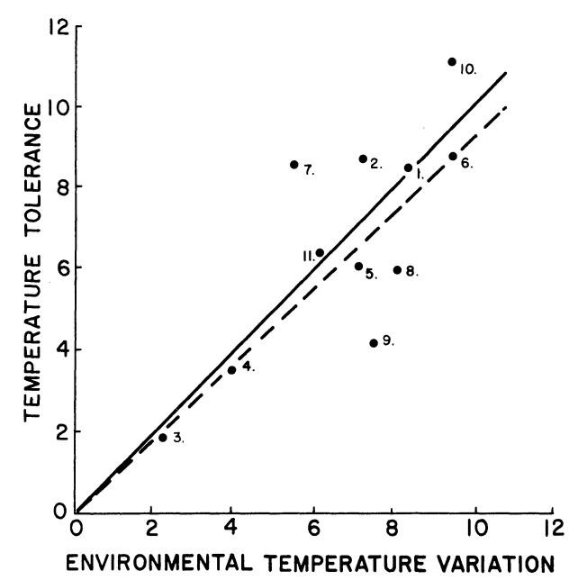
```

```{r fig-heattrans-2, echo=FALSE, fig.height=4, fig.fullwidth=FALSE, fig.cap='Surface activity of *Pogonomyrmex badius* in relation to temperature of the ground surface and time of day. Active ants on the mound are indicated by crosses; inactive mounds are indicated by open circles; half-closed circles denote very slight activity. The months represented, beginning with the highest curve at 12 noon, are June, July, May, October and February. (From Colley, F.Bf. and J.B. Gentry, 1964, p. 224.)'}
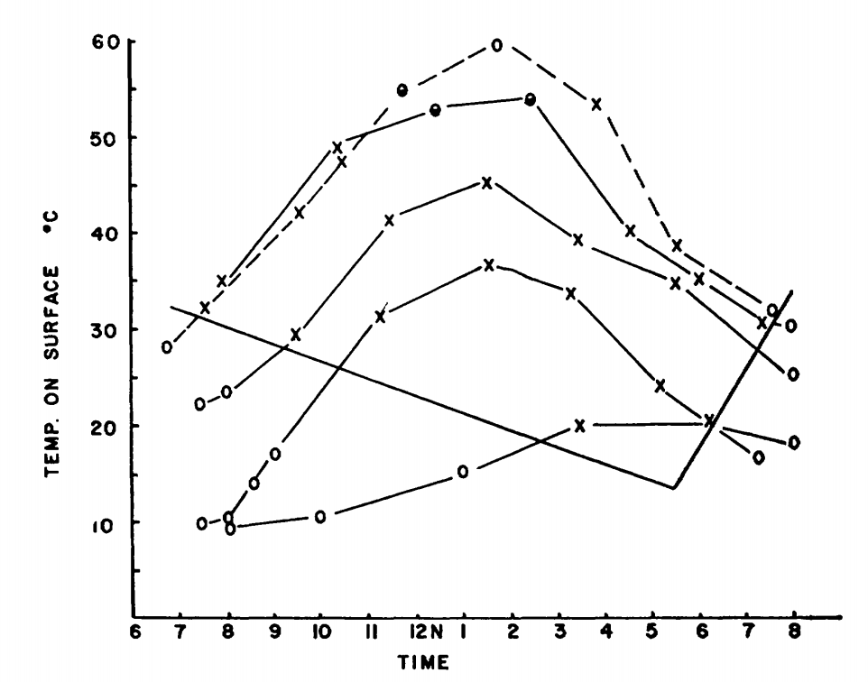
```

The reader should be cautioned that there are other ecological factors such as competition, predation, and coevolution, which may be greater selective influences and which may interact with selective pressures of the physical environment. Predictions from models incorporating physical processes can often be tested quantitatively which allows the investigator to compare the importance of the physical process under consideration with other ecological factors.

R code throughout the tutorial demonstrates the use of the TrenchR package to estimate heat transfer. The package can be installed and loaded as follows:
```{r}
#install.packages("devtools")
#library("devtools")
#devtools::install_github(build_vignettes = TRUE,repo = "trenchproject/TrenchR")

library(TrenchR)
```

## HEAT TRANSFER PROCESSES

### Radiation

Radiation is a process of energy transfer that requires no intervening medium. The dual nature of radiation, its particle (photon) and wavelike properties have important biological consequences. All matter radiates energy as individual photons (Kreith 1973) but for heat transfer problems the wavelike description is more useful. This is because energy at different wavelengths interacts with matter it different ways (but see Problem 2). Figure \@ref(fig:fig-heattrans-3) shows the different wavelengths of electromagnetic spectrum.

Since radiation travels at the speed of light $c_L$, the product of the frequency $f$ and the wavelength $\lambda$ is a constant:
\begin{equation}
c_L = f \lambda
(\#eq:1)
\end{equation}

```{r fig-heattrans-3, echo=FALSE, fig.height=4, out.width = "75%", fig.cap='The electromagnetic spectrum.'}

```

```{r fig-heattrans-4, echo=FALSE, fig.height=4, fig.fullwidth=FALSE, fig.cap='Schematic representation of blackbody emission spectra, as a function of wavelength, for temperatures of 6000 and 270 K. (From Lowry, W.P., 1969, p. 17.)'}
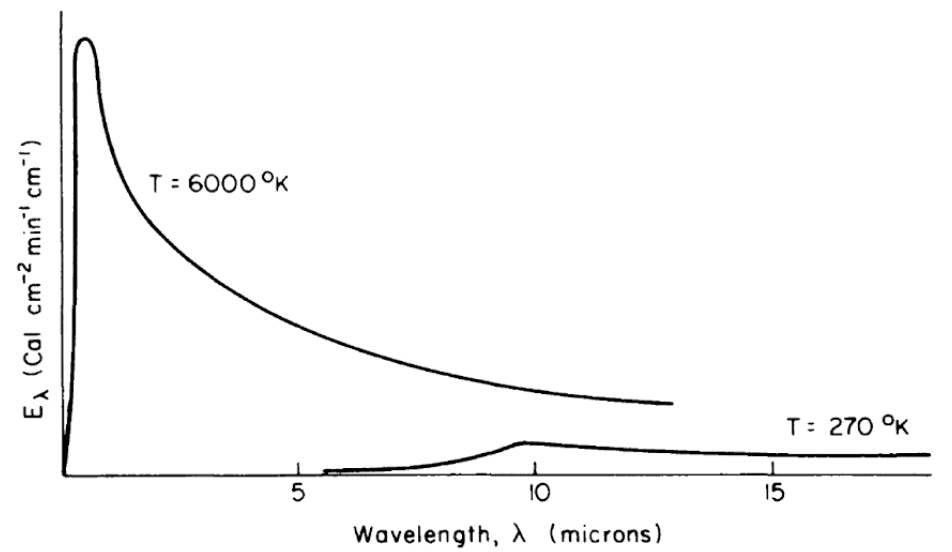
```

All objects, living and nonliving, radiate thermal energy. The amount and kind (wavelength in the electromagnetic spectrum) of energy depend on the temperature and physical characteristics of the radiating body. Figure \@ref(fig:fig-heattrans-4) shows the energy radiated by the sun and the earth as a function of wavelength. It should be clear from the figure that the portion of the electromagnetic spectrum radiating from the sun occurs at much shorter wavelengths than that of the earth. In fact, the sun's peak radiation on a wavelength plot is in the green part of the visible spectrum, while the earth's radiation is completely in the infrared region. 

Three physical laws are associated with figure \@ref(fig:fig-heattrans-4). Planck's Law gives the energy emitted, $E_\lambda$, as a function of the wavelength, $\lambda$, if the temperature of the radiating body is known:
\begin{equation}
E_\lambda = c_1 \lambda^{-5} [exp(c_2 / \lambda T)] -1 ]^{-1}
(\#eq:2)
\end{equation}
where
<div class="nobullet">
* $E_\lambda$ is the amount of energy emitted in the band $\lambda$ to $\lambda$ + $d \lambda$ ($J m^{-1}$),
* $T$ is the blackbody temperature ($K$),
* $\lambda$ is the wavelength ($m$),
* $c_1$ is $2 \pi h {c_L}^2$,
* $c_2$ is $hc_L / K_b$,
</div>
where
<div class="nobullet">
* $h$ is Planck's constant = $6.63 \times 10^{-34} (J s)$,
* $K_b$ is Boltzmann's constant = $1.38 \times 10^{-23} (J K^{-1})$,
</div>
and
<div class="nobullet">
* $c_L$ is the speed of light = $3.00 \times 10^8 (m s^{-1})$.
</div>

It is obvious that no one has actually measured the surface temperature of the sun. In this instance, the sun's temperature was deduced from its electromagnetic spectrum. Second, from Planck's Law, it can be demonstrated (Robinson 1966 or Roseman 1978) that the wavelength at the maximum radiated energy is only a function of the temperature of the radiating body.

\begin{equation}
\lambda_{max} = \frac{2.897}{T} \times 10^{-3}
(\#eq:3)
\end{equation}
where
<div class="nobullet">
* $\lambda_{max}$ = wavelength of maximum radiation ($m$),
and 
* $T$ = temperature ($K$).
</div>

Third, the Stefan-Boltzmann Law provides the even more remarkable result that the total energy emitted, $Q_{emit}$, by a radiating body (the area under the curve (Fig. \@ref(fig:fig-heattrans-4))) is proportional to the fourth power of the surface temperature $T_s$.
\begin{equation}
Q_{emit} = \varepsilon \sigma (273 + T_s)^4
(\#eq:4)
\end{equation}
where
<div class="nobullet">
* $Q_{emit}$ is the radiant energy emitted from the surface ($W m^{-2}$).
* $\varepsilon$ is the emissivity (range zero to one),
* $\sigma$ is the Stephan-Boltzmann constant ($5.67 \times 10^{-8} W m^{-2} K^{-4}, 8.17 \times 10^{-11} cal \, min^{-l} cm^{-2} K^{-4})$,
and 
* $T_s$ is the surface temperature ($^{\circ}C$)
</div>
Roseman (1978) gives a more complete discussion of these laws.

Kirchoff studied the emissivity and absorptivity of materials. He showed that the energy absorbed at any specific wavelength $\lambda$ at constant temperature is equal to the energy emitted at $\lambda$. That is, if the absorptivity of a surface $a(\lambda)$ represents the fraction of incident radiation absorbed at $\lambda$ and $\varepsilon (\lambda)$ is the emissivity, the radiation emitted at $\lambda$ divided by the radiation emitted from a blackbody, then $a(\lambda) = \varepsilon (\lambda)$ for each wavelength. If $\varepsilon = 1$ for all wavelengths, then the object is said to be a blackbody. Although no system is a perfect blackbody, many are approximately so. In the infrared region, 3 to 100 $\mu m$, most objects such as vegetation, soil and water behave like blackbodies ($\varepsilon = 1$). Table 1 gives the emissivities of some plants and animals.

> Table 1. Long Wave Emissivities (percent, from Monteith, J.L., 1973, p. 68.)

Leaves

  | Species                                   | Average    |
  |-------------------------------------------|------------|
  | Maize (*Zea mays*)                        | 94.4 ± 0.4 |
  | Tobacco (*Nicotiana tabacum*)             | 97.2 ± 0.6 |
  | Snap bean (*Phaseolus vulgaris*)          | 93.8 ± 0.8 |
  | Cotton (*Gossypium hirsutum Deltapine*)   | 96.4 ± 0.7 |
  | Sugar cane (*Saccharum officinarum*)      | 99.5 ± 0.4 |
  | Poplar (*Populus fremontii*)              | 97.7 ± 0.4 |
  | Geranium (*Pelargonium domesticum*)       | 99.2 ± 0.2 |
  | Cactus (*Opuntia rufida*)                 | 97.7 ± 0.2 |
  
Animals

  | Species                                  | Dorsal | Ventral | Average |
  |------------------------------------------|--------|---------|---------|
  | Red squirrel (*Tamiasciurus hudsonicus*) | 95-98  | 97-100  |         |
  | Gray squirrel (*Sciurus carolinensis*)   | 99     | 99      |         |
  | Mole (*Scalopus aquaticus*)              | 97     | --      |         |
  | Deer mouse (*Peromyscus sp.*)            | --     | 94      |         |
  | Gray wolf                                |        |         | 99      |
  | Caribou                                  |        |         | 100     |
  | Snowshoe hare                            |        |         | 99      |
  | Man (*Homo sapiens*)                     |        |         | 98      |


  > Table 2. Reflectivities of Biological Materials for Solar Radiation (from Monteith, J.L., 1973, pp. 66-67.)
  
  LEAVES
  Reflection coefficients r (%) for Solar Radiation
  
  | Species                            | Upper | Lower | Average |
  |------------------------------------|:-----:|:-----:|:-------:|
  | Maize (*Zea mays*)                 |       |       |    29   |
  | Tobacco (*Nicotiana tabacum*)      |       |       |    29   |
  | Cucumber (*Cucumis sativa*)        |       |       |    31   |
  | Tomato (*Lycopersicon esculentum*) |       |       |    28   |
  | Birch (*Betula alba*)              |   30  |   33  |    32   |
  | Aspen (*Populus tremuloides*)      |   32  |   36  |    34   |
  | Oak (*Quercus alba*)               |   28  |   33  |    30   |
  | Elm (*Ulmus rubra*)                |   24  |   31  |    28   |
  
  VEGETATION -- MAXIMUM GROUND COVER
  
  | Farm Crops | Daily Mean | Farm Crops | Daily Mean |
  |------------|:----------:|------------|:----------:|
  | Grass      |     24     | Wheat      |     22     |
  | Sugar beet |     26     | Pasture    |     25     |
  | Barley     |     23     | Barley     |     26     |
  | Wheat      |     26     | Pineapple  |     15     |
  | Beans      |     24     | Sorghum    |     20     |
  | Maize      |   18 - 22  | Sugar cane |     15     |
  | Tobacco    |   19 - 24  | Cotton     |     21     |
  | Cucumber   |     26     | Groundnuts |     17     |
  | Tomato     |     23     |            |            |
  
  | Natural Vegetation      | Daily Mean | Natural Vegetation | Daily Mean |
  |-------------------------|:----------:|--------------------|:----------:|
  | Heather                 |     14     | Natural pasture    |     25     |
  | Bracken                 |     24     | Derived savanna    |     15     |
  | Gorse                   |     18     | Guinea savanna     |     19     |
  | Maquis, evergreen scrub |     21     |                    |            |
  
  | Forests and Orchards | Daily Mean | Forests and Orchards | Daily Mean |
  |----------------------|:----------:|----------------------|:----------:|
  | Deciduous woodland   |     18     | Eucalyptus           |     19     |
  | Coniferous woodland  |     16     | Tropical rainforest  |     13     |
  | Orange orchard       |     16     | Swamp forest         |     12     |
  | Aleppo pine          |     17     |                      |            |
  
  
  ANIMAL COATS
  
  | Mammals                                  | Dorsal | Ventral | Average |
  |------------------------------------------|:------:|:-------:|:-------:|
  | Red squirrel (*Tamiasciurus hudsonicus*) |   27   |    22   |    25   |
  | Gray squirrel (*Sciurus carolinensis*)   |   22   |    39   |    31   |
  | Field mouse (*Microtus pennsylvanicus*)  |   11   |    17   |    14   |
  | Shrew (*Sorex sp.*)                      |   19   |    26   |    23   |
  | Mole (*Scalopus aquaticus*)              |   19   |    19   |    19   |
  | Gray fox (*Urocyon cinereo argenteus*)   |        |         |    34   |
  | Zulu cattle                              |        |         |    51   |
  | Red Sussex cattle                        |        |         |    17   |
  | Aberdeen Angus cattle                    |        |         |    11   |
  | Sheep weathered fleece                   |        |         |    26   |
  |       Newly shorn fleece                 |        |         |    42   |
  | Man (*Homo sapiens*) Eurasian            |        |         |    35   |
  |                      Negroid             |        |         |    18   |
  
  | Birds                                      | Wing | Breast | Average |
  |--------------------------------------------|:----:|:------:|:-------:|
  | Cardinal (*Richmondena cardinalis*)        |  23  |   40   |         |
  | Bluebird                                   |  27  |   34   |         |
  | Tree swallow                               |  24  |   57   |         |
  | Magpie                                     |  19  |   46   |         |
  | Canada goose                               |  15  |   35   |         |
  | Mallard duck                               |  24  |   36   |         |
  | Mourning dove                              |  30  |   39   |         |
  | Starling (*Sturnus vulgaris*)              |      |        |    34   |
  | Glaucous-winged gull (*Larus glaucescens*) |      |        |    52   |

This, however, is not true in the visible part of the spectrum. In general, any wavelength can be absorbed, reflected, or transmitted. This is written: 

\begin{equation}
a(\lambda) + r(\lambda) + t(\lambda) = 1
(\#eq:5)
\end{equation}

where
<div class="nobullet">
* $a(\lambda)$ = absorptivity at wavelength $\lambda$,
* $r(\lambda)$ = reflectivity at wavelength $\lambda$,
* $t(\lambda)$ = transitivity at wavelength $\lambda$,
</div>
and each term is between zero and one (see Siegel and Howell 1972 for a more complete discussion). Table 2 gives some values for $r$ averaged over the entire spectrum for different ecological systems. Values of $a$, $r$, $t$ are also given by Porter (1967) for animals and Monteith (1973) for plants and animals.

As an example of radiation flux, let us calculate the radiant energy emitted by the cactus, *Opuntia rufida*. To do this, we must specify the emissivity $\varepsilon$ and the surface temperature $T_s$. In Table 1, $\varepsilon = 0.977$ for *O. rufida* and, if we take $T_s = 10 ^{\circ}C$, then:
\begin{equation}
Q_{emit} = 0.977 \times 5.67 \times 10^{-8} (10 + 273)^4 = 355.5 W m^{-2}
(\#eq:6)
\end{equation}
If we wish to know the total heat loss per second ($1 watt = 1 J s^{-1}$) for the plant, we must multiply our answer by the surface area of the cactus.

The TrenchR functions for thermal radiation account for surface area and calculate net radiation based on the difference between the organism's surface and the environment. The rate of emission of thermal radiation from the surface of an animal, $Q_{emit} (W)$, is determined by the difference between the surface temperature of the animal $T_b (K)$ and the temperatures of the air $T_a (K)$ and ground $T_g (K)$.  $T_a$ is additionally used to estimate sky temperature $T_{sky} (K)$, the effective radiant temperature of the sky as $T_{sky}=1.22*(T_a-273.15)-20.4+273.15$ [Gates 1980]. The following expressions can be used to estimate $Q_{emit} (W)$ for animals in enclosed and open environments, respectively:
$$
enclosed: Q_{emit}= A_r \epsilon \sigma (T_b^4 - T_a^4)\\
open: Q_{emit}= \epsilon \sigma (A_s (T_b^4 - T_{sky}^4)+A_r (T_b^4 - T_g^4)),
$$
where $A_s$ and $A_r$ are the areas ($m^2$) exposed to the sky (or enclosure) and the ground, respectively; $\epsilon$ is the longwave infrared emissivity of skin (proportion, 0.95 to 1 for most animals [Gates 1980]); and $\sigma$ is the Stefan-Boltzmann constant. 

The function is available in R as follows:
```{r}
library(TrenchR)
Qemitted_thermal_radiation(epsilon=0.96, A=1, psa_dir=0.4, psa_ref=0.6, T_b=303, T_g=293, T_a=298, enclosed=FALSE)
```

The calculation of absorbed radiation $Q_{abs}$, although straightforward with some assumptions, is a lengthy task because several longwave and shortwave components must be included. Gates and Stevenson (1979) have devoted an entire module to this topic to which the interested reader should refer for additional information. We briefly review the basic TrenchR functions for estimating absorbed radiation here. The solar and thermal radiation absorbed by animals, $Q_{abs} (W)$, is the sum of direct $S_{dir}$, diffuse $S_{dif}$, and reflected $S_{ref}$ solar radiation ($W/m^2$). The sum is weighted by the organism's surface area $A$ exposed to the radiation sources. Additionally, all forms of incoming radiation are multiplied by the solar absorptivity of the animal surface ($a$ proportion) to estimate absorbed radiation. The summation of incoming solar radiation is thus as follows:

$$Q_{abs}= a*A_{dir}*S_{dir} + a*A_{dif}*S_{dif} + a*A_{ref}*S_{ref},$$
where $A_{dir}$,$A_{dif}$,and $A_{ref}$ are the surface areas exposed to direct, diffuse, and reflected solar radiation, respectively.

The summation is available in R as follows
```{r}
Qradiation_absorbed(a=0.9, A=1, psa_dir=0.4, psa_ref=0.4, S_dir=1000, S_dif=200, a_s=0.5)
```
Additional TrenchR functions are available to estimate the radiation components.

### Conduction

**Conduction**, $Q_{cond}$, describes the physical process of molecular thermal energy flow within a solid, fluid or gas. In fluids and especially gases, motion of the medium usually makes the process of convection a more important mechanism of heat transfer than conduction. Heat flows by conduction when nearby molecules have more internal energy (higher temperature) and thus a greater mean kinetic energy. Energy can be transferred by molecular collisions (fluids) or by diffusion (solids) (Kreith 1973, pages 4-5).

In conduction, the rate of heat flow depends on the thermal conductivity of the material, the area through which the heat flows and the temperature gradient in the material. Equation \@ref(eq:7) describes the relation as:

\begin{equation}
Q_{cond} = -k A_c \frac{dT}{dx}
(\#eq:7)
\end{equation}

where
<div class="nobullet">
* $Q_{cond}$ is conduction ($W$),
* $k$ is thermal conductivity ($W m^{-1} {^{\circ}C^{-1}}$),
* $A_c$ is the area through which the heat is flowing ($m^2$),
and
* $\frac{dT}{dx}$ is the thermal gradient ($^{\circ}C m^{-1}$).
</div>

The negative sign in equation \@ref(eq:7) is to indicate that the direction of heat flow is from regions of higher temperature to lower temperature (opposite the temperature gradient). This is shown in Fig. \@ref(fig:fig-heattrans-5).

```{r fig-heattrans-5, echo=FALSE, fig.height=4, out.width = "75%", fig.cap='Sketch illustrating sign convention for conduction heat flow. From Kreith, F. 1973. P. 8.'}
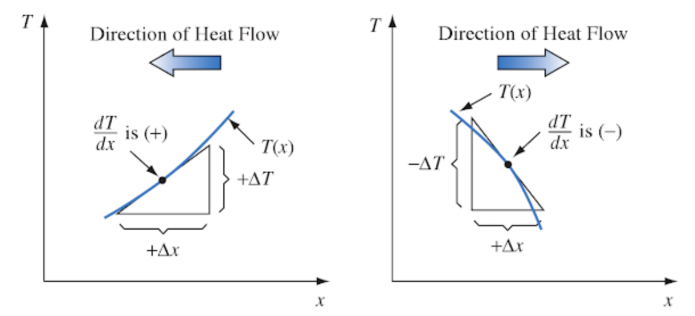
```

The thermal conductivity depends on the molecular structure of the material. Some cooking pots have copper-coated bottoms because this metal transfers heat better than other materials. Home insulation materials reduce the flow of heat because they trap air which has a low thermal conductivity. The hollow centers of the hair shafts of some mammals reduces the conduction of heat along the fiber. The thermal conductivity can be calculated by measuring the heat flow when the temperature slope (Fig. \@ref(fig:fig-heattrans-5)) is one.

As an example of conduction, we will examine the heat flow between the alligator, *Alligator mississippiensis*, and substratum. We assume that the skin is she same temperature as the ground and that the animal is in good thermal contact with the surface (there are no air pockets reducing heat flow). The conduction exchange can now be calculated as follows: The thermal conductivity of fat is 0.20 $W m^{-1} {^{\circ}C^{-1}}$ while the soil-rock range of conductivity is between 0.556 and 3.25 $W m^{-1} {^{\circ}C^{-1}}$. Since the fat layer of 0.7 cm has a lower conductivity, it controls the rate of heat flow. Here we also assume that 0.5 $m^2$ of the alligator at $T_b = 22^{\circ}C$ are in contact with the ground at $T_g = 30 ^{\circ}C$. In steady state, the conductive heat flux is then a linear function of the potential, as given in equation \@ref(eq:7).

\begin{equation}
Q_{cond} = \frac{k A_c}{x} (T_b - T_g) = \frac{0.198 \times 0.5}{0.007} (22-30) = -114 W
(\#eq:8)
\end{equation}

where
<div class="nobullet">
* $Q_{cond}$ is conduction ($W$, negative since energy is flowing from the ground to the animal),
* $T_b$ is body temperature of the alligator ($^{\circ}C$),
* $k$ is the thermal conductivity of fat ($W m^{-1} {^{\circ}C^{-1}}$),
* $T_g$ is ground temperature ($^{\circ}C$),
and
* $\Delta x$ is thickness of layer ($m$).
</div>

The TrenchR package includes similar functions for modelling convection based on whether the thermal conductivity of the animal or the substrate is the limited step. When animal conductance is the rate limiting step, $Q_{cond}$ can be estimated as follows:
$$Q_{cond}= A*proportion*k*(T_g-T_b)/d, $$
where $k$ is thermal conductivity ($W K^{-1} m^{-1} {^{\circ}C^{-1}}$), $T_g$ is ground (surface) temperature (K), $T_b$ is body temperature (K), and $d$ is the mean thickness of the animal skin (surface, $m$). This formulation assumes the organism has a well mixed interior rather than an interior temperature gradient.

When substrate thermal conductivity is the rate limiting step, $Qcond$ can be estimated as follows:
$$Qcond= A*proportion*(2K_g/D)*(T_b-T_g),$$
where $K_g$ is the thermal conductivity of substrate ($W K^{-1} m^{-1}$) and $D$ is the characteristic dimension of the animal ($m$).

The functions are available in R:
```{r}
Qconduction_animal(T_g= 293,T_b=303,d=10^-6,K=0.5,A=10^-3, proportion=0.2)
Qconduction_substrate(T_g= 293,T_b=303,D=0.01,K_g=0.3,A=10^-2, proportion=0.2)
```

Before proceeding to a discussion of convection, it is important to talk about an alternative view of conduction. It is possible to rewrite equation \@ref(eq:8) as

\begin{equation}
G = k_g (T_b - T_g)
(\#eq:9)
\end{equation}

The rate of heat flow is then equal to a conductance $k_g$ times a potential, the temperature difference. The conductivity, area of contact and length have all been subsumed into $k_g$. When working heat transfer problems, it is also common to speak and think of resistances to heat transfer. A resistance is simply the reciprocal of the conductance. If there is a large resistance to heat flow, there is a low conductance. Monteith (1973) and Campbell (1977) have adopted the resistance approach for describing mass and momentum fluxes as well as heat transport. This concept originated with Ohm's Law where the electrical current flow is equal to the potential or voltage drop divided by the resistance of the material. Thus, the correspondence of a flux driven by a potential is called Ohm's Law analogy. Kreith (1973, chapters 1 and 2) shows how radiation, convection and evaporation can also be thought of in these terms. It should be remembered though that in general the Ohm's Law analogy, due to the complications introduced by turbulent mass and turbulent energy transfer, is an approximation (see Tennekes and Lumley 1973).

Conduction is often ignored in the heat transfer of plants and animals because one must know or make assumptions about the temperatures, boundary layer thickness, thermal conductivity, and contact resistance. There are not many actual measurements reported in the ecological literature but Mount (1968), Derby and Gates (1966), Gatesby (1977), and Thockelson and Maxwell (1974) offer some interesting examples of the importance of conduction.

### Convection

**Convection** is the transfer of heat between solids and fluids (i.e., gases and liquids) or when fluids of different temperatures are in contact. Conduction takes place with nearby particles on the molecular level but the additional factor of the circulation of the fluid distinguishes convection from conduction. When there is no motion in the fluid except that caused by density gradients and by the resultant buoyant forces, this process is called "free convection." If the fluid is moving relative to the other fluid or solid, the process is called "forced convection." If the flow is turbulent, besides the molecular processes, there will be increased heat transfer caused by the bulk transport of fluid. Also, at certain fluid velocities, free and forced convection may both contribute to the convection term. Indeed convection is comprised of several complex physical processes occurring simultaneously.

Water and air are the two fluids that commonly interest the thermobiologist. Most aquatic organisms are at ambient water temperature; hence, convective transfer is unimportant because there is no temperature difference. Marine mammals, birds, a few large fish and turtles, however, maintain body temperatures above water temperature, which requires thick insulation (Bartholomew 1977, Schmidt Nielsen 1975). This is because the high specific heat ($4.18 \times 10^3 J kg^-1 {^{\circ}C^{-1}}$) and thermal conductivity ($59.8 W m^{-2} {^{\circ}C^{-1}}$) of water create a large heat loss. The extra heat transferred due to the movement of the fluid has not been examined for many organisms (but see Eskine and Spotila 1977 and Lueke et al. 1976). Although the specific heat and thermal conductivity of air are much less than for water, convection is still a significant mode of heat transfer for terrestrial organisms.

As with conduction, convective heat flow can be thought of as a potential (the difference in temperature between the surface of the object and the surrounding fluid) times a conductance. The conductance is most commonly written as the product of two terms as in equation \@ref(eq:10):

\begin{equation}
Q_{conv} = h_c A_c (T_s - T)
(\#eq:10)
\end{equation}

where
<div class="nobullet">
* $Q_{conv}$ is the convective heat flux ($W$),
* $h_c$ is the convective heat transfer coefficient. ($W m^{-2} {^{\circ}C^{-1}}$),
* $A_c$ is the area at object in contact with the fluid ($m^2$),
* $T_s$ is the surface temperature of the object ($^{\circ}C$),
and
* $T$ is the fluid temperature ($^{\circ}C$).
</div>

Usually, $A_c$, $T_s$ and $T$ can be evaluated. The heat transfer coefficient, on the other hand, is often a difficult parameter to estimate in the natural environment because of turbulence (Kowalski and Mitchell 1976, and Noble 1975).

TrenchR offers the following function for modelling convection. The function accounts for the proportion of the surface area in contact with the substrate, $proportion$, and an enhancement factor multiplier, $e_f$, that can be incorporated to account for increases in heat exchange resulting from air turbulence in field conditions. Conduction can be estimated as follows:
$$Q_{conv}= ef*h_c*(A*proportion)*(Ta-Tb).$$

The function is available in R:
```{r}
Qconvection(T_a= 293,T_b= 303,H=10.45,A=0.0025, proportion=0.85)
```

Generally, the heat transfer coefficient is evaluated as follows: 

\begin{equation}
h_c = \frac{Nu \, k}{D}
(\#eq:11)
\end{equation}
where
<div class="nobullet">
* $h_c$ is the heat transfer coefficient ($W m^{-2} {^{\circ}C^{-1}}$),
* $Nu$ is the Nusselt number,
* $k$ is the thermal conductivity of the fluid ($W m^{-1} {^{\circ}C}$),
and
* $D$ is the characteristic dimension of the system ($m$).
</div>
The heat transfer coefficient, $h_c$, is a value which has been averaged over the entire surface area of the system. The characteristic dimension $D$ must be defined for each different geometric shape one wishes to consider. Commonly, one might use the diameter of a sphere or the widest point of a leaf in the direction of the wind. The Nusselt number is a non-dimensional number used to scale laboratory results to other wind velocity and fluid properties. Kreith (1973, page 317) gives two physical interpretations for the Nusselt number. It may be thought of 'as the ratio of the temperature gradient in the fluid immediately in contact with the surface to a reference temperature gradient $(T_s - T)/D$' or the 'ratio $D/x$ where $x$ is the fluid thickness of a hypothetical layer which, if completely stagnant, offers the same thermal resistance to the flow of heat as the actual boundary layer.'

In practice, another non-dimensional number, the Reynolds number, $Re$, which is the ratio of inertial ($\rho v^2$) to viscous forces ($\mu V/D$), is introduced to account for the scaling effects of fluid velocity, geometry, and fluid properties (see Kreith 1973 or Cowan 1977 for a discussion of $Re$).

\begin{equation}
Re = \frac{\rho vD}{\mu}
(\#eq:12)
\end{equation}
where
<div class="nobullet">
* $\rho$ is the fluid density ($kg\,m^{-3}$),
* $V$ is the fluid velocity ($m s^{-1}$),
* $D$ is the characteristic dimension ($m$),
and
* $\mu$ is the fluid viscosity ($kg m^{-1} s^{-1}$).
</div>
For a particular geometry, a functional relationship between the Nusselt number and the Reynolds number can then be calculated from laboratory measurements ($h_c$ versus $V$). Usually, the result is expressed as:

\begin{equation}
Nu = a {Re}^b
(\#eq:13)
\end{equation}
where $a$ and $b$ are determined by regression. The parameters will be different for different shaped objects (Kreith 1973). Then, using equation \@ref(eq:12), the $Nu$ can be calculated which in turn will yield the convection coefficient from equation \@ref(eq:11). This procedure is the standard method used in engineering. In ecological studies, where one is concerned about the effects of wind speed and size and the geometry of the system is constant, the convection coefficient is sometimes given without specifically indicating the coefficient of equation \@ref(eq:13) as in the following example. This approach is more direct and is fine to use as long as the student realizes what has been implied.

The Nusselt and Reynolds numbers and additional dimensionless groups are available in TrenchR as follows:
```{r}
Nusselt_number(H_L=20, D=0.01, K=0.5)
Reynolds_number(u=1, D=0.001, nu=1.2)
```

TrenchR offers methods to estimate the convective heat transfer coefficient entails based on either empirical measurements (`heat_transfer_coefficient()`) or approximating the animal shape as a sphere (`heat_transfer_coefficient_approximation()`), which enables simplification while also producing an reasonable approximation [Mitchell 1976].  The functions approximate forced convective heat transfer as a function of windspeed $V (m/s)$, the characteristic dimension $D (m)$, the thermal conductivity of the air $k (W m^{-1} K^{-1})$, the kinematic viscosity of the air $nu (m^2 s^{-1})$, and the taxa or a generic shape. An additional, simplified function (`heat_transfer_coefficient_simple()`) provides a reasonable approximation based on $V$ and $D$ for most environmental conditions.

```{r}
heat_transfer_coefficient(V=0.5,D=0.05,K= 25.7 * 10^(-3),nu= 15.3 * 10^(-6), "cylinder")
heat_transfer_coefficient_approximation(V=3,D=0.05,K= 25.7 * 10^(-3),nu= 15.3 * 10^(-6), "sphere")
heat_transfer_coefficient_simple(V=0.5,D=0.05)
```

Tibbals et al. (1964), from earlier experimental work by Gates and Benedict (1963), were able to use the following formula to evaluate convective exchange for a leaf:
\begin{equation}
Q_{conv} = k_1 \bigg(\frac{V}{D}\bigg)^{0.5} (T_s - T_a)
(\#eq:14)
\end{equation}
where
<div class="nobullet">
* $Q_{conv}$ is the convective heat flux ($W m^{-2}$, positive for heat flow frog the leaf to the air),
* $k_1$ is 9.14 ($J m^{-2} {^{\circ}C^{-1}} s^{-1/2}$),
* $V$ is wind velocity ($m s^{-1}$),
* $D$ is the characteristic dimension (widest point) of the leaf in the direction of the wind ($m$),
* $T_s$ is the surface temperature of the leaf ($^{\circ}C$),
and
* $T_a$ is the air temperature ($^{\circ}C$).
</div>

After using this convection term $Q_{conv}$ in the energy budget equation, Tibbals et al. (1964, page 538) concluded for similar energy environments "that . . . that the broad deciduous type leaf would be considerably warmer than the conifers . . ." and " . . . that the demand on transpiration is probably greatest per unit surface area for the broad-leaf plant than the conifers." (Also see Gates 1977.)

The theory of convective transfer is more complex than presented here. Although some additional material will be included in the problems, the reader may wish to refer to Kreith (1973), Monteith (1973) or Campbell (1977).

### Evaporation

Evaporation is the process of water changing from a liquid to a gas. For animals, water can be lost through respiration, through special glands, or through any part of the skin. Water loss is usually a small component of the heat balance for animals but may be large for animals with moist skins. It usually increases quickly at higher temperatures. Figure \@ref(fig:fig-heattrans-6) from Dawson and Templeton (1963), shows this effect for the collared lizard, *Crotaphytus collaris*. In general, the water loss, $E$, is given by equation \@ref(eq:15). Again, this is in the form of a potential divided by a resistance (an Ohm's Law analogy).
\begin{equation}
E = \frac{C_o - C_a}{r_e}
(\#eq:15)
\end{equation}
where
<div class="nobullet">
* $E$ is water loss ($kg\,s^{-1}$),
* $C_o - C_a$ is the water vapor concentration difference between the surface ($o$) and the free atmosphere ($a$) ($kg\,m^{-1}$),
* $r_e$ is the resistance to water vapor loss ($s\,m^{-1}$).
</div>

The TrenchR package incorporates a function based on empirically estimated relationships (`Qevaporation`) to estimate evaporation.

```{r fig-heattrans-6, echo=FALSE, fig.height=4, fig.fullwidth=FALSE, fig.cap='Relation of evaporative water loss to ambient temperature in collared lizards weighing 25-35g. Data represent minimal values at various temperatures for animals studied. (From Dawson, W.R., and J.R. Templeton. 1963. P. 231.)'}
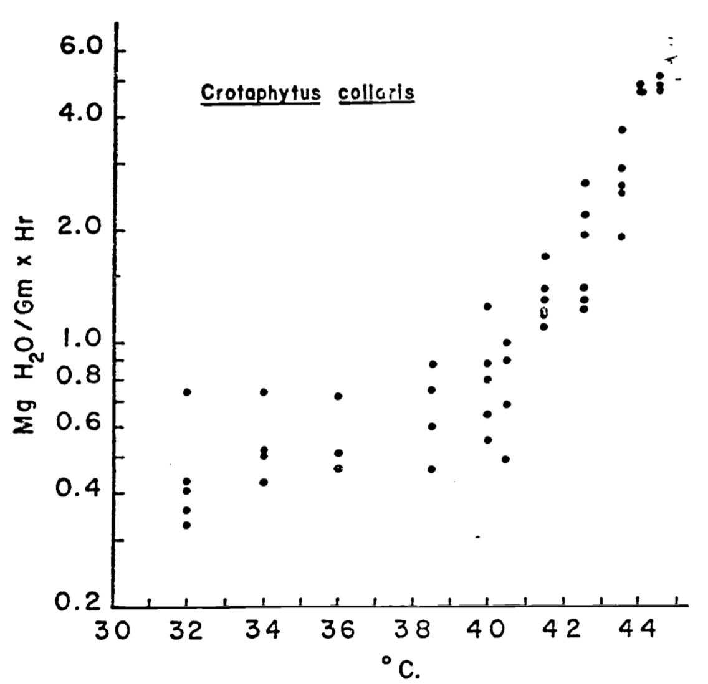
```

The water vapor concentration at the surface of the water loss site may be saturated such as that of a leaf or a lung of a bird but it may be less than saturated as in the skin of a lizard. The concentration in the air is equal to the saturated concentration (at air temperature $T_a$) times the relative humidity. The resistance to water loss in the skin of a lizard will be controlled by the resistance to water movement in the skin and the boundary layer resistance. In a leaf, the total resistance to water loss is a combination of the stomatal resistance and the boundary layer resistance. But the water loss resistance from the moist skin of a frog was assumed to be equal to the boundary layer resistance only (Tracy 1976). In general, the boundary layer resistance is a function of the diffusion coefficient of water vapor in air and the boundary layer thickness. This thickness in turn depends on the size of the object as well as the wind speed.

To relate the water transport calculated in equation \@ref(eq:15) to the energy balance, the mass flux $E$ must be multiplied by the latent heat of evaporation $L$. $L$ can be closely approximated as a function of temperature.
\begin{equation}
L(T) = 2.50 \times 10^6 - 2.38 \times 10^3 T
(\#eq:16)
\end{equation}
where
<div class="nobullet">
* $L(T)$ is the latent heat of evaporation ($J kg^{-1}$),
* $T$ is the surface temperature at the site of evaporation ($^{\circ}C$).
</div>

As an example of the energy flux, the water loss at $T_a = 40^{\circ}C$ for *C. collaris* is 0.8 mg of $H_2 O\,g^{-1} {hr}^{-1}$ Correcting the units to kg $s^{-1}$ for a 30 g lizard yields $6.67 \times 10^{-9} kg\:s^{-1}$. Therefore, using equation \@ref(eq:16), the energy loss for the animal is $1.6 \times 10^{-2} W$. In this example, we have not calculated $E$ explicitly, mechanistically accounting for wind speed or water vapor concentration of the environment, but animal physiologists often report evaporation as a function of air or body temperature only. These factors become more important when water loss is a larger fraction of the total energy budget or when one is concerned with the water balance of the organism (Welsh and Tracy 1977). Later in the text, a functional relationship to include these factors is given for water loss from a leaf. Generally, transpiration is a significant energy loss for plants which has led Monteith (1973) to make the distinction between "wet" and "dry" systems.

## THERMAL PROPERTIES OF MATERIALS

In the above examples, we have mentioned several thermal properties such as thermal capacity and specific heat. Now we wish to define them more carefully.

**Specific heat** is defined as: 
\begin{equation}
c = \frac{\Delta O}{\Delta T \, M}
(\#eq:17)
\end{equation}
where
<div class="nobullet">
* $c$ is the specific heat ($J kg^{-1} {^{\circ}C^{-1}}$),
* $\Delta Q$ is the heat flux ($J$),
* $\Delta T$ is a 1° change temperature ($^{\circ}C$),
and
* $M$ is a 1 kilogram system ($kg$).

We cannot measure the amount of heat a body can hold, so in a sense the term specific heat is misleading, but it is commonly used. It is simply the amount of heat which must be added per unit mass of material for a $1^{\circ}C$ rise in temperature. What actually is changing is the internal energy of the system. Table 3 (after Monteith 1973) shows values of specific heat for different materials. See Stevenson (1979a) or Zemansky and Van Ness (1966) for a more formal definition.

The heat capacity of the system can then be obtained by multiplying the mass of the system by specific heat:
\begin{equation}
C = Mc
(\#eq:18)
\end{equation}

For instance, if we consider $0.12 kg$ of granite and the same weight of peat soil as two systems (see Table 3), the heat capacity of each is the specific heat c times the mass $M$ or $96 J kg^{-1} {^{\circ}C^{-1}}$ for granite and $226J kg^{-1} {^{\circ}C^{-1}}$ the peat. To calculate the energy necessary to raise each system $10^{\circ}C$, we can employ equation \@ref(eq:18) in the form
$$\Delta Q = \Delta T \, M \, c$$
The answer is found to 960 J for the granite and 2,200 J for the peat.

> Table 3. Thermal properties of natural materials.

**MATERIAL**|**DENSITY**|**SPECIFIC HEAT**|**THERMAL CONDUCTIVITY**|**THERMALCAPACITY**|**THERMAL DIFFUSIVITY**
:-----:|:-----:|:-----:|:-----:|:-----:|:-----:
| |$\rho$|$c$|$k$|$C\_V=\rho c$|$k = \frac{k}{\rho c}$
| |kg m^-3^ $\times$ 10^3^|J kg^-1^ °C^-1^ $\times$ 10^3^|Wm^-1^°C^-1^|J m^-3^ °C^-1^ $\times$ 10^6^|m^2^s^-1^ $\times$ 10^-6^
Granite|2.6|0.8|4.61|2.08|2.22
Quartz|2.66|0.8|8.8|2.13|4.14
Clay minerals|2.65|0.9|2.92|2.39|1.22
Ice|0.9|2.1|2.3|1.89|1.22
Old snow|0.5|2.1|0.29|1.05|0.28
New snow|0.1|2.1|0.08|0.21|0.38
Wet sand|1.6|1.3|1.68|2.08|0.81
Dry sand|1.4|0.8|0.17|1.12|0.15
Wet marsh soil|0.9|3.4|0.84|3.06|0.27
Peat soil|0.3|1.8|0.06|0.54|0.11
Still water|1|4.18|0.63|4.18|0.15
Still air|0.001|1|0.02|0.001|20
Organic matter|1.3|1.92|0.25| |1
Fur|0.98| |0.33| | 
Mean body|0.98 - 1.05|3.42| | | 
Fat| |1.88|0.14 - 0.20| | 
Plant leaf| | | | | 
Wood|0.6|1.3|0.15|0.78|0.19


An equally valid way of considering the heat capacity of a system is to define the thermal capacity. It is the heat added per degree change per unit volume and thus is equal to the specific heat times the density of the material of the system (see Table 3).
\begin{equation}
c_v = \frac{\Delta Q}{\Delta T \, V}
(\#eq:19)
\end{equation}
where
<div class="nobullet">
* $c_v$ is thermal capacity ($J  m^{-3}$),
* $\Delta Q$ is the heat change in the system ($J$),
* $\Delta T$ is change in temperature ($^{\circ}C$),
and
* $V$ is unit volume ($m^3$).
</div>

Thermal conductivity along with the notions of conductance and thermal resistance have already been discussed and defined in the section on conduction. The last parameter we wish to define is the thermal diffusivity $K$ which is the ratio of the thermal conductivity $K$ divided by density $\rho$ times the specific heat.

\begin{equation}
K = \frac{k}{\rho c} \bigg(\frac{J m^{-1} {^{\circ}C^{-1}} s^{-1}}{kg \, m^{-3} \, kg^{-1} {^{\circ}C^{-1}}}\bigg) \\
= m^2 s^{-1}
(\#eq:20)
\end{equation}
The thermal diffusity is important in non-steady state conduction problems where thermal energy can be stored or transported as shown in the first example of heat flow in the soil.

## EXAMPLES OF HEAT ENERGY BUDGET

To illustrate the heat transfer principles and their biological importance, we chose three systems: the soil, a leaf, and a lizard. Again, the reader is asked to think of the ecological importance of the system and how the thermal balance influences physiological processes as the examples are presented.

### Heat Flow in Soil

In soil, heat flow has great biological importance. Not only does the energy balance control the soil temperature, but it greatly affects the moisture content. Both factors are important for photosynthesis in green plants. Soil temperature also influences nutrient uptake as we have seen in our example at the beginning of the module. Fungi, bacteria, insects, as well as many other invertebrates and vertebrates, commonly spend part or all of their life cycles in or surrounded by the soil. Soil temperatures influence metabolic rates and may serve as a behavioral cue for daily and seasonal activity patterns.

The simplest representation of heat flow in the soil is a conduction process where the heat flux $dQ$ per unit time $dt$ is equal to the conductivity $k$ times the difference in temperature $dT$ over a unit path length $dz$.
\begin{eqnarray}
\frac{dQ}{dt} = -k \frac{dT}{dz}
(\#eq:21)
\end{eqnarray}
The minus sign is used to indicate that the potential gradient is in the direction of decreasing temperature.

Another result can be derived by considering Fig. \@ref(fig:fig-heattrans-7). The First Law states that the change in internal energy (storage) is equal to the inflow minus the outflow. The change in internal energy will be equal to the mass ($\rho d z$) times the heat capacity ($c$), multiplied by the change in temperature with time ($\Delta T$).

\begin{eqnarray}
c \rho \Delta T \, d z &=& k \bigg(\frac{dT}{dz}\bigg)_U - k \bigg(\frac{dT}{dz}\bigg)_L \\
\Delta T &=& \frac{k}{c\rho} \frac{1}{dz} \Bigg( \bigg(\frac{dT}{dz}\bigg)_U - \bigg(\frac{dT}{dz}\bigg)_L\Bigg) \\
\frac{\partial T}{\partial t} &=& \frac{k}{c \rho} \frac{\partial^2 T}{\partial z^2}
(\#eq:22)
\end{eqnarray}
Equation \@ref(eq:22) is a form of the diffusion equation and $\frac{k}{c \rho}$ is called the thermal diffusivity. This equation can be solved analytically if simple enough boundary conditions are assumed and the thermal diffusivity remains constant. In general, the diffusivity is a function of the water content of the soil and the soil temperature (here numerical methods must be used). We can, however, get a feeling for the heat transfer profile by noting the general boundary conditions. We know that at the soil surface under steady state conditions the temperature will cycle daily while at some depth $z_0$ below the surface the temperature will not change.

Figures \@ref(fig:fig-heattrans-8) and \@ref(fig:fig-heattrans-9) from Lowry (1969) give different representations of how the soil might change with time and depth. Simpson (1977), Carslaw and Jaeger (1959), and Van Wijk (1966) present a more detailed discussion of soil heat flow.

```{r fig-heattrans-7, echo=FALSE, fig.height=4, fig.fullwidth=FALSE, fig.cap='Schematic view of a unit of soil, showing heat inflow from above and heat outflow below, leading to derivation of Eq. 22. (From Lowry, W.P. 1969. P. 51)'}
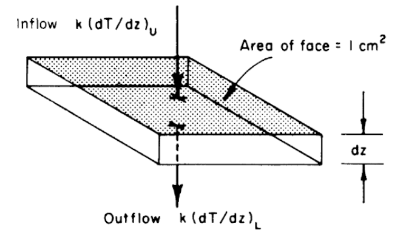
```

```{r fig-heattrans-8, echo=FALSE, fig.height=4, fig.fullwidth=FALSE, fig.cap='Generalized soil-air temperature profiles (tautochrones) near the soil surface, for four-hour intervals during a diurnal period. (From Lowry, W.P. 1969. P.37.)'}
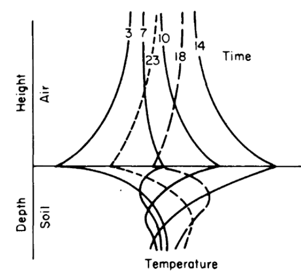
```

```{r fig-heattrans-9, echo=FALSE, fig.height=4, fig.fullwidth=FALSE, fig.cap='Generalized diurnal patterns of isotherms near the soil surface on coordinates of time and distance. (From Lowry, W.P. 1969. P. 37.)'}
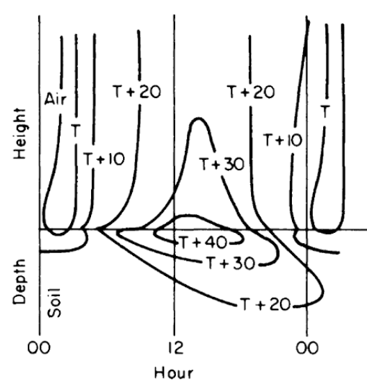
```

### A Leaf

Our second example is the energy balance of a leaf. Gates (1968) chose to model the heat balance of a leaf because it has a distinct physical geometry and because it is the unit of photosynthesis. The governing heat flux equation for the steady state condition was given in the module on the First Law of Thermodynamics and is repeated here:

\begin{equation}
Q_a = Q_e + C + LE
(\#eq:23)
\end{equation}
where
<div class="nobullet">
* $Q_a$ is the radiant energy absorbed by the leaf ($W m^{-2}$),
* $Q_e$ is the energy emitted by the leaf ($W m^{-2}$),
* $C$ is the convective flux ($W m^{-2}$),
and
* $LE$ is the evaporative flux ($W m^{-2}$).
</div>

With empirical measurements and some assumptions (see Gates 1977), equation \@ref(eq:23) is expanded as: 
\begin{equation}
Q_a = \varepsilon \sigma (T_l + 273)^4 + k_1 \bigg(\frac{V}{D}\bigg)^{0.5} (T_l - T_a) + L (T_l) \frac{_s d_l (T_l) - [r.h.]_s d_a (T_a)}{r_l + k_2 (D^{0.3} W^{0.20}) / V^{0.50}}
(\#eq:24)
\end{equation}
where
<div class="nobullet">
* $\sigma$ is the Stefan-Boltzmanm constant ($5.67 \times 10^{-8} W m^{-2} K^{-4}$)
* $\varepsilon$ is the emissivity of the leaf
* $T_l$ is the leaf temperature ($^{\circ}C$),
* $V$ is the wind speed ($m s^{-l}$),
* $k_1$ is an experimentally determined coefficient ($9.14 J m^{-2} s^{-0.5} {^{\circ}C^{-1}}$),
* $k_2$ is an experimentally determined coefficient ($183 s^{0.5} m^{-1}$),
* $T_a$ is the air temperature ($^{\circ}C$),
* $D$ is the leaf dimension in the direction of the wind ($m$),
* $r.h.$ is the relative humidity,
* $W$ is the leaf dimension transverse to the wind (m),
* $_s d_l (T_l)$ is the concentration of water vapor saturation at leaf temperature $T_l (kg \, m^{-1})$,
* $_s d_a (T_a)$ is the concentration of water vapor in free air saturated at air temperature $T_a (kg \, m^{-1})$,
and
* $r_l$ is the internal diffusion resistance of the leaf ($s m^{-1}$).
</div>

Inspection of equation \@ref(eq:24) shows that the energy balance of the leaf is very dependent on leaf temperature which in turn affects convection and transpiration. To analyze this multivariate problem, Gates graphed three variables while holding the rest constant. Figures 10 and 11 illustrate thermodynamic conditions that would be common in tropical habitats at midday sunny ($Q_a = 900 W m^{-2}$) and cloudy ($Q_a = 600 W m^{-2}$) radiation levels. Note the differences in transpiration rates and leaf temperatures as a function of leaf resistance. Gates (1968) also considered the effects of leaf size. Figure 12 clearly shows that small leaves, by reducing leaf temperature and transpiration, would be advantageous in desert regions.

We analyze this equation in R as follows.
```{r}
#radiation, convection, and evaporation
epsilon=0.96
sigma= 5.67 * 10^{-8} #Stefan-Boltzmann's constant (W m^{-2}K^{-4})
k1=9.14 #an experimentally determined coefficient ($9.14 J m^{-2} s^{-0.5} {^{\circ}C^{-1}}$),
k2=200 # is an experimentally determined coefficient ($183 s^{0.5} m^{-1}$),

L=2.26*10^6 #L, latent heat of vaporiation of water in J kg^{-1}, 2.43x10^6 at 30C and 2.5*10^6 at 0C

#calculate saturation vapor density
#' VAPPRS
#'
#' Calculates saturation vapour pressure for a given air temperature.
#' @param db Dry bulb temperature (degrees C)
#' @return esat Saturation vapour pressure (Pa)
#' @export
VAPPRS <- function(db=db){
  t=db+273.16
  loge=t
  loge[t<=273.16]=-9.09718*(273.16/t[t<=273.16]-1.)-3.56654*log10(273.16/t[t<=273.16])+.876793*(1.-t[t<=273.16]/273.16)+log10(6.1071)
  loge[t>273.16]=-7.90298*(373.16/t[t>273.16]-1.)+5.02808*log10(373.16/t[t>273.16])-1.3816E-07*(10.^(11.344*(1.-t[t>273.16]/373.16))-1.)+8.1328E-03*(10.^(-3.49149*(373.16/t[t>273.16]-1.))-1.)+log10(1013.246)
  esat=(10.^loge)*100
  return(esat)
}

#Solve vapour density
#rh: relative humidity, decimal%
#T: temperature, C
#return Vapour density (kg m^{-3})
vd= function(T,rh){
rh=rh*100
  tk = T + 273.15
esat = VAPPRS(T)
e = esat * rh / 100
e * 0.018016 / (0.998 * 8.31434 * tk)
}

#____________
#Estimate T_l then estimate transpiration
est_TlTrans <- function(T_a=40, V=0.1, rh=0.2, r_l=0, D=0.05, W=0.05, Q_a=800) {
f<- function(T_l) epsilon *sigma*(T_l + 273)^4 + k1*(V/D)^0.5*(T_l-T_a) + L*(vd(T_l, rh)-rh*vd(T_a, rh))/(r_l + k2*(D^{0.3}*W^{0.20})/ V^{0.50})- Q_a
T_l=uniroot(f, interval=c(-100, 100))$root

#estimate transpiration
E=(vd(T_l, rh)-rh*vd(T_a, rh))/(r_l + k2*(D^{0.3}*W^{0.20})/ V^{0.50})
return(c(T_l, E))
}
#----
#fig 10 sunny
fig.vr=sapply( seq(0,600,100), FUN=est_TlTrans, T_a=40, rh=0.5, V=0.1, D=0.05, W=0.05, Q_a=900)
plot(fig.vr[1,], fig.vr[2,], type="l", col='tomato', xlab="Leaf temperature (C)", ylab= "Leaf transpiration (kg/m^2s)", xlim=range(35,55),ylim=range(0.0,0.0004))
fig.vr=sapply( seq(0,600,100), FUN=est_TlTrans, T_a=40, rh=0.5, V=2.1, D=0.05, W=0.05, Q_a=900)
points(fig.vr[1,], fig.vr[2,], type="l", col='tomato2')
fig.vr=sapply( seq(0,600,100), FUN=est_TlTrans, T_a=40, rh=0.5, V=4.1, D=0.05, W=0.05, Q_a=900)
points(fig.vr[1,], fig.vr[2,], type="l", col='tomato3')
fig.vr=sapply( seq(0,600,100), FUN=est_TlTrans, T_a=40, rh=0.5, V=6.1, D=0.05, W=0.05, Q_a=900)
points(fig.vr[1,], fig.vr[2,], type="l", col='tomato4')

fig.vr=sapply( seq(0.1,6.1,0.2), FUN=est_TlTrans, T_a=40, rh=0.5, r_l=0, D=0.05, W=0.05, Q_a=900)
points(fig.vr[1,], fig.vr[2,], type="l", col='skyblue', lty="dashed")
fig.vr=sapply( seq(0.1,6.1,0.2), FUN=est_TlTrans, T_a=40, rh=0.5, r_l=200, D=0.05, W=0.05, Q_a=900)
points(fig.vr[1,], fig.vr[2,], type="l", col='skyblue2', lty="dashed")
fig.vr=sapply( seq(0.1,6.1,0.2), FUN=est_TlTrans, T_a=40, rh=0.5, r_l=400, D=0.05, W=0.05, Q_a=900)
points(fig.vr[1,], fig.vr[2,], type="l", col='skyblue3', lty="dashed")
fig.vr=sapply( seq(0.1,6.1,0.2), FUN=est_TlTrans, T_a=40, rh=0.5, r_l=600, D=0.05, W=0.05, Q_a=900)
points(fig.vr[1,], fig.vr[2,], type="l", col='skyblue4', lty="dashed")

legend("top", c("V=0.1", "V=2.1","V=4.1","V=6.1"), col = c('tomato','tomato2','tomato3','tomato4'), lty=c(1), bty = "n")
legend("topright", c("r_l=0", "r_l=200","r_l=400","r_l=600"), col = c('skyblue','skyblue2','skyblue3','skyblue4'), lty='dashed', bty = "n")

#fig 11 cloudy
fig.vr=sapply( seq(0,600,100), FUN=est_TlTrans, T_a=40, rh=0.5, V=0.1, D=0.05, W=0.05, Q_a=600)
plot(fig.vr[1,], fig.vr[2,], type="l", col='tomato', xlab="Leaf temperature (C)", ylab= "Leaf transpiration (kg/m^2s)", xlim=range(33,43),ylim=range(0.0,0.0004))
fig.vr=sapply( seq(0,600,100), FUN=est_TlTrans, T_a=40, rh=0.5, V=2.1, D=0.05, W=0.05, Q_a=600)
points(fig.vr[1,], fig.vr[2,], type="l", col='tomato2')
fig.vr=sapply( seq(0,600,100), FUN=est_TlTrans, T_a=40, rh=0.5, V=4.1, D=0.05, W=0.05, Q_a=600)
points(fig.vr[1,], fig.vr[2,], type="l", col='tomato3')
fig.vr=sapply( seq(0,600,100), FUN=est_TlTrans, T_a=40, rh=0.5, V=6.1, D=0.05, W=0.05, Q_a=600)
points(fig.vr[1,], fig.vr[2,], type="l", col='tomato4')

fig.vr=sapply( seq(0.1,6.1,0.2), FUN=est_TlTrans, T_a=40, rh=0.5, r_l=0, D=0.05, W=0.05, Q_a=600)
points(fig.vr[1,], fig.vr[2,], type="l", col='skyblue', lty="dashed")
fig.vr=sapply( seq(0.1,6.1,0.2), FUN=est_TlTrans, T_a=40, rh=0.5, r_l=200, D=0.05, W=0.05, Q_a=600)
points(fig.vr[1,], fig.vr[2,], type="l", col='skyblue2', lty="dashed")
fig.vr=sapply( seq(0.1,6.1,0.2), FUN=est_TlTrans, T_a=40, rh=0.5, r_l=400, D=0.05, W=0.05, Q_a=600)
points(fig.vr[1,], fig.vr[2,], type="l", col='skyblue3', lty="dashed")
fig.vr=sapply( seq(0.1,6.1,0.2), FUN=est_TlTrans, T_a=40, rh=0.5, r_l=600, D=0.05, W=0.05, Q_a=600)
points(fig.vr[1,], fig.vr[2,], type="l", col='skyblue4', lty="dashed")

legend("top", c("V=0.1", "V=2.1","V=4.1","V=6.1"), col = c('tomato','tomato2','tomato3','tomato4'), lty=c(1), bty = "n")
legend("topright", c("r_l=0", "r_l=200","r_l=400","r_l=600"), col = c('skyblue','skyblue2','skyblue3','skyblue4'), lty='dashed', bty = "n")

#fig 12 vary leaf dimensions, resistances 
fig.vr=sapply( seq(0,600,100), FUN=est_TlTrans, T_a=40, rh=0.2, V=1, D=0.01, W=0.01, Q_a=900)
plot(fig.vr[1,], fig.vr[2,], type="l", col='darkolivegreen1', xlab="Leaf temperature (C)", ylab= "Leaf transpiration (kg/m^2s)", xlim=range(35,55),ylim=range(0.0,0.0004))
fig.vr=sapply( seq(0,600,100), FUN=est_TlTrans, T_a=40, rh=0.2, V=1, D=0.05, W=0.05, Q_a=900)
points(fig.vr[1,], fig.vr[2,], type="l", col='darkolivegreen2')
fig.vr=sapply( seq(0,600,100), FUN=est_TlTrans, T_a=40, rh=0.2, V=1, D=0.1, W=0.1, Q_a=900)
points(fig.vr[1,], fig.vr[2,], type="l", col='darkolivegreen3')
fig.vr=sapply( seq(0,600,100), FUN=est_TlTrans, T_a=40, rh=0.2, V=1, D=0.2, W=0.2, Q_a=900)
points(fig.vr[1,], fig.vr[2,], type="l", col='darkolivegreen4')

fig.vr=sapply( seq(0.01,0.2,0.02), FUN=est_TlTrans, T_a=40, rh=0.2, V=1, r_l=0, Q_a=900)
points(fig.vr[1,], fig.vr[2,], type="l", col='skyblue', lty="dashed")
fig.vr=sapply( seq(0.01,0.2,0.02), FUN=est_TlTrans, T_a=40, rh=0.2, V=1, r_l=200, Q_a=900)
points(fig.vr[1,], fig.vr[2,], type="l", col='skyblue2', lty="dashed")
fig.vr=sapply( seq(0.01,0.2,0.02), FUN=est_TlTrans, T_a=40, rh=0.2, V=1, r_l=400, Q_a=900)
points(fig.vr[1,], fig.vr[2,], type="l", col='skyblue3', lty="dashed")
fig.vr=sapply( seq(0.01,0.2,0.02), FUN=est_TlTrans, T_a=40, rh=0.2, V=1, r_l=600, Q_a=900)
points(fig.vr[1,], fig.vr[2,], type="l", col='skyblue4', lty="dashed")

legend("top", c("D=0.01,W=0.01", "D=0.05,W=0.05", "D=0.1,W=0.1", "D=0.2,W=0.2"), col = c('darkolivegreen1','darkolivegreen2','darkolivegreen3','darkolivegreen4'), lty=c(1), bty = "n")
legend("topright", c("r_l=0", "r_l=200","r_l=400","r_l=600"), col = c('skyblue','skyblue2','skyblue3','skyblue4'), lty='dashed', bty = "n")

```

### A Lizard

As a final example, we will review the work of Bartlett and Gates (1967) who computed the heat energy budget for the Western fence lizard, *Sceloporus occidentalis*, on a tree trunk. They hypothesized that *S. occidentalis* oriented itself on the tree trunk so as to maintain its body temperature relatively high and constant. The daily temperature variation of the tree surfaces supported their idea (Fig. \@ref(fig:fig-heattrans-13)). The heat energy equation for equilibrium is 

\begin{equation}
Q_a + M - Q_e - LE - C - G = 0
(\#eq:25)
\end{equation}
where
<div class="nobullet">
* $Q_a$ is energy absorbed ($W m^{-2}$),
* $M$ is metabolism ($W m^{-2}$),
* $Q_e$ is radiation emitted ($W m^{-2}$),
* $LE$ is evaporation ($W m^{-2}$),
* $C$ is convection ($W m^{-2}$),
and
* $G$ is conduction ($W m^{-2}$).
</div>

Equation \@ref(eq:25) may be rewritten:

\begin{equation}
Q_a + M - \varepsilon \sigma A_e (273 + T_s)^4 - LE - h_c A_c (T_s - T_a) - k A_c \frac{dT}{dx} = 0
(\#eq:26)
\end{equation}

where
<div class="nobullet">
* $\varepsilon$ is emissivity to longwave radiation,
* $\sigma$ is Stefan-Boltzmann constant ($5.67 \times 10^{-8} W m^{-2} K^{-4}$),
* $A_e$ is the percent of the total surface area of the animal not in contact with substratum, 
* $T_s$ is surface temperature of the lizard ($^{\circ}C$),
* $h_c$ is convection coefficient ($W m^{-2} {^{\circ}C^{-1}}$),
* $T_a$ is air temperature ($^{\circ}C$),
* $k$ is thermal conductivity of substratum ($W m^{-1} {^{\circ}C^{-1}}$),
* $A_c$ is the percent area of the animal total surface area in contact with the substratum,
* $\frac{dT}{dx}$ is temperature gradient with the substrate ($^{\circ}C m^{-1}$).
</div>

```{r fig-heattrans-13, echo=FALSE, fig.height=4, fig.fullwidth=FALSE, fig.cap='Tree surface temperature in $^{\\circ}C$ on Chew\'s Ridge at 10:00, 1.:00, and 17:00 Pacific Standard Time June 21 as a function of direction from North. (From Bartlett, P. N. and D. M. Gates. 1967. P. 320.)'}
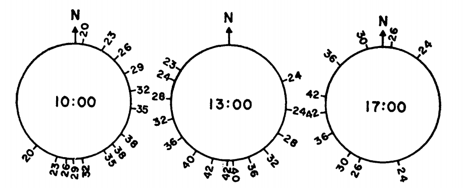
```

The terms of equation \@ref(eq:26) were either experimentally determined or taken from the literature. It was then solved for a variety of situations to obtain a range of values for the animal's energy balance: 

1. A maximum heat gain: If the lizard's surface temperature $T_s$ equaled 29.3 °C and the lizard was in close contact with the tree.
2. A minimum heat gain: If $T_s = 39.9 ^{\circ}C$ and the lizard was not in contact with the tree. 
3. Maximum heat loss of $T_s = 38.9 ^{\circ}C$, wind speed = $2.23 m s^{-1} (5 mph)$ and the animal was oriented at $90^{\circ}$ to the direction of the wind. 
4. Minimum heat loss if $T_s = 29.3 ^{\circ}C$, and wind speed was $0.1 m s^{-1}$. 
5. Intermediate heat loss if $T_s = 34.1 ^{\circ}C$ and wind speed = $0.45 m s^{-1}$. 
Figure \@ref(fig:fig-heattrans-14) gives sample results. 

```{r fig-heattrans-14, echo=FALSE, fig.height=4, fig.fullwidth=FALSE, fig.cap='Max and min energy gains (concave downward) and maximum, minimum, and estimated energy losses (concave upward) of a lizard on a tree trunk on Chew\'s Ridge for selected times and positions on June 21, with times when lizards could be expected to be found at the selected positions. Areas hatched represent times when the estimated energy loss falls between maximum and minimum energy gains. (From Bartlett, P. N. and D. M. Gates. 1967. P. 321.)'}
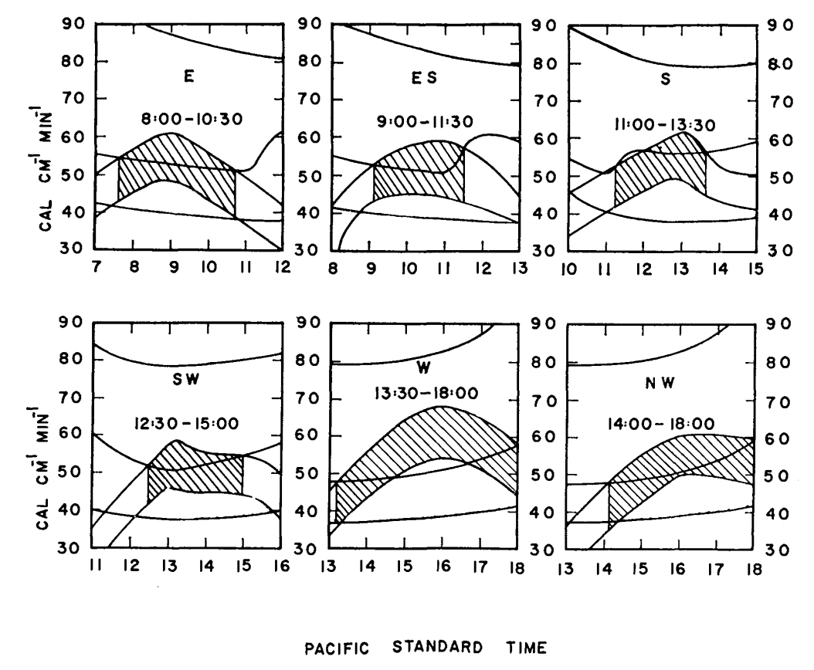
```

```{r fig-heattrans-15, echo=FALSE, fig.height=4, fig.fullwidth=FALSE, fig.cap='Estimated hourly positions on a tree trunk on Chew\'s Ridge for June 21 where (*Sceloporus occidentalis* could maintain its characteristic body temperature (arrows) and actual observed positions of lizards on June 21, 1964 (crosses). (From Bartlett, P. N. and D. M. Gates. 1967. P.321.)'}
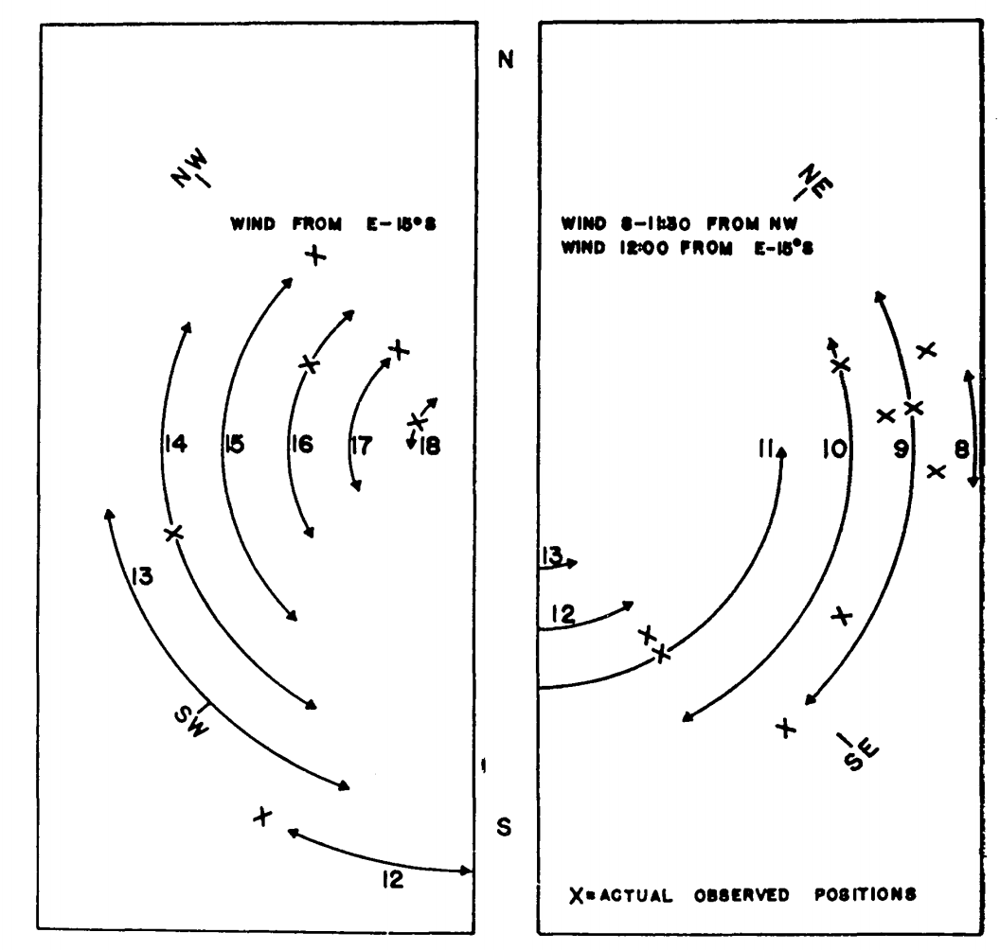
```

Finally, they calculated the energy losses and gains every hour at $45^{\circ}$ increments around the tree. Using the criterion that the energy losses must fall between the energy gains (Fig. \@ref(fig:fig-heattrans-14), they could predict the position of the lizard on the tree trunk as a function of time of day. The predicted and observed positions of the lizards are compared in Fig. \@ref(fig:fig-heattrans-15). TrenchR includes a `Tb_lizard()` function to model the energy balance of a lizard.

This module has attempted to develop the aspects of heat transfer that are important to biology. Emphasis has been placed on the physical processes, radiation, evaporation, conduction and convection, that influence the physiological, behavioral and ecological activities of all organisms. The discussion in conjunction with the modules on the First Law of Thermodynamics presents the basic physical laws that are needed to describe the heat energy balance of ecological systems.

##PROBLEMS
1a. To measure the oxygen consumption of resting homeotherms as a function of the thermal environment, animals are commonly placed in an environmental chamber where the air temperature can be changed and monitored. The results of the experiment are given as a plot of $0_2$ consumption versus air temperature. Imagine that for some reason the wall temperature is not equal to the air temperature. Plot the radiation emitted by the wall per unit surface area, $Q_{ew}$, as a function of wall temperature using Stefan-Boltzmann's Law (assume emissivity equals 0.96).

1b. If the emissivity of an environmental chamber with plastic walls is 0.6 for longwave radiation what is its absorptivity to longwave radiation? Imagine that the air is much cooler than the animal's surface. The radiation leaving the animal, incident on the walls, could heat the walls above the air temperature and increase the radiation incidence on the animal. Name two ways to avoid this problem. A chamber with metal walls will have a small emissivity (~.15) to longwave radiation. What will be its reflectivity? What will happen to the radiation leaving the animal in this case? How can this effect be minimized?

2a. It is also possible to represent Planck's Law as a function of frequency $f$ rather than wavelength $\lambda$:
$$E_f=\frac{2\pi h}{C_L^2}f^3\bigg[exp(\frac{hf}{K_bT})-1\bigg]^{-1}$$
Equation \@ref(eq:1) of the text gives the relationship between $\lambda$ and $f$. Show how $E_f$ and $E_{\lambda}$ are related. What is the difference in dimensions between $E_f$ and $E_{\lambda}$? The concept of wave number is often introduced to plot $E_f$ and $E_{\lambda}$ of the same graph. Wave number $n = \lambda^{-1}$. How are $f$ and $n$ related? Plot $E_{\lambda}$ and $E_f$ for T = 280 K as a function of $\lambda$. Repeat for T = 6,000 K but show both the $\lambda$ and $n$ scales. How does the relationship of bandwidth/wave number and bandwidth/wavelength change over the spectrum?

2b. Planck also found that the energy in a photon, $e$, is proportional to its frequency ($e = hf$). What does this imply for a $E_{\lambda}$ versus $E_f$ representation? At what wavelength does the sun radiate the most energy? Assume its surface temperature is 6,000 K. How does this value compare with that in Fig. \@ref(fig:fig-heattrans-4)?

3a. Using equation \@ref(eq:8), plot the heat of vaporization as a function of temperature. Schmidt-Nielsen (1975, page 313) says that $580 cal \cdot g^{-1}$ is a commonly used value in physiology. Is this a good approximation? Evaluate the error over the range 0 to 40 °C.

b. Schmidt-Nielsen (1975, page 37) gives the lung volume for mammals as a function of weight as
$$V=0.0567M^{1.02}$$
$V$ is lung volume (liters) and $M$ is body mass (kg).

If respiration rate (breaths min$^{-1}$) is a function of air temperature (for a moose (Belovsky 1978)),
$$Br=7.72exp(0.07T_a)$$
calculate the respiration loss in watts as a function of air temperature ($T_a$ = -20 to 40 °C). Assume $M$ = 358 kg, that the exhaled air is at air temperature, the relative humidity is 50 percent and $L$ is constant at $2.43 \times 10^6 J kg^{-1}$. Repeat the calculation for the exhaled air at $\frac{T_a+T_b}{2}$.

Hint: The energy lost is equal to the net mass flow (the mass of water exhaled minus the mass of water inhaled per unit time multiplied by the latent heat of water). Convert the volume exchange to a mass exchange using the fact that concentration (mass/volume) of water is the product of the molecular weight, the vapor pressure of water at that temperature and the relative humidity divided by the product of the gas constant and the absolute temperature of the sample.

4. The rate of heat transfer by conduction depends on the potential (temperature difference), the area of contact and the conductivity of the material. Estimate the heat transfer between an animal and the ground for all combinations.

    Surface temperature = 20 °C
    Ground temperatures = 2, 14, 27 °C
    Area of contact = 0.054 m$^2$
    Thermal conductivities = 0.02, 0.08, 0.17 W m$^{-1}$ °C$^{-1}$
    Thickness of the material layer limiting heat flow = 0.005 m
    
5a. In the diagram, heat flows through two materials from the left boundary (temperature $T_1$) to the right boundary (temperature $T_2$). Assure steady state conditions.

> figure

How does the temperature drop at the boundary depend on thermal conductivity and the thickness of the material? Let $\frac{k_1}{k_2}=a$ and $\frac{L_1}{L_2}=b$; find $T_B$. Let $\frac{a}{b}$ and find $T_B$. Plot $\frac{T_B-T_2}{T_1-T_2}$. If $a = 1.2$, $b = 0.2$, $T_1 = 40 °C$ and $T_2= 10 °C$, in which material is the temperature gradient larger? Which material has the larger temperature drop? What is $T_B$?

b. In the conduction section of the text the heat flow between an alligator and the substrate was calculated. It was assumed that the heat flow into the rock was not important. Discuss this assumption with regard to part "a" of this problem.

c. Imagine that the alligator's skin temperature is initially equal to the body temperature. How will the temperature profile change in the soil and in the animal as the heat exchange approaches a constant
value?

6. Kreith (1973) gives the following relationship for $Nu$ and $Re$ of cylinders:
$$Nu=aRe^b$$

|       Re       |    a   |   b   |
|:--------------:|:------:|:-----:|
|      0.4-4     |  0.891 | 0.330 |
|      4-40      |  0.821 | 0.385 |
|    40-4,000    |  0.615 | 0.466 |
|  4,000-40,000  |  0.174 | 0.618 |
| 40,000-400,000 | 0.0239 | 0.805 |

Assume that wind velocity is $2 m s^{-1}$ and $0.1 m s^{-1}$, the diameter is 0.46 m and 0.002 m. Compute he for the four combinations of diameter and wind velocity. Take $v = 1.42 \times 10^{-5} m^2 s^{-1}$ and $k = 2.50 \times 10^{-2} W m^{-1} K^{-1}$ at an air temperature of 10 °C.

7a. Calculate the heat transfer coefficient for a flat plate using $Nu = 0.60 Re^{0.5}$ (Monteith 1973, page 224; Kreith 1973, page 341). Let air temperature be 20 °C, so $v = 1.51 \times 10^{-5} m^2 s^{-1}$ and $k = 2.53 \times 10^{-2} W m^{-1} K^{-1}$. How does this compare with the convection coefficient for the leaf? This is accurate for laminar flow $Re < 2 \times 10^4$.

b. Show the region $Re < 2 \times 10^4$ on a graph of wind velocity $V$ versus the characteristic length $D$. When $Re < 2 \times 10^4$, Monteith suggests $0.032 Re^{0.8}$. How likely is this to occur naturally? Would a leaf be rigid in these wind speeds?

8. In the text, we discussed the physical process of free convection. To determine the importance of free convection, one must compute the ratio of the Grashof number to the square of the Reynolds number. If the ratio is approximately 1, then free convection.cannot be ignored. The Grashof number is   
    $Gr=\frac{agD^3(T_s-T)}{v^2}$   
    $g$ = gravitational acceleration ($9.8 m s^{-2}$)   
    $a$ = coefficient of thermal expansion for fluid (a = 1/273 for air),   
    $T_s$ = surface temperature (°C),   
    $T$ = fluid temperature (°C),   
    $v$ = kinematic viscosity ($m^2 s^{-1}$).   
Plot $\frac{Gr}{Re^2}$ on a graph of $V$ versus $D$. Let $T_s - T$ equal 10, 20 and 30. Below the line $Gr = Re^2$, free convection loss cannot be ignored. Is free convection important for leaves in the natural environment?

9a. The energy balance for fruits is important in both cultivated and wild plants because it affects when and at what rate the crop ripens. Grapes for instance must be picked at just the right time to insure the best sugar content for winemaking. McIntosh apples.need cold nights and warm days to be of the best quality. When weather conditions are unfavorable, fruit can become overripe or rotten before it is harvested. Wild plant fruits are an energy investment by the plant to attract seed dispersers. This is especially true of birds and bats in the tropics. The color of the fruit is often an important signal to a potential disperser while the size and spacing of the fruits will influence the animal's harvesting rates. These same characteristics are important to the fruit's thermal balance.

An empirical approach based on the "heat unit" or "growing degree day" concept has been developed to predict the harvest times. When the fruits have been exposed to x degree days the theory says they will he ready to pick. Degree days are computed as follows:
$$DD=\sum\bigg[\frac{T_{amax}-T_{amin}}2-T_t\bigg]$$
where $DD$ is degree days, $T_{amax}$ is the maximum air temperature during the day, $T_{amin}$ is the minimum air temperature for the day and $T_t$ is a threshold temperature specific for each species and which can be thought of as the temperature below which development is stopped. (The summation is over only positive values of the term). From the data below calculate the ripening degree days if $T_t$ is 16 °C.

|    Day    |  1 |  2 |  3 |  4 |  5 |  6 |  7 |  8 |  9 | 10 |
|:---------:|:--:|:--:|:--:|:--:|:--:|:--:|:--:|:--:|:--:|:--:|
| T~amax~°C | 20 | 25 | 21 | 21 | 18 | 20 | 25 | 27 | 26 | 23 |
| T~amin~°C | 16 | 18 | 14 | 13 | 10 | 12 | 15 | 18 | 18 | 16 |

What problems are there with this approach?

b. A more mechanistic viewpoint should allow one to calculate the temperature of the fruit. As an example let us consider a spherical model 1, 4 and 10 cm in diameter. What is the heat energy balance for the fruit. Which terms are small and can be ignored? What terms are you unsure about? As a first approximation, let us start with the following model:
$$Q_a=Q_e+C$$
where
    $Q_a$ is absorbed radiation (Wm^-2^)   
    $Q_e$ is reradiation (W m^-2^)   
and   
    $C$ is convection (W m^-2^)

Under steady state conditions the temperature of the fruit core, $T_f$, will equal the temperature of the surface. Therefore, $Q_e=\varepsilon \sigma T_f^4$ and $C=h_c(T_f-T_a)$. For forced convection about a sphere without the increased turbulence of the outdoor environment (Nobel 1975; Kowalski and Mitchell 1976; Monteith (1973, page 224) give two formulae for the relationship between the Nusselt and the Reynolds number.

|      Range of Re      |        Nu        |
|:---------------------:|:----------------:|
|         0-300         | 2 + 0.54 Re^0.5^ |
| 50 - 1 $\times$ 10^5^ |   0.34 Re^0.6^   |

Calculate $Nu$ by both formulae for $Re$ = 50, 100 and 300. If $D$ = 1 cm, what is the minimum wind speed for which the second relationship is valid? Which formula yields a lower heat transfer coefficient? What will the effect on the energy balance of the fruit be? Find $h_c$ as a function of $D$ (0.01, 0.04 and 0.1 m) and $V$ (0.1, 1.0 and 10.0 m s$^{-1}$) if $Nu = 0.34Re^{0.6}$. Assume $v = 1.42 \times 10^{-5} m^2 s^{-1}$ for the entire problem.  
For a sphere: $Q_a=a_s[A_1S+A_2s+A_3r+(S+s)]+A_lA_l[R_a+r_g]$
where   
    $a_s$ = the absorptivity to shortwave radiation (assume .7),   
    $A_1$ = the percent of the total surface hit by direct beam radiation weighted by the angle of incidence (equals $\pi r^2/4\pi r^2=1/4$)   
    $S$ = direct beam solar radiation (W m$^{-2}$),   
    $A_2 = A_s = A_l$ = the percent of the total surface hit by the corresponding radiation sources (assume 0.5),   
    $s$ = diffuse shortwave radiation (assume = 0.1 of total shortwave radiation $R_p$, $W m^{-2}$)   
    $r$ = reflectivity of the ground (assume 0.15),   
    $a_l$ = absorptivity to longwave radiation (assume 1.0),   
    $R_a$ = longwave radiation from the atmosphere (W m$^{-2}$),   
and   
    $R_g$ = longwave radiation from the ground (W m$^{-2}$).

From Morhardt and Gates (1974, page 20, Fig. 2c), I have taken $R_p$, $R_a$ and $R_g$ for a sunny day and converted the units to W m$^{-2}$ as tabulated below:

**Hour of the day**|**$R\_p$**|**$R\_a$**|**R\_g$**|**$T\_a$**
:-----:|:-----:|:-----:|:-----:|:-----:
| |(W m^-2^)|(W m^-2^)|(W m^-2^)|(°C)
7|35|223|335|7.5
8|593|223|348|10
9|837|230|369|12
10|1012|237|419|15
11|1116|244|461|19
12|1186|251|502|24
13|1116|258|481|27
14|1012|251|461|25
15|837|244|419|22
16|593|237|391|16
17|35|237|363|12.5
18|0|230|349|10

Calculate $Q_a$ values for each hour of the day. What part of this is shortwave radiation?

Assuming that the wind speed is 1.0 m/s and that the diameter of the fruit is 0.04 m and using the convection coefficient you have derived, calculate the fruit's equilibrium temperature for each hour of the day.
Using $Q_a$ and $T_a$ values for 7 and 12 o'clock calculate the equilibrium fruit temperature for all combinations of $V$ = 0.1, 1.0 and 10.0 m/s and $D$ = 0.01, 0.04, 0.10 m. Size and wind speed affect the fruit temperature in opposite ways at the two times. Why is this? What are the problems with this approach?

10. Discuss the following group of papers concerning heat transfer in biology:

Strunk, T. H. 1971. Heat loss from a Newtonian animal. J. Theoret. Biol. 33:35-61.

Kleiber, M. 1972. A new Newton's Law of cooling? Science 178:1283-1285.

Tracy, C. R. 1972. Newton's Law: its applicability for expressing heat losses from homeotherms. BioScience 22:656-659.

Technical Comments: Perspectives of linear heat transfer: T. H. Strunk, C. R. Tracy, M. Kleiber. Science 181:184-186.

Linearized heat transfer relations in biology. G. S. Bakken and D. M. Gates; T. H. Strunk; M. Keiber. Science 183:976-978.

Bakken, G. S., and D. M. Gates. 1974. Notes on "Heat loss from a Newtonian animal," J. Theoret. 'Biol. 45:283-292.

##PROBLEM SOLUTIONS
1

>graph

1a. Metabolic heat will increase the wall temperature. The smaller the chamber, the greater this effect will be. The influence will change as the square of the distance.

b. The absorptivity is 0.96. Two ways to minimize wall heating are to make the chamber large relative to the animal or immerse the chamber in water. If the emissivity for the metal walled chamber is 0.15 absorptivity will be 0.15. Because the walls will not transmit longwave radiation, 85% will be reflected back to the animal and the other sides of the chamber, again making the chamber feel warmer to the animal than the air or wall temperatures would indicate. Changing the inside surface characteristics of the chamber or increasing the chamber size relative to the animal will reduce the importance of reflected radiation. (See Porter 1969 and Morhardt and Gates 1974 for discussion.)

2a. $E_f=\lambda^{-2}E_{\lambda}/c_L$. The dimensions of $E_f$ are $M L^{-2}$ and of $E_{\lambda}$ are $M T^{-1}L^{-3}$. They differ by a factor of $L^{-1}T^{-1}$. If $\lambda f=c_L$ and $n=\lambda^{-1}$ then $n=f/c_L$. (For plots see data below and the following figures.) Because wavelength is inversely proportional to wave number, equal bandwidths on a wavelength plot will cause unequal bandwidths on a wave number plot. For equal wavelength bandwidths larger wave numbers imply larger bandwidths.


**$T$**|**$\lambda$**|**$n$**|**$f$**|**$E_\lambda$**|**$E_f$**
:-----:|:-----:|:-----:|:-----:|:-----:|:-----:
(K)|(m $\times$ 10^-6^)|(m^-1^ $\times$ 10^6^)|(s^-1^ $\times$ 10^14^)|(J m^-3^s^-1^)|(J m^-2^)
280|4.0|0.250|0.750|0.10 $\times$ 107|0.05 $\times$ 10^-12^
| |5.0|0.200|0.600|0.41|0.35
| |6.0|0.167|0.500|0.92|1.10
| |7.0|0.143|0.429|1.45|2.37
| |8.0|0.125|0.375|1.86|3.98
| |9.0|0.111|0.333|2.11|5.71
| |10.0|0.100|0.300|2.21|7.38
| |11.0|0.091|0.273|2.20|8.87
| |12.0|0.083|0.250|2.11|10.31
| |13.0|0.077|0.231|1.98|11.14
| |15.0|0.067|0.200|1.66|12.45
| |17.0|0.659|0.176|1.35|13.00
| |20.0|0.050|0.150|0.97|12.95
| |30.0|0.033|0.100|0.34|10.17
| |40.0|0.025|0.075|0.14|7.46
| |60.0|0.017|0.050|0.04|4.25
| |100.0|0.010|0.030| |1.85
| |150.0|0.007|0.020| |0.90
| | | | | | 
6000|0.15|6.66|20.00|0.06 $\times$ 10^13^|$\times$ 10^-8^
| |0.20|5.00|15.00|0.73|0.10
| |0.25|4.00|12.00|2.63|0.55
| |0.30|3.33|10.00|5.22|1.57
| |0.35|2.86|8.57|7.57|3.09
| |0.40|2.50|7.50|9.15|4.88
| |0.45|2.22|6.67|9.91|6.69
| |0.50|2.00|6.00|10.00|8.33
| |0.55|1.82|5.46|9.65|9.73
| |0.60|1.67|5.00|9.03|10.83
| |0.65|1.54|4.62|8.28|11.66
| |0.70|1.43|4.29|7.50|12.24
| |0.80|1.25|3.75|6.01|12.81
| |0.90|1.11|3.33|4.74|12.82
| |1.00|1.00|3.00|3.75|12.48
| |1.25|.80|2.40|2.11|11.00
| |1.50|.67|2.00|1.25|9.37
| |2.00|.50|1.50|.51|6.73
| |3.00|.33|1.00|.13|3.77
| |5.00|0.2|.60|.02|1.62
| |10.00|.10|.30| |.46

>figures

b. A frequency or wave number plot has the property that equal areas represent equal amounts of energy which is not true of a wavelength plot. The maximum energy is at $\lambda \approx 0.85 \times 10^{-6}$ which is in the near infrared of the spectrum, while Fig.\@ref(fig:fig-heattrans-4) shows $\lambda_{max}\approx 0.48\times10^{-6}m$.

3a. Equation \@ref(eq:16) is

> figure

$580 cal\cdot g^{-1} = 2.43\times10^6Jkg^{-1}$.
Body temperature for most homeotherms is above 36 °C. Expelled air will be below body temperature so this seems like a good estimate. If the air was really at 0 °C, the error would be:
$$\frac{2.50-2.43}{2.43}=2.9 \mbox{ percent}$$
At 45°C, the error would be:
$$\frac{2.43-2.40}{2.43}=1.2\mbox{ percent}$$
b. For the moose
$$V_L=0.0567(358)^{1.02}=22.83\frac{\mbox{liters}}{\mbox{breath}}$$
Liters of air per min are:
\begin{eqnarray}
R_v&=&176.3exp(0.07T_a) \\
R_v&=&2.94exp(0.07T_a)m^3\times10^{-3}s^{-1}
\end{eqnarray}
Assume that the air is saturated at $T_b$ = 38°C. We need to calculate the kg of water vapor in a liter of air ($C_e$, kg m$^{-3}$) exhaled at $(T_b + T_a)/2$
$$C_e=\frac{me(T)}{RT}$$
where   
    $m$ is molecular weight of water (18 g mo1$^{-1}$),   
    $R$ is the gas constant (8.13 J mol$^{-1}$K$^{-1}$),   
    $T$ is temperature (k at $\frac{T_b-T_a}{2}$),   
and   
    $e(T)$ is saturated vapor pressure of water at temperature (T) (mbars).

\begin{eqnarray}
C_e&=&\frac{18g\:mol^{-1}e_s(T)}{8.31kg\:m^2s^{-2}mol^{-1}K^{-1}T} \\
C_e&=&\frac{0.217e(T_a+T_b)/2}{(T_b+T_a)/2} \\
\end{eqnarray}

The concentration of water vapor inhaled is
$$\bigg[\frac{0.217e(T_a)}{T_a}\bigg]r.h.$$
\begin{eqnarray}
LE&=&2.43J\:kg^{-1}(C_e-C_i)\cdot R_v \\
&=&2.43r.h.\bigg[\frac{0.217e[(T_a+T_b)/2]}{(T_b+T_a)/2}-\frac{.217e(T_a)r.h.}{T_a}\bigg]\times2.94exp(0.07T_a) \\
\end{eqnarray}


**°C**| |**kg m^-3^**| | | | |**m^3^ $\times$ g^-1^**| |**W**
:-----:|:-----:|:-----:|:-----:|:-----:|:-----:|:-----:|:-----:|:-----:|:-----:
$T_a$|$\frac{T_a+T_b}{2}$|$C_e$|$C_e'$|$C_i$|$(C_e-C_i)$|$(C_e-C_i)'$|$R_v$|$LE$|$LE'$
-20|9|0.009|0.001|0.0005|0.0085|0.0005|0.73|15|0.9
-10|14|0.012|0.0024|0.0012|0.0108|0.0012|1.45|38|4.2
0|19|0.0164|0.0048|0.0024|0.014|0.0024|2.94|100|17.1
10|24|0.0218|0.0096|0.0018|0.017|0.0048|5.92|244|69.1
20|29|0.029|0.0172|0.0086|0.0204|0.0086|11.92|591|249
30|34|0.0375|0.0302|0.0151|0.0224|0.0151|24.01|1307|881
40|39|0.0485|0.051|0.0255|0.027|0.0255|48.34|3172|2996


4. The conduction transfer during steady state can be calculated according to the following formula:
$$G=\frac{kA_c(T_b-T_g)}{\Delta x}$$

| $T_g$ (°C)\\$k$(W m^-1^ °C^-1^) |  0.02  |  0.08  |   0.17  |
|:------------------------------:|:-----:|:-----:|:------:|
|                2               |  3.89 | 15.55 |  33.05 |
|               14               |  1.30 |  5.18 |  11.02 |
|               27               | -1.51 | -6.05 | -12.85 |


5. By definition
$$q_1=\frac{k_1}{L_1}(T_1-T_B)\mbox{ and }q_2=\frac{k_2}{L_2}(T_B-T_2)$$
From the First Law of Thermodynamics, we know that $q_1=q_2$.
Therefore, $\frac{k_1}{L_1}(T_1-T_B)=\frac{k_2}{L_2}(T_B-T_2)$.  
Solving for $T_B$, we have
$$T_1(\frac{k_1}{L_1})+T_2(\frac{k_2}{L_2})=T_B(\frac{k_1}{L_1}+\frac{k_2}{L_2})$$
$$T_B=T_1\bigg(\frac{L_2k_1}{L_2k_1+L_1k_2}\bigg)+T_2\bigg(\frac{L_1k_2}{L_2k_1+L_1+L_1k_2}\bigg)$$
let $k_1=ak_2$ and $L_1=bL_2$, then
$$T_B=T_1\bigg(\frac{L_2ak_2}{L_2ak_2+bL_2k_2}\bigg)+T_2\bigg(\frac{bL_2k_2}{L_2ak_2+bL_2k_2}\bigg)$$
$$T_B=\frac{L_2k_2}{L_2k_2}\bigg(\big(\frac{T_1a}{a+b}\big)+\big(\frac{T_2b}{a+b}\big)\bigg)=\frac{1}{a+b}(T_1a+T_2b)$$
Now let $\frac{a}{b}=x$
$$T_B=\frac{1}{x+1}(T_1x+T_2)$$
Since $a > 1$, $k_1>k_2$ so material 1 has the steeper temperature gradient. Because $x=\frac{a}{b}=\frac{1.2}{0.2}=6.0$, the total temperature drop is greater in material 2. $T_B=35.7°C$.


b. A more realistic description of the heat transfer would allow for a slight temperature drop in the soil. Then, in part a, $T_1=T_g$ and $T_2=T_b$.

c. The skin will warm from its initial temperature of 22 °C towards ground temperature. Because heat is leaving the soil there will be a thin layer that cools down from 30 °C. Eventually an equilibrium will be reached and the temperature profile will be constant.

6.
$Re$:

| $D$\\$V$ |  0.1 |   2   |
|:-------:|:----:|:-----:|
|  0.46   | 3239 | 64789 |
|  1002   |  14  |  282  |

$Nu$: $Nu = aRe^b$

| $D$\\$V$ |  0.1  |    2   |
|:-------:|:-----:|:------:|
|  0.46   | 26.59 | 178.51 |
|  1002   |  2.27 |  8.52  |

$h_c$: $h_c = \frac{Nuk}{D}$

| $D$\\$V$ |  0.1  |   2   |
|:-------:|:-----:|:-----:|
|  0.46   |  1.45 |  9.70 |
|  1002   | 28.38 | 106.5 |

7.
$Nu=0.60Re^{0.5}$, $h_c=\frac{Nuk}{D}$
$$h_c=\frac{k}{D}0.60\bigg(\frac{VD}{v}\bigg)^{0.5}=\frac{0.60}{v^{0.5}}\times k\bigg(\frac{V}{D}\bigg)^{0.5}$$
$$h_c=3.98\bigg(\frac{V}{D}\bigg)^{0.5}$$
This is approximately 2.3 times the value of $9.14 J m^2 °C^{-1} s^{-1/2}$ that Gates uses. Most wind speeds in natural environments are less than $3ms^{-1}$ and most leaves are less than 0.1 m along their largest dimension, thus, Re < 20,000. Leaves usually will not flutter at wind speeds less than $3 m s^{-1}$. (See figure for Problem 7 on following page.) See Grace (1977) for additional information.

>Figures

8.
\begin{eqnarray}
Re^2&=&Gr \\
\frac{D^2V^2}{v^2}&=&\frac{agD^3(T_s-T)}{v^2} \\
V^2&=&agD(T_s-T) \\
V&=&0.1895\sqrt{(T_s-T)D} \\
\end{eqnarray}


Velocity (m s$^{-1}$) as a function of $T_s-T$ and $D$

| |**$T_s-T$ (°C)**| | 
:-----:|:-----:|:-----:|:-----:
$D$ (m)|5|10|20
0.3|0.232|0.328|0.568
0.2|0.189|0.268|0.464
0.1|0.134|0.189|0.328
0.05|0.095|0.134|0.232
0.01|0.042|0.06|0.104

From Figures \@ref(fig:fig-heattrans-10), \@ref(fig:fig-heattrans-11), and \@ref(fig:fig-heattrans-12) in the text it is clear that leaf temperature is usually not more than 10 °C above air temperature (although this is a function of leaf size in Fig. \@ref(fig:fig-heattrans-12). Leaf size is usually less than 0.05 m and wind speed is below 3 m s$^{-1}$. There still remains a set of conditions where free convection may be important. For additional information see Tibbals et al. (1964) and Grace (1977).

9a. The degree days DD = 30. This approach assumes: 1) that the high and low air temperatures will represent the average thermal conditions that the fruit experiences; 2) that development is a linear function of the high and low average; and 3) that there is no problem with the fruit overheating. There are undoubtedly other problems also.

b. For $Re=50$ and $D=0.01m$, $1.42\times10^{-5}$
$Re=\frac{DV}{v}$. So $V=\frac{Rev}{D}=\frac{50\times1.42\times10^{-5}}{0.01}=0.710m/s$

A comparison of the Nusselt numbers at the same Reynolds number (in the range 50-300) shows that the Nusselt number computed by the first formula is larger. Since the,heat transfer coefficient is proportional to the Nusselt number, the choice of the second formula will give a lower convection coefficient. Choosing the second formula will make the fruit's temperature depart from air temperature to a greater extent than the first formula.
$Re=\frac{DV}{v}$ so $Nu=0.34(\frac{DV}{v})^{0.6}$ and $h_c=\frac{0.34(\frac{DV}{v})^{0.6}}{D}$
Therefore, if
$$k=0.025Wm^{-1}K^{-1},\:h_c=6.8V^{0.6}D^{-0.4}$$
$h_c$ for a sphere


V(m/s)

**D(m)**|**0.1**|**1.0**|**10.0**
:-----:|:-----:|:-----:|:-----:
0.01|10.8|42.9|170.8
0.04|6.2|24.6|98.1
0.1|4.3|17.1|68

$Q_a$ values are in the table below. Because $a_s$, $A_l$, $A_2$, $A_3$, $r$ and $S/s$ are assumed constant, the absorbed shortwave radiation is equal to $0.245 R_p$.

**Time (hours)**|**7**|**8**|**9**|**10**|**11**|**12**|**13**|**14**|**15**|**16**|**17**|**18**
:-----:|:-----:|:-----:|:-----:|:-----:|:-----:|:-----:|:-----:|:-----:|:-----:|:-----:|:-----:|:-----:
$O_a$ (Wm^-2^)|288|431|505|576|626|667|642|604|536|459|305|290
$T_a$ (°C)|7.5|10|12|15|19|24|27|25|22|16|12.5|10
$T_f$ (°C)|6|12.9|17|21.9|26.8|32.1|33.7|30.9|26.2|18.8|10.5|8.1

For 7 o'clock

$T_f$ values (°C)

V (m/s)

**D (m)**|**0.1**|**1.0**|**10.0**
:-----:|:-----:|:-----:|:-----:
0.01|4.6|6.6|7.2
0.04|3.3|6.0|7.1
0.1|2.4|5.4|6.9

For 2 o'clock

$T_f$ values (°C)

V (m/s)

**D(m)**|**0.1**|**1.0**|**10.0**
:-----:|:-----:|:-----:|:-----:
0.01|38.7|29.1|25.4
0.04|43.9|32.1|26.4
U.1|47.3|34.8|27.4

The $T_f$ values given can be more accurately computed for the conditions given but the estimates of $R_p$, $R_a$, $R_g$ and $T_a$ do not warrant it. If the absorbed radiation is below that found in a blackbody cavity at air temperature $T_a$, then decreasing the convection coefficient (decrease $V$ or increase $D$) will increase the difference between $T_a$ and $T_f$ making the fruit colder. Conversely if $Q_a$ is greater than a blackbody level increasing the convection coefficient will bring the fruit closer to air temperature. The problems with this approach are several. Usually the radiation fluxes are much more complex than we have considered because of surrounding vegetation or other fruit. Clumping of fruits will also decrease the convection coefficient. The microclimate on opposite sides of a plant is often different and difficult to specify accurately in small places.

The fruits grow and change color during the season. Smart and Sinclair (1976) have investigated some of these problems as well as the temperature differences within one fruit and non-steady state conditions.

10. No solution provided.


## LITERATURE CITED

Bartholomew, G. A. 1977. Body temperature and energy metabolism. Pages 364-448 in M. S. Gordon, ed. Animal physiology: Principles and adaptation. Macmillan Publ. Co., New York.

Bartlett, P. N., and D. M. Gates. 1967. 'ihe energy budget of a lizard on a tree trunk. Ecology 48:315-322.

Belovsky, C. E. 1978. Life history strategies of the moose. Ph.D. tinrvard Univ., Cambridge.

Boylen, L. W., and T. D. Brock. 1973. EffeLzs of thermal additions from toe Yellows one geyser basin on the benthic algae of the Firehole River. Ecology 54:1282-1291.

Byers, H. R. 1974. General meteorology. McGraw-Hill Book Co., New York. 461 pp.

Campbell, G. 1977. An introduction to environmental biophysics. Springer-Verlag, New York. 159 pp.

Carlson, D. N., and J. N. Gentry. 1973. Effects of shading on the migratory behavior of the Florida harvester ant Pogonomyrnex badius. Ecology 54:452-453.

Carslaw, H. S., and J. G. Jaeger. 1959. Conduction of heat in solids. Clarendon Press, Oxford. 510 pp.

Chapin, F. S. 1974. Morphological and physiological mechanisms of temperature compensation in phosphate absorption along a latitudinal gradient. Ecology 55:1180-1198.

Collins, J. C., T. C. Pilkington, and K. Schmidt-Nielsen. 1971. A model of respiratory heat flow in a small mammal. Biophys. J. 11:886-914.

Cowan, C. C. 1979. Streams: An introduction to fluid flow. An instructional module: Physical processes in terrestrial and aquatic ecosystems. Ctr. Quantitative Sci., Univ. Washington, Seattle.

Dawson, W. R., and R. Templeton. 1966. Physiological responses to temperature it lizard, Crotaphytus collaris. Physiol. Zool. 36:219-236.

Derby, R. W., and D. M. Gates. 1966. The temperature of tree trunks calculated and observed. Amer. J. Bot. 53:580-587.

Erkine, D. J., and J. R. Spotila. 1977. Heat-energy-budget analysis and heat transfer in the largemouth blackbass (Micropterus sa;To-Wes). Physiol. Zool. 50:157-16.

Gates, D. M. 1968. Transpiration and leaf temperature. Annu. Rev. Plant Physiol. 19:211-238.

Gates, D. M. 1977. Transpiration and leaf temperature. An instructional module: Physical processes in terrestrial and aquatic ecosystems. Ctr. Quantitative Sci., Univ. Washington, Seattle.

Gates, D. M. and R. D. Stevenson. 1979. Radiation incident on an organism. An instructional module: Physical processes in terrestrial and aquatic ecosystems. Ctr. Quantitative Sci., Univ. Washington, Seattle

Gates, D. M., and C. M. Benedict. 1963. Convection phenomena from plants in still air. Amer. J. Bo:.. 50:563-573.

Gatesby, R. M. 1977. Conduction heat from sheep to ground. Agri. Meteor. 18:387-400.

Golley, F. B., and J. B. Gentry. 1964. Bioenergetics of the Southern harvester ant, Pogonomyrmex badiue. Ecology 45:217-225.

Grace, J. 1977. Plant response to wind. Acad. Press, New York. 204 pp.

Jackson, W. B. 1957. Microclimatic patterns in the army ant bivouac. Ecology 38:276-285.

Kowalski, G. J. 1978. An analytical and experimental investigation of the heat loss through animal fur. Ph.D. dissertation, University.of Wisconsin. Madison.

Kowalski, G. J., and J. W. Mitchell. 1976. Heat transfer from spheres in the naturally turbulent, outdoor environment. J. Heat Trans. 98:649-653.

Kreith, F. 1973. Principles of heat transfer. Intext Press, New York. 656 pp.

Lowry, W. P. 1969. Weather and life. Acad. Press, New York. 305 pp.

Lueke, R. H., V. Natarajan, and F. E. South. 1Q75. A mathematical bioth'rmal model of the California sea lion. J. Thermal Biol. 1:35-34.

Monteith, J. L. 1973. Prl ciples of environmental physics. AmericanElsevier Publ. Co., New York. 241 pp.

Morhardt, S. A., and D. M. Gates. 1974. Energy - exchange analysis of the bedding ground squirrel and its habitat. Ecol. Monogr. 4407-44.

Mount, L. E. 1968. The climatic physiology of the pig. Edward Arnold, London.

Nobel, P. S. 1975. Effective thickness and resistance of the air boundary layer adjacent to spherical plant parts. J. Exp. Bot. 26:120-130.

Porter, W. P. 1967. Solar radiation through the living body wall of vertebrates with emphasis on desert reptiles. Ecol. Monogr. 37: 273-296. 1

Porter, W. P. 1969. Thermal radiation on metabolic cl:ambers.-Science 166:115-117.

Robinson, N., ed. 1966. Solar radiation. Elsevier Publ. Co., New York. 347 pp.

Roseman, L. 1978. Radiation. An instructional module: Physical processes in terrestrial and aquatic ecosystems. Ctr. Quantitative Sci., Univ. Washington, Seattle.

Scherba, G. 1962. Mound temperatures of the ant Formica uZkei (Emery). Amer. Mid. Nat. 67:313-385.

SchmidtNielsen, K. 1975. Animal physiology: Adaptation and environment. Cambridge Univ. Press, London. 699 pp.

Schneirla, T. C., R. C. Brown, and F. C. Brown. 1954. The bivouac or temporary nest as an adaptive factor in certain terrestrial species of army ants. Ecol. Monogr. 24:269-296.

Siegel, R., and J. R. Howell. 1972. Thermal radiation heat transfer. McGrawHill Book Co., New York.

Simpson, J. 1977. Soil heat flow. An instructional module: Physical processes in terrestrial and aquatic ecosystems. Ctr. Quantitative Sci., Univ. Washington, Seattle.

Smart, R. E., and T. R. Sinclair. 1976. Solar heating of grape berries and other spherical fruits. Agri. Meteor. 17:241-259.

Snyder, G. K., and W. W. Weathers. 1975. Temperature adaptations in amphibians. Amer. Nat. 109:93-101.

Spotila, J. R., 0. H. Soule, and D. M. Gates. 1972. The biophysical es.ology of the alligator: Heat energy budgets and climate spaces. Ecology 53:1094-1102..

Stevenson, R. D. 1977a. The First Law of Thermodynamics for ecosystems. An instructional module: Physical processes in terrestrial and aquatic ecosystems. Ctr. Quantitative Sci., Univ. Washington, Seattle.

Stevenson, R. D. 1977b. Applications of the First Law to ecological systems. An instructional module: Physical processes in terrestrial and aquatic ecosystems. Ctr. Quantitative Sci., Univ. Washington, Seattle.

Tennekes, H., and J. L. Lumley. 1972. A first course in turbulence. The MIT Press, Cambridge, Mass. 300 pp.

Thorkelson, J., and R. K. Maxwell. 1974. Design and testing of a heat transfer model of a raccoon (Procyon Zotor) in a closed tree den. Ecology 55:29-39.

Tibbals, E. C., E. K. Carr, D. M. Gates, and F. Kreith. 1964. 'Radiationand convection in conifers. Amer. J. Bot. 51:529-538.

Tracy, C. R. 1976. A model of the dynamic exchanges of water and eners between a terrestrial amphibian and its environment. Ecol. Monog-. 46:293-326.

Van Wijk, W. R., ed. 1966. Physics of plant environment. NorthHolland, Amsterdam.

Welsh, W. R., and C. R. Tracy. 1977. Respiratory water loss: A predictive model. J. Theoret. Biol. 65:253-265.

Zemansky, M. W., and H. C. Van Ness. 1966. Basic engineering thermodynamics. McGrawHill Inc., New York. 380 pp.
