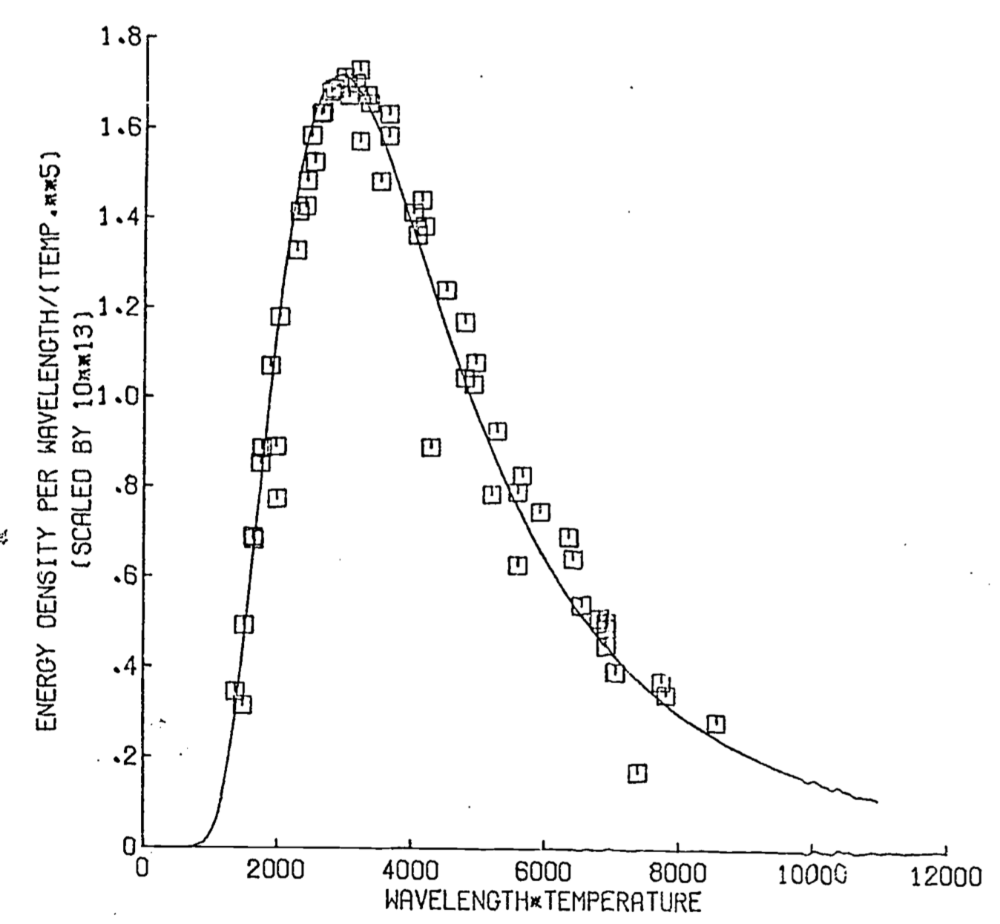
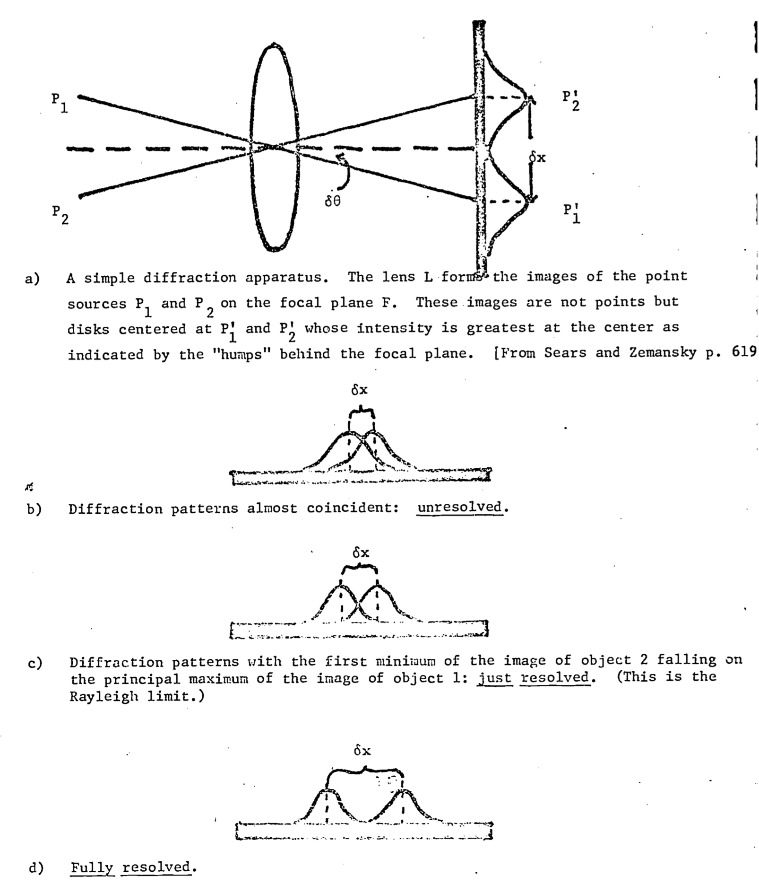
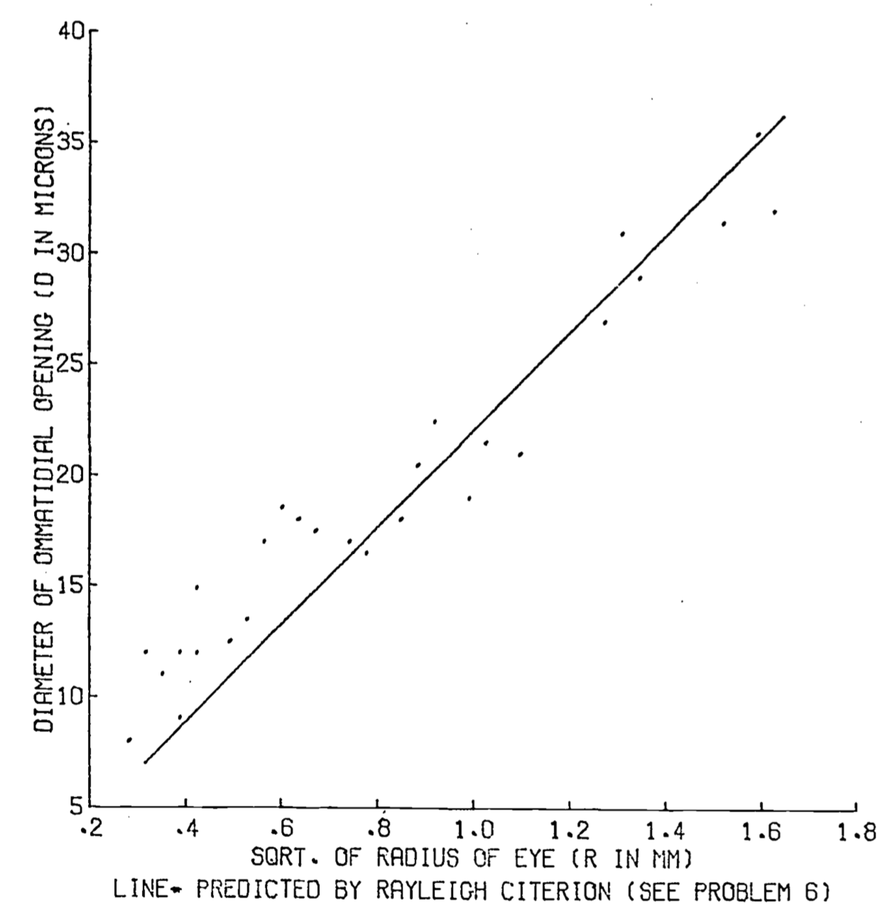
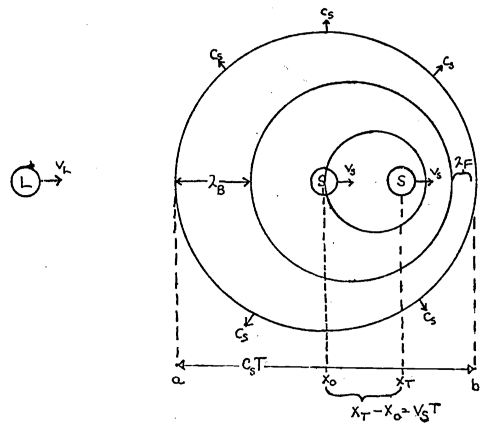

---
output:
  pdf_document: default
  html_document: default
---
# Light and Sound. {#radiation}

Light and Sound: Evolutionary Aspects. Physical Processes in Terrestrial and Aquatic Ecosystems, Transport Processes

author: Roseman, Leonard D.

***
## PREFACE

This module is concerned with the exchange of energy between an organism and its environment in the form of radiation. Classical and modern radiation theory are discussed and the applications of these physical principles to analysis of biological systems are presented. Emphasis in these applications is upon the evolutionary significance of the physical processes. In one type of application, physical theory is used to isolate constant factors in the environment to which all organisms must adjust their evolution. In a second application, physical theory is used to elucidate the constraints governing the evolution of biological systems. It is demonstrated that radiation theory is applicable to a wide range of sense organs, radiation types, wavelengths, and organisms.

## INTRODUCTION

All living organisms interact with their environment through a continuous exchange of matter and energy. Conceptually, this can be thought of as a consequence of the "openness" of the system in a thermodynamic sense. For a complete understanding of the biology of an organism, it is essential to determine the ways in which the organism interacts with the biotic and abiotic factors present in the external environment. To most biologists, the exchange of energy between an organism and its environment in the form of radiation is probably the least well understood abiotic factor affecting the organism. This exchange is also often the most difficult to measure. However, its importance to the organism cannot be overemphasized.

There are two ways in which the process of radiation exchange is of biological interest. The governing principles of this physical process are different for the two distinct biological applications.

First, there is the dynamical balance of the radiation flow between the organism and its environment, and its effect on the homeostasis of the organism. This dynamical balance is best described by the modern form of radiation theory, which is based on Planck's theory of black body radiation, and which is exemplified in the generally useful results entailed in Wien's law of shift and the Stefan-Boltzmann law. Several simple biological applications of this modern radiation theory are developed in this module. Further applications are presented elsewhere in this series (Gates 1977,1973; Hatheway 1977, Stevenson 1979).

Second, there is the interpretation of the energy sensing by the organism, as a means of obtaining information about the environment. The selective advantage that results from improved information gathering has led to the evolution of many specialized sense organs. The function of these organs is best described by the classical theory of radiation, particularly as entailed in Rayleigh's criterion and the Doppler effect. The balance of biological examples discussed here are of this second type.

The nature of the physical processes of radiation exchange imposes strong constraints on the evolution of biological systems. This module presents some of the results of classical and modern radiation theory and shows how they elucidate these physical constraints. It is demonstrated that radiation theory is applicable to a wide range of sense organs (eyes, ears, pits); radiation types (electromagnetic, sound), wavelengths (optical, infrared), and organisms.

***

## BLACK BODY RADIATION

In any discussion of radiative energy exchange, it is necessary to begin with an idealization of this process, which is described by the theory of black body radiation. This is rather awkward in the present instance since the biological implications of this abstraction from the real world are not immediately obvious. In fact, some of the most important aspects of biological systems result from their deviations from the idealizations of physics. For example, most organisms are not perfectly "black" in the physical sense of the word; that is, they do not absorb and emit radiation perfectly at all frequencies. The effect of the coloration of organisms will be to vary the degree to which the black body idealization can describe the system. However, it is the nature of science to explain in detail the simple system in the hope that the more complicated systems can be explained by small variations of the simple theory, and the expectation that the major results will be carried over to the more complicated systems. For radiative energy exchange this is precisely the case, and thus there is sufficient justification for presenting a discussion of black body radiation which, though not "simple" in the common sense of the word, is essential for an understanding of the more complicated systems which are the substance of biology.

The theory of black body radiation had a lengthy and fascinating development during the 1800's, culminating in the work of Planck at the turn of the century. Many of the results discussed below were known at various stages during this period of repeated empirical research and hypothesis testing. However, the important results for biological applications can be derived directly from the formula of Planck, which mathematically (though not physically) culminated this field of experimental physics. The physical explanation of Planck's formula awaited the work of Einstein, and ultimately the early founders of Quantum Mechanics.

Planck's problem was to specify the energy distribution of the electromagnetic radiation within a cavity, the walls of which are atthermal equilibrium at the temperature $T$. That is, the problem is to find the energy density $E(\nu)$ ($J s m^{-3}$) of the radiation within the cavity between the frequencies $\nu$ and $\nu + d\nu$. The shape of the curve $E(\nu)$ vs. $\nu$ had been determined experimentally at various temperatures [Fig. \@ref(fig:fig-radiation-1) ]. Planck found a solution to this problem in the form: 

$$E(\nu)=\frac{8\pi h \nu^3 }{c^3}[e^{h\nu/ kT}-1]^{-1}$$ 

where $\nu$ is the frequency of the radiation, $T$ is the absolute temperature of the walls of the cavity, and $h$, $k$ and $c$ are physical constants [see Appendix 1]. This energy distribution is called the black body energy distribution because it is the same as the energy distribution of radiation emitted by a perfectly black object which is at absolute temperature $T$. For measurement purposes, it is more useful to express this energy density in terms of the wavelength $\lambda$.

**Problem 1**

Show that the energy density per unit wavelength is given by:
$$E(\lambda)=\frac{8\pi hc}{\lambda^5}[e^{hc/\lambda kT}-1]^{-1}$$
Hint: $\lambda=c/\nu$

We can now plot out the energy density as a function of wavelength for different temperatures: 

```{r fig-radiation-1, echo=FALSE, fig.height=4, out.width = "50%", fig.cap='The blackbody radiation predicted from Plancks law closely aligned with that empirically observed (e.g., Lummer and Pringsheim 1901).'}

h= 6.62607*10^{-34} #Js
c= 2.99792*10^8 #m/s
k= 1.38065 * 10^{-23} #J/K

ed= function(lambda, T) (8*pi*h*c)/(lambda^5)*(exp(h*c/(lambda*k*T))-1)^{-1}

lambdas= seq(1,7,0.1) #microns
lambdas= lambdas* 10^{-6} #m
plot(lambdas, ed(lambdas, T=1646), type="l", xlab="Wavelength (1/m)", ylab= "Energy density (J/m^3/m)")
points(lambdas, ed(lambdas, T=1449), type="l")
points(lambdas, ed(lambdas, T=1259), type="l")
points(lambdas, ed(lambdas, T=1095), type="l")
points(lambdas, ed(lambdas, T=998), type="l")
points(lambdas, ed(lambdas, T=904), type="l")
points(lambdas, ed(lambdas, T=723), type="l")

```

### Wein's Law of Shift

It can be shown that the $E(\lambda)$ distribution can be described by the wavelength $\lambda_m$ at which the distribution reaches its maximum. Qualitatively increasing the temperature $T$ shifts the maximum of the $E(\lambda)[E(\nu)]$ curve to a smaller $\lambda$ (higher $\nu$). 
  
**Example 1** 

The wavelength at which the energy density is a maximum at a given temperature $T$ can be found as follows:

From problem 1:
$$E(\lambda)=\frac{8\pi hc}{\lambda^5}[e^{hc/\lambda kT}-1]^{-1}$$
Make the substitution $u=hc/\lambda kT$:
$$E(\lambda)=\frac{8\pi k^5T^5}{c^4h^4}[\frac{u^5}{e^u-1}]$$
From calculus, the maximum can be found by solving:  
$\frac{dE}{du}=0$, which gives
$$\frac{dE}{du}=\frac{8\pi k^5T^5}{c^4h^4}[(5u^4)(e^u-1)^{-1}-e^u(u^5)(e^u-1)^{-2}]=0$$
or
$$[(5u^4(e^u-1)-u^5e^u)(e^u-1)]^{-2}=0$$
which implies
$$5u^4e^u-5u^4-u^5e^u=0$$
or finally:
$$e^{-u}+1/5u-1=0$$
This transcendental equation can be solved by numerical techniques (see Appendix 2) to give:
$$u=4.9651....$$
Thus
$$\lambda_mT=\frac{hc}{uk}=2.8978\times10^{-3}mK=b$$
b is called the Wien constant and the equation
$$\lambda_m T=b$$
is called Wien's law of shift (1896 Wilhelm Wien). Therefore, the
maximum of the black body curve $E(\lambda)$ at temperatures $T_1,T_2,T_3,...$ falls at $\lambda_1,\lambda_2,\lambda_3,...$ so that
$$\lambda_1T_1=\lambda_2T_2=\lambda_3T_3=b$$

```{r fig-radiation-2, echo=FALSE, fig.height=4, out.width = "50%", fig.cap='Wiens law- observed vs. predicted'}
#Failed attempt at figure 2
h= 6.62607*10^{-34} #Js
c= 2.99792*10^8 #m/s
k= 1.38065 * 10^{-23} #J/K

ed= function(lambda, T) (8*pi*h*c)/(lambda^5)*(exp(h*c/(lambda*k*T))-1)^{-1}

## #for lambda=4^{-6} and T 
#lambda1= 4^{-6} #m
#temps=seq(273,2000, 100) #K
#plot(lambda1*temps, ed(lambda1, temps)/temps^(0.005)*10^13, type="l", xlab="Wavelength (1/m)", ylab= "Energy density (J/m^3/m)")
# points(lambdas, ed(lambdas, T=1449), type="l")
# points(lambdas, ed(lambdas, T=1259), type="l")
# points(lambdas, ed(lambdas, T=1095), type="l")
# points(lambdas, ed(lambdas, T=998), type="l")
# points(lambdas, ed(lambdas, T=904), type="l")
# points(lambdas, ed(lambdas, T=723), type="l")


```

The Wein law of shift is a very powerful result because it embodies a single relation between wavelength and absolute temperature. This is exemplified in the following problem.


**Problem 2**

Assuming the following objects radiate as black bodies, what is the $\lambda_m$ for:  

a) the sun at $T_s=5700K$  
b) a mammal with a surface temperature $T=37°C$  
c) a lizard with a surface temperature $T=10°C$  
d) the clear night sky, radiation temperature $T=-33°C$  


Answers:  

a) $5.08\times10^{-7}m=5080\mathring{A}$ (yellow)  
b) $9.66\times10^{-4}m$ (infrared)  
c) $1.024\times10^{-3}m$ (infrared)  
d) $1.21\times10^{-3}m$ (infrared)  

### Stefan-Boltzmann Law

If $E$ is the total energy density in all frequencies $(J m^{-3})$:

\begin{equation}
E=\int_0^\infty E(\nu)d\nu=\frac{8\pi h}{c^3}\int_0^\infty\frac{\nu^3d\nu}{e^{h\nu/kT}-1}
(\#eq:radiation-1)
\end{equation}

Making a change of variable,  
$$x=h\nu/kT \;\;\mbox{ which implies }\;\; dv=\frac{kT}{h}dx$$  
Equation \@ref(eq:radiation-1) becomes 

\begin{equation}
E=\frac{8\pi h}{c^3}(\frac{kT}{h})^4\int_0^\infty\frac{x^3dx}{e^x-1}
(\#eq:radiation-2)
\end{equation}

The value of the integral in Equation \@ref(eq:radiation-2)

\begin{equation}
I=\int_0^\infty\frac{x^3dx}{e^x-1}
(\#eq:radiation-3)
\end{equation}

can be obtained by numerical integration. This is a technique for approximating a definite integral by a finite sum. The value of the integral in Equation \@ref(eq:radiation-3) is found in Appendix 2 to be:

$$I=6.4983$$

Equation \@ref(eq:radiation-2) can be re-expressed as 
\begin{equation}
E=[\frac{8\pi h}{c^3}(\frac{k}{h})^4I]T^4=aT^4
(\#eq:radiation-4)
\end{equation}

where the constant $a$ is equal to the value of the constants in the square brackets in Equation \@ref(eq:radiation-4). The value of $a$ is found to be
$$a=\frac{8\pi h}{c^3}\frac{k^4}{h^4}(6.4983)=7.5643\times10^{-10}Jm^{-3}K^{-4}$$
The energy radiated by a black body per unit area per unit time, that is, the radiation emittance $E_n$, can be shown to be 
\begin{equation}
E_n=\sigma T^4
(\#eq:radiation-5)
\end{equation}
where $E_n\equiv$ radiation emmitance and
$$\sigma=(\frac{1}{4})ca=5.6693\times10^{-8}Wm^{-2}K^{-4}$$
Equation \@ref(eq:radiation-5) is called the Stefan-Boltzmann law and the constant $\sigma$ is called the Stefan-Boltzmann constant. Although Equation \@ref(eq:radiation-5) is quantitatively precise, the functional relationship of the variables is more important than the exact numerical value of the constants. Of particular interest is that the radiation emittance is proportional to the fourth power of the absolute temperature.

The equation is of direct biological interest when it is realized that the Stefan-Boltzmann law governs the radiative energy exchange between an organism and its environment. Although this exchange of energy is usually not considered when calculating the energy budget of an organism, it can in some circumstances be a major factor affecting the heat balance of an organism. The following example and problem constitute a brief introduction to the application of this physical law to biology. For a more detailed exploration of this relationship, see Gates (1978) and Hatheway (1977).

**Example 2**

A bat with a surface temperature of 37°C is living in a cave which has walls at a temperature of 12°C. What is the radiation emittance of the bat? If the bat has a total surface area of 100 cm^2^, what is its rate of heat loss by this process of radiative exchange?

Solution: Define

$T_0 \equiv$ the bat's surface temperature (in K)  
$T_a \equiv$ the ambient temperature (i.e., the temperature of the cave)(in K).  

Clearly the bat is emitting radiant energy at the rate:
$$E_0 = \sigma T_0^4$$
and receiving radiant energy (from the walls) at the rate:
$$E_a=\sigma T_a^4$$
So the overall energy exchange by this process is given by:
$$E=\sigma(T_0^4-T_a^4)$$
with the convention that $E$ is positive when the overall radiation balance is such that the bat is emitting more than it absorbs; i.e., it is losing energy to the environment at the rate $E$.

For this example:
$$T_0 = (273+37)K = 310K$$
$$T_a=(273+12)K=285K$$
which gives an energy emmitance of:
\begin{eqnarray}
E&=&5.67\times10^{-8}(Wm^{-2}K^{-4})[(300k)^4-(285K)^4] \\
&=&5.67\times10^{-8}[9.235\times10^9-6.598\times10^9]Wm^{-2} \\
&=&5.67[92.35-65.98]Wm^{-2} \\
&=&149.5Wm^{-2} \\
\end{eqnarray}
The bat's total heat loss rate $H$, by this process is
$$H=E(SA)$$
where $SA$ = surface area, so
\begin{eqnarray}
H&=&149.5Wm^{-2}(100cm^2) \\
&=&1.495W \\
\end{eqnarray}
Although in this example the heat loss rate was relatively small, when there are larger differences between the organism's temperature and the (radiation) temperature of the environment, the heat loss rate can be quite high. This situation pertains in the following problem.

**Problem 3**

a) The horns of a reindeer are at approximately internal body temperature, though the rest of the deer's body is well insulated. If these horns are at a temperature ($T_0$) of 32°C, and they have a surface
area of $1000 cm^2$, what is the heat loss rate if the environment is at a (radiation) temperature ($T_a$) of -10°C? Convert your answer to calories/minute.
[See Gates 1968 for some actual organismal temperature measurements.]

Answer: $H\approx22W$

b) A bald mountaineer is outside on a clear night. Although he is heavily bundled in his down parka, he has forgotten his hat. If his bald pate has a surface area of $75 cm^2$ and is at a temperature of 32°C, what is his heat loss rate to the night sky which is at a (radiation) temperature of -45°C? [Is this why they say, "If your feet are cold, put on your hat."?] Convert to calories/minute.

Answer: $H\approx25.3W=362 \mbox{ cal/min}$

### The solar constant
A physical parameter which imposes a significant constraint upon the evolution of terrestrial organisms is the amount of energy generated by the sun which is intercepted at the earth's surface. Almost all of the energy which drives the biological processes on the earth comes directly or indirectly from the sun. Thus the amount of the sun's energy that the earth receives is of interest for at least two reasons: (1) This is the upper limit to the amount of energy that could be absorbed by a surface and turned into heat. (2) This is the upper limit to the amount of energy that could be converted by a photosynthetic unit into chemical energy. Since the actual amount of sunlight available at the earth's surface is dependent upon absorption by the atmosphere, and thus on such variables as latitude, the sun's altitude in the sky (see Gates 1978, section on Direct Solar Radiation), or cloudiness, the measure of the sun's energy available at the earth is determined instead for a unit area just outside the earth's atmosphere. This measure of the sun's energy (actually the rate of the available energy, i.e., power) is called the **solar constant**.

The solar constant can be calculated theoretically from the Stefan-Boltzmann law and conservation of energy. Assuming the sun to be a black body with a surface temperature $T_s$, by the Stefan-Boltzmann law, its radiation emittance (energy radiated per unit area per unit time) is given by:

\begin{equation}
E_s=\sigma T_s^4
(\#eq:radiation-5)
\end{equation}

Thus the total power emitted by the sun can be found by integrating $E_s$ over the sun's surface. Since $T_s$ is (assumed to be) constant, this is equivalent to multiplying the constant $E_s$ by the surface area of a sphere with the sun's radius ($r_s$). The total power is given by:

\begin{equation}
E=4\pi r_s^2 E_s
(\#eq:radiation-6)
\end{equation}

By conservation of energy, if no energy is lost in the intervening space, all of the radiation emitted radially out from the sun will be intercepted by an (imaginary) sphere centered on the sun with a radius equal to the mean distance from the sun to the earth ($r_E$). The power flow per unit area ($E_E$) across this (imaginary) sphere will be equal to the total power available ($E$), divided by the surface area of the sphere ($4\pi r_E^2$). That is,

\begin{equation}
E_E=E/4\pi r_E^2
(\#eq:radiation-7)
\end{equation}

Substituting Equation \@ref(eq:radiation-6) in Equation \@ref(eq:radiation-7) gives

\begin{equation}
E_E=\frac{4 \pi r_s^2E_s}{4\pi r_E^2}=\frac{r_s^2}{r_E^2}E_s
(\#eq:radiation-8)
\end{equation}

The quantity $E_E$ which is the power available (per unit area per unit time) on a surface at the earth's distance from the sun, is the parameter of interest, the solar constant.
Inserting Equation \@ref(eq:radiation-5) into Equation \@ref(eq:radiation-8) gives immediately:

\begin{equation}
E_E=(\frac{r_s^2}{r_E^2})\sigma T_s^4
(\#eq:radiation-9)
\end{equation}

**Problem 4**

Use Equation \@ref(eq:radiation-9) and the following physical parameters to calculate the solar constant:

\begin{eqnarray}
T_s&=&5700K \\
r_s&=&7.1\times10^8m \\
r_E&=&1.49\times10^{11}m \\
\sigma&=&5.6693\times10^{-8}Wm^{-2}K^{-4} \\
\end{eqnarray}
Convert your answer to $cal\cdot cm^{-2}min^{-1}$.  
Answer: $E_E=1.36\times10^3 Wm^{-2}s^{-1} \approx 1.95 cal\cdot cm^{-2}min^{-1}$ 

## RESOLUTION
For most problems of biological interest (e.g., the shape of the lens of the eye), only the particulate nature of light, especially its rectilinear propagation, is important. This can be thought of as a result of the large size of the elements of biological interest compared to the wavelength of light. For example, for the sun: $\lambda_m \approx 5 \times 10^{-7}m$ [problem 2a], which is much smaller than the physical dimension of any organism, or even any organ in any organism. Only in certain specialized  biological research, for example the investigation of cell ultrastructure, does the wavelength of light become a limiting factor. As the dimensions of the cellular constituents approximate that of light, instruments capable of observing at shorter wavelengths (e.g. electron microscopes) are required.

There is at least one other area of biology where the physical dimensions of the objects of interest are small enough that the wave nature of light becomes an important consideration: the resolution of incoming radiation by sense organs. 

The term resolution is used here to denote the ability to distinguish two objects. That is, how close together must two objects be before they appear as a single object to the organism? Clearly, this depends to some extent on the organism in question; eagles resolve better than do moles. Also, the limit of resolution will be affected by the experience of the observer. Nevertheless, it is useful to have some rough comparison of the resolving ability of various systems, and for this purpose **Rayleigh's criterion** is most often employed.

Rayleigh's criterion is derived from the theory of Fresnel diffraction by a circular opening (for a derivationand detailed discussion, see Elmore & Heald 1969). Qualitatively, this criterion is seen to be a measure of the relative overlap of the diffraction patterns of the images of objects on the focal plane of the observer. More specifically, it is a measure of the displacement of the central maxima of these diffraction patterns. Two images are said to be just resolved when the central maximum of one diffraction pattern falls on the first minimum of the other (see Fig.\@ref(fig:fig-rad-3)). From Figure \@ref(fig:fig-rad-3), it can be seen that the limit of resolution is some distance $\delta x$ between the two images on the focal plane, or alternatively some angle $\delta\theta$ between the central axis of the lens and the ray connecting the center point of the lens to the centers of the principal maxima on the focal plane [$p_i^\prime$,$p_2^\prime$ of Fig.\@ref(fig:fig-rad-3)]. Therefore, in comparing the resolving power of different instruments the reciprocal of these quantities should be used (i.e., $1/\delta x$ or $1/\delta\theta$), so that the "more powerful" instrument is able to distinguish objects which are unresolved by the "less powerful" instrument. For a distant object, the objective (lens) is the aperture which creates the circular diffraction. The mathematical details of Fresnel diffraction lead to the result that the position of the first minimum relative to the principal maximum will be:

\begin{equation}
sin\alpha=0.61\lambda/r
(\#eq:radiation-11)
\end{equation}
where
$\lambda =$ the wavelength of radiation which forms the image,  
$r=$ the radius of the objective,  
$\alpha=$ the angle between the images of the objects.

The limit to resolution given by Eq. \@ref(eq:radiation-12) is known as Rayleigh's criterion. Using the familiar (Taylor) expansion of the sine function one finds that:

```{r fig-rad-3, echo=FALSE, fig.height=4, fig.fullwidth=FALSE, fig.cap='The Rayleigh criterion: Fresnel diffraction by circular aperture. '}

```

The limit to resolution given by Eq. \@ref(eq:radiation-12) is known as Rayleigh's criterion. Using the familiar (Taylor) expansion of the sine function one finds that:
$$sin\alpha=\alpha-\alpha^3+\alpha^5-\alpha^7+...$$
or 
$$sin\alpha=\alpha+0(\alpha^3)$$.  
Here $0(\alpha^3)$ means terms of order (size) strictly less than $\alpha^3$. If $\alpha$ is small, then $\alpha^3$ is very small and one can make the small angle approximation
$$sin\alpha \approx \alpha$$
which when substituted into Eq. \@ref(eq:radiation-11) yields:
\begin{equation}
\alpha=0.61\lambda/r
(\#eq:radiation-12)
\end{equation}
Rayleigh's criterion in the simple form of Eq. \@ref(eq:radiation-12) is a powerful tool in an analysis by the biologist of the evolution of sense organs. In particular, such questions as the scaling of eye size with organismal size (e.g., why are a whale's eyes the same size as those of a cow?), or the cellular organization of the organs themselves (e.g. the distribution of cones on the retina) have relatively simple answers when analyzed in this way. The ramifications of this analysis are explored in the following examples and problems.

**Example 4**

From the Rayleigh criterion, the results of problem 2a, and the fact that in bright daylight the diameter of the human pupil is $\approx$ 2.0 mm, determine the resolution of the human eye in minutes of arc. What does this resolution limit correspond to at 10 m?

Solution:  
$\lambda_m=5.08\times10^{-7}m$ (from prob. 2a)  
$r=1.0mm=1.0\times10^{-3}m$

Putting these parameters into the formula for the Rayleigh criterion,</br>
Eq. \@ref(eq:radiation-12), we get:

\begin{eqnarray}
\alpha &=&0.61\lambda/r \\
       &=&0.61(5.08\times10^{-7}m)/(1.0\times10^{-3}m) \\
       &=&3.1\times10^{-3}\text{radians}
\end{eqnarray}

Since $2\pi$ radians $=360^\circ = 2.16 \times 10^4$ min, we know that 1 radian $\approx 3.43 \times 10^3$ min.
So
\begin{eqnarray}
\alpha&=&(3.1\times10^3\mbox{ min/rad})(3.1\times10^{-3}rad) \\
&\approx&1\mbox{ min of arc}
\end{eqnarray}

At 10m this angle will correspond to an object separation of:
\begin{eqnarray}
\alpha&=&S_0/d \\
\text{where } S_0&=&\text{separation}  \\
d&=&\text{distance}
\end{eqnarray}

\begin{eqnarray}
\mbox{or  } S_0 = \alpha d &=& (3.17\times10^{-4})(10m)=3.117\times10^{-3}  \\
&=& 3.17mm
\end{eqnarray}

Thus, in daylight the human eye can just barely resolve two objects which are 3.17 mm apart from one another and 10m distant.

It should be noted at this point that the Rayleigh criterion is a theoretical limit which is rarely approached in practice. For instance, if one used this formula to calculate the separation resolvable by the human eye at 20 feet, it would be smaller than the actual minimum separation resolvable by a person with "normal" (20:20) eyesight.

**Problem 5**

The cones of the human eye happen to be maximally sensitive to the wavelength $\lambda_m$ which corresponds to the maximum of the sun's energy density spectrum. Using Rayleigh's criterion and the fact that the retina is $\approx$ 17 mm behind the first nodal point (which acts as the circular aperture in this case), compute the maximum resolution on the surface of the retina.  

Answer:
\begin{equation}
\delta x=5.4\times10^{-6}m
(\#eq:radiation-13)
\end{equation}
Anatomists have determined that the diameter of a retinal cone cell (which mediates color vision) is about $3.0 \times 10^{-6}m$. The separation between densely packed cone cells is smaller than the limit in Eq. \@ref(eq:radiation-13). Thus thinner cones will not produce higher visual acuity. The resolution is constrained by the physical parameters of the optical system. 

Since the eyes of all vertebrates are constructed from the same design, the same physical dimensions that determine the resolution of the human eye will determine resolution throughout the sub-phylum. It is the absolute, not relative, size of the physical components of the optical system which constrain resolution. If the diameters of cone cells are at present at the minimum which is biologically feasible, then a slight increase in the other dimensions of the human eye will give greater resolving power, but beyond a point $(\delta x = 3.0 \times 10^{-6}m)$, there is no payoff in visual acuity for larger eyes.

The eyes of birds of prey show structural alterations which are an evolutionary response to the need for greater resolving power. The retinal cone cells become rod-like, which decreases their diameter, increases their density on the retina and decreases their ability to discriminate color. Furthermore, the retinae from these birds have several pits or foveae. Although the density of light sensitive cells is the same in the foveae as on the rest of the retina, the image is formed on a concave rather than flat surface. Thus the "effective" cone density in the foveae is higher than for the rest of the retina, and so is the resolving power. The combination of these two changes results in increased visual acuity for these avian eyes.

Rayleigh's criterion is also useful in elucidating the constraints on the design of a quite different sort of eye, the compound eye found in insects and certain crustacea. Each eye is composed of many (up to $3 \times 10^{-4}$) simple eyes, called ommatidia (See e.g. Bjorn 1976. p. 92). The shape of the compound eye is roughly that of a half-sphere of radius $R$, with the lenses of the ommatidia comprising its surface. An estimate of the size of the openings of the ommatidia is calculated in the following problem.

**Problem 6**

A simple model of an ommatidium is that of a cone with its apex at the center of the half-sphere which forms the eye, and its opening at the surface of the eye. Assume that the angle of the cone is equal to the limiting angle of the Rayleigh formula. Show that the calculated limiting size of the opening to the ommatidia is given as:
$$d=(1.22R\lambda)^{1/2}$$
If $\lambda$ = 400 nm, which is the center of the spectrum to which a bee is sensitive, and $R$ is about 1 mm, what is the optimal size of the ommatidial opening?  
Answer:  
$$d=2.2\times10^{-5}m=22\mu$$

The actual mean measured opening for a bee is $20.9\mu$ (Barlow 1952, p. 671). A diagram comparing the observed size of the ommatidia to the value predicted by theory is presented in Fig. \@ref(fig:fig-rad-4). Rayleigh's criterion for the limit of resolution of an optical instrument can be extended to interferometers as well. Basically, an interferometer consists of two detectors with the ability to detect phase information separated by a distance $D$. When the phase information from the two detectors is compared,the resolution of the total system is the same as that of a single detector whose diameter is equal to $D$. Although a rigorous argument demonstrating this result would not be appropriate here (it is essentially the save as the derivation of Rayleigh's criterion), a qualitative argument may be useful. Basically, the (diffraction patterns illustrated in Fig. \@ref(fig:fig-rad-3) are the result of the interference between light waves of different phases, caused by passage of the light through the aperture. The eye sees the interference caused by phase differences as variations in intensity, as illustrated in Fig. \@ref(fig:fig-rad-3) b, c, d. to an interferometer the signals of the two detectors are compared to reveal phase differences and so the identical resolution criterion applies. 

Most vertebrates are able to detect phase differences between ears, so that the interferometer is the correct model for calculating resolution. A consideration of Rayleigh's criterion shows that if all other parameters remain constant, the greater the separation of the detectors, the greater the resolving power of the system. Many organisms have optimized their ability to locate sound sources by maintaining a maximal separation between the ears. Another biological application of interferometers is illustrated in the following problem. 

```{r fig-rad-4, echo=FALSE, fig.height=4, fig.fullwidth=FALSE, fig.cap='Insect eye - ommatidial diameter vs. the squareroot of eye radii. Points are 27 observations on hymenoptera (Barlow 1952).'}

```

**Problem 7**

Using the Rayleigh criterion and the solution to Prob. 2b, determine the resolution of the infrared sensing system of a pit viper. Using reasonable physical parameters (e.g. body size of prey, how close the snake must be to strike, how accurate the strike has to be), determine the minimum separation of the pits. Does this agree with your intuition and/or experience?  

Answer: $d$ = separation of pits $\approx$ 6cm.

## THE DOPPLER EFFECT
The discussion up to this point has implicitly assumed that the source and detector of radiation are stationary relative to one another. When the source and detector are in relative motion, an added complication, the Doppler effect, is introduced. This phenomenon has been observed for all types of radiation, though the theory is simplest for the acoustic situation. Since acoustic waves are longitudinal (compression) rather than transverse as are electromagnetic waves, the mathematical form of the effect is slightly different. Additionally, the acoustic Doppler effect has significant evolutionary implications.

Empirically, the Doppler effect is manifested in the difference between the pitch (frequency) of the sound heard by a listener in motion relative to a sound source and the pitch heard when the listener and source are relatively stationary. A familiar example is the sudden drop in pitch one hears from an automobile horn as one meets and passes a car going in the opposite direction. Alternatively, one might think of the changing pitch heard by a listener standing beside a track as a train whistle approaches, passes, and recedes.

The derivation presented below is for the Doppler effect as it applies to the special case when the motion of the source and listener lies along the line joining the two. The biological example considered later is of precisely this type.

Let $V_L$ and $V_S$ denote the velocities of the listener and source respectively. The positive direction for the velocities is taken to be from the position of the observer to the position of the source. 

```{r fig-rad-5, echo=FALSE, fig.height=4, fig.fullwidth=FALSE, fig.cap='The source $S$, moving with velocity $V_S$ is emiting sound at a constant frequency, $f_S$. The wave fronts of this sound, which travel radially outward at velocity $C_S$, are compressed together (wavelength equals $\\lambda_F$) in front of the source and spread out (wavelength equals $\\lambda_B$) behind the source. By the time the wavefront emitted by the source at $x_0$ at time t = 0 has reached a radius of $C_ST$, the source has moved to a position $x_T$. The listner $L$ moving with velocity $V_L$ will hear the sound at a different frequency than as actually emitted by the source because it encounters wave fronts which are $\\lambda_B$ apart. An exact derivation is given in the text. [Adapted from Young 2013 p. 534.]'}

```

An illustration of the situation when the listener $L$ and the source $S$ are moving away from each other is presented in Fig. \@ref(fig:fig-rad-5). At time $t = 0$, the source is at point $X_T$. The outermost circle is the representation of the position of the wave front at time $t = T$, caused by a disturbance at the source at time $t = 0$. The speed of propagation $C_S$ of a wave in a nondispersive medium such as air is dependent only upon the characteristics of the supporting medium and is independent of the motion of the source relative to the medium. Thus the outermost circle in Fig. \@ref(fig:fig-rad-5) represents a sphere in 3 dimensions with center at $x_0$ and radius $C_ST$.

The source has moved a distance $V_ST$ in the time $T$ so that
$$x_0-x_T=V_ST$$
and the following equalities are true:
$$a-x_T=(C_S+V_S)T$$
$$x_T-b=(C_S-V_S)T$$
where $a$ and $b$ are respectively the positions at the rear and front of the outermost wave surface.
In the time interval between $t = 0$ and $t = T$, the source has emitted a certain number of waves, $f_ST$, where $f_S$ is the frequency of the sound emitted at the source. The waves are spread out into the distance $(x_T - b)$ in front of the source.
$$\lambda_f=\frac{x_T-b}{f_ST}=\frac{(C_S-V_S)T}{f_ST}=(C_S-V_S)/f_S$$
Similarly behind the source the wavelength $\lambda_B$ is
$$\lambda_B=\frac{a-x_T}{f_ST}=\frac{(C_S+V_S)T}{f_ST}=(C_S+V_S)/f_S$$
The waves approaching the listener have a relative speed of $C_S + V_L$, so the detected frequency is
$$f_L=(C_S+V_L)/\lambda_B=\frac{C_S+V_L}{(C_S+V_S)/f_S}$$
or
\begin{equation}
f_L=\frac{C_S+V_L}{C_S+V_S}f_S
(\#eq:radiation-14)
\end{equation}
When the source and listener are moving toward each other a frequency
$$f_L=\frac{C_S+V_L}{\lambda_f}=\frac{C_S+V_L}{(C_S-V_S)/f_S}$$
or
\begin{equation}
f_L=\frac{C_S+V_S}{C_S-V_S}f_S
(\#eq:radiation-14a)
\end{equation}
is detected.

In order to help remember the direction convention established in this derivation, it is useful to notice that the frequency heard by the listener will be less than that emitted by the source if they are moving away from each other, and will be greater than that emitted by the source if they are moving toward each other.

**Example 5**

The velocity of sound in still dry air is $C_S = 350 ms^{-1}$. For a source emitting sound of frequency $f_S = 700 Hz$ the wavelength of the sound emitted is
$$\lambda=C_S/\lambda_S=0.5m$$
a) What are the wavelengths of the sound in front of and behind this source moving at $V_S = 50 ms^{-1}$?  
b) If a listener is at rest and this source is moving away at $V_S = 50 ms^{-1}$, what is the frequency of the sound heard?  

Solution:  
\begin{eqnarray}
\mbox{a) } \lambda_F&=&(C_S-V_S)/f_S=0.429m \\
\lambda_B&=&(C_S+V_S)/f_S=0.571m \\
\\
\mbox{b) } f_L&=&\frac{C_S}{C_S+V_S}=612Hz
\end{eqnarray}

Now that a quantitative formulation of the Doppler effect has been derived, it can be applied in the explanation of echolocation in bats, a sensory system which has only begun to be understood in the past several decades. 

The bats, members of the order Chiroptera within the class Mammalia, have developed a system of echolocation which has been of immense evolutionary significance. It has enabled them to exploit a resource for which there are very few competitors, small night flying insects (see, e.g., Fenton 1974). The physical processes important in echolocation have both enhanced and constrained the evolution of the Chiroptera. Here it will suffice to show a few examples of the effect of these physical processes upon bat evolution and natural history. For a detailed and personable account of the actual experimentation that led to the elucidation of the physical principles employed in echolocation, see Griffin's "Listening in the Dark" (Griffin 1958).

Almost all bats appear to be able to navigate in total darkness a closely spaced grid of wires, where the spacings of the wires are commensurate with the dimensions of the wingspread of the bats. Furthermore, insectivorous bats can pursue and capture flying insects on the wing in total darkness.

The ability to carry out these activities is significant in two respects. First, unlike the birds which are able to perform similar activities only in the presence of light, bats cannot be dependent upon a highly developed sense of sight for navigation. Second, no other animal can depend upon catching flying insects in the dark and so there are few competitors for this food resource. Prior to the evolution of bats, this resource had not been exploited.

The experiments of Griffin demonstrate that bats share another ability that sets them apart from most other animals. This is the ability to produce and detect sound of frequencies between 20-100 kHz, It is this attribute which is fundamental to the system of echolocation, as in the next example.

**Example 6**

A flying bat emits a pulse of sound. What is the minimum frequency and maximum length of a single frequency pulse, if the bat wants to use the echo of the pulse to avoid an obstacle 1 meter ahead? 

Solution: One first solves for the maximum pulse length. Clearly the chief consideration is that the bat must not be producing the pulse when the echo returns. Otherwise the fainter echo might be masked by the bat's own cry. The time of the echo's return $t$ is dependent only on the speed of sound $C_S$ and the distance of the object $d$. Specifically:
$$t=d/C_S$$
which works out to be:
$$t=2m/350m\:s^{-1}=5.71\times10^{-3}s=5.71ms$$
Shorter pulses will allow even closer objects to be avoided, although the pulse length must have a lower limit of several wavelengths in order to avoid problems in interpretation. If a reasonable number of waves, in the pulse is 100, the predicted minimum frequency would be:
$$f=100/t=100/4\times10^3s^{-1}=25kHz$$
In actual field measurements Griffin (1953 p.191) has observed pulse lengths from 1-15 ms, and pulse frequencies between 30-75 kHz with about 50 kHz being most common. Therefore, bats should be several times better at avoiding obstacles than one would expect from Example 6. This is not too surprising if the system is good enough to catch insects on the wing, which the bats must approach much closer than 1 meter.

Interestingly, bats appear to be rather economical in their use of pulses, using relatively long pulses (15 ms) at long repetition intervals when they are cruising far above the ground and relatively short pulses (1 ms) at short repetition intervals only when they are pursuing insect prey.

Many other characteristics of the bat echolocation system can be explained by an extension of the kinds of arguments given here. For example, theoretically one expects that the intensity of the returning echo from an object at a certain distance, should decrease with the size of the object. The echolocation system provides information about the size of objects in the environment from the intensity of the returning echo, and information about the distance of objects from the time delay between the emission of the pulse and the reception of the echo. However, the character of the echo should theoretically be relatively insensitive to the detailed nature of the object causing the echo, which perhaps explains the interest exhibited by bats in pebbles tossed in the air by small boys and naturalists.

In certain bats, for example those of the genus *Rhinolophus*, the Doppler effect appears to be the physical phenomena which is the key to an understanding of their system of echolocation (Schuller, et al. 1974). Several of the important considerations involved in the application of the Doppler effect to bats are developed in the following problem.

**Problem 8**

A bat is flying along at $5 ms^{-1}$. It emits a 50 kHz sound pulse which is reflected by an insect which is 5 meters distant and is moving away at $1 ms^{-1}$. What is the frequency of the echo, and how long after the pulse begins does the echo begin to return?

Answer: 

\begin{eqnarray}
f_L&=&51.74 kHz \\
t&=&28.6 ms
\end{eqnarray}

The outgoing and incoming frequencies in this example have a difference of 1740 Hz. This difference may appear quite large when compared to the difference between Concert A (440 Hz) and the A an octave higher (830 Hz). However, in the detection of radiation phenomena, the important comparison is the ratio, not the difference of two frequencies. The bat in Problem 8 must be able to detect 1740 Hz in 50 kHz, a percentage frequency change of 3.4%. This is not an unreasonable change to detect since human musicians can quite commonly distinguish quarter tones which represent a percentage frequency change of 3%. One expects that bats which depend upon the Doppler effect should have very acute pitch change detection and a very stable emission frequency, to go along with the ability to discriminate very small time intervals. Some of these predictions have been experimentally verified (Schuller, et al. 1974).

The thrust of the discussion presented in this section is perhaps most striking when viewed in terms of the advantages and constraints that the utilization of echolocation has conferred on the evolution of the Chiroptera. The development of echolocation has allowed the bat to utilize a previously unexploited. resource, night flying insects, but in turn has placed a premium on those bats that are able to emit high frequencies in short pulses, that cat detect faint echoes, and that can detect relatively small shifts in frequency between outgoing and incoming pulses. The selection pressure for these attributes is the force responsible for numerous remarkable physical and behavioral adaptations. Our understanding of this system is by no means complete; echolocation remains a fertile territory for experiment and theory.

## SUMMARY
The preceding discussion has presented some of the results from classical and modern radiation theory and demonstrated how these physical principles can be applied to the analysis of biological systems. The emphasis in these applications has been upon the evolutionary significance of the physical processes. In the biological applications presented, the physical processes are involved in the following two types of explanations. In the first type of explanation, physical theory is used to isolate constant factors in the environment to which all organisms must adjust their evolution. In a second application, physical theory is used to elucidate the constraints governing the evolution of biological systems. It is demonstrated that radiation theory is applicable to a wide range of sense organs, radiation types, wavelengths, and organisms.

## LITERATURE CITED

```
Can't find Gates 1973, Gates 1978, Hathaway 1977
```

Barlow, H.B., 1952. The size of ommatidia in apposition eyes. Journal of experimental Biology, 29(4), pp.667-674.

Bjorn LO. 1976. Light and Life. London: Hodder and Stoughton

Elmore, W.C. and Heald, M.A., 1985. Physics of waves. Courier Corporation.

Fenton, M. B. 1974. The role of echolocation in the evolution of bats. Am. Nat. 108: 386-388.
 
Gates, D. M. 1977. Transpiration and leaf temperature. An instructional module: Physical processes in terrestrial and aquatic ecosystems. Ctr. Quantitative Sci., Univ. Washington, Seattle.

Griffin, D.R., 1953. Acoustic orientation in the oil bird, Steatornis. Proceedings of the National Academy of Sciences of the United States of America, 39(8), p.884.

Griffin D. R. 1958. Listening in the Dark. New Haven (CT): Yale University Press. Reprinted 1986, Ithaca (NY): Cornell University Press

Lummer, O. and Pringsheim, E. 1901. Kritisches zur schwarzen Stahlung. Annalen der Physik. 311. 192-210. 

Schuller, G., Beuter, K. and Schnitzler, H.U., 1974. Response to frequency shifted artificial echoes in the batRhinolophus ferrumequinum. Journal of comparative physiology, 89(3), pp.275-286.

Stevenson, R. D, and Seattle. Center for Quantitative Science in Forestry, Fisheries Wildlife Washington Univ. 1979. The First Law of Thermodynamics for Ecosystems. Physical Processes in Terrestrial and Aquatic Ecosystems, Thermodynamics.

Weeg, G.P.and Reed, G.B. 1966. Introduction to Numerical Analysis. Blaisdell Publishing Co., Waltham, Masachusets. 184p.

Young, H.D. et al., 2013. Sears and Zemansky's university physics : with modern physics 13th edition, Technology update., Boston: Pearson.