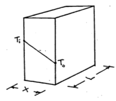

---
output:
  pdf_document: default
  html_document: default
---
# The Climate Space Concept {#climatespace}

The Climate Space Concept: Analysis of the Steady State Heat Energy Budget of Animals.

author: Stevenson, R. D., R code and example by Kearney, M. R.

## PREFACE
Several modules in the thermodynamic series considered the application of the First Law to biological systems and the heat transfer processes that govern the energy balance of organisms. This module discusses a model for which the animal's temperature is not changing with time. The concept 'climate space' is used as a means for quantifying the limits of an animal's thermal environment. These limits are discussed in detail and methods for calculating these limits are described. A problem set is used to check the assumptions of the climate space model as well as to extend it. A background in heat transfer processes is recommended.

## INTRODUCTION

In earlier modules of the thermodynamics series, we considered the application of the First Law to biological systems (Stevenson 1977a and b) and the heat transfer processes which govern the energy balance of organisms (Stevenson 1978). The general heat budget equation for animals is 
\begin{equation}
\Delta U = M + Q_a - Q_e - LE - C - G
(\#eq:climatespace-1)
\end{equation}
where ^[In some of the biological literature the units of Equation \@ref(eq:climatespace-1) are cal cm^-2^ min^-1^, but we have adopted the mks system here.]
<div class="nobullet">
* $\Delta U$ = change in internal energy ($W m^{-2}$),
* $M$ = metabolism ($W m^{-2}$ ),
* $Q_a$ = radiation absorbed ($W m^{-2}$), 
* $Q_e$ = radiation emitted ($W m^{-2}$), 
* $LE$= water vapor losses ($W m^{-2}$), 
* $C$ = convection flux ($W m^{-2}$), 
* $G$ = conduction flux ($W m^{-2}$).
</div>

Equation \@ref(eq:climatespace-1) is a complicated expression with many independent variables. Because biologists are interested in how animals modify their heat balance and why any particular behavior or physical characteristic of an animal influences this balance, they must find ways of analyzing the heat energy balance equation.

In this module we will discuss a model for which the animal's temperature is not changing with time, that is the steady state assumption that $\Delta U = 0$. Porter and Gates (1969) presented the "climate space diagram" to visually display the range of environmental conditions an organism could survive. Subsequently, Monteith (1973) proposed another graphical method to represent the energy balance which we will consider briefly. The works of Hatheway (1978) and Porter et al. (1973) offer alternative methods for understanding an animal's relationship to the physical environment.

## THE THERMAL ENVIRONMENT: BASIS FOR THE CLIMATE SPACE

To describe the physical heat energy limits that an organism can tolerate, Porter and Gates (1969) began by examining the abiotic components of the environment. Four climatic factors -- radiation, air temperature, wind speed and humidity -- were recognized as affecting an animal's thermal balance. The authors decided that evaporative losses would be small for many organisms and could be included as maximum and minimum rates without making the losses a function of the humidity.

Tracy (1976) has, however, shown that when investigating the thermal and mass balance of wet-skinned animals such as slugs, frogs and salamanders, the water vapor concentration of the soil and the air must be known to accurately quantify these exchanges. The climate space concept has generally not been extended to include the environmental variable of water vapor concentration. Likewise, the formulation of Porter and Gates (1969) does not consider the effects of wind direction. Nor is surface temperature of the ground explicitly indicated (but see Equation \@ref(eq:climatespace-3) and Appendix I for calculation of $Q_a$). Radiation, air temperature and wind speed, though, which are the physical factors included in the climate space concept, are the most important abiotic variables for the thermal heat balance of most terrestrial animals.

### Absorbed radiation

The most complex of the factors Porter and Gates (1969) considered is the absorbed radiation because it is composed of several shortwave and longwave components. In general, $Q_a$ is the product of surface absorptivity, the surface area exposed to a particular source of radiation, and the intensity of that source. This can be written:
\begin{equation}
Q_a = \bar{a}_1 A_1 S + \bar{a}_2 A_2 s + \bar{a}_3 A_3 r (S + s) + \bar{a}_4 A_4 R_g + \bar{a}_5 A_5 R_a
(\#eq:climatespace-2)
\end{equation}

where
<div class="nobullet">
* $S$ is the radiation from direct sunlight ($W m^{-2}$),
* $s$ is the radiation from scattered sunlight ($W m^{-2}$),
* $R_g$ is infrared thermal radiation from the ground ($W m^{-2}$),
* $R_a$ is infrared thermal radiation from the atmosphere ($W m^{-2}$),
* $r$ is the reflectivity of the ground. 
</div>

Since we wish to consider the average flux per unit surface area, the $A_i$'s are the proportions of the total surface area exposed to each kind of radiation. The $a_i$s are the mean absorptivities to each kind of radiation. Roseman (197, module 8) discusses absorption, reflection and transmission. In their original paper, Porter and Gates assumed that their animal was a cylinder. Equation \@ref(eq:climatespace-2) can then be rewritten as:
\begin{equation}
Q_a = \frac{1}{\pi} \bar{a} S + 0.5 [\bar{a}s + \bar{a}r(s+S) + R_g + R_a]
(\#eq:climatespace-3)
\end{equation}

Here it is assumed that: 1) $A_1 = 1/\pi$; 2) scattered sunlight, reflected sunlight, reflected scattered sunlight, ground radiation, and atmospheric radiation strike half the animal (see Siegel and Howell 1972 for calculation of shape factors); 3) the mean absorptivities of the sunlight, scattered sunlight and reflected light are equal to $\bar{a}$; and 4) that the mean absorptivities of the infrared sources are 1.0.

### Environmental Constraints

The climate space concept derives from the fact that there is a relation between the average incident radiation and the air temperature independent of the organism. It is generally true that warmer air temperatures occur with high radiation levels, i.e., summer or tropical conditions. Likewise colder air temperatures are usually correlated with lower radiation loadings. (Exceptions to this generalization are the high radiation levels in the mountainous regions of lower and middle latitudes during the summer when air temperatures can be low (Porter and Gates 1969).) Thus, we expect a positive correlation between the air temperature $T_a$ and the absorbed radiation $Q_a$ that the organism is exposed to in any given habitat. Initially, Porter and Gates considered a blackbody environment such as a cave or sheltered spot in thick vegetation. The relation between absorbed radiation and air temperature is given by the Stefan-Boltzmann Law and is plotted as the centerline in Figure \@ref(fig:fig-climatespace-1). Next they asked what is the relationship between these two variables when an animal is exposed to a clear sky at night. Under these conditions an object will be receiving energy from the atmosphere which is at a lower temperature than the surrounding air. 

Gates (1978), using an empirical relationship from Swinbank (1963) for sky radiation, shows that the total radiation absorbed by the organism is 
\begin{equation}
Q_a = \frac{\bar{a}_L (R_g + R_a)}{2} = \frac{\bar{a}_L \sigma [T_g + 273]^4 + 1.22 \bar{a}_L \sigma [T_a + 273]^4 - 171 }{2}
(\#eq:climatespace-4)
\end{equation}

where
<div class="nobullet">
* $\bar{a}_L$ =  mean absorptivity to longwave radiation,
* $\sigma$ = Stefan-Boltzmann's constant 5.67x10^-8^ ($W m^{-2} K^{-4}$),
* $T_g$ = ground temperature ($^{\circ}C$),
* $T_a$ = air temperature ($^{\circ}C$),
</div>

and the other symbols are as in Equation \@ref(eq:climatespace-2). Gates has assumed that the $A_i$s are one-half in each case (Siegel and Howell 1972 show how this can be derived). As before, we will let $\bar{a}_L = 1.0$. It is also convenient to approximate the ground temperature with the air temperature. In the early evening $T_g > T_a$, but several hours before sunrise the reverse is true. Equation \@ref(eq:climatespace-4) with the aforementioned assumptions is the leftmost line plotted in Figure \@ref(fig:fig-climatespace-1). This means that if an animal were out foraging under a clear sky at night at an air temperature  of $20^{\circ}C$, it would receive $50 W m^{-2}$ less than if it were resting in a burrow.

Finally, we consider the condition when an organism is exposed to full sunlight with an absorptivity to shortwave radiation of 0.8. In this case, the radiation as a function of air temperature is given by the line to the right of the blackbody line. This line is "fuzzy" to remind us that this relationship is less well-defined than the other curves. The assumptions and calculations necessary to plot this line are discussed in Appendix I. If we now consider the difference between a blackbody and a full sunlight habitat, both at $20^{\circ}C$ air temperature, we see that the latter would receive $300 W m^{-2}$ more radiation.

The importance of Figure \@ref(fig:fig-climatespace-1) is that we have established a region bounded by the clear sky, plus ground radiation line and the 0.8 absorptivity line that limits the combinations of $Q_a$ and $T_a$ found in the natural environment. This region can be divided into areas: one between the clear sky at night and blackbody line which governs the range of all nighttime conditions ($S$ and $s$ of Equation \@ref(eq:climatespace-2) are zero), and a second area enclosed by the blackbody and the 0.8 absorptivity lines which gives the range of most daytime conditions. The average radiation intensity can be less than blackbody levels during the day when clouds prevent the surface from receiving shortwave radiation. To see this we need to compute the absorbed radiation in the open, $Q_{a0}$, and compare it to that absorbed in a blackbody cavity, $Q_{ac}$. If solar radiation is zero ($S = s = 0$) then Equation \@ref(eq:climatespace-3) reduces to $Q_{a0} = \frac{(R_a + R_g)}{2}$. We assume that the surface temperature is equal to the air temperature and the temperature at the base of the clouds is less than air temperature so $R_a < R_g$ and $Q_{a0} < Q_{ac}$. In this case, the higher the clouds the cooler the radiating surface of their bases. This radiation, however, will always be greater than the radiation from a clear sky at night.

```{r fig-climatespace-1, echo=FALSE, fig.height=4, fig.show = "hold", out.width = "75%", fig.align = "default", fig.cap='Relationship between the total amount of radiation flux incident on an object as a function of the air temperature. At night the object receives thermal radiation from the ground and atmosphere. In the daytime the object receives direct, reflected and scattered sunlight, in addition to the thermal radiation from the ground and atmosphere. The absorptivity to sunlight is 0.8. The right-hand boundary line is fuzzy to remind us that it is an average value. From Porter, W. P. and D. M. Gates. 1969. p. 234.'}

```


```{r fig-climatespace-2, echo=FALSE, fig.height=4, fig.show = "hold", out.width = "70%", fig.align = "default", fig.cap='Daily variation in the radiant environment in different microhabitats under different general weather conditions. The upper portion of the figure describes daily fluctuations of air temperature ($T_a$) and temperature of the surface of the substrate ($T_g$). From Morhardt, S. S. and D. M. Gates. 1974. P. 20.'}

```

```{r fig-climatespace-3, echo=FALSE, fig.height=4, fig.show = "hold", out.width = "75%", fig.align = "default", fig.cap='Climate diagram for the habitat. Data on these diagrams indicate the total amount of radiation that is absorbed by a geometrical model of a ground squirrel under conditons of air temperature and radiationshown in Figure 9.2. The model is oriented in two ways with respect to direct solar radiation to show how absorbed radiation differs at the same air temperature and thesame time of day with differences in orientation toward the sun. The amount of radiation absorbed is greatest ($Q_{abs-maximum}$) when the long axis of the model is normal to the direction of the sun and least ($Q_{abs-minimum}$) when the hemispherical end of the model is toward the sun. All other orientations would be intermediate between these extremes. Data points are taken directly from Figure 9.2 at hourly or half-hourly intervals and are identified at selected points by showing the hour of the day in solar time adjacent to the points.  The line for sunlight 74% absorbed represents the maximum amount of radiation that could be absorbed by the model in direct sunlight at any air temperature. The blackbody curve-indicates the intensity of radiation from a blackbody at any air temperature, and the curve labeled \"night time average of clear sky plus ground\" indicates the minimum energy likely to be absorbed by the model when exposed to a night. sky radiating at a temperature which is cooler than the air. From Morhardt, S. S. and D. M. Gates. 1974. P. 25.'}


```

Morhardt and Gates (1974) have considered the temporal variation of $Q_a$ and $T_a$ more carefully. They measured $T_g$, $T_a$, $R_p$ ($= S + s$ on a horizontal surface), $R_g$ and $R_a$ hourly for a summer's day in the Colorado mountains shown as in Figure \@ref(fig:fig-climatespace-2).  These values were used to calculate $Q_a$ for the Belding ground squirrel (*Citellus beldingi beldingi*) from an equation similar to Equation \@ref(eq:climatespace-3). In Figure \@ref(fig:fig-climatespace-3), pairs of $Q_a$ and $T_a$ are plotted as a function of time. Morhardt and Gates made similar calculations for several different microhabitats. Although there were no startling conclusions about how the animal was being influenced by thermal environment, we will consider their study further in the exercises. The next,step in constructing the climate space diagram is to see how the animal is influenced by radiation, air temperature, and wind speed.

## PHYSIOLOGICAL CONTRAINTS OF THE ORGANISM

We expect two kinds of limits under steady state assumptions: one area where the environmental conditions make the organism too hot and conversely another area where it would be too cold. Furthermore, we expect an inverse relationship between air temperature and absorbed radiation because the organism must maintain an energy balance. The reader should pause here to make sure that these ideas are intuitive, as shown graphically in Figure \@ref(fig:fig-climatespace-4). Common experience suggests that increasing the air temperature will make the environment hotter, but increasing the absorbed radiation is not as obvious. Most of us, however, are familiar with the midday heat stress common in many areas on a clear summer day. Later in the afternoon when the sun is lower in the sky $Q_a$ will be reduced. Air temperature will also be dropping so that the transition that has occurred can be represented by the arrow labeled 2 in Figure \@ref(fig:fig-climatespace-4). In the wintertime or early morning the reverse is true; the sun will often feel good because it provides the extra energy to move you into the acceptable region as shown with the first arrow. The exact slope and position of these limits will depend on other environmental conditions such as wind speed and characteristics of the organism such as size and insulation. One can think of the limits as the combination of physiological factors that will allow the organism to exist in that environment. For the lower limit of the energy budget calculation of an endotherm we would assume a high metabolic rate and thick insulation.

If we superimpose Figure \@ref(fig:fig-climatespace-4) on Figure \@ref(fig:fig-climatespace-1), the intersection or shaded region of Figure \@ref(fig:fig-climatespace-5) is the **climate space** of the organism. It should be clear to the reader that the northwest and southeast boundaries are the results of environmental constraints while the northeast and southwest limits are the result of the organism's need for homeostasis. The physiological limits can be calculated explicitly using the First Law of Thermodynamics. This is the task of the next section.

```{r fig-climatespace-4, echo=FALSE, fig.height=4, fig.show = "hold", out.width = "75%", fig.align = "default", fig.cap='In Region I the animal is too cold. In Region II the animal can maintain thermal equilibrium. In Region III the animal will become overheated. Arrow 1 indicates the change in environmental conditions that takes place early in the morning. The added warmth of the sun makes the environment more \'comfortable\'. Arrow 2 refers to the change in $Q_a$ and $T_a$ in the mid-afternoon on a clear summer day.'}

```

```{r fig-climatespace-5, echo=FALSE, fig.height=4, fig.show = "hold", out.width = "75%", fig.align = "default", fig.cap='If we superimpose Figure 1 on Figure 4 the result is the crossin the diagram called the climate space of the organism. The northwest ($E_1$) hatched region and southeast ($E_2$) boundaries are due to the physical environment. The shouthwest ($P_1$) and northeast ($P_2$) boundaries are due to the physiology of the organism.'}

```

We will make a climate space diagram for the survivable body temperature limits of two arid-adapted species, a lizard, the Desert Iguana *Dipsosaurus dorsalis* and a bird, the *Zebra Finch Taeniopygia guttata*. 

We will use a slightly different version of the calculations above to plot the environmental constraints in R.

### Defining a function for computing the bounding air temperature/radiation combinations

The first thing we will do is define a function that computes the bounding combinations of air temperature and radiation that a cylindrical object would absorb on earth. These are to be found in Figure 12 of Porter and Gates (1969). As above, the idea is to provide a range of air temperatures and compute an associated range of radiation levels for three different types of environmental scenarios - 1) the blackbody environment, as approximated in a cave, very deep shade or a room, 2) outdoors at night under a clear sky, and 3) outdoors in full sun.

For the first, blackbody scenario, we just use the standard equation for infrared radiation emitted by an object at air temperature (in Kelvin), assuming an emissivity of one, i.e. 

$$Q_{blackbody} = \sigma T_{air}^4$$

For the second scenario of a clear sky at night, we need to compute the radiation coming down from the sky and the radiation coming up from the ground, and assume half the object is exposed to each of these radiant sources. To compute the sky radiation, we can use Swinbank's (1963) relationship which is formulated in SI units in Gates (1980), equation 7.1, as

$$Q_{sky} = 1.22 \sigma T_{air}^4 - 171$$

where, again, $T_{air}$ is in Kelvin. If we assume that ground temperature is equal to air temperature, as Porter and Gates (1969) did, we simply take the average of the sky and blackbody radiation values and that then becomes the night sky radiation for a given air temperature. Note, however, that the clear sky night sky radiation in Porter and Gates (1969) is not what you would predict from the Swinbank formulation and appears to be erroneous - it seems like they subtracted 20 °C from the air temperature when computing the radiation emitted by the ground. 

The third and most involved computation is the radiation environment outdoors in full sun, which combines the longwave radiation plus the direct and diffuse solar radiation from above, $_hS$ and $_hD$, and the reflected radiation from the ground $_hG$. The longwave radiation component we obtain as above. To get a rough approximation of the direct solar radiation we first take the solar constant $\overline S_o$, which is the average radiation flux hitting a horizontal plane on the outer edge of the earth's atmosphere over a year, and multiply it by a correction factor accounting for the distance between the earth and sun at the time of year of interest $(\overline d / d)^2$ where $\overline d$ is the average distance between the earth and the sun and $d$ is the actual distance. This gives us the extra-terrestrial radiation $S_o$. Then we need to account for the attenuation due to the depth of atmosphere the beams of sunlight are travelling through before hitting the ground, which depends in part on the angle of the sun $z$ (in radians). For example, at sunrise the rays are passing through more atmosphere than at midday. To compute this we need the optical air mass $m  = sec(z) = 1/cos(z)$ and the transmittance of the atmosphere $\tau$ (around 0.6), which can then be used in equation 6.36 from Gates (1980)

$$_hS = S_o \tau ^ m \cos(z)$$

We can then obtain an estimate of the diffuse radiation, i.e. the sunlight scattered by the atmosphere, using equation 6.36 of Gates (1980) 

$$_hD = S_o (0.271 - 0.294 \tau ^ m) \cos(z)$$

Finally, if we know the solar absorptivity of the ground $\alpha_g$ we can multiply the amount of direct and diffuse solar radiation hitting the ground by $1-\alpha_g$, i.e. by the solar reflectance of the ground, to get the solar radiation reflected up at the object from the ground

$$_hG = (1-\alpha_g) (_hS + _hD)$$

Since we can assume that the object receives half of all of these fluxes, the total radiation experienced during the day can be computed as

$$Q_{day} = \frac{\alpha_s {_{h}S} (2 / \pi) + \alpha_s {_{h}DS} + \alpha _s (1- \alpha_g) {_{h}G} + Q_{sky} + Q_{ground}}{2}$$

which is equivalent to equation 13 of Porter and Gates (1969). Note that by multiplying the direct solar component ${_{h}S}$ by $2/ \pi$ we are accounting for the silhouette area of a cylinder being less than the total area. This is the part of the code making it specific to a cylindrical shape.

The R function `Qbound` below makes all of these calculations as a function of air temperature, substrate temperature, zenith angle (in degrees), solar absorptivity of the object and the ground, and the factor representing where the earth is in its orbit around the sun.


```{r}
# Computes climate space following the equations of Porter and 
# Gates (1969) and Gates (1980)

# inputs
# Tair, A value, or vector of values, of air temperatures, °C
# Tsub, A value, or vector of values (for each air temperature), 
# of substrate temperatures, °C
# Zenith, A value, or vector of values (for each air temperature), 
# of the Zenith angle of the sun, degrees
# tau, Transmittance of the atmosphere, decimal percent
# alpha_s, Solar absorptivity of object, decimal percent
# alpha_g, Solar absorptivity of the ground, decimal percent
# d_bar_d2, Square of the ratio of the mean distance of the earth 
# from the sun and the current distance of the earth to the sun

# outputs
# Q_blackbody, Blackbody radiation environment, W/m2
# Q_sky, Sky thermal radiation, W/m2
# Q_night, Radiation load on clear night, W/m2
# Q_day, Radiation load on sunny day, W/m2

Qbound <- function(Tair = 20, Tsub = Tair, Zenith = 0, tau = 0.6, 
                   alpha_s = 0.8, alpha_g = 0.8, d_bar_d2 = 1) {
  sigma <- 5.670373e-8 # W/m2/k4 Stephan-Boltzman constant    
  Q_blackbody <- (1*sigma*(Tair+273.15)^4) # black body radiation
  Q_ground <- (1*sigma*(Tsub+273.15)^4) # ground radiation
  Q_sky <- (1.22*sigma*(Tair+273.15)^4-171) # sky thermal 
  # radiation, from Swinbank equation, eq. 7.1 of Gates 1980
  
  Q_night <- (Q_sky+Q_ground)/2 
  # average radiation from sky and ground
  z <- Zenith * (pi / 180) # convert degres to radians
  So_bar <- 1360 # solar constant, W/m2 (value from Gates p. 160) 
  # - average solar radiation reaching a horizontal plan on the 
  # outer edge of the earth's atmosphere
  So <- So_bar * d_bar_d2 # extra-terrestrial radiaton, W/m2 
  # (Gates p. 160) - instantaneous solar radiation reaching a 
  # horizontal plan on the outer edge of the earth's atmosphere
  m <- 1 / cos(z) # or sec z, air mass (dimensionless)
  hS <- So*tau^m*cos(z) 
  # direct radiation on horizontal ground eq. 6.36/7.13
  hd <- So*(0.271-0.294*tau^m)*cos(z) # diffuse radiation on 
  # horizontal ground, eq. 6.36/7.13 of Gates 1980
  hg <- hd + hS # direct plus diffuse solar on horizontal ground  
  r <- 1 - alpha_g # ground solar reflectance
  Q_day <- (alpha_s * hS * (2 / pi) + alpha_s * hd + 
              alpha_s * r * hg + Q_sky + Q_ground) / 2 
  # eq. 13 of Porter and Gates 1969
  return(list(Q_blackbody = Q_blackbody, Q_sky = Q_sky, Q_night = 
                Q_night, Q_day = Q_day))
  }
```

### Plotting climate space boundaries for a cylinder with varing solar absorptivity

Now that we have defined the equation for computing bounding values of radiation to go with air temperature under different scenarios, we are ready to make a figure showing these boundary conditions. The figure will be similar to Figure 12 of Porter an Gates (1969) but will be in SI units with a slightly different line for clear night sky conditions (due to the apparent error in Porter and Gates discussed above). 

The next chunk of R code defines a sequence of air temperatures between -60 and 60 °C in 0.1 degree intervals. It also defines a set of zenith angles (in degrees, not radians) from 60 (low sun angle) to 0 (directly overhead). This is to roughly account for the fact that, in places with low air temperature, we are typically at high latitude and thus have low sun angles, as discussed just after equation 13 in Porter and Gates (1969).

```{r}
T_air <- seq(-60,60,0.1) # air temperature range to consider, °C
Zenith <- seq(60,0,-0.05) # zenith angles to go with air 
                          # temperatures, degrees
```

Now we can define our environmental parameters, assuming the ground absorbs 80% of the solar radiation (and hence reflects 20%), that we are at the mean distance between the earth and sun over a year, and that atmospheric transmittance is a typical value of 0.6.

```{r}
alpha_g <- 0.80 # solar absorptance of ground (decimal %)
d_bar_d2 <- 1 # square of ratio of mean to current distance from 
              # sun to earth
tau <- 0.6 # transmittance (decimal %)
```

Finally, we will use a solar absorptivity for our cylindrical object of 1, i.e. a completely black object that absorbs all solar radiation (e.g. something covered in soot), and then pass these variables to the `Qbound` function and retrieve the results.

```{r}
alpha_s <- 1 # object solar absorptitivty
# run the Qbound function
climspace <- Qbound(Tair = T_air, Tsub = T_air, Zenith = Zenith, 
                 tau = tau, alpha_s = alpha_s, alpha_g = alpha_g)
Q_day <- climspace$Q_day
Q_night <- climspace$Q_night
Q_blackbody <- climspace$Q_blackbody
Q_sky <- climspace$Q_sky
```

Now we can plot the results, first plotting the blackbody relationship as a dotted curve. This is the radiation load on an object in a cave or room or deep shade, where the wall/foliage temperature is equal to the air temperature.

```{r, fig.width=7, fig.height=6}
plot(Q_blackbody, T_air, ylim = c(-40,50), xlim = c(0,1300), 
     type = 'l', col = 'black', lwd = 2, lty = 2, 
     xlab = expression("radiation," ~ W/ ~ m^2), 
     ylab = 'air temperature, °C', 
     main = "Porter and Gates Figure 12")
```

This shows, for example that if the object was in a cave at an air temperature of 2 °C it would experience a load of 325 $W\:m^{-2}$. You can compute this exactly by typing `Qbound(Tair = 2)$Q_blackbody`.

Now let's add the clear night sky curve.

```{r, fig.width = 7, fig.height = 6, echo = 2:2}
plot(Q_blackbody, T_air, ylim = c(-40,50), xlim = c(0,1300), type='l', col='black', lwd=2, lty = 2, xlab=expression("radiation," ~ W/ ~ m^2), ylab='Air temperature, °C', main = "Porter and Gates Figure 12")
points(Q_night, T_air, type = 'l',col = 'blue',lwd = 2)
```

You can see now that, on a night where the air temperature is 2 degrees, the object would now have a lower radiation load of 275 $W\:m^{-2}$ because of the reduced downward flux of radiation from the cold night sky. In fact, this reduced radiation load is enough to drop the ground temperature to zero degrees and cause a frost - i.e. frosts often happen on clear nights when the air temperature measured by a weather station (1-2m above the ground) is 2 °C or lower.

Finally, let's add the sunny day curve.

```{r, fig.width = 7, fig.height = 6, echo = 3:3}
plot(Q_blackbody, T_air, ylim = c(-40,50), xlim = c(0,1300), type='l', col='black', lwd=2, lty = 2, xlab=expression("radiation," ~ W/ ~ m^2), ylab='air temperature, °C', main = "Porter and Gates Figure 12")
points(Q_night, T_air, type = 'l',col = 'blue',lwd = 2)
points(Q_day, T_air, type = 'l',col = 'red',lwd = 2)
```

Now, on a day of 2 °C in the sunshine an object would have a radiation load of around 610 $W\:m^{-2}$, if it absorbed all the solar radiation hitting it.

The next code chunk loops through a sequence of object absorptivities from 0.2 to 0.8, computes the daytime solar load and plots the results as orange lines on the graph, so we have a figure equivalent to Figure 12 in Porter and Gates (1969).

```{r, fig.width = 7, fig.height = 6, echo = 4:10}
plot(Q_blackbody, T_air, ylim = c(-40,50), xlim = c(0,1300), type='l', col='black', lwd=2, lty = 2, xlab=expression("radiation," ~ W/ ~ m^2), ylab='air temperature, °C', main = "Porter and Gates Figure 12")
points(Q_night, T_air, type = 'l',col = 'blue',lwd = 2)
points(Q_day, T_air, type = 'l',col = 'red',lwd = 2)
alphas <- seq(0.2, 0.8, 0.2)
for(i in 1:length(alphas)){
  alpha_s <- alphas[i]
  climspace <- Qbound(Tair = T_air, Tsub = T_air, Zenith = Zenith, 
                  tau = tau, alpha_s = alpha_s, alpha_g = alpha_g)
  Q_day <- climspace$Q_day
  points(Q_day, T_air, type = 'l', col = 'orange', lwd = 2)
}
```

### Plotting the climate space of the Desert Iguana

The diagram we just plotted shows the range of available combinations of air temperature and radiation available to a cylindrical object on earth. Environments within this subset of environmental space will of course have very different ecological implications for different organisms, depending on their physiology and other environmental conditions (wind speed and humidity in particular). 

Our next task is to work out the climate space within which survival is possible, in terms of body temperature, for the Desert Iguana. To do this, we need to solve a heat budget equation for the lizard at its body temperature limits, as shown in Figure 13 of Porter and Gates (1969).

The csv file 'climate\_space\_pars.csv' contains all the data found on the climate space figures of the seven animals considered in Porter and Gates (1969). Read it in and take a look at the first 6 lines with the `head` function.

```{r}
climate_space_pars <- 
  as.data.frame(read.csv("data/climate_space_pars.csv"))

head(climate_space_pars)[,c(1:8)]
head(climate_space_pars)[,c(9:16)]
```

You can see it has the metabolic rate, $M$ and evaporative heat lost by breathing $E_ex$ and sweating $E_sw$, in units of $cal\:cm^{-2}\:min^{-1}$ for different body temperatures $T_b$. There are also columns for the depth of the fat layer of the body $d_b$ and the fur layer $d_f$, as well as the diameter of the body $D$, all in cm. The conductivity of the fat and fur are $k_b$ and $k_f$, respectively, in cal min^-1^ cm^-1^ °C^-1^), the maximum and minimum solar absorptivity $abs_{max}$ and $abs_{min}$ and the height of the midpoint of the animal above the ground, $hgt$.

Let's subset this to just the Desert Iguana, using the `subset` function.

```{r}
pars <- subset(climate_space_pars, Name=="Desert Iguana")
```

Next, we need to convert this data into SI units. 

```{r}
pars[,4:6] <- pars[,4:6] * (4.185 / 60 * 10000) 
# convert heat flows from cal/min/cm2 to J/s/m2 = W/m2
pars[,14:15] <- pars[,14:15] * (4.185 / 60 * 100)
# convert thermal conductivities from cal/(min cm °C) 
# to J/(s m °C) = W/(m °C)
pars[,c(7:8,11,16)] <- pars[,c(7:8,11,16)] / 100 
# convert cm to m
```

Now, we need an equation for the heat budget - a version of equation 9 in Porter and Gates (1969) - that gives us the radiation values that go with a set of air temperatures to produce a particular body temperature. That equation is

$$Q_{abs} = \epsilon \sigma T_{r}^4 + h_c (T_r - T_{air}) + E_{ex} + E_{sw} - M$$

As in Porter and Gates (1969) p. 235, we can substitute $T_r$ with 

$$T_b - (M - E_{ex} - E_{sw}) / K_b + 273.15$$

with $T_b$ in °C and where the skin's thermal conductance $K_b = k_b/d_b$, where $k_b$ is the conductivity of the skin and $d_b$ is the thickness of the skin. 

Also, to compute the convection coefficient  $h_c$ we deviate slightly from Porter and Gates (1969) and instead follow the recommendation of Gates (1980) (equation 12.52, p. 422) where

$$h_c = 3.49 (V^\frac{1}{2} / D^\frac{1}{2})$$.

Here is the code to create this function.

```{r}
# Computes absorbed radiation required to produce a specified core 
# temperature for a value (or a range of values) of air 
# temperature at a given wind speed, based on equation of Porter 
# and Gates (1969) and Gates (1980)

# organism inputs
# D, organism diameter, m
# T_b, body temperature at which calculation is to be made, °C
# M, metabolic rate, W/m^2
# E_ex, evaporative heat loss through respiration, W/m^2
# E_sw, evaporative heat loss through sweating, W/m^2
# K_b, thermal conductance of the skin, W/m^2/°C
# epsilon, emissivity of the skin, -

# environmental inputs
# Tair, A value, or vector of values, of air temperatures, °C
# V, wind speed, m/s

# output
# Q_abs, predicted radiation absorbed, W/m^2

Qabs_ecto <-
  function(D, T_b, M, E_ex, E_sw, K_b, epsilon, T_air, V) {
    sigma <- 5.670373e-8 # W/m2/k4 Stephan-Boltzman constant
    T_r <- T_b - (M - E_ex - E_sw) / K_b 
    h_c <- 3.49 * (V^(1/2) / D^(1/2))
    Q_abs <- epsilon * sigma * (T_r + 273.15)^4 + h_c * 
      (T_r - T_air) - M + E_ex + E_sw
    return(Q_abs)
  }  
```

Now let's plot the boundaries of the climate space diagram for this particular case, using the maximum solar absorptivity from the table of parameters for the Desert Iguana.

```{r, fig.width = 7, fig.height = 6}
a_max <- pars$abs_max[1] # get the maximum solar absorptivity 
                         # value, choosing row 1

# cal Qbound to get available radiation/air temp combinations
climspace <- Qbound(Tair = T_air, Tsub = T_air, Zenith = Zenith, 
                    tau = tau, alpha_s = a_max, alpha_g = alpha_g)
Q_day <- climspace$Q_day
Q_night <- climspace$Q_night
Q_blackbody <- climspace$Q_blackbody

# plot the bounding lines
plot(Q_blackbody,T_air,ylim=c(-40,50),xlim=c(0,1300),type='l', 
     col='black',lwd=2, lty = 2, xlab='radiation, W/m2', 
     ylab='air temperature, deg C', main = "Desert Iguana")
points(Q_night,T_air,type='l',col='blue',lwd=2)
points(Q_day,T_air,type='l',col='red',lwd=2)
```

Next, we will get the input data for the `Qabs_ecto` function we just created from the 'pars' table for the situation where a Desert Iguana has a body temperature of 3 °C, its lower survivable limit.

```{r}
# choose data for the first row of the 'pars' table, which are 
# the values for when T_b is 3 °C
D <- pars$D[1] # diameter, m
T_b_lower <- pars$T_b[1] # body temperature, °C
M <- pars$M[1] # metabolic rate, W/m^2
E_ex <- pars$E_ex[1] # evaporative heat loss from respiration, 
                     # W/m^2
E_sw <- pars$E_sw[1] # evaporative heat loss from sweating, W/m^2
k_b <- pars$k_b[1] # thermal conductivity of the skin, W/(m °C)
K_b <- k_b/pars$d_b[1] # thermal conductance of the skin, 
                       # W/(m^2 °C) 
epsilon <- 1 # emissivity, -
```

Finally, we need to choose a wind speed and set of air temperatures at which to make the calculation, and then run the `Qabs_ecto` function.

```{r}
V <- 0.1 # wind speed, m/s
T_air<-seq(-60,60,0.1) # air temperature range to consider, °C
Q_abs_lower <- Qabs_ecto(D = D, T_b = T_b_lower, M = M, 
                         E_ex = E_ex, E_sw = E_sw, K_b = K_b, 
                         epsilon = epsilon, T_air = T_air, V = V)
```    

Now, in the 'Q_abs_lower' variable we have a vector of amounts of absorbed radiation corresponding to each air temperature in our 'T_air' variable that would result in a 'T_b' of 3 °C if the wind speed was 0.1 m/s. We will now plot this result on our climate space diagram.

```{r, fig.width = 7, fig.height = 6, echo = 4:4}
plot(Q_blackbody,T_air,ylim=c(-40,50),xlim=c(0,1300),type='l',col='black',lwd=2, lty = 2, xlab='radiation, W/m2', ylab='air temperature, deg C', main = paste0("Desert Iguana, T_b ",T_b_lower," °C, wind ", V, " m/s"))
points(Q_night,T_air,type='l',col='blue',lwd=2)
points(Q_day,T_air,type='l',col='red',lwd=2)
points(Q_abs_lower, T_air, type = 'l', lwd = 2)
```

Let's now repeat the calculation but for the case of the extreme upper 'T_b' of 45 °C.

```{r, fig.width = 7, fig.height = 6, echo = c(1:11,17)}
# choose data for the fifth row of the 'pars' table, which are 
# the vales for when T_b is 45 °C
D <- pars$D[5] # diameter, m
T_b_upper <- pars$T_b[5] # body temperature, °C
M <- pars$M[5] # metabolic rate, W/m2
E_ex <- pars$E_ex[5] # evaporative heat loss from respiration, 
                     # W/m^2
E_sw <- pars$E_sw[5] # evaporative heat loss from sweating, W/m^2
k_b <- pars$k_b[5] # thermal conductivity of the skin, W/(m °C)
K_b  <- k_b/pars$d_b[5] # thermal conductance of the skin, 
                        # W/(m^2 °C) 
epsilon <- 1 # emissivity, -

Q_abs_upper <- Qabs_ecto(D = D, T_b = T_b_upper, M = M, 
                         E_ex = E_ex, E_sw = E_sw, K_b = K_b, 
                         epsilon = epsilon, T_air = T_air, V = V)

plot(Q_blackbody,T_air,ylim=c(-40,50),xlim=c(0,1300),type='l',col='black',lwd=2, lty = 2, xlab= expression('radiation,' ~ W/ ~ m^2), ylab='air temperature, °C', main = paste0("Desert Iguana, T_b ",T_b_lower,"-",T_b_upper," °C, wind ", V, " m/s"))
points(Q_night,T_air,type='l',col='blue',lwd=2)
points(Q_day,T_air,type='l',col='red',lwd=2)
points(Q_abs_lower, T_air, type = 'l', lwd = 2)
points(Q_abs_upper, T_air, type = 'l', lwd = 2)
```

The parts of these two lines in between the blue clear night and red sunny day lines are the boundaries within the actual air temperature and radiation climate space on planet earth where the Desert Iguana would be either 3 or 45 °C, and the area within all of these lines is the survivable set of combinations of air temperature and radiation on earth leading to a body temperature at or within these lethal limits. 

Here is some code to find the corners of the climate space and to tidy up the plot so that we only see the relevant parts of the lines and thus depict an area in this two-dimensional space, as in the diagrams of Porter and Gates (1969). A more elegant approach would be to solve the relevant equations for where they intersect, but the code below will suffice for our purposes.

```{r, fig.width = 7, fig.height = 6}
# first make a table that has air temperature, corresponding 
# radiation absorbed for a body temperature of 3 and 45 °C, 
# and the clear night and sunny day conditions
climate_space <- as.data.frame(cbind(T_air, Q_abs_lower, 
                                Q_abs_upper, Q_night, Q_day))

#now get the differences between the radiation levels for the 
#night and day radiation bounding curves and the 3 and 45 °C lines
climate_space$min_lower <- 
  climate_space$Q_abs_lower-climate_space$Q_night
climate_space$max_lower <- 
  climate_space$Q_abs_lower-climate_space$Q_day
climate_space$min_upper <- 
  climate_space$Q_abs_upper-climate_space$Q_night
climate_space$max_upper <- 
  climate_space$Q_abs_upper-climate_space$Q_day

# find the row positions in the climate_space table where the 
# square of the differences is minimised for the night and day 
# bounding curves for each threshold
mx_lower <- which.min(climate_space$min_lower^2)
mn_lower <- which.min(climate_space$max_lower^2)
mx_upper <- which.min(climate_space$min_upper^2)
mn_upper <- which.min(climate_space$max_upper^2)

# use these row position limits to extract only the radiation/air 
# temperature combinations within the clear night and sunny day 
# bounds
limits_lower <- cbind(Q_abs_lower[mn_lower:mx_lower],
                      T_air[mn_lower:mx_lower]) 
limits_lower <- as.data.frame(limits_lower)
colnames(limits_lower) <- c("Q_abs", "T_air")
limits_upper <- cbind(Q_abs_upper[mn_upper:mx_upper],
                      T_air[mn_upper:mx_upper])
limits_upper <- as.data.frame(limits_upper)
colnames(limits_upper) <- c("Q_abs", "T_air")

# get the corners of the climate space diagram - i.e. the limiting
# combinations of radiation and air temperature for night and day 
# at each thermal limit
night_cold <- limits_lower[nrow(limits_lower),] 
# cold clear sky limit (in the open)
day_cold <- limits_lower[1,] # cold clear sky limit (in the sun)
day_hot <- limits_upper[1,] 
# hot clear sky day limit (in the open)
night_hot <- limits_upper[nrow(limits_upper),] 
# hot clear sky night limit (in the open)

# create limited bounding night and day curves
night <- cbind (Q_night, T_air)
day <- cbind (Q_day, T_air)
limits_night <- subset(night,Q_night > as.numeric(night_cold[1]) & 
                         Q_night < as.numeric(night_hot[1]))
limits_day <- subset(day,Q_day > as.numeric(day_cold[1]) & Q_day < 
                       as.numeric(day_hot[1]))

# plot the final subsetted data
plot(Q_blackbody,T_air,ylim=c(-40,50),xlim=c(0,1300),type='l', 
     col='black',lwd=2,lty=2,xlab=expression('radiation,'~W/~m^2), 
     ylab='air temperature, °C', main = paste0("Desert Iguana, 
          T_b", T_b_lower,"-",T_b_upper," °C, wind ", V, " m/s"))
points(limits_night[,1], limits_night[,2],type='l',col='blue',
       lwd=2)
points(limits_day[,1], limits_day[,2],type='l',col='red',lwd=2)
points(limits_lower$Q_abs, limits_lower$T_air, type = 'l', 
       lwd = 2)
points(limits_upper$Q_abs, limits_upper$T_air, type = 'l', 
       lwd = 2)

# put the values of the corner air temperatures on the plot
text(night_cold$Q_abs-50,night_cold$T_air, 
     round(night_cold$T_air,1))
text(day_cold$Q_abs+50,day_cold$T_air, round(day_cold$T_air,1))
text(night_hot$Q_abs-50,night_hot$T_air, round(night_hot$T_air,1))
text(day_hot$Q_abs+50,day_hot$T_air, round(day_hot$T_air,1))
```

You have now computed the climate space for a dark (0.8 absorptivity) Desert Iguana at low wind speed (0.1 m/s). Now have a go at plotting the climate space of this species at different wind speeds and with the lower value for absorptivity (0.6) and higher wind speeds.

### Plotting the climate space of the Zebra Finch

Next we will plot the climate space of an desert endotherm, the Zebra Finch (from Australia), and contrast it with the Desert Iguana. The procedure is almost the same. First, subset the data for the Zebra Finch from the 'climate\_space\_pars' table and convert to SI units as before.

```{r}
pars <- subset(climate_space_pars, Name=="Zebra Finch")
pars[,4:6] <- pars[,4:6] * (4.185 / 60 * 10000) 
# convert heat flows from cal/min/cm2 to J/s/m2 = W/m2
pars[,14:15] <- pars[,14:15] * (4.185 / 60 * 100)
# convert thermal conductivities from cal/(min cm °C) 
# to J/(s m °C) = W/(m °C)
pars[,c(7:8,11,16)] <- pars[,c(7:8,11,16)] / 100 
# convert cm to m
```

The equation for the heat budget of this endothermic organism with insulation is a little different, since it includes an insulation layer. This makes the calculation for $T_r$ a little different. The equation is

$$T_r = T_b - (M - E_{ex}) / K_b - (M - E_{ex} - E_{sw}) / K_f + 273.15$$

The radiant temperature is now the body temperature offset by an additional factor capturing the resistance of the fur to heat flow, and $K_f = k_f/d_f$, where $k_f$ is the conductivity of the fur and $d_f$ is the thickness of the fur.

Here is the code to create the endotherm-specific function for obtaining radiation absorbed given an air temperature, wind speed and physiological state.

```{r}
# Computes absorbed radiation required to produce a specified core 
# temperature for a value (or a range of values) of air 
# temperature at a given wind speed, based on equation of Porter 
# and Gates (1969) and Gates (1980)

# organism inputs
# D, organism diameter, m
# T_b, body temperature at which calculation is to be made, °C
# M, metabolic rate, W/m^2
# E_ex, evaporative heat loss through respiration, W/m^2
# E_sw, evaporative heat loss through sweating, W/m^2
# K_b, thermal conductance of the skin, W/m^2/°C
# K_f, thermal conductance of the fur, W/m^2/°C
# epsilon, emissivity of the skin, -

# environmental inputs
# Tair, A value, or vector of values, of air temperatures, °C
# V, wind speed, m/s

# output
# Q_abs, predicted radiation absorbed, W/m^2

Qabs_endo <-
  function(D, T_b, M, E_ex, E_sw, K_b, K_f, epsilon, T_air, V) {
    sigma <- 5.670373e-8 # W/m2/k4 Stephan-Boltzman constant
    T_r <- T_b - (M - E_ex) / K_b - (M - E_ex - E_sw) / K_f
    h_c <- 3.49 * (V^(1/2) / D^(1/2))
    Q_abs <- epsilon * sigma * (T_r + 273.15)^4 + h_c * 
      (T_r - T_air) - M + E_ex + E_sw
    return(Q_abs)
  }  
```

Now let's plot the boundaries of the climate space diagram for the typical solar absorptivity of the Zebra Finch.

```{r, fig.width = 7, fig.height = 6}
a_max <- pars$abs_max[1] # get the maximum solar absorptivity 
                         # value, choosing row 1

# call Qbound to get available radiation/air temp combinations
climspace <- Qbound(Tair = T_air, Tsub = T_air, Zenith = Zenith, 
                    tau = tau, alpha_s = a_max, alpha_g = alpha_g)
Q_day <- climspace$Q_day
Q_night <- climspace$Q_night
Q_blackbody <- climspace$Q_blackbody

# plot the bounding lines
plot(Q_blackbody,T_air,ylim=c(-40,50),xlim=c(0,1300),type='l',
     col='black',lwd=2,lty=2,xlab=expression('radiation, W/'~m^2),
     ylab='air temperature, °C', main = "Zebra Finch")
points(Q_night,T_air,type='l',col='blue',lwd=2)
points(Q_day,T_air,type='l',col='red',lwd=2)
```

Next, we will get the input data for the `Qabs_endo` function for the situation where the Zebra Finch body temperature is 38.5 °C, its lower survivable limit (far higher than that of the Desert Iguana!).

```{r}
# choose data for the first row of the 'pars' table, which are 
# the vales for when T_b is 38.5 °C
D <- pars$D[1] # diameter, m
T_b_lower <- pars$T_b[1] # body temperature, °C
M <- pars$M[1] # metabolic rate, W/m^2
E_ex <- pars$E_ex[1] # evaporative heat loss from respiration, 
                     # W/m^2
E_sw <- pars$E_sw[1] # evaporative heat loss from sweating, W/m^2
k_b <- pars$k_b[1] # thermal conductivity of the skin, W/(m °C)
K_b <- k_b/pars$d_b[1] # thermal conductance of the skin, 
                       # W/(m^2 °C) 
k_f <- pars$k_f[1] # thermal conductivity of the skin, W/(m °C)
K_f <- k_f/pars$d_f[1] # thermal conductance of the skin, 
                       # W/(m^2 °C) 
epsilon <- 1 # emissivity, -
```

And as with the Desert Iguana, again we need to choose a wind speed and set of air temperatures at which to make the calculation, but now run the `Qabs_endo` function.

```{r}
V <- 0.1 # wind speed, m/s
T_air <- seq(-60,60,0.1) # air temperature range to consider, °C
Q_abs_lower <- Qabs_endo(D = D, T_b = T_b_lower, M = M, 
                 E_ex = E_ex, E_sw = E_sw, K_b = K_b, K_f = K_f, 
                 epsilon = epsilon, T_air = T_air, V = V)
```    

Now, in the 'Q\_abs\_lower' variable we have a vector of amounts of absorbed radiation corresponding to each air temperature in our 'T\_air' variable that would result in a 'T\_b' of 38.5 °C if the wind speed was 0.1 m/s. We will now plot this result on our climate space diagram.

```{r, fig.width = 7, fig.height = 6, echo = 4:4}
plot(Q_blackbody,T_air,ylim=c(-40,50),xlim=c(0,1300),type='l',col='black',lwd=2, lty = 2, xlab=expression('radiation,' ~ W/ ~ m^2), ylab='air temperature, °C', main = paste0("Zebra Finch, T_b ",T_b_lower," °C, wind ", V, " m/s"))
points(Q_night,T_air,type='l',col='blue',lwd=2)
points(Q_day,T_air,type='l',col='red',lwd=2)
points(Q_abs_lower, T_air, type = 'l', lwd = 2)
```

Let's now repeat the calculation but for the case of the extreme upper 'T_b' of 42.5 °C.

```{r}
# choose data for the third row of the 'pars' table, which are 
# the vales for when T_b is 42.5 °C
D <- pars$D[3] # diameter, m
T_b_upper <- pars$T_b[3] # body temperature, °C
M = pars$M[3] # metabolic rate, W/m^2
E_ex <- pars$E_ex[3] # evaporative heat loss from respiration, 
                     # W/m^2
E_sw <- pars$E_sw[3] # evaporative heat loss from sweating, W/m^2
k_b <- pars$k_b[3] # thermal conductivity of the skin, W/(m °C)
K_b <- k_b/pars$d_b[3] # thermal conductance of the skin, W/(m^2°C) 
k_f <- pars$k_f[3] # thermal conductivity of the skin, W/(m °C)
K_f <- k_f/pars$d_f[3] # thermal conductance of the skin, W/(m^2°C) 
epsilon <- 1 # emissivity, -

Q_abs_upper <- Qabs_endo(D = D, T_b = T_b_lower, M = M, 
                 E_ex = E_ex, E_sw = E_sw, K_b = K_b, K_f = K_f, 
                 epsilon = epsilon, T_air = T_air, V = V)
```

```{r, fig.width = 7, fig.height = 6, echo = 5:5}
plot(Q_blackbody,T_air,ylim=c(-40,50),xlim=c(0,1300),type='l',col='black',lwd=2, lty = 2, xlab=expression('radiation, W/' ~ m^2), ylab='air temperature, °C', main = paste0("Zebra Finch, T_b ",T_b_lower," °C, wind ", V, " m/s"))
points(Q_night,T_air,type='l',col='blue',lwd=2)
points(Q_day,T_air,type='l',col='red',lwd=2)
points(Q_abs_lower, T_air, type = 'l', lwd = 2)
points(Q_abs_upper, T_air, type = 'l', lwd = 2)
```

And finally, we run the code that removes the line segments outside the climate space boundaries, copied and pasted from above, to obtain our final diagram.

```{r, fig.width = 7, fig.height = 6}
# first make a table that has air temperature, corresponding 
# radiation absorbed for a body temperature of 3 and 45°C, 
# and the clear night and sunny day conditions
climate_space <- as.data.frame(cbind(T_air, Q_abs_lower, 
                                Q_abs_upper, Q_night, Q_day))

# now get the differences between the radiation levels for the 
# night and day radiation bounding curves and the 3 and 45 °C lines
climate_space$min_lower <- 
  climate_space$Q_abs_lower-climate_space$Q_night
climate_space$max_lower <- 
  climate_space$Q_abs_lower-climate_space$Q_day
climate_space$min_upper <- 
  climate_space$Q_abs_upper-climate_space$Q_night
climate_space$max_upper <- 
  climate_space$Q_abs_upper-climate_space$Q_day

# find the row positions in the climate_space table where the 
# square of the differences is minimised for the night and day 
# bounding curves for each threshold
mx_lower <- which.min(climate_space$min_lower^2)
mn_lower <- which.min(climate_space$max_lower^2)
mx_upper <- which.min(climate_space$min_upper^2)
mn_upper <- which.min(climate_space$max_upper^2)

# use these row position limits to extract only the radiation/air 
# temperature combinations within the clear night and sunny day 
# bounds
limits_lower <- cbind(Q_abs_lower[mn_lower:mx_lower],
                      T_air[mn_lower:mx_lower]) 
limits_lower <- as.data.frame(limits_lower)
colnames(limits_lower) <- c("Q_abs", "T_air")
limits_upper <- cbind(Q_abs_upper[mn_upper:mx_upper],
                      T_air[mn_upper:mx_upper])
limits_upper <- as.data.frame(limits_upper)
colnames(limits_upper) <- c("Q_abs", "T_air")

# get the corners of the climate space diagram -
# i.e. the limiting combinations of radiation and air temperature 
# for night and day at each thermal limit
night_cold <- limits_lower[nrow(limits_lower),] 
# cold clear sky limit (in the open)
day_cold <- limits_lower[1,] # cold clear sky limit (in the sun)
day_hot <- limits_upper[1,] #hot clear sky day limit (in the open)
night_hot <- limits_upper[nrow(limits_upper),] 
# hot clear sky night limit (in the open)

# create limited bounding night and day curves
night <- cbind (Q_night, T_air)
day <- cbind (Q_day, T_air)
limits_night <- subset(night,Q_night > as.numeric(night_cold[1]) &
                         Q_night < as.numeric(night_hot[1]))
limits_day <- subset(day,Q_day > as.numeric(day_cold[1]) & Q_day <
                       as.numeric(day_hot[1]))

# plot the final subsetted data
plot(Q_blackbody,T_air,ylim=c(-40,50),xlim=c(0,1300),type='l',
     col='black',lwd=2,lty=2,xlab=expression('radiation, W/'~m^2), 
     ylab='air temperature, °C',main=paste0("Zebra Finch, T_b ",
                T_b_lower,"-",T_b_upper," °C, wind ", V, " m/s"))
points(limits_night[,1], limits_night[,2],type='l',col='blue',
       lwd=2)
points(limits_day[,1], limits_day[,2],type='l',col='red',lwd=2)
points(limits_lower$Q_abs, limits_lower$T_air, type = 'l', 
       lwd = 2)
points(limits_upper$Q_abs, limits_upper$T_air, type = 'l', 
       lwd = 2)

# put the values of the corner air temperatures on the plot
text(night_cold$Q_abs-50,night_cold$T_air, 
     round(night_cold$T_air,1))
text(day_cold$Q_abs+50,day_cold$T_air, round(day_cold$T_air,1))
text(night_hot$Q_abs-50,night_hot$T_air, round(night_hot$T_air,1))
text(day_hot$Q_abs+50,day_hot$T_air, round(day_hot$T_air,1))
```

Notice how strikingly similar the climate space is for the Zebra Finch and the Desert Iguana (re-plotted below), despite their extremely different body temperature limits. What are the key differences between them in the environments they can tolerate, and what is it about the physiology of these two species that makes them have such similar climate spaces? Does the similarity extend to environments of higher wind speed?


In a subsequent module you will learn now to work with gridded microclimate data and map biophysical calculations of climate spaces onto geographic spaces.

```{r, fig.width = 7, fig.height = 6, echo=FALSE}
pars <- subset(climate_space_pars, Name=="Desert Iguana")
pars[,4:6] <- pars[,4:6] * (4.185 / 60 * 10000) # convert heat flows from cal/min/cm^2 to J/s/m^2 = W/m^2
pars[,14:15] <- pars[,14:15] * (4.185 / 60 * 100)# convert thermal conductivities from cal/(min cm °C) to J/(s m °C) = W/(m °C)
pars[,c(7:8,11,16)] <- pars[,c(7:8,11,16)] / 100 # convert cm to m

# choose data for the first row of the 'pars' table, which are the vales for when T_b is 3 °C
a_max <- pars$abs_max[1] # get the maximum solar absorptivity value, choosing row 1
D <- pars$D[1] # diameter, m
T_b_lower <- pars$T_b[1] # body temperature, °C
M <- pars$M[1] # metabolic rate, W/m^2
E_ex <- pars$E_ex[1] # evaporative heat loss from respiration, W/m^2
E_sw <- pars$E_sw[1] # evaporative heat loss from sweating, W/m^2
k_b <- pars$k_b[1] # thermal conductivity of the skin, W/(m °C)
K_b <- k_b/pars$d_b[1] # thermal conductance of the skin, W/(m^2 °C) 
epsilon <- 1 # emissivity, -

# call the Qbound function to get available radiation/air temp combinations
climspace <- Qbound(Tair = T_air, Tsub = T_air, Zenith = Zenith, tau = tau, alpha_s = a_max, alpha_g = alpha_g)
Q_day <- climspace$Q_day
Q_night <- climspace$Q_night
Q_blackbody <- climspace$Q_blackbody

V <- 0.1 # wind speed, m/s
T_air <- seq(-60,60,0.1) # air temperature range to consider, °C
Q_abs_lower <- Qabs_ecto(D = D, T_b = T_b_lower, M = M, E_ex = E_ex, E_sw = E_sw, K_b = K_b, epsilon = epsilon, T_air = T_air, V = V)

D <- pars$D[5] # diameter, m
T_b_upper <- pars$T_b[5] # body temperature, °C
M <- pars$M[5] # metabolic rate, W/m^2
E_ex <- pars$E_ex[5] # evaporative heat loss from respiration, W/m^2
E_sw <- pars$E_sw[5] # evaporative heat loss from sweating, W/m^2
k_b <- pars$k_b[5] # thermal conductivity of the skin, W/(m °C)
K_b <- k_b/pars$d_b[5] # thermal conductance of the skin, W/(m^2 °C) 
epsilon <- 1 # emissivity, -

Q_abs_upper <- Qabs_ecto(D = D, T_b = T_b_upper, M = M, E_ex = E_ex, E_sw = E_sw, K_b = K_b, epsilon = epsilon, T_air = T_air, V = V)

# first make a table that has air temperature, corresponding radiation absorbed for a body temperature of 3 and 45 degrees, and the clear night and sunny day conditions
climate_space <- as.data.frame(cbind(T_air, Q_abs_lower, Q_abs_upper, Q_night, Q_day))

# now get the differences between the radiation levels for the night and day radiation bounding curves and the 3 and 45 °C lines
climate_space$min_lower <- climate_space$Q_abs_lower-climate_space$Q_night
climate_space$max_lower <- climate_space$Q_abs_lower-climate_space$Q_day
climate_space$min_upper <- climate_space$Q_abs_upper-climate_space$Q_night
climate_space$max_upper <- climate_space$Q_abs_upper-climate_space$Q_day

# find the row positions in the climate_space table where the square of the differences is minimised for the night and day bounding curves for each threshold
mx_lower <- which.min(climate_space$min_lower^2)
mn_lower <- which.min(climate_space$max_lower^2)
mx_upper <- which.min(climate_space$min_upper^2)
mn_upper <- which.min(climate_space$max_upper^2)

# use these row position limits to extract only the radiation/air temperature combinations within the clear night and sunny day bounds
limits_lower <- cbind(Q_abs_lower[mn_lower:mx_lower],T_air[mn_lower:mx_lower]) 
limits_lower <- as.data.frame(limits_lower)
colnames(limits_lower) <- c("Q_abs", "T_air")
limits_upper <- cbind(Q_abs_upper[mn_upper:mx_upper],T_air[mn_upper:mx_upper])
limits_upper <- as.data.frame(limits_upper)
colnames(limits_upper) <- c("Q_abs", "T_air")

# get the corners of the climate space diagram - i.e. the limiting combinations of radiation and air temperature for night and day at each thermal limit
night_cold <- limits_lower[nrow(limits_lower),] # cold clear sky limit (in the open)
day_cold <- limits_lower[1,] # cold clear sky limit (in the sun)
day_hot <- limits_upper[1,] # hot clear sky day limit (in the open)
night_hot <- limits_upper[nrow(limits_upper),] # hot clear sky night limit (in the open)

# create limited bounding night and day curves
night <- cbind (Q_night, T_air)
day <- cbind (Q_day, T_air)
limits_night <- subset(night,Q_night > as.numeric(night_cold[1]) & Q_night < as.numeric(night_hot[1]))
limits_day <- subset(day,Q_day > as.numeric(day_cold[1]) & Q_day < as.numeric(day_hot[1]))

# plot the final subsetted data
plot(Q_blackbody,T_air,ylim=c(-40,50),xlim=c(0,1300),type='l',col='black',lwd=2, lty = 2, xlab=expression("radiation," ~ W/ ~ m^2), ylab='air temperature, °C', main = paste0("Desert Iguana, T_b ",T_b_lower,"-",T_b_upper," °C, wind ", V, " m/s"))
points(limits_night[,1], limits_night[,2],type='l',col='blue',lwd=2)
points(limits_day[,1], limits_day[,2],type='l',col='red',lwd=2)
points(limits_lower$Q_abs, limits_lower$T_air, type = 'l', lwd = 2)
points(limits_upper$Q_abs, limits_upper$T_air, type = 'l', lwd = 2)

# put the values of the corner air temperatures on the plot
text(night_cold$Q_abs-50,night_cold$T_air, round(night_cold$T_air,1))
text(day_cold$Q_abs+50,day_cold$T_air, round(day_cold$T_air,1))
text(night_hot$Q_abs-50,night_hot$T_air, round(night_hot$T_air,1))
text(day_hot$Q_abs+50,day_hot$T_air, round(day_hot$T_air,1))
```

<!--END KEARNEY TEXT -->
### The Lizard

To write down the heat energy budget of a lizard we need only sum up the heat transfer components. Initially we consider only three of these components (absorbed radiation, reradiation and convection) because metabolism and water loss are small and they tend to cancel each other out (Porter et al. 1973). The energy entering the system must equal that which is leaving, so

\begin{equation}
Q_a = \varepsilon \sigma ( T_s + 273)^4 + h_c (T_s - T_a )
(\#eq:climatespace-5)
\end{equation}

where
<div class="nobullet">
* $Q_a$ = longwave and shortwave radiation absorbed by the organism ($W m^{-2}$),
* $\varepsilon$ = emissivity (0.96),
* $\sigma$ =  Stefan-Boltzmann constant 5.67 $\times$ 10^-8^ ($W m^{-2} K^{-4}$),
* $T_s$ = surface temperature of the lizard ($^{\circ}C$),
* $T_a$ = air temperature ($^{\circ}C$),
* $h_c$ = convection coefficient ($W m^{-2} {^{\circ}C^{-1}}$),
</div>

Originally Porter and Gates (1969) suggested that the convection coefficient should take the form

\begin{equation}
h_c = k_c V^{0.33} D^{-0.67}
(\#eq:climatespace-6)
\end{equation}

where
<div class="nobullet">
* $k_c$ = a constant 0.9274 $W m^{-2} {^{\circ}C^{-1}} (m)^{0.67} (m/s)^{-0.33}$
* $V$ = wind speed ($m s^{-1}$)
* $D$ = diameter of the animal or cylinder ($m$).
</div>

Recently Mitchell (1976) found a spherical shape is the best overall model for convective transfer in the terrestrial environment. He used weight divided by density, which is equal to the volume, all to the one-third power as the characteristic dimension instead of the diameter. (Using laboratory measurements it is often possible to get better estimates of $h_c$ for a particular geometry.) Generally one would calculate the Reynolds and Nusselt numbers to find the heat transfer coefficient (Kreith 1973). This procedure is outlined in the module on heat transfer processes (Stevenson 1978). With a number of assumptions which introduce only small errors, it is possible to write Mitchell's result in the same form as that of Porter and Gates (see Appendix II). We have

\begin{equation}
h_c = k_s V^{0.60} {M_b}^{-0.133}
(\#eq:climatespace-7)
\end{equation}

where
<div class="nobullet">
* $k_s$ = constant 17.24 $W m^{-2} {^{\circ}C} (m s^{-1})^{-0.60} (kg)^{0.133}$
* $M_b$ = body mass ($kg$)
</div>

and $h_c$ and $V$ are as in Equation 6. We further assume that the body temperature $T_b$ is approximately equal to the surface temperature $T_s$. (The error in this assumption will be checked in Problem 1.) The heat energy balance can now be written

\begin{equation}
Q_a = \varepsilon \sigma (T_b + 273)^4 + k_s V^{0.60} {M_b}^{-0.133} (T_b-T_a)
(\#eq:climatespace-8)
\end{equation}

We can implement this analysis in R: 
```{r}
E= 0.96 #emissivity
sigma= 5.67 * 10^{-8} #Stefan-Boltzmann's constant (W m^-2K^-4)
k_s= 17.24 #W m^-2 °C (m s^-1)^-0.60 (kg)^0.133

#PLOT ENVIRONMENTAL CONSTRAINTS
Q_a = function(T_a) (a_L*sigma*(T_g + 273)^4 + 
                       1.22*a_L*sigma*(T_a + 273)^4 - 171)/2

T_a_plot= -40:40
T_g= T_a_plot

#left line: night
a_L=1 #mean absorptivity to longwave radiation
Q_a_plot= Q_a(T_a_plot)
plot(Q_a_plot, T_a_plot, type="l", xlim=range(0,1000), 
     xlab=expression("Absorbed Radiation" ~ Q_a ~ (W ~ m^{-2})), 
     ylab= expression("Air temperature" ~ T_a ~ "(°C)"))

#right line: full sun ##see Appendix I##
a_L=0.8 #mean absorptivity to longwave radiation
Q_a_plot= Q_a(T_a_plot)
points(Q_a_plot, T_a_plot, type="l")

#PLOT ORGANISMAL CONSTRAINTS
V= 1.0 #windspeed (m s^-1)
M_b= 0.027 # body mass (kg)
T_b= 39 # (C)

Q_a= function(T_a) E*sigma*(T_b + 273)^4 + 
  k_s*V^{0.60}*M_b^{-0.133}*(T_b-T_a)

T_a_plot= -40:40
Q_a_plot= Q_a(T_a_plot)

#upper line
points(Q_a_plot, T_a_plot, type="l")

#lower line
T_b= 3 
Q_a_plot= Q_a(T_a_plot)
points(Q_a_plot, T_a_plot, type="l")

```

To construct the climate space of the lizard, we need to make assumptions about the variables of Equation \@ref(eq:climatespace-8). If $V$, $M_b$ and $T_b$ are specified as constants, there is a linear relationship between $Q_a$ and $T_a$. We illustrate this in Figure \@ref(fig:fig-climatespace-6) by plotting the upper line for $V = 1.0 m s^{-1}$, $M_b = 0.027 kg$, and $T_b = 39°C$, and the bottom line with only $T_b$ changed to $3°C$. The shaded region in Figure \@ref(fig:fig-climatespace-6) is the climate space of the reptile if the wind speed is the average value for the microclimate that the lizard inhabits, and if the body temperatures given are the upper and lower bounds that the animal can tolerate.


Examination of the climate space diagram allows interpretation of several of the parameters of the heat energy balance model. The boundary points of the space indicate the extreme values that the lizard is likely to encounter and still survive. The lower left-hand point of the diagram tells us that if the reptile is exposed to a clear sky at night, its body temperature will remain high enough to survive as long as the air temperature is above $7°C$. The opposite corner shows that $27°C$ is the extreme air temperature that the lizard could endure if it were exposed to strong sunlight.

The effect of changing color is also illustrated in Figure \@ref(fig:fig-climatespace-6). In desert environments lizards often lighten their color which lowers their mean absorptivity. For example, lowering the mean absorptivity from 0.8 to 0.6 in Figure \@ref(fig:fig-climatespace-6) allows the lizard to increase the air temperature that it can survive from about $30°C$ to $32°C$. Norris (1967) has extensively studied the effect of color change on the thermal adaptations of desert lizards.

Increased wind speed increases the relative importance of the convective term and couples the body temperature of the animal more closely to the air temperature. Figure \@ref(fig:fig-climatespace-7) shows the influence of wind speed on the energy balance. As the wind speed increases from $0.1 m s^{-1}$ to $10.0 m s^{-1}$ the physiological line becomes more horizontal.

We can visualize the effect of size by picking body masses of 0.001, 0.10, 10.0 and 100.0 kg to insert in Equation \@ref(eq:climatespace-8) and plotting the lines in Figure \@ref(fig:fig-climatespace-8). As size or weight increases, the boundary layer thickens, decreasing the rate of convective exchange (a smaller component of the heat balance). This is readily seen algebraically by re-examining the convection term. We conclude that increasing size has the same effect as decreasing wind speed. It is also clear from Figure \@ref(fig:fig-climatespace-8) that most lizards (less than 1.0 kg) are closely tied to the air temperature.

```{r fig-climatespace-6, echo=FALSE, fig.height=4, fig.show = "hold", out.width = "100%", fig.align = "default", fig.cap='The hatched area is the climate space of a lizard with absorptivity to sunlight of 0.8. If the animal decreases its absorptivity to 0.6 it can increase the air temperature it can withstand from 30 to 32.5 °C. The darkened areas refer to problem 4.'}

```

There are several observations which suggest that the thermoregulation behaviors we might predict from considering this model indeed occur. Porter and Gates (1969) observed that the small lizard (*Uta stansburiana*) (0.004 kg approximately) which is tightly coupled to the air temperature climbs rocks early in the morning. They hypothesized that this behavior was taken to avoid the cold layer of air at the ground surface. Alternatively we might ask what options are available if the lizard does not want to become too hot. From Equation \@ref(eq:climatespace-8) we see that there are at least two strategies. The animal can reduce the absorbed radiation $Q_a$ by going to a shaded environment or it can increase its convective heat loss by climbing bushes where the wind speed is greater and $T_a$ is lower. Descriptions of the daily activity patterns of the desert iguana (*Dipsosaurus dorsalis*) from field observations, show that both these options are used. The lizard emerges from its burrow in the morning. As $T_a$ and $Q_a$ increase, the animals move into the shade, then higher into the shrubs, and finally retreat Porter et al. (1973) found good agreement between the predicted behavior from their heat transfer model and the morning activity pattern of this species.

```{r fig-climatespace-7, echo=FALSE, fig.cap='To investigate the effect of windspeed on the thermal balance', fig.show = "hold", out.width = "100%", fig.align = "default", fig.height=4}

```

```{r fig-climatespace-8, echo=FALSE, fig.height=4, fig.show = "hold", out.width = "100%", fig.align = "default", fig.cap='To illustrate the effect of size, values of weight, Mb, from 0.001 to 100 kg were substituted into equation 8 and plotted here.'}

```

### The Cardinal

Our second and final example is the climate space diagram of the cardinal (*Richmnondena cardinalis*). Several additional terms of the heat energy balance are important here. As in all homeotherms metabolism and water loss are significant sources of heat production and loss which cannot be neglected in the thermal budget. The food necessary to produce metabolic heat energy for thermoregulation is about 85% of the animal's total requirements (Bartholomew 1977). The benefits for this energetic cost probably include both the ability to process food faster and more efficiently and greater independence from the unpredictable patterns of the weather than ectotherms. The cardinal loses the majority of its water by exhaling air saturated with water vapor, although other species of birds may lose up to 50% of their water through their skin (Lasiewski et al. 1966). 

The energy balance must now be written
\begin{equation}
M + Q_a = \varepsilon \sigma (T_r + 273)^4 + h_c (T_r - T_a) + E_{ex}
(\#eq:climatespace-9)
\end{equation}

where
<div class="nobullet">
* $M$ = metabolic rate ($W m^{-2}$),
* $Q_a$ = absorbed radiation ($W m^{-2}$),
* $\varepsilon$ = emissivity
* $\sigma$ = Stefan-Boltzmann constant ($W m^{-2} K^{-4}$)
* $T_a$ = air temperature
* $h_c$ = convection coefficient ($W m^{-2} {^{\circ}C^{-1}}$)
* and $E_{ex}$ = energy flux due to respiration ($W m^{-2}$).
</div>

Since there are internal sources and sinks of energy production ($M$ and $E_{ex}$) introduced into the equation we must consider heat transfer within the animal. Figure \@ref(fig:fig-climatespace-9) from Porter and Gates (1969) shows a schematic view of an idealized animal in the shape of a cylinder. The isothermal core is at body temperature $T_b$, the skin surface is at temperature $T_s$, and the outer surface of the feathers (or fur) is at $T_r$. Water loss through the skin, $E_{sw}$ (sweating), is included for generality. For the First Law of Thermodynamics and our steady state assumption we know that the energy crossing each boundary is the same. Beginning with the two inside circles the energy flow across the region of thickness $d_b$ is equal to the potential (temperature difference) times the resistance (but see problem 6).
Therefore, 
\begin{equation}
M - E_{ex} = \frac{k_b}{d_b} (T_b - T_s)
(\#eq:climatespace-10)
\end{equation}

where $k_b$ is the thermal conductivity of fat ($0.205 W m^{-1} {^{\circ}C^{-1}}$). By similar reasoning across the second potential we have

\begin{equation}
M - E_{ex} - E_{sw}= \frac{k_f}{d_f} (T_s - T_r)
(\#eq:climatespace-11)
\end{equation}

where $d_f$ is the thickness of the fur or feathers in meters and $k_f$ is the thermal conductivity of air ($0.025 W m^{-1} {^{\circ}C^{-1}}$). The quantity of particular interest is the difference between the body temperature and the surface temperature $T_b - T_r$. We see that $T_b - T_r$ can be written as 

\begin{equation}
T_b - T_r = (T_b - T_s) + (T_s - T_r)
(\#eq:climatespace-12)
\end{equation}

Rearranging our heat flow equations (\@ref(eq:climatespace-10) and \@ref(eq:climatespace-11)) and substituting into Equation \@ref(eq:climatespace-12) for $T_b - T_s$ and $T_s - T_r$ we have 

\begin{equation}
T_b - T_r = \frac{d_b}{k_b} (M - E_{ex}) + \frac{d_f}{k_f} (M - E_{ex} - E_{sw}).
(\#eq:climatespace-13)
\end{equation}

In the case of the cardinal $E_{sw}$ is assumed to be zero so Equation \@ref(eq:climatespace-13) reduces to

\begin{equation}
T_b + T_r = (M - E_{ex}) (\frac{d_b}{k_b} + \frac{d_f}{k_f})
(\#eq:climatespace-14)
\end{equation}

Equation \@ref(eq:climatespace-14) can be used to calculate the surface temperature $T_r$ if the other variables are specified. Once $T_r$ is known, Equation \@ref(eq:climatespace-9) can be used to construct the climate space. Values for the parameters of Equations \@ref(eq:climatespace-9) and \@ref(eq:climatespace-14) are taken from Porter and Gates (1969) and reproduced in Table \@ref(tab:climatespace-1). These are used to construct the climate space of the cardinal in Figure \@ref(fig:fig-climatespace-10). The numerals correspond to those in the table. Given these conditions the cardinal needs increased metabolic output and thicker insulation to withstand cold conditions. Such low levels of radiation and air temperature will occur just before sunrise during the winter. One would expect the bird to minimize its heat loss by seeking a sheltered microhabitat to avoid radiating to the atmosphere and to reduce the wind speed. Porter and Gates (1969, p. 237) add, "By tucking its bill under its wing, the cardinal will also reduce surface area and water loss." It is also interesting to examine the range of conditions for which the animal can remain in steady state if its metabolic output is at a minimum and $T_b$ is constant. The set of lines numbered II and III illustrate these conditions. Line IV is the upper limit ofstress that the cardinal can endure.


```{r fig-climatespace-9, echo=FALSE, fig.height=4, fig.show = "hold", out.width = "100%", fig.align = "default", fig.cap='Concentric cylinder model of animal for heat transfer analysis. M=metabolism,$E_{ex}$=respiratory moisture loss, $E_{sw}$=moisture loss by sweating, $T_b$=body temperature, $T_s$=skin temperature, $T_r$= radiant surface temperature, $k_b$ = conductivity of fat, $k_f$ = conductivity of fur or feathers, $d_b$=thickness of fat, and $d_f$= thickness of fur or feathers. From Porter, W.P.and D.M. Gates. 1969. P. 230.'}


```

```{r fig-climatespace-10, echo=FALSE, fig.height=4, fig.show = "hold", out.width = "100%", fig.align = "default", fig.cap='Climate diagram for a cardinal showing relations between air temperature, radiation absorbed, and wind speed for constant body and radiant surface temperatures at actual values of metabolic and water loss rates. From Porter, W. P. and D. M. Gates. 1969. p. 237.'}


```

> Table (\#tab:climatespace-1). Values for the climate space of the cardinal.

|    |$M$   |$E_{ex}$ |$d_f$ |$d_b$  |$T_b$  |$T_r$  |
|---:|---:  |---:     |---:  |---:   |---:   |---:   |
|I   |107   |3        |Var   |2      |38.5   |-16.0  |
|II  |53    |5        |10    |2      |41.0   |21.4   |
|III |53    |9        |5     |1      |41.0   |37.1   |
|IV  |77    |77       |5     |1      |42.5   |42.5   |

$M$ and $E_{ex}$ in $W m^{-2}$, $d_f$ and $d_b$ in $m \times 10^{-3}$, $T_b$ and $T_r$ in $^{\circ}C$, $M_b = 0.025kg$. 

### Monteith's Idea

In Chapter 10 of his book, Monteith (1973) presents a graphical representation of the energy balance equation which has some similarities to the climate space diagram. Instead of using absorbed radiation, he defines a quantity $R_{ni}$ (also see Hatheway 1978) which is equal to $Q_a - (T_a + 273)^4$ to use on the abscissa. Next he derives an expression to represent the heat flow of the organism as though it were simply conducting heat to the environment
$$(M - E) = \frac{C_a P}{r_{hr}} (T_o - T_e)$$
where
<div class="nobullet">
* $M$ = metabolism ($W m^{-2}$)
* $E$ = water loss ($W m^{-2}$)
* $T_o$ = surface temperature ($^\circ C$)
* $T_e$ = effective temperature of the environment ($^{\circ}C$)
* $\frac{C_a P}{r_{hr}}$ = equivalent conductivity ($W m^{-2} {^{\circ}C^{-1}}$)
</div>

The equivalent conductivity is due to a weighing of the resistance to convection and radiation transfer. Figures \@ref(fig:fig-climatespace-11) and \@ref(fig:fig-climatespace-12) taken from Monteith illustrate his method. Notice that there is a substantial metabolic contribution to the energy balance when the locust is flying and that when the insect is resting the environmental temperature is equal to the skin temperature $T_s$ which will also equal the body temperature. Furthermore, if the environmental conditions (air temperature, wind speed, and net radiation) are given, then a range of physiological parameters (metabolism, fat thickness, fur thickness, water loss) can be found that will allow the animal to remain in thermal equilibrium. If the physiological values are known the converse problem can be solved (Monteith 1973, p. 165). The climate space concept has the advantage that it has put an outer bound on the physical environment. It may also be easier to interpret because absorbed radiation is kept separate from reradiation. Monteith's method, however, allows one to visualize the relative magnitude of each resistance element between the animal and the environment. For an example of this method see Cena and Clark (1974).

```{r fig-climatespace-11, echo=FALSE, fig.height=4, fig.show = "hold", out.width = "100%", fig.align = "default", fig.cap='Main features of temperature/heat-flux diagram for dry systems. $T_s$ is skin temperature, $T_o$ coat surface temperature, $T_e$ effective environment temperature, and $T_a$ air temperature. From Monteith, J. L. 1973. P. 165.'}
knitr::include_graphics('figures/fig-climatespace-11.png')
```

```{r fig-climatespace-12, echo=FALSE, fig.height=4, fig.show = "hold", out.width = "100%", fig.align = "default", fig.cap='Temperature/heat flux diagram for locust basking (lower section of graph) and flying (upper section). From Monteith, J. L. 1973. P. 166.'}

```

***

## EXTENSIONS OF THE CLIMATE SPACE IDEA

The climate space concept can be extended in several ways which we will investigate in the exercises. Heller and Gates (1971) used it in a study of interspecific competition in the genus *Eutamias* (chipmunks). Spotila et al. (1973) were able to incorporate conduction, when they constructed the climate space of the American alligator (*Alligator mississippiensis*). Zervanos and Hadley (1973) used these diagrams in their studies of the thermoregulation of the collared peccary (*Pecari tajacu*). A word of caution is in order, however, concerning this representation of an animal's thermal state. We have assumed thermal equilibrium throughout. Many poikilotherms regularly try to increase their body temperature. Homeotherms also gain and then lose heat diurnally and when exercising. Schmidt-Nielsen et al. (1957) found that the camel stores and releases heat on a daily basis. More careful field measurements will have to be made before the importance of the non-equilibrium states can be ascertained.

***

## LITERATURE CITED

Bartholomew, G. A. 1977. Body temperature and energy metabolism. In Animal physiology: principles and adaptations. MacMillan Publishing Co., New York, pp. 364-448.

Cena, K. and J. A. Clark. 1974. Heat balance and thermal resistance of sheep's fleece. Phys. Med. Biol. 19:51-65 

Fletcher, R. I. 1977. Units and dimensions. An instructional module on physical processes in terrestrial and aquatic ecosystems. Center for Quantitative Science, University of Washington, Seattle, Washington, 36 pp.

Gates, D. M. 1978. Radiation incident on organisms. An instructional module on physical processes in terrestrial and aquatic ecosystems. Center for Quantitative Science, University of Washington, Seattle, Washington.

Hatheway, W. 1978. Heat balance of a sheep in the sun. An instructional module on physical processes in terrestrial and aquatic ecosystems. Center for Quantitative Science, University of Washington, Seattle, Washington.

Heller, H. C., and D. M. Gates. 1971. Altitudinal zonation of chipmunks (Eutcvnias): energy budgets. Ecol. 52: 424-433.

Kreith, F. 1973. Princples of heat transfer. Intext Press, Inc., New York. 656 pp.

Lasiewski, R. C., A. L. Acosta and M. H. Bernstein. 1966. Evaporative water loss in birds I. Characteristics of the open flow method of determining evaporative water loss in bird. Comp. Biochem. Physiol. 19: 445.

Mitchell, J. W. 1976. Heat transfer from spheres and other forms. Biophys. J. 16:561-569.

Monteith, J. L. 1973. Principles of environmental physics. American Elsevier
Publ. Co., New York. 241 pp.
 
Morhardt, S. S., and D. M. Gates. 1974. Energy-exchange analysis of the Belding ground squirrel and its habitat. Ecol. Mono. 44:17-44.

Norris, K. S. 1967. Color adaption in desert; reptiles and its thermal relationships. Pages 162-339 in W. W. Milstead, ed. Lizard ecology: a symposium. Univ. Missouri Press, Columbia, Mo.

Porter, W. P., J. W. Mitchell, W. A. Beckman, and C. B. deWitt. 1973. Behavioral implications of mechanistic ecology--thermal and behavioral, modeling of desert ectotherms and their microenvironment. Oecologia (Berl.) 13:1-54.

Porter, W. P. and D. M. Gates. 1969. Thermodynamic equilibria of animals with environment. Ecol. Mono. 39:245-270 

Roseman, L. 1977. Reflection, abosrption, and transmission. An instructiona module on physical processes in terrestrial and, aquatic ecosystems. Center for Quantitative Science, University of Washington, Seattle, Washington.

Schmidt-Nielsen, K., B. Schmidt-Nielsen, S. A. Jarnum, and T. R. Houpt. 1957. Body temperature of a camel and its relation to water economy. Am. J. Physiol. 188:103-112.

Siegel, R. and J. R. Howell. 1972. Thermal radiation heat transfer. McGrawHill Book Company, New York.

Spotila, J. R., 0. H. Soule, and D. M. Gates. 1972. The biophysical ecology of the alligator: heat energy budgets and the climate spaces. Ecol. 53:1094-1102.

Stevenson, R. D. 1977a. The First Law of Thermodynamics for ecosystems. An instructional module on physical processes in terrestrial and aquatic ecosystems. Center for Quantitative Science, University of Washington, Seattle, Washington. 28 pp.

Stevenson, R. D. 1977b. Applications of the First Law to ecological systems. An instructional module on physical processes in terrestrial and aquatic ecosystems. Center for Quantitative Science, University of Washington, Seattle, Washington. 32 pp.

Stevenson, R. D. 1978. Heat transfer processes. An instructional module on physical processes in terrestrial and aquatic ecosystems. Center for Quantitative Science, University of Washington, Seattle, Washington.

Swinbank, W. C. 1973. Longwave radiation from clear skies. Quart. J. Roy. Met. Soc. 89:339-348.

Tracy, C. R. 1976. A model of the dynamic exchanges of water and energy between a terrestrial amphibian and its environment. Ecol. Mono. 46:293-326.

Zervanos, S. M., and N. F. Hadley. 1973. Adaptational biology and energy relationships of the collared peccary (Tayassu tajacu). Ecol. 54:759-774.

***

## PROBLEMS

1. Table A provides metabolic rate, water loss, and fur and fat thicknesses for several species of animals. Using this information and Equations \@ref(eq:climatespace-10) and \@ref(eq:climatespace-11), calculate the maximum and minimum temperature differentials across the fat ($T_b - T_s$) and fur layers ($T_s - T_r$). Plot these four values placing ($T_s - T_r$) values on the abscissa. Shade the rectangle formed. Include lines of constant total differential ($T_b - T_r$). 

Rank the homeotherms from the highest to lowest difference between body temperature and surface temperature. Under what environmental conditions would an animal like to make this difference large? When would the animal like to make this difference small? What other mammals do you know of besides the pig that have thick fat layers? Why might this be? How does fat compare with fur or feathers as an insulation material? What is the relative efficiency of each? Is it clear now that the assumption that $T_b$ ~ $T_r$ for the lizard is not critical?

<!-- {r echo=FALSE, results='asis', out.width="50%",} -->

<!-- tab_climatespace_p1 <- read.csv("tab-climatespace-p1.csv", fileEncoding="UTF-8-BOM", header = F) -->
<!-- colnames(tab_climatespace_p1) <- c("", "M", "", "E_ex", "", "E_sw", "", "d_b", "", "d_f", "") -->
<!-- knitr::kable(tab_climatespace_p1, caption = "test" ) %>% -->
<!--   column_spec(1, width = "1in") %>% -->
<!--   column_spec(2, width = "0.5in") -->


>Table A

| |M| |**$E_{ex}$**| |**$E_{sw}$**| |**$d_b$**| |**$d_f$**| 
:-----:|:-----:|:-----:|:-----:|:-----:|:-----:|:-----:|:-----:|:-----:|:-----:|:-----:
| |Max.|Min.|Max.|Min.|Max.|Min.|Max.|Min.|Max.|Min.
Shrew|396|139|26|0|26|0|1|1|3|2
Cow, summer|104|104|9|4|58|6|14|14|5|5
Cow, winter|104|104|9|4|58|6|14|14|27|27
Pig|124|58|75|1|7|1|35|1|3|1
Zebra finch|213|91|91|22|0|0|1|1|3.5|3
Locust|600|.07|14|0|0|0|1|--|--|--
Cardinal|107|77|77|3|0|0|2|1|15|5
Jack rabbit|77|63|63|9|0|0|2|1|15|8
Fence lizard|70|--|2|--|--|--|1|--|--|--

$M$, $E_{ex}$, $E_{sw}$ in W m^-2^, $d_b$ and $d_f$ in m $\times$ 10^-3^ 

2. Construct the climate space of the pig, jack rabbit, and locust using the data presented below:

>Table B

|                                  |     | $M$ | $E_{sw}$ | $E_{ex}$ | $d_f$ | $d_b$ | $T_b$ |
|----------------------------------|:---:|:---:|:------:|:------:|:-----:|:-----:|:-----:|
| Pig $a_s=0.8$, $M_b=120kg$       |  I  | 124 |    1   |    1   |   3   |   35  |   36  |
|                                  |  II | 100 |    1   |   21   |   3   |   35  |   36  |
|                                  | III |  69 |    7   |   66   |   1   |   10  |  37.5 |
|                                  |  IV |  58 |    7   |   75   |   1   |   1   |  41.7 |
| Jack rabbit $a_s=0.8$, $M_b=2kg$ |  I  |  77 |    0   |    9   |   15  |   2   |  37.5 |
|                                  |  II |  63 |    0   |    9   |  8.5  |   2   |  37.5 |
|                                  | III |  43 |    0   |   12   |  8.5  |   2   |  38.5 |
|                                  |  IV |  45 |    0   |   20   |   7   |   1   |  39.5 |
|                                  |  V  |  63 |    0   |   63   |   8   |   1   |  43.7 |
| Locust $a_s=0.8$, $M_b=0.001kg$  |  I  | 600 |   --   |   14   |   --  |   1   |   42  |
|                                  |  II | 600 |   --   |   14   |   --  |   0   |   20  |
|                                  | III |  0  |   --   |    0   |   0   |   0   |   20  |
|                                  |  IV |  0  |   --   |    0   |   --  |   1   |   1   |


3. Spotila et al. (1973) were able to incorporate the effect of conduction. Thinking about the heat energy balance equation and assuming that the ground temperature is constant, how will the physiological limits be shifted?

4. Spotila et al. (1973) suggests that the area labeled A in the climate space of Figure \@ref(fig:fig-climatespace-6) need not be included. Why might this be true? Are there any other areas like this? How does your answer compare with the information in Figure \@ref(fig:fig-climatespace-3)? 

5. A comparison of the climate space diagrams in this module with those found in the Porter and Gates paper shows that the slopes of the lines are usually different under the same set of environmental and physiological conditions. This is because a different convection coefficient is used. Below is a table of weights and diameters for the same animals. Compute the convection coefficient in two ways: 1) using the formula that Porter and Gates (1969) provided; 2) using Mitchell's (1976) relationship, assume $V$ = 1.0 ms^-1^. Now make the comparison in a more systematic fashion; Let $V$ = 0.1, 0.5, 1.0, 3.0, and 10 ms^-1^ and $M_b$ = 0.00001, 0.0001, 0.1, 10 and 1000 kg. Use the relationship between length and weight given in Appendix II to find a diameter corresponding to the weight values given. Compare the values by forming the ratio of Mitchell's $h_c$ divided by that of Porter and Gates.

| Animal   | Diameter (m) | Body Mass (kg) |
|----------|:------------:|:--------------:|
| Sheep    | 0.40 (fleece) |      70.0      |
| Cardinal |     0.050     |      0.020      |
| Lizard   |     0.015     |      0.050      |
| Shrew    |     0.018     |      0.010      |


6. W. P. Porter (personal communication) has pointed out that Equations \@ref(eq:climatespace-10) and \@ref(eq:climatespace-11) apply to heat flow in a slab not a cylinder as shown in Figure \@ref(fig:fig-climatespace-9). Derive the equation for heat flow through a cylinder (see Kreith 1973 or Ilatheway 1977) and through a plate of the same average area under steady state conditions. When will the two formulae give approximately the same result?

Compare this with the values used in Porter and Gates (1969) tabled below. Why does this work?

|               | Diameter D (cm) | Thickness of fur of feathers $d_f$ (cm) | Thickness of fat layer $d_b$ (cm) |
|---------------|:---------------:|:---------------------------------------:|:---------------------------------:|
| Desert iguana |       1.5       |                   0.0                   |                0.1                |
| Shrew         |       1.8       |                   0.3                   |                0.1                |
| Zebra finch   |       2.5       |                   0.35                  |                0.1                |
| Cardinal      |       5.0       |                   1.0                   |                0.2                |
| Sheep         |       25.0      |                   12.8                  |                0.1                |
| Sheep         |       25.0      |                   8.2                   |                0.65               |
| Pig           |       36.0      |                   0.3                   |                3.5                |
| Jack rabbit   |       10.0      |                   1.5                   |                0.2                |

7. Morhardt and Gates (1973) measured both the metabolic rate and the evaporative water loss as a function of effective ambient temperature These graphs are included below (Figures \@ref(fig:fig-climatespace-13) and \@ref(fig:fig-climatespace-14)). We know that both these physiological parameters should also depend on the radiation levels and wind speeds. Consider the metabolic chambers to be equivalent to a blackbody environment and then plot-lines of constant metabolic rate and evaporative rates on the climate space diagram (let $M_b$ = 0.2 kg, $V$ = ms^-1^). Now repeat this process on the climate space of Figure \@ref(fig:fig-climatespace-3). What are times of environmental stress? What might be the preferred activity period of the animal? Remember that the metabolic curve is for a resting and fasting animal. How does that change your answer? Consult the original paper and investigate what other thermal microhabitats were available. Is it critical that we do not have any information about the animal in its burrow?

```{r fig-climatespace-13, echo=FALSE, fig.height=4, fig.show = "hold", out.width = "100%", fig.align = "default", fig.cap='Metabolic rates of all squirrels used in this study as a function of effective ambient temperature. Open circles represent metabolic rates of resting squirrels at effective ambient temperatures below the thermal neutral zone. Closed circles represent metabolic rates of resting squirrels at effective ambient temperatures above the lower critical temperature of 28°C. Open squares represent meta bolic rates of exceptionally active squirrels, or those whose body temperature was falling below normal levels. The solid line is a least squres regression line fitted to the open circles, and the broken lines delineate the 95 percent confidence interval of the least squares line. The equation of the line and the correlation coefficient (r) are shown.'}
knitr::include_graphics('figures/fig-climatespace-13.png')
```

```{r fig-climatespace-14, echo=FALSE, fig.height=4, fig.show = "hold", out.width = "100%", fig.align = "default", fig.cap='Evaporative water loss as a function of effective temperature (corrected to 4 mg 820/liter air). The data collected at different relative humidities have been corrected to a constant relative humidity (vapor density = 4 mg 820/liter air) A logistic curve is fitted to the data, and the correlation coefficient (r) is shown.'}

```

## PROBLEM SOLUTIONS

Equation \@ref(eq:climatespace-10) is 
$$M-E_{ex}=\frac{k_b}{d_b}(T_b-T_s)$$
Equation \@ref(eq:climatespace-11) is
$$M-E_{ex}-E_{sw}=\frac{k_f}{d_f}(T_s-T_r)$$
$k_b = 0.205Wm^{-1}^\circ C^{-1}$ and $k_f = 0.025Wm^{-1}^\circ C^{-1}$. From this information maximum and minimum values of ($T_b - T_s$) and ($T_s - T_r$) can be calculated. These are tabulated below. The results are plotted on the two figures (Porter and Gates 1969, Figures 5 and 6, p. 231).

|              | ($T_s-T_r$) |         | ($T_b-T_s$) |         |
|--------------|:-----------:|:-------:|:-----------:|:-------:|
|              |   Maximum   | Minimum |   Maximum   | Minimum |
| Shrew        |     41.3    |    6    |     1.7     |   0.6   |
| Cow, summer  |     18.8    |   7.4   |     6.8     |   6.5   |
| Cow, winter  |    101.0    |   39.8  |     6.8     |   6.5   |
| Pig          |     14.7    |   1.0   |     21.0    |   0.1   |
| Zebra finch  |     26.6    |    0    |     0.9     |    0    |
| Locust       |      --     |    --   |     2.9     |    0    |
| Cardinal     |     61.7    |    0    |     1.0     |    0    |
| Jack rabbit  |     40.8    |    0    |     0.7     |    0    |
| Fence lizard |      --     |    --   |     0.5     |    0    |

|             |      Ranking      | Total $\Delta T$ |         |      Ranking      |
|-------------|:-----------------:|:----------------:|:-------:|:-----------------:|
|             | Maximum $T_b-T_r$ |      Maximum     | Minimum | Minimum $T_b-T_r$ |
| Shrew       |         3         |        435       |   7.5   |         5         |
| Cow, summer |         6         |       25.6       |   13.9  |         6         |
| Cow, winter |         1         |       107.8      |   46.3  |         7         |
| Pig         |         5         |       35.7       |   1.1   |         4         |
| Zebra finch |         7         |       27.5       |    0    |                   |
| Cardinal    |         2         |       62.7       |    0    |                   |
| Jack rabbit |         4         |       41.5       |    0    |                   |

If the environment is cold the animal will have to make this difference large to maintain $T_b$. It is also possible that the surface temperature will be hotter than the body temperature. Fleece on sheep can protect them from getting too hot (Hatheway 1977). Making the difference small decreases the rate of heat transfer within the body.

Many marine mammals have thick layers of fat. Fat is an economical way to store energy as well as provide insulation. It allows the animal to smooth out its form which should teduce the friction losses due to drag when swimming. Some marine mammals are covered with fur. These animals all spend time in terrestrial habitats (seals, sea lions, otter), which seems to indicate that fur is an important adaptation on land. The fur can also provide a boundary layer of air in the water which helps to cut down on heat loss. The relative efficiency of fat to air as insulation material can be computed by comparing the ratio of the conductivities.
From the text we have
$$\frac{k_b}{k_f}=\frac{0.205}{0.025}=8.2$$
The conductivity of fat is 8.2 times greater than that of air. Therefore, to receive the same resistance to heat flow, an animal would have to have 8.2 times the thickness of fat. The lizard can only maintain a maximum 0.5 °C difference between its skin and body temperature.

2. The first step is to calculate $T_r$ using Equation \@ref(eq:climatespace-13). This yields:

$$T_r°C$$

|             |   I  |  II  |  III |  IV  |   V  |
|-------------|:----:|:----:|:----:|:----:|:----:|
| Pig         | 0.30 |  5.9 | 37.6 | 41.8 |      |
| Jack rabbit | -4.0 | 18.7 | 27.5 | 32.3 | 43.7 |
| Locust      | 39.1 | 20.0 | 20.0 |  1.0 |      |

$$\varepsilon\omega T_r^4 \mbox{ values } (\varepsilon = 0.96)$$

|             |   I   |   II  |  III  |   IV  |   V   |
|-------------|:-----:|:-----:|:-----:|:-----:|:-----:|
| Pig         | 304.6 | 378.0 | 507.6 | 535.6 |       |
| Jack rabbit | 285.9 | 394.9 | 444.7 | 473.8 | 548.6 |
| Locust      | 517.8 | 402.0 | 402.0 | 307.5 |       |

|                               |   Pig  | Jack rabbit |  Locust |
|-------------------------------|:------:|:-----------:|:-------:|
| $h_c$, convection coefficient |  9.12  |    15.72    |  43.21  |
| $M_b$, mass                   | 120 kg |     2 kg    | 0.001 kg |


$h_c = 17.24V^{0.6}{M_b^{-0.133}}$
$V =1.0ms^{-1}$

$h_c$ will be the slope of the line so all we need to do is find one pair ($Q_a$, $T_a$) for each set of conditions given in Table B such that

$$Q_a + M = \varepsilon\omega T_r^4+E_{sw}+E_{ex}+h_c(T_r-T_a)$$
Assume $T_a=T_r$ in each case so that the convection is zero. Therefore
$$Q_a=\varepsilon\omega T_r^4+E_{sw}+E_{ex}-M$$

$$Q_a \mbox{ values}$$

|             |  I  |  II  | III |   IV  |  V  |
|-------------|:---:|:----:|:---:|:-----:|:---:|
| Pig         | 183 |  300 | 512 |  560  |     |
| Jack rabbit | 218 |  559 | 414 |  449  | 549 |
| Locust      | -68 | -184 | 402 | 307.5 |     |

```{r fig-climatespace-p2a, echo=FALSE, fig.height=4, out.width = "50%"}

```

```{r fig-climatespace-p2b, echo=FALSE, fig.height=4, out.width = "50%"}

```

```{r fig-climatespace-p2c, echo=FALSE, fig.height=4, out.width = "50%"}
knitr::include_graphics('figures/fig-climatespace-p2c.png')
```

3.
The conduction term is 
$$G=\frac{k}{x}(T_r-T_g)$$
where $k$ is the conductivity (W m^-2^°C^-1^),   
$T_r$ is the surface temperature(°C),   
$T_g$ is the ground temperature(°C),   
and $x$ is the thickness of the layer ($m$)

The energy balance is
$$Q_a + M = \varepsilon\omega T_r^4 + E_{sw} + E_{ex} + h_c(T_r - T_a) + k(T_r - T_g)$$
If $T_r > T_g$, $G$ is positive and the animal will receive more energy. This will shift the climate space to the right. If $T_g > T_r$, the opposite shift will occur.

4.
Combinations of low air temperature and high radiation do not occur naturally. The coldest air temperatures will occur at night. By similar reasoning the area labeled B in Figure \@ref(fig:fig-climatespace-6) suggests that the highest air temperatures will occur under low radiation levels. Again, this will not be true.
Figure \@ref(fig:fig-climatespace-3) of the text shows that this is the case. Other data presented in the Morhardt and Gates paper confirm these observations. The reason is simply that the sun heats the air.

5. The two formulae needed to calculate the convection coefficients are 6 and 7.
$$h_{c1}=0.927V^{0.33}D^{-0.67}\;\;\;\;\;\;\;\mbox{ Porter and Gates}$$
$$h_{c2}=17.24V^{0.60}M_b^{-0.133}\;\;\;\;\;\;\;\mbox{ Mitchell}$$


|          | $h_{c1}$ | $h_{c2}$ | $h_{c2}/h_{c1}$ |
|----------|:--------:|:--------:|:---------------:|
| Sheep    |   1.712  |   9.78   |       5.7       |
| Cardinal |   6.90   |   29.04  |       4.2       |
| Lizard   |   16.67  |   25.70  |       1.54      |
| Shrew    |   14.76  |   31.85  |       2.2       |

Mitchell's $h_c$

|      |            | 0.00001 |  0.001 |  0.1  |  1.01 |  10.0 | 160.0 |      $M_b$      |
|:----:|:----------:|:-------:|:------:|:-----:|:-----:|:-----:|:-----:|:---------------:|
|  $V$ | $V^{0.33}$ |  4.640  |  2.511 | 1.359 |  1.0  | 0.736 | 0.398 | $M_b^{-0.1333}$ |
|  0.1 |    0.251   |  20.08  |  10.86 |  5.88 |  4.32 |  3.18 |  1.72 |                 |
|  0.5 |    0.660   |  52.80  |  28.57 | 15.46 | 11.38 |  8.37 |  4.53 |                 |
|  1.0 |     1.0    |  79.99  |  43.30 | 23.43 | 17.24 | 12.69 |  6.66 |                 |
|  3.0 |    1.933   |  154.63 |  83.68 | 46.29 | 33.32 | 24.53 | 13.26 |                 |
| 10.0 |    3.981   |  318.45 | 172.34 | 93.27 | 68.63 | 50.51 | 27.32 |                 |

Porter and Gates' $h_c$

|      |             | 0.00001 | 0.001 |   0.1  |  1.01 |  10.0 | 160.0 |     $M_b$    |
|:----:|:-----------:|:-------:|:-----:|:------:|:-----:|:-----:|:-----:|:------------:|
|      |             |  0.0022 |  0.01 | 0.0464 |  0.10 | 0.215 |  1.00 |      $D$     |
|  $V$ | $V^{0.333}$ |  59.95  | 21.54 |  7.743 | 4.641 | 2.783 |  1.00 | $D^{-0.667}$ |
|  0.1 |    0.464    |  25.80  |  9.27 |  3.33  |  2.00 |  1.20 |  0.43 |              |
|  0.5 |    0.794    |  44.14  | 15.86 |  5.76  |  3.42 |  2.05 |  0.74 |              |
|  1.0 |     1.0     |  55.60  | 19.97 |  7.18  |  4.30 |  2.58 |  0.92 |              |
|  3.0 |    1.442    |  80.17  | 28.80 |  10.35 |  6.20 |  3.72 |  1.33 |              |
| 10.0 |    2.154    |  119.75 | 43.03 |  15.47 |  9.27 |  5.56 |  1.99 |              |


Let $D=L=(\frac{M_b}{\rho})^{1/3}$ from Appendix II, $\rho = 1 \times 10^3 kg\;m^{-3}$ then
$$\frac{h_{c2}}{h_{c1}}=\frac{17.24V^{0.60}M_b^{-0.133}}{0.927V^{0.3}[(\frac{M_b}{\rho})^{1/3}]^{-2/3}}=4.01V^{0.27}M_b^{0.089}$$

Ratio of $hc_2/hc_1$

| $V$ m s^-1^ \ $M_b$ kg | 0.0001 | 0.001 |  0.1 |  1.0 | 10.0 | 1000 |
|------------------------|:-----:|:----:|:----:|:----:|:----:|:-----:|
| 0.1                    |  0.801 | 1.17 | 1.77 | 2.16 | 2.65 |  4.00 |
| 0.5                    |  1.20 | 1.80 | 2.71 | 3.33 | 4.08 |  6.12 |
| 1.0                    |  1.41 | 2.17 | 3.26 | 4.04 | 4.92 |  7.46 |
| 3.0                    |  1.93 | 2.91 | 4.38 | 5.37 | 6.59 |  9.97 |
| 10.0                   |  2.66 | 4.01 | 6.03 | 7.40 | 9.08 | 13.75 |


6. The heat flow by conduction is
\begin{equation}
q=-kA\frac{dT}{dx}
(\#eq:climatespace-A)
\end{equation}

where $q$ is heat flow (W)   
$k$ is the thermal conductivity (W m °C^-1^)   
$A$ is the area perpendicular to the heat flow (m^2^)   
and $\frac{dT}{dx}$ is the temperature gradient (°C m^-1^).

For a slab under steady state conditions we can separate variables and integrate equation \@ref(eq:climatespace-A).

```{r fig-climatespace-p6a, echo=FALSE, fig.height=4, out.width = "50%"}

```

$$dT=\frac{q_s}{kA}dx$$
$$\int^{T_0}_{T_i}dt=-\frac{q_s}{kA}\int^x_0dx$$
$$T_0-T_i=-\frac{q_s}{kA}x$$
\begin{equation}
q_s=\frac{kA}{x}(T_i-T_0)
(\#eq:climatespace-B)
\end{equation}

For a cylinder we have

```{r fig-climatespace-p6b, echo=FALSE, fig.height=4, out.width = "50%"}

```

\begin{align}
q_c &= -kA\frac{dT}{dr} \notag \\
A &= 2\pi rL \notag \\
q_c &= -k 2\pi rL \frac{dT}{dr} \notag \\
dT &= -\frac{q_c}{2\pi Lk}\frac{dr}{r} \notag \\
\int^{T_0}_{T_i}dT &= -\frac{q_c}{2\pi Lk}\int^{r_0}_{r_i}\frac{dr}{r} \notag \\
T_0 - T_i &= \frac{-q}{2\pi Lk}ln(\frac{r_0}{r_i}) \notag \\
q_c &= \frac{2\pi Lk}{ln(\frac{r_0}{r_1})}(T_i-T_0)
(\#eq:climatespace-C)
\end{align}

Now if we assume the area of the slab is equal to $L\times2\pi\frac{r_i+r_0}{2}$ and the thickness to be $r_0-r_i$ we can set the two equations \@ref(eq:climatespace-B) and \@ref(eq:climatespace-C) equal.

$$\frac{kL2\pi\frac{r_i+r_0}{2}(T_i-T_0)}{r_0-r_i}\stackrel{?}{=}\frac{2\pi Lk(T_i-T_0)}{ln(\frac{r_0}{r_i})}$$

Cancelling terms, we have
$$ln(\frac{r_0}{r_i})\stackrel{?}{=}\frac{2(r_0-r_i)}{r_i+r_0}$$
Therefore $q_s$ will equal $q_c$ if the above relationship is true. Using the data given in the problem we can compute the relative radii.

|               | Outside Radius  (cm) | Radius to Skin (cm) | Radius to Fat Layer (cm) |
|---------------|:--------------------:|:-------------------:|:------------------------:|
| Desert iguana |         0.75         |         0.75        |           0.65           |
| Shrew         |         0.90         |         0.60        |           0.50           |
| Zebra Finch   |         1.25         |         0.90        |           0.80           |
| Cardinal      |          2.5         |         1.5         |            1.3           |
| Sheep         |         25.8         |         12.5        |           11.85          |
| Sheep         |         20.7         |         12.5        |           11.85          |
| Pig           |         18.0         |         17.7        |           14.2           |
| Jack Rabbit   |           5          |         3.5         |            3.3           |

Checking these values we find that for the sheep when $r_0=25.8$ and $r_i=12.5$ then
$$\frac{2(r_0-r_i)}{r_0+r_i}=0.668$$
and 
$$ln(\frac{r_0}{r_i})=0.724$$
This is the worst case for the data which is less than a 10% difference.
You can check the error by plotting
$$\frac{ln(\frac{r_0}{r_i})-\frac{2(r_0-r_i)}{r_0+r_i}}{\frac{2(r_0-r_i)}{r_0+r_i}} \;\;\mbox{vs.} \;\;\frac{r_0}{r_i}$$
The intuitive reason this works is that there is not much change in area for the different pairs of radii we have examined. It is, however, possible to show that

\begin{equation}
ln(x)=2[\frac{x-1}{x+1}+\frac{1}{3}(\frac{x-1}{x+1})^3+\frac{1}{5}(\frac{x-1}{x+1})^5+...]
(\#eq:climatespace-D)
\end{equation}

This is done by adding the series expansion for $-ln(1-y)$ and $ln(1+y)$ and then letting $y=\frac{x-1}{x+1}$. The result will give equation\@ref(eq:climatespace-D). Using only the first term of expansion in equation \@ref(eq:climatespace-D) with $x=\frac{r_0}{r_i}$ we get
$$ln(\frac{r_0}{r_i}) \frac{2(r_0-r_i)}{r_0+r_i}$$

7. On the figures the authors give equations to relate metabolic rate and evaporative water loss. These are 

$\begin{aligned}
&\left. \begin{array}{l}
M=0.2470-0.0064T_E, \;M(cal\;cm^2\;min^{-1}) \\
M=172-4.47T_E, \;M(W\;m^{-2})
\end{array} \right\} 5 < T_E < 27 ^\circ C \\
&\;M=51\;W\;m^{-2} \;\;\;\;27 < T_E < 35 ^\circ C \\
&\;E=0.00808e^{0.03771T_E},\;E(cal\;cm^{-2}\;min^{-1}) \\
&\;E=5.64e^{0.03771T_E},\;E(W\;m^{-2}) \\
\end{aligned}$

| $T_E$ |   5   |   10  |   15  |  20  |  25  |  30  |  35  |
|:-----:|:-----:|:-----:|:-----:|:----:|:----:|:----:|:----:|
|  $E$  |  6.8  |  8.2  |  9.9  | 12.0 | 14.5 | 17.5 | 21.1 |
|  $M$  | 149.7 | 127.3 | 105.0 | 82.6 | 60.3 |  51  |  51  |

Assume an animal weight of 200 mg which = 0.2kg.

\begin{align*}
h_c &= 17.24V^{0.6}M_b^{-0.1333} \\
h_c &= 5.36,\;\;21.36,\;\;56.1 \\
V &= 0.01,\;\;1.0,\;\;5.0\;\;ms^{-1}
\end{align*}

The resulting climate space diagram is given below.

If the animal were simply resting outside, to reduce its metabolism to the lowest levels. it should be active from 1100 to 1500 hours. The reason to go above ground, however, is for activity. Therefore, if metabolic rate increases 1.5 times, preferred activity times should shift to 800-1000 or 1500-1600 hours. It is hard to say much about water loss when the animal is active. According to the figure, if $M$ increases to $82 W m^{-2}$ then $E$ drops. But if respiration rate increases with activity then $E$ may also increase. Morhardt and Gates considered a wide variety of above-ground habitats. A shaded environment gave much lower radiation loads during the day. If the animal orients its body parallel to the sun, this lowers $Q_a$ also. A great deal more could have been said about the thermoregulation strategies if the thermal environment of the burrows were monitored and if microhabitat usage and body temperature as a function of time of day had been recorded. One would predict that shaded environments including the burrow would be used more in the middle of the day. To test this, one would have to make hourly observations on microhabitat usage.


```{r fig-climatespace-p7, echo=FALSE, fig.height=4, fig.show = "hold", out.width = "100%", fig.align = "default"}
knitr::include_graphics('figures/fig-climatespace-p7.png')
```

## Appendix I
**Calculation of the Right-Hand Limit of the Climate Space**  
In their original paper, Porter and Gates (1969) state with regard to
Equation \@ref(eq:climatespace-3), "... An estimate was made of $\overline{Q_a}$ as generally related to air temperature for value of absorptivity from 0.2 to 1.0." Gates (1977) shows how to calculate $S$ and $s$ as a function of latitude, time of year, and time of day. A representative value of 40° was chosen for latitude and then values of $S$, $s$ were calculated under clear sky conditions in the late morning and afternoon. For $r$, a representative value of 0.15 was probably used. Curves of $T_a$ and $T_g$ as a function of time of day such as shown in Figure \@ref(fig:fig-climatespace-2) were then taken from weather bureau statistics. $R_a$ and $R_g$ could then be calculated using the Stefan-Boltzmann law. All the numbers necessary to estimate $\overline{Q_a}$ are then available. The final step is to choose pairs of $T_a$ and $Q_a$ that are to be used. In Figure \@ref(fig:fig-climatespace-3), 9:00-10:00 are hours of the day when this is true. This procedure is repeated at several latitudes and times of the year, from which the right-hand boundary can be derived.

Campbell (1977 pp.89-92) presents simplified equations to calculate the left- and right-hand boundaries of the climate space. He includes a correction factor to average the longwave radiation from the ground and the sky for the left-hand boundary. The direct beam and diffuse shortwave radiation fluxes are simply given for the right-hand boundary. The reflected shortwave component seems to be included in the diffuse term which at 25% of the direct flux is higher than Gates (1978) gives.
The absorbed shortwave radiation is then added to the left-hand boundary values. Therefore as $T_a$ increases the shortwave component is constant using Campbell's equations but using Gates' method the shortwave flux increases.

### Appendix II
**Derivation of the Constant $k_s$ for the Convection Coefficient**  
Mitchell (1976) reported that the best overall relationship between the Reynolds and Nusselt numbers is given by

\begin{equation}
Nu = 0.34Re^{0.6}
(\#eq:ap1)
\end{equation}
Recalling that Reynolds number $Re$ is the ratio of interim forces to viscous forces in the fluid, we write

\begin{equation}
Re = \frac{VL}{\nu}
(\#eq:ap2)
\end{equation}

where  
$V$ = the fluid velocity (m s^-1^)  
$L$ = the characteristic length (m), and  
$\nu$ = the kinematic viscosity (m^2^ s^-1^)

The Nusselt number is a way to scale the rate of heat transfer as a function of wind velocity, size of the organism and fluid thermal diffusivity.  
It can also be expressed as

\begin{equation}
Nu = \frac{h_cL}{k}
(\#eq:ap3)
\end{equation}

where  
$h_c$ = heat transfer coefficient (W m^-2^ °C^-1^),  
$L$ = characteristic length (m), and  
$k$ = thermal conductivity W m^-1^ °C^-1^).

Mitchell (1976) defined the characteristic length as

\begin{equation}
L = (\frac{M_b}{\rho})^{1/3}
(\#eq:ap4)
\end{equation}

where $M_b$ is the mass kg  
$\rho$ is the mass density kg m^-3^.  
Using these expressions we can solve for the heat transfer coefficient as a function of weight and wind velociy. Rearranging Equation \@ref(eq:ap3) and substituting the Equation \@ref(eq:ap1) for $Nu$, we have
$$h_c = \frac{k}{L}(0.34Re^{0.6})$$
We can use Equations \@ref(eq:ap2) and \@ref(eq:ap4) to incorporate wind velocity and weight, respectively.

\begin{align*}
h_c &= 0.34\frac{k}{L}(\frac{VL}{\nu})^{0.6} \\
&= \frac{0.34k}{\nu^{0.6}}V^{0.6}L^{-0.4} \\
&= \frac{0.34 \times k}{\nu^{0.6}}V^{0.6}(\frac{M_b}{\rho})^{-0.133} \\
&= \frac{0.34 \times k \times \rho^{-0.133}}{\nu^{0.6}}V^{0.6}M_b^{-0.133} \\
\end{align*}

Letting $k_s = \frac{0.34 \times k \times \rho^{0.133}}{\nu^{0.6}}$
if $\rho = 1 \times 10^3$ kg m^-3^ which is the density of water
$$k = 2.57 \times 10^{-2} W m^{-1} K^{-1}$$
$$\nu = 1.51 \times 10^{-5} m^2s^{-1}$$
at 20 °C.  
then $k_s = 17.24$.  
To see the error of assumng $k$ and $\nu$ at 20 °C we can compare the ratio of $\frac{k}{\nu^{0.6}}$.

| Air temperature (°C) | $\frac{k}{\nu^{0.6}}$ |
|:--------------------:|:---------------------:|
|          -10         |         20.79         |
|          20          |         20.07         |
|          50          |         19.51         |

The difference over the 20 °C value is $\frac{1.28}{20.79} = 6.4$ percent.

