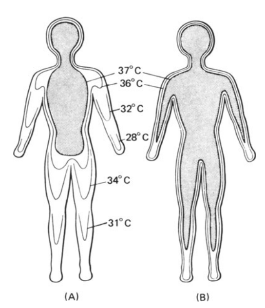

# Operative Temperature {#thermoregulation}

Animal Thermoregulation and the Operative Environmental (Equivalent) Temperature

author: Stevenson, R. D.

***

## Preface {#thermoregulation-preface}

Thermoregulation is defined as the ability of an organism to modify its body temperature. This module emphasizes animal thermoregulation from an ecological point of view and develops the concept of the operative environmental temperature, a technique which integrates the effects of all heat transfer processes into one number. Historical developments in the study of animal thermoregulation are reviewed and an attempt is made to illustrate how a quantitative knowledge of heat transfer processes can be used to clarify the adaptive significance of animal morphology, behavior, and physiology. A problem set illustrates and extends ideas developed in the text.

The biological aspects of thermoregulation are investigated in this module by illustrating the limitations of purely physical models of heat balance. The importance of certain behavioral physiological and morphological traits is stressed throughout the discussions. The concept of *operative environmental temperature* is presented and discussed as a means of incorporating the relative influences of all heat transfer processes into one number. 

***

## Introduction {#thermoregulation-intro}

Whereas previous modules dealing with heat energy have introduced physical principles (Gates and Stevenson 1978; Stevenson 1977a,b, 1978a) or methods of analysis (Ratheway 1978, Stevenson 1978b), the first section of this paper will emphasize animal thermoregulation from an ecological viewpoint. Physiologists have investigated thermoregulation more than ecologists, so the student will find the best summaries in environmental physiology texts such as Gordon (1977) and Schmidt-Nielsen (1975) or summary reviews (Whittow 1970, 1971, 1973; Precht et al. 1973; Wieser 1973). Gibbons and Sharitz (1974) and Gates and Schmerl (1975) also contain papers which are of interest to students of thermal biology. [UPDATE: Thermoregulation has been of accelerating interest to ecologists since the writing of the modules. See Angilletta (2009, Thermal Adaptation) for a summary.] The material within is meant to complement these standard treatments. Even though all the examples are of animals, one can also think of plants as overstimulating. Plants modify leaf shape, position, and surface characteristics as well as daily and seasonal photosynthetic periods. The last part of the module develops the concept of the operative environmental temperature, which we will see is a useful way to integrate the effects of all heat transfer processes.

***

## Animal Thermoregulation {#thermoregulation-animalthermo}

The term **thermoregulation** can be defined as the ability of an organism to modify its body temperature. Although this may seem simplistic, the point is that a living organism often has a body temperature which would be different from that of an inanimate object with the same physical properties as the organism in the same thermal environment. For endothermic organisms, this fact is well known. The constancy of internal temperature of these animals helped Claude Bernard, a century ago, form his opinion that homeostasis is the central paradigm of physiology. But it was not until Heath's (1964) paper that this point was clearly made for ectotherms. Huey (1974) studied the time and energy costs of regulating body temperature by contrasting body temperatures and spatial and temporal distributions of an iguanid lizard, *Anolis cristatellis*, in two different adjacent thermal environments: an open park and a forest. This ecological viewpoint is given a more general treatment by Huey and Slatkin (1976) in which they consider the costs and benefits of thermoregulation. Biologists have always recognized that the consequences of altering body temperature are profound. Today more emphasis is being placed on interpreting the importance of thermoregulation for circadian rhythms, circannual rhythms, foraging and digestive processes of individuals in their natural environment.

One can begin to understand the costs and benefits of temperature regulation by outlining the mechanisms that allow an organism to thermoregulate. In Table 10.1, these are placed under three convenient headings: behavioral, physiological, and morphological. This breakdown also chosen by King (1974) and West (1977) provides a starting point for discussion of alternative thermoregulation strategies. One might begin by determining the relative importance of each mechanism to heat transfer and its energetic cost to the organism. This kind of information is generally not known, but we will discuss one example later in the text which contrasts the effects of increasing body size and insulation thickness on heat loss.

What kinds of information are available from Table 10.1? First, the time scale on which each mechanism operates gives clues about the kind of environmental changes for which the mechanism has evolved to compensate. Second, the physical environment may dictate that certain mechanisms cannot be used. One obvious example is that of evaporative cooling in dry environments (Schmidt-Nielsen 1964). Here an organism must find other means to reduce its heat load because water is in short supply and is required for other purposes. A further complication is the interaction of several mechanisms. Consider the example of metabolic output as a function of air temperature given in most physiological texts. As the air temperature is lowered, the animal can maintain a thermal equilibrium by simply restricting blood flow to peripheral areas (vasoconstriction). This reduces the temperature in these areas (see Fig. \@ref(fig:fig-thermoreg-1a)). At the end of the thermal neutral zone when all the vessels are constricted (hot-cold dividing line in Fig. \@ref(fig:fig-thermoreg-1b)), the organism must increase its metabolic rate if its body temperature is to remain constant. In contrast, the blood vessels of an active animal must be dilated to supply the muscles with oxygen. Metabolic rate may increase by 300% or more to provide the energy for activity. Figure \@ref(fig:fig-thermoreg-2) shows resting and active metabolic rates for the rabbit *Oryctolagus cuniculus* as a function of temperature. When the rabbit is active, the metabolic rate is independent of air temperature. The challenge of physiological ecologists is to understand these mechanisms and their interactions for the animal in the natural environment.


> TABLE 10.1. Systems or Mechanisms Influencing Thermoregulation in Animals.


|**Behavioral**                     | **Time Scale of Adjustment** |
|---                                |:---:|
|Habitat selection                  |S,L|  
|Temporal selection of microhabitat |M,D|
|Spatial selection of microhabitat  |M,D,S|
|Orientation                        |M|
|&nbsp;&nbsp;Body                              |
|&nbsp;&nbsp;Body Appendages                    |
|Caloric intake                     |D,S|
|Piloerection                       |M|
|Intraspecific grouping             |M,S,L|           

|**Physiological**                  |
|---                                |:---:|
|Metabolic rate                     |M,S|
|Blood flow rate                    |M|
|Water loss                         |M|
|&nbsp;&nbsp;Respitory                        |
|&nbsp;&nbsp;&nbsp;&nbsp;Panting|
|&nbsp;&nbsp;Sweating|
|&nbsp;&nbsp;Cutaneous|M|
|Color|S|
|Fat distribution|S|
|Fat melting point|

| **Morphology**             |   |
|----------------------------|:-:|
| Color                      |   |
| Size                       | S |
| Shape                      | L |
| Surface characteristics    | L |
| &nbsp;&nbsp;Fur                      |   |
| &nbsp;&nbsp;Feathers                 |   |
| &nbsp;&nbsp;Scales                   |   |
| Circulatory system         | L |
| &nbsp;&nbsp;Counter current exchange | L |
| &nbsp;&nbsp;Shunts                   | L |

M = Minute   
D = Day   
S = Season   
L = Lifetime

```{r fig-thermoreg-1a, echo=FALSE, fig.height=4, out.width = "75%", fig.cap='Oxygen consumption curve for a hypothetical homeotherm. The terms hot and cold can be defined in terms of the animal\'s physiological responses to its environmental temperature. (From Ingram and Mount 1975, p.2,)'}
knitr::include_graphics('figures/fig-thermoreg-1a.png')
```

```{r fig-thermoreg-1b, echo=FALSE, fig.height=4, out.width = "75%", fig.cap='Diagrammatic isotherms in the human body exposed to cold (A) and warm (B) conditions. The core of deep body temperature (shaded) shrinks in the cold, leaving a peripheral shell of cooler tissue. (From Ingram and Mount 1975, p. 6: original data from Aschoff and Weyer 1958.)'}

```


```{r fig-thermoreg-2, echo=FALSE, fig.height=4, fig.show = "hold", out.width = "100%", fig.align = "default", fig.cap='Mean heat production, loss and storage in three exercising (c) and four resting (r) New Zealand white rabbits at ambient temperatures of 10, 20 and 30°C. (From Kluger et al. 1972a.)'}


```

\newpage

### The Physical Environment {#thermoregulation-physicalenv}

Another approach for studying thermoregulation is to examine the temporal and spatial variation of the thermal environment. This variation is a result of the patchiness and gradients of the physical factors in the heat energy equation: solar radiation, longwave radiation, wind speed, wind direction, air temperature, substrate temperature and water vapor concentration or water temperature. Vertical temperature gradients formed in the water, soil or air may allow an organism to locate in its preferred thermal environment. The increase in wind speed above the ground surface forms another kind of gradient. Patches usually created by sun and wind shadows are the result of the landscape and vegetation. If the patches are large compared to the size of the organism, then it may be necessary for the organism to move between patches to remain in thermal comfort. Hillman (1969) describes this behavior for the lizard *Amevia leptophrys*, which makes excursions into the forest habitat to forage but returns to the shrub community where sunlight is available to increase its body temperature. If patches are small, it may be possible for the animal to "sit" in two or more different thermal environments so as to balance its thermal energy exchange. If the patches become very small relative to the organism, the environment will appear homogeneous.

Another characteristic of the physical environment is that under certain conditions (e.g., clear or uniformly cloudy sky), the variability of thermal patches can be characterized quantitatively. Thus one can predict how the thermal environment will change in time and space. The work of Porter et al. (1973), who studied the desert iguana *Dipsosauros dorsalis*, is the best example of this modeling approach.

The reader should realize that the larger the variability in the micrometerological conditions the greater is the thermal stress the organism potentially experiences. In fact, most research has concentrated on adaptations to stressful environments. Physiologists have studied heat stress in deserts and cold stress in polar regions. This is the most likely course of investigation because the environments are harsh and the evolutionary solutions intriguing. Simple reasoning, however, suggests that a more complex viewpoint will have to be adopted for a complete understanding of animal thermoregulation in an ecological context.

Consider an arctic fox in the cold winter of the northern tundra. With a deep body or core temperature of about 38°C, it will be losing heat energy to the environment. Why is it that the fox does not increase its passive insulation (fur thickness) to conserve energy? One answer is that the animal would quickly overheat if its fur were too thick when it was exercising. This would have profound implications for the fox's ability to capture prey. Bartholomew and Wilke (1956) and Brown and Lasewski (1972) provide examples relevant to this point.

Remember also it is probable that an animal can be too hot in the arctic winter and it may also become too cold in the tropics. It is likely that on any given day within any habitat an organism can experience either extreme. Thus the diversity of mechanisms found in Table 10.1 is not so surprising. Animals have a complex integrated approach for regulating their internal environment.

Finally note that an organism has two ways of dealing with thermal stress. It can tolerate the variability through physiological adaptations or it can avoid these climates or microclimates. The antelope ground squirrel *Citellus leucurus*, as most animals, employs both of these means. This desert mammal has evolved a large tolerance for body temperature fluctuations so that it can be active during the day under intense solar radiation. These conditions impose a net gain in heat energy and a corresponding rise in body temperature. To avoid thermal stress, the animal must retreat to its burrow where it can lose energy to the surrounding soil. Figure \@ref(fig:fig-thermoreg-3) shows the expected time course of its body temperature. When the body temperature drops, the animal has retreated to its burrow. We conclude that *C. leucurus* uses a combined strategy of tolerance and avoidance to be active on the sunlit desert surface.


```{r fig-thermoreg-3, echo=FALSE, fig.height=4, fig.show = "hold", out.width = "100%", fig.align = "default", fig.cap='Diagrammatic representation of the daily patterns of body temperatures in a large and a small mammal subjected to heat stress under desert conditions. (From G.A. Bartholomew 1977, p. 423; original data from Schimdt-Nielsen et al., 1957, Amer. J. Physiol. 188: 103-112, and J.W. Hudson, 1962, Univ. Calif. (Berkeley and Los Angeles) Publ. Zool. 64:1-56.'}


```

### Thermoregulation and the Ecogeographical Rules {#thermoregulation-rules}

During the course of their studies, early natural historians noted that there were clines in homeotherm size, shape and color. Three empirical ecological rules bearing the names of Bergmann, Allen and Gloger resulted from these observations. In addition, Cowles (1946) observed that there was a decrease in lizard body size at increasing latitudes. In each case, the originator proposed a reason why these observations might be true based on the animal's thermal relation to the environment. The knowledge of energy balance and heat transfer processes explained in earlier modules (Stevenson 1977a,b, 1978a) will prove to be especially helpful in clarifying and dissecting each hypothesis.

Bergmann (1847) originally observed that, as the environment became colder, mammal and bird size increased. Although Mayr (1963, p. 323) has restricted Bergmann's rule to variation within species, James' (1970) translations indicate that Bergmann intended his rule to apply to larger taxonomic groups. To explain his generalization, Bergmann proposed that increasing body size would reduce heat loss. He reasoned that, since heat loss is proportional to surface area, metabolic output should be proportional to body mass to the 0.67 power. Increasing body size would therefore decrease the metabolic output per unit body weight.

There are several objections to this line of reasoning. First, modern measurements of standard metabolic rates of homeotherms have shown that resting metabolism is not proportional to the mass to the 0.67 power, but rather the 0.75 power. (Readers should consult McMahon (1973) for a suggestion of why this might be true.) Second, in a classical paper, in which they compared tropical and arctic birds and mammals, Scholander et al. (1950a) found that in most cases standard metabolism is independent of the environment. Challenging the physiological basis of Bergmann's rule in a later paper, Scholander (1955) stated that there were three ways in which an organism could adapt to a colder climate: (1) by lowering the thermal gradient (decreasing body temperature), (2) by increasing metabolic rate or (3) by increasing body insulation. Based on earlier work (Scholander et al. 1950b,c), Scholander (1955) concluded that homeotherms increase fur and feather thickness to endure the colder climate of the arctic. This paper spurred a series of comments and rebuttals (Mayr 1956, Newman 1956, Irving 1957, Scholander 1956) which mainly serve to point out that there is a difference between the empirical observation and the reason for the "law." As McNab (1971) correctly points out, a third objection is that increasing body size would reduce the heat loss per unit surface area, but in fact the total heat loss would increase as ${M_b}^{0.75}$. Increasing body size requires absolutely more energy. McNab concluded that much of the data used to support Bergmann's rule could be interpreted as classical examples of character displacement (Brown and Wilson 1956). [See the field of metabolic ecology for recent research.]

These three arguments provide evidence to dismiss Bergmann's reasoning. The empirical, basis of Bergmann's rule, however, is still supported by more careful studies (James 1970, Brown and Lee 1969). The question now becomes "What selective forces would favor increasing body size in colder environments?"

Kendeigh (1969) made the plausible suggestion, for birds at least, that increasing body size will allow the animals to survive the critical times of severe weather when feeding is impossible. Developing this argument more formally, Calder (1974) states that during such conditions when the birds cannot forage, survival time depends on the amount of fat that is stored which is proportional to body mass. Because metabolism is proportional to ${M_b}^{0.75}$, a larger bird can survive a proportionately longer time. Retterson and Nolan (1976) discuss this hypothesis in relation to body size and the sex clines they found for the Dark-eyed Juncos, *Juncos hyemalis hyemalis*. The ecologist, however, is still left to explain McNab's objection that a larger animal needs absolutely more energy. This might be rephrased as "Can a bird slightly larger than its conspecifics forage at a proportionately greater rate to meet its larger energy requirements?"

Spotila and Gates (1975) provide the only study that addresses Bergmann's role and specifically incorporates the heat transfer processes. They conclude that indeed increasing body size will decrease the metabolic rate per unit surface area to achieve thermal equilibrium. Figure \@ref(fig:fig-thermoreg-4) clearly shows that size acts as insulation reducing the metabolic output. Given the alternative of increasing size or adding insulation, though, Figs. \@ref(fig:fig-thermoreg-4)a and b show that a homeotherm ($T=42^\circ{C}$) and 2 cm in diameter in a cold environment can get the same reduction in metabolism by increasing insulation thickness 10 times instead of increasing body size to 10 cm in diameter. Their model only investigated the steady state situation. It would be instructive to incorporate temporal variations in the thermal environment.

In 1877, Allen wrote that species from colder climates often have smaller appendages than do closely related species in warmer climates. He suggested that this was an adaptation to conserve heat in cold environments. Mayr (1963) states that Rensch (1933) made quantitative measurements which upheld Allen's rule. The problem is that decreasing surface area decreases the rate at which an organism can absorb energy as well as release energy. If the environment is always colder than the organism, it should assume a spherical shape and avoid the plate shape. As already noted earlier in the text, at times it may be important to increase heat loss even in the coldest environment. By reducing surface area, the organism has less ability to direct blood flow to influence its, heat balance physiologically, but an increase in the surface area to volume ratio may require more energy to keep surface tissue from freezing. The effects of natural selection on such trade-offs are not clear.


```{r fig-thermoreg-4, echo=FALSE, fig.height=4, fig.show = "hold", out.width = "100%", fig.align = "default", fig.cap='Effect of body size and insulation on the M-E requirement of homeotherms. (A) Cold conditions, clear sky at night, low insulation. (B) Cold conditions, clear sky at night, increased insulation. (C) Full sun, high air temperature, low insulation. (D) Full sun, high air temperature, increased insulation. Insulation consists of a layer of fur or feathers, the thickness of the layer defined as CD, where D is the inside diameter with no insulation and C is a constant proportion of D for all sizes of D in a given set. Data for real animals are taken from Porter and Gates (1969). (From Spotila and Gates 1975, p. 295.)'}


```

There are several well-documented examples of the importance of appendages in thermoregulation. Farlow et al. (1976) investigated the sail fin of the dinosaur *Stegosaurus*. Studies of the vascular system and a model of heat transfer implicate the dorsal fin as an important heat transfer mechanism. The pinna of *Leporidae* (hares and rabbits) is a favorite topic of vertebrate physiologists (Kluger et al. 1971, Hill and Veght 1976, Schmidt-Nielsen et al. 1965, Wathen et al. 1971). These investigators have shown that the large surface area (20% of the body) of the external ear is a useful mechanism to control heat exchange. Their large surface area, which improves convective and radiation exchange, combined with the ability to pump blood through the tissue makes an effective regulation system. Wathen et al. (1971) have made wind tunnel and theoretical investigations exploring various geometries. Hesse (1928) and Griffing (1974) provide empirical evidence for Allen's rule. But there are no theoretical studies comparable to the work of Spotila and Gates (1975) to help interpret this phenomenon.

Gloger (1833) postulated that lighter colored animals are found in more open habitats because they emitted more radiation. From modern physics, however, we know that color is not important in determining emissivity to longwave radiation. Almost all organisms have emissivities above 0.5 (Monteith 1973). Hock (1965) pointed this out and ascribed the importance of color to camouflage. In his investigation of animal color, Hamilton (1972) distinguishes three categories: communication, camouflage (from predators and from prey) and radiation exchange. He correctly states that color will be important for absorption of solar radiation. Hamilton (1972) believes that open habitat birds often have the problem of overheating in the daytime. In this environment, coloration will reflect solar radiation thus reducing the heat load. Since these habitats also tend to be cooler at night, these birds should have thicker plumage to conserve heat after dark. Hamilton presents some comparative and physiological data which supports his hypothesis. Omhart and Lasiewski (1970) and Lustick (1969) have made O~2~ consumption measurements below the thermal neutral zone showing that black-colored birds have reduced metabolic requirements compared to white birds. If the reader understands radiation transfer, this result is not so surprising. In fact, the reduction in metabolic rate can be accurately predicted as shown later in the module.

The heat transfer processes in the fur and feathers are just beginning to be explored (Davis and Birkeback 1974, Cena and Monteith 1975a, b,c). Physically, as light penetrates the pelage or plumage, it gets reflected forward and backward creating concave temperature distributions. Kowalski (1978) has found the radiation and conduction processes are coupled in the heat transfer. In general, a white-colored outer layer will absorb less radiation, but as wind speed increases, Walsberg et al. (1979) found that the reduction in absorbed radiation for black feathers was larger. This is because the maximum temperature in the plumage layer was closer to the surface in the black than in the white feathered skin. Therefore convection will have a larger effect on the black-colored bird. Further studies will be able to investigate fur and feather characteristics (thickness, length, density) which eventually can be incorporated into a model of the total animal in the environment to understand the interactions of wind speed and radiation on absorbed radiation.

In 1946, Cowles suggested that lizard size should decrease with increasing latitude because increasing size would decrease the rate at which a reptile could achieve activity temperature. This hypothesis has never been rigorously tested. Ray (1960) and Lindsay (1966) examined latitudinal trends in size changes for a variety of invertebrate species but reached no conclusions.

Most models of thermoregulation have started with certain assumptions about the morphology and physiology of the organism and then attempted to ask about the control of body temperature (Huey and Slatkin 1976) or the limit of activity times (Belovsky 1977; Porter et al. 1973, Porter and Tracy 1975) and habitat (Tracy 1976). Other characteristics such as body shape and size, surface characteristics (scales, hair, feathers), preferred body temperatures, basal metabolic rate, and the design of the circulatory system also merit our attention since they too are under selective pressures. For instance, a question of interest for many years has been the evolution of homeothermy (Cowles 1946, Ricgles 1974, Whittow 1973, Heath 1968, Bakken 1971, Bakken and Gates 1975, Heinrich 1977, McNab 1978, Stevens 1973, Dawson 1975, Bouvier 1977, Calloway 1976, Crompton et al. 1978, Hainsworth and Wolf 1978). The question of preferred body temperature obviously has implications for the biochemical system of the organism which is also being investigated (Brock 1967, Hochaka and Somero 1973, Somero and Low 1975). [See Angilletta (2009, Thermal Adaptation) for recent treatments of the issues in the preceeding  paragraphs.]

### Other Ecological Considerations {#thermoregulation-considerations}

Because of its very existence, every organism exchanges heat energy with its environment, it is natural to ask about the relation of thermoregulation to the tasks an individual must perform which include growth, procurement of food, avoidance of predation and reproduction. Although these are standard subjects for ecological studies, their relation to thermoregulation is largely unexplored. Several paragraphs on the interaction of feeding and temperature regulation are included to spur the reader's interest.

It seems quite natural that the ecologists studying thermoregulation should become interested in the food requirement of their subjects. The chemical energy obtained is used for basal metabolism as well as all other tasks the animal must perform. In turn, the metabolic rate is a significant component of the heat energy balance of homeotherms, while for poikilotherms the thermal environment will influence the animal's body temperature and thus its metabolic rate.

What about ecologists interested in predicting an animal's food items? Investigators modeling feeding strategies (although not specifically concerned with thermoregulation costs) have provided some insight into temporal patterns and foraging modes (see Pyke et al. 1977 and Norberg 1977). Schoener (1974) states that an organism should forage during a given period if the energetic gain is greater than resting during that period. Symbolically this is stated: The animal shall forage if
\begin{equation}
e_x > {-W}_x
(\#eq:thermoreg-1)
\end{equation}
where
<ul class="list-unstyled">
<li>$e_x$ is the  net energy gained while feeding in a period of type $x$ </li>
<li>$W_x$ is the energy lost while waiting through a period of type $x$ </li>
</ul>

He summarizes:

`These considerations imply that temporal specialization should vary with food abundance in exactly the opposite manner to food or habitat specialization. In situations of very high food abundance, only the best item kind is taken and only the best patch type is foraged in. Hence specialization on food type and habitat is at its maximum. But under situations of greatest food abundance, there should be no time during which feeding results in a greater loss of energy than waiting. Hence temporal specialization is at its minimum. With decreasing food abundance, item kinds and habitat types are added, but it is possible that food availability becomes so low during certain periods of time that it is less expensive to wait those periods out. Hence food and habitat type broaden while diet activity periods shrink as abundance decreases. `

`... Of course it is possible that animals will not be as generalized with respect to time as contingency models imply, if by being so generalized they gain more food than they can process. Such animals, or any animal with a fixed caloric requirement should specialize with respect to time as food abundance increases, just as they should for food or habitat. Thus contingency feeders and restricted feeders should react in opposite ways to changes in overall food abundance. Williams (10) reports that during poor weather when yield from the best feeding periods is less, certain animals (daddy-longlegs, cattle) enlarge their activity times.Such animals are behaving as if they have a fixed caloric quota.`

It is instructive to separate the net energy gained during a period $x$ into the food ingested and the metabolic costs of foraging in that environment. Often the foraging environment is thermodynamically different from the resting place. Feeding also means a concomitant increase in metabolic rate. Bearing these facts in mind, equation \@ref(eq:thermoreg-1) can be expanded into the following form:
$$F_x - M_{fx} > M_{rx}$$
where
<ul class="list-unstyled">
<li>$F_x$ is energy captured ($W$), </li>
<li>$M_{fx}$ is metabolism foraging ($W$), </li>
<li>and $M_{rx}$ is metabolism while resting ($W$). </li>
</ul>

If the costs of the two environments are much different or the probability of finding food is low, it may be that an organism should skip foraging periods more often. Consideration of the daily and seasonal foraging patterns of organisms suggests the question: "Why do animals spend so much of their time waiting or resting?" Katz (1974) developed a long-term foraging optimization scheme to investigate some of these issues. Brett (1971) provides some intriguing data on the interaction of food levels and temperature.

The remainder of this module returns to questions of heat balance. The ecologist, however, must constantly keep this broader perspective in mind if he or she is to investigate the patterns found in nature.

***

## The Operative Environmental Temperature {#thermoregulation-operative}

Models of the physical processes that govern the heat energy exchange of animals involve many environmental as well as organismal parameters which make the results difficult to summarize. One must use the four heat transfer processes (radiation, convection, evaporation and conduction) to link the microclimate (air temperature, wind speed, etc.) to the animal's physiology, behavior and morphology. With such a large number of independent variables, it is apparent that it would be helpful to have a single number that would allow one to say how the animal "felt" in that environment. At first this may seem difficult. For example, if all the environmental variables and homeotherm's thermoregulatory actions are fixed, the organism will have a specific metabolic rate. It is possible, however, to change the external conditions--say reduce the body-air temperature difference but increase the wind speed so that the organism will have the same metabolic rate to maintain thermal equilibrium or one could lower the air temperature but increase the absorbed radiation so that a poikilotherm would not have a different body temperature. The concept of operative environmental temperature lets one say quantitatively which environments are equivalent thermodynamically for the organism. Because this concept undercuts the physical processes, valuable information is lost about the animal's coupling to the environment. But indeed this is the purpose of the operative environmental temperature. It may actually be that animals respond to a stimulus that has already integrated all the thermal fluxes.

### Mathematical Development of the Operative Environmental Temperature {#thermoregulation-math}

In this section, I develop the operative environmental temperature ($T_e$) as Bakken and Gates (1975) presented it. A discussion and summary of alternative formulations can be found in Bakken (1979a) about which I will comment briefly later.

I will begin with a simple model that approximates a homeotherm. The heat transfer processes and heat sources included are absorbed radiation, reradiation, convection, respiratory and cutaneous water loss and metabolism. Applying the First Law of Thermodynamics to the surface of the animal at temperature $T_r$ shows that 
$$ \mbox{Energy In} = \mbox{Energy Out}$$
and thus
\begin{equation}
Q_{a} + K ( T_b - T_r ) = Q_{e} + C + E_r.
(\#eq:thermoreg-3)
\end{equation}
The first energy in term $Q_a$ is absorbed thermal and solar radiation. The second term is conductance through the animal as a function of the gradient between internal body temperature $T_b$ and surface temperature $T_r$, where $K$ is thermal conductance of the organism. The energy out terms correspond to emitted thermal radiation $Q_{e}$, convective heat exchange with the air $C$, and evaporative heat loss from the outer surface $E_r$. 

The heat balance at the core of the animal can be likewise expressed as
\begin{equation}
M-E_b= K ( T_b - T_r ),
(\#eq:thermoreg-4)
\end{equation}
where $M$ is metabolism and $E_b$ is the evaporative heat loss from the respiratory system.

We then further consider the energy balance at the animal's surface. The rate at which heat is emitted from the organism's surface is given by the Stefan-Boltzman Law:
$$Q_e= \sigma \epsilon T_r^4,$$
where $\sigma$ is the Stefan-Boltzmann constant ($5.67 \times 10^{-8} W m^{-2}K^{-4}$) and $\epsilon$ is the thermal emissivity of the organism's surface.

We can use a Taylor-Series approximation to linearize the heat transfer, expanding about 
the mean surface temperature $T_r$ as
$${T_r}^4 \cong {\overline{T}_r}^4 + 4{\overline{T}_r}^3 (T_r - \overline{T}_r) = (4{\overline{T}_r}^3) T_r - 3{\overline{T}_r}^4$$
We can thus approximate $Q_e$ as
$$\sigma \varepsilon {T_r}^4 \cong (4 \sigma \varepsilon {\overline T_r}^3)T_r - 3 \sigma \varepsilon {\overline T_r}^4.$$
For convenience, we follow Bakken and Gates (1975) and let $4 \sigma \varepsilon {\overline T_r}^3 = R$ and define $Q_n$ as the net rate of heat tranfer by all radiative processes. Thus, $Q_n = Q_a + 3 \sigma \varepsilon {T_r}^4$. Equation \@ref(eq:thermoreg-3) can then be rewritten as
\begin{equation}
Q_n + K(T_b - T_r) = R T_r + h_c (T_r - T_a) + E_r
(\#eq:thermoreg-5)
\end{equation}
Equations \@ref(eq:thermoreg-4) and \@ref(eq:thermoreg-5) are then solved simultaneously to eliminate the surface temperature $T_r$. The rationale for this manipulation is the one not really concerned with the surface temperature. The question is: How are the animal's body temperature and physiological processes being influenced by the thermal environment? Completing the elimination yields
\begin{equation}
T_b = \frac{h_c T_a + Q_n}{R + h_c} + (M - E_b) \frac{K + h_c + R}{K(h_c + R)} - \frac{E_r}{R+ h_c}
(\#eq:thermoreg-6)
\end{equation}

The important point of equation \@ref(eq:thermoreg-6) is that the first term of the right-hand side does not depend on any physiological processes. It measures the component of the body temperature that is strictly due to the physical environment. This is the term Bakken and Gates (1975) labeled the operative environmental temperature, $T_e$. They say

`Te may be identified as the temperature of an inanimate object of zero heat capacity with the same size, shape  and radiative properties as the animal and exposed to the same microclimate. It is also equivalent to the temperature of a blackbody cavity producing the same thermal load on the animal as the actual non-blackbody microclimate, and therefore may be regarded as the true environmental temperature seen by that animal.`

Bakken (1976a,b) and Bakken and Gates (1975) have extended these ideas in several ways. Most importantly they show that more complicated models including conduction can be incorporated into this same framework. Second, as Bakken (1976a) notes, the operative environmental temperature strictly speaking is not a temperature. This is because two systems are said to have the same temperature if each is in thermal equilibrium with a third system (Stevenson 1977a, Zemansky and Van Ness 1966). If the animals were of different size, the convection coefficient would be different and the two $T_e$s would not be equal. Yet each model organism would be in thermal equilibrium with the microclimate but not each other. Therefore, the zeroth law is not satisfied. This, however, is not a drawback for the use of $T_e$ in temperature regulation studies.

Bakken (1976a), following Gagge (1940), has made the further complication of introducing the standard operative environment temperature. He felt this step was necessary so that the primary physiological response of animals to their thermal environment (metabolic rate minus evaporative water loss) could be unambiguously defined in a metabolic chamber. Although it was the purported intention of the operative environmental temperature to incorporate all the effects of the thermal environment into one stress index, the standard operative environmental temperature was created because the overall heat transfer coefficient between the animal and the environment (see $K_0$) must uniquely define for the effective dry heat production to be predicted. The overall conductance depends on wind speed and the thermal properties of the underlying substrate which can be standardized in metabolic chambers. The approach has the advantage of being able to relate laboratory experiments to field studies as well as decreasing the differences environmental temperature are found in Bakken (1976a, pp. 357-367).

Unfortunately, like the operative environmental temperature, this concept has limitations which Bakken (1976a) discusses. In particular, it is assumed that body temperature, posture, orientation and blood flow rates are constant. This is not necessarily the case. Simply the stress state of the animal may increase metabolic rates. Furthermore, this formulation does not account for the differences in water loss rates due to effects of changing ambient water vapor concentration (see Bakken 1979a for references including this effect). 

One final comment is necessary before proceeding. Bakken and Gates (1975) approximated the heat transfer between the animal and environment by linearizing about the mean surface temperature. Robinson et al. (1976) gave two derivations linearizing about air temperature and about the operative environmental temperature. Bakken (1979a) has evaluated the errors in these different approaches and finds that only in the case of naked animals do any of the alternatives give poor results. He further presents a procedure using numerical techniques to get exact results which is important for calculations of the heat balance of naked animals or in simulation studies where errors can accumulate.

TrenchR offers several strategies for estimating operative environmental temperatures of organisms that have reached an equilibrium with their environment ("steady-state", no heat retention). The following function uses the equations in the chapter on heat transfer (module \@ref(heattransfer)) above to solve the energy balance for $Te$ (K).
```{r}
library(TrenchR)

Tb_Gates(A=1, D=0.001, psa_dir=0.6, psa_ref=0.4, psa_air=0.6, 
         psa_g=0.2, T_g=303, T_a=310, Qabs=800, epsilon=0.95, 
         H_L=10, ef=1.3, K=0.5)

```

Campbell and Norman (1998) use a somewhat simplified energy balance to express $T_e$ as a function of $T_a$ plus or minus a temperature increment determined by absorbed radiation, wind speed, and animal morphology: 
$$ T_e=T_a+(S_{abs}-Q_{emit})/(c_p(g_r+g_{Ha})),$$

where $T_a$ is air temperature (K), $S_{abs}$ is the solar and thermal radiation absorbed ($W m^{-2}$), $Q_{emit}$ is emitted thermal radiation ($W m^{-2}$), $c_p$ is the specific heat of air ($J mol^{-1} K^{-1}$), $g_{r}$ is radiative conductance, and $g_{Ha}$ is the boundary conductance.  The model is based on estimating $T_e$ for a blackbody (perfectly absorbing) cavity with air temperatures equal to surface temperatures ($T_a=T_s$). The model assumes that the cavity provides the same heat load as the natural environment and thus equates metabolic heat production and evaporative cooling in the two environments.  The formulation assumes a well mixed interior of the animal and also omits conduction with the substrate.  In this scenario, organisms emit thermal radiation from their surface proportional to the forth power of $T_a$:
$$Q_{emit}= \epsilon \sigma T_a^4 $$
where $\epsilon$ is the proportional longwave infrared emissivity of skin (0.95-1 for most animals, (Gates 1980)) and $\sigma$ is the Stefan-Boltzmann constant ($5.673 \times 10^{-8} W m^{-2} K^{-4}$). 

The thermal radiation exchanged between the animals and the walls of the cavity is proportional to the temperature differences and the radiative conductance. Cambell and Norman (2009) thus use a denominator term that combines thermal radiative exchange with convective heat exchange. The radiative conductance describing the heat exchange between the core of the animal and the environment is estimated as $g_r= 4 \sigma Ta^3/c_p$ $(mol\:m^{-2} s^{-1})$. The boundary conductance (heat exchange with the air via convection) is estimated assuming forced convection driven by naturally turbulent wind and an empirical approximation of animal shapes (Mitchell et al. 1976): 
$$g_{Ha}(mol\:m^{-2} s^{-1})= 1.4 \times 0.135 \sqrt{(V/D)},$$
where 1.4 is a factor to account for increased convection in natural environments, $V$ is wind speed ($m/s$), and $D$ is the characteristic dimension of the animal ($m$).

The function to calculate $T_e$ (called $T_b$ for simplicity) is available in R follows (including the above calculations of $Q_{emit}$, $g_r$, and $g_{Ha}$):
```{r}
Tb_CampbellNorman(T_a=303, S=823, epsilon=0.96, c_p=29.3, D=0.17, 
                  V=1)
```
In addition to these general models, TrenchR offers specialized operative temperature models that have been developed for a variety of organisms.

### Laboratory and Field Applicatons of the Operative Environmental Temperatures {#thermoregulation-field}

For many years, standard metabolic output has been measured as a function of air temperature. If the environmental chamber is large, the air  temperature will closely approximate the $T_e$, but small chambers can introduce error (Morhardt and Gates 1974, Porter 1969) In the natural environment, organisms experience a variety of shortwave radiation levels, But if $T_e$ for different environmental combinations is the same then one would expect the same metabolic output for homeotherm or body temperature for a poikilotherm. To test this, Mahoney and King (1977) recently completed these calculations from De Jong's (1976) experiments. Their results are shown in Fig. \@ref(fig:fig-thermoreg-5). The metabolic output of White Crown sparrows, *Zonorichia leucophrys gambelii*, corresponds closely to the predicted values. Mahoney and King (1977) also performed some laboratory preference tests using different combinations of absorbed radiation and air temperature to obtain a range of operative environmental temperatures. Their results are expressed as cumulative time spent in each microhabitat (Fig. \@ref(fig:fig-thermoreg-6)). Comparing Figs. \@ref(fig:fig-thermoreg-5) and \@ref(fig:fig-thermoreg-6) shows that the animals actually preferred to be in an environment near the lower end of their thermoneutral zone. It would be interesting to know how active the birds were to estimate the increase in metabolic rate above resting conditions. Furthermore, one would like to know the average amount of time spent in each microhabitat. The animals may just be sampling the extreme environments.

In a recent paper Bakken (1979a), using the standard operative environmental temperature, has improved the analysis of Mahoney and King (1977) by incorporating the effects of wind speed reported by Robinson et al. (1976). Bakken found that evaporative cooling in the thermoneutral zone (at low humidities), metabolic rate and overall thermal conductance all appear to be functions of $T_e$'s. Application of laboratory data to field situations are discussed and will be of interest to anyone studying thermal energetics. Figure \@ref(fig:fig-thermoreg-7) for instance shows the importance of the bird's physiological state on oxygen consumption.

```{r fig-thermoreg-5, echo=FALSE, fig.height=4, out.width = "75%", fig.cap='Measured and predicted metabolic rates in relation to equivalent temperature ($T_e$). Estimates of metabolic rates ($M_{std}$) are based on each $T_e$ computed from the experimental conditions of DeJong (1976) applied to data on oxygen consumption in white-crowned sparrows reported by King (1964). These predictions (blackened circles) are compared with rates ($M_{std}$) actually measured by DeJong (1976) without added short-wave radiation (triangles) and with various intensities of short-wave radiation (unblackened circles). (From Mahoney, S.A. and J.R. King 1977, p. 118.).'}

```

```{r fig-thermoreg-6, echo=FALSE, fig.height=4, out.width = "75%", fig.cap='Equivalent temperature preferenda of white-crowned sparrows (mean values for four birds, each tested while alone in the preference apparatus). (From Mahoney, S.A. and J.R. King 1977, p. 199.)'}

```

```{r fig-thermoreg-7, echo=FALSE, fig.height=4, fig.show = "hold", out.width = "100%", fig.align = "default", fig.cap='Metabolic rate, $M$, of white-crowned sparrows, plotted as a function of standard operative temperature, $T_{es}$, for three different experiments, The solid line is the regression to the data in King (1964), This study used free convection in a darkened chamber. These conditions impose the least physiological stress, and gives the lowest standard metabolic rate in the thermoneutral zone.The birds were summer acclimated, giving a lower critical temperature of about $23^{\\circ}C$, The solid symbols are the results of the study of Robinson et al. (1976), which used forced convection in a darkened chamber, Ran noise produces a slight (average of 11 percent) increase in 14 over King\'s (1.964) values. Data does not appear to extend into the thermoneutral zone. The open symbols are from DeJong\'s (1976) study, conducted using free convection in a chamber with various levels of visible radiation, The use of illuminated birds in the active part of their diurnal cycle gives the highest values of $M$. As these birds are winter-acclimated, the lower critical temperature is around $20^{\\circ}C$. Note that the use of standard operative temperature allows the comparison of purely physiological differences under equivalent thermal conditions for different combinations of wind, radiation and air temperature.'}

knitr::include_graphics('figures/fig-thermoreg-7.png')
```

A second laboratory application of the $T_e$ concept is given by Bakken (1976b). He has elaborated on the measurement of equilibrium body temperature and thermal conductance of the body. Previously, Newton's law of cooling has been used to describe the change in body temperature (but see Calder 1972, Kleiber 1975).

\begin{equation}
\frac{d T_b}{dt} = \frac{K_n}{C} (T_b - T_a)
(\#eq:thermoreg-7)
\end{equation}
where
<ul class="list-unstyled">
<li>$T_b$ is body temperature ($^{\circ}C$) </li> 
<li>$T_a$ is air temperature ($^{\circ}C$) </li>
<li>$K_n$ is thermal conductance of body tissue ($J s^{-1}$) </li>
<li>$C$ is the heat capacity of the animal ($J$) </li>
<li>$t$ is time ($s$). </li>
</ul>

Equation \@ref(eq:thermoreg-7) says that the change in body temperature will be zero when the animal's temperature is equal to that of the air. This is not a bad approximation if $T_a = T_e$ and if the metabolic and water loss rates of the animal are small. Bakken (1976a) has shown that a better approximation of the cooling curve is given by

\begin{equation}
\frac{d T_b}{dt} = \frac{K_0}{C} (T_b - (T_e + \frac{M-E}{K_0}))
(\#eq:thermoreg-8)
\end{equation}
When $\frac{d T_b}{dt} = 0$,

$$T_b = T_e + \frac{M-E}{K_0}$$

If the cutaneous water loss is small than equation \@ref(eq:thermoreg-8) has the same form as the steady-state equation \@ref(eq:thermoreg-6) developed earlier, where
\begin{equation}
T_e = \frac{h_c T_a + Q_n}{h_c + R}
(\#eq:thermoreg-9)
\end{equation}
and
\begin{equation}
K_0 = \frac{K (h_c + R)}{K + h_c + R}
(\#eq:thermoreg-10)
\end{equation}
$K_0$ is a function of the convection coefficient, $h_c$, which depends specifically on wind speed, a physical characteristic of the environment. Bakken (1976b) has provided a detailed discussion of the use of equation \@ref(eq:thermoreg-7). As an illustration, consider the case when $M$ and $E$ are small (most insects and lizards). Then equation \@ref(eq:thermoreg-8) reduces to

\begin{equation}
\frac{d T_b}{dt} = \frac{- K_0}{C} (T_b - T_e)
(\#eq:thermoreg-11)
\end{equation}
If wind speed and orientation are constant, the only physiological characteristic of the organism that would make it different from that of an inanimate object is its ability to regulate blood flow. (As an example, see Fig. \@ref(fig:fig-thermoreg-8).)

### Field Applications {#thermoregulation-fieldapp}

A particularly interesting application of the $T_e$ concept will be in field studies. Bakken and Gates (1975) and Bakken (1976) have reviewed the possibility of making model organisms with the same thermal properties as the animal under study. Using the models, one could map the temporal and spatial variation of the thermal environment. Once the models have been checked in laboratory situations, it will be much easier to take one temperature than to make the many microclimatological measurements necessary to compute the energy budget. Buttemer (1979) is the first to use this method. These measurements include longwave and shortwave radiation, air temperature, wind speed, wind direction and relative humidity. With this map in hand, it will be easy to see if the animal is selective in how it uses the environment. For example, one could ask: is the laboratory behavior found in the sparrows studied by Mahoney and King (1977) exhibited out of doors? The $T_e$ concept is a straightforward method for tackling this kind of problem.

What would such a map look like? Data presented by Bakken and Gates (1975) in Table 10.2 gives some insight. The authors investigated the effect of absorptivity (points 1-3), orientation (3-5), microhabitat (3, 6-8) and size (9-13).

```{r fig-thermoreg-8, echo=FALSE, fig.height=4, fig.show = "hold", out.width = "100%", fig.align = "default", fig.cap='Heating and cooling rates of the Galgpagos marine iguana (*Amblyrhynchus cristatus*) in water and air. $\\Delta T$ is the difference between body and ambient temperatures ($T_a$). During heating $T_a = 40^{\\circ}C$; during cooling $T_a=20^{\\circ}C$. (From-G.A. Bartholomew and R.C. Lasiewski, 1965, Comp. Biochem. Phsio14-16173-582.)'}


```

This approach will allow one to answer the question of whether or not animals avoid stressful environments. And what proportion of their time is spent in non equilibrium, requiring the organism to monitor its heating and cooling rates? Operative environmental temperature distributions combined with physiological measures of animals in the natural environment will give a better understanding of the influences of the thermal environment. An interesting example of such measurements is the body temperature telemetry taken from Pearson and Bradford (1976), who studied the thermoregulation of the lizard *Liolaemus multicarpus* and the toad *Bufo spinulosus* high in the Andes mountains. Figure \@ref(fig:fig-thermoreg-9) shows a record of the body temperature of both animals as a function of time. Although in similar microhabitats, each species interacts with the environment quite differently, which is manifested in their different body temperatures and activity patterns.

***

## Summary {#thermoregulation-summary}

In this module, we have reviewed some of the historical developments in the study of animal thermoregulation. Besides trying to relate the discussion to other ecological areas, especially foraging, I have endeavored to point where a quantitative knowledge of the heat transfer processes has helped to clarify the adaptive significance of animal morphology, behavior and physiology. Bakken and Gates (1975), Campbell (1977) and others (see Bakken 1979a for review) have developed the operative environmental temperature as a way to summarize how the organism "feels" the thermal environment. This concept has had useful applications in both physiology and ecology.

> Table 10.2. A small shrub 0.5 m high provided broken shade for cylinder 8. All cylinders were in an area of $1 \times 2 m$. Microclimate parameters for this area were as follows: $T_{air}=26^{\circ}C$, $T_{ground}=38.5^{\circ}C$; wind at 20 cm=$67 cm s^{-1}$; wind at 90 cm=$310 cm s^{-1}$; solar radiation in an 0.3- to 3-$\mu$ band=$1.3 cal \;cm^{-2} min^{-1}$. August 17, 1972, 14:15 to 14:16. Douglas Lake, Cheboygan County, Michigan. (From Bakken, G.A. and D.M. Gates 1975, p. 265.)

Cylinder|Diameter (cm)|Position|Exposure|Height (cm)|Color |T (°C)
:-----:|:-----:|:-----:|:-----:|:-----:|:-----:|:-----:
1|1.6|ESE-WNW|Sun|0.3|White|37.5
2|1.6|ESE-WNW|Sun|0.3|Black|50
3|1.6|ESE-WNW|Sun|0.3|Gray|45.5
4|1.6|NNE-SSW|Sun|0.3|Gray|46
5|1.6|Vertical|Sun|0.3|Gray|41
6|1.6|ESE-WNW|Sun|20|Gray|39.5
7|1.6|ESE-WNW|Sun|90|Gray|36
8|1.6|ESE-WNW|Shade|1|Gray|28.3
9|0.64|ESE-WNW|Sun|0.3|Gray|41.5
10|1.6|ESE-WNW|Sun|0.3|Gray|45.5
11|2.86|ESE-WNW|Sun|0.3|Gray|45.5
12|3.81|ESE-WNW|Sun|0.3|Gray|47.5
13|15.5|ESE-WNW|Sun|1|Gray|47

```{r fig-thermoreg-9, echo=FALSE, fig.height=4, fig.show = "hold", out.width = "100%", fig.align = "default", fig.cap='Body temperature of a telemetered free-ranging *Bufo spinulosus* compared with that of a telemetered free-ranging *Liolaemus multiformis* at the same time. 22 March; 4,300 m. Temperature of soil surface was measured at a spot exposed to the sun. Comments at top of the figure referring to submergence and emergence pertain to the toad. (From Pearson, O.P. and Bradford, D.F. 1976, p. 165).'}


```

***

## Literature Cited {#thermoregulation-litcited}

Allen, J.A. 1877. The influence of physical conditions in the genesis of species. Radical Rev. 1:108-140.

Bakken, G.S. 1976a. A heat transfer analysis unifying concepts and the application of metabolism chamber data to field ecology. J. Theor. Biol. 60:337-384.

Bakken, G.S. 1976b. An improved method for determining thermal conductance and equilibrium body temperature with cooling curve experiments. Thermal Biol. 1:169-175.

Bakken, G.S. 1979a. How many equivalent blackbody temperatures are there, and how are they best calculated? Submitted to J. Thermal Biol.

Bakken, G.S. 1979b. The use of_the operative temperature and standard operative temperature in the study of the thermal energetics of bird. Submitted to Physiol. Zool.

Bakken, G.S. and D.M. Gates. 1975. Heat-transfer analysis of animals: some implications for field ecology, physiology and evolution. In D.M. Gates and R.B. Schmerl (eds.), Perspectives of Biophysical Ecology.

Bakker, R.T. 1971. Dinosaur physiology and the origin of mammals. Evolution 25:636-658. Bartholomew, G.A. 1964. Symposia of the Society for Experimental Biology No. 18, pp. 7-29. Academic Press, Inc., N.Y.

Bartholomew, G.A. and RX. Lasiewski, 1965, Heating and cooling rates, heart rate, and simulated diving in the Galapagos marine iguana. Comp. Biochem. Physiol. 16:573-682.

Bartholomew, G.A. and F. Wilke. 1956. Body temperature in the northern fur seal, Callorhinos ursinus.

Baudinette, R.V., J.P. Loveridge, K.J. Wilson, C.D. Mills and K. SchmidtNielson. 1976. .eat loss from fleet of herring gulls at rest and during flight. Am. J. Physiol. 230:920-924.

Belovsky, G.E. 1979. Optimal activity times and habitat choice of moose. Oecologia 48:22–30.

Bergmann, C. 1847. Uber die Verhalthisse der Warmeokonomie der Thiere zu ihrev Grosse. Gottinger Stud. pp. 1:598-708.

Bouvier, M. 1977. Dinosaur haversian bone and endothermy. Evolution 31:449-450.

Brett, J.R. 1971. Energetic responses of salmon to temperature. A study of some thermal relations in the physiology and freshwater ecology of sockeye salmon (Oncorhynchns nerka). Amer. Zool. 111:99-114.

Brett, J.R., J.E. Shelbourn and C.T. Shoop. 1969. Growth rate and body composition of fingerling sockeye salmon, Oncorhynchus nerka, in relation to temperature and ration size. J. Fish. Res. Bd. Canada 26:2363-2394.

Brock, T.D. 1967. Life at high temperatures. Science 158:1012-1019.

Brown, J.H. and R.C. Lasiewski. 1972. Metabolism of weasels: the cost of being long and thin. Ecology 53:939-943.

Brown, J.H. and A.K. Lee. 1969. Bergmann's role and climatic adaptation in
woodrats (Neotoma). Evolution 23:329-338.

Brown, W.L. and E.O. Wilson. 1956. Character displacement. Syst. Zool. 5: 49-64.

Buttemer, G.C. 1979. Winter Roosting Energetics of the Goldfinch. Ph.D. dissertation. Univ. Michigan.

Calder, W.A. 1972. Heat loss from small birds: analogy with Ohm's law and a re-examination of the "Newtonian Model." Comp. Biochem. Physiol. 43A:13-20.

Calder, W.A. 1974. Consequences of body size for avian energetics. In R.A. Paynter (ed.), Avian Energetics, pp. 86-3"1). Nuttall Ornithological Club Publ., No. 15, Cambridge, Mass.

Calloway, N.O. 1976. Body temperature: Thermodynamics of homeothermism. J. Theor. Biol. 57:331-344.

Campbell, G.S. 1977. An Introduction to Environmental Biophysics. Springer- Verlag, New York. 159 pp.

Cena, K. and J.L. Monteith. 1975. Transfer processes in animal coats. I. Radiative transfer. Proc. R. Soc. Land. B. 188:377-393.

Cena, K. and J.L. Monteith. 1975. Transfer processes in animal coats. II. Conduction and convection. Proc. R. Soc. Loud. B. 188:393-411.

Cena, K. and J.L. Monteith. 1975. Transfer processes in animal coats. III. Water vapor diffusion. Proc. R. Soc. Load. B. 188:413-423.

Cowles, R.B. 1946. Fur and feathers: a result of high temperatures. Science 103:74-75.

Crompton, A.W., C.R. Taylor and J.A. Jagger. 1978. Evolution of homeothermy in mammals. Nature 272:333-336.

Davis, L.B., Jr. and R.C. Birkebak. 1974. On the transfer of energy in layers of fur. Biophys. J. 14:249-268.

Dawson, W.R. 1975. On the physiological significance of the preferred body temperatures of reptiles. In D.M. Gates and R.B. Schmerl (eds.), Perspectives in Biophysical Ecology, Ecological Studies, Vol. 12, pp. 443-473, Springer-Verlag, New York.

Errington, P.L. 1967. Predation and Life. Iowa State University Press.
 
Farlow, J.0., C.V. Thompson, and D.E. Rosner. 1976. Plates of the dinosaur Stegosaurus; forced convection heat loss fins? Science 192:1123-1125.

Gagge, A.P. 1940. Standard operative temperature, a generalized temperature scale, applicable to direct and partitional calorimetry. Amer. J. Physiol. 131:93-103.

Gates, D.M. and R.D. Stevenson. 1978. Radiation incident on organisms. An instructional module on physical processes in terrestrial and aquatic ecosystems. Center for Quantitative Science, University of Washington, Seattle.

Gates, D.M. and R.B. Schmerl (eds.). 1975. Perspectives of Biophysical Ecology. Springer-Verlag, New York. 609 pp.

Gibbons, J.W. and R.R. Sharitz (eds.). 1974. Thermal Ecology. U.S. Atomic Energy Commission. 670 pp. 

Gloger, C.L. 1833. Das Abandern der Vogel durch Einfluss des Klimas Breslav.

Gordon, M.S. 1977. Animal physiological principles and adaptations. Macmillan Pub, Co, Inc., New York. 699 pp.

Griffing, J.P. 1974. Body measurements of black-tailed jackrabbits of southeastern New Mexico with implications of Allen's rule. J. Mammal. 55:674-678.

Hainsworth, F.R, and L.L. Wolf. 1978. The economics of temperature regulation and torpor in non-mammalian organisms. In L.C. Wang and J.W. Hudson (eds.), Strategies in Cold: Natural Torpidity and Thermogenesis, pp. 147-184. Academic Press, New York.

Hamilton, W.J III. 1972. Life's Color Code. McGraw-Hill Book Co., New York. 238 pp.

Hatheway, W. 1978. Heat balance of a sheep in the sun. An instructional module on physical processes in terrestrial and aquatic ecosystems. Center for Quantitative Science, University of Washington, Seattle.

Heath, J.E. 1964. Reptilian thermoregulation: evaluation of field studies. Science 146;784-785,

Heath, J.E. 1968, The origins of thermoregulation. In E.T. Drake (ed.), Evolution and Environment:, pp. 259-278. Yale University Press, New Haven, Conn.

Heinrich, B. 1976. Heat exchange in relation to blood flow between thorax and abdomen in bumblebees. J. Exp, Biol, 64:561-585,

Heinrich, B. 1.977. Why have some animals evolved to regulate a high body temperature? Amer. Natur. 111:623-640.

Hesse, R. 1928. Die Ohrmuschein des Elefanten als Warmeregulator. Z. Wiss. Zool, 132:314-328.

Hill, R.W. and J.H. Veghte, 1976. Jackrabbit ears: surface temperature and vascular responses. Science 194:436.438.

Hillman, P.E. 1969. Habitat specificity in three sympatric species of Amevia (Reptilia: Teiidae). Ecology 50:476-481.

Hochachka, P.W, and G, Somero. 1973. Strategies of biochemical adaptations. W.N. Saunders Co, Philadelphia.

Hock, R.J. 1965. An analysis of Gloger's rule. Hualradets Skr. 48:214-226.

Huey, R.B. 1974. Behavioral thermoregulation in lizards: importance of associated costs. Science 184:1001-1003.

Huey, R.B, and N. $latkin, 1976, A cost-benefit model of lizard thermoregulation. Quarterly Review of Biol. 51:363-384.

Ingram, D.L. and L.E. Mount. 1975. Man and animals in hot environments. Springer-Verlag, New York. 185 pp.

Irving, L. 1957. The usefulness of Scholander's view on adaptive insulation of animals, Evolution 10:257-259 

James, F.C. 1970. Geographic size variation in birds and its relationship to climate. Ecology 51:365-390. 

Katz, P.L, 1974. A long-term approach to foraging optimization. Amer. Nat. 108:758-782,

Kendeigh, S.C. 1969. Tolerance of cold and Bergmann's rule. Auk. 86:13-25.

Ketterson, E.D. and V. Nolan, Jr. 1976. Geographic variation and its climatic correlates in sex ratio of eastern-wintering dark-eyen Juncos (Junco hvcmalis hyemalis). Ecology 57:649-695.

King, J.R. 1974, Seasonal allocation of time and energy resources in birds. In R,A, Paynter (ed.), Avian Energetics, pp. 4-85. Nuttall Orthithologica Club, Publ. No. 15, Cambridge, Mass.

Kluger, M.J R.R. Gonzales, J.W. Mitchell and J.D. Hardy. 1971. The rabbit ear as a temperature sensor. Life Sciences 10:895-899.

Kluger, M.J. 1975. Energy balance in the resting and exercising rabbit. In D,M. Gates and R.B. Schmerl (eds.), Perspectives of Biophysical. Ecology, PP. 497-507, Springerk-Verlag, New York.

Kowalski, G.J. 1978. An analytical and experimental investigation of the heat loss through animal fur. Ph.D. dissertation, Univ. of Wisconsin, Madison.

Leopold, A.S. 1977. The California Quail. University of California Press, Berkeley, 281 pp,

Lindsey, C.C. 1966, Body size of poikilotherm vertebrates at different latitudes, Evolution 20:456-465.

Lustick, S. 1969. Bird energetics: effects of artificial radiation. Science 163:387,-390.

Mahoney, S.A. and J.R. King, 1977. The use of the equivalent blackbody temperature in the thermal energetics of small birds. J. Thermal Biol. 2:115-120,

Mayr, E. 1963, Animal Species and Evolution. Belknap Press, Cambridge, Maas.

Mayr, E. 1956. Geographical character gradients and climate adaptation. Evolution 10:105-108.
 
McMahon, T. 1973. Size and shape in biology. Science 179:1201-1204.

McNab, B.K. 1971. On the ecological significance of Bergmann's rule. Ecology 52:845-854.

McNab, B.K. 1978, The evolution of endothermy in the phylogeny of mammals. Amer. Natur. 112:1-21.

Monteith, J.L. 1973. Principles of Environmental Physics. American Elsevier Publ

Newman, M.T. 1956. 101 405, . Co, Inc., New York. 241 pp. Adaptation of man to cold climates. Evolution 10:101-105.

Norberg, R.A. 1977. An ecological theory on foraging time and energetics and choice of optimal food-searching method. J. Anim. Ecol. 46: 511-529.

Omhart, R.D. and R.C. Lasiewski. 1971. Roadrunners: energy conservation by hypothermia and absorption of sunlight. Science 172:67-69

Pearson, O.P. and D.P. Bradford, 1976. Thermoregulation of lizards and toads at high altitudes in Peru. Copeia:155-170.

Pohl, H. 1976. Thermal adaptation in the whole animal. In J. Bligh, J.L. Cloudsley-Thompson and A.G. MacDonald (eds.), Environmental Physiology of Animals, pp. 259-286. John Wiley and Sons, New York.

Porter, W.P., J.W. Mitchell, W.A. Beckman and C.B. DeWitt. 1973. Behavioral implications of mechanistic ecology--thermal and behavioral modeling of desert ectotherms and their microenvironment. Oecologia (Berl.) 13:1,54.

Porter, W.P. and C.R. Tracy, 1974. Modeling the effects of temperature changes on the ecology of the Garter snake and Leopard frog. In Gibbons, J.W. and R.R. Shavitz (eds.), Thermal Ecology, pp. 594,609. U.S. Atomic Energy Commission.

Precht, H., J. Christophersen, H. Hensel and W. Larcher. 1973. Temperature and Life. Springer-Verlag, New York. 779 pp.

Pyke, G.H., H.R. Pullism,and E.L. Charnov, 1977. Optimal foraging: a selective review of theory and tests. Quart. Rev. Biol. 52: 137-154.

Ray, C. 1960. The application of Bergmann's and Allen's rules to poikilotherms, J, of Morphology 106:85-108.

Ricqles, A. de. 1974, Evolution of endothermy: histological evidence. Evol. Theory 1:51-80.

Rensch, B. 1933. Zoologisches systematik and Artbildungs problem. Verh. Deut, Zool, Ges. Koln, pp. 19-83

Robinson, D.E., G.S. Campbell and J.R. King. 1976. An evaluation of heat exchange in small birds. J. Comp. Physiol. 105:153-166.

Schmidt-Nielsen, K. 1975, Animal Physiology: Adaptation and Environment. Cambridge University Press, London. 699 pp.

Schmidt-Nielsen, K. 1964. Desert animals, physiological problems of heat and water. Oxford University, London. 277 pp.

Schmidt-Nielsen, K., T.J. Dawson, H.J. Hammel, D. Hinds and D.C. Jackson. 1965. The jackrabbit; a study in its desert survival. Hualradets Skr. 48:125-142.

Schoener, T.W. 1974. The compression hypothesis and temporal resource partitioning. Proc. Nat. Acad. Sci. 71:4169-4172.

Scholander, P.F. 1955. Evolution of climatic adaptation in homeotherms. Evolution 9:15-26.

Scholander, P.P. 1956. Climatic rules. Evolution 10:339-340.

Scholander, P.F., R. Hock, V. Walters and L. Irving. 1950a. Adaptation to cold in arctic and tropical mammals and birds in relation to basal metabolic rate. Biol. Bull 99:259-271.

Scholander, P.R., R. Hock, V. Walters, F. Johnson and L. Irving. 1950b. Heat regulation in some arctic and tropical mammals and birds. Biol. Bull. 99:237-258.

Scholander, P.F. and W.E. Schevill, 1955. Countercurrent vascular heat exchange in the fins of whales. J. Appl. Physiol. 8:279-282.

Scholander, P.F., V. Walters, R. Hock and L, Irving, 1950c, Body insulation of some arctic and tropical mammals and birds, Biol. Bull. 99: 225-236.

Somero, G.N. and P.S. Low. 1976. Temperature: a sharing force in protein evolution. Biochem, Soc. Symp. 41:33-42.

Spotila, J.R. and D.M. Gates, 1975. Body size, insulation and optimum body temperatures of homeotherms. In D.M. Gates and R.B. Schmerl (eds.), Perspectives of Biophysics Ecology, pp. 291-301.

Stevens, E.D. 1973. The evolution of endothermy. J. Theor. Biol. 38:597-611.

Stevenson, R.D, 1977a, The First Law of Thermodynamics for Ecosystems. An instructional module on physical processes in terrestrial and aquatic ecosystems. Center for Quantitative Science, University of Washington, Seattle. 

Stevenson, R.D. 1977b. Applications of the First Law to Ecological Systems. An instructional module on physical processes in terrestrial and aquatic ecosystems. Center for Quantitative Science, University of Washington, Seattle. 

Stevenson, R.D. 1978a. Heat Transfer Processes. An instructional module on physical processes in terrestrial and aquatic ecosystems. Center for Quantitative Science, University of Washington, Seattle.

Stevenson, R.D. 1978b. The climatic space concept: analysis of the steadystate heat energy budget of animals. An instructional module on physical processes in terrestrial and aquatic ecosystems. Center for Quantitative Science, University of Washington, Seattle. 

Stoddard, H.L. 1931. The Bobwhite Quail: Its Habits, Preservation and Increase. Scribners, New York. 559 pp.

Tracy, C.R. 1976. A model of the dynamic exchanges of water and energy between a terrestrial amphibian and its environment. Ecol. Mono. 46:293-326.

Walsberg, G.E., G.S. Campbell and J.R. King. 1978. Animal coat color and radiative heat gain: a re-evaluation. J. Comp. Physiol. 126:211-222. 

Wathen, P., J.W. Mitchell and W.P. Porter, 1971. Theoretical and experimental studies of energy exchange from jackrabbit ears and cylindrically shaped appendages, Biophysical Jour. 11:1030-1047.

Whittow, G.C. (ed.), 1970. Comparative Physiology of Thermoregulation, Vol. I, Invertebrates and Nonmammalian Vertebrates. Academic Press, New York. 333 pp.

Whittow, G,C, (ed,), 1971, Comparative Physiology of Thermoregulation, VQ1. II, Nammals. Academic Press, New York. 410 pp.

Whittow, G.C. (ed.). 1973. Comparative Physiology of Thermoregulation, Vol. III, Special Aspects of Thermoregulation. Academic Press, New York. 278 pp.

Wieser, W. (ed.). 1973. Effects of Temperature on Ectothermic Organisms. Springer-Verlag, New York. 298 pp.

Zemansky, M.W. and B.C. Van Ness. 1966, Basic Engineering Thermodynamics. McGraw-Hill, New York, 380 pp

***

## Problem Set {#thermoregulation-problems}

1. Pick an animal and discuss what factors in Table 10.1 will be most important in its thermoregulation strategy. Include in your response any factors that have been omitted from the table.

2. When an endothermic animal is resting, there can be a range of standard operative environmental temperatures within which its heat production or metabolic rate is constant. This thermal neutral zone, as it is called, is shown in Figs. \@ref(fig:fig-thermoreg-1a), \@ref(fig:fig-thermoreg-5) and \@ref(fig:fig-thermoreg-7). What mechanisms does an animal have available to maintain constant core temperature and heat production when the thermal environment is changing? Discuss the relative importance of each.

3.  
a) Using the information in Fig. \@ref(fig:fig-thermoreg-2), what are the avenues of heat gain and heat loss for an exercising rabbit? 

b) At different temperatures, some terms are constant while others are changing. Why? Identify the factors which may have caused the end of the exercise period. Is there a temperature at which one of these factors is likely to be more important?

4. Appendages serve a variety of functions but all are included under Allen's rule. Contrast the foot of a seagull with its wing with regard to the importance of each for heat balance when the animal is resting and exercising. (You may choose your own organism and set of appendages.) Support your discussion with knowledge about other functions of the appendages. Any physiological or behavioral information will strengthen your conclusions.

5. You are researching the prospects of entering the aquaculture business raising sockeye salmon (*Oncorhynchus nerka*). In the graph below juvenile sockeye growth is given as a function of food and temperature conditions. What is the temperature for maximum growth rate when food rations are at 6, 4.5, 3.0 and 1.5% of dry body weight per day. Fish food is relatively cheap and you could afford to provide maximum rations, but the average water temperature in the pond you plan to use is only 7°C so that the fish are not achieving maximum growth rates. Discuss the conditions in which it would be economically advantageous for you to raise the water temperature. How high would you raise it? What might be the ecological consequences of heating the water for the rest of the aquatic community.

```{r fig-thermoreg-10, echo=FALSE, fig.height=4, out.width = "75%", fig.cap='Effect of reduced ration on the relation betwern growth rate (±2 SE) and temperature, for 7 to 12 month-old sockeye. Points for excess ration or where a prescribed ration turned out to be excessive are marked with an X. The broken line for starved fish is a provisional interpretation (From Brett,J.R. et al.1969, p. 2381.).'}

```

6. Imagine that you are studying the foraging and activity patterns of the Ortax, a large ungulate, and a carnivorous beetle, the Diplitz. You have divided the day into ten equal time periods and measured $F_x$, $M_{fx}$, and $M_r$ for each period as shown in the table below. 

**Time Period**|**Ortax**| | |**Diplitz**| | 
:-----:|:-----:|:-----:|:-----:|:-----:|:-----:|:-----:
| |$F_x$|$M_{fx}$|$M_{rx}$|$F_x$|$M_{fx}$|$M_{rx}$
1|6|3|2|20|10|1
2|6|5|2|25|10|2
3|7|7|3|8|10|2
4|7|2|3|4|10|2
5|7|2|2|2|10|2
6|7|2|1|0|9|2
7|8|1|1|1|9|1
8|6|2|2|2|8|1
9|6|4|2|7|7|1
10|6|2|1|14|8|1

Rank the time periods in order of decreasing net caloric profit, assuming the animals can choose between resting and foraging. Are there any time periods the animals should be resting instead of feeding? If both organisms are trying to gather energy stores, what pattern of feeding activity would you expect to see using this simple model? What is the most each can expect to "make" during one cycle? If the Ortax must make a net profit of 20 caloric units per day to prepare for winter when should it feed to minimize total feeding time? If it must maintain weight how should it feed? If both animals must wait one time period to digest its food after it has a full stomach of 22 units, what is its feeding schedule to maximize net profit? Remember to consider $F_x$ values to figure digestion limits. Assume the Ortax must skip two periods. How should it feed to maximize profit?

7. You work as a biologist for the consulting company Envirotech. The firm's latest contract calls for an evaluation of the potential impact on the quail populations of a logging plan in Americana National Forest. Describe how you would fulfill this contract. Specifically, discuss the importance of food and cover on population densities and individual health.

8. Using the theory derived in the module and the data below, calculate $T_b$ for the three cases given. What is the environmental and the physiological contribution to $T_b$ in each case? What two kinds of animals are represented?

 ||**$M$**|**$E_r$**|**$E_b$**|**$Q_a$**|**$K$**|**$T_a$**|**$M_b$**
:-----:|:-----:|:-----:|:-----:|:-----:|:-----:|:-----:|:-----:
Animal|(W m^-2^)|(W m^-2^)|(W m^-2^)|(W m^-2^)|(W m^-2^ °C^-1^)|(°C)|(kg)
1|20|--|10|550|180|15|0.07
2|150|25|100|750|15|20|0.008
3|45|--|40|850|200|25|0.01

Assume $\varepsilon = 0.95$, $V = 0.25 m s^{-1}$, $\overline{T}_r = 25^\circ C$,$h_c = 17.24V^{0.60}M_b^{-0.133}$.


9. Using the data in problem 8 for the two ectotherms, calculate $K_0$ for V = 0.1, 0.5, and 3.0 m s$^{-1}$. Assume that the difference between metabolism and water loss is zero. What is $T_b$ in each case now? If the heat capacity is equal to the specific heat (3430 J kg$^{-1}$ °C$^{-1}$ ) times the mass of the animal, what is the heat capacity for each? Assuming $Q_a  = 600 W m^{-2}$and $T_a = 20^\circ C$ for the range of wind speeds above which animal will get warmer. Are your conclusions still the same if $Q_a = 380 W m^{-2}$? Integrate equation \@ref(eq:thermoreg-11) to find $T_b$ as a function of time. If the initial body temperature of both animals is 10°C at time equal to zero, which animal will get to $T_b = 25^\circ C$ first? Use the following relationship from Mitchell (1976).  
$$\mbox{Area}=11.0\times\bigg(\frac{\mbox{body mass}}{\mbox{body density}}\bigg)^{2/3}$$
where body density equals $1\times10^3 kg m^{-3}$ to correct the dimensions of the equations. What is the difference in time between when each will arrive at 25°C? (Hint: Solve the integrated equation for time.) Answer the preceding two questions for V=0.1 and 0.5 m s^-1^. Assume the animals are lizards and comment on Cowles' suggestion.

10. Include a conduction term of the form $G(T_r-T_g)$ in equation \@ref(eq:thermoreg-3) and find an equation analogous to equation \@ref(eq:thermoreg-6) for $T_b$.

11. Imagine you are employed as an entomologist with the U.S.D.A. working with a team of research scientists studying a pest that drills into the stalks of corn. Your assignment is to investigate the importance of the physical environment in the corn-insect interaction. Ten years of historical data suggest that during cold springs the corn is not badly infected. Also it is known that chemical treatments are most effective on the third instar. These specific questions are important to managing this pest.
a) Will this be a high density year for the corn drill so that biological or chemical controls will be needed?

b) If so, when during the season will most of the insects be in this instar? Discuss your research plan to address these questions.


## Answers to the Problem Set {#thermoregulation-answers}
1. As a sample answer, consider the response of the bumblebee to its thermal environment. At northern latitudes these bees are active for only a small portion of the year when food and the thermal environment are favorable. Temporal partitioning of the environment is also important on a daily time scale. During inclement weather, the workers stop foraging. The general importance of habitat selection and of body orientation are unknown. Heinrich (1976) has discussed the important role of the circulation system used to maintain thermal equilibrium during flight in the bumblebee. Certainly the hairy outer coat of these animals is important in heat exchange and at higher temperatures the animals can evaporate water.

2. The animal can change its blood flow rates, circulation patterns, water loss, orientation and posture to maintain a constant body temperature while the thermal environment is changing but its body temperature and metabolic rate are constant. The relative importance of orientation and posture is unknown. Figure \@ref(fig:fig-thermoreg-1b) of the module indicates that the compounded effect of blood flow and circulation patterns are important in the lower part of the thermal neutral zone while evaporative water loss becomes more important at higher environmental temperatures.

3. a) Anaerobic and aerobic metabolism produce heat. (The rabbit will also absorb radiation from the environment but this is represented as R where R = radiation absorbed - radiation emitted.) The animal loses heat via evaporation, convection and radiation exchange. Conduction is assumed to be zero.

b) The heat production terms are constant as a function of temperature because these terms are associated with the energy needed for movement. Evaporative water loss is approximately the same for the temperature range loss which in turn is a function of O~2~ consumption. O~2~ consumption is constant; therefore we expect respiratory losses are constant. The sum of dry heat loss (convection and reradiation) and storage are relatively constant, but as heat loss terms increase at colder ambient temperatures, the storage term decreases. When air temperature drops more heat can be lost to the environment because the difference between the surface temperature and the ambient temperature is larger. The exercise period may have ended because of lactic acid build-up due to anaerobic metabolism or because of an increase in body temperature. The first factor is independent of temperature while overheating is more likely at higher temperatures.

4. Appendages fall into at least three categories. A rabbit's ear can be used to increase heat loss by increasing blood flow to this appendage if the environmental temperature is below core temperature. In contrast, many limbs are used during movement and then the overriding concern becomes supplying blood to the muscles. Under these conditions, the appendage cannot be used to regulate heat balance. This is not to say that the appendage cannot show thermoregulatory adaptations. For example, consider the well-known counter current system of blood vessels and arteries in dolphin flippers which reduce heat loss. A third group of appendages requires careful regulation (head, scrotum, mammary groups). The heat may have steep temperature gradients from the nose to the brain but brain temperature is carefully regulated. Likewise, to maintain viable sperm the temperature of any male reproductive organ is carefully controlled.

To answer the question specifically posed, gulls have been shown to use their feet as heat radiators during flight (Baudinette et al. 1976). In cold arctic climates when the bird is placed on ice, blood flow is increased to foot to keep it from freezing (Scholander and Schevill 1955). When resting the wings will add insulation to the body. During flight extension of the wings greatly increases surface area, but because there is little muscle mass in the wings. The ability of the bird to use its wings for temperature regulation is unknown.

5. The temperatures for maximum growth with food rations at 1.5, 3.0, 4.5 and 6.0% of dry body weight are 5, 9, 11.5 and 13.5°C, respectively. The conditions necessary to increase water temperature from a economic standpoint can be stated in a verbal model as profit equals fish price minus food costs minus heating costs. Because food production, maximum food ration and heating costs will all increase as water temperature increases, it is difficult to say how high water temperature should be increased for maximum profit--certainly not above a water temperature of 13.5 °C. The ecological consequences for heating the water are difficult to predict, although much has been written. It is important to remember that both the chemical and physical properties of the water will change.

6.

ORTAX

Time Period|$F_x$|$F_x-M_{fx}$|Ranking|$M_{rx}$|Ranking|$F_x-M_{fx}-M_{rx}$|Ranking
:-----:|:-----:|:-----:|:-----:|:-----:|:-----:|:-----:|:-----:
1|6|3|6.5|1|2.5|4|8
2|6|2|8.5|2|6.5|4|8
3|7|0|10|3|9.5|3|10
4|7|5|3|3|9.5|8|1.5
5|7|5|3|2|6.5|7|3
6|7|5|3|1|2.5|6|4
7|8|7|1|1|2.5|8|1.5
8|6|3|6.5|2|6.5|5|5.5
9|6|2|8.5|2|6.5|4|8
10|6|4|5|1|2.5|5|5.5
$\sum$| |36| |18| | | 

DIPLITZ

Time Period|$F_x$|$F_x-M_{fx}$|Ranking|$M_{rx}$|Ranking|$F_x-M_{fx}-M_{rx}$|Ranking
:-----:|:-----:|:-----:|:-----:|:-----:|:-----:|:-----:|:-----:
1|20|10|2|1|3|11|2
2|25|15|1|2|8|17|1
3|8|-2|5|2|8|0|5
4|4|-6|6.5|2|8|-4|6
5|2|-8|8.5|2|8|-6|8
6|0|-9|10|2|8|-7|9.5
7|1|-8|8.5|1|3|-7|9.5
8|2|-6|6.5|1|3|-5|7
9|7|0|4|1|3|-1|4
10|14|6|3|1|3|7|3
$\sum$| |31| |15| | | 

The Ortax should always feed to maximize net energy gain. The Diplitz should not forage in time periods 4-8. Their net profits are 36 and 23 respectively. To minimize feeding time and still make a net profit of 20 units, the Ortax should feed in time periods 7, 4, 5, 6, 10 and 8. Feeding should take place in periods 7, 4 and part of 5 if the animal must simply maintain weight.

The Ortax should not feed during periods 3.5 and 9 for a net profit of 25 (29 - 4=25) when one period is required for digestion. The Diplitz should forage during periods 9 and 10 and part of period 2 for a net profit of approximately 9 units. If two periods are required for digestion, then the Ortax will feed in periods 10, 1, 2, 5, 6 and most of period 7 for a net profit of 10.

7. Wildlife biologists including Stoddard (1931), Errington (1967) and Leopold (1977) have summarized much of the work on quail populations in different kind of environments throughout the United States. In general logging will open up the forest producing successional vegetation which can provide abundant food supplies as well as the necessary shelter. Thus one would expect densities of quail to increase for 10 to 35 years and then slowly drop off as the forest canopy developed.

8. $R=4\sigma\varepsilon \overline{T_r}^3=5.71Wm^{-2}k^{-1}$
$$Q_n = Q_a + 3\sigma\varepsilon T_r^4$$
$$T_e = \frac{h_cT_a+Q_n}{h_c+R}$$
And
$$T_b = T_e + \frac{M-E}{K_0}$$
where $K_0 = \frac{K(h_c+R)}{K+h_c+R}$.

| |**$h_c$**|**$Q_n$**|**$T_e$**|**Physiological Contribution**|**$T_b$**
:-----:|:-----:|:-----:|:-----:|:-----:|:-----:
Animal|W m^-2^ °C^-1^|W m^-2^|°C|°C|°C
1|10.69|1826.9|26.07|0.67|26.74
2|14.28|2026.9|37.66|4.58|42.24
3|13.86|2126.9|46.69|0.28|46.97

Animals 1 and 3 are ectotherms because M and E are small while animal 2 is an endotherm.

9. From problem 8: $\overline{T}_r=25^\circ C$

$$R=5.71Wm^{-2}{}^\circ C^{-1}$$
$$3\sigma \varepsilon\overline{T}_r^4=1276.9Wm^{-2}$$
$$h_c=17.24V^{0.6}M_b^{-0.13333}$$

| |**$K$**|**$M_b$**|**$C$**|**$A$**|**$C/A$**
:-----:|:-----:|:-----:|:-----:|:-----:|:-----:
Animal|W m^-2^ °C^-1^|kg|J °C^-1^|m^2^|J °C^-1^ m^-2^
1|180|0.07|240.1|0.01868|12853
3|200|0.01|34.3|0.005106|6718

Body temperature will equal the operative environmental temperature.

| | | | **V (m s^-1^)** | 
:-----:|:-----:|:-----:|:-----:|:-----:
Parameter|Animal|0.1|0.5|3
$h_c$ (W m^-2^ °C^-1^)|1|6.17|16.21|47.51
| |3|8|21.02|61.59
 | | | | 
$K_0$ (W m^-2^ °C^-1^)|1|11.147|19.544|41.076
| |3|12.832|23.577|50.352
 | | | | 
$T_b$ (°C) for $Q_a$ = 600 W m^-2^|1|37.08|29.26|23.81
| |3|34.81|27.60|23.02
 | | | | 
$T_b$ (°C) for $Q_a$ = 380 W m^-2^|1|18.57|--|--
| |3|18.76|--|--
 | | | | 
$\frac{C}{K_0A}$ (s)|1|1152.8|657.5|312.9
| |3|523.5|284.9|133.4
 | | | | 
Time to reach 25°C (s)|1|929.73|985.05| 
| |3|485.43|544.85| 
 | | | | 
Difference| |444.3|440.2|


10.

\begin{align*}
Q_a&+K(T_b-T_r)=Q_e+C+E_r+G(T_r-T_g) \\
M&=E_b+K(T_b-T_r) \\
Q_a&+K(T_b-T_r)=RT_r-3\sigma \varepsilon\bar{T}_r^4+h_c(T_r-T_a)+E_r+D(T_r-T_g) \\
Q_n&+K(T_b-T_r)=RT_r+h_c(T_r-T_a)+E_r+G(T_r-T_g) \\
T_b&-\bigg(\frac{M-E_b}{K}\bigg)=T_r \\
Q_n&+M-E_b-E_r=RT_r+h_cT_r-h_cT_a+GT_r-GT_g \\
Q_n&+h_cT_a+GT_g+M-E_b-E_r=[R+h_c+G]T_r \\
T_b&=\frac{Q_n+h_c T_a+GT_g+M-E_b-E_r}{R+h_c+G}+\frac{M-E_b}{K} \\
&=\frac{Q_n+h_c T_a+GT_g}{R+h_c+G}+\frac{KM-KE_b-KE_r}{K(R+h_c+G)}+\frac{(R+h_c+G)(M-E_b)}{K(R+h_c+G)} \\
T_b&=\frac{Q_n+h_c T_a+GT_g}{R+h_c+G}+(M-E_b)\frac{K+R+h_c+G}{K(R+h_c+G)}+\frac{E_r}{R+h_c+G} \\
\end{align*}

11. a) Many ecological factors will be important in determining the success of the corn drill in any particular spring. Over-wintering density of the pest, predator densities and parasite densities may be necessary variables to include in a predictive equation. Laboratory facilities which can reproduce the climate that the animals experience in field will help define the physiological limits that the insect can tolerate. Statistical models might be employed to provide survival estimates based on microclimate variables.

b) During the spring a similar approach as described above will help determine when the third instar will occur given the history of the climate that spring. Then appropriate control actions could be initiated to consider the physiological state of the host plant because this will influence the quality of the food that the pest is getting. Certain weather patterns might favor a strong plant defense response lowering the tissue nutritional quality. Depending on how the insect responds to the same weather patterns the net effect may be an increase or a decrease in survival rates. Simultaneous field work documenting survival and development rates as a function of climate would be important complementary research.


