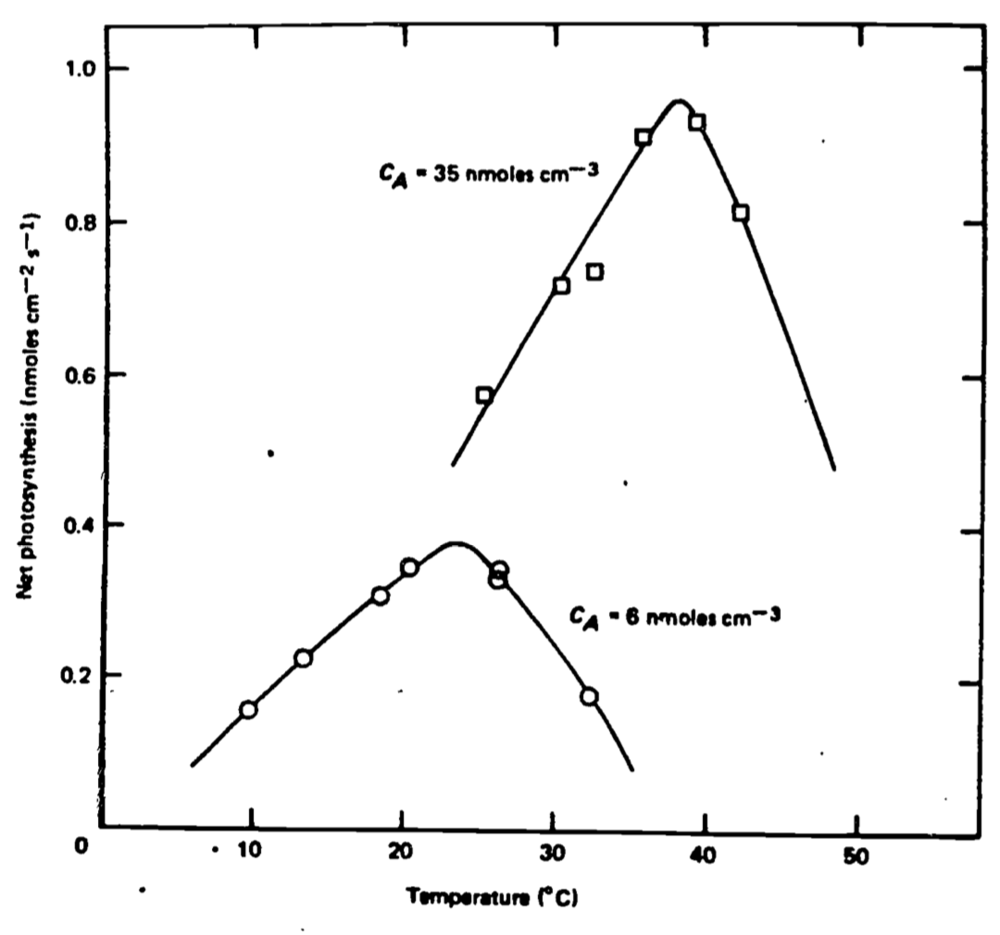

# Transpiration and Leaf Temperature {#transpiration}

Transpiration and Leaf Temperature: Transport Processes

author: Gates, David M.

## Preface {#transpiration-preface}

This module introduces two models of the thermal energy budget of a leaf. The reasoning behind the simple, heat energy budget of a leaf is developed in this module into a detailed explanation of leaf transpiration. Typical values for environment variables and leaf parameters are discussed and simple calculations are made to demonstrate how radiation, convection, and transpiration affect leaf temperature. A graphical method of analysis is used to present a more detailed energy budget model. A problem set explores the consequences of the models. Algebra and some knowledge of heat transfer physics are prerequisites.

## Introduction {#transpiration-intro}

Water is essential to life as we know it on earth. Water acts as a medium for carrying nutrients, ions, and suspended particles from the soil into a plant and as a conducting system within a plant. Most organic tissue is permeable to water and when the external water vapor pressure is less than that inside a plant, water will evaporate from it. Plant leaves have evolved stomates or pores through which to take in carbon dioxide from the surrounding air, but since the water molecule is of lighter molecular weight than the carbon dioxide molecule, it tends to escape readily from the leaf through the stomates. Normally the air in the intercellular spaces within a leaf is at or near saturation. This process of water evaporation from a plant is known as transpiration. Energy is required to convert liquid water to vapor. As a consequence of transpiration, energy is lost by a leaf and the temperature of the leaf is reduced.

Temperature is extremely important to the physiological processes within a leaf including photosynthesis, respiration, growth, cell enlargement and division, protoplasmic streaming, and translocation. Most chemical and biological processes are temperature-dependent and as a general rule, they proceed slowly at relatively low temperatures, speed up in reaction with increased temperature, and at high temperatures become limited or terminated by adverse reactions such as the denaturation of proteins and the breakdown or dissociation of molecules. A typical biological response with temperature is illustrated in Figure \@ref(fig:fig-transpiration-1) for net photosynthesis. Many temperature zone plants have a maximum rate of photosynthesis at about 25 to 30°C while plants of arctic or alpine habitats have an optimum temperature of about 15°C and some plants of extremely hot regions have optima near 40 or 45°C (e.g., Lange et al. 1975, Bjorkman et al. 1972, Billings et al. 1971). When a plant of a cool habitat is functioning optimally at a particular temperature, a plant of a warm habitat will scarcely function at all at that same temperature. Many plant leaves undergo irreversible thermal damage when their temperatures exceed 45 to 48°C while some will not be damaged at 50 or even 55°C and others will be severely denatured at 42°C. Therefore, the temperature of a leaf is always of enormous significance to the viability of it. However, when one wishes to know the temperature of a plant or, in particular, the temperature of a leaf, it is important to ask why and with what accuracy. Is it necessary to know the leaf temperature to an accuracy of 0.1, 0.5, or 1°C, and why? The answer to this question will often determine the method of measurement and the precision necessary, or it will guide one with respect to the detail required in an energy budget calculation.


```{r fig-transpiration-1, echo=FALSE, fig.height=4, fig.show = "hold", out.width = "100%", fig.align = "default", fig.cap='Net photosynthesis versus leaf temperature at high and low carbon dioxide concentration. From Locomen et al. 1975.  P. 41.'}


```

The temperature of a leaf is the result of energy flow between it and its surroundings. A leaf exchanges energy by the basic physical processes of radiation, conduction, convection, and evaporation, all of which go on simultaneously. If a leaf takes in more energy than it puts out, its temperature increases and if it loses more than it gains, the temperature will decrease. When energy in equals energy out, the leaf will maintain a constant temperature.

Once the processes by which a leaf exchanges energy are recognized, it is straightforward to identify the properties of the environment which must be known. In fact, there are only two ways by which an environment interacts with an organism, including a plant leaf, and that is by energy flow or mass flow. In this module, we are dealing with both since the exchange of heat is an energy flow process and the diffusion of water vapor is a gas exchange process which also involves the transport of energy.

The remainder of the module is devoted to developing and analyzing simple models of how a leaf exchanges thermal energy with the environment. Although our knowledge of leaf morphology and physiology is more detailed than what is included in the models, the level of description here is sufficiently general to provide valuable insights.

In the following pages, the reader is formally introduced to the leaf energy budget. Typical values for environment variables and leaf parameters are discussed. Some simple calculations are then made to see how radiation, convection and transpiration affect leaf temperature.

The graphical method of analysis used by Gates (1968) is then employed to understand a more detailed energy budget model. Problems with accompanying solutions conclude the chapter. 

## Leaf Energy Budget {#transpiration-leafenergy}

Radiation incident upon a leaf includes shortwave radiation in the form of direct sunlight, skylight and reflected light, and longwave radiation emitted by the atmosphere and clouds, or by the surfaces of ground, nearby plants, and other objects.

A plant may absorb 40 to 80 percent of incident sunlight and skylight and it will absorb 96 percent of incident longwave thermal radiation. A plant leaf redistributes this absorbed radiation by emitting a substantial amount of it as longwave radiation from the leaf surface. The remainder is partitioned into convective and evaporative heat exchange and a very small amount is utilized for photosynthesis. Only certain wavelengths of light are effective for photosynthesis. The amount of energy converted to biomass is very small (a few percents of the incident sunlight at most) and may be neglected in considerations of the energy budget of a leaf. The amount of radiation emitted by a leaf is proportional to the fourth power of the absolute temperature of the leaf surface. This phenomenological relation is known as the black body radiation law and is written $R = \sigma[T+273]^4$.

The flow of heat by convection is proportional to the temperature difference between the leaf and the air. Convective heat transfer is proportional to the wind speed and varies inversely with the characteristic dimension of the leaf which affects the boundary layer thickness. Because of the viscosity of air, there is an air layer which adheres to any surface, including that of a leaf known as a "boundary layer." When the wind blows, the boundary layer of viscous air represents a transition zone between zero air flow at the leaf surface to free air flow at some distance from the leaf. A temperature difference may exist across a boundary layer of air and it is across this that heat moves from the leaf to the air by conduction and convection. The larger a leaf, the thicker the boundary layer of air adhering to the surface. A small leaf will have a boundary layer about 1 mm thick and a large leaf, like a banana leaf, will have a boundary layer of 1 or 2 cm thickness. It happens that for broad flat leaves the rate of heat transfer by convection is proportional to the square root of the ratio of wind speed to leaf dimension. Increase wind speed fourfold and the rate of convective heat exchange will increase twofold or increase leaf dimension fourfold and convection will decrease twofold. The characteristic dimension is approximately the average width of the leaf. Although the length of a leaf affects convection, we use a single characteristic dimension given by the leaf width here for simplicity. The more complex relationship involving leaf width and length is introduced later.

The transpiration rate is determined by the water vapor pressure or density difference between leaf and air. This relationship is described in more detail in the next two sections. Energy is required to convert liquid water to vapor and the amount of energy is known as the latent heat of water. It is temperature-dependent but at 30°C its value is $2.43 \times 10^6 J kg^{-1}$. Each of the environmental variables affect the leaf energy status simultaneously. They are radiation, air temperature, wind speed, and water vapor pressure, density, or relative humidity. A plant leaf responds to these by assuming a certain temperature and by losing water at a particular rate depending upon the properties of the leaf. Once the energy budget relationship is written, the student will see how it is that each of these environmental variables enter the common energy pool for the leaf.

The steady state energy budget for a leaf is 
where
<ul class="list-unstyled">
<li> Thermal energy gained = Thermal energy lost </li>
<li> Absorbed radiation = Reradiation + Convection + Evaporation </li>
</ul> 

\begin{equation} 
Q_a = \varepsilon \sigma T_l + 273^4 + k_1 + \bigg(\frac{V}{D}\bigg)^{\frac{1}{2}} [ T_l - T_a ] + L (T_l) E
(\#eq:transpiration-1)
\end{equation} 
  
where
<ul class="list-unstyled">
<li> $Q_a$ = total amount of radiation absorbed in $W m^{-2}$, </li>
<li> $\varepsilon$ = emissivity of leaf surface to longwave radiation, </li>
<li> $\sigma$ = (Stefan-Boltzmann constant) $5.67 \times 10^{-8} W m^{-2} K^{-4}$, </li>
<li> $T_l$ = leaf temperature in $^{\circ}C$, </li>
<li> $k_1$ = $9.14 J m^{-2} s^{-1/2}-11 ^{\circ}C^{-1}$, </li>
<li> $v$ = wind speed in $m s^{-1}$, </li>
<li> $D$ = leaf width in $m$, </li>
<li> $T_a$ = air temperature in $^{\circ}C$, </li>
<li> $L(T_l)$ = latent heat of vaporization of water in $Jkg^{-1}$ as a function of leaf temperature and is equal to $2.43 \times 10^6$ at $30^{\circ}C$ and $2.50 \times 10$ at $0^{\circ}C$, </li>
<li> $E$ is transpiration rate in $kg m^{-2} \times s^{-1}$ </li>
</ul>

For any given value of $E$, a specific value of $T_l$ will balance Equation \@ref(eq:transpiration-1), provided all other quantities are known. However, $E$ depends on a unique set of environmental variables. It is seen in the next paragraphs that $E$ is a function of $T_l$. Therefore, it is possible to determine $E$ and $T_l$ simultaneously. If the air temperature is warmer than the leaf temperature, heat is gained by convection rather than lost and this term becomes negative on the right-hand side of the energy budget equation.

### Resistance to Water Loss {#transpiration-waterloss}

There are three requirements for the loss of water from a leaf. There must be water available in the leaf, there must be energy available to convert liquid water to vapor, and finally, there must be a vapor pressure or density gradient along which water vapor may flow from inside to outside the leaf beyond the boundary layer of air which adheres to the leaf surface. Liquid water at the mesophyll cell walls within the leaf is vaporized and from the intercellular spaces, this water vapor passes out of the leaf by diffusion through the stomates or through the leaf cuticle. Usually, the cuticle is coated with a wax layer which is relatively impervious to water and as a result most of the water lost from a leaf is through the stomates. As with fluid passing through any tube or pipe, there is resistance to vapor flow by viscous drag with the walls. The resistance to water vapor diffusion through the substomatal and stomatal spaces with the leaf is $r_l$ in $s m^{-1}$ and represents an average value for the entire leaf. In addition, the water vapor must diffuse across a boundary layer of air adhering to the leaf surface and this offers a resistance $r_a$ given in $s m^{-1}$. The boundary layer resistance is affected by the wind speed across the leaf. In fact, the greater the wind speed the thinner the boundary layer thickness; and hence, diffusion resistance is greater on large leaves than on small leaves. Experimental results show that the boundary layer resistance varies directly as the square root of the leaf dimension (width) $D$ and inversely with the square root of the wind speed $V$, a relationship which is precisely the inverse of the influence of wind speed and leaf dimension on the exchange of heat by convection. Therefore, the boundary layer resistance $r_a$ is given by
\begin{equation} 
r_a = k_2 \bigg(\frac{D}{V}\bigg)^{1/2}
(\#eq:transpiration-2)
\end{equation} 

Although there are complexities concerning air flow about a leaf which cause $k_2$ to change its value for leaves of characteristic dimension less than $0.005 m$, we shall use a single value here for all leaf dimensions. $k_2 = 200 s^{1/2-1}m^{-1}$ when $D$ is in $m$ and $V$ is $m s^{-1}$. Since the ratio of $D/V$ is involved here, nothing is changed if $D$ is in $cm$ and $V$ in $cm s^{-1}$.

### Transpiration Rate {#transpiration-rate}

The rate at which water vapor will diffuse out of a leaf will depend directly on the difference in water vapor density inside and outside the leaf, just as the rate at which water will flow downhill depends on the difference in height between the top and bottom of the hill.

For the moment, it is assumed that the air in the intercellular air spaces inside the leaf is at saturation at the temperature of the leaf and has a saturation density $_s d_l (T_l)$. The air outside the leaf and beyond the boundary layer has a water vapor density equal to $[r.h.] \times _sd_a (T_a)$, where  $r.h$. is the relative humidity and $_sd_a (T_a)$ is the saturation water vapor density of the air as a function of the air temperature. The relative humidity is, by definition, the ratio of the actual water vapor density of the air to the saturation density. Usually, it is given in percent, but as used here, it is a decimal fraction. The rate of water loss from a leaf per unit area per unit time is equal to the gradient for water vapor density divided by the resistance to water vapor movement and is given by 
\begin{equation} 
E = \frac{_s d_l (T_l) - [r.h.]_s d_a (T_a)}{r_l + r_a}
(\#eq:transpiration-3)
\end{equation} 

where $r_a$ is given by Equation \@ref(eq:transpiration-2). Here, if $_s d_l (T_l)$ and $_s d_a (T_a)$ are given in kg m^-3^ and $r_l$, and $r_a$ in s m^-1^, then $E$ is in kg m^-2^s^-1^. 

## Complete Energy Budget {#transpiration-energybudget}
By substituting Equation \@ref(eq:transpiration-3) into Equation \@ref(eq:transpiration-1), and including the expression given by Equation \@ref(eq:transpiration-2) in Equation \@ref(eq:transpiration-3), one gets for the full expression of the leaf energy budget the following: 

\begin{equation} 
Q_a = \varepsilon \sigma [T_l + 273]^4 + k_1 \bigg( \frac{V}{D}\bigg)^{1/2} [T_l - T_a] + L(T_l) \frac{_s d_l (T_l) - [r.h.]_s d_a (T_a)}{r_l + k_2 \big( \frac{D}{V}\big)^{1/2}}
(\#eq:transpiration-4)
\end{equation} 

Here all environmental variables that affect the energy status of the leaf act simultaneously. They are $Q_a$, $T_a$, $\varepsilon$, $D$, and $r_l$ while the absorptivity of the leaf surface to radiation is buried in the term $Q_a$. When all the environmental variables and appropriate leaf properties are known, a unique value of $T_l$, will balance this equation.

### Values of Leaf Parameters {#transpiration-leafparam}

Leaves are of many sizes from 1.0 $\times$ 10^-3^ m by 2.0 $\times$ 10^-2^ m for a Douglas fir needle to 0.3 m by 1.5 m for a banana leaf. Some leaves will have lengths very nearly equal to their widths. Internal diffusion resistances of leaves vary from less than 100 s m^-1^ to infinity but with commonly occurring values between 200 and 2000 s m^-1^. Most leaves will have an absorptivity to shortwave radiation of about 0.6, but it may vary from 0.4 to 0.8. Longwave absorptivity will equal the longwave emissivity of 0.96. The total amount of radiation absorbed by a leaf will vary from about 400 to 800 W m^-2^ but higher and lower amounts may be encountered.

### Values of the Environmental Variables {#transpiration-envvars}

It is relatively easy for any of us to visualize the range of values for air temperature. A leaf is likely to encounter freezing when the air temperature is 0°C. Maximum air temperature for hot desert conditions, for example, would be about 45°C. Relative humidity is also easy to visualize as a result of common experience. For example, humid air would have a relative humidity of about 70% or greater and for very dry air r.h. = 30% or less. It is easy for one to look up in tables the water vapor density of saturated air at any particular temperature. Values range from 1.289 kg m^-3^ at 0°C to 1.068 kg m^-3^ at 45°C. Wind speeds are a part of common experience. Still air usually has very slight air movement which we arbitrarily put at 0.1 m s^-1^. A gentle breeze is 1.0 m s^-1^ (2.2 mph) and a moderate wind is 10 m s^-1^ (22 mph). Radiation is the least familiar of all of the environmental variables and yet it is the most significant of them.

***

## Influence of Energy Components on Leaf Temperature {#transpiration-energycomponents}

It is useful to evaluate the major components separately of the leaf energy budget in order to get a feeling for their values and influence. If a non-transpiring leaf is in a vacuum, its temperature is determined solely by radiative exchange and its energy budget is
\begin{equation} 
Q_a = \varepsilon \sigma [T_l + 273]^4
(\#eq:transpiration-5)
\end{equation} 

Let $\varepsilon = 0.96$. 

```{r}
#radiation only
epsilon=0.96
sigma= 5.67 * 10^{-8} #Stefan-Boltzmann's constant (W m^-2K^-4)
#Q_a is total amount of radiation absorbed in W m^-2

f <- function(T_l, Q_a=800) epsilon *sigma*(T_l + 273)^4 - Q_a
uniroot(f, interval=c(-100, 100))$root

f <- function(T_l, Q_a=600) epsilon *sigma*(T_l + 273)^4 - Q_a
uniroot(f, interval=c(-100, 100))$root

f <- function(T_l, Q_a=400) epsilon *sigma*(T_l + 273)^4 - Q_a
uniroot(f, interval=c(-100, 100))$root
```

As calculated above, if $Q_a = 800 W m^{-2}$, $T_l = 75.2 ^\circ$ C; $600 W m^{-2}$, $T_l = 51.1 ^\circ C$; and $Q_a = 400 W m^{-2}, T_l = 19.8 ^\circ C$. A leaf temperature of 75°C is very warm indeed and no plants as we know them would survive such a temperature. Even at 51°C, most plants would sustain serious heat damage. However, plants live in air, a fluid, which flows about the plant and takes away excess heat by convection. Just as a plant loses heat by radiation, it must lose heat by convection as well, and this it cannot avoid. We shall now determine the extent to which a plant leaf may have its temperature influenced by convection.

If the non-transpiring leaf is placed in air, the leaf temperature is significantly affected by the air temperature. If the ratio $V/D$ is large, convection becomes very significant and the leaf temperature is tightly coupled to the air temperature. Large $V/D$ suggests high wind speeds or small leaf dimension. If $V/D$ is small, the leaf temperature is less strongly affected by the air temperature, but still it is significantly influenced. The energy budget is given by 
\begin{equation} 
Q_a = \varepsilon \sigma [T_l + 273]^4 + k_1 \bigg( \frac{V}{D} \bigg)^{1/2} [T_l - T_a] 
(\#eq:transpiration-6)
\end{equation} 

If the air temperature is $30°C$, one can determine the exact numerical relationship between $Q_a$ and $T_l$ for any given ratio $V/D$. For example, we will determine values of $T_l$ for $Qa$ = 800, 600, and 400 W m^-2^ for $V/D$ = 1.0, 10.0, and 100 below. These values are listed in Table 11.1.

```{r, }
#radiation and convection
epsilon=0.96
sigma= 5.67 * 10^{-8} #Stefan-Boltzmann's constant (W m^-2K^-4)
k1=9.14 #an experimentally determined coefficient 
        #(J m^-2 s^-0.5 °C^-1)

#Q_a is total amount of radiation absorbed in W m^-2
#estimate root with radiation and convection
rc_root= function(VDratio1, Q_a1){
  f <- function(T_l, VDratio=VDratio1, Q_a=Q_a1, T_a=30) epsilon *
    sigma * (T_l + 273)^4 + k1 * (VDratio)^0.5 * (T_l - T_a) - Q_a
uniroot(f, interval=c(-100, 100))$root
  }

rc_mat= rbind( sapply( c(1,10,100), FUN=rc_root, Q_a1=800), 
               sapply( c(1,10,100), FUN=rc_root, Q_a1=600), 
               sapply( c(1,10,100), FUN=rc_root, Q_a1=400) )
colnames(rc_mat)=c('V/D=1', 'V/D=10', 'V/D=100') 
rc_mat

```

```{r tab-transpiration-1, echo=FALSE}
knitr::kable(
  rc_mat, booktabs = TRUE, caption='Leaf temperature.'
)
```


>Table 11.2. Leaf temperature in °C for various amounts of absorbed radiation exchanged by radiation only, by radiation and convection, and by radiation, convection, and transpiration. Values of variables used are $Ta=30°C$, r.h.=50%, and $r_l$ = 100 s m^-1^. The addition of convective exchange to the energy budget will decrease the difference between leaf temperature and air temperature compared to the leaf temperature computed when only radiation is included. As the ratio $V/D$ increases, the magnitude of the difference between leaf temperature and air temperature decreases. Note that if absorbed radiation levels are above black body value (for $Q_a$ = 800 and 600 W m^-2^ because here black body level is $Q_a=\sigma T_a= 5.67\times 10^{-8} \times (273+30)^4 = 478 W m^{-2}$. $T_l-T_a$ is positive and if $Q_a$ is below the black body value $T_l$ -$T_a$ is negative. If transpiration is included, it will reduce all leaf temperatures from the values computed when only radiation and convection transfer are included.

```{r tab-transpiration-2, echo = FALSE, message=FALSE, warnings=FALSE, results='asis'}
tabl <- "
| $Q_a$ (W m^-2^) | Radiation only | Radiation and convection $V/D$ (s^-1^) |      |       | Radiation, convection, and transpiration $V/D$ (s^-1^) |      |       |
|:---------------:|:--------------:|:--------------------------------------:|:----:|:-----:|:------------------------------------------------------:|:----:|:-----:|
|                 |                |                   1.0                  | 10.0 | 100.0 |                           1.0                          | 10.0 | 100.0 |
|       800       |      75.2      |                  61.5                  | 39.7 |  33.5 |                          36.8                          | 31.8 |  30.3 |
|       600       |      51.1      |                  39.1                  | 34.0 |  31.2 |                          30.4                          | 28.5 |  28.7 |
|       400       |      19.8      |                  26.1                  | 28.3 |  29.4 |                          23.0                          | 24.9 |  27.1 |
"
cat(tabl)
```

For $V/D = 1.0$, simply placing the non-transpiring leaf in air of temperature 30°C dropped the leaf temperature from 75.2 to 61.5°C at $Q_a = 800 W m^{-2}$, a decrease of 13.7°C. Clearly, convection may play a very strong role in influencing leaf temperature. If $V/D = 10.0$, the decrease is, of course, even more dramatic. At $Q_a = 800 W m^{-2}$ and $T_a$ = 30°C, $T_l$ = 39.7°C, there is a decrease of 35.5°C from the pure radiation regime. If $V/D = 100$ and $Q_a = 800 W m^{-2}$, the leaf temperature is 33.5°C with convection, a change of 41.7°C.

We tend to forget the significance of convection in the ordinary world but when we make comparisons of this kind to show what would happen to leaf temperature without convective cooling, the influence of convection becomes very clear. At lower amounts of absorbed radiation, the influence of convection is less strong, but still important until the leaf temperature is equal to the air temperature. Then, when the quantity of absorbed radiation is very low, which will occur for an exposed leaf on a clear night, the leaf temperature is below the air temperature and convection will deliver heat to the leaf, thereby, warming it. This is seen in Table 11.1 for $Q_a = 400 W m^{-2}$; when, without convection, the non-transpiring leaf had a temperature of 19.8°C, and the in air at 30°C, the leaf temperature increased to 26.1, 28.3, and 29.4°C, respectively, at $V/D$ = 1.0, 10.0, and 100.0.

The influence of transpiration is now readily seen by including the transpiration term in the full energy budget expression as given in Equation \@ref(eq:transpiration-4). Now one must decide on a value for the internal resistance of a leaf and the relative humidity of the air. Let $r_l = 100 s m^{-1}$ and $r.h. = 50$%. It is more difficult to solve Equation \@ref(eq:transpiration-4) then it is to solve Equations \@ref(eq:transpiration-5) or \@ref(eq:transpiration-6). Graphical methods are possible although cumbersome. It is far easier to use a calculator or a computer and this is now done. The values are listed in Table 11.1.

At $Q_a = 800 W m^{-2}$, $T_l$ = 36.8, 31.8, or 30.3°C for $V/D$ = 1.0, 10.0, and 100.0, respectively. Hence, transpiration has reduced the leaf temperature by 24.7, 7.9, and 3.2°C for the three ratios of $V/D$, as shown by comparing the values listed in columns 6, 7, and 8 with those in columns 3, 4, and 5. These temperature reductions caused by transpiration are quite striking and would be significant in terms of photosynthetic and respiration rates. At lower levels of absorbed radiation, the influence of transpiration if reduced, since there is less energy available for the evaporation of water. Transpiration always produces leaf temperatures lower than the case of radiation and convection only.

## More Detailed Energy Budget {#transpiration-details}

So far, the energy budget equation has contained only the leaf width as the characteristic dimension for convective heat transfer and gas diffusion. Such a simple expression is only strictly correct for leaves which are nearly square; however, relatively few leaves are of this form. Most leaves have a long dimension which is considerably greater than the narrow dimension. Some years ago, Gates (1968) reported investigations of the heat and water vapor transfer from simulated leaves of blotting paper of a variety of lengths and widths. He found if $D$ is the characteristic dimension of the leaf in the direction of air flow and W is the dimension transverse to the wind, that the energy budget is given by
\begin{equation} 
Q_a = \varepsilon \sigma [T_l + 273]^4 + k_1 \bigg( \frac{V}{D} \bigg)^{1/2} [T_l - T_a] + L(T_l \frac{_sd_l(T_l)-r.h. {_sd_a(T_a)}}{r_l + k_2 [D^{0.30}W^{0.20}]/V^{0.50}})
(\#eq:transpiration-7)
\end{equation} 

where
$k_1 = 9.14 J m^{-2} s^{-1/2} °C^{-1}$ and $k_2=183 s^{-1/2} m^{-1}$

Gates elected to include W in the evaporation term only since the amount of data was not sufficient to reveal the functional relationship in both the convective and evaporative terms simultaneously. Equation \@ref(eq:transpiration-7) is more realistic than Equation \@ref(eq:transpiration-4), which, nevertheless, is a good approximation. If the wind is blowing across the leaf in the direction of the leaf width, then, the characteristic dimension $D$ is the average leaf width and $W$ is the average length. If, on the other hand, the wind is blowing along the length of the leaf, then, $D$ is the average length and $W$ is the average leaf width.

## Analysis of General Model {#transpiration-genmodel}

### Calculations of Leaf Temperatures and Transpiration {#transpiration-tempandtranspir}

It is straightforward to obtain values of the two dependent variables, leaf temperatures and transpiration rate, as a function of any conceivable combination of values of the independent variables and leaf parameters which appear in Equation \@ref(eq:transpiration-7). The four independent variables used are radiation absorbed, air temperature, relative humidity of the air, and wind speed; and the three leaf parameters are characteristic dimension, leaf width and internal resistance. Gates and Papian (1971) published a tabulation of leaf temperatures and transpiration rates for various sets of values of the dependent variables and leaf parameters. Similar plots are shown in a paper by Gates (1968). These plots have proved useful in understanding Equation \@ref(eq:transpiration-7), and therefore at this time we will undertake an explanation of how they are produced.

Let us begin by specifying $Q_a = 800 W m^{-2}, T_a = 40°C, r.h. = 0.20, D = 0.05 m, W = 0.05 m, r_a = 0.0s m^{-1}$, and $V = 0.10 m s^{-1}$. Now all the parameter values of Equation \@ref(eq:transpiration-7) are known except leaf temperature. We solve for leaf temperature and then calculate transpiration rate using the last term of equation \@ref(eq:transpiration-7). We examine the influence of varying wind speed and leaf resistance on transpiration as follows:


```{r fig-transpiration-2, fig.height=4, fig.show = "hold", out.width = "100%", fig.align = "default", fig.cap='Leaf transpiration verses leaf temperature.'}
#radiation, convection, and evaporation
epsilon=0.96
#Stefan-Boltzmann's constant (W m^{-2}K^{-4})
sigma= 5.67 * 10^{-8} 
#k1 is an experimentally determined coefficient ($9.14 J m^{-2} s^{-0.5} {^{\circ}C^{-1}}$)
k1=9.14
#k2 is an experimentally determined coefficient ($183 s^{0.5} m^{-1}$)
k2=200 
#L, latent heat of vaporiation of water in J kg^{-1}, 2.43x10^6 at 30°C and 2.5*10^6 at 0°C
L=2.26*10^6 

#calculate saturation vapor density
#' VAPPRS
#'
#' Calculates saturation vapour pressure for a given air temperature.
#' @param db Dry bulb temperature (°C)
#' @return esat Saturation vapour pressure (Pa)
#' @export
VAPPRS <- function(db=db){
  t=db+273.16
  loge=t
  loge[t<=273.16]=-9.09718*(273.16/t[t<=273.16]-1.)-3.56654*log10(273.16/t[t<=273.16])+
    .876793*(1.-t[t<=273.16]/273.16)+log10(6.1071)
  loge[t>273.16]=-7.90298*(373.16/t[t>273.16]-1.)+5.02808*log10(373.16/t[t>273.16])-
    1.3816E-07*(10.^(11.344*(1.-t[t>273.16]/373.16))-1.)+8.1328E-03*
    (10.^(-3.49149*(373.16/t[t>273.16]-1.))-1.)+log10(1013.246)
  esat=(10.^loge)*100
  return(esat)
}

#Solve vapour density
#rh: relative humidity, decimal%
#T: temperature, °C
#return Vapour density (kg m^{-3})
vd= function(T,rh){
rh=rh*100
  tk = T + 273.15
esat = VAPPRS(T)
e = esat * rh / 100
e * 0.018016 / (0.998 * 8.31434 * tk)
}

#____________
#Estimate T_l then estimate transpiration
est_TlTrans <- function(T_a=40, V=0.1, rh=0.2, r_l=0, D=0.05, W=0.05, Q_a=800) {
f<- function(T_l) epsilon *sigma*(T_l + 273)^4 + k1*(V/D)^0.5*(T_l-T_a) + 
  L*(vd(T_l, rh)-rh*vd(T_a, rh))/(r_l + k2*(D^{0.3}*W^{0.20})/ V^{0.50})- Q_a
T_l=uniroot(f, interval=c(-100, 100))$root

#estimate transpiration
E=(vd(T_l, rh)-rh*vd(T_a, rh))/(r_l + k2*(D^{0.3}*W^{0.20})/ V^{0.50})
return(c(T_l, E))
}
#----

#Vary V
par(mar = c(5, 5, 3, 5))
fig2a=sapply( seq(0.1,6.1,0.2), FUN=est_TlTrans, T_a=40, rh=0.2, 
              r_l=0, D=0.05, 
              W=0.05, Q_a=800)
plot(fig2a[1,], fig2a[2,], type="l", xlab="Leaf temperature (°C)", 
     ylab= expression("Leaf transpiration (kg / " * m^2 * "s)"))

#Vary r_l
fig2b=sapply( seq(0,600,10), FUN=est_TlTrans, T_a=40, V=2.1, rh=0.2, 
              D=0.05, W=0.05, Q_a=800)
points(fig2b[1,], fig2b[2,], type="l", col="red")

legend("topright", c("Vary windspeed", "Vary leaf resistance"), 
       col = c("black", "red"), lty=c(1), bty = "n")
```

### Sample Plots of Transpiration and Leaf Temperature {#transpiration-sampleplots}

It is possible to select as changing variables in the graph any two of the following independent variables and leaf parameters: amount of radiation absorbed, air temperature, wind speed, relative humidity, leaf dimensions, and diffusion resistance. For our first example, we shall use, as changing variables, wind speed and internal diffusion resistance. Let wind speed values be 0.1, 2.1, 4.1, and 6.1 ms^-1^, and internal diffusion resistance values be 0, 200, 400, and 600 sm^-1^.

A leaf size of $0.05 \times 0.05 m$ is selected for the first examples. 
Plots are generated for the following conditions:

3) $Q_a = 800 W m^{-2}; T_a = 40^\circ C; r.h. = 0.20$
4) $Q_a = 700 W m^{-2}; T_a = 30^\circ C; r.h. = 0.20$
5) $Q_a = 700 W m^{-2}; T_a = 30^\circ C; r.h. = 0.80$
6) $Q_a = 300 W m^{-2}; T_a = 10^\circ C; r.h. = 0.50$

We create the plots in R:

```{r fig-transpiration-3, echo=FALSE, fig.height=4, fig.show = "hold", out.width = "100%", fig.align = "default", fig.cap='Leaf transpiration versus leaf temperature.'}
#Vary V and r_l
#fig 3
par(mar = c(5, 5, 3, 5))
fig.vr=sapply( seq(0,600,100), FUN=est_TlTrans, T_a=40, rh=0.2, V=0.1, D=0.05, W=0.05, Q_a=800)
plot(fig.vr[1,], fig.vr[2,], type="l", col='tomato', xlab="Leaf temperature (°C)", ylab= expression("Leaf transpiration (kg / " * m^2 * "s)"), xlim=range(35,55),ylim=range(0.0,0.0004))
fig.vr=sapply( seq(0,600,100), FUN=est_TlTrans, T_a=40, rh=0.2, V=2.1, D=0.05, W=0.05, Q_a=800)
points(fig.vr[1,], fig.vr[2,], type="l", col='tomato2')
fig.vr=sapply( seq(0,600,100), FUN=est_TlTrans, T_a=40, rh=0.2, V=4.1, D=0.05, W=0.05, Q_a=800)
points(fig.vr[1,], fig.vr[2,], type="l", col='tomato3')
fig.vr=sapply( seq(0,600,100), FUN=est_TlTrans, T_a=40, rh=0.2, V=6.1, D=0.05, W=0.05, Q_a=800)
points(fig.vr[1,], fig.vr[2,], type="l", col='tomato4')

fig.vr=sapply( seq(0.1,6.1,0.2), FUN=est_TlTrans, T_a=40, rh=0.2, r_l=0, D=0.05, W=0.05, Q_a=800)
points(fig.vr[1,], fig.vr[2,], type="l", col='skyblue', lty="dashed")
fig.vr=sapply( seq(0.1,6.1,0.2), FUN=est_TlTrans, T_a=40, rh=0.2, r_l=200, D=0.05, W=0.05, Q_a=800)
points(fig.vr[1,], fig.vr[2,], type="l", col='skyblue2', lty="dashed")
fig.vr=sapply( seq(0.1,6.1,0.2), FUN=est_TlTrans, T_a=40, rh=0.2, r_l=400, D=0.05, W=0.05, Q_a=800)
points(fig.vr[1,], fig.vr[2,], type="l", col='skyblue3', lty="dashed")
fig.vr=sapply( seq(0.1,6.1,0.2), FUN=est_TlTrans, T_a=40, rh=0.2, r_l=600, D=0.05, W=0.05, Q_a=800)
points(fig.vr[1,], fig.vr[2,], type="l", col='skyblue4', lty="dashed")

legend("top", c("V=0.1", "V=2.1","V=4.1","V=6.1"), col = c('tomato','tomato2','tomato3','tomato4'), lty=c(1), bty = "n")
legend("topright", c("r_l=0", "r_l=200","r_l=400","r_l=600"), col = c('skyblue','skyblue2','skyblue3','skyblue4'), lty='dashed', bty = "n")
```


Figure \@ref(fig:fig-transpiration-3) has many interesting features. It is characteristic of a hot, dry, high intensity radiation environment, such as one finds in a desert. In still air, represented by $V = 0.1 m s^{-1}$, a leaf with a high diffusion resistance becomes very warm. For $r_l = 600 s m^{-1}, T_l = 45°C$, but if $r_l = \infty$, $T_l$, is nearly $15^\circ C$ above the air temperature of $40^\circ C$. This can only be obtained by extrapolating the straight line for $V = 0.1 m s^{-1}$ to where it intersects the temperature axis at zero transpiration. It is evident that all the constant wind speed lines intersect and cross over at $T_l=T_a= 40^\circ C$. Note the small decrease in transpiration rate for $r_l = 600 s m^{-1}$ when $T < 42^\circ C$ and the wind speed has increased to $V = 2.1, 4.1,$ and $6.1 m s^{-1}$. This is an interesting phenomenon and should be understood by the reader. Look at Equation \@ref(eq:transpiration-7) and consider the effect of increased wind speed. An increase of $V$, when the leaf temperature is above the air temperature, produces a decrease of leaf temperature by convective cooling. The increased wind speed also diminishes the thickness and resistance of the leaf boundary layer. This, by itself, would cause the transpiration rate to increase. However, the convective cooling of the leaf caused the water vapor pressure inside the leaf to drop and that produces a reduction of transpiration. In effect, what happens is that there is a greater reduction of the numerator in the evaporation term of Equation \@ref(eq:transpiration-7) (the driving force) than there is of the denominator (the resistive force). This phenomenon shows up at relatively high values of internal leaf resistance. At lower leaf resistance values, of $400 s m^{-1}$, when the wind speed increases the transpiration rate increases and the line of constant internal leaf resistance turns upward with wind speeds greater than about $1 m s^{-1}$ (see Figure \@ref(fig:fig-transpiration-3), line 3).

Now consider what happens when the leaf diffusion resistance is small, e.g., $200 sm^{-2}$. Here in Figure \@ref(fig:fig-transpiration-3), the line at constant $r_l = 200 s m^{-1}$ is doubled valued in $E$ for certain $T_l$. The line curves back on itself as wind speed increases. At first, as the wind speed increases from $0.1 m s^{-1}$ to about $1.0 m s^{-1}$, the leaf temperature decreases as the transpiration rate increases, but at higher wind speeds; although the transpiration rate continues to increase, the leaf temperature begins to increase. At very high wind speeds, it would approach the air temperature because convection is transferring heat to the leaf since the air is warmer than the leaf. A general feature of Figure \@ref(fig:fig-transpiration-3) is that for hot, dry, high radiation conditions, a leaf is warmer than the air temperature if the internal diffusion resistance is above a certain value-- here, estimated at about $300 s m^{-1}$. If the leaf resistance is less than this value, the leaf temperature is below the air temperature.

```{r fig-transpiration-4, echo=FALSE, fig.height=4, fig.show = "hold", out.width = "100%", fig.align = "default", fig.cap='Leaf transpiration versus leaf temperature.'}
#fig 4
par(mar = c(5, 5, 3, 5))
fig.vr=sapply( seq(0,600,100), FUN=est_TlTrans, T_a=30, rh=0.2, V=0.1, D=0.05, W=0.05, Q_a=700)
plot(fig.vr[1,], fig.vr[2,], type="l", col='tomato', xlab="Leaf temperature (°C)", ylab= expression("Leaf transpiration (kg / " * m^2 * "s)"), xlim=range(25,45),ylim=range(0.0,0.0003))
fig.vr=sapply( seq(0,600,100), FUN=est_TlTrans, T_a=30, rh=0.2, V=2.1, D=0.05, W=0.05, Q_a=700)
points(fig.vr[1,], fig.vr[2,], type="l", col='tomato2')
fig.vr=sapply( seq(0,600,100), FUN=est_TlTrans, T_a=30, rh=0.2, V=4.1, D=0.05, W=0.05, Q_a=700)
points(fig.vr[1,], fig.vr[2,], type="l", col='tomato3')
fig.vr=sapply( seq(0,600,100), FUN=est_TlTrans, T_a=30, rh=0.2, V=6.1, D=0.05, W=0.05, Q_a=700)
points(fig.vr[1,], fig.vr[2,], type="l", col='tomato4')

fig.vr=sapply( seq(0.1,6.1,0.2), FUN=est_TlTrans, T_a=30, rh=0.2, r_l=0, D=0.05, W=0.05, Q_a=700)
points(fig.vr[1,], fig.vr[2,], type="l", col='skyblue', lty="dashed")
fig.vr=sapply( seq(0.1,6.1,0.2), FUN=est_TlTrans, T_a=30, rh=0.2, r_l=200, D=0.05, W=0.05, Q_a=700)
points(fig.vr[1,], fig.vr[2,], type="l", col='skyblue2', lty="dashed")
fig.vr=sapply( seq(0.1,6.1,0.2), FUN=est_TlTrans, T_a=30, rh=0.2, r_l=400, D=0.05, W=0.05, Q_a=700)
points(fig.vr[1,], fig.vr[2,], type="l", col='skyblue3', lty="dashed")
fig.vr=sapply( seq(0.1,6.1,0.2), FUN=est_TlTrans, T_a=30, rh=0.2, r_l=600, D=0.05, W=0.05, Q_a=700)
points(fig.vr[1,], fig.vr[2,], type="l", col='skyblue4', lty="dashed")

legend("top", c("V=0.1", "V=2.1","V=4.1","V=6.1"), col = c('tomato','tomato2','tomato3','tomato4'), lty=c(1), bty = "n")
legend("topright", c("r_l=0", "r_l=200","r_l=400","r_l=600"), col = c('skyblue','skyblue2','skyblue3','skyblue4'), lty='dashed', bty = "n")
```

Figure \@ref(fig:fig-transpiration-4) represents leaf temperature and transpiration rates for warm, dry, moderate radiation conditions, with $V$ and $r_l$ as changing quantities. Only leaves with relatively low internal resistance have temperature less than the air temperature. Leaves with resistances of about $200 s m^{-1}$ or greater will be from 0 to about 8°C above air temperature, depending on the wind speed (Figure \@ref(fig:fig-transpiration-4)). Where does the line of zero internal diffusion resistance show up in this figure or is it beyond the scale used?

```{r fig-transpiration-5, echo=FALSE, fig.height=4, fig.show = "hold", out.width = "100%", fig.align = "default", fig.cap='Leaf transpiration versus leaf temperature.'}
#fig 5
par(mar = c(5, 5, 3, 5))
fig.vr=sapply( seq(0,600,100), FUN=est_TlTrans, T_a=30, rh=0.8, V=0.1, D=0.05, W=0.05, Q_a=700)
plot(fig.vr[1,], fig.vr[2,], type="l", col='tomato', xlab="Leaf temperature (°C)", ylab= expression("Leaf transpiration (kg / " * m^2 * "s)"), xlim=range(25,45),ylim=range(0.0,0.0002))
fig.vr=sapply( seq(0,600,100), FUN=est_TlTrans, T_a=30, rh=0.8, V=2.1, D=0.05, W=0.05, Q_a=700)
points(fig.vr[1,], fig.vr[2,], type="l", col='tomato2')
fig.vr=sapply( seq(0,600,100), FUN=est_TlTrans, T_a=30, rh=0.8, V=4.1, D=0.05, W=0.05, Q_a=700)
points(fig.vr[1,], fig.vr[2,], type="l", col='tomato3')
fig.vr=sapply( seq(0,600,100), FUN=est_TlTrans, T_a=30, rh=0.8, V=6.1, D=0.05, W=0.05, Q_a=700)
points(fig.vr[1,], fig.vr[2,], type="l", col='tomato4')

fig.vr=sapply( seq(0.1,6.1,0.2), FUN=est_TlTrans, T_a=30, rh=0.8, r_l=0, D=0.05, W=0.05, Q_a=700)
points(fig.vr[1,], fig.vr[2,], type="l", col='skyblue', lty="dashed")
fig.vr=sapply( seq(0.1,6.1,0.2), FUN=est_TlTrans, T_a=30, rh=0.8, r_l=200, D=0.05, W=0.05, Q_a=700)
points(fig.vr[1,], fig.vr[2,], type="l", col='skyblue2', lty="dashed")
fig.vr=sapply( seq(0.1,6.1,0.2), FUN=est_TlTrans, T_a=30, rh=0.8, r_l=400, D=0.05, W=0.05, Q_a=700)
points(fig.vr[1,], fig.vr[2,], type="l", col='skyblue3', lty="dashed")
fig.vr=sapply( seq(0.1,6.1,0.2), FUN=est_TlTrans, T_a=30, rh=0.8, r_l=600, D=0.05, W=0.05, Q_a=700)
points(fig.vr[1,], fig.vr[2,], type="l", col='skyblue4', lty="dashed")

legend("top", c("V=0.1", "V=2.1","V=4.1","V=6.1"), col = c('tomato','tomato2','tomato3','tomato4'), lty=c(1), bty = "n")
legend("topright", c("r_l=0", "r_l=200","r_l=400","r_l=600"), col = c('skyblue','skyblue2','skyblue3','skyblue4'), lty='dashed', bty = "n")
```

Figure \@ref(fig:fig-transpiration-5) is for warm, humid, moderate radiation intensity conditions such as occur in many tropical situations and during moist, summer temperate region days. Transpiration rates are generally low, since the vapor density difference between leaf and air is not very great. Now the leaf temperatures are always above the air temperature for all realistic values of $r_l$.

```{r fig-transpiration-6, echo=FALSE, fig.height=4, fig.show = "hold", out.width = "100%", fig.align = "default", fig.cap='Leaf transpiration versus leaf temperature.'}
#fig 6
par(mar = c(5, 5, 3, 5))
fig.vr=sapply( seq(0,600,100), FUN=est_TlTrans, T_a=10, rh=0.5, V=0.1, D=0.05, W=0.05, Q_a=300)
plot(fig.vr[1,], fig.vr[2,], type="l", col='tomato', xlab="Leaf temperature (°C)", ylab= expression("Leaf transpiration (kg / " * m^2 * "s)"), xlim=range(5,10),ylim=range(0.0,0.00015))
fig.vr=sapply( seq(0,600,100), FUN=est_TlTrans, T_a=10, rh=0.5, V=2.1, D=0.05, W=0.05, Q_a=300)
points(fig.vr[1,], fig.vr[2,], type="l", col='tomato2')
fig.vr=sapply( seq(0,600,100), FUN=est_TlTrans, T_a=10, rh=0.5, V=4.1, D=0.05, W=0.05, Q_a=300)
points(fig.vr[1,], fig.vr[2,], type="l", col='tomato3')
fig.vr=sapply( seq(0,600,100), FUN=est_TlTrans, T_a=10, rh=0.5, V=6.1, D=0.05, W=0.05, Q_a=300)
points(fig.vr[1,], fig.vr[2,], type="l", col='tomato4')

fig.vr=sapply( seq(0.1,6.1,0.2), FUN=est_TlTrans, T_a=10, rh=0.5, r_l=0, D=0.05, W=0.05, Q_a=300)
points(fig.vr[1,], fig.vr[2,], type="l", col='skyblue', lty="dashed")
fig.vr=sapply( seq(0.1,6.1,0.2), FUN=est_TlTrans, T_a=10, rh=0.5, r_l=200, D=0.05, W=0.05, Q_a=300)
points(fig.vr[1,], fig.vr[2,], type="l", col='skyblue2', lty="dashed")
fig.vr=sapply( seq(0.1,6.1,0.2), FUN=est_TlTrans, T_a=10, rh=0.5, r_l=400, D=0.05, W=0.05, Q_a=300)
points(fig.vr[1,], fig.vr[2,], type="l", col='skyblue3', lty="dashed")
fig.vr=sapply( seq(0.1,6.1,0.2), FUN=est_TlTrans, T_a=10, rh=0.5, r_l=600, D=0.05, W=0.05, Q_a=300)
points(fig.vr[1,], fig.vr[2,], type="l", col='skyblue4', lty="dashed")

legend("top", c("V=0.1", "V=2.1","V=4.1","V=6.1"), col = c('tomato','tomato2','tomato3','tomato4'), lty=c(1), bty = "n")
legend("topright", c("r_l=0", "r_l=200","r_l=400","r_l=600"), col = c('skyblue','skyblue2','skyblue3','skyblue4'), lty='dashed', bty = "n")

```

Figure \@ref(fig:fig-transpiration-6) represents cool, moderately humid, low radiation conditions and exhibits some interesting features. All leaf temperatures are below the air temperature. An increase of wind speed always warms the leaf and, at constant internal leaf resistance, produces a small increase of transpiration. Generally, the transpiration rates are very low because of the limited amounts of energy available. The line of zero leaf resistance constant is well displayed here. The reader should ask if the conditions used here, e.g., $Q_a = 300 W m^{-2}, T_a = 10^\circ C,$ and $r.h, = 0.50$ are realistic and, if so, when and where will they occur.

Now it is possible to explore other dimensions of the transpiration-leaf temperature plot. Let the changing variables be air temperature and internal diffusion resistance. Use air temperature of 10, 20, 30, and 40°C and resistance of 0, 333, 667, and 1000 $s m^{-1}$. The leaf size is $0.05 \times 0.05 m$ as before. Plots are generated for the following conditions:

7) $Q_a = 700 W m^{-2}; V = 0.1 ms^{-1}; r.h. = 0.20$
8) $Q_a = 700 W m^{-2}; V = 0.1 ms^{-1}; r.h. = 0.80$
9) $Q_a = 700 W m^{-2};V = 2.0 ms^{-1}; r.h. = 0.50$
10) $Q_a = 700 W m^{-2}; V = 0.1 ms^{-1}; r.h. = 0.50$

We create the plots in R:

```{r fig-transpiration-7, echo=FALSE, fig.height=4, out.width = "75%", fig.cap='Leaf transpiration versus leaf temperature.'}
#Vary air temperature and resistance

#fig 7
par(mar = c(5, 5, 3, 5))
fig.vr=sapply( seq(10,40,10), FUN=est_TlTrans, r_l=0, rh=0.2, V=0.1, D=0.05, W=0.05, Q_a=700)
plot(fig.vr[1,], fig.vr[2,], type="l", col='darkorange', xlab="Leaf temperature (°C)", ylab= expression("Leaf transpiration (kg / " * m^2 * "s)"), xlim=range(25,55),ylim=range(0.0,0.0007))
fig.vr=sapply( seq(10,40,10), FUN=est_TlTrans, r_l=333, rh=0.2, V=0.1, D=0.05, W=0.05, Q_a=700)
points(fig.vr[1,], fig.vr[2,], type="l", col='darkorange2')
fig.vr=sapply( seq(10,40,10), FUN=est_TlTrans, r_l=667, rh=0.2, V=0.1, D=0.05, W=0.05, Q_a=700)
points(fig.vr[1,], fig.vr[2,], type="l", col='darkorange3')
fig.vr=sapply( seq(10,40,10), FUN=est_TlTrans, r_l=1000, rh=0.2, V=0.1, D=0.05, W=0.05, Q_a=700)
points(fig.vr[1,], fig.vr[2,], type="l", col='darkorange4')

fig.vr=sapply( seq(0,1000,100), FUN=est_TlTrans, T_a=10, rh=0.2, D=0.05, W=0.05, Q_a=700)
points(fig.vr[1,], fig.vr[2,], type="l", col='turquoise', lty="dashed")
fig.vr=sapply( seq(0,1000,100), FUN=est_TlTrans, T_a=20, rh=0.2, D=0.05, W=0.05, Q_a=700)
points(fig.vr[1,], fig.vr[2,], type="l", col='turquoise2', lty="dashed")
fig.vr=sapply( seq(0,1000,100), FUN=est_TlTrans, T_a=30, rh=0.2, D=0.05, W=0.05, Q_a=700)
points(fig.vr[1,], fig.vr[2,], type="l", col='turquoise3', lty="dashed")
fig.vr=sapply( seq(0,1000,100), FUN=est_TlTrans, T_a=40, rh=0.2, D=0.05, W=0.05, Q_a=700)
points(fig.vr[1,], fig.vr[2,], type="l", col='turquoise4', lty="dashed")

legend("top", c("Ta=10", "Ta=20", "Ta=30", "Ta=40"), col = c('darkorange','darkorange2','darkorange3','darkorange4'), lty=c(1), bty = "n")
legend("topright", c("r_l=0", "r_l=333","r_l=667","r_l=1000"), col = c('skyblue','skyblue2','skyblue3','skyblue4'), lty='dashed', bty = "n")
```

```{r fig-transpiration-8, echo=FALSE, fig.height=4, out.width = "75%", fig.cap='Leaf transpiration versus leaf temperature.'}
#fig 8
par(mar = c(5, 5, 3, 5))
fig.vr=sapply( seq(10,40,10), FUN=est_TlTrans, r_l=0, rh=0.8, V=0.1, D=0.05, W=0.05, Q_a=700)
plot(fig.vr[1,], fig.vr[2,], type="l", col='darkorange', xlab="Leaf temperature (°C)", ylab= expression("Leaf transpiration (kg / " * m^2 * "s)"), xlim=range(20,50),ylim=range(0.0,0.0001))
fig.vr=sapply( seq(10,40,10), FUN=est_TlTrans, r_l=333, rh=0.8, V=0.1, D=0.05, W=0.05, Q_a=700)
points(fig.vr[1,], fig.vr[2,], type="l", col='darkorange2')
fig.vr=sapply( seq(10,40,10), FUN=est_TlTrans, r_l=667, rh=0.8, V=0.1, D=0.05, W=0.05, Q_a=700)
points(fig.vr[1,], fig.vr[2,], type="l", col='darkorange3')
fig.vr=sapply( seq(10,40,10), FUN=est_TlTrans, r_l=1000, rh=0.8, V=0.1, D=0.05, W=0.05, Q_a=700)
points(fig.vr[1,], fig.vr[2,], type="l", col='darkorange4')

fig.vr=sapply( seq(0,1000,100), FUN=est_TlTrans, T_a=10, rh=0.8,V=0.1, D=0.05, W=0.05, Q_a=700)
points(fig.vr[1,], fig.vr[2,], type="l", col='turquoise', lty="dashed")
fig.vr=sapply( seq(0,1000,100), FUN=est_TlTrans, T_a=20, rh=0.8, V=0.1, D=0.05, W=0.05, Q_a=700)
points(fig.vr[1,], fig.vr[2,], type="l", col='turquoise2', lty="dashed")
fig.vr=sapply( seq(0,1000,100), FUN=est_TlTrans, T_a=30, rh=0.8, V=0.1, D=0.05, W=0.05, Q_a=700)
points(fig.vr[1,], fig.vr[2,], type="l", col='turquoise3', lty="dashed")
fig.vr=sapply( seq(0,1000,100), FUN=est_TlTrans, T_a=40, rh=0.8, V=0.1, D=0.05, W=0.05, Q_a=700)
points(fig.vr[1,], fig.vr[2,], type="l", col='turquoise4', lty="dashed")

legend("top", c("Ta=10", "Ta=20", "Ta=30", "Ta=40"), col = c('darkorange','darkorange2','darkorange3','darkorange4'), lty=c(1), bty = "n")
legend("topright", c("r_l=0", "r_l=333","r_l=667","r_l=1000"), col = c('skyblue','skyblue2','skyblue3','skyblue4'), lty='dashed', bty = "n")
```

```{r fig-transpiration-9, echo=FALSE, fig.height=4, out.width = "75%", fig.cap='Leaf transpiration versus leaf temperature.'}
#fig 9
par(mar = c(5, 5, 3, 5))
fig.vr=sapply( seq(10,40,10), FUN=est_TlTrans, r_l=0, rh=0.5, V=2.0, D=0.05, W=0.05, Q_a=700)
plot(fig.vr[1,], fig.vr[2,], type="l", col='darkorange', xlab="Leaf temperature (°C)", ylab= expression("Leaf transpiration (kg / " * m^2 * "s)"), xlim=range(15,45),ylim=range(0.0,0.0003))
fig.vr=sapply( seq(10,40,10), FUN=est_TlTrans, r_l=333, rh=0.5, V=2.0, D=0.05, W=0.05, Q_a=700)
points(fig.vr[1,], fig.vr[2,], type="l", col='darkorange2')
fig.vr=sapply( seq(10,40,10), FUN=est_TlTrans, r_l=667, rh=0.5, V=2.0, D=0.05, W=0.05, Q_a=700)
points(fig.vr[1,], fig.vr[2,], type="l", col='darkorange3')
fig.vr=sapply( seq(10,40,10), FUN=est_TlTrans, r_l=1000, rh=0.5, V=2.0, D=0.05, W=0.05, Q_a=700)
points(fig.vr[1,], fig.vr[2,], type="l", col='darkorange4')

fig.vr=sapply( seq(0,1000,100), FUN=est_TlTrans, T_a=10, rh=0.5, V=2.0, D=0.05, W=0.05, Q_a=700)
points(fig.vr[1,], fig.vr[2,], type="l", col='turquoise', lty="dashed")
fig.vr=sapply( seq(0,1000,100), FUN=est_TlTrans, T_a=20, rh=0.5, V=2.0, D=0.05, W=0.05, Q_a=700)
points(fig.vr[1,], fig.vr[2,], type="l", col='turquoise2', lty="dashed")
fig.vr=sapply( seq(0,1000,100), FUN=est_TlTrans, T_a=30, rh=0.5, V=2.0, D=0.05, W=0.05, Q_a=700)
points(fig.vr[1,], fig.vr[2,], type="l", col='turquoise3', lty="dashed")
fig.vr=sapply( seq(0,1000,100), FUN=est_TlTrans, T_a=40, rh=0.5, V=2.0, D=0.05, W=0.05, Q_a=700)
points(fig.vr[1,], fig.vr[2,], type="l", col='turquoise4', lty="dashed")

legend("top", c("Ta=10", "Ta=20", "Ta=30", "Ta=40"), col = c('darkorange','darkorange2','darkorange3','darkorange4'), lty=c(1), bty = "n")
legend("topright", c("r_l=0", "r_l=333","r_l=667","r_l=1000"), col = c('skyblue','skyblue2','skyblue3','skyblue4'), lty='dashed', bty = "n")
```

```{r fig-transpiration-10, echo=FALSE, fig.height=4, out.width = "75%", fig.cap='Leaf transpiration versus leaf temperature.'}
#fig 10
par(mar = c(5, 5, 3, 5))
fig.vr=sapply( seq(10,40,10), FUN=est_TlTrans, r_l=0, rh=0.5, V=0.1, D=0.05, W=0.05, Q_a=300)
plot(fig.vr[1,], fig.vr[2,], type="l", col='darkorange', xlab="Leaf temperature (°C)", ylab= expression("Leaf transpiration (kg / " * m^2 * "s)"), xlim=range(5,30),ylim=range(0.0,0.00001))
fig.vr=sapply( seq(10,40,10), FUN=est_TlTrans, r_l=333, rh=0.5, V=0.1, D=0.05, W=0.05, Q_a=300)
points(fig.vr[1,], fig.vr[2,], type="l", col='darkorange2')
fig.vr=sapply( seq(10,40,10), FUN=est_TlTrans, r_l=667, rh=0.5, V=0.1, D=0.05, W=0.05, Q_a=300)
points(fig.vr[1,], fig.vr[2,], type="l", col='darkorange3')
fig.vr=sapply( seq(10,40,10), FUN=est_TlTrans, r_l=1000, rh=0.5, V=0.1, D=0.05, W=0.05, Q_a=300)
points(fig.vr[1,], fig.vr[2,], type="l", col='darkorange4')

fig.vr=sapply( seq(0,1000,100), FUN=est_TlTrans, T_a=10, rh=0.5, V=0.1, D=0.05, W=0.05, Q_a=300)
points(fig.vr[1,], fig.vr[2,], type="l", col='turquoise', lty="dashed")
fig.vr=sapply( seq(0,1000,100), FUN=est_TlTrans, T_a=20, rh=0.5, V=0.1, D=0.05, W=0.05, Q_a=300)
points(fig.vr[1,], fig.vr[2,], type="l", col='turquoise2', lty="dashed")
fig.vr=sapply( seq(0,1000,100), FUN=est_TlTrans, T_a=30, rh=0.5, V=0.1, D=0.05, W=0.05, Q_a=300)
points(fig.vr[1,], fig.vr[2,], type="l", col='turquoise3', lty="dashed")
fig.vr=sapply( seq(0,1000,100), FUN=est_TlTrans, T_a=40, rh=0.5, V=0.1, D=0.05, W=0.05, Q_a=300)
points(fig.vr[1,], fig.vr[2,], type="l", col='turquoise4', lty="dashed")

legend("top", c("Ta=10", "Ta=20", "Ta=30", "Ta=40"), col = c('darkorange','darkorange2','darkorange3','darkorange4'), lty=c(1), bty = "n")
legend("topright", c("r_l=0", "r_l=333","r_l=667","r_l=1000"), col = c('skyblue','skyblue2','skyblue3','skyblue4'), lty='dashed', bty = "n")

```

Figure \@ref(fig:fig-transpiration-7) represents an environment of no wind, moderate radiation intensity, and very dry air. There are lines of constant air temperature. Note where it is in the plot that $T_l > T_a$ and $T_l < T_a$ . Locate the transition point on the air temperature lines and draw a light line connecting these.

Figure \@ref(fig:fig-transpiration-8) is for an environment of no wind, moderate radiation intensity and high humidity. Compare this with Figure \@ref(fig:fig-transpiration-7). Notice the change in slope of the constant temperature lines and the curvature of the constant resistance lines. There is an optimum temperature for the freely evaporating surface with zero internal resistance. Why? As the air temperature increase from 10 to 20 to 30°C along a constant resistance line, the leaf temperature is increasing but at the same time the difference $T_l - T_a$ is getting smaller. Since the term for radiation emitted by the leaf increases with the fourth power of $T_l$, it is taking up a disproportionate amount of the available energy which is constant at $Q_a = 700 W m^{-2}$, Not only is there less energy available for convection, but less for evaporation of water. Also, as $T_a$ increases, the vapor density difference in the evaporation term of Equation \@ref(eq:transpiration-7) becomes less and the driving force to remove moisture from the leaf diminishes.

Figure \@ref(fig:fig-transpiration-9) is for conditions of moderate radiation intensity, moderate humidity, and light wind. The rate of transpiration has increased over that in Figures \@ref(fig:fig-transpiration-7) and \@ref(fig:fig-transpiration-8). Here the leaf temperature is above air temperature for high resistance values, but for low resistances it is below; whereas in Figure \@ref(fig:fig-transpiration-8), it was above air temperature for nearly all of the graph.

Figure \@ref(fig:fig-transpiration-10) is for a low amount of absorbed radiation, no wind, and moderate humidity. The constant air temperature lines are very steep and the leaf temperature is always less than the air temperature. Note that for each constant resistance line, there is an optimum air temperature for which transpiration is a maximum. Why does transpiration diminish at high air temperatures? Are the environmental conditions realistic throughout the graph? Is the amount of radiation absorbed by the leaf consistent with the air temperature regime throughout the plot? If not, draw a line on the graph demarking a region of real environments from unreal ones.

## Conclusion {#transpiration-conclusion}

In this module, two simple models of the thermal energy budget of a leaf have been introduced. Radiation, convection and evaporation, the most important heat transfer processes, are included in the models (note that conduction of heat along the leaf stem is not included). Because of the multidimensionality of the models, a graphical analysis was used. The models show that

1. leaf temperature can be above or below air temperature, 
2. the larger the difference between absorbed radiation and the black body level of radiation, the larger the difference between leaf temperature and air temperature, 
3. the greater the wind speed, the smaller is the difference between leaf temperature and wind speed, and 
4. increasing evaporative water loss via transpiration always decreases leaf temperature. 

In this formulation, the plant "can control" leaf temperature or transpiration by its size ($D$ and $W$) and by its physiology ($k_2$ and $r_l$). There are, however, a number of leaf characteristics which have not been explicitly or implicitly included in the leaf energy budget. These include stomata size and shape, wax cuticle properties, leaf orientation and leaf absorptivity to shortwave radiation. 

Finally this work has help lead to research in related areas. Scientists have developed equations to model (1) photosynthesis which couples the interchange of water vapor and CO~2~ (Lommen et al. 1975; Tenhunen, Yocum and Gates 1976; Tenhunen et al. 1976), (2) whole-plant water transport (Farnum 1977), and (3) optimal leaf form (Taylor 1975; Parkhurst and Loucks 1972; Givnish and Vermeij 1976).

## Literature Cited {#transpiration-litcited}

Billings, W.D., P.J, Godfrey, B.F. Chabot, and D.P, Bourque. 1971. Metabolic Acclimation to Temperature in Arctic and Alpine Ecotypes of Oxyria digyna. Arctic and Alpine Research 3. Pp. 277-289.

Bjorkman. O., R.W. Pearcy, A.T. Harrison, and H. Monney. 1972. Photosynthetic Adaptation to High Temperatures: A Field Study in Death Valley, California. Science 175:786-789.

Farnum, P, 1977. Post-planting water relations of container-grown seedlings. Ph.D. dissertation, University of Washington. 284 pp.

Gates, D.M. 1968, Transpiration and Leaf Temperature. Annu. Rev. Plant Physiol. 19:211-238.

Givnish, T.J. and O.J. Vermeij. 1976. Sizes and shapes of liane leaves. Am. Nat. 110:743-778.

Lange, O,L., E,D. Schulze, L. Kappen, U. Buschbom, and M. Evenari. 1975. Photosynthesis of Desert Plants as Influenced by Internal and External Factors. Pages 121-143 in D.M. Gates and R.B. Schmerl, eds. Perspectives of Biophysical Ecology. Chapter 8. SpringerVerlag, New York.

Locomen, P.W., S.K. Smith, C.S. Yocum, and D.M. Gates. 1975. Photosynthetic Model. Pages 33-43 in D.M. Gates and R.N. Schmerl, eds. Perspectives of Biophysical Ecology. Chapter 2. Springer-Verlag, New York.

Parkhurst, P.P. and O.L. Loucks. 1972. Optimal leaf size in relation to environment. J. Ecol. 60:505-537.

Taylor, S.E. 1975. Optimal leaf form. Pages 73-86 in D.M. Gates and R.N. Schmerl, eds. Perspectives in Biophysical Ecology. Spr IgerVerlag, New York.

Tenhunen, J.D., C.S. Yocum and D.M. Gates. 1976. Development of a photosynthesis model with an emphasis on ecological applications. I. Theory. Oecologia 26:89-100,

Tenhunen, J.D., J.A. Weber, C.S. Yocum, and D.M. Gates. 1976. Development of a photosynthesis model with an emphasis on ecological applications. II. Analysis of a data set describing the Pm surface. Oecologia 26:101-119.

## Problem Set {#transpiration-problems}

1. Using the example of a leaf with dimensions 0.05 m by 0.05 m, this module demonstrated that under certain circumstances an increase in wind speed will increase transpiration while in other cases an increase in wind speed will decrease transpiration. Find examples of these two cases for a Douglas fir needle with D = 0.001 m, W = 0.02 m. 

2. Your light plane has just been forced down at 5000 feet in the Andes mountains. It is a hot (35°C), still (wind speed = 0.1 m sec^-1^), and dry (relative humidity = 20 percent) day in late summer. To pass the time until you are rescued, you look at the surrounding flora and become interested in leaf sizes. The sun is shining brightly and you guess that, without as much atmosphere to absorb the radiation, the plant leaves must be absorbing about 800 W m^-2^ of radiant energy. You also note that the ground is dry so you surmise that the plants are water stressed and must have internal diffusive resistances of about 2000 s m^-1^. Assuming that these are the conditions which determine plant survival in this area, and assuming that plant leaves cannot tolerate temperatures in excess of 45°C for extended periods, what are the shape and size of the largest leaves you expect to find?

3. Equation \@ref(eq:transpiration-7) in the module indicates how a leaf dissipates the radiant energy it absorbs. The three terms on the right-hand side of \@ref(eq:transpiration-7) correspond to reradiation; loss of sensible heat by convection; and loss of latent heat through transpiration. For each of the three situations listed below, find the relative contribution of each of these mechanisms to the dissipation of the incident radiant energy.

(a) In Figure \@ref(fig:fig-transpiration-3), the situation indicated by the intersection of the $r_l$ = 200 s m^-1^ and V = 0.1 m s^-1^ lines.

(b) In Figure \@ref(fig:fig-transpiration-3), the situation indicated by the intersection of the $r_l$ = 0 s m^-1^ and V = 2 m s^-1^ lines.

(c) In Figure \@ref(fig:fig-transpiration-8), the situation indicated by the intersection of the $r_l$ = 5000 s m^-1^ and $T_a$ = 0°C lines.

## Answers to the Problem Set {#transpiration-answers}
1.Transpiration increases with windspeed for lines 1 and 2, i.e., $r_l$ = 168 s m^-1^ but decreases with wind speed for lines 3 or 4. 

```{r}
par(mar = c(5, 5, 3, 5))
fig.vr=sapply( seq(0,600,100), FUN=est_TlTrans, T_a=40, rh=0.5, 
               V=0.1, D=0.001, W=0.02, Q_a=800)
plot(fig.vr[1,], fig.vr[2,], type="l", col='tomato', 
     xlab="Leaf temperature (°C)", 
     ylab= expression("Leaf transpiration (kg / " * m^2 * "s)"), 
     xlim=range(35,45), ylim=range(0.0,0.001))
fig.vr=sapply( seq(0,600,100), FUN=est_TlTrans, T_a=40, rh=0.5, 
               V=2.1, D=0.001, W=0.02, Q_a=800)
points(fig.vr[1,], fig.vr[2,], type="l", col='tomato2')
fig.vr=sapply( seq(0,600,100), FUN=est_TlTrans, T_a=40, rh=0.5, 
               V=4.1, D=0.001, W=0.02, Q_a=800)
points(fig.vr[1,], fig.vr[2,], type="l", col='tomato3')
fig.vr=sapply( seq(0,600,100), FUN=est_TlTrans, T_a=40, rh=0.5, 
               V=6.1, D=0.001, W=0.02, Q_a=800)
points(fig.vr[1,], fig.vr[2,], type="l", col='tomato4')

fig.vr=sapply( seq(0.1,6.1,0.2), FUN=est_TlTrans, T_a=40, rh=0.5, 
               r_l=0, D=0.001, W=0.02, Q_a=800)
points(fig.vr[1,], fig.vr[2,], type="l", col='skyblue', 
       lty="dashed")
fig.vr=sapply( seq(0.1,6.1,0.2), FUN=est_TlTrans, T_a=40, rh=0.5, 
               r_l=200, D=0.001, W=0.02, Q_a=800)
points(fig.vr[1,], fig.vr[2,], type="l", col='skyblue2', 
       lty="dashed")
fig.vr=sapply( seq(0.1,6.1,0.2), FUN=est_TlTrans, T_a=40, rh=0.5, 
               r_l=400, D=0.001, W=0.02, Q_a=800)
points(fig.vr[1,], fig.vr[2,], type="l", col='skyblue3', 
       lty="dashed")
fig.vr=sapply( seq(0.1,6.1,0.2), FUN=est_TlTrans, T_a=40, rh=0.5, 
               r_l=600, D=0.001, W=0.02, Q_a=800)
points(fig.vr[1,], fig.vr[2,], type="l", col='skyblue4', 
       lty="dashed")

legend("top", c("V=0.1", "V=2.1","V=4.1","V=6.1"), lty=c(1), 
       bty = "n", col = c('tomato','tomato2','tomato3','tomato4'))
legend("topright", c("r_l=0", "r_l=200", "r_l=400", "r_l=600"), 
       col = c('skyblue','skyblue2','skyblue3','skyblue4'), 
       lty='dashed', bty = "n")

```

2. The leaves will be long and thin so that their dimension in the direction of the wind is always small. They must be less than about 
0.015m wide, and are essentially unlimited in length.

```{r}
par(mar = c(5, 5, 3, 5))
fig.vr=sapply( seq(0.01,0.1,0.005), FUN=est_TlTrans, T_a=35, 
               rh=0.2, V=0.1, W=1, Q_a=800, r_l=2000) #1045.6
plot(fig.vr[1,], fig.vr[2,], type="p", 
     xlab="Leaf temperature (°C)", 
     ylab= expression("Leaf transpiration (kg / " * m^2 * "s)"))

```

3. We estimate the heat dissipation components as follows:

```{r}
#a)
#fig 3
par(mar = c(5, 5, 3, 5))
fig.vr=sapply( seq(0,600,100), FUN=est_TlTrans, T_a=40, rh=0.2, 
               V=0.1, D=0.05, W=0.05, Q_a=800)
plot(fig.vr[1,], fig.vr[2,], type="l", 
     xlab="Leaf temperature (°C)", 
     ylab= expression("Leaf transpiration (kg / " * m^2 * "s)"))
fig.vr=sapply( seq(0.1,6.1,0.2), FUN=est_TlTrans, T_a=40, rh=0.2, 
               r_l=200, D=0.05, W=0.05, Q_a=800)
points(fig.vr[1,], fig.vr[2,], type="l", lty="dashed")

#Calculate components
T_a=40; rh=0.2; V=0.1; D=0.05; W=0.05; Q_a=800; r_l=200
T_l= 49.3
#reradiation
epsilon *sigma*(T_l + 273)^4
#convection
k1*(V/D)^0.5*(T_l-T_a)
#latent heat transfer
L*(vd(T_l, rh)-rh*vd(T_a, rh)) / 
  (r_l + k2*(D^{0.3}*W^{0.20})/ V^{0.50})

#b)
#fig 3
fig.vr=sapply( seq(0,600,100), FUN=est_TlTrans, T_a=40, rh=0.2, 
               V=2.1, D=0.05, W=0.05, Q_a=800)
plot(fig.vr[1,], fig.vr[2,], type="l", 
     xlab="Leaf temperature (°C)", 
     ylab= expression("Leaf transpiration (kg / " * m^2 * "s)"))
fig.vr=sapply( seq(0.1,6.1,0.2), FUN=est_TlTrans, T_a=40, rh=0.2, 
               r_l=0, D=0.05, W=0.05, Q_a=800)
points(fig.vr[1,], fig.vr[2,], type="l", lty="dashed")

#Calculate components
T_a=40; rh=0.2; V=2.1; D=0.05; W=0.05; Q_a=800; r_l=0
T_l= 40
#reradiation
epsilon *sigma*(T_l + 273)^4
#convection
k1*(V/D)^0.5*(T_l-T_a)
#latent heat transfer
L*(vd(T_l, rh)-rh*vd(T_a, rh)) /
  (r_l + k2*(D^{0.3}*W^{0.20})/ V^{0.50})

#c)
#fig 8
fig.vr=sapply( seq(10,40,10), FUN=est_TlTrans, r_l=500, rh=0.8, 
               V=0.1, D=0.05, W=0.05, Q_a=700)
plot(fig.vr[1,], fig.vr[2,], type="l", xlim=range(20,50),
     ylim=range(0.0,0.0001), xlab="Leaf temperature (°C)", 
     ylab= expression("Leaf transpiration (kg / " * m^2 * "s)"))
fig.vr=sapply(seq(0,1000,100), FUN=est_TlTrans, T_a=10, rh=0.8, 
               V=0.1, D=0.05, W=0.05, Q_a=700)
points(fig.vr[1,], fig.vr[2,], type="l", lty="dashed")

#Calculate components
T_a=10; r_l=500; rh=0.8; V=0.1; D=0.05; W=0.05; Q_a=700
T_l= 26
#reradiation
epsilon *sigma*(T_l + 273)^4
#convection
k1*(V/D)^0.5*(T_l-T_a)
#latent heat transfer
L*(vd(T_l, rh)-rh*vd(T_a, rh)) / 
  (r_l + k2*(D^{0.3}*W^{0.20})/ V^{0.50})
      
```


