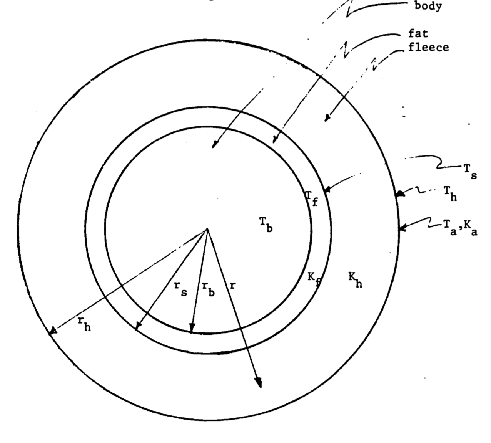
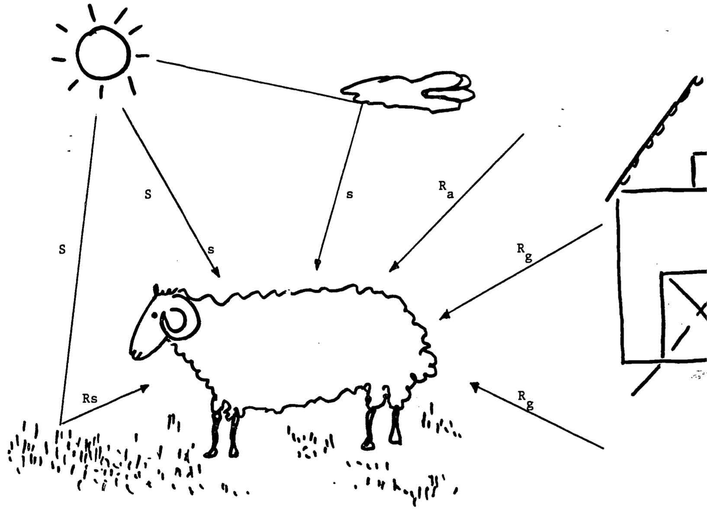
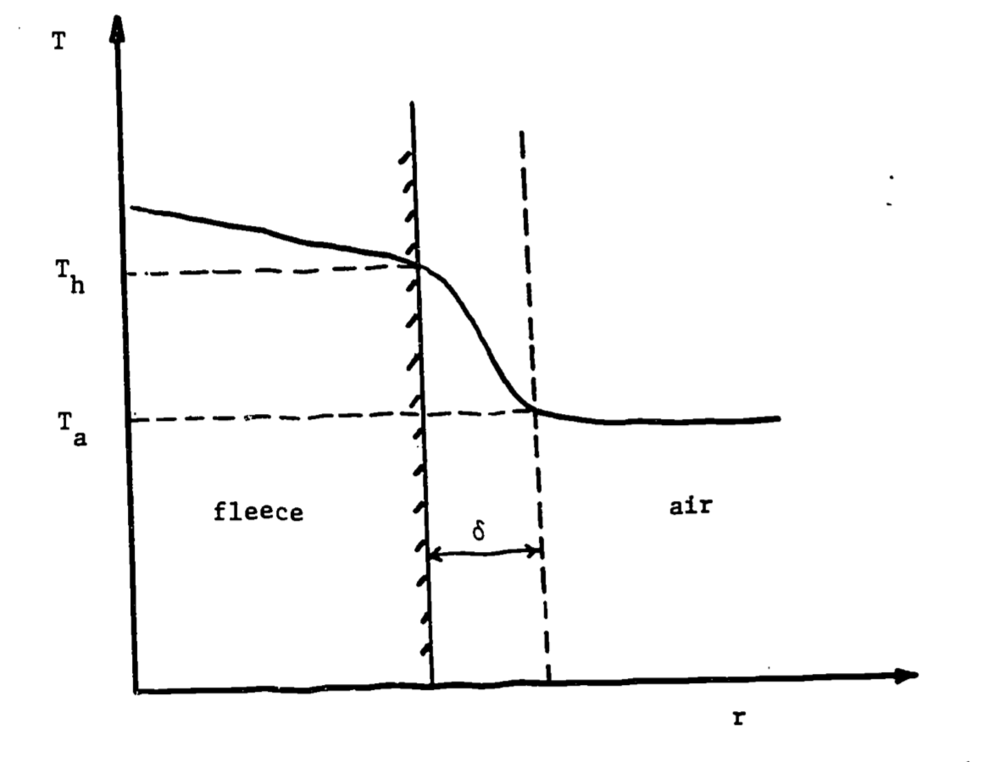

---
output:
  pdf_document: default
  html_document: default
---
# Heat balance of a sheep. {#heatbalance}

Heat Balance of a Sheep in the Sun. Physical Processes in Terrestrial and Aquatic Ecosystems, Transport Processes.
author: Hatheway, W. H. (Note: module was editted to fill in missing pages)

***
## Preface
Using the principle of conservation of energy and Fourier's Law, Laplace's equation is derived and solved to show the distribution of temperature in a two-layer model of a sheep. The basic heat transfer processes are reviewed so that the model can be applied to other animals and environments. The problem set forms an important extension, allowing the student to gain insight into the importance of thermal balance to normal animal physiology. This module assumes a mathematical background obtained in a differential equations course.

***

## Introduction
In the present module, we will calculate the exchange of heat between an animal and its physical environment. This is a problem of considerable biological importance. An organism's energy balance is crucial to its survival. If it loses heat faster than it takes it or other forms of energy in, then eventually its temperature will drop to that of its surroundings. On the other hand, if the organism takes in heat faster than it gets rid of it, eventually it will become overheated. In both cases, the temperature extremes to which the organism is subjected may be outside the range in which it is able to function effectively or even to survive.

Moreover, it is clear that there is a good deal of variation in temperature regimes to which animals are adapted. Few tropical mammals and birds can survive prolonged periods of freezing weather. On the other hand, animals like sheep and polar bears may not be able to withstand high ambient temperatures, especially in combination with exposure to sunlight. Every animal has a preferred range of body temperatures. How it manages to maintain its body temperature within this preferred range is largely determined by its ability to control the factors which affect its heat balance.

For this reason, it is exceedingly important to identify the factors which determine an animal's temperature and to understand the relative magnitude of their contributions. How important is sweating as a cooling process? Is a layer of fat as effective as one of feathers or fur in preventing bodily heat loss? Is there a relationship between body size and heat loss, and if so, how large must a warm-blooded aquatic animal be if it is to survive, say, in the waters surrounding Antarctica? It is only by carefully calculating the contributions of sweating, insulation, body size, ambient temperature, radiation, wind, humidity, and other factors to an animal's heat balance that we can make useful answers to these questions.

Accordingly, it is the objective of this module to provide the reader with some of the intellectual equipment they will need to calculate the heat balance of an organism. Our approach will be to develop a mathematical model that represents the energy balance of an animal, to discuss briefly the theory of some of the components of the model (e.g., heat conduction, convection, and absorption and emission of radiation), and to apply these theories by working out the details of the energy budget of a familiar animal. Since the principles are perfectly general, the techniques developed here may be used for any organism, plant or animal, or the reader may even wish to apply them to such practical problems as determining the effect of additional insulation on his yearly household fuel bill or the practicality of attempting to capture solar energy in Seattle, Chicago, or New York!

An animal can exchange heat with its environment by absorption or emission of radiation, by evaporation of water from its surface, and by conductive or convective exchanges of heat with its surroundings. Moreover, heat moves from the animal's body through its layers of insulation (fat and fleece) by the process of conduction. We will confine our attention to the equilibrium or "steady state" case, in which rates of heat loss and gain are equal. A solution to the more complicated situation, in which the rate at which the organism gains or loses heat in response to changing environmental conditions, is available in the computer model of Vera et al. (1975). 

If we assume that the animal is in thermal equilibrium with its environment, our analysis boils down to an identification of all sources of energy loss and gain. Our assumption of thermal equilibrium, which greatly simplifies the analysis, is not entirely unrealistic. Thermal equilibrium implies that the total energy gained by the animal equals total energy lost. If an animal is to maintain its body temperature within a relatively narrow range, it cannot afford to gain or lose substantial amounts of heat. If it finds itself out of thermal equilibrium, it must make suitable adjustments. These may include moving into the shade or increasing its rate of energy loss by panting or sweating if heat gains are excessive or increasing rate of metabolism in case heat losses are very great. Having made these adjustments successfully, the animal returns to its "average" state of equilibrium. Any prolonged, substantial departure from this state constitutes a crisis which, of course, may terminate in the animal's death.

To fix our ideas, we choose an unshorn domestic sheep as our study organism. The sheep is convenient because it is a familiar animal which has been thoroughly studied by a number of veterinary scientists (e.g., Blaxter, 1962; Brockway, McDonald and Pullar, 1965; Joyce, Blaxter and Park, 1966). In addition, the energy balance of the sheep has been studied by Priestley (1957), Monteith (1973), Porter and Gates (1969), and Vera et al. (1975). Experimental work by Walsberg et al. (1978) and the theoretical studies of Kowalski (1973) have shown that under certain environmental conditions it becomes important to take into consideration the penetration of radiation and wind into the wool. These complications are not included in the present model, which must therefore be considered only a first approximation to a more correct approach. In the present module, we adopt the general method of analysis put forward by Porter and Gates, but in may details we follow Priestley and, in some cases, Monteith.

**page missing**
Assuming that an animal's body temperature is constrant (steady state), energy input to the animals must equal energy out. We can write the animal's energy balance as follows:
\begin{equation}
M + R_+ = R_- + C + H + E
(\#eq:1)
\end{equation}
where $M$ is the metabolic rate, $R_+$ is the amount of radiation absorbed by the animal surface, $R_-$ is the thermal radiation emitted from the animal surface, $C$ is the heat conducted from the animal to any surface it is in contact with, $H$ is the heat loss from the animal to the environment via convection, and E is evaporative heat loss.

##Heat transfer within the animal
Heat is conducted between the surface of the animal and the body core with the direction determined by the relative temepratures of the animal's core and surface. Heat transfer can be modelled by approximating the animal as a series of concentric cylinders (Figure \@ref(fig:fig-thermintro-1)). Within the animal's core, metabolic heat production is offset by respiratory moisture loss to determine the animal's core body temperature $T_b$. We additionally indicate the skin ($T_s$), fat layer ($T_f$), hair tip ($T_h$), and air ($T_a$) temperatures. 

Heat is conducted within the animal based on the thickness of each layer. Boundary layer thickness, which determiens rates of conduction, is proportion to the two-roots root of the diameter of the animal and is influences by surface roughness, shape, and orientation.  The distances from the core are indicated by the radii of cycliners corresponding to the body ($r_b$), skin ($r_s$), and hair tips ($r_h$). 

The thickness of the boundary layer varies invesely with the one-third root of windspeed. Heat is conducted across the boundary layer and then carried away by convection associated with free-air movement. The convection coefficient describing rates of heat flow through each layer is given by:
\begin{equation}
h_c=K \frac{V^{1/3}}{r^{2/3}}
(\#eq:2)
\end{equation}
where $V$ is the wind speed in cm/sec, $r$ is the radius of the layer in cm, and $K$ is a constant describing thermal conductivity. The thermal condonductivities of the fat ($K_f$), fleece ($K_h$), and air ($K_a$) additionally detmine rates of heat exchange.

```{r fig-heatbalance-1, echo=FALSE, fig.height=5, fig.width=5, fig.cap='Sheep idealized as a cylinder. In the diagram, Ta, Tb, Ts, Th and Tf are the temperatures of the air, body, skin, hair tips and fat; rb,rs, and rh the corresponding radii of the cylinders; and Ka, Kb and Kf the thermal conductivities of air,fleece and fat.'}

```

At present, we will assume that $T_b > T_h$, so that metabolic heat is lost to the environment, and will defer a discussion of the factors which combine to determine the surface temperature, $T_h$, which is of paramount importance in our model.

The means by which metabolic energy is transported in the form of heat from the body to the fleece tips is conduction. It was observed by Fourier in 1822 that the rate of movement of heat $Q(W)$ perpendicular to surface of area $A$ through a material such as body fat or wool is proportional to the gradient of temperature $T(K)$ in the material:
\begin{equation}
Q=-kAdT/dr
(\#eq:4)
\end{equation}

Here $k (W m^{-1} K^{-1})$ is a thermal conductivity coefficient, a property of the conducting material, and $r (m)$ is the distance from the center of the cylinder measured along a radius. The steady-state temperature in a cylinder, such as our idealized sheep, is given by Laplace's equation,
\begin{equation}
d^2T/dr^2+\frac{1}{r}dT/dr=0
(\#eq:5)
\end{equation}
which we derive in the following way. Consider two concentric cylinders, such as those in Fig. \@ref(fig:fig-1). Heat moves outward across the inner cylinder at a rate of $q_b=\frac{Q_b}{A_b}=-k\frac{dT}{dr}(W m^{-2})$. Total heat loss from this cylinder is $Q_b=q_b(2\pi r_bL)(W)$. In a steady-state situation, total heat loss across a larger concentric cylinder is the same:
$$q_sA_s=q_s(2\pi r_sL)=q_h(2\pi r_hL)$$
so that $q_br_b=q_sr_s=q_hr_h=$ const, or
$$rq(r)=\mbox{const}$$

**2 pages missing**

define Z rates [conduction rates]

where
\begin{equation}
Z_f=\frac{1}{2\pi k_fL}ln(\frac{r_s}{r_b})
(\#eq:15)
\end{equation}
Eliminating $T_s$ from \@ref(eq:12) and \@ref(eq:14), we obtain
\begin{equation}
Z_hQ_h+Z_fQ_f=T_b-T_h
(\#eq:16)
\end{equation}
At this point, it is important to point out that in general $Q_h$ will not be equal to $Q_f$. In the fat, rate of heat flow is exactly equal to that leaving the body,
$$Q_f=M-E_r$$
At the surface of the skin, however, heat is lost by sweating, so that
$$Q_h=Q_f-E_s=M-E_r-E_s$$
Substituting these results in \@ref(eq:16), we obtain
$$Z_h(M-E_r-E_s)+Z_f(M-E_r)=T_h-T_b$$
or
\begin{equation}
M=E_r-\frac{E_s}{1+\frac{Z_f}{Z_h}}\frac{T_b-T_h}{Z_h+Z_f}
(\#eq:17)
\end{equation}
This important equation governs the rate of heat movement away from the animal's body. Body heat produced by metabolism $M$ is removed by evaporative losses due to respiration $E_r$ and sweating $E_s/(1 + Z_f/Z_h)$ and by conduction of sensible heat to the fleece tips $(T_b - T_h)/(Z_h + Z_f)$. Total evaporation is then

**2 pages missing**

```{r fig-heatbalance-2, echo=FALSE, fig.height=5, fig.width=5, fig.cap='Energy gained by sheep from envrionment. Symbols are as follows: S= direct solar radiation, s=sky radiation, rS = reflected solar radiation; Rg, Ra = long-wave (thermal) radiation from ground and air, respectively.'}

```

past the solid surface, and it is to this effect that we now direct our attention.

It is customary to rewrite Eqn. \@ref(eq:18) in the form
\begin{equation}
H=(\frac{d}{\delta})k_aA_h(T_h-T_a)/d
(\#eq:19)
\end{equation}
in which $A_h$ is the surface area of the animal at the fleece tips and $d$ is a characteristic dimension of the body past which fluid is moving, in our case the diameter of the cylinder that represents the sheep's body and fleece. The ratio $d/\delta$ is called the Nusselt number, Nu. Since Nu is a function of boundary layer thickness, it clearly depends on the Reynolds number, which, it will be recalled, may be written
$$Re =\frac{vd}{v} $$
In this expression $v (m s^{-1})$ is the velocity of the fluid relative to the body and $v$ is the kinematic viscosity of the fluid, about $1.5 \times 10^{-5} m^2 s^{-1}$ for air at 20°C. Tables for Nu are provided in various texts on heat transfer. For gases, the empirical formula $Nu = a Re^n$ may be used (Goldstein, 1938). The coefficient $a$ and the exponent $n$ vary considerably with the Reynolds number. Monteith (1973) provides the following table for cylinders whose axes are at right angles to the wind:


| Re                        |        Nu        |
|---------------------------|:----------------:|
| $1-4$                     | $0.89Re ^{0.33}$ |
| $4-40$                    |  $0.82Re^{0.39}$ |
| $40-4\times10^3$          |  $0.63Re^{0.47}$ |
| $4\times10^3-4\times10^4$ |  $0.17Re^{0.62}$ |
| $4\times10^4-4\times10^5$ | $0.024Re^{0.81}$ |

To obtain some feeling for the magnitude of the convective term $H$, let us assume that our wind speed is $v = 2.0 m s^{-1} = 4.5 \mbox{ miles } hr^{-1}$. Then $Re = (2.0)(0.5)/(1.5\times10^{-5}) = 6.67\times 10^4$, and we calculate $Nu = (0.024)(6.67\times10^4)^{0.81}= 194$. The thermal conductivity $k_a$ of air at 20°C is approximately $2.57\times10^{-2} W m^{-1}°C^{-1}$, and since the surface area $A_h$ of the sheep is $5\pi\times10^{-1}m^2$,

\begin{eqnarray}
H&=&(194)(2.57\times10^{-2})(5\pi\times10^{-1})(T_h-T_a)/.50=15.7(T_h-T_a)W \\
&=&2.35W,\; \mbox{ if } \;T_h = 25°C\; \mbox{ and }\; T_a = \mbox{10°C.}
\end{eqnarray}

It is also possible to calculate the heat lost by "free convection," which is important when wind speeds are less than $1 m s^{-1}$. In this case, the buoyancy of heated air is a dominant factor in the transfer of heat away from the animal. Calculation of H in this "unstable" case involves determination of the "Grashof number," which must be used in place of the Nusselt number. A problem involving free convection is offered as one of the exercises for this module.

##Heat Loss by Radiation
All warm bodies lose heat energy by emitting long-wave thermal radiation according to the Stefan-Boltzmann law:
\begin{equation}
R_\_=\varepsilon A_h\sigma T_h^4
(\#eq:20)
\end{equation}
Here $T_h$ is the absolute (Kelvin) temperature of the surface of the body in our case, the fleece tips of the sheep, $\sigma$ is the Stefan-Boltzmann constant, and $\varepsilon$ is the emissivity of the body. Total heat energy lost this way by the sheep is then $R_\_ = (\pi dL)(\varepsilon\sigma T_h^4)$. 

**ADD**
To obtain a rough estimate of heat loss by radiation, we substitute the following parameter values dL=0.5*1.0, 
Assume Th=20C, 293K
sigma: 5.67x10^{-8}


**page missing**

```{r fig-heatbalance-3, echo=FALSE, fig.height=5, fig.width=5, fig.cap='Temperature profile across fleece and air. Delta represents boundary layer thickness, Th=fleece-tip temperature, Ta = air temperature.'}

```

###Direct Solar Radiation
We may make an approximate calculation of $a_1A_1S$, the direct solar radiation absorbed by the sheep's body in unit time, if we consider the amount of sunlight intercepted by a cylinder of diameter $d$ and length $L$. Clearly, if the sun is directly overhead, the shadow cast by the cylinder on the ground has area $dL$. It follows immediately that the surface of the cylinder absorbs the same amount of radiation as would a plane of area $dL$. (The average amount of energy absorbed per unit area of the cylinder is then $a_1 (dL) S/(\pi dL/2) = 2a_1 S/\pi(W m^{-2})$, since the cylinder presents half its area to the sun.) As long as the sheep maintains its body at right angles to the sun, it intercepts the same fraction of incoming solar radiation.

We obtain an estimate of the total direct solar radiation absorbed by the animal by substituting the following values for our parameters:  
$a_1 = 0.74$; $A_l = dL = 0.5\cdot1.0$; and $S = 1046.7 W m^{-2}$, the value corresponding to a clear June 21 day at latitude 40°N at about 10 A.M. or 2 P.M. (Bartlett and Gates, 1967). Then $a_1A_1S = 387 W$.

###Sky Radiation
The sheep exposes an area $A_2=\pi dL/2m^2$ of its upper surface (half the area of the cylinder, neglecting the ends) to diffuse radiation coming in from the sky. Then the total sky radiation absorbed is $a_2 A_2 s = a_2 \pi dLs/2$. Since sky radiation intensity is about $27.9 W m^{-2}$ (Bartlett and Gates, 1967), we calculate this component of $A Q_{abs}$ as $(0.74)(\pi\cdot0.5\cdot1.0)(27.9)/2 = 16 W$.

###Reflected Short-Wave Radiation
The sheep's lower surface absorbs direct and scattered solar radiation that has been reflected from the grassy surface on which it stands (Fig. 3). If the grass reflectivity is 0.25 (Monteith, 1973), and if one-third of the solid angle is occupied by the sheep's shadow, the radiation received will be approximately $(0.25)(2/3)(0.74)(\pi\cdot0.5\cdot1.0/2)(1047.7+27.9)=104W$.

###Long-Wave Radiation
The sheep is also heated by thermal radiation emitted from sky ($R_a$) and ground ($R_g$). As Priestley (1957) pointed out, development of a correct model for long-wave radiation absorbed by the sheep is a difficult problem. The major complication arises from sky radiation, which is imperfectly understood. Both Priestley (1957) and Bartlett and Gates (1967) rely on an empirical formula due to Brunt (1939) to calculate sky thermal radiation. Brunt's formula is $R_a = 1.04 B$ where $B = (0.44 + 0.08\sqrt e)\sigma T_a^4$. In this expression, $e$ is the vapor pressure of the atmosphere (millibars), $\sigma$ is Stefan's constant ($5.67\times10^{-8} W m^{-2} K^{-4}$) and $T_a$ is the air temperature (K). Then the sky component of the long-wave radiation absorbed by the sheep is $a_4A_4R_a = 1.04 BA_4$, in which $A_4 = \pi dL/2$. To calculate $B$, we take $e = 10 mb$, and $T_a = 10°C = 283 K$. Then $B = (0.69)(5.67\times10^{-8})(283^4) = 251 W m^{-2}$ and the component due to atmospheric long-wave radiation is $205 W$.

Long-wave radiation from the ground absorbed by the sheep is given by $a_5A_5R_g = A_5\sigma T_g^4$ , where $T_g$ is the ground temperature (K). Here $A_5$ is again one-half the surface area of the cylinder. For our calculation, we will follow Priestley (1957) and make the convenient assumption that $T_g = T_h$, the average temperature of the tips of the sheep's hair. Since the energy **loss** from the upper and lower parts of the sheep's body due to emitted long-wave radiation is $(\pi dL)(\sigma T_h^4)$, the **net energy gain** due to long-wave radiation is
$$1.04BA_4+A_5\sigma T_g^4-2A_5\sigma T_h^4=(\pi dL/2)(1.04B-\sigma T_h^4)$$
Although we have not yet shown how $T_h$ is to be calculated, if we assume again that $T_h=20°C=293K$, then we calculate the net gain as
$$(\pi\cdot0.5\cdot1.0/2)(1.04\cdot251-5.67\times10^{-8}\cdot283^4)=-81W$$
Since net gain is negative, we conclude that the animal suffers a net long-wave radiative loss of $81 W$ at its surface.

##Metabolic Heat
Porter and Gates (1969) have calculated estimates of $M$ for several 
animals, including sheep, based on published data for animal oxygen consumption. Consumption of O~2~ implies oxidation of protein, fat, or carbohydrate. Since the heat released in each of these reactions is known, the Porter-Gates method consists essentially of identification of the animal's diet and conversion of quantity of O~2~ consumed to amount of metabolic energy produced. This method is most useful in studying animal species in which metabolic data are not readily available.

It probably comes as no surprise to the reader to learn that metabolic rates of domestic animals such as sheep have been thoroughly studied by veterinary scientists. Brockway, McDonald, and Pullar (1965) describe a fascinating series of experiments in which total, sensible, and evaporative heat losses in sheep were carefully measured by direct calorimetry. For an animal maintained at 15°C with a fleece depth of 0.1 m, total heat loss by all routes was $132 kJ kg^{-1} day^{-1}$. Total evaporative heat loss was $52.3 kJ kg^{-1} day^{-1}$, of which $41.9 kJ$ was due to respiratory evaporation. Sweating heat loss was approximately $12.6$ to $20.9 kJ kg^{-1}day^{-1}$ regardless of temperature. The authors suggest that, since sheep have little or no physiological control over sensible heat loss, variation in respiratory evaporation heat loss is the chief means by which sheep adjust to their environment. When the weather is hot, they are obliged to pant!

##An Energy Balance Calculation
In making the calculations that follow, we assume fleece thickness of 0.1 m, which is the depth of wool usually attained by Cheviot sheep (Brockway et al., 1965). Then skin diameter for our "standard sheep" is 0.3 m. The layer of subcutaneous fat is about 0.01 m thick (Porter and Gates, 1969). We take thermal conductivity of sheep's wool as $5.91\times10^{-2}W m^{-2}°C^{-1}$ (Blaxter, Graham, and Weinman, 1959) and that of fat as $20.51\times10^{-2} W m^{-2}°C^{-1}$(Porter and Gates, 1969). Body temperature of the sheep is taken as 39°C (Priestley, 1957). We assume a body weight of 70 kg.

To consolidate our calculation, we return to our general heat balance relation (Eqn. \@ref(eq:1)):
$$M+R_+=R_-+C+H+E$$
Our objective at this point is to calculate $T_h$, the fleece-tip temperature. We now define net radiation received by the animal at the fleece tips as
\begin{eqnarray}
R_{Nh}=R_+-R_-&=&a_1A_1S+a_2A_2s+a_3A_s(S+s) \\
&-&a_4A_4R_a+a_5A_5R_g-\varepsilon A_h\sigma T_h^4 
(\#eq:22)
\end{eqnarray}
and $R_{Na}$ as the net radiation which would be received in the same environment if the fleece tips were at air temperature, so that
$$R_{Na}=a_1A_1S+a_2A_2s+a_3A_3(S+s)+a_4A_4R_a+a_5A_5\sigma T_a^4-\varepsilon A_h\sigma T_a^4$$
Then
$$R_{Nh}-R_{Na}=a_5A_5\sigma T_h^4-\varepsilon A_h\sigma T_h^4-(a_5A_5\sigma T_a^4-\varepsilon A_h\sigma T_a^4)$$
and, since $a_5=1$, $A_h=\pi dL$ and $A_5=1/2A_h$,
\begin{equation}
R_{Nh}-R_{Na}=-\pi dL\sigma(T_h^4-T_a^4)(1/2-\varepsilon)
(\#eq:23)
\end{equation}

We now write
\begin{equation}
R_{Nh}\stackrel{.}{=}R_{Na}=2T_a^3(T_h-T_a)A_h
(\#eq:24)
\end{equation}
To obtain this relationship, we have assumed $\varepsilon\stackrel{.}{=}1$ and have used an approximation based on the Taylor Series expansion of $T_h^4 = g(T_h)$, say, near the point $T_h = T_a$:
\begin{eqnarray}
T_h^4=g(T_h)&=&g(T_a)+g^,(T_a)(T_h-T_a)+... \\
&=&T_a^4+4T_a^3(T_h-T_a)+... 
\end{eqnarray}
Since from Eqns. \@ref(eq:1) and
$$M-E+R_{Nh}=H+C$$
we obtain, using Eqn. \@ref(eq:17a),
\begin{equation}
\frac{T_b-T_h}{Z_n+Z_f}+R_{Nh}=H
(\#eq:25)
\end{equation}
We have dropped the conductive term $C$, since heat conduction from the animal to the ground is small in comparison to other heat loss if the sheep is not lying down. We now substitute Eqn. \@ref(eq:24) into Eqn. \@ref(eq:25) and, remembering that $H$ is given by Eqn. \@ref(eq:19), we obtain an expression which we will use to determine $T_h$:
\begin{equation}
\frac{T_b-T_h}{Z_h+Z_f}+R_{Na}-2T_a^3\sigma A_h(T_h-T_a)=\frac{Nu}{d}k_aA_h(T_h-T_a)
(\#eq:26)
\end{equation}
Rearranging, we obtain
\begin{equation}
T_h=\frac{\sigma T_a+\beta T_b}{\alpha+\beta}+\frac{R_{Na}} {\alpha+\beta}
(\#eq:27)
\end{equation}
where
\begin{equation}
\alpha=A_h(Nuk_a/d+2\sigma T_a^3)
(\#eq:28)
\end{equation}
and
\begin{equation}
\beta=1/(Z_h+Z_f)
(\#eq:29)
\end{equation}
Formula \@ref(eq:27) states that the temperature at the fleece tips $T_h$ is a weighted average of air and body temperatures $T_a$ and $T_b$, increased by a contribution from all sources of radiation. The weights $\alpha$ and $\beta$ have the units of "conductances," that is, of conductivities multiplied by the areas across which heat flows. The conductance a has components associated with convection and radiation, $\beta$ with conduction in fleece and fat.

To illustrate the calculation of $T_h$, we take $T_a=10°C$, $T_b=39°C$, $A_h=0.5\pi m^2$, $Nu=194$, $k_a=2.48\times10^{-2}Wm^{-1}°C^{-1}$,   $k_h=5.91\times10^{-2}Wm^{-1}°C^{-1}$, $k_f=2.51\times10^{-1}Wm^{-1}°C^{-1}$, $d=0.5m$, $L=1.0m$, $r_b=0.145m$, $r_s=0.15m$, and $r_h=0.25m$.

Then $\alpha=1.571(9.638+2.570)=19.19W°C^{-1}$, $Z_h+Z_f=1.3748+0.05431=1.428$, so that $\beta = 0.700W°C^{-1}$. Also,
\begin{eqnarray}
R{Na}&=&a_1A_1S+a_2A_2S+a_3A_3r(S+s)+1/2A_h(1.04B-\sigma T_a^4) \\
&=&387.3+16.2+104.1-80.6 \\
&=&427W
\end{eqnarray}
Then
\begin{eqnarray}
T_h&=&\frac{(19.18)(283)+(0.7)(312)+427}{19.88} \\
&=&305.5K=32.5°C
\end{eqnarray}
Thus, in this case, the temperature of the fleece tips is approximately 22°C higher than that of the air. We make the following observations.

1. The contribution of body temperature to fleece-tip temperature is much smaller than that of the air temperature, because the weight $\alpha$ is much larger than $\beta$. In turn, $\beta$ is small because of the very large resistance to heat conduction offered by the wool.

2. The radiative contribution to fleece-tip temperature, which is appreciable (21°C), depends very largely on the size of the short-wave component.

3. The radiative contribution to the weight a is considerably smaller than the convective one.

4. Contribution of fat to total resistance to heat flow from the animal is very small compared to that of the wool.

Once we have determined $T_h$, a number of very important calculations become possible. The first of these is the total heat of metabolic origin that passes outward through the fleece tips, which is given by Eqn. \@ref(eq:17):
$$\frac{T_b-T_h}{Z_h+Z_f}=M-E_r-E_s/(1+\frac{Z_f}{Z_h})$$
In the present case, the quantity on the left works out to be $(39 - 32.5)/1.428 = 4.55 W = 393 kJ$ day$^{-1}$. Checking the other side, we have already noted that sweating heat loss is in the neighborhood of $16.8 kJ kg^{-1} day^{-1} = 1170 kJ day^{-1}$ for a 70 kg animal, independent of air temperature (Brockway et al., 1965). Many experiments have shown that 70 kg sheep lose between 8,800 and 10,000 kJ day$^{-1}$ heat. If we take $M = 8,800 kJ$, then $E_r = 7630 kJ day^{-1}$, which is about twice as great as the 3,660 kJ day reported by Brockway et al. (1965). In their experiment, however, there was no net absorption of radiation at the fleece tips, so that higher conductive heat losses were possible.

For comparative purposes, it is also useful to calculate the magnitudes of the terms in the energy balance equations \@ref(eq:24) and \@ref(eq:25). These are

1. metabolic sensible heat loss
$$\frac{T_b-T_h}{Z_h+Z_f}=4.6W$$
2. radiation heat gain
$$R_{Nh}=R_+-R_-=387.3+16.2+104.1+2.05+386.2-757.7=336W$$
3. convective heat loss
$$\frac{Nu}{d}k_aA_h(T_h-T_a)=341W$$

Thus, in this case, net incoming radiation at the fleece tips is approximately equal to convective heat loss and metabolic heat loss by conduction from the body through fat and fleece is very small. This is due in part to the high "radiant" temperature at the fleece tips and the resulting low temperature gradient between body and fleece tips.

These examples illustrate only some of the types of problems we can solve with this technique. We have shown that, if the sheep's environment is given in terms of temperature, wind speed, and incoming radiation, it is possible to determine the range of rates of body metabolism and evaporative losses due to respiration and sweating that will allow the animal to maintain thermal equilibrium. Porter and Gates (1969) have worked out the converse problem for a number of animals: given a range of metabolic rates that the animal can maintain as well as its physical characteristics (size, thickness of fur, etc.), the range of environmental conditions within which it can survive can be calculated.

**pages missing**

##REFERENCES

**page missing**
Cena, K. and J.A. Clark. 1974. Heat balance and thermal resistance of sheep's fleece. Phys. Med. Biol. 19:51-65.

Cena, K. and J.L. Monteith. 1975. Transfer processes in animal coats. I. Radiative transfer. II. Conduction and convection. III. Water vapour diffusion. Proc. Roy. Soc. London Biol. 188:377-393; 395-411; 413-423.

Clark, J.A., K. Cena and J.L. Monteith. 1973. Measurements of the local heat balance of animal coats and human clothing. J. Appl. Physiol. 35:751-754.

Davis. L.B., Jr. and R.C. Birkebak. 1975. Convective energy transfer in fur. In David M. Gates and Rudolf B. Schmerl (eds.), Perspectives on Biophysical Ecology, pp. 525-548. Springer Verlag, New York.

Doney, J.M. and J. Slee. 1970. General meteorological effects on sheep. Prog. Biometeorol. 1:59-65.

Eckert, E.R.G. and R.M. Drake, Jr. 1972. Analysis of Heat and Mass Transfer. McGraw-Hill, New York. 806 pp.

Gates, D.M. 1968. Toward understanding ecosystems. Adv. Ecol. Res. 5:1-35.

Goldstein, S. (ed.). 1938. Modern Developments in Fluid Dynamics. Oxford Univ. Press. (Republished, 1965, by Dover Publ. Inc.). Graham, N.M., F.W. Wainman, K.L. Blaxter and D.G. Armstrong. 1959.

Environmental temperature, energy metabolism and heat regulation in sheep. I. Energy metabolism in closely clipped sheep. J. Agr. Sci. 52:13-24.

Hales, J.R. and G.D. Brown. 1974. Net energetic and thermoregulatory efficiency during panting in the sheep. Comp. Bioch. Physiol. A 49:413-422:


**pages missing**


from clouds). Suppose your sheep is standing in a pasture in which reflectivity of the grass is 25 percent. Wind speed is 1 km hr$^{-1}$. Assume cutaneous evaporative heat loss equals 4 kcal kg$^{-1}$ day$^{-1}$, but respiratory heat loss can vary. It is known that sheep can breathe as few as 20 times or as many as 250 times per minute, and the corresponding respiratory heat loss varies from 2.0 to 18.0 kcal kg$^{-1}$ day$^{-1}$. Calculate rate of heat loss if the sheep is shorn (fleece 1 cm thick) and unshorn (fleece 10 cm thick). Assume that total metabolic heat produced is 1900 kcal day$^{-1}$.

5. Now assume that instead of a sheep your study animal is a blue whale, which you can idealize as a cylinder 25 m long and 5 m in diameter, with a layer of blubber 50 cm thick. Its body temperature is maintained at 33°C. If the whale swims at a rate of 15 km hr$^{-1}$ through 5°C water, how much food (in kcal day$^{-1}$) must it consume to maintain thermal 1/2 equilibrium? Take the Nusselt number $Nu$ as $0.332 (Re_x)^{1/2} \stackrel{.}{=} 1.6 \times 10^4$ (since $V = 15 km \:hr^{-1}$, $x \stackrel{.}{=} 10 m$, $v = 1.7 \times 10^{-5} m^2 sec^{-1}$).

6. Calculate heat loss in the blue whale when its velocity relative to the water is zero. The thermal conductivity of water is approximately
$5.7 \times 10^{-3} J cm^{-1} s^{-1} °C^{-1}$.

7. Calculate $T_h$ for a rat whose length is 18 cm, total diameter is 7 cm with a fat thickness of 0.3 cm and a hair thickness of 0.5 cm. Take $\varepsilon = 1.0$ and $T_b = 39°C$. Assume the same environmental conditions as in problem 1, but make calculations for $T_a$ = 10 and 30°C only. If evaporative heat loss is 40 W m$^{-2}$, what is the metabolic heat production? Repeat your calculations for a shrew whose body length is 5 cm, hair thickness of 0.20 cm and total body diameter of 2 cm. What percentage is evaporative water loss of the total heat loss? Of the sheep, the rat and the shrew, who has the largest per-unit-surface-area heat production?

8. a. Derive equation \@ref(eq:5) from equation \@ref(eq:6).  
b. Derive equation \@ref(eq:7) from equation \@ref(eq:6).  
c. Derive equation \@ref(eq:23) in the text.

9. When heat transfer depends on air movements caused by differences in fluid density (i.e., buoyancy effects), the Nusselt number can be shown to depend on another dimensionless parameter, the Grashof number,
$$Gr=\frac{\beta gd^3}{v^2}(T_h-T_a)$$
where $\beta$ is the coefficient of thermal expansion of the fluid, $g$ is the acceleration due to gravity, and $d$ is a characteristic length. For air at 20°C moving at right angles to the axis of a cylinder and $10^4<Gr<10^9$, $Nu = 0.48 Gr^{0.25}$ (Monteith, 1973). For the sheep, calculate rate of heat loss due to free convection, if $T_h$ = 25 °C and $T_a$ = 20 °C. (Take $\beta = 3.48 \times 10^{-3} deg^{-1} °C$, $g = 981 cm \cdot sec^{-2}$, $v = 0.145 cm^2\cdot sec^{-1}$.)

10. Suppose you did not know $T_h$ and wished to solve for it before proceeding further with your analysis. (Recall that we linearized terms involving $T_h^4$ by writing $T_h^4\stackrel{.}{=}T_a^4+4T_a^3(T_h-T_a)$, supposing that $T_h$ is sufficiently close to $T_a$, which is taken as known.) How would you linearize the term containing $Nu = 0.48Gr^{0.25}$?

##PROBLEM SOLUTIONS

1. We need to find the total and evaporative heat losses and compare them with the results of Brockway et al. Since there are three air temperatures and three fleece thicknesses, there will be nine separate calculations. We need to calculate $T_h$ using equation \@ref(eq:24). To do this, we need the $\alpha$'s and the Nusselt numbers. Here $v= 0.2778 m s^{-1}$.


| $T_a$(°C)                              |  10  |  20  |  30  |
|----------------------------------------|:----:|:----:|:----:|
| $v\:(m^2s^{-1}\times10^{-5})$          | 1.42 | 1.51 | 1.60 |
| $k_a \:(W m^{-1}°C^{-1}\times10^{-2})$ | 2.50 | 2.57 | 2.64 |

> tables

**probably best to copy them because there is no way to put the letters from down to up**

Nusselt Numbers Diameter (m)

|    | 0.32  | 0.36  | 0.50  |
|----|-------|-------|-------|
| 10 | 38.40 | 41.31 | 50.64 |
| 20 | 36.96 | 39.76 | 48.75 |
| 30 | 35.66 | 38.36 | 47.03 |


From equation \@ref(eq:17), the total heat loss can be estimated at $M$ since $T_b$ is always greater than $T_h$. At moderate air temperatures (15 to 30°C), metabolic rate will be high and fairly constant which from the text we will take as $8800 kJ day^{-1}= 101.8 W$. At 10°C, however, it is assumed that evaporative water loss is 20.4 (W) and total heat loss is calculated.

>tables
**same for these**

Brockway, McDonald and Puller found that metabolic and evaporative heat losses were fairly insensitive to fleece thickness. Exceptions were for a sheep with (a) 1 cm fleece where the percentage of evaporative water loss was generally lower and these animals had a higher metabolic rate especially at lower air temperatures, and (b) with 10 cm fleece metabolic rate was higher at higher air temperatures. At 10°C, they measured metabolic rate to be 140 W for a sheep with **illegible** cm fleece and 109 W for other sheep. This is higher than the model predicts (114.3 to 45.7 W). At 20 and 30°C, evaporative water loss was measured to be 40.7 and 91.5 W; then values should be compared with model predictions of 28.4 to 82.4 (W) and of 50.4 to 88.2 (W). The comparisons suggest that the model is excessively sensitive to changes in fleece thickness.

Evidently, heat transfer through the fleece is not accurately represented by our model. An improved model might take into account factors such as change in thermal conductivity of the fleece as a function of its water content. Such refinements are always possible. A point is always reached, however, where for all practical purposes the costs involved in making the improvement may exceed the benefits gained from it. In the present case, benefits consist chiefly in improved understanding of the process of heat transfer.

2.

\begin{eqnarray}
k_a&=&2.37\times10^{-2}Wm^{-1}C^{-1} \\
v&=&1.24\times10^{-5}m^2s^{-1} \\
v&=&2.778ms^{-1} \\
E&=&20.4W
\end{eqnarray}

Diameter (m)

|                      |  0.32  |  0.50  |
|:--------------------:|:------:|:------:|
|          Re          |  71960 | 112016 |
|          Nu          | 205.65 | 295.21 |
|  $\alpha$ (W°C^-1^)  | 17.387 |  25.22 |
|   $\beta$ (W°C^-1^)  |  4.43  |  0.705 |
|     $R_{Na}$ (W)     | -38.08 | -59.51 |
|      $T_h$ (°C)      |  -1.85 | -10.97 |
| $\beta(T_b-T_h)$ (W) | 180.96 |  35.23 |
|        $M$ (W)       |  201.4 |  55.6  |


3. 5060 kcal day$^{-1}$ = 245.25 W  
990 kcal day$^{-1}$ = 47.98 W  
The conversion is 5.30g of grass day$^{-1}$ W$^{-1}$.

|                            |  0.32 |  0.50 |
|----------------------------|:-----:|:-----:|
| Required M (W)             | 228.9 | 83.21 |
| Required grass (g day^-1) |  1213 |  441  |


4. The problem assumes the same conditions as problem 1 for $T_a = 30°C$ and $d = 0.32$ and $0.50 m$, but $R_{Na}$ will be larger.

$$R_{Na}=\frac{\pi dL}{2}\bigg(\frac{2}{\pi}\cdot 0.74\cdot 800+0.74\cdot 150+0.25\cdot 0.75\cdot \frac{2}{3}(950)-2\cdot0.1396\sigma T_a^4\bigg)$$

|                           |  0.32  |  0.50  |
|:-------------------------:|:------:|:------:|
|        $R_{Na}$ (W)       |  236.7 |  369.8 |
|         $T_h$ (°C)        |  56.27 |  69.4  |
|      $\beta(T_b-T_h)$     | -76.51 | -21.36 |
| $\frac{E_s}{1+(Z_f/Z_h)}$ |  10.4  |  13.1  |
|         $E_r$ (W)         |  158.2 |  100.4 |

$E_s=13.6W$, $M=92.1W$  
$E_r$ range was $8.93W$ to $60.9W$.  
The animals need to lower their metabolic rate or seek shade if they are to prevent a large increase in body temperature.

5. For a whale
$$M=H$$
or
$$\frac{T_b-T_s}{Z_f}=\frac{Nuk_w}{d}A_s(T_s-T_w)$$

\begin{eqnarray}
\alpha &=&\frac{Nuk_wA_s}{d} \\
T_s&=&\frac{T_b+Z_f\alpha T_w}{1+Z_f\alpha} \\
k_f&=&2.052\times10^{-1}Wm^{-1}C^{-1} \\
r_s&=&2.5m\;\;\;\;r_b=2.0m\;\;\;\;A=392.7m^2 \\
Z_f&=&6.923\times10^{-3}°CW^{-1}k_w=0.57Wm^{-1}°C^{-1} \\
\alpha &=&\frac{1.64\cdot10^3\cdot392.7\cdot 0.57}{10}=30.571\times10^4W°C^{-1} \\
T_s&=&\frac{33+254.1\times5}{1+254.1}=5.11°C \\
M&=&\frac{33-5.11}{0.006923}=4028W \\
&=&3.48\times10^5kJ\:day^{-1} \mbox{ with perfect efficiency} \\
&=&2.32\times10^6kJ\:day^{-1} \mbox{ at 15 percent conversion efficiency}
\end{eqnarray}

6. There are several ways one might attack this problem. One could simply assume a conduction model in which the water surrounding the animal offered no resistance to heat flow ($T_s = 5.0°C$). A Nusselt number calculation could be made using the Grashof number as in problem 9. Or finally, as is done here, one could assume that still water is equivalent to some very slow velocity (in air this is about 0.10 m s$^{-1}$).

\begin{eqnarray}
Nu&=&80.5\;\;\;\;\;\;\;\alpha=1.802\times10^3 \\
T_s&=&\frac{33+6.923\times10^{-3}\cdot1.802\cdot10^3\cdot5}{1+6.923\cdot10^{-3}\cdot1.802\cdot10^3} \\
M&=&\frac{33-7.08}{0.006923}=3.744\times10^3W \\
&=& \mbox{ 93 percent of metabolic costs while swimming at over 4 m/s}
\end{eqnarray}

| | |**0.02**|**0.07**
:-----:|:-----:|:-----:|:-----:
$A_n$|(m^2^)|0.003142|.039584
Nusselt number|10°C|10.25|18.47
| |30°C|9.69|17.47
$Z_f$| | |0.4544
$Z_n$| |12.018|2.3063
$\beta$ (W°C-1)| |0.08321|0.36222
$\alpha$ (W°C-1)|10°|$\frac{0.04833}{0.13154}$|$\frac{0.36285}{0.72507}$
| |30°|$\frac{0.05009}{0.13330}$|$\frac{0.38567}{0.74789}$
$R_{Na}$|10|-0.13812|-1.7404
| |30|-0.2096|-2.6409
$T_h$ (°C)|10|27.29|22.09
| |30|34.05|30.82
Sensible heat loss (W)|10|0.9744|6.126
| |30|0.4122|2.963
Evaporative water loss (W)| |0.1257|1.583
%  Evaporative water loss  |10|11.4|20.5
| |30|23.4|34.8
Metabolic rate per unit area (W m^-2^)|10|350.1|194.8
| |30|171.2|114.9


8.(a)
$$d\big(r\frac{dT}{dr}\big)=\frac{d\big(\frac{\mbox{const}}{-k}\big)}{dr}$$
$$\frac{dT}{dr}+r\frac{d^2T}{dr^2}=0$$
(b)
$$r(-k\frac{dT}{dr})=\mbox{ const}$$

$$dT=c_1\frac{1}{r}dr$$
$$T(r)=c_1lnr+c$$
(c) Using Eqn. \@ref(eq:22) and 

\begin{eqnarray}
R_{Na}&=&a_1A_1S+a_2A_2s+a_3A_3(S+s) \\
&+&a_4A_4R+a_5A_5\sigma T_a^4-\varepsilon\sigma A_nT_a^4 
\end{eqnarray}

we substract the two
$$R_{Nh}-R_{Na}=a_5A_5\sigma T_h^4-\varepsilon\sigma A_hT_h^4-a_5A_5\sigma T_a^4-\varepsilon\sigma A_hT_a^4$$
making the following assumptions:
$a_5=1$, $A_h=\pi dL$, $A_5=1/2A_h$
\begin{eqnarray}
R_{Nh}-R_{Na}&=&\sigma \pi dL[1/2(T_n^4-T_a^4)-\varepsilon(T_n^4-T_a^4)] \\
&=&\sigma \pi dL[(T_n^4-T_a^4)(1/2-\varepsilon)]
\end{eqnarray}

9.

\begin{eqnarray}
Gr&=&\frac{3.48\times10^{-3}\cdot9.81\cdot(0.5)^3}{(1.45\times10^{-5})^2}(5) \\
&=&1.105\times10^8\;\;\;\;\;Nu=48.18 \\
H&=&\frac{48.18\cdot0.0257\cdot\pi\cdot1.0\cdot0.5}{0.5}(5)=19.45W
\end{eqnarray}

10.

\begin{eqnarray}
H&=&\frac{Nuk_aA_h(T_h-T_a)}{d} \\
X&=&\frac{k_aA_h}{d}0.48Gr^{0.25}(T_h-T_a) \\
&=&\frac{k_aA_h}{d}0.48\Big(\frac{\beta gd^3}{v^2}\Big)^{0.25}(T_h-T_a)^{1.25} \\
&=&k'(T_h-T_a)^{1.25} \\
&=&k'[(\overline{T_h}-T_a)^{1.25}+1.25(\overline{T_h}-T_a)^{0.25}(T_h-T_a)]
\end{eqnarray}

>appendix 1

