# Soil Heat Flow {#soilheatflow}

Soil Heat Flow. Physical Processes in Terrestrial and Aquatic Ecosystems, Transport Processes.

author: Simpson, James R.

***
## Preface {#soilheatflow-preface}

Soil heat flow and the resulting soil temperature distributions have ecological consequences related to plant growth, metabolic processes of soil-dwelling microorganisms, and survival strategies of soil-dwelling animals. The study of soil heat flow requires that soil temperature be obtained. In some instances, actual measurement of soil temperature profiles and heat flux can be used. In other instances, actual measurements may not be available due to lack of equipment, inaccessibility of the site, or inconvenience. In these instances a model is used to predict soil temperatures from more readily attainable environmental variables. This module focuses on the modeling approach.

## Introduction {#soilheatflow-intro}

Soil temperature profoundly influences many biological processes, including plant growth and development, and the behavior of soil-dwelling microorganisms, insects, and higher animals. Much of the early work on soil temperature effects on plant growth is summarized in Richards et al. (1952). As an example, consider the effects of low temperature on transpiration (Fig \@ref(fig:fig-soil-1)). The warm weather plants, cotton and watermelon, are significantly more sensitive to cold temperatures than are collards, which are grown as a winter crop in the southern United States. Plants are also sensitive to the extremes of temperature between day and night, winter and summer. In many species, it is this fluctuation of temperature rather than its absolute or average value which is the key ingredient, as for example in seed germination (see e.g., Richards et al. 1952). Consequently, a complete understanding of the soil temperature dependence of plant growth and development requires knowledge of soil temperature as a function of time. As will be pointed out later, soil temperature variation with depth is another factor of importance here. The metabolic processes of soil-dwelling microorganisms are also temperature-dependent. They break down organic matter, produce nitrogen, and play a part in the aggregation of the soil itself (Richards et al. 1952). In turn, these processes affect plant growth and maintenance of the nutrient cycle. Monteith (1973) points out, however, that it is difficult to observe the behavior of the flora and fauna in an undisturbed, natural soil. Thus relatively little is known concerning temperature effects on them. Certainly, however, a model of soil temperature variation is an essential first step on the road to this understanding.

```{r fig-soil-1, echo=FALSE, fig.height=4, fig.fullwidth=FALSE, fig.cap='Effects of low soil temperatures on water absorption by four species of plants, as measured by rates of transpiration (from Kramer 1969).'}
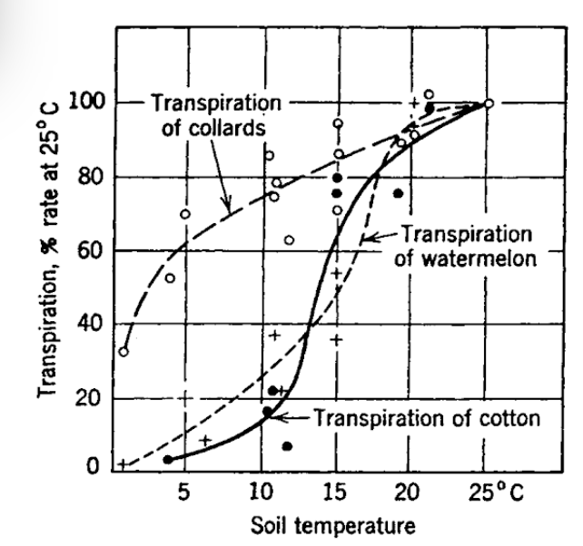
```

```{r fig-soil-2, echo=FALSE, fig.height=4, fig.show = "hold", out.width = "100%", fig.align = "default", fig.cap='Diurnal course of temperature at three depths in a sandy loam beneath a bare uncultivated surface; Grifith, New South Wales, 17-19 January, 1939 (from Monteith 1973).'}
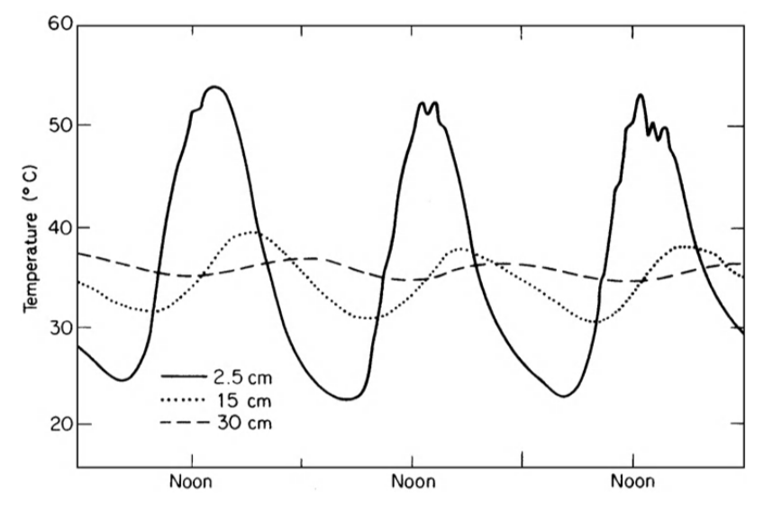
```

Finally, consider some higher animals who spend part of their life cycle in the soil. These include obvious soil-dwellers such as mice, gophers, moles, etc. In addition, hibernating species such as bears become closely coupled to soil temperatures during their inactive period. The animal ecologist is often concerned with elucidating how the survival strategies of such animals are related to the physical world around them; not only in qualitative terms, but also in terms of measurable parameters. As an example, consider the pocket mouse, *Perognathus longimembris*, which, with a body weight of ~ 8 g, is among the smallest rodents. French (1976), in a series of laboratory experiments, determined that this species selected the highest experimental temperature in the soil for its burrow at all times of the year. The question of determining the mouse's location at any time of the day or year becomes in large part, then, a question of determining where the maximum soil temperature occurs **in the field**. On the other hand, some animals that hibernate prefer lower temperatures near their dormant body temperature in order to conserve energy while in the dormant state. In short, many survival strategies of animals are affected to one degree or another by the soil temperature environment.

Soil heat flow and the resulting soil temperature distributions have important ecological consequences. The question remains, however, as to how soil temperatures can be obtained as a practical matter. Two alternatives present themselves. In some applications, actual measurement of soil temperature profiles and heat flux is preferred. This approach is straightforward, assuming the proper instrumentation is available. Surface and profile heterogeneity may make extensive sampling necessary, however. Actual measurements of soil temperatures are frequently not available, whether due to the expense of the equipment, inaccessibility of the site, or simply due to the inconvenience involved. Consequently, the utility of a model which can predict soil temperatures from more readily attainable environmental variables becomes apparent.

This module will focus primarily on the modelling approach. It should be pointed out that much of the physical insight developed here is also essential for establishing a proper measurement program. In the final analysis, the type of approach utilized will depend upon individual circumstances.

## Governing Factors in Soil Heat Flow {#soilheatflow-factors}
The foregoing discussion has served to illustrate the need for a quantitative grasp of a soil temperature distribution. We now ask what properties of the soil and the general environment are important in determining this distribution. Once we know these properties, equations incorporating them can be derived, and (hopefully) solutions for various conditions can be found.

First, consider some actual observations of soil temperature measurements made at several depths beneath the soil over a period of several days (Fig. \@ref(fig:fig-soil-2)). Notice that at any depth the temperature is an almost periodic function of time. By this it is meant that the temperature trace (wave) repeats itself (almost) at regular intervals, in this case approximately every 24 hours. This time interval is called the **period** of the temperature wave, a variation with a periodicity of 24 hours being termed a diurnal variation. In addition to this time dependence, large differences in temperature are also evident between various depths. As one goes deeper, the amplitude of the wave is rapidly damped out. There is also a time (phase) lag associated with the occurrence of the maxima (or minima) of the temperature wave as depth increases. 

These observations allow us to form a rather convincing hypothesis concerning the controlling variables. The observed diurnal heating cycle is no doubt linked to solar heating at the soil surface. Evidence for this is presented in Fig. \@ref(fig:fig-soil-3), where it is apparent that soil temperature is strongly correlated with solar radiation. In fact, solar radiation is the energy source driving the flow of heat in the soil. (As will be shown later, it is this flow of heat which determines the temperature distribution.) The increasing phase lag as a function of depth is again quite evident, as it was in Fig. \@ref(fig:fig-soil-2). It seems reasonable to hypothesize that the lag is due to the finite amount of time required for energy (as heat) to move down from the surface and heat up the soil profile. In turn, the speed or rate of energy flow is determined by a quality unique for a given material, known as its **thermal conductivity** (k). As the name implies, thermal conductivity is a measure of a particular substance's ability to transmit heat. However, more information is required to completely specify the **temperature** variation. This is because, for a given amount of heat absorbed by various substances, different temperature increases will be observed. Hence the term **heat capacity** is introduced, and it may be thought of as the ratio of heat absorbed to change in temperature for a given mass of material.

In a very qualitative sense, we have described what appear to be the pertinent quantities involved in determining the soil temperature distribution, based simply on reason and observations (with just a little prior knowledge to guide the way). It remains now to formalize the relationship between heat flow and temperature, to develop the equations describing these processes (with emphasis on the simplifying assumptions involved), and finally to investigate the utility of this more formalized approach.

```{r fig-soil-3, echo=FALSE, fig.height=4, fig.show = "hold", out.width = "100%", fig.align = "default", fig.cap='Short-wave solar radiation, air temperatures and soil temperatures for a clay soil with grass cover at Wageningen, the Netherlands, on a bright day, August 17, 1947. The extreme values of the temperatures are indicated by arrows (from Van Wijk 1966).'}
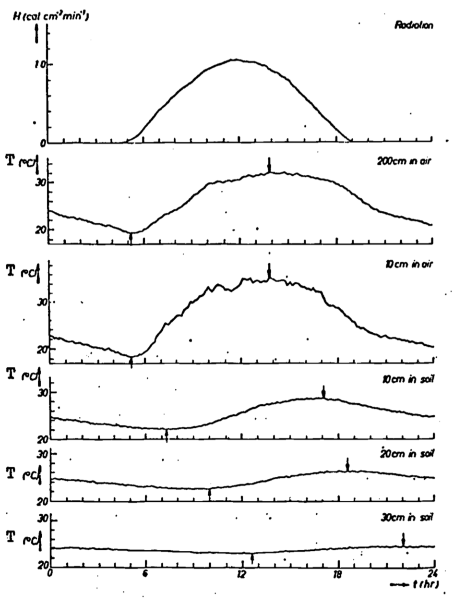
```

## Formal Development {#soilheatflow-formaldev}
In the preceding section, a cause and effect relationship between soil heat flow and temperature distribution was implied. It is instructive to formalize this relation; indeed, the equation doing so will form the basis for subsequent discussion. First of all, however, it is necessary to present a more rigorous specification of the problem.

### Fourier's Law of Heat Conduction {#soilheatflow-fourier}
Van Wijk and DeVries (1966) present a good discussion of the simplifying assumptions made to facilitate the mathematical development of heat conduction. These include:

1. The soil is homogeneous with respect to heat transfer by conduction. Now, conduction of heat is due to the transfer of the random vibratory motion of the molecules in the medium. Due to the natural variety of the soils, one would consequently not expect homogeneous soil heat transfer. However, if the soil thermal properties considered are bulk values, i.e., averaged over a volume of soil that is large with respect to the inhomogeneities, then this is a good assumption. It has the effect of making the heat transfer at any point independent of position.

2. Heat flow takes place only in the vertical direction. Since the heat input due to solar radiation can be considered uniform at the surface, this assumption is not limiting for a horizontally homogeneous surface.

3. There are no sources or sinks for heat (such as by chemical reaction) nor conversion of heat, into other forms of energy (such as latent heat of evaporation).

Hence the problem we are considering can be termed unidirectional heat conduction in a homogeneous medium. Empirical observation of this phenomenon leads to the conclusion that the heat flow between two points in such a medium is proportional to the temperature difference between those points. Such an observation seems consistent with our personal experience; the hotter the burner on the stove, the faster the kettle heats up. Of course, if a kettle of water is allowed to reach the boiling point, then further heat input is utilized to vaporize the water without further temperature increase. This is why we have included assumption 3.

Consider a block of soil (Fig. \@ref(fig:fig-soil-4). The amount of heat energy which flows by conduction ($Q$) is directly proportional to the temperature difference ($\Delta T$) between top and bottom faces, as we have said before.  We can write:

\begin{equation}
Q\varpropto\Delta T
(\#eq:soil-1)
\end{equation}
The amount of heat transmitted through the soil block per unit time ($t$) is termed the heat flux ($Q/t$). The heat flux per unit area ($A$) is termed the heat flux density ($Q/At$). The heat, or heat flux density (also termed $G$), has also been observed to be proportional to $\Delta T$, while being inversely proportional to the length of the path ($L$).

```{r fig-soil-4, echo=FALSE, fig.height=4, fig.show = "hold", out.width = "100%", fig.align = "default", fig.cap='One dimensional heat conduction (from Rose 1966).'}
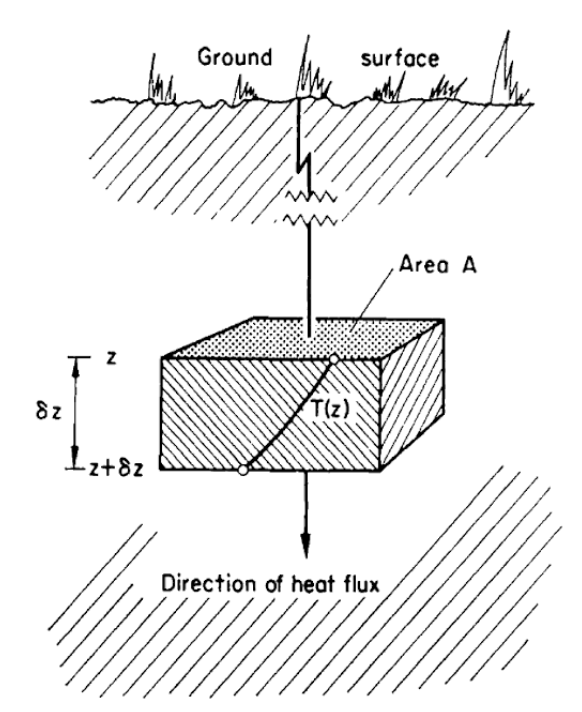
```

Therefore one can write

\begin{equation}
G=\frac{Q}{At}=-k\frac{\Delta T}{L}
(\#eq:soil-2)
\end{equation}
where the constant of proportionality ($k$) is the thermal conductivity. In fact, Equation \@ref(eq:soil-2) can be considered a defining relation for thermal conductivity. If we now adopt the standard procedure of calculus and consider small changes in temperature ($dT$) over small increments of time ($dt$), one gets the standard form of Fourier's law of heat conduction:

\begin{equation}
G=-k\frac{dT}{dz}
(\#eq:soil-3)
\end{equation}

It is important to notice the introduction of the minus sign. In words, this simply means that the direction of heat flow is opposite to the direction in which the temperature increases. To illustrate this, consider Fig. \@ref(fig:fig-soil-5), where we assume that soil temperature varies linearly with depth in the soil. Observe the opposite sense of temperature change and heat flux density. Alternatively, one may deduce the sign from consideration of the **temperature gradient** $(\frac{dT}{dz})$, or slope, of the $T$ versus depth ($z$) curve. As the depth increases, the temperature decreases. Hence the temperature gradient $dT/dz$ is negative. For downward heat flux to be positive, which is the usual convention, we must add the minus sign to obtain Equation \@ref(eq:soil-3) (see also symbols, units, and dimensions in Table A in Appendix).

```{r fig-soil-5, echo=FALSE, fig.height=4, fig.show = "hold", out.width = "100%", fig.align = "default", fig.cap='Illustration of the source of the minus sign found in Fourier\'s law of heat conduction (Equation 13.3)'}
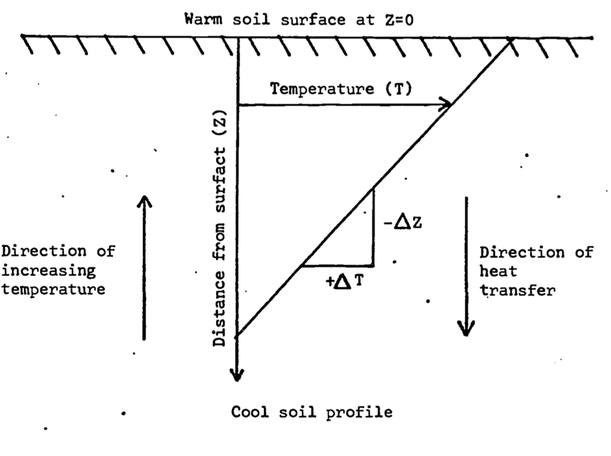
```

Equation \@ref(eq:soil-3) clearly indicates the importance of the thermal conductivity in determining the magnitude of the heat flux density. Consequently, we wish to understand what factors affect its value. If $dT/dz = 1$ in Equation \@ref(eq:soil-3), then the thermal conductivity has the interpretation of the flux density in response to a unit gradient. In such terms one can compare typical values of thermal conductivity for various materials, gaining a feel for their relative ability to conduct heat (Table 13.1). Such comparison reveals that the average thermal conductivity of soil is not only a function of mineral composition and structure, but also depends on its content of air, water, and organic matter. Since the thermal conductivity of air is small, changes in air content as the soil is wetted or dries has little effect on overall thermal conductivity. Likewise, while thermal conductivity is a function of temperature, the effect is so small that it can be neglected while dealing with soils. The effect of water content on $k$ cannot be neglected, at least for relatively dry soils, since $k$ may increase an order of magnitude when water content goes from 0 to 20 percent (Fig. \@ref(fig:fig-soil-6)). In actuality, thermal conductivity is a function of depth, since soil composition, air and water content generally vary with depth (see e.g., Van Wijk and Derksen 1966). For our purposes of eliciting the **general** features of soil heat flow, however, it can be assumed that $k$ is constant with depth. 

There are many ways in which $k$ for soil might be estimated. Taylor and Ashcroft (1972) give a brief review of the subject. They consider two general methods of measurement, based on steady state heat flow (temperature not a function of time) and transient heat flow (temperature changes with time). Steady state methods suffer from the fact that heat flow in soils is possible not only by conduction, but also by liquid and vapor flow of water in moist soils. Consequently, applying a constant temperature difference across a sample soil section causes the hotter face to dry out and the cooler face to become wetter, calling the results obtained into question. Therefore, unless heat transfer due to liquid water is negligible (i.e., unless the soil is dry), transient methods are recommended. These methods, which will be discussed in the section on the heat conduction equation, minimize the effects of water movement due to thermal gradients.

```{r fig-soil-6, echo=FALSE, fig.height=4, fig.show = "hold", out.width = "100%", fig.align = "default", fig.cap='Dependence of the thermal conductivity k on the volume fraction of water $X_W$ for four different soil types (from Sellers 1965)'}
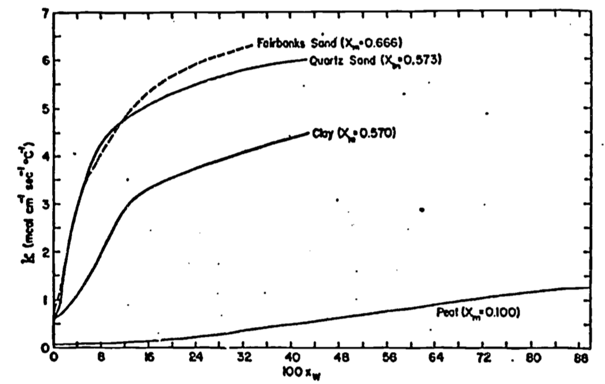
```

```{r fig-soil-7, echo=FALSE, fig.height=4, fig.show = "hold", out.width = "100%", fig.align = "default", fig.cap='Variation of volumetric heat capacity (C) with water content in a typical soil (after Rose 1966)'}
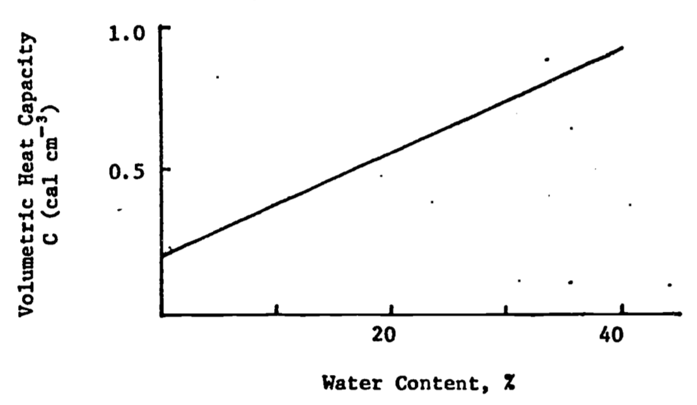
```

### Heat Storage and Energy Conservation {#soilheatflow-storage}
Equation \@ref(eq:soil-3) embodies the concept that heat flows from high to low temperature areas at a rate proportional to the temperature gradient. The constant of proportionality, $k$, is a quantitative measure of a medium's ability to transmit heat. As was discussed in the section on governing factors, complete specification of the temperature distribution also requires knowledge of the capacity of the medium to store heat for a given temperature change, i.e., its **heat capacity**. In general, heat capacity is defined on either a volumetric or mass basis. **Specific heat** capacity or specific heat ($c$) is defined in SI units as the amount of heat required to raise the temperature of 1 kg of material 1°C. Volumetric heat capacity is defined as $C = \rho c$, where $\rho$ is the density of the material. Table A (Appendix) lists dimensions and units of these quantities, while Table 13.1 lists typical values of specific heat for various materials. Taylor and Ashcroft (1972) present a more complete discussion from the viewpoint of thermodynamics.

The bulk heat capacity is generally estimated by adding up the heat capacities of the various soil constituents in a unit volume. The heat capacity per unit volume ($C$) can then be expressed as

\begin{equation}
C=\rho c=X_mC_m+X_wC_w+X_aC_a+X_oC_o
(\#eq:soil-4)
\end{equation}

where $\rho$ is the soil density, $X$ is volume fraction (dimensionless), and the subscripts $m$, $w$, $a$, and $o$ refer to minerals, water, air and organics, respectively (DeVries 1966). Use of Equation \@ref(eq:soil-4) is illustrated by DeVries (1966). Reliable experimental values of $C_m$ , $C_w$ , and $C_o$ are (in cgs units) 0.46, 1.0, and 0.60 cal cm^-3^ °C^-1^. Calorimetric determination of the component heat capacities is discussed in detail by Taylor and Jackson (1965). $C_a$ is small, and may be neglected, so that Equation \@ref(eq:soil-5) becomes

\begin{equation}
C=0.46X_m+0.60X_o+X_w[cal\cdot cm^{-3}°C^{-1}]
(\#eq:soil-5)
\end{equation}

It remains then to determine the volume fraction. Notice that for a given soil, $X_m$ and $X_o$ will be constant under our assumptions, but that $X_w$ will change as the soil wets up or dries, making $C$ a linear function of water content (Fig. \@ref(fig:fig-soil-7)). See DeVries (1966) for a more detailed discussion of heat capacity in soils.

>Table 13.1. Thermal propertie8 of soils and their components (from Montieth, 1973).

| |**Water content $x\delta$** |**Density**|**Specific heat**|**Thermal conductivity**|**Thermal diffusivity**
-----|:-----:|:-----:|:-----:|:-----:|:-----:
| | |$\rho$|$c$|$k$|$K$
| | |tonne  m^-3^(10^6^ g m^-3^)|J g^-1^°C^-1^|W m^-1^°C^-1^|10^-6^ m^2^ s^-1^
(a) Soil components| | | | | 
Quartz| |2.66|0.80|8.80|4.18
Clay minerals| |2.65|0.90|2.92|1.22
Organic matter| |1.30|1.92|0.25|1.00
Water| |1.00|4.18|0.57|0.14
Air (20°C)| |1.20 $\times$ 10^-3^|1.01|0.025|2050
(b) Soils| | | | | 
Sandy soil  (40% pore space)|0.0|1.60|0.80|0.30|0.24
| |0.2|1.80|1.18|1.80|0.85
| |0.4|2.00|1.48|2.20|0.74
Clay  soil   (40% pore space)|0.0|1.60|0.89|0.25|0.18
| |0.2|1.80|1.25|1.18|0.53
| |0.4|2.00|1.55|1.58|0.51
Peat soil  (80% pore space)|0.0|0.30|1.92|0.06|0.10
| |0.4|0.70|3.30|0.29|0.13
| |0.8|1.10|3.65|0.50|0.12

We are now in a position to write an equation for the conservation of energy, which by assumption 3 we limited to heat energy only. Assuming no work is done, the general form of this equation can be stated in words as
$$\frac{\mbox{net flux of heat}}{\mbox{per unit volume and time}}=\frac{\mbox{rate of change of heat content}}{\mbox{per unit volume}}$$
Assumption 3 in section 3 ruled out sources or sinks and conversion of heat energy into other forms. Consequently, if more heat is entering the volume of soil under consideration than is leaving, then the heat content (or more precisely internal energy), and thus the temperature, of the soil volume must be increasing as a function of time and vice versa.

Consider first a horizontal soil slab of thickness $\Delta z$ and unit horizontal dimensions (Fig. \@ref(fig:fig-soil-4)). Recalling that in general $G$ is a function of both depth and time, we let $G(z,t)$ and $G(z+\Delta z,t)$ be the heat flux density at the top and bottom of the slab, respectively, at the same instant of time $t$. The difference $G(z,t) - G(z+\Delta z,t)$ then represents the net heat storage in a slab of volume $\Delta_z$ per unit of time and cross section. Using the definition of a partial derivative (see, e.g., Hildebrand 1962), and holding $t$ constant, we may write this difference as the limiting expression

\begin{equation}
\lim_{\Delta z\to0}[\frac{G(z,t)-G(z+\Delta z,t)}{\Delta z}]\Delta z=-\frac{\partial G}{\partial z}\Delta z
(\#eq:soil-6)
\end{equation}

This amount of heat storage in the slab will cause a temperature change per unit of time $\frac{\partial T}{\partial t}$. Assuming that the volumetric heat capacity $(C)$ is not a function of time, $C\frac{\partial T}{\partial t}\Delta z$ represents the heat storage in a volume $\Delta z$. This heat storage must be equal to that found in Equation 6 by consideration of differences in heat flux density. We may then write

$$C\frac{\partial T}{\partial t}\Delta z=\frac{\partial G}{\partial z}\Delta z$$
Canceling out the common terms, we are left with an expression for the conservation of energy,
\begin{equation}
C\frac{\partial T}{\partial t}=-\frac{\partial G}{\partial z}
(\#eq:soil-7)
\end{equation}
This is also referred to as the continuity equation for heat transfer.

Notice the inclusion of a minus sign. The reason for this is illustrated by Fig. \@ref(fig:fig-soil-4). If we consider the case when the soil volume is heating up, then $C (\partial T/\partial t) > 0$. Now, for this to be the case, more heat must be entering the block $(G(z))$ than is leaving $(G(z+\Delta z))$, hence $G(z,t) - G(z+\Delta z,t) > 0$, so $\partial G/\partial z > 0$, by the definition of a partial derivative. Therefore, for Equation \@ref(fig:fig-soil-7) to balance, the minus sign must be included. A similar argument holds when the soil is cooling.

### Heat Conduction (Diffusion) Equation {#soilheatflow-conduction}
Differentiation of the law of conduction (Equation \@ref(fig:fig-soil-3)) with respect to $z$ and combining the result with the continuity equation (Equation \@ref(fig:fig-soil-7)) gives
$$-\frac{\partial G}{\partial z}=\frac{\partial}{\partial z}(k\frac{\partial T}{\partial z})=C\frac{\partial T}{\partial t}$$

Again, invoking soil homogeneity with depth, we may write
\begin{equation}
\frac{\partial T}{\partial t}=K\frac{\partial^2T}{\partial z^2}
(\#eq:soil-8)
\end{equation}
where $K = k/C = k/\rho c$ is called the **thermal diffusivity**. See Table 13.1 for units and some representative typical values of diffusivity. Equation \@ref(eq:soil-8) is commonly referred to as the diffusion equation. It arises in many physical and biological phenomena where the medium of interest can be considered homogeneous. Notice that while we have reduced our governing equation for heat flow to one dependent variable $(T)$, we retain the complexities inherent in equations containing partial derivatives. For further discussion of this type of equation, known as a partial differential equation, see e.g., Carrier and Pearson (1976).

The thermal diffusivity, $K$, is an important parameter here for two reasons. First, it incorporates the thermal properties of the soil, $C$ and $k$, in one expression. The second is that its degree of functional dependence on $t$, $z$, or $T$ will dictate the difficulty of the solution to Equation \@ref(eq:soil-8). In this latter regard, it is well to keep in mind that the simplified form of Equation \@ref(eq:soil-8) is due to our assumption that $K$ is not a function of depth. To the extent that soil porosity and water content are functions of depth, application of Equation \@ref(eq:soil-8) is questionable. However, assumption of a constant thermal diffusivity, which we have alluded to before, will allow us to derive solutions to the problem illustrative of the general characteristics of soil heat flow.

The combination of $k$ and $C$ allows the one quantity $K$ to determine the time necessary for the soil temperature to change in any situation. In Equation \@ref(eq:soil-8), we see that the change in temperature with time is related to the curvature of the temperature profile $(\partial^2 T/\partial x^2)$ through the diffusivity. The smaller the value of $K$, for a given temperature profile, the longer it takes the soil to heat up, and vice versa. This is illustrated in Fig. \@ref(fig:fig-soil-8), where an imaginary soil temperature gradient and its first and second derivatives are plotted. This figure also nicely demonstrates how one can deduce, simply from the temperature profile, what areas of the soil will be warming or cooling. Hence we have arrived at a quantitative justification for our reasoned speculation in section 2 that both $k$ and $C$ are essential for an adequate description of the soil temperature distribution.

Measurement of $K$ and $k$ are essentially the same, since they differ only by the quantity $C$. In the section on Fourier's law, we alluded to the difficulties encountered using steady state methods due to liquid or vapor transport of heat by soil water. Here we will briefly discuss transient methods (see e.g., Jackson and Taylor 1965, or Taylor and Ashcroft 1972). One is based on measurement of the heating and cooling rate of an electrically heated wire element in the soil. This rate is proportional to the diffusivity. Moisture movement during the heating cycle has been shown to be small for practical purposes. Another method is based on the solution of Equation \@ref(eq:soil-8) and actual temperature measurements in the field. This method's accuracy is limited by the accuracy of our solution in terms of how well our assumptions fit the measurement site. More precise methods involving the direct measurement of $G$ are discussed in Taylor and Ashcroft (1972). Dependence of $K$ on soil water content is discussed in Rose (1966) and Sellers (1965).

```{r fig-soil-8, echo=FALSE, fig.height=4, fig.fullwidth=FALSE, fig.cap=' Imaginary temperature gradient in soil (left-hand curve), and the corresponding first and second differentials of temperature with respect to depth; i.e., $\\partial T/\\partial z$ and $\\partial^2 T/\\partial z^2$. The second differential is proportional to that rate of temperature change $\\partial T/\\partial t$ (from Monteith 1973).'}
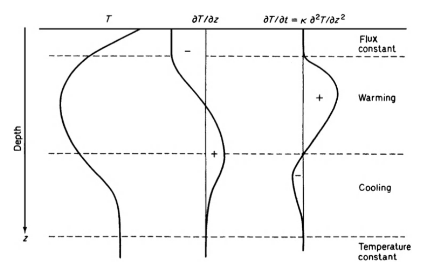
```

```{r fig-soil-9, echo=FALSE, fig.height=4, fig.show = "hold", out.width = "100%", fig.align = "default", fig.cap='Record of the annual temperature wave at depths of 1m (X) and 2.5m (°) with fitted sine curves (from Rose 1966)'}
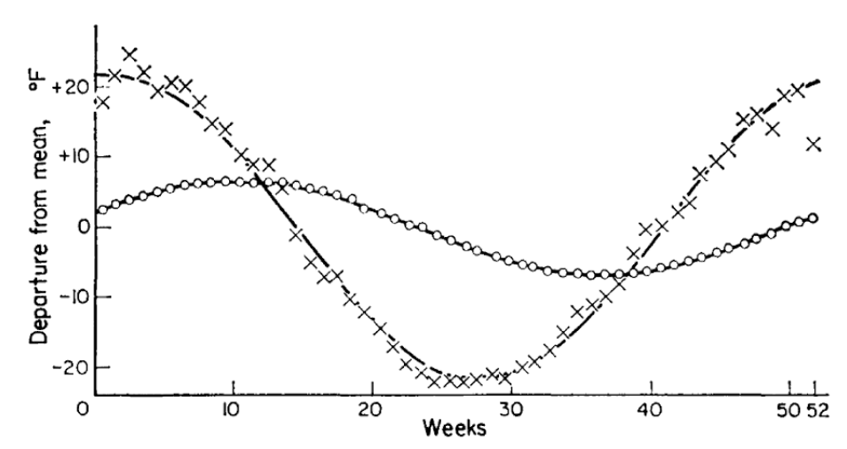
```

## Use of the Heat Conduction Equation {#soilheatflow-heatconduction}
Experience with actual temperature data indicates that with the assumption of a constant diffusivity, Equation \@ref(eq:soil-8) describes in a general way the phenomenon of soil heat flow and resultant temperature distribution. It is the goal of this section to investigate in more detail the utility of this formalized approach through an analytical solution of Equation \@ref(eq:soil-8).

### Boundary Conditions {#soilheatflow-bounds}
Hatheway (1977b) discusses in general the need for well-posed boundary conditions in order to derive a unique solution for a diffusion type equation (such as our Equation 8). It turns out that it is necessary to specify $T(z,t)$ or $\frac{\partial T}{\partial z}$at the soil surface (z=0), and at some depth in the soil, which we take as $z=\infty$. This latter choice is based on the observation that the soil temperature at substantial depths, say greater than 10 meters, is practically constant. Hence, our lower boundary condition is simply

\begin{equation}
T(\infty,t)=\overline{T}
(\#eq:soil-9)
\end{equation}
where the overbar signifies the average temperature, which we will assume constant with depth. For the upper boundary condition, we will  make the assumption that the diurnal (Fig. \@ref(fig:fig-soil-2)) or annual (Fig. \@ref(fig:fig-soil-9)) variation of surface temperature can be approximated by a sine wave. This is a somewhat better approximation for annual than diurnal variations. We choose the time scale such that when $t=0$ the surface temperature is $\overline{T}$. The upper boundary condition then becomes

\begin{equation}
T(0,t)=\overline{T}+A(0)\sin\omega t
(\#eq:soil-10)
\end{equation}

For the diurnal case, the period of oscillation is 24 hours, or 86,400 seconds. Of course, the $\omega$ is **angular** frequency and can be written
$$\omega = 2\pi/86,400=7.27(10)^{-5}second^{-1}$$
The argument of the sine function $(\omega t)$ is then expressed in radians if $t$ is in seconds. $A(0)$ is the amplitude of the temperature wave at the surface, so that $T(0,t)$ over the course of a day varies between $\overline{T}-A(0)$ and $\overline{T}+A(0)$.

**Problem Solution**
The solution of Equation \@ref(eq:soil-8) which satisfies boundary conditions \@ref(eq:soil-9) and \@ref(eq:soil-10) is

\begin{equation}
T(z,t)=\overline{T}+A(z)\sin[\omega t+B(z)]
(\#eq:soil-11)
\end{equation}
The reader is referred to Carslaw and Jaeger (1959) for the mathematical details. Now $A(z)$ and $B(z)$ represent the amplitude and phase lag of the temperature wave, respectively. From our earlier discussion of Fig. \@ref(fig:fig-soil-2), we expect $A(z)$ and $B(z)$ to be decreasing and increasing functions of depth, respectively. By substituting our solution \@ref(eq:soil-11) into the differential Equation \@ref(fig:fig-soil-8), we find that

\begin{equation}
A(z)=A(0)exp(-z/D)
(\#eq:soil-12)
\end{equation}
and

\begin{equation}
B(z)=-z/D
(\#eq:soil-13)
\end{equation}

where $D$ is termed the **damping depth**, and is related to the thermal properties of the soil and the frequency of the temperature wave by the expression

\begin{equation}
D=(2K/\omega)^{1/2}
(\#eq:soil-14)
\end{equation}

Several aspects of this solution (Equations \@ref(eq:soil-11) through \@ref(eq:soil-14)) will now be discussed in detail.

### Properties of the Harmonic Solution {#soilheatflow-harmonic}
Since the temperature is a function of both $z$ and $t$, it is useful in looking at graphical representations to present two sets of curves. As is immediately apparent from Equation \@ref(eq:soil-11), a plot of $T$ versus $t$ for various depths produces a family of sinusoids:

```{r fig-soil-10, fig.cap='Variation of temperature with depth for a sand soil. A value of $k=0.042calcm^{-1}sec^{-1}C^{-1}$ and $C=0.5cal cm^{-3}C^{-1}$ has been assumed resulting in a damping depth D=15.2cm'}

# Variation of temperature across time with depth

w= 2*pi/86400 #s^-1, angular frequency
k= 0.0042 #thermal conductivity of soil, cal cm^-1 s^-1 °C^-1
C= 0.5 #volumetric heat capacity, cal cm^-3 °C^-1

#Estimate aggregate parameters
K= k/C #thermal diffusivity
D= (2*K/w)^0.5 #damping depth, cm
  
Tbar= 20 #°C
A0= 8 #°C

#z in depth in cm
#sec in time in seconds
Tsoil= function(z,sec) {
A= A0*exp(-z/D)
B= -z/D
Tbar + A*sin(w*sec+B)
}

sec=(0:23)*60*60 #hr

#plot across depths
plot(sec/(60*60),Tsoil(0,sec), type="l", lty="dashed", 
     xlim=c(0,24), xlab= "Time (hr)", ylab="Temperature (°C)")
points(sec/(60*60),Tsoil(5,sec), type="l", col="skyblue")
points(sec/(60*60),Tsoil(10,sec), type="l", col="skyblue2")
points(sec/(60*60),Tsoil(20,sec), type="l", col="skyblue3")
points(sec/(60*60),Tsoil(40,sec), type="l", col="skyblue4")
abline(h=20)
legend("topright", c("z=0cm","z=5cm","z=10cm","z=20cm","z=40cm"), 
       col=c('black','skyblue','skyblue2','skyblue3','skyblue4'), 
       lty=c('dashed', rep('solid',4)), bty = "n")

```

Notice the similarities between this and some actual measurements (Figs. \@ref(fig:fig-soil-2) and \@ref(fig:fig-soil-9)). In general, these figures exhibit similar amplitude reductions and phase lags with depth (see section 2) whose characteristics are attributable to the functions $A(z)$ and $B(z)$ in our solution. The amplitude exhibits **exponential decay** (Equation \@ref(eq:soil-12)), a phenomenon common to many situations in chemistry, biology and economics, to name just a few. Notice that $A(D) = e^{-1}A(0) = 0.37A(0)$, so that the amplitude of the temperature wave at $z = D$ is 37 percent of its surface value. Similarly, at $z = 4.46 D$, we find a 99 percent amplitude reduction. The phase lag is embodied in the function $B(z)$, which is a simple linear function of $z$. For example, when $z = \pi D$, $B(z) = -\pi$, so the maximum (or minimum) at depth $z = \pi D$ is exactly out of phase with the corresponding extreme of the temperature wave at the surface. For example, in the plot above, $\pi D=\pi\cdot15.2=47.8cm$, and we find the 40 cm wave to be almost out of phase with the surface wave, as expected.

A plot of $T$ versus $z$ for various times of day using the same values of $\overline{T}$, $A(0)$, and $D$ as for the figure above produces the following family of curves. As was mentioned in section 3 while discussing Fig. \@ref(fig:fig-soil-8), we can deduce the direction of heat flow for this type of plot by the curvature of the temperature profile. Here again the damping of the temperature wave with depth is apparent.

```{r fig-soil-11, fig.cap='Plot of soil temperature versus depth for various times of day, derived from Equations 11 through 13. Assumed values for the various constants were D=12.2cm, $\\bar T$=20°C, and A(0)=8°C.'}
# Soil temperature profiles
w= 2*pi/86400 #s^{-1}, angular frequency
D= 12.2 #damping depth, cm
Tbar= 20 #°C
A0= 8 #°C

Tsoil= function(z,sec) {
A= A0*exp(-z/D)
B= -z/D
Tbar + A*sin(w*sec+B)
}

#z in depth in cm
#sec in time in seconds
z= 0:40 #depths, cm

sec=(0:23)*60*60 #hr

#plot across depths
plot(Tsoil(z,2*60*60),z, type="l", col="skyblue", xlim=c(10,30), 
     ylim=c(40,0), xlab= "Temperature (°C)", 
     ylab="Soil depth measured from surface (cm)")
points(Tsoil(z,6*60*60),z, type="l", col="skyblue1")
points(Tsoil(z,10*60*60),z, type="l", col="skyblue2")
points(Tsoil(z,14*60*60),z, type="l", col="skyblue3")
points(Tsoil(z,18*60*60),z, type="l", col="skyblue4")
points(Tsoil(z,22*60*60),z, type="l", col="darkblue")
legend("bottomright", c("hr=0200","hr=0600","hr=1000","hr=1400", 
                        "hr=1800","hr=2200"), 
       col = c('skyblue', 'skyblue1','skyblue2','skyblue3',
               'skyblue4', 'darkblue'), lty="solid", bty = "n")
```

### Comparison of Theory with Experiment {#soilheatflow-conparison}
In the process of formulating a closed form solution for soil heat flow which described at least the general state of affairs in the soil profile, we made several assumptions. The acid test, of course, of the quality of these assumptions is how well our simplified solution (i.e., Equations \@ref(eq:soil-11)-\@ref(eq:soil-14)) reflects reality. Comparison of the time series we plotted in R (figure \@ref(fig:fig-soil-10)) with figures \@ref(fig:fig-soil-2) or \@ref(fig:fig-soil-9) and the soil temperature profile (figure \@ref(fig:fig-soil-11)) with figure \@ref(fig:fig-soil-12) indicate that general agreement is found. Minor discrepancies do occur, and it is instructive to examine these in light of our prior assumptions (section 3).

First of all, however, an examination of our upper boundary condition reveals an obvious difficulty in that it applies well only under clear sky conditions. Variable weather conditions as well as vegetation cover can lead to substantial deviations from a sinusoidal surface temperature variation (Fig. \@ref(fig:fig-soil-13)). The more general case of a periodic surface temperature variation that is not a simple time function can be handled by a technique called Fourier analysis. In addition, it is possible to deal with small systematic nonperiodic variations superimposed upon a larger periodic variation. Treatment of these refinements is available in Van Wijk and DeVries (1966).

```{r fig-soil-12, echo=FALSE, fig.height=4, fig.show = "hold", out.width = "100%", fig.align = "default", fig.cap='Diurnal change of soil temperature measured below a bare soil surface and below potatoes (from Monteith 1973).'}
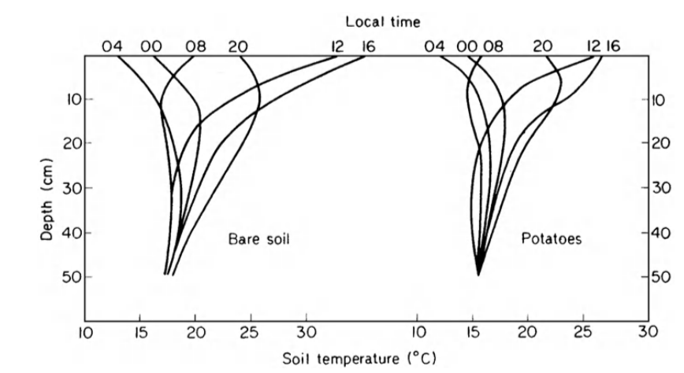
```

```{r fig-soil-13, echo=FALSE, fig.height=4, fig.show = "hold", out.width = "100%", fig.align = "default", fig.cap='Soil temperature variations at 10 cm depth in a clay soil under a short grass cover at Wageningen, the Netherlands. The upper curve shows large deviations from a periodic function owing to variable weather conditions, while the lower curve corresponding to a sequence of bright days has a periodic character. The average daily temperatures are indicated by the dotted lines which have been drawn such that they divide the surfaces bounded by the temperature curves for each day equally (from Van Wyjk 1966).'}
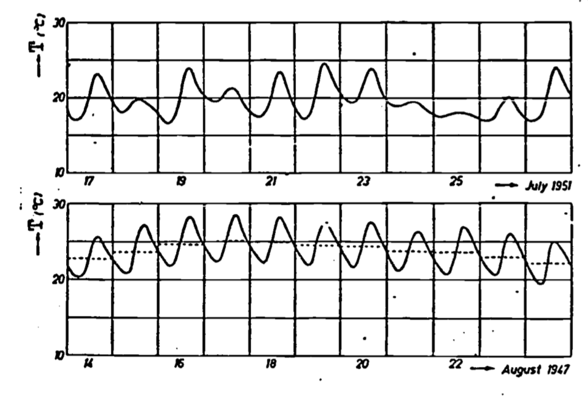
```

Variation of thermal properties (characterized by diffusivity) with position, temperature and time are generally secondary to the above effects concerning the upper boundary condition. Temperature effects are slight and usually ignored. Variation with depth can be dealt with by use of a multilevel model (Van Wijk and Derksen 1966), while time variation can be treated by considering diffusivity as a function of time when solving Equation \@ref(eq:soil-8) (Van Wijk and DeVries 1966). Both these latter effects are caused in most part by the changes in moisture content of the soil, which is generally a function of both depth and time (Fig. \@ref(fig:fig-soil-14)). DeVries (1975) discusses the problem of combined heat and moisture transfer. We have discussed these effects in relation to conductivity (Fig. \@ref(fig:fig-soil-6)) and diffusivity. Of course, variation of diffusivity with depth occurs also as a result of layered soils and/or differences in soil density (and thus volumetric heat capacity) caused by compaction or tillage.

```{r fig-soil-14, echo=FALSE, fig.height=4, fig.show = "hold", out.width = "100%", fig.align = "default", fig.cap='Soil water profiles at various times after water was added at the soil surface (from Taylor and Ashcroft 1972).'}
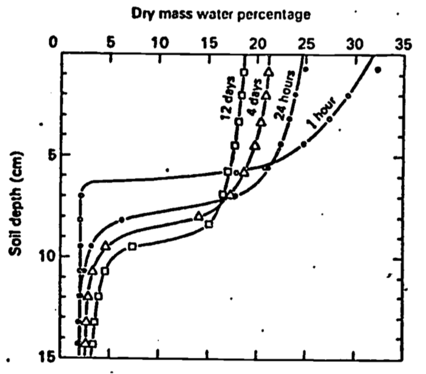
```

Analogous, but somewhat more complex due to accounting for transient dynamics, soil temperatures models are available in TrenchR.

### Application of Results {#soilheatflow-results}
A major use of the quantitative solution discussed here, and of the possible refinements mentioned, is to explain and illustrate how the temperature distribution of, the soil is determined. For a bare soil under clear skies, our solution approximates reality quite well. Variable weather, vegetative cover, various soil inhomogeneities (including changing moisture content) as well as moisture movement (liquid and vapor) can further complicate attempts at solution. As indicated in the previous paragraph, some types of inhomogeneity can be handled by extension of the present analysis. The upper boundary condition can be modeled using Fourier analysis. Alternatively, since the temperature of the soil surface ultimately is a result of the partitioning of solar energy into evaporation, heating of the air and heating of the soil, we may first calculate $G(0)$, and from this obtain $T(0)$. However, this requires modeling of the energy balance (see e.g., Hatheway 1977a, Stevenson 1977a, b, c). In practice, it may be easier to measure soil temperature and heat flux directly rather than deal with the further complexities of the energy balance and surface layer of the atmosphere.

In some cases, however, conditions may be close enough to ideal so that the simple model described here can give quite useful results. For example, Mitchell et al. (1975) present the results of a microclimatic model for dry desert-like areas with sparse vegetation. A finite difference scheme is used to solve the soil heat co-conduction equation. In an attempt to simplify the model, constant diffusivity and soil water content was assumed, and changes of state (i.e., evaporation) were ignored. Standard Weather Bureau data input were solar radiation and average monthly air temperature. The former parameter sets the upper boundary condition while the latter approximates the soil temperature at 0.6 m. (From our discussion of damping depth, it should be clear that there is little diurnal temperature change in the soil at 0.6 m depth.) Comparison of model prediction with actual measurements indicate that soil temperatures determined by both methods agreed within $\pm2$°C for daily variations of from 15°C to 35°C. Apparently, then, even simplified models of soil thermal behavior as discussed in this module would seem to have practical application in environmental modeling. Certainly simple models must serve as the basis of more comprehensive schemes leading to more complete understanding of the affected biological processes.

## Literature Cited {#soilheatflow-litcited}
Carrier, G.F., and C.E. Pearson. 1976. Academic Press, New York. 320 pp.

Carslaw, H.S., and J.C. Jaeger. 1959. Clarendon Press, Oxford. 510 pp. Partial differential equations. Conduction of heat in solids.

DeVries, D.A. 1966. Thermal properties of soils. Pages 236-276 in W.R. Van Wijk, ed. Physics of plant environment, second edition. North-Holland, Amsterdam.

DeVries, D.A. 1975. Heat transfer in soils. Pages 5-28 in D.A. DeVries and N.H. Afgan, eds. Heat and mass transfer in the biosphere: I. Transfer processes in the plant environment. John Wiley, New York.

French, A.R. 1976. Selection of high temperatures for hibernation by the pocket mouse, Perognathus Zongimembris: Ecological advantages and energetic consequences. Ecol. 57:185-191.

Hatheway, W.H. 1977a. Heat balance of a sheep in the sun. Instructional module: Physical processes in terrestrial and aquatic ecosystems. Center Quant. Sci., Univ. Washington, Seattle.

Hatheway, W.H. 1977b. Water transport in trees. Instructional module: Physical processes in terrestrial and aquatic ecosystems. Center Quant. Sci., Univ. Washington, Seattle.

Hildebrand, F.B. 1962. Advanced calculus for applications. Prentice-Hall, Englewood Cliffs. 646 pp.

Jackson, R.D., and S.A. Taylor. 1965. Heat transfer. Pages 349-360 in C.A. Black, ed. Methods of soil analysis. American Soc. Agron. Monogr. 9.

Kramer, P.J. 1969. Plant and soil-water relationships. McGraw-Hill, New York. 482 pp.

Mitchell, J., W. Beckman, R. Bailey, and W.Porter. 1975. Microclimatic modeling of the desert. Pages 275-286 in D.A. DeVries and N.H. Afgan, eds. Heat and mass transfer in the biosphere: I. Transfer processes in the plant environment. John Wiley, New York.

Monteith, J.L. 1973. Principles of environmental physics. American Elsevier, New York. 241 pp.

Richards, S.J., R.M. Hagan, and T.M. McCalla. 1952. Soil temperature and plant growth. Pages 303-480 in B.T. Shaw, ed. Soil physical conditions and plant growth. Academic Press, New York.

Rose, C.W. 1966. Agricultural physics. Pergamon, Oxford. 230 pp.

Sellers, W.D. 1965. Physical climatology. Univ. Chicago Press, Chicago. 272 pp.

Stevenson, R.D. 1977a. The first law of thermodynamics for ecosystems. Instructional module: Physical processes in terrestrial and aquatic ecosystems. Center Quant. Sci. Univ. Washington, Seattle. 28 pp.

Stevenson, R.D. 1977b. Applications of the first law to ecological systems. Instructional module: Physical processes in terrestrial and aquatic ecosystems. Center Quant. Sci., Univ. Washington, Seattle. 32 pp.

Stevenson, R.D. 1977c. Heat transfer processes for the thermal energy balance of organisms. Instructional module: Physical processes in terrestrial and aquatic ecosystems. Center Quant. Sci., Univ. Washington, Seattle. 40 pp.

Taylor, S.A., and R.D. Jackson. 1965. Heat capacity and specific heat. Pages 345-348 in C.A. Black, ed. Methods of soil analysis. American Soc. Agron. Monogr. 9.

Taylor, S.A., and G.L. Ashcroft. 1972. Physical edaphology. W.H. Freeman, San Francisco. 553 pp.

Van Wijk, W.R., and W.J. Derksen. 1966. Sinusoidal temperature variation in a layered soil. Pages 171-209 in W.R. Van Wijk, ed. Physics of plant environment, second edition. North-Holland, Amsterdam.

Van Wijk, W.R., and D.A. DeVries. 1966. Periodic temperature variation in a homogeneous soil. Pages 102-143 in W.R. Van Wijk, ed. Physics of plant environment, second edition. North-Holland, Amsterdam.

## Problem Set {#soilheatflow-problems}
1. Verify that:  
    (a) Equation \@ref(eq:soil-11) is a solution to Equation \@ref(eq:soil-8).  
    (b) Boundary conditions 9 and 10 satisfy Equation \@ref(eq:soil-8).

2. Devise an expression for surface heat flux density $(G(0))$ from Equation \@ref(eq:soil-11).  
    (a) What is the maximum heat flux at the surface? Hint: The trignometric identity $\sin(x+y) = \sin x \cdot \cos y + \cos x \cdot \sin y$ may be useful.  
    (b) When does the heat flux reach its maximum in relation to the maximum in the diurnal temperature wave at the surface? The annual temperature wave?  
    (c) Show that the quality $D/\sqrt{2}$ can be regarded as an "effective depth" for heat flow. Hint: Compare Equation \@ref(eq:soil-2) with result from part 2(a).  
    (d) Show that the amount of heat flowing into the soil during one-half cycle is $\sqrt{2}CDA(0)$. This is the amount of heat required to raise a layer of soil $D/\sqrt{2}m$ thick $A(0)$°C.

3. Refer to Figure \@ref(fig:fig-soil-2).  
    (a) Derive an expression for the damping depth $D$. What is the value of $D$ for the diurnal temperature wave? What is the functional relation between the diurnal and the annual damping depth? What is the value of the annual damping depth?  
    (b) Estimate $A(0)$.  
    (c) Calculate diffusivity $(K)$. Was the soil wet or dry (see Table 13.1, or Figure \@ref(fig:fig-soil-15) in problem 4)?

4. Based on the following figure, comment on possible explanations for the shape of the curves. Hint: Compare Figures \@ref(fig:fig-soil-6) and \@ref(fig:fig-soil-7).

```{r fig-soil-15, echo=FALSE, fig.height=4, fig.show = "hold", out.width = "100%", fig.align = "default", fig.cap='For problem 4'}
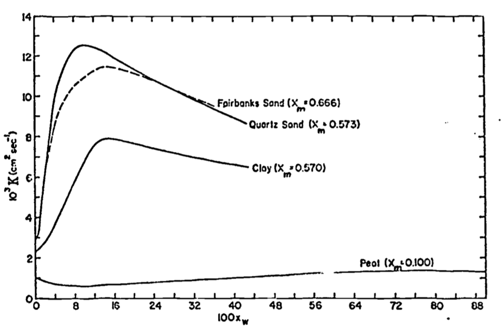
```

## Answers to the Problem Set {#soilheatflow-answers}
1.(a) $T(z,t)=\overline{T}+A(z)\sin[\omega t+B(z)]$

Now $T=\overline{T}+A(0)\exp(-z/D)\sin[\omega t-z/D]$, substituting expressions \@ref(eq:soil-12) and \@ref(eq:soil-13) into \@ref(eq:soil-11). Taking partial derivatives as indicated by Equation \@ref(eq:soil-8):
\begin{align*}
\frac{\partial T}{\partial t}&=\omega A(0)\exp(-z/D)\cos[\omega t-z/D] \\
\frac{\partial T}{\partial z}&=-\frac{A(0)}{D}\exp(-z/D)\sin[\omega t-z/D]-\frac{A(0)}{D}\exp(-z/D)\cos[\omega t-z/D] \\
\frac{\partial^2 T}{\partial z^2}&=\frac{A(0)}{D^2}\exp(-z/D)\sin[\omega t-z/D]+\frac{A(0)}{D^2}\exp(-z/D)\cos[\omega t-z/D] \\
&+\frac{A(0)}{D^2}\exp(-z/D)\cos[\omega t-z/D]-\frac{A(0)}{D^2} \exp(-z/D)\sin[\omega t-z/D] \\
\end{align*}

Notice the first and fourth terms in the expression for $\frac{\partial^2T}{\partial z^2}$ cancel. Substituting in Equation \@ref(eq:soil-8):
$$\omega A(0)\exp(-z/D)\cos[\omega t-z/D]=K(2A(0)/D^2)\exp(-z/D)\cos[\omega t-z/D]$$
or $\omega A(0)=K(2A(0)/D^2)$
Canceling the $A(0)$'s, and rearranging the terms, we get $D=(2K/\omega)^{1/2}$, the identity of Equation \@ref(eq:soil-14).

(b) The first boundary condition, $T(\infty,t) = \overline{T}$ (Equation \@ref(eq:soil-9)) is a constant, so it trivially satisfies Equation \@ref(eq:soil-8) (0 = 0).

The second boundary condition (Equation \@ref(eq:soil-10)) represents a special case of the solution (Equation \@ref(eq:soil-11)) when $z = 0$. Hence part (a) of this problem constitutes proof that the second boundary condition satisfies this problem.

2.(a) 
\begin{equation}
T(z,t)=\overline{T}+A(0)\exp(-z/0)\sin[\omega t-z/D]
(\#eq:soil-11prime)
\end{equation}
We know from Equation \@ref(eq:soil-3) that  
\begin{align*}
G(z,t)&=-k\frac{\partial T}{\partial z} \\
G(z,t)&=-k\{-A(0)/D\:\exp(-z/D)\sin[\omega t-z/D]-A(0)/D\: \exp(-z/D)\cos[\omega t-z/D]\} \\
&=k A(0)/D \: \exp(-z/D)\{\sin[\omega t -z/D]+\cos[\omega t-z/D]\} \\
\end{align*}
The surface heat flux is then  
$$G(0,t)=kA(0)/D\{\sin\omega t+cos\omega t\}$$
Using the identity $\sin(x+y)=\sin x\cos y+\cos x\sin y$  
setting $y=\pi/4$; $\sin(x+\pi/4)=\frac{1}{\sqrt2}(\sin x+\cos x)$, and substituting in the expression for $G(0,t)$, we have
$$G(0,t)=\sqrt{2}kA(0)/D\: \sin(\omega t+\pi/4)$$
The maximum value of $G(0,t)$ occurs when $\sin(\omega t+\pi/4)=1$, so
$$G(0,t)_{max}=\frac{\sqrt{2}kA(0)}{D}$$

(b)
Comparing our expression for $G(0,t)$ with Equation \@ref(eq:soil-11prime) for $z = 0$, we find that temperature lags the heat flux by a phase angle of $\pi/4$ or 1/8 of a cycle. This corresponds to 3 hours and 1-1/2 months for the diurnal and annual case, respectively.
Returning to our basic definition of heat flow in Equation \@ref(eq:soil-2), we write
$$G=-k\frac{\Delta T}{L}$$
Comparing our result from 2(a), we note that $L$ corresponds to $D/\sqrt{2}$ if were to consider heat conduction in a slab, thickness $L$, with a temperature difference maintained between the faces of A.
The amount of heat flowing $(Q)$ per unit area of soil during 1/2 cycle
can be found by integrating $G(0,t)$.
\begin{align*}
Q&=\frac{\sqrt{2}A(0)k}{\omega D}\int_{-\pi/4}^{3\pi/4}\sin(\omega t+\pi/4)d(\omega t) \\
&=-\frac{\sqrt2A(0)k}{\omega D}\cos(\omega t+\pi/4)\int_{-\pi/4}^{3\pi/4} \\
&=-\frac{\sqrt2A(0)k}{D\omega}[-1-(+1)] \\
&=\frac{2\sqrt2A(0)k}{D\omega} \\
\end{align*}
Recall that $D=(2K/\omega)^{1/2}$ and $K=k/G$;
$$Q=\frac{2K}{\omega}\frac{\sqrt2A(0)G}{D}=\sqrt2DA(0)G$$

3.(a) Forming a ratio using Equation \@ref(eq:soil-12) at two depths, we find that
$$D=\frac{z_2-z_1}{\ln[A(z_1)/A(z_2)]}$$
Using the 30 and 15 cm curves, we estimate amplitudes of 2 and 8°C, respectively. So
$$D=\frac{30-15}{\ln(8/\varepsilon)}\cong 11cm$$
Recalling the definition of $D=(2K/\omega)^{1/2}$(Equation \@ref(eq:soil-14)), we can write the ratio
$$\frac{\mbox{D annual}}{\mbox{D diurnal}}=\left( \frac{\omega \mbox{ diurnal}}{\omega \mbox{ annual}} \right)^{1/2}$$
$$\mbox{D annual}=(365)^{1/2}\mbox{ D diurnal}=(19.1)11\cong210cm$$
(b) Using D from part (a), we have
\begin{align*}
A(0)&=A(z)exp(+z/D) \\
A(0)&\cong 31cm \mbox{ using } z=15cm,\:D=11cm,\:A(z)=8°C \\
&\cong 31cm \mbox{ using } z=30cm, D=11cm, A(z)=2°C \\
\end{align*}

(c) Solving Equation \@ref(eq:soil-14) for $K$, we get, using the results from 3(a):
$$K=\frac{\omega}{2}D^2=\frac{\omega}{2}\frac{z_2-z_1}{[lnA(z)_1)/A(z_2)]}^2$$

Or, knowing that the maximum temperature occurs when $\sin(\omega t_{max}-z/D)=1$, or $\omega t_{max}-z/D=\pi/2$, we can subtract such expressions for different depths to get
$$\omega\Delta t_{max}=\frac{z_2-z_1}{D}$$
or
$$D=\frac{z_2-z_1}{\omega \Delta t_{max}}$$
so
$$K=\frac{\omega}{2}D^2=\frac{\omega}{2}\frac{(z_2-z_1)^2}{\omega^2\Delta t_{max}^2}=\frac{1}{2\omega}(\frac{z_2-z_1}{\Delta t_{max}})^2$$
Using the first of these expressions for $K$, one gets $8.8 \times 10^{-3} cm^2 sec^{-1}$, while the latter gives $5.9 \times 10^{-3}cm^2 sec^{-1}$ if $\Delta t_{max}$ is taken to be 4.5 hrs.

Some divergence of answers is expected here due to variation in the thermal properties of the soil, which we have assumed negligible.

The soil was probably dry, since the soil in question is a sandy loam. This is shown most clearly by the figure in problem 4, where at high moisture contents $K$ doesn't fall much below $10 \times 10^{-3} cm^2 sec^{-1}$.

4. The initial rapid increase in $K$ is due to the rapid increase of $K$ at lower water contents. This is because the water displaces air in the dry soil, and the water conductivity is approximately two orders of magnitude greater than that for air.

At higher water contents, heat capacity keeps increasing at a constant rate with addition of water, but the rate of increase of $k$ is continually decreasing. Hence a point is reached when the quotient $k/G$ peaks and decreases with further addition.
