# Turbulence and Fluid Flow {#turbulence}

Turbulence and Fluid Flow: Perspectives
author: Simpson, James P.

***

## PREFACE
Turbulence is discussed in this module as a mode of transport for mass and energy between organisms and their environment. Transport processes of particular emphasis include heat transfer and mass fluxes of water vapor, carbon dioxide, and other trace contaminants. The transport depends upon fluid motion which occurs usually through water or air, fluids which tend to be turbulent. This module introduces some of the basic terminology and concepts of turbulence theory and provides relevant examples. These concepts are used to develop the basic form of the most widely used semi-empirical flux relationships, the so called 'K-theory'. A familiarity with calculus is required in order to understand the mathematical models used.

Turbulence is discussed in this module as a mode of transport for mass and energy between organisms and their environment, The reader is assumed to have an interest in and previous exposure to problems in ecology. This module is intended to be an introduction to concepts and applications of turbulence, but the reader should be familiar with calculus in order to understand the mathematical models. Empirical techniques and actual data are used throughout for added realism and model verification.

***

## INTRODUCTION

Virtually every interaction between organisms and their environment involves the transport or exchange of either mass or energy. Transport processes of particular emphasis in this series of modules include heat transfer and the mass fluxes of water vapor, carbon dioxide and other trace contaminants. For example, Stevenson (1979a) (see also Monteith 1973) has shown that by use of the concept of conservation of energy, which follows from the First Law of Thermodynamics, one can quantitatively describe the balance of energy inputs, outputs and production (e.g., metabolism) which is necessary to understand temperature dependent biological processes. Since many mass fluxes of interest are directly related to energy production or consumption (e.g., oxygen and respiration, carbon dioxide and photosynthesis, water vapor and the latent heat of vaporization), they too should be included in an energy balance description.

The next step in the development of a quantitative understanding of organism/environment interactions is the development of explicit expressions for each of the terms in the energy balance. Several of the terms in such a balance represent the flux of a quantity through a fluid, which for our purposes is usually water or air. Consequently, the transport will be highly dependent upon fluid motion and this is the rub. The flow of real fluids tends to be quite complicated, that is, turbulent. As a matter of fact, most flows occurring in nature are turbulent. Tennekes and Lumley (1972) present a representative listing of such flows. Included are ocean currents, river flow, combustion processes, the photosphere of the sun, the solar "wind," flow around birds' wings, a fish's wake, and the earth's atmosphere--especially trophospheric jet streams and wind fields near the earth's surface. As a result of the ubiquitous nature of turbulent flows, it is necessary to come to some sort of understanding about their behavior, in order to be able at last to accomplish that which we started out to do: quantify organism/ environment interactions.

It is interesting to note in the modules of this series concerned with such interactions that while heat transfer by radiation (e.g., Gates and Stevenson 1979 and Roseman 1979) and conduction (e.g., Simpson 1979a) can be expressed in exact analytic forms, the remaining major terms of the energy budget, convection and evaporation are treated empirically. For example, Stevenson (1979a) gives evaporation as a function of air temperature only because "water loss is a complex process," while Gates (1979a) and Hatheway (1979) give expressions for convective heat transfer that include various complex empirical functions of wind speed, In fact, if one were to inspect any one of a number of texts dealing with transport processes (e.g., Tanner 1968, Monteith 1973 and 1975, Campbell 1977), a variety of ways would be found to quantify convection and evaporation, all of which are empirical. In practice, then, the attempt to solve problems involving turbulent flow exactly is often discarded in favor of the more expedient and, hopefully, useful empirical formulas.

In describing the energy and mass exchanges relevant to biological systems, an empirical description of turbulence is not only useful but usually essential. The practical question remaining for the physiologist or ecologist is how much and what sort of empirical scheme best suits a particular problem. A sound answer requires at least a modicum of understanding of the basic physical process involved: turbulence. This module introduces some of the basic terminology and concepts of turbulence theory, along with relevant examples. These concepts are used to develop the basic form of the most widely used semi-empirical flux relationships, the so-called **K-theory.**

***

## DESCRIPTION OF TURBULENCE

What is **turbulence**? Perhaps the only generally agreed upon response to this question is that turbulence is difficult to define! Generally, the answer takes the form of a list of the characteristics of turbulent flows, such as is done by Lumley and Panofsky (1964, p.3 ff) and Tennekes and Lumley (1972, p.1 ff). Campbell (1977) presents a more elementary discussion of two of these characteristics, probably the easiest to conceptualize, while still conveying the ideas important for this discussion: variability and diffusivity.

### Variability

Anyone who has observed the plume from a smokestack and noticed the irregularity of the force of the wind on a gusty day, or simply lain on their back and witnessed the random evolution of a cumulus cloud, has an appreciation of the variability of turbulence. For example, consider the wind record of Fig. \@ref(fig:fig-turb-1). It gives three one-minute records of the elevation angle from a bidirectional wind vane. Such a wind vane can rotate in the horizontal plane (azimuth) as well as around a horizontal axis perpendicular to the mean wind (elevation). Notice that only a total of seven minutes has elapsed from the first to the last record. The intermittency of the turbulence is illustrated by the marked difference between the record from 1337-1338 and the other two.

Consider the problem of predicting the motion of atmospheric contaminants such as pollen, fungal spores, or pollutants with such variable winds. If the time period of interest is short, the analysis can indeed become difficult.

```{r fig-turb-1, echo=FALSE, fig.height=4, fig.fullwidth=FALSE, fig.cap='Bidirectional vane record of elevation for three one-minute perioes on July 19, 1962 at Douglas Point, Canada.'}
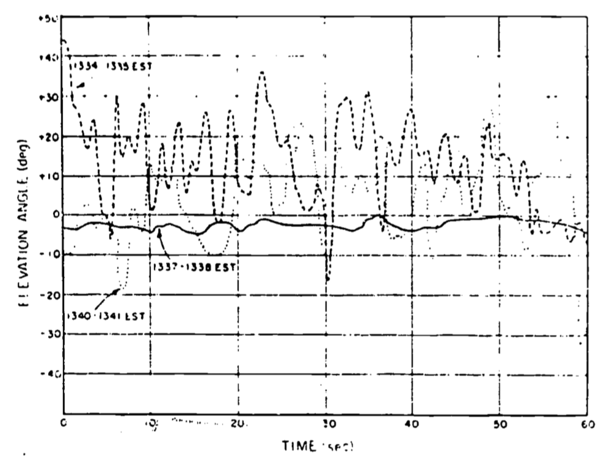
```

The obvious problem is how to quantify something that is, in effect, unpredictable. The answer lies in the use of statistical methods. Fortunately, it turns out that detailed information on the flow field is not necessary, and such simple methods as utilizing time averages of the quantities of interest will suffice in many cases, provided sufficient averaging time is allowed. This is fortunate for another reason. As discussed briefly by Cowan (1979a) (and more completely by Tennekes and Lumley (1972)), equations of motion do exist which in general describe the motion of any fluid. However, the solutions to these equations appear to be so sensitive to minute changes in a given set of experimental conditions that one could never measure these conditions in sufficient detail to permit detailed prediction of the flow (Lumley and Panofsky 1964). In mathematical parlance, this difficulty is caused by the high degree of nonlinearity in the set of partial differential equations applicable. This results in the solution being very sensitive to the given set of conditions (i.e., the boundary conditions).

Turbulence is variable in space as well as time. Campbell's (1977) examples of fields of "waving grain" or "cat's paws" on a lake point this out particularly well.

In fact, this variability in both space and time is quite large. Campbell (1977) illustrates the extremes of these temporal and spatial scales by comparing wind gusts large enough to shake a house to the very small scale "heat waves" that can be observed over a hot surface such as an asphalt highway on a hot day. This large variation in the scales of turbulence has two important consequences. First, one must be cautious when making the analogy between turbulent and molecular transport (diffusion). This problem will be treated later in the discussion of diffusivity. Second, there is the practical problem of the limits imposed by the finite (computational) speed of computers. 

Notwithstanding the fact that the equations of motion (known as the Navier-Stokes equations) are extremely sensitive to their boundary conditions, their solution is still difficult for problems in atmospheric turbulence due to the wide range of scales involved. As an illustration, consider the complexity of one of the simplest problems: channel flow. Figure \@ref(fig:fig-turb-2) illustrates a channel of infinite horizontal dimension and of height H=15 cm, with a fluid moving from left to right with a maximum velocity $(u)$ of $1 m s^{-1}$.

```{r fig-turb-2, echo=FALSE, fig.height=4, fig.fullwidth=FALSE, fig.cap='Fluid movement in an infinite channel.'}
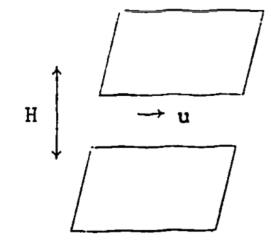
```

Suppose one is required to solve the equations of motion for the velocity and pressure fields. The given dimension and the velocity will give a Reynolds number ($Re$) of $\sim10^4$. The Reynolds number is discussed more fully in the section on the origins of turbulence, so it will suffice to say here that it is a general indicator of whether a flow is turbulent. $Re$ is defined as
$$Re = \frac{ud \rho}{\mu}$$
where $u$ is velocity, $\rho$ density and $\mu$ is the dynamic viscosity of the fluid, and $d$ is a characteristic dimension of the flow. In this example, then,
$$ Re = \frac{1m\:s^{-1} \times 0.15m \times 1.2 kg\:m^{-3}}{0.18 \times 10^{-4}kg\:m^{-1} s^{-1}} = 10^4$$
which indicates a well-developed turbulent flow.

To estimate the computational effort involved here, one must resolve the largest and smallest eddies (turbulence scales) in the flow. Turbulence theory (see Tennekes and Lumley 1972, p. 21) tells us that the ratio of the large to small eddies will be proportional to $(Re)^{3/4}$ . If we designate the size of the small-scale eddies as $n$, we can write this ratio as
$$\frac{H}{n} \sim (Re)^{3/4} = 1000$$
It turns out that there are four equations of motion, which are nonlinear and thus require a numerical solution technique such as finite differences. In turn, this necessitates that a grid network be set up in three dimensions, and the equations solved simultaneously at each point. The number of grid points necessary in both directions perpendicular to the flow will be 2000, assuming two points are required to define an eddy. In the direction of flow, the eddy size would not thus be limited, so we'll assume 20,000 are required. Hence the number of grid points equals $2000 \times 2000 \times 20000 \approx 10^{11}$. Assuming the four motion equations with four unknowns require at least 10^2^ operations per grid point, then the total number of operations per time step would be equal to $10^2 \times 10^{11} = 10^{13}$ . If a minimum of $10^2$ time steps are required to obtain a meaningful solution, the total number of operations necessary becomes $10^{15}$.

Although the numerical solution to the turbulence problem present a computational challenge, this should not be viewed by the biologist as an entirely negative result. In fact, the semi-empirical approach (as pointed out in the Introduction) is in many ways more suited to the type of analysis likely to be needed by, say, a physiologist or ecologist. Consider the various energy budgets involved in the examples of Stevenson (1979b). All that is required in the stream flow, leaf, or spider example is a reliable estimate of the various fluxes of energy; details about how these  fluxes occur are secondary. However, this should not be taken to minimize the importance of more detailed characteristics of turbulent flow fields in other cases of biological interest. Examples of this latter case include nutrient diffusion to plankton, location and size of stream insects, mobility and habitat of flying insects, aerosol dispersion, leaf shapes and characteristics, and even bird wing shape. Ultimately, it is important that the biologist should at least realize the general nature of the problem of turbulent flow as a prerequisite to determining the proper mix of analytic and empirical methods.

### Diffusivity

"The outstanding characteristic of turbulent motion is its ability to transport or mix momentum, kinetic energy, and contaminants such as heat, particles, and moisture" (Tennekes and Lumley 1972, p. 9). Without turbulent transport, life on the earth would either suffocate due to the slow rate of diffusion of CO~2~ or O~2~ from the upper layers of the atmosphere or be poisoned by the buildup of pollutants near the surface. This is well illustrated by a simple example taken from Monteith (1973, p. 134). The amount of CO~2~ required by a healthy crop canopy over the course of a day is equivalent to all the CO~2~ in the first 30m of the atmosphere. The actual diurnal variation of CO~2~ concentration in this layer rarely exceeds 15% of the mean concentration. These figures suggest turbulent transfer supplies CO~2~ from as high as $30m/0.15= 200m$. In fact, measurements have detected small diurnal fluctuations as high as 500m. Apparently, a relatively rapid means of transport must be supplying CO~2~ from above the surface layer to the plants.

To understand more fully why turbulence has such effective mixing properties, it is useful to compare turbulent exchange with the other mode of exchange important in transport processes, that of molecular diffusion. (See also Cowan 1979b or Tennekes and Lumley 1972.) Molecular diffusion is a mixing process dependent upon exchange at the molecular level. Consequently, its characteristic length scale is the mean free path between molecular collisions, typically $7 \times 10^{-8}m$ for air at room temperature and pressure. Since the root mean square velocity for air molecules under similar conditions is approximately $480m s^{-1}$ , the characteristic time scale is quite small ($7 \times 10^{-8}m /480m s^{-1} = 1.5 \times 10^{-10} s$). Even though the interactions (collisions) are quite frequent, the small characteristic lengths over which they act tend to diffuse properties with large scales relatively slowly. (As an example of a property with a large scale, one might consider heat exchange between the warm ground and cooler atmosphere, typically up to heights of 1 kilometer on a warm, sunny day.) As implied in our earlier example of channel flow, the characteristic exchange length (scale) for turbulent exchange is limited only by the dimension of the flow boundaries. Consequently, in the lowest 30m or so of the atmosphere (the surface layer), the characteristic exchange length for the transport at a particular height $z$ will be of the order of $z$. This is because the basic unit of exchange for turbulent flow is what is commonly termed an "eddy," which may be envisioned as a parcel of air in rotational motion which tends to retain its identity and remain relatively intact for a finite distance and time, In other words, we simply consider the random motion of "bunches" of molecules rather than that of individual molecules. The result is mass transport of such quantities as heat over distances of the same order as the size of the eddy, a scale obviously much larger than that in molecular diffusion. More will be said about eddies later on in this section.

A simple example based on Tennekes and Lumley (1972) illustrates the extremely diffusive nature of turbulence by contrasting it with molecular diffusion. Consider the cross-sectional diagram of a room in Fig. \@ref(fig:fig-turb-3), with a radiator in one corner. The question is posed, "How long will it take to heat the room?" The answer, besides clarifying what we mean by diffusivity, gives several insights into common "tricks of the trade" in turbulence theory.

```{r fig-turb-3, echo=FALSE, fig.height=4, fig.fullwidth=FALSE, fig.cap='Convection currents.'}
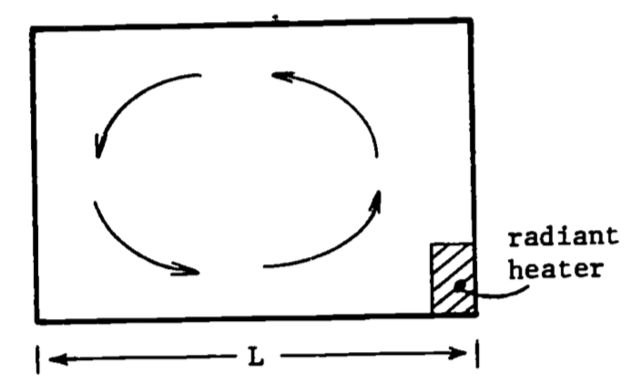
```

The first step in tackling this problem will be to make some appropriate simplifying assumptions. Assume for the moment that gravity is ignored so that no convective currents (such as illustrated in Fig. \@ref(fig:fig-turb-3) will be produced. Consequently, heat transfer is possible only through molecular diffusion. This process is governed by a diffusion type equation (Simpson 1979, or Tennekes and Lumley 1972) of the sort
$$\frac{\partial \theta}{\partial T} = \gamma \nabla^2 \theta$$
where $\theta$ is temperature, $T$ is time, $\gamma$is thermal diffusivity, and $\nabla^2$ is the Laplacian operator.

The second step is to decide to obtain an order of magnitude (within a factor of 10) estimate, rather than attempt the difficult task of obtaining an exact detailed solution. Consequently, we will employ the tools of dimensional analysis (see Fletcher 1979 or Vennard and Street 1975) to interpret the diffusion equation dimensionally as
$$\frac{\partial \theta}{ T} \sim \gamma \frac{\nabla \theta}{L^2}$$
Rearranging terms, one obtains an expression for the time scale $T_m$ of the molecular diffusion,
\begin{equation}
T_m \sim \frac{L^2}{\gamma}
(\#eq:1)
\end{equation}
Notice that all diffusion processes are governed by this relation, where the diffusivity relates a penetration distance to a time independent of the quantity being diffused (notice that $\theta$ cancels out). The dimensions of diffusivity are *always* ($L^2 /T$). In the present example with $L=5m$ and $\gamma = 2 \times 10^{-5} m^2 s^{-1} , T_m \sim 1.25 \times 10^6 s$ or about 14 days. Such a long characteristic time scale compared with the time actually required to heat a room indicates that some other transfer process must be operating.

Removing the first simplifying assumption and allowing for the presence of gravity leads to the weak convective circulation indicated in Fig. \@ref(fig:fig-turb-3). The heating of the radiator induces density differences in the air that when acted upon by gravity cause "the hotter air to rise and the cooler air to sink," so that the circulation illustrated is not unexpected. Therefore, using dimensional analysis of the convective velocity in the room ($U_c$); a characteristic time for turbulent diffusion can be expressed as
\begin{equation}
T_t \sim \frac{L}{U_c}
(\#eq:2)
\end{equation}
Notice that the dimensions of a length divided by velocity is a time. It is assumed that the length scale of the turbulent motion in the air is characterized by the length $L$. It certainly is no larger, and it seems reasonable that the large eddy (illustrated by arrows in Fig. \@ref(fig:fig-turb-3) will be most effective in transport. It remains to estimate the convective velocity $U_c$. Experience suggests that it must be small, somewhere on the order of $U_c=0.05 m s^{-1}$ (see Tennekes and Lumley 1972). Then $L=5m$ implies a $T_t$ of about $100 s$, In conclusion, it is clear that turbulence is much more efficient than molecular diffusion in the transport of quantities such as heat.

The considerations discussed in the example of the heating of the air in the room can be extended to the situation in the atmosphere. It should be made clear that the eddy sizes in the atmosphere, or in the room, are limited in size by the flow boundaries. This only sets the upper limit, albeit the most efficient for transport, as illustrated below. Actually, a whole range of smaller eddy sizes exists, until they become so small that molecular forces become significant. The turbulent structure in the atmosphere in simplest terms can be envisioned as a whole series of eddies, such as in our room example, being carried along by the mean wind, $\overline U(z)$ (Fig. \@ref(fig:fig-turb-4).

```{r fig-turb-4, echo=FALSE, fig.height=4, fig.fullwidth=FALSE, fig.cap='A range of eddies exists, with mean diameter k proportional to height z.'}
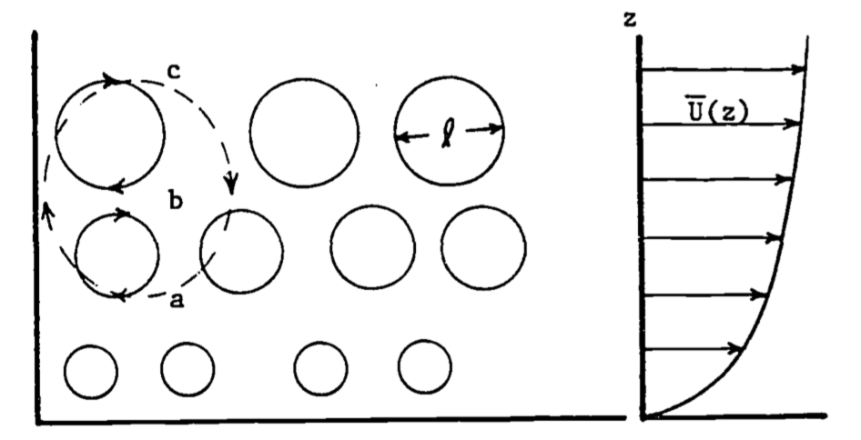
```

Notice that as height ($z$) increases, the eddies tend to become larger, since the surface interferes less with the circulation. Also notice that in the transference of some property, e.g., a warm air parcel, from point A to C, the larger eddy will be the most efficient. This is because the larger eddy transports the quantity of interest from A to C directly, avoiding the more circuitous route and extra mixing that transfer by smaller eddies entails. This latter concept is treated again in the section on K-theory.

Consider the following simple example which (1) illustrates the use of the proper statistical measures for dealing with the variability of a turbulent flow, (2) points out an interesting use of the eddy concept in dealing with turbulent diffusivity, and (3) is a good example of a case where detailed knowledge of the turbulent flow structure is critical to solution of a biological problem.

An important area of pulmonary research concerns the oxygenation of pulmonary capillary blood. The factors that control this process are of obvious importance, especially in the understanding and treatment of various lung diseases. Briefly, the oxygen must cross the alveolar-capillary membranes from the Ling air spaces, diffuse through the blood plasma, pass through the blood cell membrane, diffuse through the cell interior, and finally react chemically with the hemoglobin. Previously, it was assumed that the alveolar-capillary membrane was responsible for most of the resistance to oxygen diffusion. More recently, the turbulent flow properties of dilute suspensions of red blood cells in small diameter tubes have been used to study the resistance due to the cell membrane, interior, and reaction rates. The premise of most of this research was that, since the flow was thought to be turbulent, mixing of the red blood cells with the suspending medium would be quite rapid. Consequently, it followed that an unmixed fluid layer relatively depleted of oxygen would not exist, and hence would not contribute to the diffusion resistance.

Carisen and Comroe (1958), by heat treatment of red cells, obtained a spherical-shaped cell of identical volume to the normal disk-shaped cell. They found oxygen uptake to be the same for both shapes using the flow apparatus, indicating that increasing the diffusion path length inside the cell has no effect. Furthermore, the reaction rate of oxygen with hemoglobin is ruled out as a factor by the comparison of oxygen and nitric oxide uptake, the latter of which reacts ten times as fast as the former with hemoglobin. Again, no change in diffusion time was found by Carlsen and Comroe. Based on the assumptions of turbulent flow and complete mixing, they concluded that the red cell membrane was the chief source of resistance. However, other investigators (e.g., Kreuzer and Yahr 1960) have compared the uptake rates of similar layers of red cells and plain hemoglobin. Again, uptake rates were the same, which apparently rules out the cell membrane as the source of resistance. Which conclusion is in error?

Gad-el-Hak et al. (1977) have proposed an answer to the dilemma from an analysis of the relevant turbulent properties of the flow fields involved. They first of all clarify the criteria for true turbulent flow in such studies ($Re>3000$). Evidence is then provided which indicates that, contrary to previous thought, an unmixed fluid layer does exist next to the cell. This can, of course, explain the aforementioned conflicting results. Envision, if you will, a typical blood cell, being tossed and whirled about by the turbulent fluid. This cell takes up oxygen, causing an area of oxygen deficit in its immediate vicinity. The replenishment rate is dependent primarily upon the size of the eddies and the length of time they exist relative to the distance and time dependence of oxygen uptake by the cells. For example, if the eddies are large relative to the cells, the cell will tend to move along with the eddy. This circumstance tends to deplete the eddy of oxygen, while at the same time not allowing the cell to come into effective contact with other more oxygen rich eddies. Conversely, if the eddies are small relative to the cell, the cell will tend to contact eddies more often, perhaps several at a time. Hence, mixing is more effective, and diffusion resistance is smaller. A further discussion of such time dependent phenomena is contained in Problem 5.

Further evidence to support this explanation was obtained by Gad-el-Hak et al. through the use of sophisticated laser anemometry techniques to measure the turbulent fluctuations, and various statistical measures to quantify eddy sizes and velocities. (Details are not covered in this paper. See Gad-el-Hak 1977 or Tennekes and Lumley 1972 for further discussion.) In essence, their results show that the turbulent scales range from $0.07 mm$ to $1.3 mm$, as compared to the $0.008 mm$ dimension for a red blood cell. Their analysis indicates 45 milliseconds ($ms$) are required, on the average, to replenish the oxygen in the layer immediately around the cell. This compares to independent measurement which indicates that the uptake process requires $10-100 ms$. Both time and scale considerations thus are shown to lend support to their hypothesis that O~2~ uptake is at least partly limited by convective mixing in the layer of fluid immediately adjacent to the cell wall.

***

## ORIGINS OF TURBULENCE

In the description of turbulence, it was noted that it is an ubiquitous property of almost all natural flows. It is of utmost importance in many processes due to its superior mixing and transport properties, while at the same time being very difficult to work with quantitatively due to its random nature. Two questions remain to be dealt with in this module: what is the origin of turbulence, and how can we quantify the transport which results without being overwhelmed by intractable complexities.

As discussed by Vennard and Street (1975) and Cowan (1979a), there are two flow regimes of interest in physical and biological processes: laminar and turbulent. Laminar flow is smooth, orderly and predictable, in contrast to turbulent flow. For a given flow geometry, one can predict by the value of the Reynolds number ($Re$) whether the flow is laminar, turbulent, or in a state of transition. The Reynolds number is a combined measure of fluid velocity, viscosity, density and a characteristic dimension. In essence, laminar flow becomes turbulent when small perturbations or instabilities in the flow are provided with a sufficient input of energy to grow and destroy the orderly nature of the laminar flow. In any given situation, one can think of an increase in the Reynolds number as a velocity increase, since the other parameters presumably would not change. A large Reynolds number corresponds to a large velocity and thus a large energy input. Therefore beyond some critical point, a large Reynolds number indicates that the flow instabilities will be able to grow and cause the flow to become fully turbulent. The flow geometry, including the roughness of any surfaces in contact with the flow, can have a dramatic effect on the values of the Reynolds number which define the transition zone between laminar and turbulent flow.

### Viscosity and Laminar Shear FLows

As has been indicated, a source of energy is required to cause turbulent flow. Indeed, turbulence requires a continuous energy input, otherwise it rapidly decays due to frictional losses as a result of the viscosity of the fluid. Two sources of energy input exist to maintain turbulence in common flows. The first source is shear in the mean flow, where friction between the surface and the fluid causes energy from the mean flow to be diverted into the creation of turbulent velocity fluctuations. The second source derives from the heating of the fluid at the surface, which causes the fluid to rise generating turbulence. These mechanisms are known respectively as mechanical and thermal (convective, buoyance driven) turbulence. To gain some insight into these turbulence maintenance mechanisms, a fundamental understanding of viscosity and shear flows is essential, starting with laminar flow and progressing from there into the more complex turbulent flow case.

```{r fig-turb-5, echo=FALSE, fig.height=4, fig.fullwidth=FALSE, fig.cap='Laminar shear stress (T) between two regions, where velocity (v) depends on distance (y) from the bottom, after Vennard and Street (1975).'}
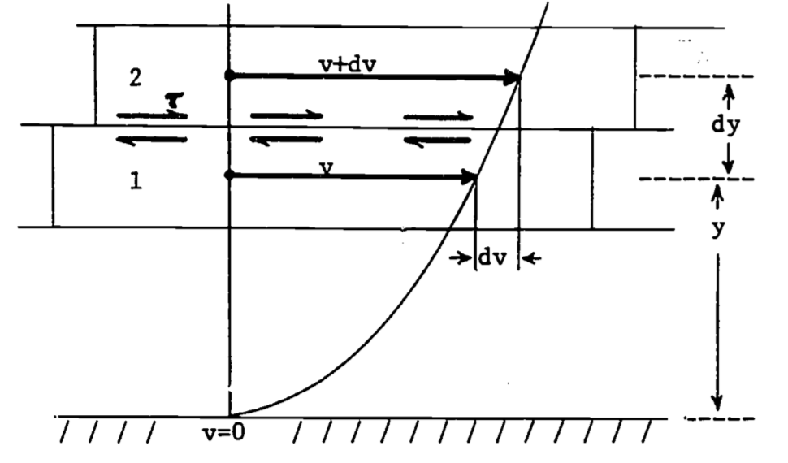
```

Consider the laminar flow of a fluid over a smooth horizontal surface as depicted in Fig. \@ref(fig:fig-turb-5). Observations reveal that a **velocity profile** exists over the surface. In this case, from a condition of zero velocity right at the surface, the velocity increases with distance from the surface, indicating that there is relative motion between fluid layers. This is illustrated by consideration of the two infinitesimal fluid layers in Fig. \@ref(fig:fig-turb-5). Two particles (1 and 2) in adjacent layers move distances of $vdt$ and $(v+dv)dt$ in the time interval $dt$. Thus we say that the fluid is sheared because the slope of a line connecting points 1 and 2 tends to increase with time. It should be evident then that a frictional force must exist between the fluid layers, otherwise the velocity profile would be uniform right down to the surface. This frictional force produces a **shearing stress** ($\tau$), and this stress has been found by observation to vary linearly with the velocity gradient ($dv/dy$ in our example). The constant of proportionality in this relation is termed the **viscosity coefficient** ($\mu$), and we may write the relationship, known as Newton's law of viscosity, as
$$\tau = \mu \frac{dv}{dy}$$
Viscosity is the result of molecular momentum exchange (a subject discussed subsequently in the discussion of mixing length theory) and cohesion between fluid layers, giving rise to the tangential shearing stress. Most fluids of interest here (e.g., air and water) obey the above relation, and are known as Newtonian fluids. (See e.g. Vennard and Street 1975, p.16 ff for a more detailed discussion.)

Although most flows in nature are turbulent, there are notable exceptions. For example, Cowan (1977b) treats the flow environment of plankton. Their movement can be closely approximated in many cases by treating the flow they encounter as laminar. (With their small diameter and sinking velocity, the Reynolds number here is quite small.) However, as is pointed out, the sea itself may be turbulent, as most flowing water certainly is (see Cowan 1979b or Ealgeson 1970), which may invalidate this simplified approach in some applications. 

### Turbulent Shear Flow

As has been described earlier (see also Tennekes and Lumley 1972 or Cowan 1977), turbulent flow is a random and irregular variation of velocity which can be thought of as being superimposed upon a steady mean flow velocity. The concept of an eddy was used to visualize that part of the flow responsible for this variation. It seems apparent that the preceding analysis of laminar shear based on only molecular interactions is not suitable for a similar treatment of turbulent flow. We will find, however, that for partial applications at least, many similarities are evident.

```{r fig-turb-6, echo=FALSE, fig.height=4, fig.fullwidth=FALSE, fig.cap='Turbulent shear stress, after Vennard and Street (1975).'}
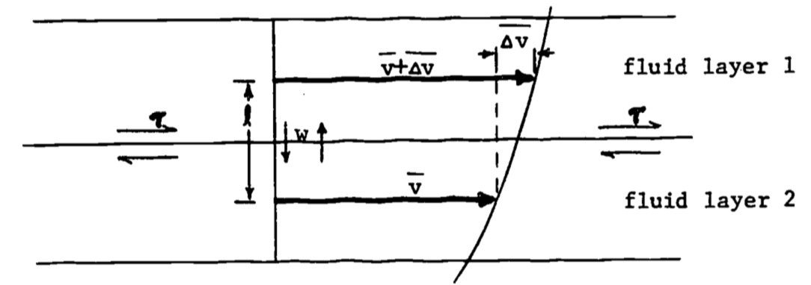
```

Figure \@ref(fig:fig-turb-6) represents a turbulent velocity profile, in this case for the mean horizontal velocity, as indicated by the over bar ($\bar v$). Notice that the portion of the profile near the lower boundary (again a flat, horizontal surface) has been omitted. This is due to the fact that in actuality a thin layer of laminar flow exists right next to the surface, which breaks down into turbulent flow immediately above. This leads to two different profile shapes, the laminar portion being omitted in Fig. \@ref(fig:fig-turb-6) by excluding the lowest segment of the profile. (Boundary layers will be discussed in a later section; see also Monteith 1973 or Vennard and Street 1975). To visualize shearing stress for turbulent flow, we will consider the basic unit of transport to be the eddy, rather than the molecule. These eddies are randomly moving up and down between fluid layers with velocity $w$. We will assume that an eddy moves an average distance $l$ before it breaks up and loses its identity. (Notice the analogy here between $l$. and mean free path of molecules.) The important point is that eddies with mean velocities of $v$ and $\bar v + \Delta \bar v$ are being transported up and down, carrying with them their cargoes of momentum into regions with velocities of $\bar v + \Delta \bar v$ and $\bar v$, respectively. This implies that momentum is exchanged between layers.

To be more explicit, consider an eddy or fluid parcel of average velocity $\bar v$ which through turbulent motion moves up into a region of average velocity $\bar v + \Delta \bar v$. This parcel eventually mixes with the fluid in the higher speed layer, slowing it down. The converse is true for fluid moving from regions of higher to lower velocity. The net result tends to speed up the slower layer and slow down the faster layer, which is exactly what happens in the laminar case described earlier under the action of a shearing stress. Thus we see that the existence of a shearing stress in turbulent flow can  be deduced from the random motion of fluid parcels and the resultant momentum transfers (Vennard and Street 1975, p. 302 ff).

The growth and maintenance of the flow instabilities which lead to turbulent velocity fluctuations depend upon a continuous energy input. In the preceding section, it was described generally how, due to friction, energy is diverted from the mean flow to turbulent production. As a matter of fact, at the present time a fairly complete understanding of this mechanical turbulence exists. On the other hand, the energetic connection between buoyancy (convection), the other main source of turbulence, and turbulent velocity fluctuations is not nearly as well understood. The basic process involves the temperature fluctuations in the air causing corresponding density fluctuations. The result is relative motion of these different temperature air parcels, giving rise to the fluctuating velocities characteristic of turbulence. In any event, exactly how the turbulence and either the mean flow or the buoyancy are coupled energetically is beyond the scope of this treatment (see Tennekes and Lumley 1972, p. 59 ff). It must suffice at this point to state that the preceding treatment of shear flows and momentum transfer is an essential ingredient to the proper understanding of turbulent production, as well as having other important applications.

***

## THEORIES OF TURBULENCE

Businger (1973) states that "the primary objective of the study of turbulence in the atmospheric boundary layer is to obtain tractable expressions for the fluxes of heat, momentum, water vapor and other atmospheric constituents." This is true not only for large scale interactions of, for example, weather systems with the earth's surface, but also on smaller scales, such as the heat balance of exposed animals or the carbon dioxide exchange of a plant leaf. We are of course not limited to atmospheric flows. Turbulent fluxes are also important in the marine or aquatic environment, where we might include such things as nutrient fluxes, or the "fluxes" of the organisms themselves, borne about by the currents. An interesting example of this latter phenomenon is the formation of cold-core rings, which are giant eddies which break off from large meanders of the Gulf Stream (Wieke, 1976). Ranging up to 300 kilometers in horizontal extent, these eddies form around a "core" of seawater of different origin, and persist for up to two years. Consequently, they are of great ecological importance, since they represent a large scale intrusion of one oceanic community by another (the one surrounded by the eddy). It is thought that a better understanding of the factors which ultimately limit the distribution of oceanic, planktonic organisms may be gained by study of such structures.

Despite the importance of the study of turbulence for the various types of flow encountered in nature, in most cases rigorous analytic solutions do not yet exist. The equations of motion previously referred to should in theory describe turbulent flow in detail, but the extreme nonlinearity of the equations plus the randomness of turbulent flows makes this approach unfeasible at present. Consequently, most theories of turbulence are semi-empirical in nature. That is, they are based on a theoretically sound base, such as the Navier-Stokes (N-S) equations, but also rely on empirical assumptions about the processes involved to complete the theory. In short, unlike the case in many other physical theories, the equations do not tell the whole story of turbulence. Rather, the key to success appears to be the inventiveness of the researcher in applying the crucial simplifying assumptions. This is the problem and challenge of turbulence research.

It is due primarily to this very inventiveness that the uninitiated often find themselves awash in a sea of seemingly ad hoc assumptions and oversimplifications if they should attempt to read the turbulence literature. But, as in much scientific writing, a certain level of prior knowledge of the subject is usually assumed. While a thorough understanding of this "background material" is appropriate to textbooks on the subject, this paper attempts to deal with some of the most common material. Since we are primarily interested in calculating fluxes, it is appropriate that this final section deal with flux estimating procedures, drawing upon prior developments in this paper to link the procedure to the theory and phenomenon of turbulence.

### Reynolds Averaging

Most semi-empirical theories are based upon a set of equations derived from the N-S equations called the Reynolds equations. The derivation is straightforward, and involves dividing the motion into its mean and fluctuating parts (see Cowan 1979a or Tennekes and Lumley 1972). The variables of interest are the pressure and the three velocity components. As an example, consider the decomposition of the velocity in the x-direction,
$$u = \bar u + u'$$
The overbar refers to the time average in the case of steady flow (see Cowan 1979a or Vennard and Street 1975), and the prime refers to the fluctuation around the mean (Fig. \@ref(fig:fig-turb-7)).

```{r fig-turb-7, echo=FALSE, fig.height=4, fig.fullwidth=FALSE, fig.cap='Velocity components--fluctuations around the mean.'}
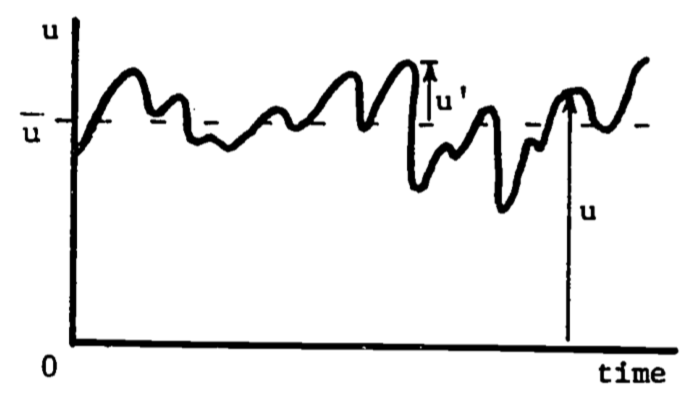
```

The four expressions so derived are substituted into the N-S equations, and the resultant equations are then averaged over time, producing the Reynolds equations. This process is called Reynolds averaging, and it removes the rapidly varying nature of the N-S equations, at the expense of the addition of other terms. The net result is to introduce more unknowns (through the additional terms) than there are equations, making unique analytical solutions impossible. This so-called closure problem of turbulence is what leads to the necessity of introducing empirical equations for the extra unknowns, as was discussed earlier. Investigations of such empirical methods comprise a major part of the study of turbulence.

As a practical example of this, let us consider flow in the atmospheric surface layer. Assume that the mean wind ($\bar u$) is in the x-direction, and write the resultant simplified Reynolds equation for the x-component (Tennekes and Lumley 1972, p. 30ff).

\begin{equation}
\frac{d \overline u}{dt} = - \frac{1}{\rho}\frac{d \overline P}{dx} + \frac{\partial}{\partial z} \bigg(- \overline{u'w'} + \frac{\mu}{\rho} \frac{\partial \overline u}{\partial z} \bigg)
(\#eq:3)
\end{equation}

Here $\rho$ is air density (assumed constant), $\overline P$ is wean air pressure, $w$ is vertical velocity, and $\mu$ is air viscosity (also assumed constant). Each term has the units of acceleration. The first term on the right represents acceleration due to pressure gradients. The first term in brackets is the "additional" term introduced by Reynolds averaging, and it represents acceleration due to turbulent shear stresses (see the section on Turbulent Shear Flow). The last term in brackets accounts for acceleration due to viscous (laminar) shear stress, which, as may be surmised from earlier discussion, is negligible compared to turbulent shear stress (except right at the surface, in the laminar boundary layer). We recognize that, using equation \@ref(eq:3), we could rewrite the bracketed portion of equation \@ref(eq:4) as

\begin{equation}
- \frac{1}{\rho} \rho \overline{u'w'} + \frac{1}{\rho} \tau
(\#eq:4)
\end{equation}

One would then be tempted (if they were also a turbulence researcher!) to assume that the first term also represents a stress $\tau_t$, possibly due to the turbulence ($\tau_t$ is a subscripted stress and does not represent a time derivative.):

\begin{equation}
\tau_t = -\rho \overline{u'w'}
(\#eq:5)
\end{equation}

In fact, it turns out that equation \@ref(eq:5) does not represent the contribution of the turbulent motion to the mean stress. This was discussed in the section on Turbulent Shear Flow, but further development is warranted here.

An averaged product of fluctuating variables such as equation \@ref(eq:5) is called a correlation. If the variables in such a product have the same (opposite) sign for most of the time as do $a$ and $b$ in Fig. \@ref(fig:fig-turb-8), then the product is greater than (less than) zero. Notice that the variable $c$, on the other hand, is uncorrelated with either $a$ or $b$, hence the products $\overline{ac}$ or $\overline{be}$ probably equal zero. In terms of $u'$ and $w'$, this means that if the vertical wind fluctuations are positive (upward) when the horizontal wind fluctuations are negative, and vice versa, then $u'$ and $w'$ are negatively correlated, hence the minus sign in equation \@ref(eq:5). Such an interpretation also agrees with the turbulent velocity profile in Fig. \@ref(fig:fig-turb-6) and the subsequent discussion. Momentum is constantly being transported downward (or momentum deficit is being transported upward). The end result is that the surface absorbs momentum from the flow, and consequently experiences a frictional force acting in the direction of the flow. As required by Newton's Third Law, this force is opposed by frictional drag exerted on the air by the surface.

```{r fig-turb-8, echo=FALSE, fig.height=4, fig.fullwidth=FALSE, fig.cap='Variables and b are corelated (adapted from Tenekes and Lumley 1972).'}
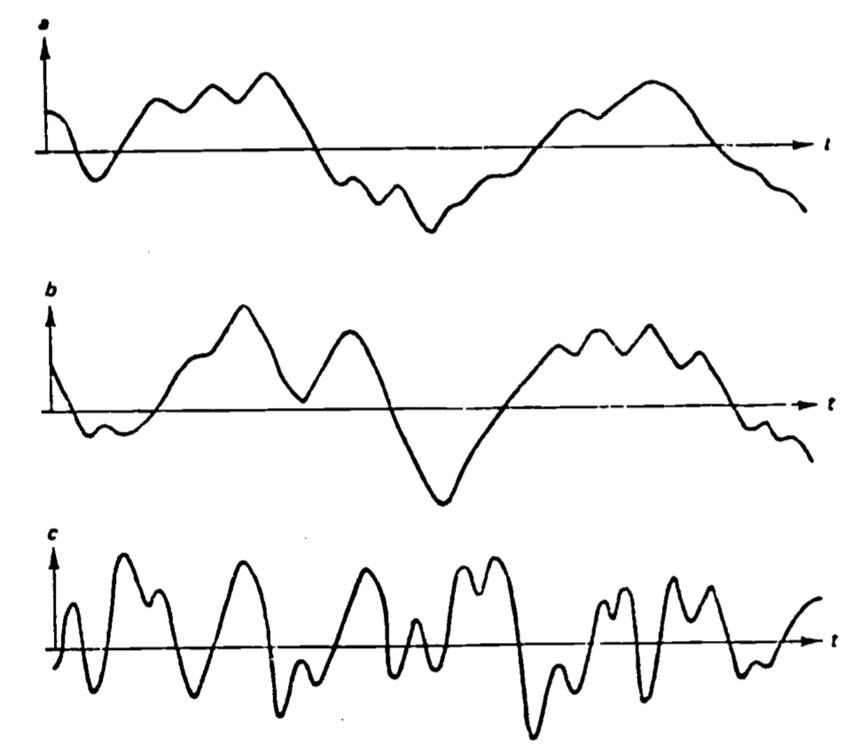
```

In practice, expressions such as equation \@ref(eq:5) are used in the actual measurement of surface fluxes in the atmosphere. It has been found that the fluctuating horizontal velocity term ($u'$) can be replaced with the fluctuating component of virtually any trace constituent (such as water vapor or CO~2~), thus obtaining the flux of that quantity. However, an emphasis on obtaining the maximum amount of information with the minimum amount of measurement precludes use of this correlation technique in most biological applications at present. This is due to the fact that the quantities to be measured are generally varying quite rapidly, so that a measurement and multiplication must be accomplished up to ten times a second. The next section introduces a more common general method of flux determination, which though simpler loses some of the insight into the actual physical processes which the correlation approach provides.

### K Theory 

Recall the discussion of the section titled Origins of Turbulence, in particular the similarities pointed out between turbulent and laminar shear stress. These similarities, in addition to the complexity of the equations of motion, make it tempting to write the expression for turbulent stress in a manner analogous to equation \@ref(eq:3),

\begin{equation}
\tau_t = \rho K \frac{d \overline u}{dy}
(\#eq:6)
\end{equation}

As the previous section demonstrated, such an assumption considerably simplifies the mathematics. In addition, it turns out that in many cases of substantial practical interest, such an approach has adequate predictive abilities. However, several objections can be raised to these so-called "K-theories". First of all, it must be remembered that viscosity is a property of the fluid itself, depending basically upon its molecular makeup. Turbulence, and hence the "eddy viscosity" ($K$) in equation \@ref(eq:6), are properties of the flow, and do not depend on the fluid. A perhaps more subtle distinction is that the time and length scales of turbulent flow are generally of the same order of magnitude as those scales representing the distribution of the property of interest, while the scales for molecular diffusion are much smaller. Thus the similarity of turbulent and molecular diffusion must be approached with caution (Lumley and Panfsky 1964). So while the adoption of a K theory formulation implies that the attempt to understand the turbulence has been de-emphasized; the success that K theories have enjoyed in certain useful applications have made them a valuable tool.

It is useful to again use the tool of dimensional analysis to extend the discussion of the section titled "Diffusivity" and derive a dimensional estimate for $K$. Analogous to the development of equation \@ref(eq:1), one may write a time scale for turbulent diffusion $(\tau_t)$ as
$$T_t \sim \frac{L^2}{K_H}$$
where $K_H$ is the eddy diffusivity for heat analogous to $\gamma$, the thermal diffusivity constant. It is reasonable to require that this time be of the same order as the characteristic time defined in equation \@ref(eq:2). Thus we can write
$$T_t \sim \frac{L}{K_H} \sim \frac{1}{U_c}$$
which gives us the following expression for $K_H$:
\begin{equation}
K_H \sim U_cL
(\#eq:7)
\end{equation}
Diffusion type equations may be written for quantities besides heat, including mass and momentum. Hence expressions such as equation \@ref(eq:7) are perfectly general, and one finds them frequently in applications.

Let us illustrate a common method of utilizing an expression like equation \@ref(eq:7) in practical applications. The previous discussion of atmospheric turbulence suggests that the natural choice of a length scale for a wallbounded flow would be the distance from the surface to the measuring point, $z$. Recall that this can be thought of as the size of the most efficient energy transporting eddy. $u_*$, the so-called friction velocity, is the velocity scale used. It is defined by the expression
\begin{equation}
\tau = \rho u^2_*
(\#eq:8)
\end{equation}
which can be easily shown to be correct dimensionally. Qualitatively, it can be thought of as the tangential rate of rotation of the eddies. In this way, it can be related to the expression for dynamic wind pressure in Bernoulli's equation, $1/2\rho u^2$ (see, e.g., Vennard and Street 1975). Also, there is the relation
\begin{equation}
K_M = ku_*z
(\#eq:9)
\end{equation}
where $K_M$ is the eddy transport coefficient of momentum of eddy viscosity and where $k$ has been shown experimentally to be a constant, approximately equal to 0.4, and is known as von Karman's'constant.

Normal practice in micrometeorology, for example, is to substitute equations \@ref(eq:8) and \@ref(eq:9) into the gradient relation (equation \@ref(eq:6)) and solve for $u_*$,
\begin{equation}
u_* = kz \frac{d \overline u}{dz}
(\#eq:10)
\end{equation}
This of course is tantamount to finding $\tau$. $u_*$ is important in certain mean gradient methods for finding the fluxes of heat and mass, notably the aerodynamic method (see, e.g., Campbell 1977 or Monteith 1973 or 1975) and the combination or Penman type methods. A particularly lucid exposition of these methods as applied to evapotranspiration can be found in Chapter 3 of Taylor and Ashcroft (1972). It should be apparent from the one-dimensional nature of equations \@ref(eq:6), \@ref(eq:9) and \@ref(eq:10) that we are considering transport to be occurring in only one direction, normal to the surface. This is the case when we consider flow over an essentially infinitely long, horizontal and homogeneous surface. Transport to or from small objects such as animals requires a different approach.

### Boundary Layers and Non-dimensional Numbers: A Bulk Approach

Implicit in the present treatment of turbulence has been the proximity of a surface to the flow. As discussed previously, much turbulence originates at surfaces. Out of the main sources of turbulence is the friction between the fluid and the surface (mechanical turbulence). Another important source is due to heating of the surface, which transfers heat to the fluid, causing the less dense, heated fluid to rise (thermal turbulence). If there is bulk movement of the fluid, mechanical turbulence is present, but of course only in the area where the frictional influence of the surface is important. This region of surface influence is known as the **boundary layer**. It can be characterized by a boundary layer depth, which corresponds to the streamline along which the velocity reaches 99% of the free stream velocity (see Fig. \@ref(fig:fig-turb-9)). This latter velocity is the one which characterizes the fluid away from the retarding influence of the surface. Notice in Fig. \@ref(fig:fig-turb-9) that the flow is initially laminar, changing to turbulent, with a transition region of mixed laminar and turbulent flow called the viscous sublayer. This flow structure is due primarily to the fact that the fluid layer immediately next to a surface has zero velocity with respect to the surface, and the flow must adjust itself accordingly. See Vennard and Street (1975) or Monteith (1930) for a further discussion of boundary layers.

```{r fig-turb-9, echo=FALSE, fig.height=4, fig.fullwidth=FALSE, fig.cap='Visualization of the development of the boundary layer velocity profile. From left to right, the initial uniform velocity shows a laminar profile upon first contact with the surface. This develops into a turbulent layer if the Reynolds number is large. From Vennard and Street 1975, p. 312.'}
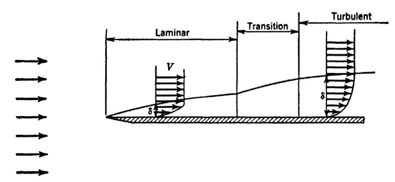
```

K theory, or the gradient approach, requires measurements to be taken in the boundary layer region, an approach especially suitable where the boundary layer is extensive, such as in wind flow over the earth's surface. However, measurements within the boundary layer become extremely difficult around small objects, such as animals or leaves. Due to the complex geometry, small size and many possible orientations with respect to the wind for such objects, it becomes practically impossible to define where the boundary layer is, let alone take measurements there. Consequently, in the case of small objects, a bulk approach is taken. Measurements of the property being transported are taken in the environment, far enough away so that the surface does not influence the flow, and at the surface itself. This approach is practical here because for small objects the boundary layer is sufficiently thin for this difference in properties to be clearly defined.

The bulk approach is actually an integrated form of the gradient approach (Businger 1973) and thus is still based on the same molecular analogy. Taking heat transfer as an example, one may write the flux of heat ($F_H$) for a still fluid as
\begin{equation}
F_H = \frac{k}{\delta} (T_0 - T_\infty)
(\#eq:11)
\end{equation}
where $k$ is the thermal conductivity of the fluid, $\delta$ is the uniform boundary layer depth, and $(T_0 - T_\infty)$. is the difference between surface and environmental temperatures, respectively. Equation \@ref(eq:11), as presented, is exact in its description. In the more general case, where the fluid can be in motion, the boundary layer may be turbulent and of variable depth and structure. In this case, $\gamma$ becomes a sort of average or equivalent boundary layer depth, not directly measurable. An empirical approach has been proposed (Monteith 1973) which is well borne out by experiment. First, write equation \@ref(eq:11) as
\begin{equation}
F_H = (\frac{d}{\delta}) \frac{k}{d} (T_0 - T_\infty)
(\#eq:12)
\end{equation}
were $d$ is a characteristic length (e.g. the diameter of a sphere or cylinder, the length of a flat plate in the direction of flow). Then rearrange equation \@ref(eq:12) 
\begin{equation}
Nu = \frac{d}{\delta} = \frac{F_H}{(k/d)(T_0 - T_\infty)}
(\#eq:13)
\end{equation}
This is the defining relation for the Nusselt number ($Nu$). When determining the heat flux, equation \@ref(eq:11) would normally be written
\begin{equation}
F_H = Nu(k/d)(T_0 - T_\infty)
(\#eq:14)
\end{equation}
Notice that all quantities on the right-hand side of equation \@ref(eq:14) are directly available except $Nu$. If equation \@ref(eq:14) is to be of any more practical use than equation \@ref(eq:11), a means of determining $Nu$ is required.

Equation \@ref(eq:13) points in the general direction of the method used to find $Nu$. It can be regarded as a purely empirical constant, and under suitable conditions $F_H$ and $k/d(T_o - T_\infty)$ can be determined independently for different conditions of flow and geometry, and its values tabulated. It turns out that for a given geometry and orientation to the flow, $Nu$ can be written
\begin{equation}
Nu = A Re^n
(\#eq:15)
\end{equation}
for forced convection. Thus, once $A$ and $n$ are determined for a particular geometry and orientation, $Nu$ is calculable. This should not be surprising, since $Re$ is an indicator of turbulence, and it has been demonstrated that $Nu$, an indicator of heat transfer, is a function of the degree of turbulence. Notice also that equation \@ref(eq:15), by use of $Re$ instead of just the velocity, has taken into account the effects of fluid viscosity and characteristic length of the body, making $A$ and $n$ independent of body size.

This dependence of $Nu$ on $Re$ indicates that $Nu$ is not "purely empirical." Consider the ratio in the defining relation of equation \@ref(eq:13), $F_H/\frac{k}{d}(T_0 - T_\infty)$. This can be thought of as the ratio of actual heat flux ($F_H$) to that which would result in a stationary fluid layer of depth $d$ due to the same temperature difference ($T_0 - T_\infty$). Thus, for a still fluid layer over a flat plate, we would expect $Nu=1$. Heat transfer is of course more efficient in a flowing fluid, especially, as discussed earlier, if the flow is turbulent. Therefore we would expect $Nu>1$ in these cases. $Nu$ is also a function of geometry. For example, $Nu=2$ for a sphere in a still fluid (see Businger 1973, p.68 for a derivation). In practice, then, we find different geometries (and orientations) treated separately. Note, however, in Fig. \@ref(fig:fig-turb-10), that geometry is not extremely critical, e.g. a man and a sheep behave essentially as cylinders. Another nondimensional number, the Grashof number ($Gr$), assumes the place of $Re$ for the free convection case.

A convenient tabulation of various dimensionless numbers is in Campbell (1977, p.65). Monteith (1973, pp.224-225) tabulates $Nu$ for forced and free convection, various geometries, and ranges of $Re$ (or $Gr$). Part of this table is reproduced in Table 1. Using the information there, in conjunction with equation \@ref(eq:14), one can obtain estimates of heat flux for various body geometries, wind speeds, and body size. The quantity $Nu \frac{k}{d}$ is related to similar terms used by various authors such as the heat transfer coefficient ($h$) and the exchange resistance ($r$) by the expression
$$ Nu \frac{k}{d} = h = \frac{\rho c_p}{r}$$
where $\rho$ is fluid density and $c_p$ is specific heat.

```{r fig-turb-10, echo=FALSE, fig.height=4, fig.fullwidth=FALSE, fig.cap='A plot ofthe Nusselt number versus the Reynolds number compares convective heat transfer from a man (-.-) and a sheep (...). The data are fairly close to theoretical calculations made for a cylinder (-). From Monteith 1972, p. 111.'}
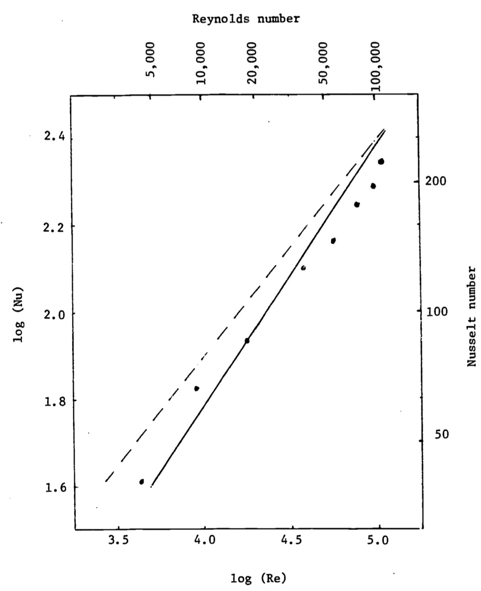
```

```{r tab-turb-1, echo=FALSE, fig.height=4, fig.fullwidth=FALSE, fig.cap='Nusselt numbers for air: forced convection From Monteith 1973, p. 224.'}
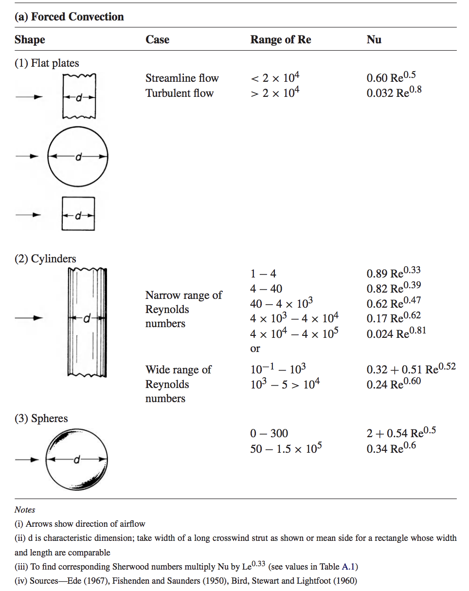
```

***

## RECAPITULATION 

The primary purpose of this module has been to acquaint the reader with enough of the rudimentary aspects of the theory of turbulent fluid flow to provide a basis for discussing fluxes of mass and energy between organisms and their environment. An attempt has been made through the use of examples to relate this development to processes of significance in biology. An introduction to the two major semi-empirical applications of turbulence to expressions for the fluxes of such quantities as heat, momentum, and mass lays the groundwork for a more comprehensive treatment of exchange processes. A major stumbling block to the uninitiated is the use of strange terminology and many seemingly ad hoc assumptions in treatments of turbulent exchange. It is hoped that this module has cleared up some of that "mystery" and provide a sound base for further discussion.

***

## LITERATURE CITED

Businger, J.A. 1973. Turbulent transfer in the atmospheric surface layer. In D.A. Haugen (ed.), Workshop on Micrometeorology, pp. 67-100. ANS, Boston.

Campbell, G.S. 1977. An Introduction to Environmental Biophysics. SpringerVerlag, New York. 159 pp.

Carlsen, E. and J.H. Comroe, Jr. 1958. The rate of uptake of carbon monoxide and of nitric oxide by normal human erythrocytes and experimentally produced spherocytes. J. Gen. Physiol. 42:83-107.

Cowan, C.E. 1979a. Fluid Dynamics Applied to Streams. An instructional module in the series: Physical Processes in Terrestrial and Aquatic Ecosystems. Ctr. Quantitative Sci., Univ. of Washington, Seattle. 38 pp.

Cowan, C.E. 1979b. Pressure and Buoyancy in Aquatic Ecosystems. An instructional module in the series: Physical Processes in Terrestrial and Aquatic Ecosystems. Ctr. Quantitative Sci., Univ. of Washington, Seattle. 75 pp.

Eagleson, P.S. 1970. Dynamic Hydrology. McGraw-Hill, New York.

Fletcher, R.I. 1977. Dimensional Methods: Dimensions, Units and the Principle of Dimensional Homogeneity. An instructional module in the series: Physical Processes in Terrestrial and Aquatic Ecosystems. Ctr. Quantitative Sci., Univ. of Washington, Seattle. 39 pp.

Gad-el-Hak, M., J.B. Morton and H. Kutchai. 1977. Turbulent flow of red cells in dilute suspensions. Biophys. J. 18:289-300.

Gates, D.M. 1979. Transpiration and Leaf Temperature. An instructional module in the series: Physical Processes in Terrestrial and Aquatic Ecosystems. Ctr. Quantitative Sci., Univ. of Washington, Seattle. 56 pp.

Gates, D.M. and R.D. Stevenson. 1979. Radiation Incident on an Organism. An instructional module in the series: Physical Processes in Terrestrial and Aquatic Ecosystems. Ctr. Quantitative Sci., Univ. of Washington, Seattle.

Hatheway, W.H. 1979. Heat Balance of a Sheep in the Sun. An instructional module in the series: Physical Processes in Terrestrial and Aquatic Ecosystems. Ctr. Quantitative Sci., Univ. of Washington, Seattle.

Lumley, J.L. and H.A. Panofsky. 1964. The Structure of Atmospheric Turbulence. Interscience, New York. 239 pp.

Monteith, J.L. 1973. Principles of Environmental Physics. American Elsevier, New York. 241 pp.

Monteith, J.L. 1975. Vegetation and the Atmosphere. Volume 1: Principles. Academic Press, London.

Munn, R.E. 1966. Descriptive Micrometeorology. Academic Press, New York. 245 pp.

Roseman, L. 1979. Light and Sound: Evolutionary Aspects. An instructional module in the series: Physical Processes in Terrestrial and Aquatic Ecosystems. Ctr. Quantitative Sci., Univ. of Washington, Seattle. 84 pp.

Simpson, J.R. 1979. Soil Heat Flow. An instructional module in the series: Physical Processes in Terrestrial and Aquatic Ecosystems. Ctr. Quantitative Sci., Univ. of Washington, Seattle.

Stevenson, R.D. 1979a. The First Law of Thermodynamics for Ecosystems. An instructional module in the series: Physical Processes in Terrestrial and Aquatic Ecosystems. Ctr. Quantitative Sci., Univ. of Washington, Seattle. 31 pp.

Stevenson, R.D. 1979b. Application of the First Law to Ecological Systems. An instructional module in the series: Physical Processes in Terrestrial and Aquatic Ecosystems. Ctr. Quantitative Sci., Univ. of Washington, Seattle. 73 pp.

Tanner, C.B. 1968. Evaporation of Water from Plants and Soil. In: Kozlowski, T.T. (ed.), Water Stress and Plant Growth, pp. 73-106. Academic Press, New York.

Taylor, S.A. and G.L. Ashcroft. 1972. Physical Edaphology: the Physics of Irrigated and Nonirrigated Soils. W.H. Freeman, San Francisso.

Tennekes, H. and J.L. Lumley. 1972. A First Course in Turbulence. The MIT Press, Cambridge, Mass.

Vennard, J.K. and R.L. Street. 1975. Elementary Fluid Mechanics, John Wiley and Sons, Inc., New York.

Wiebe, P. 1976. The biology of cold core rings. Oceanus 19:69-76.

***

## PROBLEMS

1. What is the Reynolds number for an elephant in a 0.1 and a 10.0 m s$^{-1}$ wind? (Make your own estimate for d.)

2. Given the set of equations below, solve for the unknowns x, y, z.
$$x + 2y + 3z = 10$$
$$4x - z = 2$$

3. Refer to the discussion at the end of the section titled "Diffusivity" concerning diffusive resistance to blood uptake. It was stated there that eddy size ($d$) and rate of diffusion are inversely proportional. It has also been observed that as the Reynolds number for the flow increases, the mixing rate of the flow increases while at the same time so does the eddy size. To resolve this apparent contradiction, complete  the following table and comment on your results in light of the conflict. 

| |**Re**|**3000**|**6000**
|:-----:|:-----:|:-----:|:-----:
|Mean flow velocity|$\overline{u}$|1.6 cm s^-1^|---
|Typical eddy size | |0.8 mm|1.0 mm
|Relative velocity fluctuation |$u'/\overline{u}$|0.0242|0.0229
|Eddy time scale |$T$|---|---

Notice that $u'$ represents the RMS (root-mean-square) value of the velocity fluctuations about the mean $\overline{u}$. As such, it can be interpreted as the rotational velocity, on the average, of the eddies.

4. Solve (10) in the text for $\overline{u}$ as a function of $z$. Use as limits of integration $z=0$ and $z=z$. What are the corresponding limits for velocity? (Hint: remember the "no slip" condition.) What problem arises at the lower limit ($z=0$)? To remedy this, assume that $u=0$ at $z=z_0$ , where $z_0$ is a small distance above the surface. Assuming that $k=0.4$, $z_0=1 cm$ and $u_*=0.2 m s^{-1}$, plot $u$ (horizontal axis) versus $lnz$. What is the potential significance of a plot such as this?

5. Given the following conditions, solve for the heat transfer from a leaf using \@ref(eq:14), \@ref(eq:15) and Table 
    $Re=\frac{\overline{u}d}{v}$
    $v=151\times10^{-7}m^2s^{-1}$(kinematic viscosity of air)
    $d$ = characteristic length = 0.042m
    $\overline{u}$ = average velocity = 3 m s$^{-1}$
    $k$ = thermal conductivity of air = 26 mW m$^{-1}$ °C$^{-1}$
    Leaf temperature = 30°C
    Air temperature = 20°C


##PROBLEM SOLUTIONS
1. 
\begin{eqnarray}
Re&=&\frac{\bar{u}d}{v} \\
&=&\frac{(10 m s^{-1})(3m)}{1.5\times10^{-5}m^2s^{-1}}=\frac{30}{1.5\times10^{-5}}=2\times10^6 
\end{eqnarray}
For $v=0.1ms^{-1}$, $Re=2\times10^4$

2. Solve the second equation for $z$:
$$z=4x-2$$
Substitute this expression into the first equation:
$$x+2y+3(4x-2)=10$$
or
$$13x+2y=16$$
As was probably obvious from the outset, no solution is possible without some further information about either $x$, $y$ or $z$; i.e., we need a third equation. This is an illustration of the so-called **closure problem** in turbulence which occurs with the Reynolds equations. In simple terms, this problem is "solved" by adding a third empirical equation; one derived from observations, not theory. Thus, if it is observed that usually $x=-2$, then we may solve the system of equations: $y=21$, $z=-10$. Of course, our final answer is in general only as good as the validity of our assumption that $x=-2$ for any given case.

3.

|**Re**|**3000**|**6000**
|:-----:|:-----:|:-----:
|$\bar{u}$|1.6 cm s^-1^|3.2 cm s^-1^
|$d$|0.8 mm|1.0 mm
|$u'/\bar{u}$|0.0242|0.0229
|$T$|50 ms|33 ms

Two things are of importance to note. First of all, since $Re$ is proportional to velocity, and from the problem statement it is fair to assume fluid viscosity, density and flow geometry have stayed the same. It is safe to surmise that $\overline{u}$ doubled when $Re$ was increased from 3000 to 6000. Secondly, while $d$ increased with $Re$, which tends to oppose mixing, $T$ decreases in larger proportion. In a similar line of argument to that of the text, we may argue that $T$ gives an indication of the life span of the average eddy of size $d$. Over a time equivalent to several time scales, an eddy can be expected to have become completely mixed with other eddies. Thus, apparently the decrease in $T$ more than makes up for the increase in $d$, so that mixing becomes more efficient as $Re$ gets larger.

4. Equation \@ref(eq:10) is $u_*=kz\frac{d\bar u }{dz}$  
rearranging terms $\frac{k}{u_*}d\bar u =\frac{dz}{z}$  
integrating $\frac{k}{u_+} \int_0^\bar u d \bar u=\int_0^z\frac{dz}{z}$
$$\frac{k\bar u}{u_*}=lnz-ln0$$
But, $ln0$ is infinite, so we introduce a small constant called the **surface roughness** ($z_0$), and integrate from $z=z_0$ to $z=z$. Thus, we are saying that the velocity is zero a small distance ($z_0$) above the surface
$$\frac{k}{u_*}=lnz-lnz_0=ln(\frac{z}{z_0})$$

|             $z$              |  $lnz$  |  $\overline u(z)= 1/2 ln(z/0.01)$  |
|:-------------------------:|:------:|:------:|
|        $z_0=0.01$       |  ln $z_0= -4.61$ |  0 |
|         0.1        |  -2.3 |  1.15  |
|      1     | 0 | 2.30 |
| 10 |  2.3  |  3.45  |

```{r}
u= c(0,1.15,2.30,3.45)
lnz= c(-4.61,-2.3, 0, 2.3)
plot(u, lnz, type="b", xlab="u (z)")

```

5.
\begin{eqnarray}
Re&=&\frac{ud}{v}=\frac{3ms^{-1}\times0.042m}{151\times10^{-7}m^2s^{-1}}=8.3\times10^3 \\
Nu&=&ARe^n=0.6Re^{0.5}=55 \\
F_H&=&55\times\frac{26mWm^{-1}°C^{-1}}{0.042m}(30-20)°C \\
&=&339000\frac{mW}{m^2}=339\frac{W}{m^2} 
\end{eqnarray}

> appendix
