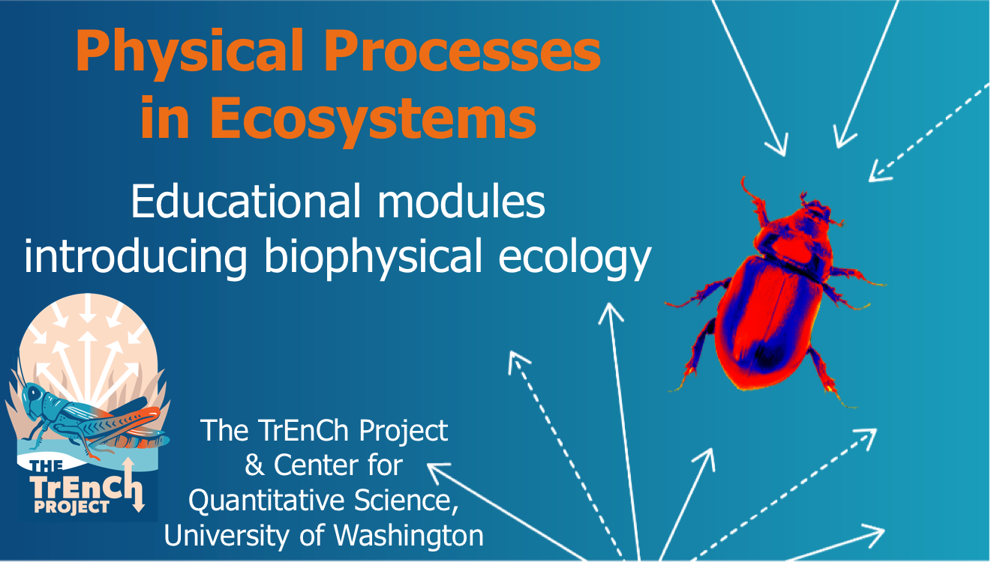

[Bookdown site](https://bookdown.org/huckley/Physical_Processes_In_Ecosystems/)

This series of educations modules was adapted from those developed for a course in Physical Processes in Terestrial and Aquatic Ecosystems that was initially taught in February 1979 by the [University of Washington Center for Quantitative Science in Forestry, Fisheries and Wildlife](https://quantitative.uw.edu/). Fourteen modules introduce how physical principles shape functioning of ecosystems and provide examples in using energy budgets to understand how organisms interact with their environment. Mike Kearney, University of Melbourne, contributed two modules examining biophysical ecology at landscape scales. The modules introduce concepts and provide practice implementing the concepts in the R language. 

### Developer notes:
Bookdown commands:
bookdown::publish_book(server="bookdown.org")
bookdown::render_book('index.Rmd', 'bookdown::pdf_book')
