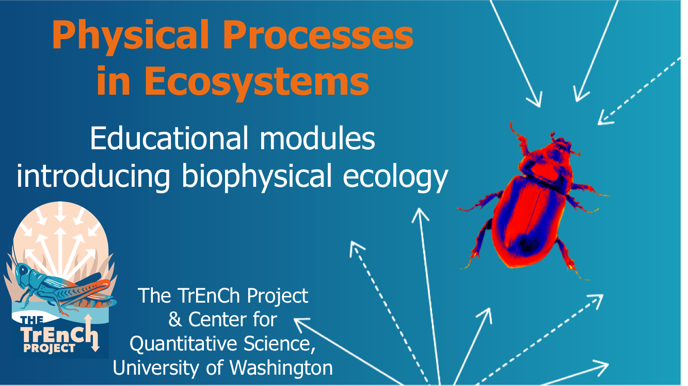

--- 
title: "Physical Processes in Ecosystems"
author: "University of Washington Center for Quantitative Science, Updated by the TrEnCh Project"
date: "`r Sys.Date()`"
site: bookdown::bookdown_site
output: bookdown::gitbook
documentclass: book
bibliography: [book.bib, packages.bib]
biblio-style: apalike
link-citations: yes
github-repo: rstudio/PhysicalProcessesEcosystems-bookdown
description: "These materials were designed to be used by life science students to learn how to apply physics to investigate the function of ecosystems."
---

# Foreward {-}

Species and ecosystems continue to respond to climate change in unexpected ways-- for example, shifting their distributions and abundances in directions opposite that expected. Such surprises highlight the need to translate our physical metrics of climates and climate change into how organisms are experiencing their environments. Differences in shape, coloration, and composition can lead two organisms to experience their shared environments very differently. Such differences shape patterns of thermal stress and the interactions of organisms.

The tools for achieving the translation have long lingered in books such as Gates' *Biophysical Ecology* and Campbell and Norman's *Environmental Biophysics*, but it is easy to loose sight of the goal of understanding how organisms experience their environment among the myriad of constants, variables, and equations. I launched the [**Tr**anslating **En**vironmental **Ch**ange (**TrEnCh**) Project](https://trenchproject.github.io) to build accessible computational and visualization tools for translating environmental change into organismal responses. Our [TrenchR package](https://github.com/trenchproject/TrenchR) encompasses the tools needed to build biophysical models, which apply physics and chemistry to understand the mechanisms by which organisms interact with their environment. The concept of balancing the exchange of energy and resources between organisms and their environment is simple but the implementation is much less so.  The potential complexity is evidenced by the many years that Warren Porter from the University of Wisconsin has dedicated to building increasingly complex biophysical models. While biophysical models have been influential in ecology and evolution, their implementation has been hindered by limited accessibility and documentation. This landscape is changing with the availability of computational tools that facilitate more open and reproducible science. In particular, Michael Kearney from the University of Melbourne has been working with Warren Porter to document and release biophysical models through the [NicheMapR](https://mrke.github.io/) package. The TrenchR package is complementary to NicheMapR in that its focus is on simple biophysical models that aid understanding and transparency.

As I began to develop tutorials for the TrenchR package, I stumbled on a series of instructional modules as grainy scans of typed pages stored in a government repository. I was surprised to find that some of the most accessible introductions I had seen to the field of biophysical ecology were from a course at my own university and that I had never heard of them.  The modules were from a course in Physical Processes in Terrestrial and Aquatic Ecosystems that was initially taught in February 1979 by the [University of Washington (UW) Center for Quantitative Science (CQS) in Forestry, Fisheries and Wildlife](https://quantitative.uw.edu/). The modules covered much of the material I was hoping to include in tutorials, so colleagues and I embarked on updating the modules with the support of the current CQS director, Tim Essington, and the author of many of the modules, RD "Swifty" Stevenson. Swifty authored the modules as a UW graduate student and is now a professor of Animal Physiology at the University of Massachusetts Boston. 

The modules were likely transformative at the time (shortly after the punched card era of programming) in that they introduced concepts and then provided practice implementing the concepts using programming. Needless to say, the text and examples have held up much better than the computer code, so our revisions have focused on updating the text and problems to use the R coding language, which is widely used in the life sciences. Much of the programming involves scripting examples, but we cover the availability of the modeling approaches in the TrenchR package. The modules are designed for mid-level undergraduate students with some familiarity with ecology but they assume only minimal familiarity with the R language. 

Some familiarity with differential calculus and algebra is helpful. Biophysics often involves quantifying rates of change of quantities of interest (e.g., energy, resources), rather than the quantities themselves. So derivatives and integrals are particularly relevant. We provide a primer aimed at reviewing the mathematics required for the ecological applications. The following books are helpful resources for reviewing the relevant math: Otto and Day, *A Biologist's Guide to Mathematical Modeling in Ecology and Evolution*; Claudia Neuhauser, *Calculus for Biology and Medicine*. 

We have only minimally updated the examples in the text.  We have added notes indicating recent bodies of research where possible. Many of the cited examples have become classics and the modules thus serve to introduce foundational ecological research.  We recommend locating recent studies that build upon the cited research as an extension exercise for the modules. A comprehensive source for recent research is the book *Thermal Adaptation* by Michael Angilletta.  The relevance of the introduced concepts has increased through recent decades as climate change transforms ecosystems. Considering the impact of climate change on the presented examples is an additional recommended exercise.

We intend (as did the original coordinators and authors) for the modules to provide an accessible introduction to biophysical approaches in ecology and evolution for life science students. Texts including Gates' *Biophysical Ecology* and Campbell and Norman's *Environmental Biophysics* are indispensable sources of additional detail and more complex approaches.  

The development of the modules was supported by a National Science Foundation Training Grant (No. GZ-2980). The course was coordinated by Ben Jayne from the University of Washington and David Gates from the University of Michigan served as an adviser. Graduate students and others contributed modules. The TrEnCh project and the update of the modules is supported by a National Science Foundation (NSF) Advances in Biological Informatics CAREER grant (DBI-1349865).

We thank Swifty Stevenson and Tim Essington for encouragement for and assistance with updating the modules. Thanks to all the authors who originally partnered with the CQS to author the modules. Thanks to the following individuals who assisted with the update: Bryan Briones Ortiz transferred the modules from PDF to R markdown and led the reformatting effort; Yutaro Sakairi also transferred and reformatted the modules and located figures; and Ray Huey and Joel Kingsolver offered advice and guidance. A particular thank you to Michael Kearney for his work disseminating NicheMapR and sharing three modules which we have added to the series.

-Lauren Buckley

Department of Biology and Center for Quantitative Science, 
University of Washington, Seattle, WA
